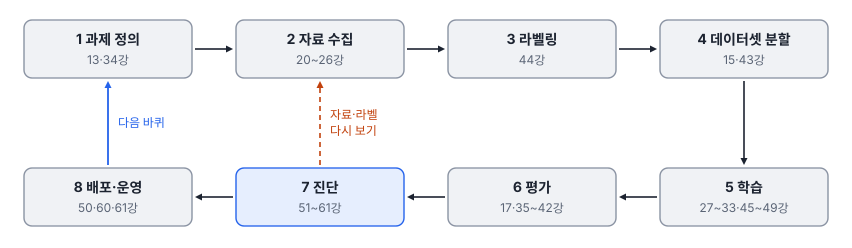
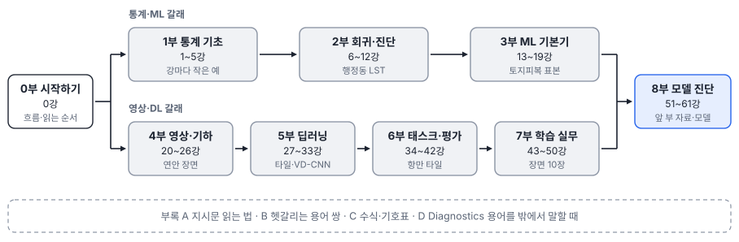

# 0강 비전 모델 개발 한 바퀴

## 이 강에서 얻는 것

- 비전 모델이 과제 정의부터 배포·운영까지 거치는 여덟 단계와, 단계마다 이 책의 어느 강이 다루는지 짚을 수 있음
- 이미지 분류·객체 탐지·의미/인스턴스/파놉틱 분할·변화탐지가 각각 어떤 산출물을 내는지 한 줄로 구분할 수 있음
- 목적에 맞는 읽기 경로를 고르고, 부마다 쓰는 공통 예제 자료와 강의 틀을 알고 읽기 시작할 수 있음

## 1. 개발 한 바퀴

**비전 모델(vision model)**은 영상을 받아 무엇이 어디에 있는지를 라벨·도형·숫자로 내놓는 모델임. 원격탐사·GIS 회사에서는 이 출력이 지도 레이어, 면적 표, 보고서 수치가 됨. 모델 하나가 만들어지는 흐름은 대략 여덟 단계임.

| 단계 | 하는 일 | 다루는 강 |
|---|---|---|
| 1 과제 정의 | 보고서에 쓸 값에서 거꾸로 태스크·클래스·합격 기준을 정함 | 13·34강 |
| 2 자료 수집 | 해상도·밴드·촬영 시기를 고르고 정합·좌표 변환·정사보정을 거침 | 20~26강 |
| 3 라벨링 | 정답 표시(**라벨**)를 그리고 가이드·검수로 품질을 관리함 | 44강 |
| 4 데이터셋 분할 | 학습·검증·시험 세트를 장면·지역 단위로 나눔 | 15·43강 |
| 5 학습 | 모델 구조를 고르고 증강·학습률·배치·전이학습을 조정함 | 27~33강, 45~49강 |
| 6 평가 | 시험 세트에서 지표(정확도·mAP·mIoU 등)를 잼 | 17강, 35~42강 |
| 7 진단 | 점수가 왜 그런지, 어디서 무너지는지 쪼개 보고 처방을 냄 | 51~61강 |
| 8 배포·운영 | 모델을 내보내 대량 영상에 **추론**(학습한 모델로 새 영상을 예측)하고, 결과를 폴리곤으로 바꿔 GIS로 넘기고, 배포 뒤 성능을 감시함 | 50·60·61강 |

1~3부의 통계·ML 기초는 한 단계가 아니라 여러 단계 밑에 깔림. 정확도 평가 표본 설계(3강)와 분류 성능 지표(17강)는 평가에, 공간 자기상관(5강)과 공간 교차검증(15강)은 데이터셋 분할에, 회귀진단(7·8강)은 진단에 그대로 이어짐.

## 2. 한 바퀴로 끝나지 않음

평가와 진단에서 문제가 나오면 앞 단계로 돌아가 다시 돎.

- **평가**는 "얼마나 잘하나"를 지표 몇 개로 답하고, **진단**은 "왜, 어디서 틀리나"를 답함. 시험 점수가 같아도 라벨 누락 때문인지, 특정 계절·해역에서만 무너지는지, 확신만 지나친지에 따라 고칠 곳이 다름
- 진단의 처방은 돌아갈 단계로 나뉨(51강). 자료·라벨 결함이면 2·3단계로(먼저 고치지 않으면 다른 조치가 헛됨), 손실·구조·증강을 바꿔야 하면 5단계로(재학습), 후처리·보정으로 되면 재학습 없이 배포 전에 고침
- 배포 뒤에도 새 지역·새 센서·새 계절 영상이 들어오면 성능이 변함. 운영 중 떠 둔 이상 입력이 진단을 거쳐 다음 바퀴의 과제 정의와 자료 수집으로 이어짐(61강)

신입이 흔히 가볍게 보는 곳은 2~4단계임. 같은 장면 8장, 같은 모델이라도 서로 겹치게 자른 타일을 무작위로 나누면 검증 타일 화소의 97%가 학습에도 들어가, 검증 0.939가 새 장면에서는 0.844로 떨어졌음(43강). 이런 부풀림은 학습 설정을 바꿔서는 바로잡히지 않음.

## 3. 태스크 여섯 가지

1단계에서 정하는 **태스크(task)**는 모델이 내놓는 출력의 꼴임. 같은 항만 영상도 무엇을 내놓게 하느냐에 따라 다른 태스크가 됨.

- **이미지 분류(image classification)**: 타일 한 장에 라벨 하나(또는 여럿). 타일 격자 토지피복도, 구름 낀 타일 거르기
- **객체 탐지(object detection)**: 객체마다 상자·클래스·점수. 선박·차량·시설물의 점 레이어와 개수
- **의미 분할(semantic segmentation)**: 화소마다 클래스. 토지피복도·수계 마스크 같은 래스터와 클래스별 총면적
- **인스턴스 분할(instance segmentation)**: 객체마다 마스크. 양식장·건물 하나하나의 폴리곤과 면적
- **파놉틱 분할(panoptic segmentation)**: 앞의 두 분할을 한 장에 합침. 바다·땅 같은 배경은 클래스만, 배·건물처럼 셀 수 있는 객체는 번호까지
- **변화탐지(change detection)**: 같은 곳을 두 시기에 찍은 영상에서 달라진 곳. 매립지·신축 건물의 변화 지도

출력 자료 구조, 대표 지표, 라벨 비용 비교와 다중 객체 추적은 34강에서 다룸. 여기서는 태스크가 1단계에서 정해지면 3단계(라벨을 상자로 딸지 마스크로 딸지)와 6단계(무엇으로 잴지)가 함께 정해진다는 점만 기억함.

## 4. 이 책을 읽는 순서

0부 다음은 두 갈래임. **통계·ML 갈래**(1부 통계 기초 → 2부 회귀분석과 회귀진단 → 3부 머신러닝 기본기)와 **영상·DL 갈래**(4부 영상과 기하 → 5부 딥러닝 → 6부 태스크와 평가 → 7부 학습 실무)는 어느 쪽부터 읽어도 됨. 갈래 안에서는 앞 강을 이어 쓰므로 순서대로 읽는 편이 편함. 두 갈래는 8부 모델 진단에서 합쳐짐. 8부는 2부에서 잔차를 쪼개 본 생각(51강)과 5~7부의 모델·지표를 함께 씀.

부록 네 개는 순서와 상관없이 필요할 때 펼침.

- **부록 A 지시문 읽는 법**: 실무 지시를 "무엇을 봤나 → 무엇을 의심하나 → 무엇을 하나"로 풀어 봄
- **부록 B 헷갈리는 용어 쌍 모음**: 강 끝의 헷갈리는 쌍을 한곳에 모음
- **부록 C 수식·기호표**: 강마다의 핵심 식과 기호 관례, 처음 나온 강
- **부록 D Diagnostics 용어를 밖에서 말할 때**: 8부에서 새로 정의한 용어를 외부에서 통하는 표현으로 바꿔 말하는 법

목적이 분명하면 지름길로 가도 됨.

| 상황 | 추천 경로 |
|---|---|
| 탐지 과제를 바로 받은 신입 | 20·25강(해상도·좌표) → 33·34강 → 35~39강 → 43~45강 → 50강. 모르는 말은 5부로 거슬러 감. 결과가 이상하면 52강 |
| 회귀진단을 아는 GIS 분석가 | 7·8강은 훑고 15강(공간 교차검증) → 4부 → 5부 → 34·38~40강(태스크와 지표) → 51강(회귀진단과 비전 진단의 대응표) → 8부 나머지 |
| 토지피복 분류·분할 담당 | 13~17강 → 20·21강 → 27~31·33강 → 34·40강 → 43·45·48강 |
| 모델을 학습해 본 개발자 | 51강부터. 지표가 낯설면 38~40강, 분할 방식이 의심되면 43강 |

## 5. 공통 예제 자료

부마다 가상 자료 하나를 여러 강이 이어 씀. 그래서 앞 강의 수치가 뒤 강에서 다시 나오고 서로 맞음. **모두 난수 시드를 고정해 만든 가상 자료이며 실제 지역·과제·기관의 값이 아님.** 아래는 한눈에 보기용 요약이고, 정확한 구성은 부마다 처음 소개하는 강에서 확인함.

| 부 | 공통 예제 자료 | 소개 |
|---|---|---|
| 1부 | 공통 자료 없이 강마다 작은 예(필지 NDVI 등) | - |
| 2부 | 가상 도시 행정동 80개의 여름철 지표면온도(LST)와 불투수면 비율·NDVI 등 | 6강 |
| 3부 | 가상 연안 Sentinel-2 영상의 토지피복 표본 픽셀 2,883개(조사 폴리곤 104개, 클래스 6개) | 13강 |
| 4부 | 가상 연안 장면 300×300 화소(10 m): 광학 6밴드에 SAR(레이더 영상)과 높이 자료(DTM·DSM)가 딸림 | 20강 |
| 5부 | 가상 Sentinel-2 32×32 화소 타일(4밴드, 클래스 6개)과 기본 모델 VD-CNN(작은 합성곱 신경망) | 27강 |
| 6부 | 가상 항만·연안 0.5 m 타일 24장(선박·소형선박·차량)과 가상 탐지기 | 34강 |
| 7부 | 가상 Sentinel-2 장면 10장(256×256 화소, 화소 라벨)과 5·6부 자료 | 43강 |
| 8부 | 새 자료 없이 앞 부의 자료·모델을 진단함 | 51강 |

## 6. 강의 틀과 이 책의 목표

모든 강은 같은 틀을 따름. **이 강에서 얻는 것**(학습 목표 셋) → 본문 → **현장에서는**(원격탐사 산출물·GIS 모델링 장면 하나) → **헷갈리는 쌍** → **이렇게 지시받음** → **요약** → **핵심 용어**(한글·영문 표) 순임. 다른 강은 "(15강)"처럼 강 번호로 가리킴.

이 책의 목표는 공식을 외우는 것이 아니라 **지시를 듣고 할 일을 아는 상태**임. "mAP50은 높은데 50-95가 낮아"라는 말을 듣고 상자 위치 정밀도를 의심하고 무엇을 확인할지 떠올리는 것이 그 예임(39강). 강마다 있는 "이렇게 지시받음"이 이 목표를 연습하는 자리이고, 부록 A가 그 가운데 자주 듣는 지시를 골라 한 틀로 다시 풀어 봄.

자습서는 앱의 문제 풀이와 독립임. 읽지 않아도 문제를 풀 수 있고, 풀지 않아도 읽을 수 있으며, 해금·진도 조건 없이 어느 강이든 바로 열림. 반복 풀이로 용어를 익히다 막히면 해당 강을 읽고, 읽다가 확인하고 싶으면 문제를 푸는 식으로 오가면 됨.

## 현장에서는

연안 양식장 시설을 위성 영상에서 찾아 해역별 시설 수와 면적을 내는 가상 과제를 한 바퀴 따라가 봄. 시설 수와 시설마다의 면적이 모두 필요하므로 태스크는 인스턴스 분할로 정함(1단계). 해역마다 촬영 시기가 다른 영상을 모으고(2단계), 시설 폴리곤을 그리고(3단계), 해역 단위로 학습·검증·시험을 나눔(4단계).

학습한 모델의 시험 점수(6단계)는 목표를 넘었는데, 진단(7단계)에서 물이 탁한 해역 영상에만 미탐(놓친 객체)이 몰린 것이 드러남. 학습 자료에 탁한 해역 영상이 거의 없던 것이 원인이라, 2단계로 돌아가 그런 장면을 보태고 라벨을 땀. 배포(8단계) 뒤에는 해역별 탐지 수를 분기마다 비교하고, 갑자기 줄거나 늘면 실제 변화인지 영상 조건 탓인지부터 확인함.

## 헷갈리는 쌍

- **평가 vs 진단**: 평가는 성능을 지표로 재는 것, 진단은 그 지표가 왜 그렇게 나왔는지 오차를 쪼개 고칠 곳을 찾는 것임. 평가만 하면 "나빠졌다"까지만 앎(51강).
- **검증 세트 vs 시험 세트**: 검증 세트는 학습 중 설정과 학습 횟수(에폭)를 고르는 데 쓰고, 시험 세트는 모든 선택이 끝난 뒤 한 번만 잼. 시험 점수를 보고 다시 고르면 시험 세트가 검증 세트가 됨(15·43강).
- **태스크 vs 모델**: 객체 탐지·의미 분할은 출력의 꼴(태스크)이고, YOLO·U-Net 같은 이름은 그 태스크를 푸는 모델 구조임(33강). 과제 정의에서는 태스크를 먼저 정하고 모델은 5단계에서 고름.

## 이렇게 지시받음

> 지시: "다음 달까지 선박 탐지 모델 하나 만들어 봐. 일정부터 짜 와."

학습 일정만 짜라는 뜻이 아님. 여덟 단계를 모두 넣고, 특히 자료 수집·라벨링·분할(2~4단계)과 평가·진단(6·7단계)에 시간을 잡고, 첫 바퀴 뒤 자료로 돌아갈 여유도 둠. 일정 전에 "보고서에 선박 수만 쓰나, 크기도 쓰나"를 먼저 물어 태스크와 라벨 형식(수평 상자·회전 상자)을 정함(34·41·44강).

> 지시: "검증 점수 잘 나왔다고 바로 넘기지 말고 시험 장면에서 한 번 재고, 진단까지 돌려 와."

검증 점수는 설정을 고르는 데 썼으므로 낙관적일 수 있음. 손대지 않은 시험 장면으로 한 번 재고(6단계), 오차 분해와 조건별 성능(슬라이스)으로 어디서 틀리는지 확인해 오라는 뜻임(7단계, 52·54강). 진단 결과에 따라 자료·라벨로 돌아갈지, 재학습할지, 후처리만 고칠지가 갈림.

> 지시: "변화 면적 보고해야 하니까 분류 따로 두 번 하지 말고 변화탐지로 가."

보고서에 쓸 값(변화 면적)에서 거꾸로 태스크를 고른 것임. 두 시기를 따로 분류해 비교하면 두 지도의 오차가 쌓여 거짓 변화가 늘어나므로(34강) 두 시기를 함께 보는 변화탐지로 정함. 그러면 두 영상의 정합(24·25강)과 두 시기 라벨이 2·3단계에 새로 들어옴.

## 요약

- 비전 모델 개발은 과제 정의 → 자료 수집 → 라벨링 → 데이터셋 분할 → 학습 → 평가 → 진단 → 배포·운영의 여덟 단계이고, 진단과 운영에서 나온 문제로 앞 단계를 다시 도는 순환임
- 평가는 얼마나 잘하는지, 진단은 왜·어디서 틀리는지를 답하며, 처방에 따라 자료·라벨, 재학습, 후처리 가운데 돌아갈 곳이 정해짐
- 태스크(이미지 분류·객체 탐지·의미/인스턴스/파놉틱 분할·변화탐지)는 보고서에 쓸 값에서 거꾸로 고르고, 라벨 형식과 지표가 함께 정해짐(자세히는 34강)
- 통계·ML 갈래(1~3부)와 영상·DL 갈래(4~7부)는 어느 쪽부터 읽어도 되고 8부에서 합쳐짐. 부록 A~D는 필요할 때 펼침
- 부마다 가상 공통 예제 자료를 이어 쓰고, 모든 강은 같은 틀로 "지시를 듣고 할 일을 아는 상태"를 목표로 함. 자습서는 앱 문제 풀이와 독립이며 해금 조건이 없음

## 핵심 용어

| 한글 | 영문 |
|---|---|
| 비전 모델 | Vision Model |
| 태스크 | Task |
| 이미지 분류 | Image Classification |
| 객체 탐지 | Object Detection |
| 의미 분할 | Semantic Segmentation |
| 인스턴스 분할 | Instance Segmentation |
| 파놉틱 분할 | Panoptic Segmentation |
| 변화탐지 | Change Detection |
| 라벨 / 라벨링 | Label / Labeling (Annotation) |
| 학습·검증·시험 세트 | Training / Validation / Test Set |
| 추론 | Inference |
| 진단 | Diagnostics |
| 배포 | Deployment |
