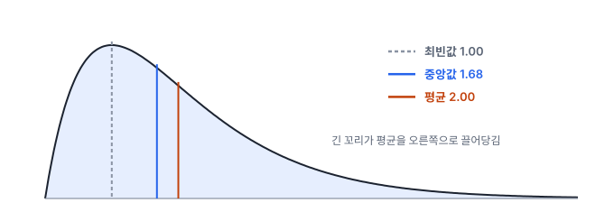
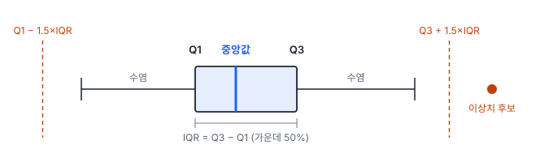

# 1강 요약통계와 이상치

## 이 강에서 얻는 것

- 값 묶음 하나를 **대표값·퍼짐·모양** 세 가지로 요약할 수 있음
- 이상치가 섞여도 흔들리지 않는 요약(로버스트 통계)을 골라 쓸 수 있음
- 이상치를 찾는 기준(IQR 울타리, 로버스트 z)을 계산하고, 찾은 뒤의 처리를 판단할 수 있음

## 1. 왜 요약하는가

원격탐사 2차 산출물은 대부분 픽셀 값 수백만 개로 이루어짐. 시군구별 식생지수(NDVI) 지도, 여름철 지표면온도(LST) 지도, 수치표고모델(DEM)이 그런 예임. 보고서나 의사결정에는 이 값을 전부 넘길 수 없어서, 구역마다 숫자 몇 개로 줄여서 씀.

GIS에서는 이 작업을 **구역 통계(zonal statistics)**라고 부름. 행정구역·필지 같은 폴리곤마다 그 안에 들어온 래스터(격자 모양의 픽셀 자료) 픽셀을 모아 평균·중앙값·표준편차 등을 계산하는 것임. 경계에 걸친 픽셀을 넣는 기준(픽셀 중심이 폴리곤 안에 있어야 하는지, 조금이라도 걸치면 넣는지)에 따라 결과가 달라지므로, 도구의 설정을 확인하고 보고서에 적어 둠. 요약의 축은 세 가지임.

- **대표값**: 값들이 대체로 어디에 모여 있는가
- **퍼짐**: 얼마나 흩어져 있는가
- **모양**: 한쪽으로 치우쳤는가, 극단값이 얼마나 자주 나오는가

## 2. 대표값: 평균, 중앙값, 최빈값

**평균(mean)**은 모든 값을 더해 개수로 나눈 값임.

$$\bar{x} = \frac{1}{n}\sum_{i=1}^{n} x_i$$

모든 값을 반영하는 대신, 극단값 하나에도 크게 끌려감.

**중앙값(median)**은 값을 크기순으로 세웠을 때 가운데 값임. 개수가 짝수면 가운데 두 값의 평균을 씀. 순서만 보기 때문에 극단값이 아무리 커도 거의 움직이지 않음.

**최빈값(mode)**은 가장 자주 나오는 값임. 토지피복도처럼 값이 범주(논·밭·산림·수계)일 때는 평균이나 중앙값이 의미가 없어서 최빈값을 씀. 필지의 대표 피복을 다수결로 정하는 것이 곧 최빈값임. 연속값에서는 구간을 나눈 히스토그램에서 가장 높은 구간을 봄.

예를 들어 한 필지에 들어온 NDVI 픽셀 9개가 다음과 같다고 함.

> 0.61, 0.63, 0.64, 0.65, 0.66, 0.67, 0.68, 0.70, −0.05

마지막 −0.05는 필지 경계를 지나는 수로가 섞인 **혼합 픽셀**(한 픽셀 안에 여러 피복이 섞여 값이 중간이나 엉뚱하게 나오는 픽셀)임. 나머지 8개만의 평균은 0.655인데, 이 픽셀 하나가 들어가면 평균은 $5.19 / 9 \approx 0.58$로 떨어짐. 중앙값은 크기순으로 다시 세웠을 때(−0.05가 맨 앞) 다섯 번째 값인 0.65로, 수로 픽셀이 있든 없든 거의 같음.

## 3. 퍼짐: 분산, 표준편차, IQR, MAD

**분산(variance)**은 평균에서 떨어진 거리를 제곱해 평균낸 값이고, **표준편차(standard deviation)**는 그 제곱근임. 제곱근을 취하면 원래 단위(℃, m 등)로 돌아와 해석이 쉬움.

$$s^2 = \frac{1}{n-1}\sum_{i=1}^{n}\left(x_i - \bar{x}\right)^2, \qquad s = \sqrt{s^2}$$

분모가 $n$이 아니라 $n-1$인 것은, 표본의 평균으로 모집단의 분산을 추정하면 조금 작게 나오는 치우침을 바로잡기 위함임(3강에서 다룸). 편차를 제곱하기 때문에 표준편차는 평균보다도 극단값에 더 민감함.

**사분위수(quartile)**는 크기순으로 세운 값을 네 등분하는 경계임. 아래 25% 지점이 Q1, 75% 지점이 Q3이고, 둘의 차이가 **사분위범위(IQR)**임.

$$\mathrm{IQR} = Q_3 - Q_1$$

IQR은 가운데 50% 값이 차지하는 폭이라, 양 끝의 극단값에 거의 영향을 받지 않음. 다만 사분위수 계산법이 소프트웨어마다 조금씩 달라서, 표본이 작으면 같은 데이터로도 값이 약간 다르게 나올 수 있음.

**중앙값 절대편차(MAD)**는 중앙값에서 떨어진 거리의 중앙값임.

$$\mathrm{MAD} = \operatorname{median}\left(\lvert x_i - \operatorname{median}(x) \rvert\right)$$

중앙값을 두 번 쓰기 때문에 극단값에 매우 강함. 데이터가 정규분포(2강에서 다루는 종 모양 분포)를 따르면 $1.4826 \times \mathrm{MAD}$가 표준편차의 추정값이 됨. 그래서 표준편차 대신 쓸 때는 이 배율을 곱함. 도구마다 배율을 자동으로 곱하는지가 다르므로 확인함. R의 `mad()`는 곱하고, scipy의 `median_abs_deviation`은 기본 설정에서 곱하지 않음.

앞의 필지 예로 계산하면 차이가 뚜렷함.

| 요약 | 수로 픽셀 포함 (9개) | 수로 픽셀 제외 (8개) |
|---|---|---|
| 평균 | 0.577 | 0.655 |
| 중앙값 | 0.65 | 0.655 |
| 표준편차 | 0.237 | 0.029 |
| MAD × 1.4826 | 0.030 | 0.030 |

픽셀 하나 때문에 표준편차는 여덟 배 넘게 커졌지만, MAD 기반 값은 그대로임.

## 4. 모양: 왜도와 첨도

**왜도(skewness)**는 분포가 좌우 어느 쪽으로 치우쳤는지를 나타냄. 오른쪽 꼬리가 길면 양의 왜도, 왼쪽 꼬리가 길면 음의 왜도임. 건물 높이, 강수량, 양식장 시설 면적처럼 0 아래로 내려갈 수 없고 가끔 큰 값이 나오는 양은 대개 오른쪽 꼬리가 김. 반대로 식생이 빽빽한 지역의 NDVI는 상한 근처에 몰리고 일부만 낮아서 왼쪽 꼬리가 길어지기 쉬움.

오른쪽 꼬리가 길면 대개 **최빈값 < 중앙값 < 평균** 순서가 됨. 꼬리의 큰 값들이 평균만 오른쪽으로 끌어당기기 때문임. 다만 항상 이 순서가 성립하는 것은 아니므로, 순서만 보고 왜도를 단정하지는 않음.

**첨도(kurtosis)**는 극단값이 얼마나 자주, 얼마나 멀리 나오는지, 즉 **꼬리의 두께**를 나타냄. 흔히 "봉우리가 얼마나 뾰족한가"로 설명하지만 정확한 뜻은 꼬리 쪽임. 정규분포의 첨도는 3이고, 여기서 3을 뺀 값을 **초과첨도**라고 부름. 소프트웨어마다 첨도와 초과첨도 중 어느 쪽을 내놓는지 다르므로 문서를 확인하는 것이 가장 확실함. pandas·scipy·Excel은 초과첨도를, MATLAB의 `kurtosis`는 첨도를 돌려줌. 값이 음수로 나오면 초과첨도임(첨도 자체는 1보다 작아질 수 없음). 첨도가 크면 이상치 처리 방식을 미리 정해 두어야 함.

## 5. 이상치 찾기

**이상치(outlier)**는 나머지 값들과 동떨어진 값임. 원인은 대체로 셋 중 하나임.

1. **측정·처리 오류**: 센서 오류, 구름 마스크 누락, 좌표 어긋남, 단위 변환 실수
2. **드물지만 실제인 현상**: 산불 지점의 높은 지표면온도, 새로 들어선 대형 건물
3. **다른 집단이 섞임**: 필지 안의 수로, 행정구역 안의 저수지

셋 중 무엇이냐에 따라 처리가 완전히 달라지므로, 기준으로 **후보**를 찾은 다음 원인을 확인하는 순서로 진행함.

**IQR 울타리(통계학자 튜키가 제안한 방식)**는 가장 널리 쓰는 기준임. 아래 식의 울타리 밖에 있는 값을 이상치 후보로 봄.

$$Q_1 - 1.5\,\mathrm{IQR} \quad\text{미만}, \qquad Q_3 + 1.5\,\mathrm{IQR} \quad\text{초과}$$

박스플롯이 바로 이 규칙을 그림으로 옮긴 것임.

**z점수**는 평균에서 표준편차 몇 개만큼 떨어졌는지를 봄.

$$z_i = \frac{x_i - \bar{x}}{s}$$

보통 $\lvert z \rvert > 3$이면 이상치로 봄. 그런데 평균과 표준편차는 이상치 쪽으로 끌려가서, 이상치가 실제보다 덜 튀어 보이게 됨. 필지 예에서 수로 픽셀의 z점수는 $(-0.05 - 0.577) / 0.237 \approx -2.65$라서 기준 3을 넘지 못함.

표본이 작으면 문제가 더 근본적임. 값이 $n$개일 때 z점수의 절댓값은 수학적으로 $(n-1)/\sqrt{n}$을 넘을 수 없음. $n = 9$이면 약 2.67이므로, 9개짜리 자료에서는 어떤 값도 기준 3에 걸리지 않음. 또 이상치가 여러 개면 서로의 z점수를 함께 낮춰 모두 빠져나가기도 하는데, 이를 **가림 효과(masking)**라고 부름.

**로버스트 z**는 평균 대신 중앙값, 표준편차 대신 MAD를 써서 이 문제를 피함.

$$z_i^{\text{robust}} = \frac{x_i - \operatorname{median}(x)}{1.4826 \times \mathrm{MAD}}$$

같은 수로 픽셀의 로버스트 z는 $(-0.05 - 0.65) / 0.0297 \approx -23.6$으로, 누가 봐도 이상치로 잡힘. 로버스트 z는 **수정 z점수(modified z-score)**라고도 부르며, 기준은 3 또는 3.5(이글레비치·호글린이 제안한 값)를 흔히 씀.

## 6. 찾은 뒤에는

- **지우기 전에 원인부터 확인함.** 오류면 제거하거나 마스킹하고, 실제 현상이면 남긴 채 따로 보고하고, 다른 집단이면 분리해서 따로 요약함. 산불 지점을 "이상치라서" 지우면 가장 중요한 정보를 버리는 셈임.
- **요약값을 짝으로 보고함.** 이상치가 섞일 수 있는 데이터는 평균·표준편차와 함께 중앙값·IQR을 같이 적음. 평균과 중앙값이 크게 다르면 그 자체가 점검 신호임.
- **무엇을 왜 뺐는지 기록함.** 몇 개를 어떤 기준으로 뺐는지 남기지 않으면 같은 결과를 다시 만들 수 없음.
- **탐지 결과 점검에도 그대로 씀.** 예를 들어 탐지 모델이 만든 양식장 폴리곤의 면적 분포에서 울타리를 크게 벗어난 폴리곤은, 인접 시설 여러 개가 하나로 합쳐진 오류일 가능성이 큼.

## 현장에서는

행정동별 여름철 지표면온도(Landsat 기반 LST)를 구역 통계로 요약해 보고하는 상황임. 대부분의 동은 평균 34℃ 안팎인데, 한 동만 평균 21.8℃로 나옴. 같은 동의 중앙값은 33.6℃임.

평균과 중앙값이 12℃ 가까이 벌어진 것이 신호임. 픽셀을 열어 보면 그 동의 약 4분의 1이 구름 마스크에서 빠진 구름 픽셀(영하 10℃대)이었음. 구름 픽셀이 차가운 쪽 이상치로 섞여 평균만 끌어내렸고, 중앙값은 거의 영향을 받지 않았음.

조치는 두 가지임. 구름 마스크를 다시 적용해 오류 픽셀을 걷어 내고, 보고 표에는 평균과 함께 중앙값·IQR·유효 픽셀 비율을 적어 같은 문제를 표만 보고도 알아챌 수 있게 함.

## 헷갈리는 쌍

- **표준편차 vs 표준오차**: 표준편차는 값들 자체가 퍼진 정도, 표준오차는 평균 같은 추정치가 표본마다 흔들리는 정도임. 표본이 커지면 표준오차는 줄지만 표준편차는 줄지 않음(3강).
- **중앙값 절대편차 vs 평균 절대편차**: 둘 다 MAD로 줄여 쓰는 경우가 있음. 로버스트 통계에서 말하는 MAD는 중앙값 절대편차이므로, 보고서에서는 풀어 쓰는 편이 안전함.
- **첨도 vs 뾰족함**: 첨도는 꼬리 두께의 지표임. 봉우리 모양만 보고 첨도를 판단하면 틀리기 쉬움.
- **이상치 vs 오류값**: 이상치는 "동떨어진 값"일 뿐임. 오류인지는 원인을 확인해야 알 수 있음.

## 이렇게 지시받음

> 지시: "필지별 NDVI는 평균 말고 중앙값으로 뽑아. 경계에 도로 픽셀 섞인 데가 많아."

필지 경계의 혼합 픽셀(도로·수로)이 낮은 쪽 이상치로 섞여 평균을 끌어내린다는 판단임. 구역 통계의 대표값을 중앙값으로 바꾸고, 폴리곤을 안쪽으로 한 픽셀만큼 줄여(음의 버퍼, Sentinel-2 10 m 밴드라면 −10 m) 경계 픽셀 자체를 덜 넣는 방법도 같이 검토함. 버퍼 거리를 미터로 주려면 좌표계가 미터 단위 투영 좌표계여야 하고, 작은 필지는 줄이고 나면 사라질 수 있으니 빈 폴리곤을 확인함.

> 지시: "LST 구역 통계에 IQR 울타리 밖 픽셀 비율도 동별로 붙여 줘."

이상치 비율을 품질 지표로 쓰겠다는 뜻임. 비율이 유난히 높은 동은 구름·그림자 마스크(분석에서 뺄 픽셀을 표시한 층) 누락이나 좌표 어긋남을 먼저 의심하고 원본 영상을 확인함.

> 지시: "DEM 튀는 값, 로버스트 z 3.5 넘는 건 마스킹하고 주변 값으로 채워."

수치표고모델의 스파이크(스테레오 영상 매칭 오류, 전선·크레인 같은 물체)를 로버스트 z 기준으로 걸러 내고, 주변 셀 값으로 빈 곳을 채우라는(보간) 뜻임. 전체 DEM이 아니라 일정 크기 창(예: 주변 몇 셀) 안에서 중앙값과 MAD를 계산해야 지형 기복 자체를 이상치로 오인하지 않음. 평탄지나 수면처럼 창 안 값이 모두 같으면 MAD가 0이 되어 나눗셈이 깨지므로, MAD의 최솟값을 정해 두거나 그 창은 건너뜀.

## 요약

- 요약은 대표값(평균·중앙값·최빈값), 퍼짐(표준편차·IQR·MAD), 모양(왜도·첨도) 세 축으로 함
- 평균과 표준편차는 극단값 하나에도 크게 흔들리고, 중앙값·IQR·MAD는 거의 흔들리지 않음
- 첨도는 봉우리의 뾰족함이 아니라 꼬리의 두께이고, 소프트웨어에 따라 초과첨도(정규분포 = 0)로 나옴
- 이상치 후보는 IQR 울타리나 로버스트 z로 찾음. 일반 z점수는 평균·표준편차가 이상치에 끌려가 이상치를 놓치기 쉽고, 표본이 작으면 기준 3을 넘을 수조차 없음
- 이상치는 원인(오류·실제 현상·다른 집단)을 확인한 뒤 처리하고, 무엇을 왜 뺐는지 기록함

## 핵심 용어

| 한글 | 영문 |
|---|---|
| 평균 | Mean |
| 중앙값 | Median |
| 최빈값 | Mode |
| 분산 / 표준편차 | Variance / Standard Deviation |
| 사분위수 / 사분위범위 | Quartile / Interquartile Range (IQR) |
| 중앙값 절대편차 | Median Absolute Deviation (MAD) |
| 왜도 | Skewness |
| 첨도 / 초과첨도 | Kurtosis / Excess Kurtosis |
| 이상치 | Outlier |
| 로버스트 통계 | Robust Statistics |
| 구역 통계 | Zonal Statistics |
| 박스플롯 | Box Plot |
