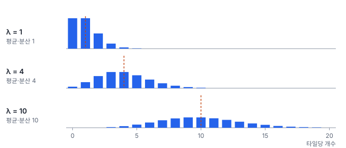
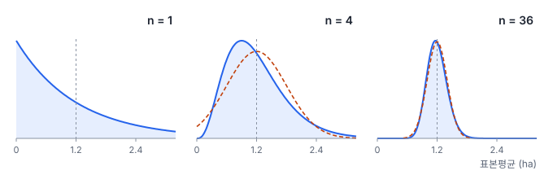

# 2강 확률분포

## 이 강에서 얻는 것

- 세는 값(개수)과 재는 값(길이·온도·반사율)을 구분하고, 각각에 맞는 분포(이항·포아송·정규·균등)를 고를 수 있음
- 기댓값과 독립의 뜻을 알고, 독립 가정이 깨졌을 때 무엇이 틀어지는지 설명할 수 있음
- 중심극한정리가 무엇을 보장하고 무엇을 보장하지 않는지 구분할 수 있음

## 1. 확률변수와 확률분포

1강에서는 이미 손에 쥔 값들을 요약했음. 이번 강은 한 걸음 물러나, 그 값들이 **어떤 규칙으로 나왔다고 볼 수 있는지**를 다룸. 이 규칙을 알면 "이번 결과가 우연히 나올 만한 값인가"를 따질 수 있음.

**확률변수(random variable)**는 관측할 때마다 값이 달라지는 양임. 영상 타일 하나에서 탐지된 선박 수, 검증점 100개 중 틀린 개수, DEM 한 셀의 표고 오차가 모두 확률변수임. **확률분포(probability distribution)**는 확률변수가 어떤 값을 얼마나 자주 갖는지를 정리한 것임.

확률변수는 크게 두 종류임.

- **셀 수 있는 것(이산형)**: 0, 1, 2, …처럼 값이 띄엄띄엄 있음. 값마다 확률을 하나씩 붙일 수 있고, 이를 **확률질량함수(PMF)**라고 부름
- **잴 수 있는 것(연속형)**: 표고 오차 0.137 m처럼 구간 안의 어떤 값이든 나올 수 있음. 딱 한 값의 확률은 0이라서, 대신 **확률밀도함수(PDF)** 곡선을 그리고 **곡선 아래 구간의 넓이**를 확률로 읽음

## 2. 기댓값과 독립

**기댓값(expected value)**은 가능한 값에 각각의 확률을 곱해 더한 값임. 같은 관측을 끝없이 되풀이했을 때의 장기 평균이라고 생각하면 됨. 연속형은 합 대신 적분을 씀.

$$E[X] = \sum_x x \, P(X = x)$$

예를 들어 연안 해역 타일 하나에서 탐지되는 부표 수가 0개 30%, 1개 40%, 2개 20%, 3개 10%라면 기댓값은 $0 \times 0.3 + 1 \times 0.4 + 2 \times 0.2 + 3 \times 0.1 = 1.1$개임. 1.1개짜리 타일은 없지만, 타일 1,000장을 보면 부표가 1,100개쯤 나온다는 뜻임. 1강의 평균이 **이미 얻은 표본**의 값이라면, 기댓값은 **분포 자체**의 평균임.

**독립(statistical independence)**은 한 사건이 일어났는지가 다른 사건의 확률을 바꾸지 않는 관계임. 두 사건 A, B가 독립이면 둘 다 일어날 확률은 각 확률의 곱임.

$$P(A \cap B) = P(A)\,P(B)$$

어느 지역에서 촬영일에 구름이 낄 확률이 0.3이라고 함. 두 촬영일이 독립이면 둘 다 구름일 확률은 $0.3 \times 0.3 = 0.09$임. 그러나 장마철 연달아 찍은 두 날은 날씨가 이어지므로 독립이 아니고, 실제 확률은 0.09보다 큼. 독립을 잘못 가정하면 "둘 중 하나는 맑겠지"라는 계획이 틀어짐.

두 성질을 구분해 둘 것이 있음. 기댓값은 독립이든 아니든 더해짐($E[X+Y] = E[X] + E[Y]$). 반면 **분산(1강)이 그대로 더해지려면 독립이어야** 함($\mathrm{Var}(X+Y) = \mathrm{Var}(X) + \mathrm{Var}(Y)$. 정확히는 서로 상관만 없으면 되며, 상관은 5강에서 다룸). 부표 50개를 각각 0.9 확률로 탐지하면 기대 탐지 수는 45개로 늘 같지만, 탐지 수가 45개 근처에 얼마나 모이는지는 독립일 때만 부표 하나의 분산 $0.9 \times 0.1$을 50번 더해 계산할 수 있음(표준편차 약 2.1개). 이웃한 부표를 같은 파도·반사광이 한꺼번에 가리면 결과가 함께 흔들려 퍼짐이 더 커짐.

## 3. 셀 수 있는 것: 이항분포와 포아송 분포

**이항분포(binomial distribution)**는 성공 확률이 $p$인 독립 시행을 $n$번 했을 때 성공 횟수의 분포임. 정해진 횟수 중 몇 번인지를 세므로 값은 0부터 $n$까지임.

$$P(X = k) = \binom{n}{k} p^k (1-p)^{n-k}, \qquad E[X] = np, \quad \mathrm{Var}(X) = np(1-p)$$

$\binom{n}{k}$는 $n$번 중 성공할 $k$번을 고르는 경우의 수이고, 뒤의 곱은 그중 한 가지 순서가 나올 확률임. 전체 정확도가 90%인 토지피복도에서 검증점 100개를 뽑으면, 오분류 개수는 $n = 100$, $p = 0.1$인 이항분포를 따름. 평균 10개, 표준편차 $\sqrt{100 \times 0.1 \times 0.9} = 3$개임. 오분류가 16개 이상 나올 확률은 약 4%이므로, 16개가 나왔다면 "정말 90%인가"를 의심할 만함(이 판단을 체계화한 것이 검정이며 4강에서 다룸). 단, 검증점끼리 독립이어야 이 계산이 맞음. 한 필지에 여러 점이 몰리면 함께 맞거나 함께 틀려서 독립이 깨짐.

**포아송 분포(Poisson distribution)**는 일정한 면적·시간 안에서 서로 독립적으로, 일정한 평균 비율 $\lambda$로 일어나는 사건의 개수 분포임. 이항분포와 달리 정해진 시행 횟수(상한)가 없음.

$$P(X = k) = \frac{\lambda^k e^{-\lambda}}{k!}, \qquad E[X] = \mathrm{Var}(X) = \lambda$$

타일을 아주 잘게 쪼개 칸마다 선박이 있을 확률이 매우 작다고 보면, 칸 수가 한없이 많아질 때의 이항분포가 곧 포아송 분포임. 외해 타일당 평균 2척이 탐지된다면($\lambda = 2$) 0척일 확률은 $e^{-2} \approx 0.135$, 5척 이상은 약 5.3%, 8척 이상은 약 0.11%임. 8척이 나온 타일은 실제 선단일 수도 있지만, 파도나 부표를 선박으로 잘못 잡은 오탐부터 확인할 만함.

포아송 분포의 가장 쓸모 있는 성질은 **평균과 분산이 같다**는 점임. 실제 개수 자료에서 분산이 평균보다 훨씬 크면 이를 **과산포(overdispersion)**라고 부르고, 평균 비율 $\lambda$가 곳마다 다르거나 사건이 서로 끌어당기듯 몰려 일어난다는 신호로 읽음. 항만·어장 근처에 선박이 몰리는 것이 전형적인 예임.

## 4. 잴 수 있는 것: 정규분포와 균등분포

**정규분포(normal distribution)**는 평균 $\mu$와 표준편차 $\sigma$로 정해지는 좌우 대칭 종 모양의 연속분포임. 1강에서 예고한 그 분포임. 작은 오차가 여럿 더해져 생기는 양, 예를 들어 센서 잡음이나 기준점 대비 DEM 표고 오차가 대략 이 모양을 띰.

$$f(x) = \frac{1}{\sigma\sqrt{2\pi}} \exp\!\left(-\frac{(x-\mu)^2}{2\sigma^2}\right)$$

식은 외울 필요 없음. 평균에서 멀어질수록 밀도가 빠르게 줄어든다는 것만 보면 됨. 실무에서 기억할 것은 넓이의 비율임.

| 구간 | 들어가는 비율 |
|---|---|
| $\mu \pm 1\sigma$ | 약 68.3% |
| $\mu \pm 1.96\sigma$ | 95% |
| $\mu \pm 2\sigma$ | 약 95.4% |
| $\mu \pm 3\sigma$ | 약 99.7% |

평균 오차가 0이고 표준편차가 0.5 m인 DEM이라면, 셀의 약 95%가 ±1 m 안에 들어옴. 1강의 z점수는 값을 평균 0, 표준편차 1의 눈금으로 옮길 뿐 분포 모양은 바꾸지 않음. 자료가 정규분포를 따를 때에만 z점수가 $\mu = 0$, $\sigma = 1$인 **표준정규분포**를 대략 따르고, "$\lvert z \rvert > 3$은 드물다"는 기준도 이 경우의 99.7%에서 나옴. 다만 0 아래로 내려갈 수 없고 오른쪽 꼬리가 긴 양(면적, 강수량)이나 1강에서 본 두꺼운 꼬리를 가진 자료에 정규분포를 그대로 대면 극단값의 빈도를 과소평가함.

**균등분포(uniform distribution)**는 구간 $[a, b]$ 안의 모든 값이 같은 밀도($1/(b-a)$)를 갖는 분포임.

$$E[X] = \frac{a+b}{2}, \qquad \mathrm{Var}(X) = \frac{(b-a)^2}{12}$$

정확도 평가용 검증점을 구역 안에 무작위로 뿌릴 때 좌표를 균등분포에서 뽑음. 또 연속값을 정수 DN(디지털 수치)으로 반올림할 때 생기는 오차는 대개 −0.5~0.5 사이 균등분포로 보며(값이 여러 DN에 걸쳐 변할 때 잘 맞는 가정임), 표준편차는 $\sqrt{1/12} \approx 0.29$ DN임.

## 5. 중심극한정리

**중심극한정리(central limit theorem, CLT)**는 서로 독립이고 같은 분포에서 뽑은 값 $n$개의 평균이, $n$이 충분히 크면 원래 분포 모양과 관계없이 정규분포에 가까워진다는 정리임. 그 정규분포의 평균은 원래 평균 $\mu$, 표준편차는 다음과 같음.

$$\sigma_{\bar{x}} = \frac{\sigma}{\sqrt{n}}$$

값 $n$개를 평균내면 퍼짐이 $\sqrt{n}$분의 1로 줄어든다는 뜻임. 이 줄어듦은 2절에서 본 "독립이면 분산이 더해짐"에서 나오므로, 독립이 깨지면 성립하지 않음.

탐지된 양식장 폴리곤 면적이 평균 1.2 ha, 표준편차 1.2 ha인 지수분포(작은 값이 가장 흔하고 큰 값으로 갈수록 드물어지는 분포)를 따른다고 함. 폴리곤 하나의 면적은 심하게 치우쳐 있어서 0.8~1.6 ha에 들어갈 확률이 25%뿐임. 그런데 무작위로 36개를 골라 평균을 내면, 그 평균은 표준편차 $1.2 / \sqrt{36} = 0.2$ ha인 종 모양에 가까워짐. 평균이 0.8~1.6 ha(±2 표준편차)에 들어갈 확률은 정확히 계산하면 95.6%로, 정규분포로 근사한 95.4%와 거의 같음.

주의할 점이 세 가지 있음.

- **데이터가 정규분포가 되는 것이 아님.** 폴리곤 1만 개를 모아도 면적 분포는 여전히 치우쳐 있음. 정규분포에 가까워지는 것은 **평균의 분포**임
- **"$n \ge 30$이면 충분"은 경험칙일 뿐임.** 원래 분포가 많이 치우칠수록 더 큰 $n$이 필요함. 위 예에서도 $n = 36$의 평균이 1.6 ha를 넘을 확률은 3.1%, 0.8 ha 미만은 1.3%로 아직 좌우가 조금 다름
- **독립이 전제임.** 이웃한 픽셀은 값이 서로 닮아서(공간 자기상관, 5강에서 다룸) 독립이 아님. 픽셀 1만 개의 구역 평균 NDVI는 $\sigma / \sqrt{10000}$보다 훨씬 크게 흔들림

평균이 표본마다 얼마나 흔들리는지를 나타내는 $\sigma / \sqrt{n}$은 표준오차이며, 이것으로 신뢰구간을 만드는 방법은 3강에서 다룸.

## 현장에서는

위성영상 선박 탐지 결과를 1 km 타일로 나누어 개수를 셈. 타일당 평균은 1.8척인데 분산은 7.5로, 평균의 네 배가 넘음. 포아송 분포라면 둘이 비슷해야 하므로 과산포임.

지도를 열어 보면 항만 입구와 어장 타일에 선박이 몰려 있고, 나머지 외해 타일은 대부분 0~2척임. 전체를 $\lambda = 1.8$인 포아송 분포 하나로 보고 "5척 이상이면 이상 타일"이라는 규칙을 만들면, 항만 타일이 매번 경보를 울림.

조치는 해역을 항만·어장·외해로 나누어 각각 평균과 분산을 다시 보는 것임. 나눈 뒤 각 해역에서 분산이 평균에 가까워지면 해역별 $\lambda$로 경보 기준을 정함. 여전히 분산이 크면 포아송 대신 과산포를 허용하는 분포(음이항분포 등)를 검토함.

## 헷갈리는 쌍

- **확률질량 vs 확률밀도**: 확률질량은 그 값 자체의 확률이라 1을 넘지 않음. 확률밀도는 넓이를 내야 확률이 되며, 값 자체는 1을 넘을 수 있음(5절 예에서 $n = 36$ 표본평균 분포의 밀도 꼭대기는 1 ha당 약 2.0).
- **이항분포 vs 포아송 분포**: 이항은 정해진 $n$번 중 몇 번(상한 $n$, 분산 $np(1-p)$가 평균보다 작음), 포아송은 상한 없이 일정 범위 안에서 몇 번(분산 = 평균).
- **중심극한정리 vs "데이터가 많으면 정규분포가 됨"**: 정규분포에 가까워지는 것은 표본평균의 분포이고, 데이터 자체의 분포는 그대로임.
- **기댓값 vs 평균**: 기댓값은 분포가 정하는 이론값, 평균은 손에 쥔 표본에서 계산한 값임.

## 이렇게 지시받음

> 지시: "타일별 탐지 개수, 포아송인지부터 봐. 평균이랑 분산 같이 뽑아."

개수 자료가 독립적으로 흩어졌는지 확인하라는 뜻임. 분산 ÷ 평균이 1 근처면 포아송으로 다뤄도 되고, 1보다 훨씬 크면 몰림(과산포)이 있으므로 해역·지형별로 나눠 다시 봄. 1보다 훨씬 작으면 오히려 너무 고르게 퍼진 것임. 대상이 실제로 일정 간격으로 놓인 것(양식 시설 등)이 아니라면, 가까운 객체를 하나로 합쳐 버리는 후처리(지나친 중복 제거 등)나 타일당 탐지 개수 상한에 걸렸는지를 의심함.

> 지시: "DEM 오차는 정규로 보고 95% 구간 ±1.96σ로 적어 줘."

오차가 평균 0인 정규분포라고 가정하고 $1.96\sigma$를 95% 오차 범위로 보고하라는 뜻임. 먼저 오차 평균이 0에서 떨어져 있지 않은지(한쪽으로 치우친 오차)와, 히스토그램 꼬리가 두꺼운지(1강의 첨도)를 확인함. 꼬리가 두꺼우면 소수의 큰 오차가 $\sigma$를 부풀려 $1.96\sigma$가 실제 95% 범위와 어긋나므로(넓게도 좁게도 나올 수 있음), 오차 절댓값의 95번째 백분위수를 함께 적음.

> 지시: "검증점은 구역 안에 균등하게 무작위로 뿌려. 경위도 말고 투영 좌표로."

구역 안 어느 곳이든 같은 확률로 뽑히게 하라는 뜻임. 경계 사각형 안에서 $x$, $y$를 균등분포로 뽑고 폴리곤 밖이면 버리는 방식이 가장 단순함. 넓은 지역에서 경도·위도를 균등하게 뽑으면 고위도 쪽 면적당 점이 많아지므로, 면적이 보존되는 투영 좌표에서 뽑음(좁은 구역이면 UTM·TM 좌표도 면적 왜곡이 작아 충분함). 점끼리 너무 가까우면 독립이 깨지므로 최소 간격을 두는 것도 검토함.

## 요약

- 셀 수 있는 값은 확률질량으로, 잴 수 있는 값은 확률밀도 곡선 아래 넓이로 확률을 읽음
- 이항분포는 정해진 $n$번 중 성공 횟수(평균 $np$), 포아송 분포는 상한 없는 사건 개수(평균 = 분산 = $\lambda$)이며, 분산이 평균보다 훨씬 크면 과산포(몰림)임
- 정규분포는 $\mu \pm 1.96\sigma$에 95%가 들어가는 종 모양, 균등분포는 구간 안 모든 값이 같은 밀도임
- 기댓값은 분포의 장기 평균이며 늘 더해지지만, 분산이 그대로 더해지려면 독립이어야 함
- 중심극한정리는 독립인 값들의 평균이 종 모양(표준편차 $\sigma / \sqrt{n}$)에 가까워진다는 것이며, 데이터 자체가 정규분포가 되는 것은 아님

## 핵심 용어

| 한글 | 영문 |
|---|---|
| 확률변수 | Random Variable |
| 확률분포 | Probability Distribution |
| 확률질량함수 / 확률밀도함수 | Probability Mass Function (PMF) / Probability Density Function (PDF) |
| 기댓값 | Expected Value, $E[X]$ |
| 독립 | Statistical Independence |
| 이항분포 | Binomial Distribution |
| 포아송 분포 | Poisson Distribution |
| 과산포 | Overdispersion |
| 정규분포 / 표준정규분포 | Normal Distribution / Standard Normal Distribution |
| 균등분포 | Uniform Distribution |
| 중심극한정리 | Central Limit Theorem (CLT) |
