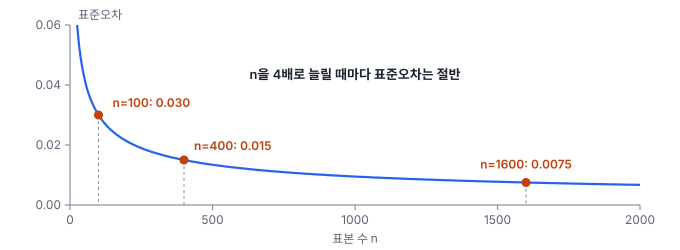
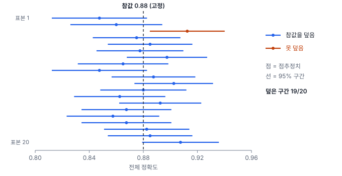

# 3강 표본에서 모집단으로

## 이 강에서 얻는 것

- 모집단·표본·모수를 구분하고, 표본오차와 표준오차가 무엇인지 설명할 수 있음
- 점추정치에 신뢰구간을 붙이고, 그 구간을 바르게 해석할 수 있음
- 공식이 없는 지표는 부트스트랩으로 구간을 구하고, 정확도 평가용 표본을 몇 개·어떻게 뽑을지 정할 수 있음

## 1. 모집단, 표본, 표본오차

새로 만든 토지피복도가 얼마나 맞는지 알고 싶다고 함. 알고 싶은 대상은 지도의 **모든 픽셀**이 맞게 분류되었는가임. 이렇게 알고 싶은 대상 전체를 **모집단(population)**이라고 부르고, 모집단의 특성값(여기서는 전체 픽셀 중 맞게 분류된 비율)을 **모수(parameter)**라고 부름.

수억 개 픽셀을 전부 확인할 수는 없으므로, 일부 지점(검증 표본점)을 뽑아 고해상도 영상이나 현장조사로 정답을 확인함. 이렇게 뽑은 일부가 **표본(sample)**이고, 표본에서 계산한 값이 **통계량(statistic)**임. 모집단을 "전국 지도"로 잡았다면 표본도 전국에서 뽑아야 함.

표본으로 모수를 하나의 값으로 어림하는 것을 **점추정(point estimation)**이라고 함. "검증점 400개 중 352개가 맞았으니 전체 정확도는 0.88"이 점추정임. 그런데 검증점을 새로 400개 뽑으면 0.87이나 0.90이 나올 수 있음. 이처럼 모집단 전체가 아니라 일부만 봤기 때문에 생기는 통계량과 모수 사이의 우연한 차이를 **표본오차(sampling error)**라고 부름.

표본오차는 **편향(bias)**과 구분해야 함. 편향은 뽑는 방식 자체가 한쪽으로 치우쳐 생기는 차이임. 예를 들어 접근하기 쉬운 도로변에서만 검증점을 찍으면 정확도가 한쪽으로 치우쳐 나옴. 표본오차는 표본을 늘리면 줄지만, 편향은 표본을 아무리 늘려도 줄지 않음.

## 2. 표준오차: 추정치가 흔들리는 폭

표본오차의 크기는 "표본을 계속 새로 뽑으면 추정치가 얼마나 흔들리는가"로 나타냄. 추정치가 표본마다 달라지며 이루는 분포를 **표본분포(sampling distribution)**라고 하고, 이 분포의 표준편차를 **표준오차(standard error, SE)**라고 부름.

2강의 중심극한정리에 따르면, 표본이 충분히 크면 표본평균은 원래 값의 분포 모양과 상관없이 정규분포에 가까운 분포를 따르고, 그 퍼짐은 원래 값의 표준편차 $\sigma$를 $\sqrt{n}$으로 나눈 만큼임. 모집단의 $\sigma$는 보통 모르므로 표본 표준편차 $s$로 대신해, 평균과 비율의 표준오차를 다음과 같이 계산함.

$$\mathrm{SE}(\bar{x}) = \frac{s}{\sqrt{n}}, \qquad \mathrm{SE}(\hat{p}) = \sqrt{\frac{\hat{p}\,(1-\hat{p})}{n}}$$

$s$는 표본 표준편차, $n$은 표본 수, $\hat{p}$은 표본에서 구한 비율임. 말로 풀면, 값들이 많이 흩어져 있을수록 추정치도 많이 흔들리고, 표본이 많을수록 덜 흔들린다는 뜻임.

1강에서 예고한 **표준편차와 표준오차의 차이**가 바로 이것임. 어느 구역의 NDVI 픽셀 표준편차가 0.12라고 함. 픽셀 100개로 평균을 내면 평균의 표준오차는 $0.12/\sqrt{100} = 0.012$이고, 10,000개로 내면 0.0012임. 표준편차(값들 자체가 퍼진 정도)는 픽셀을 더 모아도 0.12 근처에 머물지만, 표준오차(평균이 흔들리는 정도)는 계속 줄어듦.

분모가 $\sqrt{n}$이라서 표준오차를 절반으로 줄이려면 표본을 두 배가 아니라 **네 배**로 늘려야 함.

**분산의 분모가 n−1인 이유.** 1강의 표본분산 식은 편차 제곱합을 $n$이 아니라 $n-1$로 나눴음. 편차를 모평균(모집단의 참 평균)이 아니라 표본평균에서 재기 때문임. 표본평균은 그 표본에 가장 가깝게 맞춰진 값이라서, 표본평균에서 잰 편차 제곱합은 모평균에서 잰 것보다 항상 작거나 같음. 또 표본평균에서 잰 편차 $n$개는 합이 0이어야 하므로, $n-1$개가 정해지면 나머지 하나는 자동으로 정해짐. 자유롭게 움직이는 편차가 $n-1$개라는 뜻에서 이를 **자유도(degrees of freedom)**라고 부름.

$n$으로 나누면 분산이 평균적으로 $(n-1)/n$배만큼 작게 나옴. 표준정규분포에서 5개씩 뽑는 모의실험을 20만 번 반복하면, $n$으로 나눈 분산의 평균은 약 0.80, $n-1$로 나눈 분산의 평균은 약 1.00(참값)임. 평균적으로 참값을 맞히는 추정량을 **불편추정량(unbiased estimator)**이라고 함. 다만 제곱근을 씌운 $s$는 여전히 조금 작게 나오는데(같은 실험에서 약 0.94), 표본이 수십 개를 넘으면 무시할 만함.

## 3. 신뢰구간과 그 해석

점추정치 하나로는 얼마나 믿을지 알 수 없으므로 표준오차로 폭을 붙임. 이것이 **신뢰구간(confidence interval, CI)**임. 표본분포가 정규분포에 가까우면 95% 신뢰구간은 다음과 같음.

$$\hat{\theta} \pm 1.96 \times \mathrm{SE}$$

$\hat{\theta}$는 점추정치이고, 1.96은 표준정규분포에서 가운데 95%를 감싸는 경계값임(2강). 앞의 토지피복도 예에 넣으면 다음과 같음.

$$\mathrm{SE} = \sqrt{\frac{0.88 \times 0.12}{400}} \approx 0.0162, \qquad 0.88 \pm 1.96 \times 0.0162 = [0.848,\ 0.912]$$

보고서에는 "전체 정확도 0.88 (95% CI 0.848~0.912, 검증점 400개)"처럼 표본 수와 함께 적음. 신뢰수준(구간을 만들 때 정한 비율)을 99%로 올리면 경계값이 2.576으로 커져 구간이 [0.838, 0.922]로 넓어짐.

**해석이 가장 자주 틀리는 부분임.** "참 정확도가 이 구간 안에 있을 확률이 95%"라고 말하면 틀림. 참 정확도는 이미 정해진 하나의 숫자이고, 흔들리는 쪽은 표본에 따라 달라지는 구간임. 올바른 해석은 "같은 방식으로 표본을 뽑아 구간을 만드는 일을 여러 번 반복하면, 그렇게 만든 구간의 약 95%가 참값을 덮음"임. 이미 만든 구간 하나는 참값을 덮었거나 못 덮었거나 둘 중 하나이고, 어느 쪽인지는 알 수 없음.

정규분포 근사가 안 맞는 경우도 있음.

- **비율이 0이나 1에 가깝고 표본이 적을 때**: 수계 클래스 검증점 50개 중 49개가 맞으면 0.98이고, 위 식으로는 [0.941, 1.019]가 되어 1을 넘는 말이 안 되는 구간이 나옴. 이럴 때는 **윌슨 구간(Wilson interval)** 같은 다른 계산법을 씀. 같은 자료로 윌슨 구간은 [0.895, 0.996]임.
- **평균의 구간인데 표본이 수십 개 이하일 때**: 1.96 대신 조금 더 큰 t분포의 값을 씀(표본 10개면 2.262). t분포는 4강에서 다룸.

## 4. 부트스트랩: 공식이 없을 때

mAP(탐지 모델의 대표 성능 지표, 39강), F1(17강), 중앙값, 탐지 폴리곤으로 집계한 면적처럼 표준오차 공식이 없거나 복잡한 지표도 많음. 이럴 때 **부트스트랩(bootstrap)**을 씀.

모집단에서 표본을 다시 뽑을 수는 없으니, **가진 표본을 모집단 대신으로 삼아 다시 뽑기를 흉내 냄**.

1. 가진 표본 $n$개에서 **복원추출**(하나 뽑고 다시 넣은 뒤 또 뽑는 방식)로 $n$개를 뽑아 재표본을 만듦. 같은 항목이 여러 번 뽑히거나 빠지기도 함
2. 재표본으로 지표를 다시 계산함
3. 1~2를 $B$번(보통 1,000~10,000번) 반복함
4. $B$개 지표값의 표준편차가 표준오차이고, 크기순으로 세워 2.5%·97.5% 지점을 잘라 낸 것이 95% 신뢰구간임(백분위수 방법)

공식이 있는 경우로 확인해 봄. 앞의 검증점 400개(맞음 352, 틀림 48)를 2,000번 부트스트랩하면 표준오차가 약 0.0163, 구간이 약 [0.848, 0.910]으로 공식 결과(0.0162, [0.848, 0.912])와 거의 같음. 난수에 따라 셋째 자리는 조금 달라짐.

가장 중요한 결정은 **무엇을 단위로 재추출하는가**이고, 서로 독립으로 볼 수 있는 단위여야 함. mAP라면 박스 하나하나가 아니라 **테스트 영상(타일) 단위**로 뽑음. 한 영상 안의 박스들은 같은 조명·같은 해상도를 공유해 함께 맞거나 함께 틀리기 때문임. 타일이 같은 원본 장면에서 잘려 나왔다면 장면 단위로 뽑는 편이 더 안전함. 부트스트랩도 표본 자체의 편향은 그대로 물려받고, 표본이 수십 개 이하면 구간이 불안정함.

## 5. 정확도 평가 표본 설계

**표본 수 정하기.** 원하는 구간의 반폭(오차 한계, margin of error)을 $\mathrm{ME}$라고 하면, 비율의 표준오차 식을 거꾸로 풀어 필요한 표본 수를 구함.

$$n = \frac{1.96^2 \; p\,(1-p)}{\mathrm{ME}^2}$$

$p$는 예상 정확도임. 예상 정확도가 0.85이고 ±3%p 안으로 알고 싶으면 약 545개, ±5%p면 약 196개가 필요함. 예상값을 모르면 $p(1-p)$가 가장 커지는 0.5를 넣어 보수적으로 잡음. 이때 ±5%p에 약 385개가 필요함.

**층화 무작위 표본(stratified random sampling).** 지도 전체에서 무작위로 400점을 뽑으면 면적이 3%인 수계에는 평균 12점밖에 안 떨어져 수계의 정확도를 가늠하기 어려움. 그래서 지도에 분류된 클래스별로 **층(stratum)**을 나누고, 층마다 따로 무작위로 뽑아 작은 클래스에도 최소 개수를 보장함.

대신 전체 정확도를 낼 때는 층별 정확도를 **면적 비율로 가중해 합쳐야** 함. 산림 55%·농지 30%·시가지 12%·수계 3%인 지도에서 층마다 100점씩 뽑았고, 층별 정확도가 0.95·0.80·0.70·0.98이라고 함.

| 계산 | 식 | 결과 |
|---|---|---|
| 단순 합산 (잘못) | 맞은 점 343 ÷ 400 | 0.858 |
| 면적 가중 (올바름) | $0.55{\times}0.95 + 0.30{\times}0.80 + 0.12{\times}0.70 + 0.03{\times}0.98$ | 0.876 |

단순 합산은 면적 3%인 수계를 전체의 4분의 1처럼 취급해 틀림. 지도의 분류 클래스로 층을 나눴을 때만 층별 정확도가 그 클래스의 사용자 정확도와 같음. 사용자 정확도와 가중 계산은 17강에서 자세히 다룸.

**표본점 사이 간격.** 가까운 두 점은 같은 필지·같은 피복일 가능성이 커서 서로 비슷한 정보를 줌(공간 자기상관, 5강). 이런 점들을 독립으로 치고 공식을 쓰면 표준오차가 실제보다 작게 나와 신뢰구간이 지나치게 좁아짐. 표본점 사이에 최소 거리를 두거나 필지당 한 점만 두어 줄임.

## 현장에서는

토지피복 분류 모델을 새로 학습해 지도를 다시 만들었음. 같은 검증점 300개로 두 지도를 평가하니 기존 지도는 0.87, 새 지도는 0.89가 나옴. 보고서 초안에 "정확도 2%p 향상"이라고 적혀 있음.

구간을 붙여 보면 기존 지도는 [0.832, 0.908], 새 지도는 [0.855, 0.925]로, 두 구간이 대부분 겹치고 각 값의 표준오차(약 0.02)가 차이(0.02)와 비슷함. 2%p는 표본오차만으로도 생길 수 있는 크기라서, 이 구간들만으로 "향상"이라고 단정할 수 없음.

보고서에는 두 값에 신뢰구간을 붙여 적음. 차이가 진짜인지는 검증점마다 두 지도의 정답 여부를 짝지어 비교해 판단함. 한쪽 지도만 맞힌 점의 수끼리 비교하는 맥니마 검정(McNemar test, 17강)을 씀(짝 비교의 원리는 4강의 대응표본 검정과 같음). 구간이 겹친다고 해서 곧 차이가 없다는 뜻은 아니므로, 겹침 여부로 결론을 내리지 않음.

## 헷갈리는 쌍

- **표준편차 vs 표준오차**: 표준편차는 값들 자체가 퍼진 정도이고, 표준오차는 평균·비율 같은 추정치가 표본마다 흔들리는 정도임. 표본을 늘리면 표준오차는 $\sqrt{n}$에 반비례해 줄지만 표준편차는 줄지 않음.
- **표본오차 vs 편향**: 표본오차는 우연 때문이라 표본을 늘리면 줄어듦. 편향은 뽑는 방식이 치우쳐서 생겨 표본을 늘려도 그대로임. 신뢰구간은 표본오차만 반영하고 편향은 반영하지 못함.
- **신뢰구간 vs 평균 ± 2 표준편차 범위**: 신뢰구간은 평균이라는 추정치가 얼마나 불확실한지를 나타내고, 평균 ± 2 표준편차는 개별 값들이 대략 어디에 퍼져 있는지를 나타냄. 픽셀 수가 늘면 앞의 것만 좁아짐.

## 이렇게 지시받음

> 지시: "검증점 몇 개 찍어야 돼? 클래스별로 ±5%p는 나와야 해."

오차 한계를 **클래스(층)마다** 맞추라는 뜻이라 층화 무작위 표본으로 층별 표본 수를 계산함. 예상 정확도를 모르면 0.5를 넣어 클래스당 약 385점, 0.85쯤으로 예상되면 클래스당 약 196점임. 클래스가 6개면 전체가 1,000점을 넘으므로, 현장조사·판독 비용과 맞춰 오차 한계를 조정할지 먼저 확인함. 전체 정확도는 면적 비율로 가중해 계산함.

> 지시: "mAP도 신뢰구간 붙여. 테스트 이미지 단위로 부트스트랩 돌려."

공식이 없는 mAP의 구간을 부트스트랩으로 구하라는 뜻임. 박스가 아니라 테스트 이미지를 복원추출 단위로 삼아 1,000번 이상 재표본을 만들고, 매번 mAP를 다시 계산해 2.5%·97.5% 지점을 구간으로 보고함. 같은 장면에서 잘린 타일이 섞여 있으면 장면 단위가 맞는지 되물음.

> 지시: "검증점이 한 필지에 몰려 있네. 최소 간격 두고 다시 뽑아."

붙어 있는 점들은 거의 같은 정보를 주어 실제 표본 수가 적은 것과 같고, 그대로 계산한 신뢰구간은 지나치게 좁다는 지적임. 층화 무작위 추출을 다시 하되 점 사이 최소 거리나 필지당 한 점 조건을 걸고, 모자란 층은 추가로 뽑음.

## 요약

- 모집단 전체 대신 표본을 보기 때문에 추정치에는 표본오차가 생기고, 그 크기를 나타내는 값이 표준오차임
- 표준오차는 $s/\sqrt{n}$처럼 표본 수의 제곱근에 반비례하므로, 오차를 절반으로 줄이려면 표본이 네 배 필요함
- 95% 신뢰구간은 "반복하면 95%가 참값을 덮는 절차"로 만든 구간이며, 참값이 그 구간에 있을 확률이 95%라는 뜻이 아님
- 공식이 없는 지표는 독립 단위(영상·장면)로 복원추출하는 부트스트랩으로 표준오차와 구간을 구함
- 정확도 평가는 층화 무작위 표본으로 작은 클래스까지 확보하고, 전체 정확도는 면적 가중으로 계산하며, 표본점이 서로 붙지 않게 뽑음

## 핵심 용어

| 한글 | 영문 |
|---|---|
| 모집단 / 표본 | Population / Sample |
| 모수 / 통계량 | Parameter / Statistic |
| 점추정 | Point Estimation |
| 표본오차 / 편향 | Sampling Error / Bias |
| 표본분포 | Sampling Distribution |
| 표준오차 | Standard Error (SE) |
| 자유도 | Degrees of Freedom |
| 불편추정량 | Unbiased Estimator |
| 신뢰구간 / 신뢰수준 | Confidence Interval (CI) / Confidence Level |
| 윌슨 구간 | Wilson Interval |
| 부트스트랩 / 복원추출 | Bootstrap / Sampling with Replacement |
| 오차 한계 | Margin of Error |
| 층화 무작위 표본 | Stratified Random Sampling |
