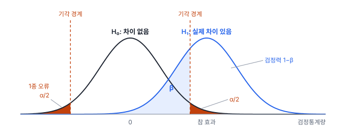
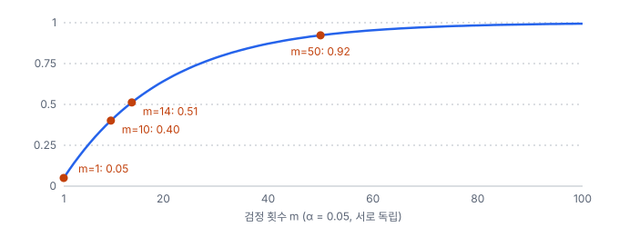

# 4강 차이가 진짜인가

## 이 강에서 얻는 것

- 귀무가설·p값·유의수준으로 "이 차이를 우연으로 설명할 수 있는가"를 판단하고, p값을 바르게 해석할 수 있음
- 1·2종 오류와 검정력의 관계를 알고, t검정 결과를 효과크기와 함께 보고할 수 있음
- 검정을 여러 번 할 때 생기는 거짓 양성을 본페로니·홀름·BH로 다루고, p-해킹을 피할 수 있음

## 1. 차이는 우연으로도 생김

같은 필지 30개의 작년·올해 여름 NDVI를 비교했더니 올해가 평균 0.02 높았다고 함. 이 0.02가 진짜 변화인지, 촬영 조건·대기 상태 때문에 생긴 흔들림인지는 숫자만 봐서는 알 수 없음.

기준은 3강의 표준오차임. 필지마다 (올해 − 작년) 차이를 구했고 그 표준편차가 0.05였다면, 평균 차이의 표준오차는 $0.05/\sqrt{30} \approx 0.0091$임. 관측한 0.02는 표준오차의 약 2.19배임. 변화가 전혀 없어도 평균 차이는 표준오차 한 개 안팎으로는 흔히 움직이므로, **표준오차 몇 개만큼 떨어져 있는가**가 판단의 출발점임. 이것을 체계적으로 따지는 절차가 **가설검정(hypothesis test)**임.

## 2. 귀무가설, p값, 유의수준

**귀무가설(null hypothesis, $H_0$)**은 "차이·효과가 없음"이라는 기본 가정임. 위 예에서는 "필지 NDVI의 평균 변화는 0"임. 그 반대인 "변화가 있음"은 **대립가설($H_1$)**임. 검정은 귀무가설이 참인 세계를 먼저 가정하고, 그 세계에서 지금 같은 데이터가 얼마나 나오기 어려운지를 따짐.

이를 위해 데이터를 숫자 하나로 줄인 **검정통계량**을 계산함. 위 예의 2.19(평균 차이 ÷ 표준오차)가 그것임. **p값(p-value)**은 귀무가설이 참일 때, 관측한 검정통계량만큼 또는 그보다 더 극단적인 값이 나올 확률임. 증가·감소를 모두 보는 양측 검정이면 양쪽 꼬리를 더함.

$$p = P\left(\lvert T \rvert \ge \lvert t_{\text{관측}} \rvert \;\middle|\; H_0\right)$$

말로 풀면 "변화가 전혀 없다면, 이만큼 큰 차이가 우연히 나올 확률"임. 위 예의 p값은 약 0.037임(자유도가 필지 수 − 1 = 29인 t분포 기준, 4절).

**유의수준(significance level, $\alpha$)**은 검정 **전에** 정해 두는 기각 기준으로, 흔히 0.05를 씀. $p \le \alpha$이면 귀무가설을 기각하고 "통계적으로 유의함"이라고 말함. 위 예는 $0.037 \le 0.05$라서 유의함.

p값은 가장 많이 오해받는 숫자임. 미국통계학회(ASA)가 2016년에 낸 성명의 요지를 기억해 둠.

- p값은 데이터가 귀무가설과 얼마나 안 맞는지를 나타낼 뿐, **귀무가설이 참일 확률이 아님**. p = 0.037은 "변화가 없을 확률 3.7%"가 아님
- p값은 **효과의 크기나 중요성을 말해 주지 않음**. 아주 작은 차이도 표본이 크면 p가 작아짐
- 0.05 같은 경계를 넘었는지만으로 결론을 내리지 않음. 예컨대 p = 0.049와 0.051은 사실상 같은 정도의 증거임
- 분석을 몇 번, 어떻게 했는지 전부 밝히지 않으면 p값을 해석할 수 없음(6절)

## 3. 두 가지 오류와 검정력

검정은 틀릴 수 있고, 틀리는 방식은 둘임.

| 판정 | 실제로 차이 없음 ($H_0$ 참) | 실제로 차이 있음 ($H_1$ 참) |
|---|---|---|
| 기각함(차이 있다고 판정) | 1종 오류, 확률 $\alpha$ | 올바른 발견, 확률 $1-\beta$ |
| 기각 못 함 | 올바른 판단 | 2종 오류, 확률 $\beta$ |

**1종 오류(type I error)**는 없는 차이를 있다고 하는 거짓 양성임. 변화탐지로 치면 거짓 변화임. 유의수준 $\alpha$가 이 오류 확률의 상한임. **2종 오류(type II error)**는 있는 차이를 놓치는 거짓 음성이고, 그 확률을 $\beta$로 씀. **검정력(statistical power, $1-\beta$)**은 실제 차이가 있을 때 그것을 잡아낼 확률임.

두 오류는 맞물려 있음. 기각 경계를 바깥으로 밀어 $\alpha$를 줄이면 $\beta$가 커짐. 둘을 함께 줄이려면 두 분포를 멀리 떨어뜨려야 하고, 그러려면 표준오차를 줄여야 함. 가장 확실한 수단은 표본을 늘리는 것임. 검정력은 참 효과의 크기, 표본 수, 데이터의 퍼짐, $\alpha$로 정해짐.

1절의 예에서 실제 변화가 0.02, 차이의 표준편차가 0.05라면 필지 30개로는 검정력이 약 0.56임. 진짜 변화가 있어도 거의 절반은 "유의하지 않음"으로 끝나는 셈임. 흔히 목표로 삼는 검정력 0.8을 얻으려면 필지가 52개 필요함. 그래서 **"유의하지 않음"은 "차이 없음"이 아니라 "이 표본으로는 판단 못 함"**으로 읽음. 조사 전에 표본 수를 정할 때 이 계산을 씀.

## 4. t검정과 효과크기

**t검정(t-test)**은 평균의 차이를 그 표준오차로 나눈 통계량으로 평균을 비교하는 검정임. 모집단 표준편차 대신 표본 표준편차를 쓰기 때문에, 자료가 대략 정규분포를 따르면 귀무가설 아래에서 이 통계량은 정규분포보다 꼬리가 조금 두꺼운 t분포를 따름(표본이 커지면 정규분포에 가까워짐). 형태는 두 가지임.

- **독립표본 t검정**: 서로 다른 두 집단을 비교함(예: 산림 구역과 농경 구역의 LST). 두 집단의 분산이 다를 수 있으면 웰치(Welch) 검정을 씀
- **대응표본 t검정**: 같은 대상을 두 번 잰 짝을 비교함(예: 같은 필지의 두 시기, 같은 장면에서 두 모델). 짝마다 차이 $\Delta_i$를 구해 그 평균이 0인지 봄

$$t = \frac{\bar{\Delta}}{s_\Delta / \sqrt{n}}$$

$\bar{\Delta}$는 차이의 평균, $s_\Delta$는 차이의 표준편차이고, 분모가 평균 차이의 표준오차임. 1절의 2.19가 바로 이 값임.

짝 구조를 무시하면 결론이 뒤집히기도 함. 새 건물 분할 모델과 기존 모델을 같은 검증 장면 10개에서 IoU(예측과 정답이 겹치는 비율, 35강)로 비교한 예임.

| 장면 | 1 | 2 | 3 | 4 | 5 | 6 | 7 | 8 | 9 | 10 |
|---|---|---|---|---|---|---|---|---|---|---|
| 기존 | 0.62 | 0.71 | 0.55 | 0.78 | 0.66 | 0.59 | 0.74 | 0.69 | 0.63 | 0.80 |
| 새 모델 | 0.65 | 0.72 | 0.59 | 0.80 | 0.66 | 0.62 | 0.76 | 0.70 | 0.67 | 0.82 |

장면 난이도에 따라 IoU는 0.55~0.82로 크게 흩어지지만, 장면별 차이는 0.00~0.04로 고름. 평균 차이는 0.022임.

- 대응표본 t검정: $t \approx 5.28$, $p \approx 0.0005$, 차이의 95% 신뢰구간 0.013~0.031
- 같은 자료를 독립표본(웰치)으로 검정: $t \approx 0.62$, $p \approx 0.54$

독립표본 검정은 장면 사이의 큰 흩어짐(표준편차 약 0.08)을 잡음으로 보고 0.022를 묻어 버림. 대응표본은 장면마다 차이를 먼저 구해 장면 난이도를 지우므로 검정력이 훨씬 높음. 같은 장면·같은 필지에서 잰 자료는 대응표본으로 검정함.

**효과크기(effect size)**는 차이가 실제로 얼마나 큰지를 표본 수와 상관없는 척도로 나타낸 값임. 대표적인 **코헨의 d(Cohen's d)**는 평균 차이를 표준오차가 아니라 **표준편차**로 나눔. 관례상 0.2를 작음, 0.5를 중간, 0.8을 큼이라 부르지만 분야마다 기준이 달라 참고만 함. 실무에서는 원래 단위의 차이(IoU 0.022)와 신뢰구간(3강)을 함께 적는 편이 가장 잘 전달됨.

효과크기가 따로 필요한 이유는 t가 표본 수와 함께 커지기 때문임. 대응표본에서는 흔히 차이의 표준편차로 나눈 $d_z = \bar{\Delta}/s_\Delta$를 쓰고, $t = d_z\sqrt{n}$ 관계가 있음. $d_z$는 원래 값의 표준편차로 나눈 d와 값이 달라서(위 IoU 예에서 $d_z \approx 1.67$, 장면 간 표준편차 약 0.08로 나누면 약 0.28) 위 관례 기준에 그대로 대지 않음. 검증 타일 5,000개로 두 모델을 비교해 평균 IoU 차이 0.002, 차이의 표준편차 0.03이 나왔다면 $d_z \approx 0.067$로 아주 작은데도 $t \approx 4.71$, $p \approx 2.5 \times 10^{-6}$임. **유의하다는 것은 중요하다는 뜻이 아님.** 0.002의 개선이 배포할 가치가 있는지는 효과크기와 업무 기준으로 정함.

## 5. 여러 번 검정할 때의 함정

검정 하나의 1종 오류 확률은 $\alpha$로 묶여 있지만, 검정을 여러 번 하면 이야기가 달라짐. 읍면동 200곳마다 NDVI 변화를 검정하면, 실제로는 어디에도 변화가 없어도 $\alpha = 0.05$에서 평균 10곳이 "유의한 변화"로 나옴. 검정을 많이 할수록 우연히 유의한 결과가 섞여 나오는 이 현상이 **다중비교 문제(multiple comparisons problem)**임. 관리하는 오류율은 둘임.

- **가족별 오류율(family-wise error rate, FWER)**: 한 묶음(가족)의 검정에서 1종 오류가 **하나라도** 나올 확률
- **거짓 발견율(false discovery rate, FDR)**: 기각한(발견한) 가설 가운데 실제로는 귀무가설이 참인 것의 비율의 기댓값. "발견 목록 중 가짜가 몇 %인가"를 관리함

검정 $m$개가 서로 독립이고 모두 귀무가설이 참이면 FWER은 다음과 같음.

$$\mathrm{FWER} = 1 - (1-\alpha)^m$$

보정 방법은 세 가지를 알아 둠.

**본페로니 보정(Bonferroni correction)**은 각 검정의 기준을 $\alpha/m$으로 낮춤(p값에 $m$을 곱해 $\alpha$와 비교해도 같음). FWER을 $\alpha$ 이하로 묶는 가장 단순한 방법이지만, $m$이 크면 기준이 너무 엄해져 진짜 차이도 놓침.

**홀름-본페로니 방법(Holm-Bonferroni method)**은 p값을 작은 순으로 세우고 $k$번째 값을 $\alpha/(m-k+1)$과 비교해 나가다가, 처음 통과하지 못한 곳에서 멈추고 그 앞까지를 기각함. FWER을 똑같이 $\alpha$ 이하로 묶으면서 기각 수는 본페로니와 같거나 많으므로, FWER을 지켜야 할 때 기본으로 씀.

**벤자미니-호크버그 절차(Benjamini-Hochberg procedure, BH)**는 FDR을 $q$ 이하로 묶음. p값을 작은 순으로 세우고 아래 조건을 만족하는 **가장 큰** $k$를 찾아, 1위부터 $k$위까지를 모두 기각함.

$$p_{(k)} \le \frac{k}{m}\,q$$

중간에 조건을 못 넘는 순위가 있어도 그 뒤에서 넘는 순위가 있으면 앞은 모두 기각한다는 점이 홀름과 다름. FDR 보장은 검정끼리 독립이거나, 한 검정의 p값이 작으면 다른 검정도 작아지는 식으로 같은 방향으로 얽혀 있을 때(양의 의존) 성립함.

권역 8곳의 두 시기 LST 차이를 검정해 얻은 p값에 적용한 예임($\alpha = q = 0.05$, $m = 8$).

| 순위 $k$ | p값 | 홀름 기준 $\alpha/(m-k+1)$ | BH 기준 $kq/m$ |
|---|---|---|---|
| 1 | 0.001 | 0.00625 통과 | 0.00625 통과 |
| 2 | 0.007 | 0.00714 통과 | 0.0125 통과 |
| 3 | 0.011 | 0.00833 **멈춤** | 0.01875 통과 |
| 4 | 0.026 | 0.01 | 0.025 넘음 |
| 5 | 0.030 | 0.0125 | 0.03125 통과 ← 가장 큰 $k$ |
| 6 | 0.041 | 0.01667 | 0.0375 넘음 |
| 7 | 0.21 | 0.025 | 0.04375 넘음 |
| 8 | 0.62 | 0.05 | 0.05 넘음 |

BH에서 4위(0.026)는 자기 기준 0.025를 넘지만, 5위가 통과하므로 함께 기각됨. 파이썬(`scipy.stats.false_discovery_control`, 수작업 절차)으로 확인한 기각 수는 다음과 같음.

| 방법 | 기준 | 기각 수 |
|---|---|---|
| 보정 없음 | $p \le 0.05$ | 6 |
| 본페로니 | $p \le 0.00625$ | 1 |
| 홀름-본페로니 | 단계적 | 2 |
| BH | $q = 0.05$ | 5 |

하나라도 틀리면 곤란한 소수의 핵심 비교에는 FWER(홀름)을, 많은 후보 중에서 확인할 것을 추릴 때는 FDR(BH)을 씀.

## 6. p-해킹

**p-해킹(p-hacking)**은 유의한 결과가 나올 때까지 분석을 바꿔 가며 반복하고, 유의하게 나온 것만 골라 보고하는 관행임. 겉으로는 검정을 한 번 한 것처럼 보이지만 실제로는 여러 번 한 것이라, 5절의 문제가 보이지 않게 숨음. 서로 독립인 시도 20번이면 효과가 전혀 없어도 적어도 하나가 유의할 확률이 $1 - 0.95^{20} \approx 0.64$임. 모델 개발에서는 이런 모습으로 나타남.

- 하이퍼파라미터·시드를 바꿔 여러 번 돌리고, 가장 좋은 실행만 기존 모델과 비교함
- mAP50, mAP50-95, F1(탐지 지표, 38·39강) 중 차이가 유의하게 나온 지표만 보고함
- 결과가 애매하면 "구름 많은 장면 제외" 같은 기준을 사후에 만들어 검증 장면을 넣고 뺌
- 시험 세트 점수를 보고 모델을 고친 뒤 같은 시험 세트로 다시 평가함

막는 법은 비교할 지표·장면·검정 방법을 먼저 정해 기록하고, 실패를 포함해 시도한 것을 모두 남기고, 여러 지표·조건을 보면 5절의 보정을 적용하는 것임. 최종 확인은 모델 선택에 쓰지 않은 시험 세트로 한 번만 함(15강).

## 현장에서는

읍면동 250곳의 두 시기 NDVI 변화탐지도를 만들면서, 읍면동마다 표본 지점의 변화를 대응표본 t검정으로 따져 유의하면 "변화"로 칠하는 상황임. 실제 변화는 20곳뿐이고 230곳은 변화가 없다고 가정함.

보정 없이 $\alpha = 0.05$를 쓰면 변화 없는 230곳 중 평균 11.5곳이 거짓 변화로 칠해짐. 실제 변화 20곳에서 검정력이 0.8이면 16곳을 잡으므로, 칠해진 약 27.5곳 가운데 약 42%가 가짜임(기댓값으로 어림한 값). 현장 확인을 나간 사람이 헛걸음이 잦다고 느끼는 이유임.

본페로니를 쓰면 기준이 $0.05/250 = 0.0002$로 엄해져 거짓 변화는 거의 사라지지만 실제 변화도 여럿 놓침. 후보를 추려 현장 확인에 넘기는 목적이라면 BH로 FDR을 5%에 맞추는 편이 알맞음. 칠해진 구역 중 가짜 비율의 기댓값이 5% 이하(이 경우 이론상 $0.05 \times 230/250 = 0.046$ 이하)로 관리됨. 다만 이웃한 읍면동의 검정은 공간 자기상관(5강) 때문에 서로 얽혀 있고, 가까운 표본 지점끼리도 독립이 아니어서 표준오차가 작게 잡히기 쉬움. 표본 지점 간격을 넓히고, 필요하면 의존 구조와 상관없이 성립하는 보수적인 변형(벤자미니-예쿠티엘리 절차)을 검토함.

## 헷갈리는 쌍

- **p값 vs 귀무가설이 참일 확률**: p값은 "귀무가설이 참이라면 이만큼 극단적인 데이터가 나올 확률"임. 방향이 반대인 "이 데이터를 봤을 때 귀무가설이 참일 확률"과 다름.
- **통계적 유의성 vs 실질적 중요성**: 표본이 크면 사소한 차이도 유의함. 중요성은 효과크기와 업무 기준으로 판단함.
- **FWER vs FDR**: FWER은 "하나라도 틀릴 확률", FDR은 "발견한 것 중 틀린 것의 비율"임. FDR 통제가 더 느슨한 대신 더 많이 찾음.
- **독립표본 vs 대응표본**: 같은 대상을 두 번 쟀으면 대응표본임. 잘못 고르면 검정력이 크게 달라짐.

## 이렇게 지시받음

> 지시: "새 모델이 mIoU 1.5%p 높다고만 쓰지 말고, 검증 장면별로 짝지어 검정해서 차이 신뢰구간이랑 같이 붙여."

장면별 mIoU(클래스별 IoU의 평균, 40강) 차이로 대응표본 t검정을 하라는 뜻임(4절). p값만이 아니라 평균 차이와 95% 신뢰구간을 효과크기로 함께 보고함. 장면 수가 적으면 검정력이 낮으므로, 유의하지 않게 나와도 "차이 없음"으로 쓰지 않음. 장면별 차이가 한두 장면에 크게 쏠려 있으면 부트스트랩 신뢰구간(3강)도 같이 봄.

> 지시: "읍면동별 변화 검정 결과, BH로 FDR 5% 맞춰서 변화 후보 뽑아."

p값 전체에 벤자미니-호크버그 절차를 적용하라는 뜻임. 도구로는 scipy의 `false_discovery_control`이나 statsmodels의 `multipletests(method="fdr_bh")`로 조정 p값을 구해 0.05 이하를 고름. 뽑힌 목록 중 가짜 비율이 평균 5% 이하라는 뜻이지, 각 구역이 틀릴 확률이 5%라는 뜻도, 하나도 틀리지 않는다는 뜻도 아님.

> 지시: "튜닝한 것 중 제일 좋은 것만 기존 모델이랑 비교해서 유의하다고 쓰지 마. 시도한 거 전부 표로 붙이고, 시험 세트는 마지막에 한 번만 돌려."

p-해킹을 경계하라는 뜻임. 최고 실행 하나만 고르면 여러 번 검정한 효과가 숨으므로 모든 시도를 공개하고, 시험 세트는 모델 선택에 쓰지 않고 최종 평가에만 씀.

## 요약

- 가설검정은 귀무가설이 참이라고 놓고, 관측한 차이가 표준오차 몇 개만큼인지로 우연 여부를 따짐
- p값은 "귀무가설 아래서 이만큼 극단적인 데이터가 나올 확률"이지, 귀무가설이 참일 확률도 효과의 크기도 아님
- 1종 오류(α)와 2종 오류(β)는 맞물려 있고, 둘을 함께 줄이려면 표본을 늘려 검정력을 높여야 함
- 같은 대상을 두 번 쟀으면 대응표본 t검정을 쓰고, 결과는 효과크기·신뢰구간과 함께 보고함
- 검정을 여러 번 하면 FWER(본페로니·홀름)이나 FDR(BH)로 보정하고, 시도한 것을 모두 밝혀 p-해킹을 피함

## 핵심 용어

| 한글 | 영문 |
|---|---|
| 가설검정 / 검정통계량 | Hypothesis Test / Test Statistic |
| 귀무가설 / 대립가설 | Null Hypothesis / Alternative Hypothesis |
| p값 | P-value |
| 유의수준 | Significance Level (α) |
| 1종 오류 / 2종 오류 | Type I Error / Type II Error |
| 검정력 | Statistical Power (1−β) |
| t검정 (독립표본 / 대응표본) | t-Test (Independent / Paired) |
| 효과크기 / 코헨의 d | Effect Size / Cohen's d |
| 다중비교 문제 | Multiple Comparisons Problem |
| 가족별 오류율 | Family-Wise Error Rate (FWER) |
| 거짓 발견율 | False Discovery Rate (FDR) |
| 본페로니 보정 | Bonferroni Correction |
| 홀름-본페로니 방법 | Holm-Bonferroni Method |
| 벤자미니-호크버그 절차 | Benjamini-Hochberg Procedure (BH) |
| p-해킹 | P-hacking |
