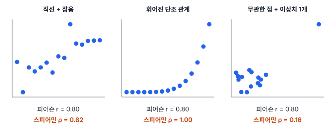
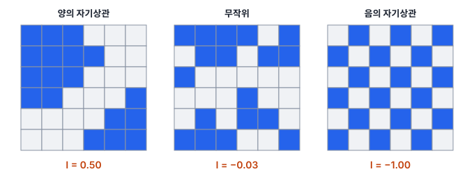
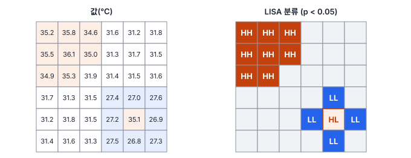

# 5강 함께 움직이는 변수

## 이 강에서 얻는 것

- 공분산·피어슨·스피어만 상관계수를 계산하고, 자료에 맞는 것을 고를 수 있음
- 상관을 인과로 읽지 않고, 교란변수와 허위 상관을 의심할 수 있음
- 공간 자기상관을 모란 지수로 재고, LISA로 군집과 이상 지점을 찾을 수 있음

## 1. 공분산: 함께 움직이는 방향

1강은 변수 하나를 요약했고, 이 강은 두 변수가 함께 움직이는지를 봄. 도시 격자 10칸의 불투수면 비율(도로·건물처럼 물이 스며들지 않는 면의 비율)과 여름 지표면온도(LST)가 다음과 같다고 함.

| 격자 | 1 | 2 | 3 | 4 | 5 | 6 | 7 | 8 | 9 | 10 |
|---|---|---|---|---|---|---|---|---|---|---|
| 불투수면(%) | 12 | 20 | 28 | 35 | 41 | 50 | 57 | 63 | 72 | 80 |
| LST(℃) | 29.8 | 29.3 | 31.4 | 30.6 | 32.5 | 31.7 | 33.6 | 32.9 | 35.1 | 34.2 |

**공분산(covariance)**은 두 변수가 각자의 평균에서 벗어난 정도(편차)를 곱해 평균낸 값임.

$$\mathrm{Cov}(x, y) = \frac{1}{n-1}\sum_{i=1}^{n}\left(x_i - \bar{x}\right)\left(y_i - \bar{y}\right)$$

두 값이 함께 평균보다 크거나 함께 작으면 곱이 양수, 한쪽만 크면 음수가 됨. 양수 곱이 우세하면 공분산이 양수, 음수 곱이 우세하면 음수임. $x$와 $x$ 자신의 공분산이 곧 분산(1강)임.

위 자료의 공분산은 약 39.6(단위는 %×℃)임. 그런데 불투수면을 0~1 비율로 바꾸면 0.396이 됨. 관계는 그대로인데 숫자만 바뀐 것임. 공분산의 부호는 방향을 알려 주지만, 크기로는 관계의 강도를 비교할 수 없음.

## 2. 피어슨 상관계수: 단위를 지운 직선 관계

**피어슨 상관계수(Pearson correlation coefficient)** $r$은 공분산을 두 변수의 표준편차 곱으로 나눠 단위를 지운 값임.

$$r = \frac{\mathrm{Cov}(x, y)}{s_x\, s_y}$$

위 자료에서 불투수면 표준편차는 22.5%p, LST 표준편차는 1.90℃이므로 $r = 39.56 / (22.51 \times 1.900) \approx 0.925$임. 불투수면을 비율로 바꾸든, LST를 화씨로 바꾸든 $r$은 그대로임.

$r$은 −1과 1 사이이고, ±1이면 모든 점이 한 직선 위에 있음. 0이면 **직선 관계**가 없다는 뜻일 뿐, 관계가 없다는 뜻은 아님. U자 모양 관계는 뚜렷해도 $r$이 0 근처로 나옴. $r^2$(여기서는 0.86)은 한 변수의 흩어짐 가운데 직선 하나로 설명되는 비율이며, 6강의 결정계수와 같은 값임.

피어슨 $r$의 약점은 둘임. 직선만 보고, 이상치에 약함. 위 10칸에 구름 마스크에서 빠진 격자 하나(불투수면 85%, LST 24.5℃, 구름 윗면 온도가 섞인 칸)를 더하면 $r$은 0.925에서 **0.12**로 떨어짐. 평균·표준편차가 이상치에 끌려가는 것(1강)과 같은 이유임. 그래서 $r$ 하나만 보고 판단하지 않고 산점도를 함께 봄.

## 3. 스피어만 순위상관계수: 순서만 보는 상관

**스피어만 순위상관계수(Spearman's rank correlation)** $\rho$는 두 변수를 각각 작은 값부터 매긴 순위(1위, 2위, …)로 바꾼 뒤 피어슨 상관을 구한 값임. 순위만 쓰므로 직선이 아니어도 한쪽이 커질 때 다른 쪽이 계속 커지기만 하면(**단조 관계**) 1이 됨. 같은 값이 없으면 다음 식과 같음.

$$\rho = 1 - \frac{6\sum_{i} d_i^{2}}{n\left(n^2 - 1\right)}$$

$d_i$는 한 관측에서 두 변수의 순위 차이임. 위 10칸은 불투수면 순위가 1~10이고 LST 순위가 2, 1, 4, 3, 6, 5, 8, 7, 10, 9라서 모든 $d_i$가 ±1임. $\sum d_i^2 = 10$이므로 $\rho = 1 - 60/990 \approx 0.939$임.

구름 격자를 더하면 그 칸은 불투수면이 가장 큰데(11위) LST는 가장 낮아(1위) 순위 차이가 10이 되고, $\rho$는 0.455가 됨. 피어슨이 0.925에서 0.12로 무너진 것보다 훨씬 덜 흔들림. 이상치가 아무리 멀리 있어도 순위로 바꾸면 그저 맨 끝 순위일 뿐이기 때문임. 1강의 중앙값과 같은 원리이지만, 완전히 면역은 아님.

같은 값이 있으면 순위를 평균내어 주고(3위와 4위가 같은 값이면 둘 다 3.5위), 위 식 대신 순위에 피어슨을 직접 계산함. 도구가 자동으로 처리함.

## 4. 상관은 인과가 아님: 교란변수와 허위 상관

**교란변수(confounding variable)**는 원인으로 의심하는 변수와 결과 변수 모두에 영향을 주는 제3의 변수임. 산지 유역의 가상 격자 500개에서 NDVI와 LST의 상관은 −0.86으로 강함. 식생이 증발산으로 지표를 식히는 효과는 실제로 있지만, 이 자료에는 **고도**가 끼어 있음. 높은 곳일수록 기온이 낮고, 개발이 덜 되어 산림이 많음. 고도가 둘을 동시에 움직여 상관을 부풀린 것임.

고도로 설명되는 부분을 두 변수에서 각각 빼고 남은 것끼리 구한 상관(**편상관**, partial correlation)은 −0.28로 줄어듦. NDVI만 놓고 직선을 맞추면 NDVI 0.1 증가에 LST 1.31℃ 하강이지만, 고도를 함께 넣으면 0.33℃ 하강으로 약 4분의 1이 됨. 관계가 있긴 하지만 크기를 네 배 가까이 과장한 셈임. 여러 변수를 함께 넣는 회귀는 2부에서 다룸.

**허위 상관(spurious correlation)**은 두 변수 사이에 직접적인 관계가 없는데도 나타나는 상관임. 원인은 대체로 셋임.

1. **교란변수**: 위의 고도처럼 둘을 함께 움직이는 변수
2. **공통 추세**: 해안 군의 연도별 양식장 탐지 폴리곤 수와 내륙 시의 불투수면 면적(2015~2024년)은 둘 다 해마다 늘어서 $r = 0.995$가 나옴. 전년 대비 증가량끼리 상관을 구하면 0.06으로 사라짐
3. **우연**: 밴드·지수 수십 개로 상관행렬을 만들면 관계가 없어도 몇 쌍은 크게 나옴(4강의 다중비교 문제)

## 5. 공간 자기상관과 모란 지수

2강과 3강에서 인접 픽셀과 가까운 표본점은 서로 독립이 아니라고 했음. **공간 자기상관(spatial autocorrelation)**은 한 변수의 값이 가까운 위치끼리 비슷하거나(양), 반대되는(음) 경향임. "모든 것은 서로 관련되어 있지만, 가까운 것끼리 먼 것보다 더 관련이 깊음"이라는 **토블러의 지리학 제1법칙**이 양의 자기상관의 근거로 흔히 인용됨. 이를 무시하면 표본 수를 부풀려 세는 셈이 되어 표준오차가 작게 나오고(3강), p값이 지나치게 작아지고(4강), 검증 점수가 부풀려짐(15강).

먼저 누가 이웃인지 정해야 함. 이를 적은 표가 **공간 가중치 행렬**이며, 가장 단순하게는 위치 $i$와 $j$가 이웃이면 $w_{ij} = 1$, 아니면 0임. 격자에서는 변을 공유하면 이웃인 **룩(rook) 인접**과 꼭짓점까지 포함하는 **퀸(queen) 인접**을 흔히 씀. 거리나 가장 가까운 $k$개로 정하기도 하고, 각 행의 합이 1이 되게 나누는 **행 표준화**를 하기도 함.

**모란 지수(Moran's I)**는 이웃끼리 값이 얼마나 닮았는지를 지역 전체에 대해 수 하나로 요약한 전역 지표임.

$$I = \frac{n}{W}\cdot\frac{\sum_{i}\sum_{j} w_{ij}\left(x_i - \bar{x}\right)\left(x_j - \bar{x}\right)}{\sum_{i}\left(x_i - \bar{x}\right)^2}$$

분자는 이웃 쌍마다 편차를 곱해 더한 것으로, 공분산을 이웃끼리만 계산한 꼴임. 분모는 편차 제곱합으로 분산의 꼴임. $W$는 가중치 전체의 합이고, 앞의 $n/W$는 이웃 쌍의 수와 관측 수를 맞추는 배율임. 양수면 비슷한 값끼리 모임, 음수면 이웃끼리 엇갈림을 뜻함.

LST 3×3 격자로 직접 계산해 봄. 왼쪽이 값, 오른쪽이 평균 32℃를 뺀 편차임.

$$\begin{bmatrix} 35 & 34 & 32 \\ 34 & 32 & 30 \\ 32 & 30 & 29 \end{bmatrix} \quad\rightarrow\quad \begin{bmatrix} 3 & 2 & 0 \\ 2 & 0 & -2 \\ 0 & -2 & -3 \end{bmatrix}$$

룩 인접으로 이웃 쌍은 12개(순서를 따지면 $W = 24$)임. 편차 곱이 0이 아닌 쌍은 3×2가 둘, (−2)×(−3)이 둘이라 합이 24이고, 순서를 따지면 48임. 편차 제곱합은 34이므로 $I = (9/24) \times (48/34) \approx 0.53$임. 같은 격자를 퀸 인접으로 계산하면 0.32로, 이웃 정의에 따라 값이 달라지므로 보고서에 가중치를 적음.

자기상관이 전혀 없을 때 $I$의 기댓값은 0이 아니라 다음과 같음.

$$E[I] = -\frac{1}{n-1}$$

9칸이면 −0.125임. 이 9개 값을 모든 순서로 섞어 배치하면(362,880가지) $I$의 평균이 정확히 −0.125이고, 관측값(약 0.53) 이상이 나오는 배치는 192가지(약 0.05%)뿐임. 이처럼 값을 무작위로 섞어 관측값이 얼마나 드문지 보는 **순열 검정**으로 유의성을 판단함. 실제로는 전부 섞을 수 없어 999번처럼 수백~수천 번 무작위로 섞으며, 정규분포 근사를 쓰는 도구도 있음.

## 6. LISA: 어디에 몰려 있는가

전역 모란 지수는 "모여 있다"는 것만 알려 주고 **어디**에 모였는지는 알려 주지 않음. **국지적 공간연관 지표(LISA)**는 전역 지표를 위치별로 쪼갠 것이고, 대표가 국지 모란 지수임.

$$I_i = \frac{x_i - \bar{x}}{m_2}\sum_{j} w_{ij}\left(x_j - \bar{x}\right), \qquad m_2 = \frac{1}{n}\sum_{k}\left(x_k - \bar{x}\right)^2$$

행 표준화를 하면 $\sum_j w_{ij}(x_j - \bar{x})$는 이웃들의 평균 편차(**공간 시차**, spatial lag)가 됨. 그래서 $I_i$는 "내 편차 × 이웃 평균 편차"이고, 둘의 부호 조합으로 네 가지가 나뉨. 나누는 상수는 도구마다 조금 다르지만 부호와 순위는 같음.

- **High-High(HH)**: 나도 높고 이웃도 높음. 핫스팟
- **Low-Low(LL)**: 나도 낮고 이웃도 낮음. 콜드스팟
- **High-Low(HL)**, **Low-High(LH)**: 이웃과 반대. 공간 이상치

가로축에 내 편차, 세로축에 공간 시차를 찍은 그림을 **모란 산점도**라 하고, 행 표준화를 하면 그 기울기가 전역 $I$와 같음. 각 칸의 유의성은 그 칸 값을 고정하고 나머지 값을 이웃 자리에 무작위로 섞어 넣는 **조건부 순열**로 판단함.

이 격자의 전역 $I$는 0.50임. 차가운 블록의 모서리 네 칸은 값이 낮은데도 유의하지 않음. 모서리 칸은 이웃 가운데 차가운 칸이 2개뿐이고 나머지가 배경 칸과 가운데의 뜨거운 칸이라, 세 칸은 이웃 평균이 30.4~30.9℃로 전체 평균(31.5℃)보다 조금 낮은 데 그침. 오른쪽 아래 구석 칸은 이웃 평균(29.6℃)이 유의한 LL 칸과 비슷하지만, 이웃이 3개뿐이라 무작위로 3개를 뽑아도 그만큼 낮은 평균이 쉽게 나옴. LISA는 군집의 핵을 찍어 줄 뿐, 경계를 정확히 긋지는 않음.

또 칸마다 검정을 한 번씩, 여기서는 36번 하므로 4강의 다중비교 문제가 그대로 생김. 그림은 보정 전 결과임. BH로 FDR을 5%에 맞추면 13칸이 모두 남지만(LL 한 칸은 겨우 통과), 본페로니를 쓰면 HH 4칸과 HL 1칸만 남음. 이웃한 칸은 이웃을 공유해 검정끼리 서로 얽혀 있기도 하므로, 보정 방법과 유의수준을 결과와 함께 적음.

## 현장에서는

읍면동별 여름 LST로 폭염 취약 지역을 찾는 과제임. 먼저 전역 모란 지수가 0.41(무작위로 섞은 999번 모두 이보다 작음)로 뚜렷한 양의 자기상관을 확인함. 이어 LISA를 돌리면 도심·산업단지가 HH, 산림 지역이 LL로 나오고, 교외 한 동이 HL로 튐. 영상을 열어 보니 논밭 가운데 새로 들어선 대형 물류창고 단지였음. 군집만 보고하면 이런 지점을 놓침.

이어서 불투수면 비율로 LST를 설명하는 회귀를 세우면 잔차(모델이 설명하지 못하고 남은 부분)의 모란 지수도 계산함. 잔차에 자기상관이 남아 있으면 공간 구조를 반영하는 방법(9강)을 검토하고, 모델을 검증할 때도 가까운 동끼리 학습·검증에 나뉘지 않게 공간 단위로 나눔(15강).

## 헷갈리는 쌍

- **피어슨 vs 스피어만**: 피어슨은 직선 관계와 실제 값의 크기를, 스피어만은 순서(단조 관계)만 봄. 둘이 크게 다르면 이상치나 휘어진 관계를 의심함.
- **상관 0 vs 관계 없음**: $r = 0$은 직선 관계가 없다는 뜻임. U자 관계처럼 뚜렷한 관계도 0이 나올 수 있음.
- **교란변수 vs 허위 상관**: 교란변수는 원인이 되는 제3의 변수, 허위 상관은 겉으로 보이는 현상임. 허위 상관은 공통 추세나 우연으로도 생김.
- **전역 모란 지수 vs LISA**: 전역은 "모였는가"를 수 하나로, LISA는 "어디에 무엇이 모였는가"를 위치마다 답함.

## 이렇게 지시받음

> 지시: "NDVI–LST 상관, 피어슨만 내지 말고 스피어만도 같이 붙여."

NDVI는 식생이 빽빽하면 상한 근처에서 포화되어 관계가 휘기 쉽고, 구름·수면 픽셀이 이상치로 섞이기도 함. 두 값을 나란히 보고하고, 차이가 크면 산점도를 첨부해 원인(포화, 이상치)을 적음.

> 지시: "Moran's I 유의하게 나왔으니 LISA 돌려서 HH만 폴리곤으로 뽑아 줘."

핫스팟 지역을 폴리곤으로 넘기라는 뜻임. 이웃 정의(룩·퀸·거리)와 행 표준화 여부, 순열 횟수, 유의수준을 기록하고, 칸 수가 많으면 FDR 보정(4강)을 적용할지 확인함. HH만 요청받았어도 HL·LH 이상 지점은 따로 목록으로 알려 줌. 오류이거나 가장 중요한 지점일 수 있기 때문임.

> 지시: "검증점 랜덤으로 나누지 말고, 자기상관 거리 보고 블록 크기 정해."

가까운 점이 학습과 검증에 나뉘어 들어가면 점수가 부풀려지므로 공간 블록 단위로 나누라는 뜻임(15강). 거리 구간별로 모란 지수를 계산한 그래프(**코렐로그램**)에서 $I$가 기댓값 근처로 떨어지는 거리를 찾고, 블록 한 변을 그보다 크게 잡음.

## 요약

- 공분산은 함께 움직이는 방향만 알려 주고 크기는 단위에 따라 달라짐. 피어슨 $r$은 이를 표준편차로 나눠 −1~1의 직선 관계 강도로 만든 것임
- 피어슨은 이상치 하나에도 크게 흔들리고 직선만 봄. 스피어만은 순위를 써서 단조 관계를 잡고 이상치에 덜 흔들림
- 상관은 인과가 아님. 교란변수, 공통 추세, 우연이 허위 상관을 만들고, 교란변수는 실제 관계의 크기도 부풀림
- 공간 자기상관은 가까운 값끼리 닮는 경향이며, 독립을 전제한 표준오차·검정·검증 점수를 모두 낙관적으로 만듦
- 모란 지수는 전역 자기상관을(기댓값 $-1/(n-1)$), LISA는 HH·LL 군집과 HL·LH 이상 지점을 위치별로 알려 줌. 둘 다 이웃 정의에 따라 값이 달라짐

## 핵심 용어

| 한글 | 영문 |
|---|---|
| 공분산 | Covariance |
| 피어슨 상관계수 | Pearson Correlation Coefficient |
| 스피어만 순위상관계수 | Spearman's Rank Correlation |
| 교란변수 | Confounding Variable |
| 편상관 | Partial Correlation |
| 허위 상관 | Spurious Correlation |
| 공간 자기상관 | Spatial Autocorrelation |
| 공간 가중치 행렬 (룩 / 퀸 인접) | Spatial Weights Matrix (Rook / Queen Contiguity) |
| 모란 지수 | Moran's I |
| 국지적 공간연관 지표 | Local Indicators of Spatial Association (LISA) |
| 공간 시차 / 모란 산점도 | Spatial Lag / Moran Scatter Plot |
| 순열 검정 | Permutation Test |
