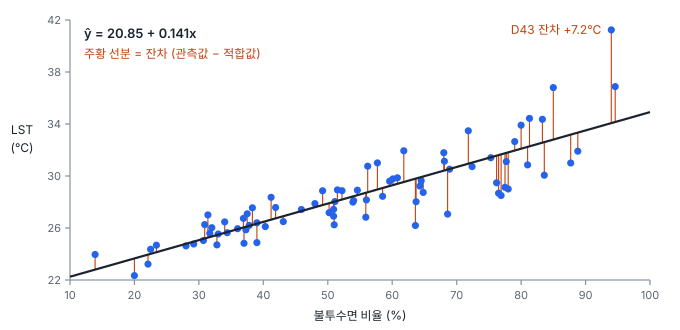
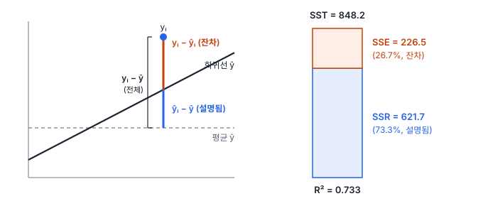
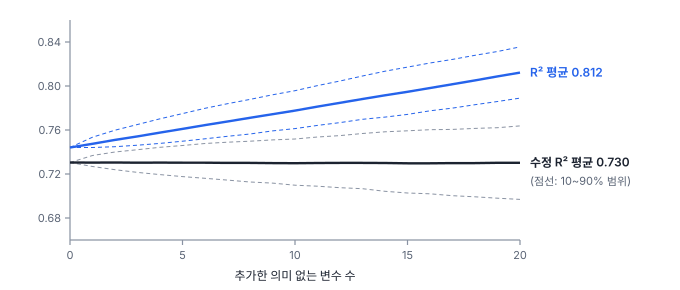

# 6강 최소제곱 회귀

## 이 강에서 얻는 것

- 최소제곱법(OLS)이 직선을 고르는 기준을 이해하고, 회귀계수와 절편을 단위와 함께 읽을 수 있음
- 총제곱합을 회귀제곱합과 잔차제곱합으로 나누고, 결정계수(R²)가 말해 주는 것과 말해 주지 않는 것을 구분할 수 있음
- 다중회귀 계수를 "다른 변수를 고정했을 때"로 해석하고, 모형을 비교할 때 수정 결정계수를 쓸 수 있음

## 1. 상관에서 예측으로

5강의 상관계수는 두 변수가 얼마나 직선으로 함께 움직이는지를 수 하나로 알려 줌. 하지만 "불투수면이 10%p 높은 동은 LST가 몇 도 높은가"에는 답하지 못함. 이 질문에 답하는 것이 **회귀(regression)**임.

2부에서는 가상 도시 행정동 80개의 자료를 계속 씀. 동마다 여름철 평균 지표면온도(LST, 위성 2차 산출물)와 불투수면 비율, NDVI, 평균 고도, 해안 거리가 있음. 불투수면과 LST의 피어슨 상관은 $r = 0.856$임.

회귀에서는 설명하려는 대상을 **종속변수(response variable)**, 그것을 설명하는 데 쓰는 입력을 **설명변수(explanatory variable)**라고 부름. 종속변수는 반응변수·목표변수, 설명변수는 독립변수·예측변수·특징(feature)이라고도 부름. 여기서는 LST가 종속변수 $y$, 불투수면 비율이 설명변수 $x$임. 설명변수가 하나면 **단순회귀**, 여럿이면 **다중회귀**임.

$$y_i = \beta_0 + \beta_1 x_i + \varepsilon_i$$

$\beta_0$은 **절편(intercept)**, $\beta_1$은 **회귀계수(regression coefficient)**, $\varepsilon_i$는 직선이 설명하지 못하는 나머지(오차)임. 자료로 추정한 값은 $b_0, b_1$로 쓰고, 추정한 직선이 주는 값 $\hat{y}_i = b_0 + b_1 x_i$를 **적합값(fitted value)**, 관측값과 적합값의 차이 $e_i = y_i - \hat{y}_i$를 **잔차(residual)**라고 부름.

## 2. 최소제곱법: 잔차를 제곱해 더한 값이 가장 작은 직선

점 80개 사이로 그을 수 있는 직선은 무수히 많음. **최소제곱법(OLS, ordinary least squares)**은 그중 잔차를 제곱해 모두 더한 값, 곧 **잔차제곱합(SSE, sum of squared errors)**이 가장 작은 직선을 고름.

$$\mathrm{SSE} = \sum_{i=1}^{n} \left(y_i - \hat{y}_i\right)^2 = \sum_{i=1}^{n} e_i^2$$

제곱하는 이유는 둘임. 위아래 잔차가 서로 상쇄되지 않게 하고, 답이 식 하나로 깔끔하게 나오게 함. 대신 큰 잔차를 제곱으로 크게 벌하므로, 동떨어진 점 하나가 직선을 끌어당김(1강에서 평균이 이상치에 끌려간 것과 같음, 8강).

단순회귀의 답은 다음과 같음.

$$b_1 = \frac{\sum_i (x_i - \bar{x})(y_i - \bar{y})}{\sum_i (x_i - \bar{x})^2} = r\,\frac{s_y}{s_x}, \qquad b_0 = \bar{y} - b_1 \bar{x}$$

기울기는 "공분산 ÷ $x$의 분산"이고, 상관계수에 두 표준편차의 비를 곱한 것과 같음. 상관이 단위를 지운 값이라면, 회귀계수는 거기에 단위를 다시 입힌 값임. 절편 식은 직선이 항상 평균점 $(\bar{x}, \bar{y})$를 지난다는 뜻임.

80개 동에서 $r = 0.856$, $s_y = 3.277$℃, $s_x = 19.94$%p이므로 $b_1 = 0.856 \times 3.277 / 19.94 \approx 0.1407$임. 평균은 $\bar{x} = 54.5$%, $\bar{y} = 28.52$℃라서 $b_0 = 28.52 - 0.1407 \times 54.5 \approx 20.85$임. 이 직선의 SSE는 226.5임. 평균점을 지나게 두고 기울기만 0.12나 0.16으로 바꾸면 SSE가 240.0, 238.2로 커짐. 어느 쪽으로 틀어도 SSE가 늘어나는 바닥이 최소제곱 직선임.

절편이 있으면 잔차의 합은 항상 0임. 그래서 잔차 평균이 0이라는 것만으로는 모형이 좋은지 알 수 없음.

## 3. 회귀계수와 절편 읽기

$$\widehat{\mathrm{LST}} = 20.85 + 0.1407 \times \text{불투수면(\%)}$$

**회귀계수**는 설명변수가 1단위 커질 때 종속변수의 기댓값이 변하는 양임. 불투수면이 1%p 높은 동은 LST가 평균 0.14℃ 높고, 10%p 높으면 1.41℃ 높음. 불투수면 30%인 동의 적합값은 25.07℃, 70%인 동은 30.70℃임. 계수에는 항상 단위(℃ per %p)가 붙으므로, 불투수면을 0~1 비율로 쓰면 같은 관계가 14.07로 나옴. 그래서 **계수의 크기만 보고 어떤 변수가 더 중요한지 판단할 수 없음**(표준화는 10강).

**절편**은 모든 설명변수가 0일 때의 적합값임. 여기서는 "불투수면 0%인 동의 LST 20.85℃"인데, 자료에서 불투수면이 가장 낮은 동이 13.9%라 0%는 관측 범위 밖임. 범위 밖으로 직선을 늘려 예측하는 것을 **외삽**이라 하며, 관계가 범위 밖에서도 직선이라는 보장이 없음. 절편은 직선의 높이를 맞추는 값으로만 보고, 어색하다고 원점을 지나도록 강제하지 않음. 절편을 빼면 직선이 엉뚱하게 기울고 4절의 제곱합 분해도 깨짐.

## 4. SST = SSR + SSE와 결정계수

직선이 LST의 흩어짐을 얼마나 설명하는지 재려면, 먼저 "아무것도 모를 때"의 흩어짐을 정함. 모든 동을 평균 $\bar{y}$로 예측하는 경우이고, 이때의 제곱합이 **총제곱합(SST, total sum of squares)**임.

$$\mathrm{SST} = \sum_i (y_i - \bar{y})^2, \qquad \mathrm{SSR} = \sum_i (\hat{y}_i - \bar{y})^2, \qquad \mathrm{SSE} = \sum_i (y_i - \hat{y}_i)^2$$

**회귀제곱합(SSR, regression sum of squares)**은 적합값이 평균에서 벗어난 양, 곧 직선이 설명한 부분임. 절편이 있는 최소제곱 모형에서는 세 값 사이에 다음 관계가 정확히 성립함.

$$\mathrm{SST} = \mathrm{SSR} + \mathrm{SSE}$$

동 하나의 편차 $y_i - \bar{y}$가 "직선이 설명한 부분 + 잔차"로 나뉘고, 이를 제곱해 더해도 두 부분이 깔끔하게 나뉨. 여기서 설명된 비율이 **결정계수(R², coefficient of determination)**임.

$$R^2 = \frac{\mathrm{SSR}}{\mathrm{SST}} = 1 - \frac{\mathrm{SSE}}{\mathrm{SST}}$$

80개 동은 $R^2 = 621.7 / 848.2 = 0.733$임. 동 간 LST 차이의 73%가 불투수면 직선 하나로 설명된다는 뜻임. 이 값은 $r^2 = 0.856^2$과 같음. 단순회귀에서는 항상 $R^2 = r^2$이고, 다중회귀에서는 관측값과 적합값 사이 상관의 제곱과 같음.

R²가 말해 주지 않는 것도 분명히 해 둠.

- **인과가 아님.** 불투수면이 높은 동은 NDVI가 낮고 도심에 가까움. R² 0.73은 이 묶음 전체가 LST와 함께 움직인다는 뜻일 뿐, 불투수면을 줄이면 그만큼 식는다는 증거가 아님(5강의 교란변수)
- **SST에 따라 달라짐.** 불투수면 40~70%인 동 35개만 쓰면 R²는 0.30으로 떨어지지만, 잔차의 전형적 크기(잔차 표준오차, $\sqrt{\mathrm{SSE}/(n-2)}$)는 1.70℃에서 1.35℃로 오히려 작아짐. 설명할 흩어짐 자체가 작아서 비율이 낮아진 것임
- **가정 점검을 대신하지 않음.** 잔차가 휘거나 부채꼴로 퍼져도 R²는 높을 수 있음(7강)

## 5. 다중회귀: 다른 변수를 고정했을 때

2부의 기본 모형은 설명변수 네 개를 함께 넣음. 추정 방식은 같아서, SSE가 가장 작은 계수 조합을 도구가 행렬 계산으로 한 번에 구함.

| 항 | 단순회귀 계수 | 기본 모형 계수 | 기본 모형 p값 |
|---|---|---|---|
| 절편 | — | 22.79 | < 0.001 |
| 불투수면(%) | 0.1407 | 0.1266 | < 0.001 |
| NDVI | −19.65 | −1.48 | 0.70 |
| 고도(m) | −0.0158 | −0.0151 | 0.089 |
| 해안 거리(km) | −0.0362 | 0.0525 | 0.18 |

단순회귀 계수는 그 변수 하나만 넣은 모형의 기울기, p값은 "이 계수가 0인가"의 검정 결과임(4강).

다중회귀의 회귀계수는 **다른 설명변수를 고정했을 때** 그 변수가 1단위 커지면 종속변수가 얼마나 변하는지임. 불투수면 계수 0.1266은 "NDVI·고도·해안 거리가 같은 두 동을 비교하면 불투수면 10%p 차이에 LST 1.27℃ 차이"로 읽음. 실제로 이 값은 LST와 불투수면에서 나머지 세 변수로 설명되는 부분을 각각 빼고, 남은 것끼리 단순회귀한 기울기와 정확히 같음(5강 편상관과 같은 발상).

그래서 같은 변수라도 모형에 무엇이 함께 들어가느냐에 따라 계수가 달라짐.

- **NDVI**는 혼자 넣으면 −19.65(NDVI 0.1 증가에 1.96℃ 하강)로 강해 보이지만, 불투수면을 고정하면 −1.48로 줄고 유의하지 않음. 두 변수의 상관이 −0.93이라 "불투수면은 같은데 NDVI만 다른 동"이 자료에 거의 없어서, 둘의 몫을 가르기 어려움(8강의 다중공선성)
- **해안 거리**는 부호까지 바뀜. 해안에서 먼 동은 대체로 고도가 높아(상관 0.90) 혼자 보면 시원한 쪽으로 나오지만, 고도 등을 고정하면 해안에서 멀수록 조금 더 뜨거운 쪽으로 나옴. 둘 다 p값이 커서(0.26, 0.18) 확정할 수는 없지만, 두 계수는 서로 다른 질문에 대한 답임
- **절편** 22.79는 불투수면 0%, NDVI 0, 고도 0 m, 해안 거리 0 km인 동의 값이라 현실에 없는 조합임. 해석하지 않음

불투수면 계수의 95% 신뢰구간(3강)도 단순회귀의 0.122~0.160에서 0.075~0.178로 넓어짐. 얽힌 변수를 함께 넣으면 계수 추정이 불안정해짐.

## 6. R²는 변수를 넣기만 해도 오름: 수정 결정계수

단순회귀에서 기본 모형으로 가면 R²가 0.733에서 0.744로 오름. **설명변수를 추가하면 R²는 절대 내려가지 않음.** 새 변수의 계수를 0으로 두면 원래 모형과 같아지므로, 최소제곱법이 찾는 SSE는 늘어날 수 없음. 쓸모없는 변수도 우연히 잔차와 조금은 맞아 SSE를 깎음.

**수정 결정계수(adjusted R²)**는 절편을 포함한 계수 수 $p$만큼 벌점을 줌.

$$R^2_{\text{adj}} = 1 - \left(1 - R^2\right)\frac{n-1}{n-p}$$

변수를 하나 넣을 때 SSE가 줄어드는 정도가 잃는 자유도(추정에 쓰고 남은 관측 수)를 보상하지 못하면 값이 떨어짐. 단순회귀는 $1 - 0.267 \times 79/78 \approx 0.7295$, 기본 모형은 $1 - 0.256 \times 79/75 \approx 0.7304$임. 변수 셋을 더 넣은 효과가 거의 없음.

그림처럼 의미 없는 변수 20개를 넣으면 R²는 평균 0.812까지 오름. 수정 R²는 평균적으로 제자리지만, 한 번의 실험에서는 대략 0.70~0.76(10~90% 범위) 사이에서 오르내림. 그래서 수정 R²도 완전한 방어막은 아님. 모형을 고르는 더 나은 기준(AIC·BIC, 교차검증)은 11강과 15강에서 다룸.

## 현장에서는

구청에서 "불투수면을 10%p 줄이면 LST가 몇 도 내려가나"를 물어 온 상황임. 단순회귀로는 1.41℃(95% 신뢰구간 1.2~1.6℃), 기본 모형으로는 1.27℃(0.75~1.78℃)임. 보고할 때는 세 가지를 붙임.

첫째, 이 값은 **동과 동을 비교한 차이**이지 한 동을 바꿨을 때의 효과가 아님. 녹지·도심 거리처럼 불투수면과 함께 움직이는 요인이 섞여 있음. 둘째, 관측 범위(13.9~94.6%) 안에서만 씀. 셋째, R², 잔차 표준오차(약 1.7℃), 산점도를 첨부하고 D43처럼 직선에서 멀리 떨어진 동은 따로 표시함(7·8강).

## 헷갈리는 쌍

- **SSR vs SSE (이름 뒤섞임)**: 이 책은 SSR을 회귀(설명된) 제곱합, SSE를 잔차제곱합으로 씀. 교재에 따라 SSR을 잔차제곱합(residual), SSE를 설명된 제곱합(explained)으로 정반대로 쓰기도 하고, statsmodels는 잔차제곱합을 `ssr`, 설명된 제곱합을 `ess`로 부름. 약어만 보지 말고 식을 확인함
- **잔차 vs 오차**: 잔차 $e_i$는 추정한 직선에서 잰 값이라 계산할 수 있음. 오차 $\varepsilon_i$는 참 모형에서의 값이라 관측할 수 없음. 잔차는 오차를 들여다보는 창임(7강)
- **R² vs 예측 오차**: R²는 SST 대비 비율이라 자료의 범위에 따라 달라짐. 예측이 몇 ℃ 틀리는지는 잔차 표준오차나 RMSE(잔차 제곱 평균의 제곱근)로 봄

## 이렇게 지시받음

> 지시: "동별 LST를 불투수면으로 회귀 돌려서 기울기랑 R² 뽑아 줘."

단순회귀를 적합하고 기울기를 "10%p당 몇 ℃"처럼 해석하기 쉬운 단위로 바꿔 보고함. 신뢰구간, 표본 수, 잔차 표준오차, 산점도와 회귀선을 함께 붙임. 절편은 관측 범위 밖이면 해석하지 않는다고 적어 둠.

> 지시: "변수 몇 개 더 넣어서 R² 0.8 넘겨 봐."

R²는 변수를 넣기만 해도 오르므로 0.8을 넘기는 것 자체는 쉬움. 목적(예측력 향상인지, 보고서 숫자인지)을 확인하고, 비교는 수정 R²나 검증 자료에서의 오차로 하자고 제안함(11·15강).

> 지시: "NDVI 계수가 왜 유의하지 않게 나와? 녹지가 온도 낮추는 건 상식인데."

다중회귀 계수는 불투수면을 고정한 상태에서의 NDVI 효과임. 두 변수의 상관이 −0.93이라 자료가 둘의 몫을 가르지 못해 불확실성이 커진 것이고, NDVI가 효과 없다는 뜻이 아님. 단순회귀 결과와 함께 설명하고, 다중공선성 진단(8강)을 이어서 함.

## 요약

- 회귀는 종속변수를 설명변수의 식으로 나타내고, 최소제곱법(OLS)은 잔차제곱합(SSE)이 가장 작은 계수를 고름
- 단순회귀 기울기는 $r \cdot s_y / s_x$이고, 직선은 평균점을 지남. 회귀계수는 단위가 붙은 변화량, 절편은 모든 설명변수가 0일 때의 값이라 범위 밖이면 해석하지 않음
- 절편이 있는 최소제곱 모형에서 SST = SSR + SSE이고, R² = SSR/SST는 설명된 흩어짐의 비율임. 인과나 예측 오차의 크기를 말해 주지 않음
- 다중회귀 계수는 다른 설명변수를 고정했을 때의 변화량이라, 함께 넣은 변수에 따라 크기와 부호가 바뀜
- R²는 변수를 넣기만 해도 오르므로, 설명변수 수가 다른 모형은 수정 결정계수나 검증 오차로 비교함

## 핵심 용어

| 한글 | 영문 |
|---|---|
| 종속변수 / 설명변수 | Response Variable / Explanatory Variable |
| 단순회귀 / 다중회귀 | Simple / Multiple Regression |
| 최소제곱법 | Ordinary Least Squares (OLS) |
| 회귀계수 / 절편 | Regression Coefficient / Intercept |
| 적합값 / 잔차 | Fitted Value / Residual |
| 잔차제곱합 | Sum of Squared Errors (SSE) |
| 총제곱합 / 회귀제곱합 | Total Sum of Squares (SST) / Regression Sum of Squares (SSR) |
| 결정계수 | Coefficient of Determination (R²) |
| 수정 결정계수 | Adjusted R-squared |
| 외삽 | Extrapolation |
