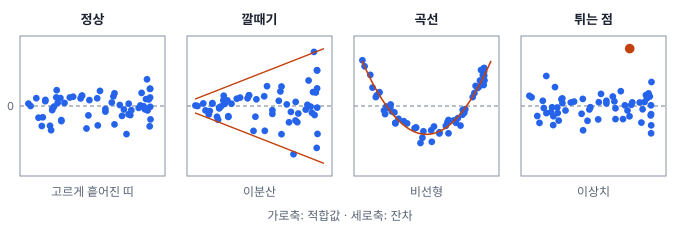
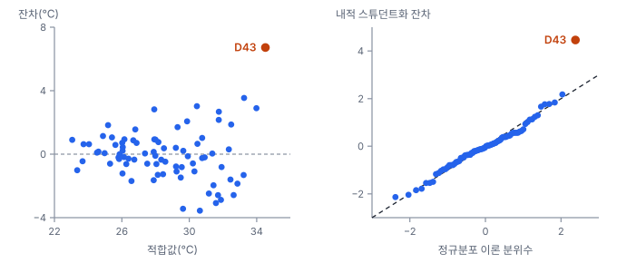

# 7강 잔차로 가정 점검하기

## 이 강에서 얻는 것

- 회귀의 LINE 가정을 알고, 가정이 깨졌을 때 틀어지는 것이 계수인지 표준오차·p값인지 구분할 수 있음
- 잔차 플롯과 Q-Q 플롯을 읽고, 브로이시-페이건·샤피로-윌크 검정으로 이분산과 정규성을 확인할 수 있음
- 스튜던트화 잔차로 튀는 관측을 찾고, 이분산이 있으면 강건 표준오차나 가중최소제곱법으로 대응할 수 있음

## 1. 계수를 믿기 전에 잔차를 봄

6강에서 가상 도시 80개 행정동의 여름철 지표면온도(LST)를 불투수면 비율·NDVI·고도·해안 거리로 설명하는 기본 모형을 최소제곱법(OLS)으로 맞췄음. $R^2$는 0.744, 불투수면 계수는 0.1266(10%p마다 약 1.27℃), 95% 신뢰구간은 0.075~0.178(표준오차 0.026)이었음.

계수는 늘 계산되지만 표준오차·p값·신뢰구간은 몇 가지 가정이 맞을 때만 제 뜻을 가짐. 가정은 **잔차(residual)**, 즉 관측값에서 모형의 예측값(**적합값**)을 뺀 값으로 점검함.

$$e_i = y_i - \hat{y}_i$$

## 2. LINE 가정: 무엇이 깨지면 무엇이 틀어지나

**LINE 가정(LINE assumptions)**은 선형회귀 추론이 기대는 네 가정의 머리글자이고, 깨졌을 때 망가지는 곳이 저마다 다름.

| 가정 | 뜻 | 깨지면 |
|---|---|---|
| L 선형성 | 설명변수와 결과의 평균 관계가 모형의 모양과 맞음 | **계수 자체가 치우침**. 구간별로 한쪽으로 틀린 예측(10강에서 변환·다항으로 고침) |
| I 독립성 | 오차끼리 서로 관련 없음 | 계수는 대체로 괜찮지만, 흔한 양의 자기상관이면 표준오차가 작게 나와 p값이 지나치게 작음(9강) |
| N 정규성 | 오차가 정규분포를 따름 | 작은 표본의 t·F 검정이 틀어짐(표본이 크면 영향이 작음). 개별 예측구간은 새 관측 하나의 오차에 기대므로 표본이 커도 틀어질 수 있음 |
| E 등분산성 | 오차의 분산이 어디서나 같음 | 계수는 치우치지 않지만 **표준오차·p값이 틀림**. OLS가 가장 정밀한 추정이 아니게 됨 |

계수 자체를 흔드는 것은 주로 선형성이고, 나머지 셋은 "그 계수를 얼마나 믿을 수 있나"를 흔듦. 표본이 크면 정규성이 덜 중요한 것은, 계수가 관측 여러 개의 가중합이라 그 분포가 중심극한정리(2강)에 따라 정규에 가까워지기 때문임.

독립성은 원격탐사 자료에서 특히 잘 깨짐. 이웃한 동은 해풍·지형을 공유해 설명되지 않은 부분도 비슷하게 남음(공간 자기상관, 5강). 9강에서 다룸.

## 3. 잔차 플롯과 Q-Q 플롯 읽기

**잔차 플롯(residual plot)**은 잔차를 세로축에, 적합값(또는 설명변수·관측 위치)을 가로축에 찍은 산점도임. 가정이 맞으면 점들이 0을 중심으로 폭이 고른 띠를 이룸.

- **깔때기**: 잔차의 퍼짐이 한쪽으로 커짐. 오차 분산이 관측마다 다른 **이분산성(heteroscedasticity)**의 신호임. 반대는 등분산성(homoscedasticity)
- **곡선**: 빠진 곡률이나 상호작용이 있다는 뜻으로, 선형성 위반임. 계수가 틀어지므로 가장 먼저 고침
- **튀는 점**: 한두 관측만 멀리 떨어짐(5절)

공통 자료의 기본 모형 잔차에는 깔때기가 뚜렷함. 적합값이 불투수면과 거의 같이 움직여(상관 0.99) 불투수면에 대해 그려도 같음. 불투수면 구간별 잔차 표준편차는 40% 이하(25동) 0.82℃, 40~70%(35동) 1.32℃, 70% 초과(20동) 2.71℃로, 고밀 동의 퍼짐이 녹지 동의 3배가 넘음.

정규성은 **Q-Q 플롯(quantile-quantile plot)**으로 봄. 크기순으로 세운 잔차를 정규분포에서 그 순위에 기대되는 값(이론 분위수)과 짝지어 찍은 그림으로, 정규면 점들이 대각선 위에 놓임. 양 끝이 대각선에서 바깥으로 벌어지면 꼬리가 두꺼운 것(1강의 첨도)이고, 한쪽 끝만 휘면 치우친 것(왜도)임.

## 4. 검정으로 확인하기: 브로이시-페이건과 샤피로-윌크

**브로이시-페이건 검정(Breusch-Pagan test, BP 검정)**은 "오차 분산이 설명변수와 무관함(등분산)"을 귀무가설로 둠. 잔차 제곱을 설명변수들에 다시 회귀하는 보조 회귀를 돌리고, 그 설명력을 봄.

$$e_i^2 = \gamma_0 + \gamma_1 x_{i1} + \cdots + \gamma_k x_{ik} + u_i, \qquad \mathrm{LM} = n\,R^2_{\text{보조}}$$

등분산이면 보조 회귀의 $R^2$가 작음. 검정통계량 LM은 귀무가설 아래 자유도 $k$(설명변수 수)인 카이제곱 분포(표준정규 변수 $k$개를 제곱해 더한 값의 분포)를 따름. 공통 자료에서는 보조 $R^2$가 0.317이라 $\mathrm{LM} = 80 \times 0.317 \approx 25.4$, 자유도 4, p ≈ 0.00004로 등분산을 기각함.

위 식은 정규성 가정을 뺀 쾨커(Koenker) 수정형으로 statsmodels `het_breuschpagan`의 기본값임. 원래 형태로는 LM이 56.5로 달라지므로 어느 쪽인지 적음.

**샤피로-윌크 검정(Shapiro-Wilk test)**은 "잔차가 정규분포에서 나왔음"을 귀무가설로 둠. 통계량 W는 크기순 잔차가 정규분포의 기대 순서 값과 얼마나 맞는지를 0~1로 나타내며, 1에 가까울수록 정규임. 공통 자료에서는 W = 0.956, p = 0.008로 정규성을 기각함.

그런데 D43 한 동을 빼고 맞추면 W = 0.983, p = 0.38로 기각되지 않음. "위반"이 사실상 관측 하나에서 온 것이라, 할 일은 변환이 아니라 그 관측을 보는 것임(5절).

**표본이 크면 검정이 사소한 차이도 잡음.** 4강의 "유의하다는 것은 중요하다는 뜻이 아님"과 같은 이야기임. 정규분포보다 꼬리가 조금 두꺼운 분포(자유도 10인 t분포, 초과첨도 1)에서 오차를 뽑아 샤피로-윌크 검정($\alpha = 0.05$)을 2,000번 반복하면, 기각 비율은 표본 50개에서 약 15%, 500개에서 약 66%, 5,000개에서 100%임.

픽셀 단위 회귀처럼 관측이 수천 개를 넘으면 정규성 검정은 거의 항상 기각되는데, 바로 그 크기에서는 중심극한정리 덕분에 정규성이 계수 추론에 거의 문제 되지 않음. 그래서 큰 표본에서는 p값 대신 Q-Q 플롯으로 벗어난 모양과 크기를 봄. BP 검정도 마찬가지로 구간별 표준편차 비 같은 **크기**를 함께 봄.

## 5. 스튜던트화 잔차: 튀는 관측을 같은 잣대로

잔차는 단위(℃)가 있어 튀는 기준을 정하기 어렵고, 관측마다 분산도 다름. 설명변수 조합이 나머지와 동떨어진 관측은 회귀선을 자기 쪽으로 끌어당겨 잔차가 작게 나옴. 이 끌어당기는 정도를 **레버리지** $h_{ii}$(0~1, 8강)라 하고, 잔차의 분산은 $\sigma^2(1-h_{ii})$임.

**스튜던트화 잔차(studentized residual)**는 잔차를 이 표준편차로 나눈 값임.

$$r_i = \frac{e_i}{s\sqrt{1-h_{ii}}}, \qquad t_i = \frac{e_i}{s_{(i)}\sqrt{1-h_{ii}}}$$

$s$는 모형의 잔차 표준오차, $s_{(i)}$는 $i$번째 관측을 빼고 맞춘 모형의 잔차 표준오차임. $r_i$를 내적(internal), $t_i$를 외적(external) 스튜던트화 잔차라 함. 튀는 관측은 $s$를 부풀려 자기 값을 작아 보이게 하는데(1강의 가림 효과와 비슷함), $t_i$는 그 관측을 빼고 $s$를 구해 이를 막음. 가정이 맞으면 $t_i$는 자유도 $n-p-1$($p$는 절편을 포함한 계수 수)인 t분포를 따름.

$\lvert t_i \rvert > 2$면 살펴볼 후보, 3을 넘으면 강한 신호로 흔히 봄. 다만 약 5%는 우연히 2를 넘으므로 80동이면 네 곳 안팎은 원래 걸림. 모든 동을 한꺼번에 보는 것은 다중비교(4강)라서, 본페로니 보정 기준은 약 3.57임.

공통 자료의 D43(해안 반대편 외곽의 공단 동)은 잔차 6.72℃, 레버리지 0.217, 내적 4.46, 외적 5.17로, 본페로니 기준을 넘는 유일한 동이고 둘째로 큰 값(2.24)과도 차이가 큼. 이 동이 계수를 얼마나 움직이는지(영향점)는 8강에서 다룸.

## 6. 이분산 대응: 강건 표준오차와 가중최소제곱법

**이분산-강건 표준오차(heteroscedasticity-consistent standard error, HC 표준오차)**는 계수는 OLS 그대로 두고 표준오차만 다시 계산함. 화이트(White) 표준오차, robust SE라고도 부름. 모든 관측의 오차 분산을 $s^2$ 하나로 놓는 대신, 관측마다 자기 잔차 제곱을 분산 추정치로 씀. 식 모양 때문에 샌드위치 추정량이라고도 함.

$$\widehat{\mathrm{Var}}(\hat{\beta}) = (X^\top X)^{-1}\Big(\sum_i \hat{\omega}_i\, x_i x_i^\top\Big)(X^\top X)^{-1}$$

$X$는 설명변수 행렬, $x_i$는 $i$번째 관측의 설명변수 묶음임. $\hat{\omega}_i$를 $e_i^2$로 두면 HC0, 여기에 $n/(n-p)$를 곱하면 HC1, $e_i^2/(1-h_{ii})^2$로 두면 HC3이고, 표본이 수백 개 이하면 HC3을 흔히 권함. 공통 자료의 결과임(p값은 보통 SE와 같이 자유도 75인 t분포 기준).

| 변수 | 계수 | 보통 SE | HC3 SE | 보통 p값 | HC3 p값 |
|---|---|---|---|---|---|
| 불투수면(%) | 0.1266 | 0.0258 | 0.0361 | <0.0001 | 0.0008 |
| 고도(m) | −0.0151 | 0.0088 | 0.0111 | 0.089 | 0.178 |
| 해안 거리(km) | 0.0525 | 0.0387 | 0.0589 | 0.179 | 0.375 |

계수는 그대로이고 불투수면 표준오차는 1.4배가 됨. 경계선 근처이던 고도(p = 0.089)는 0.18로 멀어짐. 다만 이 변화의 상당 부분은 D43 몫임. D43은 잔차가 가장 크고 불투수면도 극단이라, 식 가운데의 합에서 이미 큰 몫(HC0 기준 약 43%)을 차지하고, HC3은 $(1-h_{ii})^2$로 나누어 레버리지가 큰 이 관측의 몫을 약 절반까지 키움. D43을 빼고 맞추면 불투수면 표준오차는 보통 0.0228, HC3 0.0244로 7%만 차이 남. D43을 어떻게 다룰지는 8강에서 봄.

**가중최소제곱법(weighted least squares, WLS)**은 분산이 큰 관측을 덜 믿도록 $\sum_i w_i e_i^2$를 최소화하며, 가중치는 오차 분산의 역수에 비례하게($w_i \propto 1/\sigma_i^2$) 잡음. 정하는 길은 둘임.

- **분산 구조를 알 때**: 동별 LST가 픽셀 $N_i$개의 평균이면 분산은 대략 $\sigma^2/N_i$(3강)이므로 $w_i = N_i$로 줌. 다만 인접 픽셀은 독립이 아니라(5강) 분산이 그만큼 줄지는 않음
- **모를 때**: 잔차로 분산 함수를 추정함. 공통 자료에서 잔차 제곱의 로그를 불투수면에 회귀하면 $\ln e_i^2 = -3.54 + 0.0524 \times \text{불투수면}$으로, 불투수면 10%p마다 분산이 약 1.69배임. 이 식이 예측한 분산의 역수를 가중치로 쓰는 두 단계 방식을 실행 가능 일반화최소제곱(FGLS)이라 부름

WLS의 불투수면 계수는 0.1237(OLS 0.1266)로 거의 같고, 분산이 작은 녹지 동에 무게를 더 두어 표준오차는 0.0171로 작아짐. 가중 잔차에 BP 검정을 다시 하면 p = 0.28로 이분산이 해소됨. 단, 분산 함수가 틀리면 WLS 표준오차도 틀리므로 HC3을 곁들여 확인함(0.0219). 추론만 바로잡으려면 강건 표준오차가 기본이고, 분산 구조를 알아 더 정밀한 추정이나 동별 예측구간이 필요하면 WLS를 씀.

## 현장에서는

기본 모형으로 동별 LST 예측지도를 만들고 95% 예측구간을 붙여 폭염 대응 부서에 넘기는 상황임. 등분산 가정대로 계산하면 모든 동의 구간이 약 ±3.5℃로 거의 같음.

그런데 잔차의 실제 퍼짐은 녹지 동 0.82℃, 고밀 동 2.71℃였음. 녹지 동에는 구간이 쓸데없이 넓고, 고밀 동에서는 퍼짐이 2.71℃라면 덮는 비율이 약 80%(정규 가정 계산)로 목표 95%에 못 미침. 가장 관심이 큰 동의 불확실성을 가장 작게 말하는 셈임.

조치는 6절의 분산 함수로 동별 분산을 예측해 구간 폭을 달리 주는 것임. 이분산은 계수보다 예측구간에서 더 직접 드러나므로, 잔차 플롯부터 보고 산출 방법을 부록에 적음.

## 헷갈리는 쌍

- **오차 vs 잔차**: 오차는 참 모형에서 벗어난 양으로 관측할 수 없고, 잔차는 맞춘 모형으로 계산한 그 추정치임. 가정은 오차에 대한 것이고, 점검은 잔차로 함.
- **결과변수의 정규성 vs 오차의 정규성**: LST 자체의 분포는 치우쳐도 됨. 가정하는 것은 설명하고 남은 오차의 분포임.
- **이분산-강건 표준오차 vs 로버스트 회귀**: 앞은 계수를 두고 표준오차만 고치고, 뒤는 이상치의 영향을 줄이도록 계수 자체를 다르게 추정함(8강).

## 이렇게 지시받음

> 지시: "잔차 플롯 깔때기네. 계수는 그대로 두고 HC3으로 표준오차 다시 뽑아서 표 바꿔."

이분산으로 보통 표준오차를 믿을 수 없으니 추론만 바로잡으라는 뜻임. statsmodels라면 `fit(cov_type="HC3")`로 다시 맞춤. 이때 p값은 기본으로 정규분포 기준이라, 표처럼 t분포 기준을 원하면 `use_t=True`를 함께 줌. 계수 열은 그대로이고 표준오차·p값·신뢰구간만 바뀌며, 표 아래에 "HC3 표준오차"라고 적음. 영향점이 있으면 HC3이 크게 흔들리므로 스튜던트화 잔차도 봄.

> 지시: "픽셀 3만 개 회귀에서 샤피로 p값 작은 건 신경 쓰지 말고, Q-Q 플롯만 붙여서 꼬리 확인해."

표본이 크면 정규성 검정은 사소한 벗어남에도 기각하고, 그 크기에서는 정규성이 계수 추론에 거의 영향이 없다는 판단임. Q-Q 플롯에서 양 끝이 벌어지는지, 한쪽만 휘는지, 몇 점만 튀는지를 봄. 인접 픽셀은 독립이 아니므로 표준오차는 9강 방법으로 따로 점검함.

## 요약

- LINE 가정 중 선형성이 깨지면 계수 자체가 치우치고, 독립성·정규성·등분산성이 깨지면 주로 표준오차·p값·구간이 틀어짐
- 잔차 플롯의 깔때기는 이분산, 곡선은 비선형, 튀는 점은 이상치 후보이고, 정규성은 Q-Q 플롯으로 봄
- 브로이시-페이건 검정은 이분산을, 샤피로-윌크 검정은 정규성을 검정함. 표본이 크면 사소한 차이도 기각하므로 그림과 크기로 함께 판단함
- 외적 스튜던트화 잔차로 튀는 관측을 찾고, 여러 관측을 보면 기준을 보정함
- 이분산에는 표준오차만 고치는 강건 표준오차(HC3)나, 분산의 역수로 가중하는 가중최소제곱법으로 대응함

## 핵심 용어

| 한글 | 영문 |
|---|---|
| LINE 가정 | LINE Assumptions |
| 잔차 플롯 | Residual Plot |
| 이분산성 / 등분산성 | Heteroscedasticity / Homoscedasticity |
| Q-Q 플롯 | Quantile-Quantile (Q-Q) Plot |
| 브로이시-페이건 검정 | Breusch-Pagan Test (BP) |
| 샤피로-윌크 검정 | Shapiro-Wilk Test |
| 레버리지 | Leverage |
| 스튜던트화 잔차 (내적 / 외적) | Studentized Residual (Internal / External) |
| 이분산-강건 표준오차 | Heteroscedasticity-Consistent Standard Error (HC SE) |
| 가중최소제곱법 | Weighted Least Squares (WLS) |
| 실행 가능 일반화최소제곱 | Feasible Generalized Least Squares (FGLS) |
