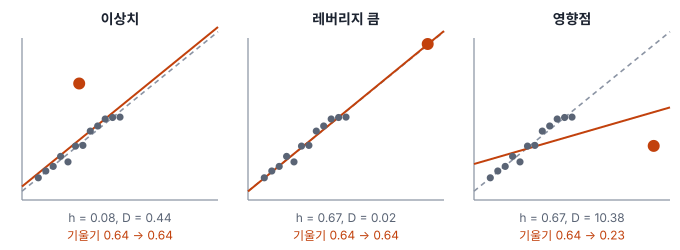
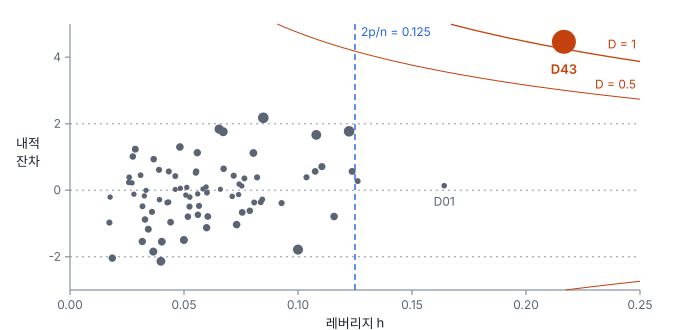

# 8강 말썽꾸러기 변수와 관측치

## 이 강에서 얻는 것

- 설명변수끼리 닮은 다중공선성을 VIF와 조건수로 재고, 계수 해석과 예측 중 무엇이 흔들리는지 구분할 수 있음
- y 방향 이상치, 레버리지가 큰 점, 영향점을 구분하고 쿡의 거리·DFFITS·DFBETAS로 영향력을 잴 수 있음
- 영향점을 무조건 빼지 않고 원인을 확인하며, 로버스트 회귀와 견주어 결론이 얼마나 흔들리는지 볼 수 있음

## 1. 설명변수끼리 닮았을 때

6강에서 가상 도시 80개 행정동의 여름 지표면온도(LST)를 불투수면 비율·NDVI·고도·해안 거리로 설명하는 기본 모형을 세웠고, 7강에서 잔차로 가정을 점검하다가 공단 동 D43이 유독 크게 튀는 것을 봤음. 이 강은 다른 두 가지 말썽을 봄. 설명변수끼리 너무 닮은 경우와, 관측치 하나가 결과를 쥐고 흔드는 경우임.

불투수면이 넓은 동은 식생이 적으므로 불투수면 비율과 NDVI의 상관은 −0.93임. 이처럼 설명변수끼리 강하게 얽힌 상태를 **다중공선성(multicollinearity)**이라고 함. 두 변수를 넣고 빼며 계수를 비교하면 증상이 드러남(고도·해안 거리는 세 모형 모두에 들어 있음).

| 모형 | NDVI 계수 (표준오차) | NDVI p값 | 불투수면 계수 (표준오차) | R² |
|---|---|---|---|---|
| 불투수면 뺌 | −18.7 (1.69) | $< 10^{-16}$ | − | 0.662 |
| NDVI 뺌 | − | − | 0.136 (0.0099) | 0.744 |
| 둘 다 넣음(기본 모형) | −1.48 (3.82) | 0.70 | 0.127 (0.026) | 0.744 |

불투수면을 빼면 NDVI 0.1 증가에 LST 약 1.9℃ 하강으로 매우 강하게 유의한데, 불투수면과 함께 넣으면 계수가 −1.48로 줄고 표준오차가 두 배 넘게 커져 유의하지 않게 됨. 불투수면의 표준오차도 0.0099에서 0.026으로 커짐. 회귀계수는 다른 변수를 고정했을 때의 효과(6강)인데, 두 변수가 거의 함께 움직이면 하나만 달라진 동이 드물어 몫을 나눌 근거가 부족하기 때문임. 그런데 두 계수가 모두 0인지 한꺼번에 보는 F검정은 $F = 92.2$, $p \approx 6 \times 10^{-21}$로 뚜렷함. **합친 효과는 확실한데 누구 몫인지 가르지 못하는 것**이 다중공선성의 전형적인 증상임.

**완전 다중공선성(perfect multicollinearity)**은 한 설명변수가 다른 설명변수들의 정확한 선형결합(각각에 상수를 곱해 더한 것)인 극단임. 동별 피복 비율(불투수면·식생·수계·나지)을 빠짐없이 모두 넣으면 합이 늘 100%라 절편과 겹쳐서, 최소제곱 계수를 하나로 정할 수 없음. 도구에 따라 오류를 내거나 변수 하나를 조용히 빼므로 결과표에서 사라진 변수가 없는지 확인함(범주형 변수의 같은 함정은 10강).

다중분광 밴드도 흔한 원천임. 청·녹·적 가시광 밴드 반사율은 장면의 밝기에 함께 반응해 서로 매우 강하게 상관되는 경우가 많고, NDVI는 적색·근적외 밴드로 계산하므로 NDVI와 두 밴드를 함께 넣어도 얽힘.

## 2. 얼마나 심한가: VIF와 조건수

**분산팽창계수(VIF)**는 변수마다 공선성의 정도를 잼. $j$번째 설명변수를 나머지 설명변수들로 회귀했을 때의 결정계수를 $R_j^2$라 하면 다음과 같음.

$$\mathrm{VIF}_j = \frac{1}{1 - R_j^2}$$

다른 변수들로 잘 설명될수록($R_j^2$가 1에 가까울수록) 커짐. 그 계수의 분산이 다른 설명변수와 상관이 전혀 없을 때보다 몇 배 부풀었는지를 뜻하고, 표준오차로는 $\sqrt{\mathrm{VIF}}$배임.

| 변수 | 불투수면 | NDVI | 고도 | 해안 거리 |
|---|---|---|---|---|
| VIF | 7.24 | 7.05 | 5.72 | 5.52 |

NDVI는 $R_j^2 = 0.858$이라 표준오차가 $\sqrt{7.05} \approx 2.7$배 부푼 셈임. 고도와 해안 거리도 상관이 0.90이라(해안에서 멀수록 높은 지형) VIF가 5를 넘음. 흔히 5나 10을 넘으면 공선성을 의심하지만, 이론적 근거가 있는 경계가 아니라 **관례**임.

**조건수(condition number)**는 설명변수 행렬 전체를 수 하나로 요약함. 행렬의 가장 큰 특이값(행렬이 각 방향으로 자료를 얼마나 늘이고 줄이는지 나타내는 값)을 가장 작은 특이값으로 나눈 것으로, 자료가 거의 퍼져 있지 않은 방향이 있는지를 봄. 단위에 크게 좌우되므로 척도를 맞추고 계산함. 원래 단위 그대로 계산하면 3,274가 나오는데, statsmodels 결과표 아래쪽 "Cond. No." 칸에 3.27e+03으로 찍히고 조건수가 크다는 경고가 붙는 값이 이것임. 고도(m)와 NDVI(0~1)의 단위 차이까지 섞여 부푼 것임. 평균은 빼지 않고 절편 열을 포함해 각 열의 길이를 1로 맞추면(벨슬리의 방식) 43.2이고, 이 방식에서는 30을 넘고 그 방향에 분산이 크게(흔히 절반 넘게) 걸린 계수가 둘 이상이면 심각한 공선성으로 보는 관례가 있음. 각 계수의 분산이 어느 방향에서 나오는지 나눠 보면 가장 좁은 방향에는 불투수면·NDVI·절편이, 그다음으로 좁은 방향(가장 큰 특이값을 그 방향의 특이값으로 나눈 조건 지수가 14.6)에는 고도·해안 거리가 얽혀 있음. 척도 조정과 평균 빼기(중심화) 여부에 따라 값이 크게 달라지므로 다른 보고서의 수치와 비교할 때는 계산 방식부터 확인함.

## 3. 예측은 멀쩡할 수 있음

다중공선성은 계수를 흔들지만 예측은 거의 건드리지 않을 수 있음. 기본 모형과 NDVI를 뺀 모형의 R²는 둘 다 0.744이고, 80개 동의 적합값 차이는 최대 0.20℃임. 한 동씩 빼고 적합해 그 동을 맞히는 검증(15강)의 RMSE(예측 오차 제곱 평균의 제곱근)도 1.83℃와 1.77℃로 비슷함. 계수끼리 몫을 주고받을 뿐 합친 예측은 제자리에 머무는 것임.

단, 새 자료도 같은 상관 구조를 따를 때만 그러함. 옥상녹화로 불투수면도 높고 NDVI도 높은 동처럼 두 변수의 관계가 깨진 곳을 예측하면, 학습 자료에 거의 없던 조합이라 불안정한 계수가 그대로 예측을 흔듦.

대처는 목적에 따라 고름.

- **해석이 목적**: 변수 하나를 빼거나 둘을 합친 지표로 바꿈. VIF만 보고 빼지 말고 이론상 둘 다 필요한지 먼저 따짐
- **주성분 회귀(PCR)**: 설명변수를 주성분분석(19강)으로 서로 상관없는 축으로 돌린 뒤 상위 축 몇 개로 회귀함. 표준화한 불투수면과 NDVI는 첫 주성분 하나가 두 변수 분산의 96.3%를 담음. 공선성은 사라지지만 "불투수면 1%p당 몇 ℃"라는 해석은 어려워짐
- **릿지 회귀(ridge regression)**: 계수 크기에 벌점을 주어 공선성으로 부푼 계수를 0 쪽으로 줄임. 계수가 조금 치우치는 대신 분산이 크게 줄어듦(11강)
- **예측만이 목적**: 그대로 두되, 적용 대상의 변수 조합이 학습 자료 범위 안인지 확인함

## 4. 튀는 관측치 세 종류

1강의 이상치는 값 하나가 무리에서 동떨어진 것이었음. 회귀에서는 튀는 방향을 나눠 봄.

- **y 방향 이상치**: 설명변수는 평범한데 반응값이 회귀선에서 멀리 떨어짐. 잔차가 큼
- **레버리지(leverage)가 큰 점**: 설명변수 조합이 나머지와 동떨어짐. 반응값과는 무관함
- **영향점(influential point)**: 빼면 계수나 적합값이 눈에 띄게 바뀌는 점. 대개 레버리지와 잔차가 함께 클 때 생김

레버리지는 **햇 행렬(hat matrix)**로 계산함. 최소제곱 적합값은 관측값 $y$에 행렬 $H$를 곱한 것과 같음.

$$\hat{y} = Hy, \qquad H = X\left(X^{\top}X\right)^{-1}X^{\top}$$

$y$에 모자(hat)를 씌워 $\hat{y}$로 만든다고 해서 붙은 이름임. 대각원소 $h_{ii}$가 $i$번째 관측의 레버리지로, 자기 관측값이 자기 적합값에 얼마나 반영되는지를 뜻함. $X$만으로 정해지고 $y$와는 무관함. $h_{ii}$는 0~1이고 모두 더하면 계수 개수 $p$(절편 포함)이므로 평균은 $p/n$임. 기본 모형은 $p = 5$, $n = 80$이라 평균 0.0625이고, 그 두 배인 $2p/n = 0.125$(또는 세 배)를 넘으면 크다고 보는 관례가 있음.

공단 동 D43의 레버리지는 0.217로 80개 동 가운데 가장 큼. 불투수면 94%(2위), NDVI 0.07(최저), 해안 거리 39 km(4위)로 여러 변수에서 끝자락에 있음. 그런데 레버리지는 변수 하나씩이 아니라 조합에서 커짐. 불투수면만 넣은 회귀에서는 0.062로 평범하다가 NDVI를 더하면 0.152로 뜀. 불투수면과 NDVI가 이루는 좁은 띠에서 D43의 NDVI가 띠의 예상보다 0.13 낮아, 80개 동 가운데 띠에서 가장 멀리 벗어났기 때문임. 공선성이 강하면 자료가 좁은 띠에 몰려서, 띠를 조금만 벗어나도 레버리지가 커짐.

## 5. 영향력 재기: 쿡의 거리, DFFITS, DFBETAS

영향력은 "그 점을 빼고 다시 적합하면 얼마나 바뀌는가"로 잼. 실제로 80번 다시 적합하지 않아도 한 번의 적합 결과로 계산할 수 있음.

**쿡의 거리(Cook's distance, Cook's D)**는 $i$번째 점을 뺐을 때 모든 적합값이 바뀐 양을 한데 모은 값임.

$$D_i = \frac{r_i^2}{p}\cdot\frac{h_{ii}}{1 - h_{ii}}$$

$r_i$는 7강의 내적 스튜던트화 잔차(그 점까지 포함한 잔차 표준오차 $s$로 나눈 것)임. 앞쪽은 잔차의 크기, 뒤쪽은 레버리지의 크기라서 **둘이 함께 커야 커짐**. $4/n$(여기서는 0.05)을 넘으면 살펴보고 1을 넘으면 강한 영향점으로 보는 관례가 흔함.

**DFFITS(디에프피츠)**는 $i$번째 점을 빼고 적합했을 때 그 점 자신의 적합값이 몇 표준오차만큼 바뀌는지이고, 관례적 기준은 $\lvert\mathrm{DFFITS}\rvert > 2\sqrt{p/n}$(여기서는 0.50)임. **DFBETAS(디에프베타스)**는 계수마다 따로, 그 점을 빼면 $j$번째 계수가 자기 표준오차의 몇 배만큼 바뀌는지이고, 기준은 $2/\sqrt{n}$(여기서는 0.22)임. 쿡의 거리가 영향이 큰지를 알려 주면, DFBETAS는 어느 계수에 영향을 주는지를 알려 줌. 부호는 '전체 계수 − 뺀 뒤 계수' 방향이라 음수면 빼면 계수가 커진다는 뜻임.

D43은 관측 LST 41.2℃, 적합값 34.5℃로 6.7℃나 과소 예측된 동임.

| 지표 | D43 | 관례 기준 |
|---|---|---|
| 레버리지 | 0.217 | 0.125 |
| 내적 스튜던트화 잔차 | 4.46 (외적 5.17) | ±2 |
| 쿡의 거리 | 1.10 | 0.05 / 1 |
| DFFITS | 2.72 | 0.50 |
| DFBETAS (NDVI / 불투수면 / 해안 거리) | −1.74 / −1.15 / 1.34 | 0.22 |

쿡의 거리가 $4/n$을 넘는 동은 5개인데, D43을 뺀 나머지는 모두 0.088 이하라 D43(1.10)과 열 배 넘게 차이 남. 기준을 넘은 점을 기계적으로 줄 세우기보다, 이처럼 무리에서 홀로 떨어진 점을 먼저 봄.

D43 하나를 빼고 다시 적합하면 불투수면 계수는 0.127에서 0.152로 20% 커지고, 해안 거리 계수는 0.0525에서 0.0079로 거의 0이 되며, NDVI 계수는 −1.48에서 +4.26으로 부호가 뒤집힘(6절 표). 공선성으로 이미 표준오차가 큰 계수는 점 하나에 부호까지 바뀜. 두 말썽이 겹친 것임.

## 6. 빼기 전에: 원인 확인과 로버스트 회귀

영향점도 1강의 원칙대로 원인부터 확인함. D43은 해안 반대편 외곽의 공단 동임. 모형의 네 변수 어느 것도 공장 지붕과 포장 야적장이 만드는 추가 열을 담지 못함. 오류가 아니라 **다른 집단**이 섞인 경우임. 이때는 넣은 결과와 뺀 결과를 함께 보고하고 뺀 이유를 적거나, 용도(공업 여부)를 설명변수로 넣어 모형이 그 차이를 설명하게 함(10강). 단, 공업 동이 D43 하나뿐이면 이 변수가 D43만 따로 맞추므로 나머지 계수는 뺀 결과와 똑같아짐. 오류(구름이 섞인 LST, 잘못 잡은 동 경계)라면 고쳐서 다시 넣음. 기준을 넘었다는 이유만으로 빼면 가장 뜨거운 동을 빼고 폭염 대책을 세우는 꼴이 됨.

**로버스트 회귀(robust regression)**는 뺄지 말지를 정하지 않고, 큰 잔차의 영향을 자동으로 줄여 계수를 추정함. 대표인 **후버 손실(Huber loss)**은 잔차가 작으면 최소제곱처럼 제곱으로, 일정 크기 $c$를 넘으면 직선으로만 벌점을 늘림.

$$\rho(e) = \begin{cases} \tfrac{1}{2}e^2 & \lvert e \rvert \le c \\ c\lvert e \rvert - \tfrac{1}{2}c^2 & \lvert e \rvert > c \end{cases}$$

$e$는 잔차를 잔차 척도(흔히 MAD 기반, 1강)로 나눈 값이고, $c = 1.345$를 흔히 씀. 계산은 **반복 재가중 최소제곱(IRLS)**으로 함. 가중치 $w = \min(1,\, c/\lvert e \rvert)$로 가중 최소제곱(7강)을 풀고, 새 잔차로 가중치를 다시 매기기를 반복함. 잔차가 클수록 가중치가 작아짐. 이 자료에서 D43의 가중치는 0.17로 가장 작고, 다음은 0.34임.

| 계수 | 전체 OLS | D43 뺀 OLS | 후버 회귀 |
|---|---|---|---|
| 불투수면 | 0.127 | 0.152 | 0.128 |
| NDVI | −1.48 | 4.26 | 0.85 |
| 고도 | −0.0151 | −0.0081 | −0.0112 |
| 해안 거리 | 0.0525 | 0.0079 | 0.0247 |

세 결과 모두 불투수면 1%p당 0.13~0.15℃ 상승으로 같은 결론을 가리키지만, NDVI 계수는 부호조차 정해지지 않음. 셋이 함께 가리키는 것만 결론으로 삼음. 후버 회귀는 D43을 빼지 않고 가중치를 낮출 뿐임. 또 후버처럼 잔차의 함수를 최소화하는 방식(M 추정)은 레버리지가 큰 점에 약함. 레버리지가 큰 점은 적합선을 자기 쪽으로 끌어당겨 자기 잔차를 작게 만들기 때문임. 레버리지까지 막으려면 MM 추정(튀는 점에 잘 버티는 추정으로 출발점을 잡은 뒤 M 추정으로 다듬는 방법) 같은 방법을 씀(도구마다 이름과 기본값이 다름).

## 현장에서는

연안 정점 40곳의 탁도 실측값을 같은 날 촬영한 위성 영상의 청·녹·적 밴드 반사율로 회귀하는 상황임. 세 밴드를 모두 넣으니 R²는 0.975로 높은데, 청색 계수가 −2.27로 음수가 나옴. 청색만 넣으면 계수가 +5.07로 뚜렷한 양의 관계인데 부호가 뒤집힌 것임. 이 계수를 보고 "청색이 밝을수록 탁도가 낮음"이라고 쓰면 물리적으로 틀린 결론이 됨.

진단해 보니 세 밴드끼리 상관이 0.995~0.997, VIF가 131~213이었음. 적색 하나만 넣어도 R²가 0.973으로 거의 같았음. 탁도 지도를 만드는 것이 목적이므로 적색 밴드 하나(또는 밴드비)로 모형을 줄이고, 보고서에 VIF와 함께 밴드를 줄인 이유를 적음.

## 헷갈리는 쌍

- **이상치 vs 레버리지**: 이상치(y 방향)는 반응값이 선에서 먼 것, 레버리지(x 방향)는 설명변수 조합이 무리에서 먼 것임. 레버리지는 $y$를 보지 않고 계산함.
- **레버리지 vs 영향점**: 레버리지가 커도 선 위에 있으면 영향이 없음(D01). 레버리지와 잔차가 함께 커야 영향점이 됨(D43).
- **VIF vs 조건수**: VIF는 변수마다 하나씩, 조건수는 설명변수 행렬 전체에 하나임. 조건수는 척도 조정 방식에 따라 값이 크게 달라짐.
- **다중공선성 vs 설명변수와 반응의 강한 상관**: 설명변수가 반응과 강하게 상관된 것은 반가운 일임. 문제는 설명변수끼리 닮은 것임.

## 이렇게 지시받음

> 지시: "VIF 10 넘는 변수 다 빼고 다시 돌려."

한꺼번에 빼지 말고 가장 큰 것 하나를 빼고 VIF를 다시 계산함. 짝을 이루던 변수의 VIF는 함께 떨어지기 때문임. 기본 모형에서 NDVI를 빼면 불투수면의 VIF는 7.24에서 1.09가 됨. 5·10은 관례일 뿐이므로 이론상 꼭 필요한 변수라면 남기고 릿지 회귀(11강)를 검토하며, 목적이 예측이면 빼지 않아도 됨을 함께 알림.

> 지시: "Cook's D 1 넘는 동은 빼지 말고 따로 표시해서 원인 적어 줘."

영향점을 목록으로 만들고 동마다 레버리지·잔차·DFBETAS와 원인을 적으라는 뜻임. 넣은 결과, 뺀 결과, 로버스트 회귀 결과를 나란히 두어 결론이 영향점 하나에 달려 있는지 보여 줌. D43처럼 다른 집단이면 용도 변수를 넣는 방안도 같이 제안함.

> 지시: "NDVI 계수 부호가 이상해. 공선성부터 봐."

단순 상관과 다중회귀 계수의 부호가 어긋나면 다중공선성이나 영향점을 먼저 의심함. VIF와 조건수를 계산하고, 영향점을 뺀 결과와 로버스트 회귀 결과에서 부호가 안정적인지 확인함. 부호가 계속 오가면 그 계수 하나로는 해석하지 않는다고 보고함.

## 요약

- 다중공선성은 설명변수끼리 닮아 계수의 몫을 나눌 수 없는 상태로, 표준오차가 커지고 계수가 흔들리지만 예측은 멀쩡할 수 있음
- VIF는 변수별로 분산이 몇 배 부풀었는지, 조건수는 행렬 전체의 불안정을 재며, 5·10·30 같은 기준은 관례임
- 대처는 변수 빼기·합치기, 주성분 회귀, 릿지 회귀 가운데 해석과 예측 중 무엇이 목적인지에 따라 고름
- 레버리지는 x 방향, 이상치는 y 방향으로 튄 것이고, 둘이 함께 크면 영향점이 됨. 쿡의 거리·DFFITS·DFBETAS로 잼
- 영향점은 원인부터 확인하고, 넣은 결과·뺀 결과·로버스트 회귀 결과를 견주어 셋이 함께 가리키는 결론만 씀

## 핵심 용어

| 한글 | 영문 |
|---|---|
| 다중공선성 / 완전 다중공선성 | Multicollinearity / Perfect Multicollinearity |
| 분산팽창계수 | Variance Inflation Factor (VIF) |
| 조건수 | Condition Number |
| 주성분 회귀 | Principal Component Regression (PCR) |
| 릿지 회귀 | Ridge Regression |
| 레버리지 | Leverage |
| 햇 행렬 | Hat Matrix |
| 영향점 | Influential Point |
| 쿡의 거리 | Cook's Distance (Cook's D) |
| 디에프피츠 / 디에프베타스 | DFFITS / DFBETAS |
| 로버스트 회귀 / 후버 손실 | Robust Regression / Huber Loss |
| 반복 재가중 최소제곱 | Iteratively Reweighted Least Squares (IRLS) |
