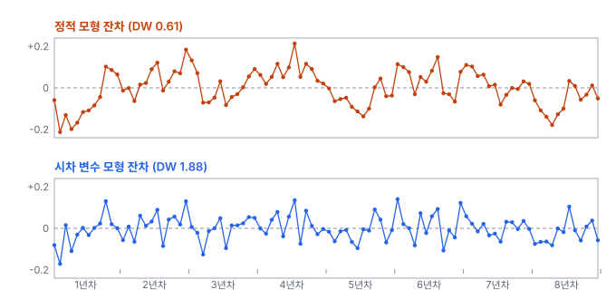
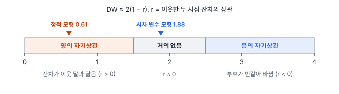
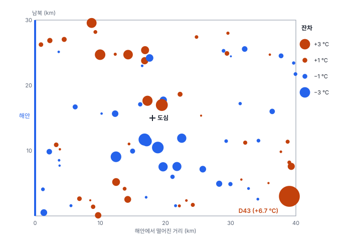

# 9강 시간과 공간이 얽힌 데이터

## 이 강에서 얻는 것

- 잔차에 자기상관이 남으면 계수보다 표준오차가 틀어져 p값이 지나치게 작아지는 이유를 설명할 수 있음
- 더빈-왓슨 값을 읽고, 이 검정이 의미가 있는 자료와 없는 자료를 구분할 수 있음
- 뉴이-웨스트 표준오차, 일반화최소제곱법, 시차 변수 가운데 상황에 맞는 대처를 고르고, 공간 자료에서는 잔차의 모란 지수를 볼 수 있음

## 1. 독립 가정이 깨지는 자료

7강의 LINE 가정 가운데 I(독립성)는 "오차끼리 서로 관련 없음"이었음. 같은 대상을 시간 순서대로 잰 자료와 이웃한 위치에서 잰 자료는 이 가정이 잘 깨짐.

**자기상관(autocorrelation)**은 한 변수가 시간이나 공간에서 가까운 자기 자신의 값과 닮는 정도임. 시간 축이면 "이번 달 값이 지난달 값과 닮음"이고, 공간 축이면 5강의 공간 자기상관임. 회귀에서 문제는 **잔차**의 자기상관, 곧 설명되지 않고 남은 부분이 이웃끼리 닮는 것임.

예로 가상 저수지의 월별 수면적을 봄. 위성 영상의 수계 마스크(물 픽셀을 표시한 층)로 뽑은 8년(96개월)치이고, 평균은 2.47 km²임. 장마철에 강수가 몰려 수면적이 계절에 따라 크게 오르내리므로, 수면적을 월 강수량과 경과 연수로 설명하는 회귀를 세움.

- 강수 계수: 1 mm당 0.0022 km², 결정계수 0.92
- 추세 계수: 연 −0.0141 km²(8년이면 약 0.11 km²), 표준오차 0.0038, p = 0.0004

잔차를 시간 순서로 그려 보면 몇 달씩 같은 부호로 이어짐. 방류 운영, 토양 수분처럼 모형에 없는 요인이 여러 달 이어지기 때문임.

## 2. 무엇이 틀어지나: 표준오차와 유효 표본 수

오차에 자기상관만 있고 모형이 맞다면 OLS 계수는 치우치지 않음. 틀어지는 것은 표준오차임. 보통 공식은 잔차 96개를 독립인 정보 96개로 보고 계산하는데(3강), 이웃 달이 닮았으면 실제 정보는 그보다 적음.

잔차가 한 달 전 잔차의 일정 비율에 새 잡음을 더한 꼴, 곧 $u_t = \rho\, u_{t-1} + \varepsilon_t$(**1차 자기회귀 오차**, AR(1))라고 하면, 평균을 낼 때 독립 자료 몇 개와 맞먹는지(**유효 표본 수**)를 다음과 같이 어림함.

$$n_{\text{eff}} \approx n \cdot \frac{1-\rho}{1+\rho}$$

$\rho$는 이웃한 두 시점 오차의 상관임. 이 예에서 이웃 달 잔차의 상관은 0.69이므로 $n_{\text{eff}} \approx 96 \times 0.31 / 1.69 \approx 18$임. 96개월 자료가 독립 자료 18개어치 정보밖에 없는 셈이고, 표준오차는 $\sqrt{96/18} \approx 2.3$배로 커져야 함. 이 식은 평균에 대한 근사지만, 이 자료에서 AR(1) 오차를 가정해 추세 계수의 표준오차를 직접 계산해도 보통 공식의 약 2.25배로 비슷함.

표준오차가 절반 이하로 잡히면 $t$ 값이 부풀고 p값이 지나치게 작아짐(4강). 다만 자기상관의 원인이 넣은 변수와 얽힌 빠진 변수라면 계수 자체도 치우칠 수 있으므로, 먼저 모형에 빠진 것이 없는지 봄.

## 3. 더빈-왓슨 검정

**더빈-왓슨 검정(Durbin-Watson test)**은 시간 순서로 늘어선 잔차에서 1차 자기상관을 재는 대표 검정임.

$$d = \frac{\sum_{t=2}^{n}\left(e_t - e_{t-1}\right)^2}{\sum_{t=1}^{n} e_t^2} \approx 2\left(1 - r\right)$$

분자는 이웃한 두 달 잔차 차이의 제곱합, 분모는 잔차 제곱합임. 이웃 잔차가 닮을수록 차이가 작아져 $d$가 0으로 가고, 부호가 번갈아 바뀌면 차이가 커져 4로 감. $r$은 이웃한 두 시점 잔차의 상관이며, $r = 0$이면 $d \approx 2$임.

저수지 예의 DW는 0.61이고, $2(1 - 0.69) = 0.62$와 거의 같음. 정식 판정은 표본 수와 설명변수 수로 정해진 임계값 표($d_L$, $d_U$)로 함. $d_L$보다 작으면 양의 자기상관, $d_U$보다 크면 양의 자기상관 근거 없음, 사이면 판정 보류임. 이 자료로 모의실험하면 자기상관이 없을 때 DW의 하위 5% 경계가 약 1.70이라, 0.61은 명백한 양의 자기상관임.

쓰기 전에 확인할 점이 있음.

- **행이 시간 순서로 정렬되어 있어야 함.** DW는 "바로 위 행"과 비교할 뿐, 그 행이 언제인지 모름. 행 순서가 뒤섞이면 숫자는 나오지만 의미가 없음
- **간격이 고르다고 가정함.** 구름 때문에 수면적을 못 뽑은 달을 지우고 이어 붙이면, 바로 위 행이 두 달 전이 되어 이웃 비교가 어긋남
- **1차(바로 이웃)만 봄.** 12개월 전과 닮는 계절성 같은 고차 자기상관은 **브로이시-고드프리 검정(Breusch-Godfrey test)**으로 원하는 시차까지 함께 검정함
- **종속변수의 이전 값을 설명변수로 넣은 모형에서는 2 쪽으로 치우쳐** 자기상관을 놓치기 쉬움. 이때도 브로이시-고드프리 검정을 씀

## 4. 대처: 표준오차 고치기, 오차 구조 넣기, 시차 변수

대처는 세 갈래이며, 무엇을 썼는지 결과표에 적음.

**뉴이-웨스트 표준오차(Newey-West standard error)**는 계수는 OLS 그대로 두고 표준오차만 다시 계산함. 7강의 이분산-강건(HC) 표준오차가 관측마다 자기 잔차 제곱만 반영했다면, 뉴이-웨스트는 정해진 시차 $L$까지 이웃 잔차끼리의 곱(자기공분산)도 더함. 멀리 떨어진 쌍일수록 $1 - l/(L+1)$처럼 줄어드는 가중치를 줌($l$은 두 시점의 간격). 이분산·자기상관에 함께 강건해 HAC 표준오차라고도 부름. 시차는 흔히 $4(n/100)^{2/9}$을 내림한 값에서 시작하며, $n = 96$이면 3임. statsmodels라면 `fit(cov_type="HAC", cov_kwds={"maxlags": 3})`임.

**일반화최소제곱법(generalized least squares, GLS)**은 오차의 공분산 구조(자기상관·이분산)를 모형에 넣어 자료를 변환한 뒤 최소제곱을 적용함. AR(1) 오차라면 각 달 값에서 지난달 값의 $\rho$배를 뺀 $y_t - \rho\, y_{t-1}$(설명변수도 같은 식으로)로 바꿔 회귀함. 지난달에서 이어받은 몫을 덜어 내고 이번 달에 새로 생긴 부분만 남기는 셈임. $\rho$는 모르므로 잔차로 추정해 쓰고, 이렇게 추정한 구조로 하는 GLS가 7강에서 본 FGLS(실행 가능 GLS)임. statsmodels의 `GLSAR(y, X, rho=1).iterative_fit()`이 이 방식이며(`rho=1`은 $\rho$ 값이 아니라 AR 차수), 변환에 앞 달이 필요한 첫 달은 버림.

**시차 변수(lagged variable)**는 $y_{t-1}$, $x_{t-1}$처럼 이전 시점의 값을 설명변수로 넣은 것임. 달에서 달로 이어지는 의존을 모형 구조가 직접 설명하므로 잔차의 자기상관이 줄어듦. 저수지 예에 전월 수면적과 전월 강수량을 넣으면 DW가 0.61에서 1.88로 오름. 다만 전월 수면적을 넣은 모형이라 DW가 2 쪽으로 치우칠 수 있어(3절) 브로이시-고드프리 검정(시차 1)으로 확인하면 p값이 0.50임.

| 방법 | 연 추세 (km²) | 표준오차 | p값 |
|---|---|---|---|
| OLS 보통 표준오차 | −0.0141 | 0.0038 | 0.0004 |
| OLS + 뉴이-웨스트 (시차 3) | −0.0141 | 0.0070 | 0.045 |
| FGLS, AR(1) ($\hat{\rho}$ = 0.72, 첫 달 버림) | −0.0165 | 0.0099 | 0.098 |

뉴이-웨스트는 표준오차만 1.8배가 되었음. 시차를 6으로 늘리면 p = 0.078, 12면 0.10이라 시차도 함께 적어야 함. GLS는 계수 자체를 다시 추정해 값이 조금 다르고, 첫 달을 버리는지(코크런-오컷 방식) 변환해 살리는지(프레이스-윈스텐 방식)에 따라서도 조금 달라짐. 세 결과 모두 감소 방향은 같지만, "p = 0.0004의 뚜렷한 감소"는 "감소 쪽이나 8년 자료로는 확신하기 어려움"으로 바뀜. 유의하지 않다고 추세가 없다는 뜻은 아님(4강).

시차 변수 모형은 계수의 뜻이 바뀌는 점을 조심함. 추세 계수가 −0.0042로 작아졌는데, 이는 "전월 수면적이 같다면 한 해 동안 추가로 줄어드는 몫"임. 전월 수면적 계수(0.70)를 통해 효과가 다음 달로 계속 이어지므로, 장기 효과는 $-0.0042 / (1 - 0.70) \approx -0.014$로 OLS 추세와 같아짐.

## 5. 공간 자료에서의 주의점

2부 공통 자료(80개 행정동의 LST를 불투수면·NDVI·고도·해안 거리로 설명한 기본 모형)에서는 이웃한 동의 잔차가 닮았는지가 질문임.

**DW는 쓰지 않음.** 행정동에는 자연스러운 순서가 없어 정렬에 따라 DW가 바뀜. 같은 잔차가 동 번호 순으로는 1.74, 남북 순으로는 2.07, 동서 순으로는 1.87이고, LST 순으로 정렬하면 1.30까지 내려감(잔차가 종속변수와 상관이 있기 때문). 어느 숫자도 공간 자기상관을 재지 못함.

**대신 잔차에 모란 지수(5강)를 계산함.** 동의 위치(중심점)마다 가장 가까운 동 6개를 이웃으로 잡고(k-최근접 이웃, $k = 6$), 행 표준화한 가중치로 계산하면 잔차의 모란 지수는 0.32임. 자기상관이 없을 때의 기댓값 $-1/79 \approx -0.013$보다 훨씬 크고, 잔차를 무작위로 섞은 9,999번 가운데 이보다 큰 값은 한 번도 없었음. 이웃을 4개·8개로 바꿔도 0.28임. 파이썬은 `libpysal`(가중치)과 `esda`(모란 지수)를 씀. 잔차는 합이 0이 되도록 맞춰져 서로 완전히 독립은 아니어서, 회귀 잔차 전용 검정을 따로 두는 도구도 있음(R `spdep`의 `lm.morantest` 등).

잔차 지도에서는 두 가지를 봄.

- **같은 색 덩어리**: 도심 남쪽(남북 6~13 km, 해안 거리 12~24 km)의 9개 동 가운데 8개가 예측보다 1.1~3.6℃ 시원하고, 북서쪽(남북 23 km 이상, 해안 거리 18 km 이하) 12개 동 가운데 10개는 예측보다 뜨거움. 바람길·하천·해풍처럼 모형에 없는 공간 요인을 의심함
- **홀로 튀는 점**: D43(+6.7℃)은 주변과 다르게 혼자 튐. 자기상관보다는 영향점 문제로 8강에서 다룸

공간 자기상관도 표준오차를 작게 잡히게 함. 불투수면 계수(p < 0.001)처럼 여유가 큰 결론은 버틸 가능성이 크지만, 고도(p = 0.089)처럼 경계에 있는 계수는 믿기 어려움. 대처로는 빠진 공간 변수 넣기, 공간 HAC 표준오차(콘리 표준오차 등), 공간 구조를 모형에 넣는 **공간 회귀**가 있음. 이웃 동의 LST를 설명변수로 넣는 **공간 시차 모형**은 시차 변수의, 오차끼리의 상관을 모형화하는 **공간 오차 모형**은 GLS의 공간판임. 공간 시차 모형은 이웃끼리 LST를 서로 주고받는 구조라 OLS로 맞추지 않고 최대우도(12강) 같은 전용 추정법을 씀. 계수가 지역마다 다르다고 보고 동마다 주변 동에 거리 가중치를 주어 따로 회귀하는 **지리가중회귀(GWR)**도 있음. 예측 모델 검증은 공간 단위로 나눠야 함(15강).

## 현장에서는

연안 정점 한 곳의 월별 클로로필 농도(해색 위성 2차 산출물) 10년치로 "최근 증가 추세가 유의한가"를 보고하는 상황임.

먼저 월별 평균을 빼 계절 성분을 지운 값(이상값, anomaly)으로 추세를 봄. 계절 파동이 잔차에 남으면 자기상관이 크게 부풀기 때문임. 구름으로 산출물이 없는 달은 결측으로 표시해 두고, 결측을 뺀 채 이어 붙인 잔차로 DW를 내지 않음. 이웃 비교는 실제로 한 달 간격인 쌍끼리만 함. 잔차의 DW와 시차 12까지의 브로이시-고드프리 검정을 보고, 자기상관이 남으면 뉴이-웨스트와 AR(1) GLS 결과를 OLS 옆에 나란히 붙임. 한 방법에서만 유의하면 "유의한 증가"라고 쓰지 않음.

## 헷갈리는 쌍

- **자기상관 vs 다중공선성**: 자기상관은 잔차(또는 한 변수)가 시간·공간의 이웃과 닮는 것, 다중공선성은 설명변수끼리 닮는 것임(8강). 원인도 처방도 다름.
- **HC 표준오차 vs 뉴이-웨스트 표준오차**: HC는 이분산만, 뉴이-웨스트(HAC)는 이분산과 자기상관을 함께 고침. 둘 다 계수는 건드리지 않음.
- **GLS vs WLS**: WLS는 오차 분산만 다르고 상관은 없을 때의 GLS임. 자기상관까지 넣으려면 GLS가 필요함.

## 이렇게 지시받음

> 지시: "DW 0.6 나왔네. 추세 p값 그대로 쓰지 말고 Newey-West로 바꿔. 시차는 몇으로 했는지 표 밑에 적고."

양의 자기상관으로 보통 표준오차가 작게 잡혔으니, 계수는 OLS 그대로 두고 표준오차만 HAC로 바꾸라는 뜻임. 시차는 경험식 값(96개월이면 3)에서 시작하되, 월별 자료라 6·12개월로도 돌려 p값이 얼마나 바뀌는지 함께 적음.

> 지시: "월별 자료니까 AR(1) 오차로 GLS 다시 맞춰서 OLS랑 나란히 붙여 줘."

오차 구조를 넣은 추정치와 비교하라는 뜻임. 추정한 $\rho$, 첫 달 처리 방식, 변환 뒤 잔차의 DW(이 예에서는 1.92)를 함께 보고함.

> 지시: "동별 회귀 끝났으면 잔차 Moran's I 먼저 찍어 봐. 남아 있으면 GWR이나 공간 회귀 검토하자."

공간 자료의 독립성은 DW가 아니라 잔차의 모란 지수로 점검하라는 뜻임. 이웃 정의($k$ 또는 거리), 행 표준화 여부, 순열 횟수를 적고, 이웃 정의를 바꿔도 결론이 같은지 확인함. 잔차 지도도 붙여 빠진 변수부터 찾을지 정함.

## 요약

- 시간 순서·이웃 위치로 모은 자료는 잔차에 자기상관이 남기 쉬움(LINE의 I가 깨짐)
- 자기상관은 계수보다 표준오차를 틀어지게 함. 유효 표본 수가 줄어 표준오차가 작게 잡히고 p값이 지나치게 작아짐
- 더빈-왓슨 값은 0~4이고 2 근처면 1차 자기상관이 없음. 시간 순·고른 간격 자료에서만 의미가 있고, 고차 자기상관은 브로이시-고드프리 검정으로 봄
- 대처는 표준오차만 고치기(뉴이-웨스트), 오차 구조 넣기(GLS), 모형 구조 바꾸기(시차 변수)의 세 갈래이며, 시차 변수를 넣으면 계수의 뜻이 바뀜
- 공간 자료에는 DW 대신 잔차의 모란 지수와 잔차 지도를 보고, 남으면 빠진 변수·공간 회귀·공간 교차검증(15강)을 검토함

## 핵심 용어

| 한글 | 영문 |
|---|---|
| 자기상관 / 잔차 자기상관 | Autocorrelation / Residual Autocorrelation |
| 1차 자기회귀 오차 | First-Order Autoregressive Error, AR(1) |
| 유효 표본 수 | Effective Sample Size |
| 더빈-왓슨 검정 | Durbin-Watson Test |
| 브로이시-고드프리 검정 | Breusch-Godfrey Test |
| 뉴이-웨스트 표준오차 | Newey-West Standard Error (HAC SE) |
| 일반화최소제곱법 / 실행 가능 GLS | Generalized Least Squares (GLS) / Feasible GLS (FGLS) |
| 시차 변수 | Lagged Variable |
| 공간 시차 모형 / 공간 오차 모형 | Spatial Lag Model / Spatial Error Model |
| 지리가중회귀 | Geographically Weighted Regression (GWR) |
