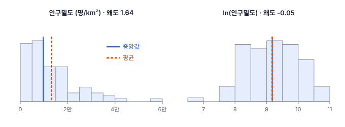
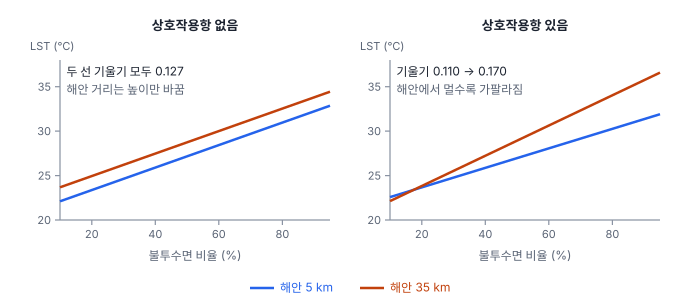

# 10강 변수 다듬기

## 이 강에서 얻는 것

- 꼬리가 긴 변수에 로그·박스-콕스 변환을 적용하고, 로그를 쓴 회귀계수를 % 단위로 정확히 읽을 수 있음
- 표준화와 최소-최대 정규화의 차이를 알고, 정규화 통계를 어디서 계산해 어디에 적용할지 판단할 수 있음
- 상호작용항·다항 항·더미 변수를 넣은 모형의 계수를 해석하고, 더미 변수 함정을 피할 수 있음

## 1. 로그 변환: 긴 꼬리 접기

7강의 잔차 플롯에서 휘어진 패턴이나 부채꼴 퍼짐이 보이면, 모형을 바꾸기 전에 변수의 모양부터 바꿔 볼 수 있음. 2부 공통 자료(가상 도시 80개 동)의 인구밀도는 평균 13,173명/km², 중앙값 9,683명/km²이고 왜도(1강)가 1.64로 오른쪽 꼬리가 김. 각 값에 자연로그를 취하는 **로그 변환(log transformation)**을 하면 왜도가 −0.05로 거의 대칭이 됨.

로그를 쓰는 이유는 셋임.

1. **큰 값 몇 개의 힘을 줄임**: 꼬리 끝 동은 레버리지(8강)가 커서 직선을 끌고 감. 로그를 취하면 10배 차이가 2.3 차이로 줄어듦
2. **곱셈 관계를 덧셈으로 바꿈**: "불투수면이 10%p 늘 때마다 인구밀도가 몇 % 는다"처럼 비율로 움직이는 관계는 로그를 취해야 직선이 됨
3. **이분산을 누그러뜨림**: 클로로필 농도나 탐지 폴리곤 면적처럼 값이 클수록 오차도 비례해 커지는 양은 로그 척도에서 퍼짐이 고르게 됨(7강)

주의할 점도 있음. 회귀의 정규성 가정은 잔차에 대한 것이라(7강) 설명변수를 정규분포로 만들 필요는 없음. 로그는 양수에만 쓸 수 있어 0이 섞이면 $\ln(x+1)$을 흔히 쓰는데, 이 결과는 단위(명/km²인지 명/ha인지)에 따라 달라짐. 섭씨온도처럼 0이 임의로 정해진 척도는 비율 자체가 뜻이 없어서 로그를 취하지 않음.

## 2. 박스-콕스 변환: 얼마나 접을지 자료로 정함

**박스-콕스 변환(Box-Cox transformation)**은 로그를 포함하는 거듭제곱 변환의 모음임.

$$y^{(\lambda)} = \begin{cases} \dfrac{y^{\lambda} - 1}{\lambda} & \lambda \neq 0 \\[2mm] \ln y & \lambda = 0 \end{cases}$$

$\lambda = 1$이면 1을 빼기만 해 모양이 그대로이고, 0.5면 제곱근, 0이면 로그, −1이면 역수와 같은 모양이 됨. 1보다 작을수록 오른쪽 꼬리를 세게 접음. $\lambda$는 변환한 값이 정규분포에 가장 가까워지도록 최대우도(관측된 자료가 나올 가능성이 가장 커지는 값을 고르는 방법, 12강)로 추정함.

인구밀도에 적용하면 $\hat{\lambda} = 0.027$이고 95% 신뢰구간이 −0.21~0.27로 0을 포함함. 그래서 해석이 쉬운 로그를 고름. 0.37처럼 애매한 값이 나와도 가까운 0·0.5·1로 반올림해 쓰는 경우가 많음. 변환한 척도의 계수는 설명하기 어렵기 때문임. 박스-콕스도 양수에만 쓸 수 있고, 0이나 음수가 있으면 비슷한 구조의 여-존슨(Yeo-Johnson) 변환을 씀.

## 3. 로그를 쓴 계수 읽기

로그가 어느 쪽에 붙었는지에 따라 계수 $\beta$를 읽는 법이 달라짐. 이름은 "종속변수-설명변수" 순서이며, 교과서마다 다르게 부르기도 함. 특히 "로그-선형(log-linear)"을 아래 표의 로그-로그 뜻으로 쓰는 책도 있으니 식으로 확인함.

| 형태 | 모형 | $\beta$ 읽는 법 | 공통 자료의 예 |
|---|---|---|---|
| 로그-선형 | $\ln y = a + \beta x$ | $x$ 1단위 증가 → $y$ 약 $100\beta$% 증가 | $\ln$(인구밀도)를 불투수면(%)에 회귀: $\beta = 0.0245$. 불투수면 1%p 증가 → 인구밀도 약 2.5% 증가 |
| 선형-로그 | $y = a + \beta \ln x$ | $x$ 1% 증가 → $y$ 약 $\beta/100$ 증가 | LST를 $\ln$(인구밀도)에 회귀: $\beta = 1.53$. 인구밀도 1% 증가 → 0.015℃, 두 배 → $1.53 \ln 2 \approx 1.06$℃ |
| 로그-로그 | $\ln y = a + \beta \ln x$ | $x$ 1% 증가 → $y$ 약 $\beta$% 증가 (**탄력성**) | $\ln$(인구밀도)를 $\ln$(불투수면)에 회귀: $\beta = 1.23$. 불투수면 50%→50.5% → 인구밀도 약 1.23% 증가 |

로그-선형의 "약 $100\beta$%"는 $\beta$가 작을 때만 맞는 근사이고, 정확한 값은 $100(e^{\beta} - 1)$%임. 1%p 증가는 2.45%(근사)와 2.48%(정확)로 차이가 없지만, 10%p 증가는 근사로 24.5%, 정확히는 $e^{0.245} - 1 \approx$ 27.8%로 벌어짐. 표의 예는 설명변수가 하나뿐인 회귀라 다른 변수의 효과가 섞여 있으며, 읽는 법을 보이기 위한 것임.

로그 척도의 예측을 $e^{(\cdot)}$로 되돌릴 때도 조심함. $\ln$(인구밀도)의 평균 9.17을 되돌리면 9,632명/km²로, 산술평균 13,173이 아니라 중앙값(9,683) 근처가 나옴. 로그의 평균을 되돌리면 기하평균(값을 모두 곱해 $n$제곱근을 취한 평균)이 되는데, 기하평균은 늘 산술평균 이하임. 그래서 되돌린 예측은 평균을 낮게 잡는 경향이 있음.

## 4. 표준화와 최소-최대 정규화

**표준화(standardization)**는 평균을 빼고 표준편차로 나눠 평균 0, 표준편차 1로 맞추는 것이고, 1강의 z점수와 같은 식임. **최소-최대 정규화(min-max normalization)**는 최솟값을 0, 최댓값을 1로 맞춤.

$$z = \frac{x - \bar{x}}{s}, \qquad x' = \frac{x - x_{\min}}{x_{\max} - x_{\min}}$$

둘 다 직선 변환이라 분포 모양은 바꾸지 않음. 긴 꼬리는 그대로 남으므로 로그 변환을 대신하지 못함.

기본 모형(`lst_c ~ imperv_pct + ndvi + elev_m + coast_km`)의 설명변수를 표준화하면 계수가 "1 표준편차 증가당 ℃"가 됨. 불투수면 2.52, 고도 −0.79, 해안 거리 0.61, NDVI −0.20임. 단위가 다른 변수끼리 크기를 견줄 수 있게 되지만 기울기의 $t$값·$p$값과 $R^2$은 그대로임. NDVI가 작게 나온 것은 불투수면과의 상관(−0.93)이 크기를 나눠 가진 탓이지 효과가 없어서가 아님(8강). 11강의 규제는 계수 크기에 벌점을 주므로 표준화가 사실상 필수임.

최소-최대 정규화는 극단값 하나가 범위를 정함. 인구밀도를 이렇게 바꾸면 최댓값 59,528 하나 때문에 80개 동 가운데 60개가 0.275 이하로 몰림. 또 새 자료가 학습 때의 범위를 벗어나면 0 아래나 1 위로 나감. 딥러닝 입력도 밴드마다 이런 정규화를 거치며, 층 안에서 하는 정규화는 29강에서 다룸.

## 5. 상호작용항과 다항 회귀

**상호작용항(interaction term)**은 두 설명변수의 곱을 새 변수로 넣은 것임.

$$\mathrm{LST} = b_0 + b_1\,\text{불투수면} + b_2\,\text{해안거리} + b_3\,(\text{불투수면} \times \text{해안거리}) + \cdots$$

불투수면의 기울기가 $b_1 + b_3 \times \text{해안거리}$가 되어, 해안 거리에 따라 달라짐. 바닷바람이 닿는 해안 쪽은 포장이 늘어도 덜 달아오른다는 가설을 식으로 옮긴 것임. 공통 자료에서는 $b_1 = 0.0996$, $b_3 = 0.00202$($p = 0.049$)라서 기울기가 해안 5 km에서 0.110, 35 km에서 0.170임.

이때 $b_1$만 떼어 "불투수면 효과"라고 읽으면 안 됨. $b_1$은 해안 거리가 0, 즉 해안선 위에서의 기울기임. 해안 거리에서 평균(19.9 km)을 빼고(**중심화**) 곱하면 $b_1$이 평균 거리에서의 기울기(0.140)가 되어 읽기 쉬움. 상호작용항을 넣으면 두 변수 각각의 항도 함께 넣음.

**다항 회귀(polynomial regression)**는 $x^2$, $x^3$ 같은 거듭제곱 항을 넣어 곡선을 맞추는 회귀임. 곡선이지만 계수에 대해서는 선형이라 최소제곱(6강)으로 그대로 추정함. 기본 모형에 NDVI²를 더하면 계수 23.2($p = 0.012$)로 유의함. 그런데 이 곡선의 바닥(가장 낮은 점)은 NDVI 0.42로, 식생이 그보다 많으면 오히려 뜨거워진다는 뜻이라 물리적으로 어색함. $x$와 $x^2$은 상관이 커서(NDVI와 NDVI²는 0.98) 계수가 불안정함. NDVI에서 평균을 뺀 뒤 제곱하면(중심화) 상관이 −0.26으로 줄어듦. 차수를 높일수록 자료 끝에서 곡선이 크게 휘어 외삽(자료 범위 밖 예측)이 위험해짐.

두 결과 모두 공단 동 D43(8강의 영향점)을 빼면 사라짐. 상호작용은 $p = 0.37$, NDVI²는 $p = 0.92$가 됨. 휘어짐이나 기울기 차이가 점 하나에서 나오는지 꼭 확인함.

## 6. 더미 변수와 더미 변수 함정

용도(녹지·주거·상업·공업)처럼 범주로 된 변수는 숫자로 바로 넣을 수 없음. 범주마다 "해당하면 1, 아니면 0"인 열을 만드는데, 이것이 **더미 변수(dummy variable)**임. 절편이 있으면 범주 $k$개 가운데 하나를 **기준 범주**로 빼고 $k-1$개만 넣음.

녹지를 기준으로 용도만 넣으면 절편 25.66℃는 녹지 동의 평균이고, 더미 계수는 주거 +3.30, 상업 +6.11, 공업 +15.58로 각 범주 평균과 녹지 평균의 차이임. 기준을 주거로 바꾸면 녹지 −3.30, 상업 +2.81로 숫자는 바뀌지만 $R^2$(0.689)와 예측은 같음. 기준은 가장 흔하거나 비교의 출발점이 되는 범주로 잡음.

기본 모형 변수를 함께 넣으면 해석이 "불투수면 등이 같을 때의 차이"로 바뀜. 용도가 불투수면 비율로 나뉘어 있어서 주거·상업의 차이는 유의하지 않게 됨. 반면 공업은 D43 한 동뿐이라, 더미가 그 동을 혼자 맞춰 잔차 0, 레버리지 1이 됨. 관측이 한두 개인 범주는 합치거나 따로 다룸.

**더미 변수 함정(dummy variable trap)**은 절편이 있는 모형에 더미를 $k$개 모두 넣는 실수임. 어느 동이든 더미 넷 중 하나만 1이라 네 열의 합이 늘 1이고, 이는 절편 열(모두 1)과 똑같음. 8강의 **완전 다중공선성**이라 계수가 하나로 정해지지 않음. 절편과 더미 4개로 만든 설계행렬(각 동의 설명변수 값을 행으로 쌓은 표)은 열이 5개인데 랭크(서로 독립인 열의 수)가 4임. 도구에 따라 경고만 내고 계수를 내놓기도 함. 이 설계행렬을 statsmodels에 직접 넣으면 절편 25.53, 녹지 +0.14 같은 숫자를 주는데, 무수히 많은 해 가운데 하나일 뿐임. 기준 범주를 하나 빼거나 절편을 빼면 풀림. 절편을 빼면 더미 계수가 각 범주의 평균이 됨.

## 현장에서는

여러 장면의 위성영상으로 토지피복 분류 모델을 학습하는 상황임. 밴드 반사율을 표준화할 때 학습 타일의 근적외선 평균 0.30, 표준편차 0.08을 쓰기로 함. 그런데 검증 장면을 그 장면 자체의 통계(평균 0.34, 표준편차 0.06, 식생이 무성한 여름 장면)로 표준화하면, 반사율 0.38인 같은 픽셀이 학습 기준으로는 1.0, 검증 기준으로는 0.67이 되어 모델에 다른 값으로 들어감.

그래서 정규화 통계는 학습 자료에서만 계산해 파일로 저장하고, 검증·시험·실제 추론에 똑같이 적용함. 전체 자료로 통계를 내면 검증 자료의 정보가 학습에 새어 들어가는 데이터 누수가 됨(15강). 사전학습 가중치를 쓸 때는 그 모델이 학습에 쓴 통계를 따름(48강).

## 헷갈리는 쌍

- **표준화 vs 정규화**: 표준화는 평균 0·표준편차 1, 최소-최대 정규화는 0~1 범위임. "정규화"는 벡터 길이를 1로 맞추기, 배치 정규화(29강) 등 여러 뜻으로 쓰이고 정규분포로 만든다는 뜻이 아니므로, 지시를 받으면 어느 식인지 확인함.
- **%p vs %**: 불투수면 50%가 51%가 되면 1%p 증가, 50.5%가 되면 1% 증가임. 로그-로그의 탄력성은 %를 말함.
- **더미 변수 vs 원-핫 인코딩**: 원-핫 인코딩은 범주 $k$개를 모두 0/1 열로 만드는 것임. 절편이 있는 회귀에서는 하나를 빼야 하지만, 규제(11강)를 거는 모형이나 신경망에서는 $k$개를 모두 쓰는 경우가 많음.
- **다항 회귀 vs 비선형 회귀**: 다항 회귀는 곡선이어도 계수에 대해 선형이라 최소제곱으로 풀림. $e^{bx}$처럼 계수가 식 안에 들어간 모형은 반복 계산이 필요한 비선형 회귀임.

## 이렇게 지시받음

> 지시: "인구밀도는 로그 씌워서 넣고, 계수는 % 기준으로 풀어서 보고해."

선형-로그 모형이면 "인구밀도 1% 증가당 LST $\beta/100$℃"나 "두 배일 때 $\beta \ln 2$℃"로 적음. 인구밀도가 0인 동(산림·공단)이 있으면 로그를 취할 수 없으므로, $\ln(x+1)$을 쓸지 그 동을 따로 다룰지 먼저 확인함.

> 지시: "밴드 정규화 통계는 학습 타일에서만 뽑아서 모델이랑 같이 저장해."

밴드별 평균·표준편차(또는 최소·최댓값)를 학습 타일로만 계산해 모델 파일 옆에 두고, 검증·추론 때 다시 계산하지 말고 불러 쓰라는 뜻임. 새 장면마다 통계를 다시 내면 같은 반사율이 다른 입력이 되고, 전체로 내면 누수가 됨(15강).

> 지시: "용도 더미 넣을 때 기준은 녹지로 잡아."

모든 용도 계수를 "녹지 대비 몇 ℃"로 읽겠다는 뜻임. 도구가 알파벳·가나다순으로 기준을 자동으로 고르기도 하므로(이 자료라면 1개 동뿐인 공업이 기준이 됨) 기준 범주를 직접 지정하고, 관측이 너무 적은 범주(공업 1개)는 합칠지 함께 보고함.

## 요약

- 로그 변환은 긴 꼬리를 접고 곱셈 관계를 직선으로 바꿈. 박스-콕스는 $\lambda$로 접는 정도를 추정하고, 0 근처면 로그를 씀
- 로그-선형은 "1단위당 약 $100\beta$%", 선형-로그는 "1%당 $\beta/100$", 로그-로그는 "1%당 $\beta$%"로 읽음. $\beta$가 크면 $e^{\beta} - 1$을 씀
- 표준화와 최소-최대 정규화는 모양을 바꾸지 않는 직선 변환이며, 통계는 학습 자료에서만 계산해 모든 자료에 똑같이 적용함
- 상호작용항은 한 변수의 기울기가 다른 변수에 따라 달라지게 하고, 다항 항은 곡선을 맞춤. 둘 다 중심화하면 읽기 쉽고, 영향점 하나로 생길 수 있음
- 범주 $k$개는 기준 범주를 뺀 $k-1$개 더미로 넣음. $k$개를 다 넣으면 절편과 완전 다중공선성이 되는 더미 변수 함정에 빠짐

## 핵심 용어

| 한글 | 영문 |
|---|---|
| 로그 변환 | Log Transformation |
| 박스-콕스 변환 | Box-Cox Transformation |
| 탄력성 | Elasticity |
| 표준화 | Standardization (z-score) |
| 최소-최대 정규화 | Min-Max Normalization |
| 상호작용항 | Interaction Term |
| 중심화 | Centering |
| 다항 회귀 | Polynomial Regression |
| 더미 변수 / 기준 범주 | Dummy Variable / Reference Category |
| 더미 변수 함정 | Dummy Variable Trap |
| 원-핫 인코딩 | One-Hot Encoding |
