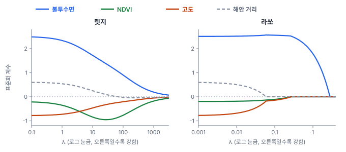
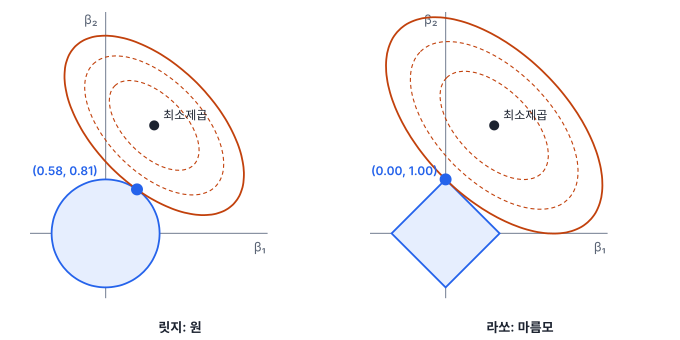
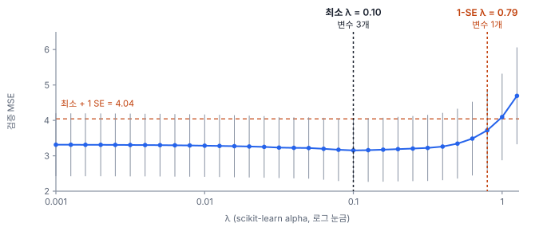

# 11강 규제와 모형 선택

## 이 강에서 얻는 것

- 릿지·라쏘·엘라스틱 넷이 계수를 줄이는 방식(수축)의 차이를 알고, 얽힌 변수가 많을 때 알맞은 것을 고를 수 있음
- 교차검증 오차와 1 표준오차 규칙으로 규제 강도를 정할 수 있음
- AIC·BIC로 후보 모형을 비교하고, 단계적 선택의 함정을 피해 간결한 모형을 고를 수 있음

## 1. 계수가 흔들릴 때: 수축이라는 발상

2부 공통 자료(가상 도시 80개 동의 여름 LST)의 기본 모형은 LST를 불투수면 비율·NDVI·고도·해안 거리로 설명함. 8강에서 봤듯 불투수면과 NDVI는 상관이 −0.93임. 최소제곱으로 맞추면 NDVI 계수는 −1.48인데 95% 신뢰구간이 −9.08~6.12라서 부호조차 정해지지 않음. 영향점 D43(8강) 하나만 빼고 다시 맞추면 +4.26으로 부호가 뒤집힘. 거의 같은 정보(도시화 정도)를 담은 두 변수가 몫을 어떻게 나눌지 자료가 정해 주지 못해서, 표본이 조금만 바뀌어도 계수가 크게 흔들리는 것임.

**규제(regularization)**는 계수가 커지는 데 벌점을 매겨 이 흔들림을 누르는 방법임. 최소제곱이 잔차제곱합만 줄인다면, 규제 회귀는 여기에 계수 크기의 벌점을 더한 값을 줄임.

$$\min_{\beta}\; \sum_{i}\left(y_i - \hat{y}_i\right)^2 + \lambda\, P(\beta)$$

$P(\beta)$는 계수 크기를 재는 벌점이고, $\lambda$(람다)는 벌점의 비중인 **규제 강도(regularization parameter)**임. $\lambda = 0$이면 최소제곱과 같고, 키울수록 계수가 0 쪽으로 끌려감. 이 효과를 **수축(shrinkage)**이라 부름. 수축된 계수는 참값에서 조금 치우치지만(편향) 표본에 따라 덜 흔들림(분산 감소). 둘을 합친 예측 오차가 가장 작은 지점을 찾는 것이 목표이며, 이 맞교환은 14강(편향-분산 트레이드오프)에서 자세히 다룸. 신경망의 가중치 감쇠(29강)도 같은 뿌리임.

규제 전에는 설명변수를 **표준화**(10강)함. 벌점은 계수의 숫자 크기에 매겨지는데, 그 크기는 단위에 따라 달라짐. 불투수면(%)의 계수는 0.127, NDVI(0~1)의 계수는 −1.48로 숫자가 열 배 넘게 차이 나지만 중요도 차이가 아니라 단위 차이임. 표준화하지 않으면 값의 범위가 좁은 변수가 괜히 벌점을 더 받음. 표준화하면 계수는 "변수가 1 표준편차 변할 때 LST 변화(℃)"로 같은 잣대에 놓임. 절편은 벌점에서 뺌. scikit-learn은 표준화를 해 주지 않아 `StandardScaler`를 앞에 붙이고, R의 glmnet은 기본으로 표준화함.

## 2. 릿지와 라쏘

**릿지 회귀(ridge regression)**는 계수 제곱합을 벌점으로 씀(L2 벌점). **라쏘 회귀(lasso regression)**는 계수 절댓값 합을 씀(L1 벌점).

$$P_{\text{릿지}}(\beta) = \sum_j \beta_j^2, \qquad P_{\text{라쏘}}(\beta) = \sum_j \lvert \beta_j \rvert$$

기본 모형에 적용한 표준화 계수(℃/1 표준편차)임. scikit-learn은 표준편차를 $n$으로 나눠서 10강의 값과 끝자리가 조금 다름. $\lambda$는 scikit-learn의 `alpha` 값이고, 릿지와 라쏘는 벌점 식의 배율이 달라 $\lambda$ 숫자끼리는 비교하지 않음.

| 모형 | 불투수면 | NDVI | 고도 | 해안 거리 |
|---|---|---|---|---|
| 최소제곱 | 2.51 | −0.20 | −0.79 | 0.61 |
| 릿지 $\lambda = 10$ | 1.72 | −0.84 | −0.46 | 0.25 |
| 라쏘 $\lambda = 0.1$ | 2.56 | −0.11 | −0.14 | 0 |
| 라쏘 $\lambda = 0.3$ | 2.49 | 0 | 0 | 0 |

릿지는 계수 전체의 크기를 줄이되 정확히 0으로 만들지는 않음. 다만 모든 계수가 함께 줄어드는 것은 아니고, 얽힌 변수끼리 몫을 나눠 줌. 불투수면에 몰린 몫 일부가 NDVI로 옮겨 간 것이 그 예임. 한쪽에 몰아주는 것보다 나눠 주는 편이 제곱합 벌점이 작기 때문임. 부트스트랩(3강)으로 2,000번 다시 맞춰 보면 NDVI 계수의 표준편차가 최소제곱 0.74에서 릿지($\lambda = 10$) 0.36으로 절반 아래로 줄어듦. 흔들림을 줄인 대가로 약간의 편향을 받아들인 것이고, 검증 오차(4절)도 3.32에서 3.21로 조금 낮아짐.

라쏘는 $\lambda$가 어느 정도 커지면 계수를 **정확히 0**으로 만들어 변수를 빼 버림. 수축과 변수 선택을 한꺼번에 하는 셈임. $\lambda = 0.1$에서 불투수면 계수가 오히려 커진 것은 줄어든 NDVI의 몫을 넘겨받았기 때문임. $\lambda$를 키우면 해안 거리(약 0.06), NDVI(0.26), 고도(0.27), 불투수면(2.79) 순으로 빠짐.

0이 되는 이유는 그림으로 보면 분명함. 벌점을 더하는 것은 "계수 크기의 예산 안에서 잔차제곱합을 가장 작게 하라"는 것과 같음. 계수가 둘일 때 릿지의 예산 영역은 원, 라쏘는 축 위에 꼭짓점이 있는 마름모임. 잔차제곱합이 같은 점들은 최소제곱 추정값을 둘러싼 타원을 이루고, 해는 타원을 키워 가다 예산 영역에 처음 닿는 점임. 마름모는 꼭짓점이 튀어나와 있어 타원이 꼭짓점에 먼저 닿기 쉽고, 꼭짓점에서는 한 계수가 0임. 원에는 꼭짓점이 없어 두 계수가 모두 0이 아닌 점에서 닿음.

## 3. 엘라스틱 넷: 얽힌 밴드 묶음

라쏘는 서로 강하게 얽힌 변수 묶음에서 하나나 둘만 남기고 나머지를 0으로 만드는 경향이 있음. 무엇을 남길지는 표본의 작은 차이로 정해짐. 이웃한 파장끼리 값이 거의 같은 다중분광·초분광 밴드가 대표적인 경우임.

가상 예로, 필지 60곳에서 현장 측정한 작물 엽록소 함량을 초분광 밴드 10개로 추정함. B1~B3은 가시광, B4~B7은 적색 경계(red-edge, 적색과 근적외선 사이의 파장대), B8~B10은 근적외선이고, 적색 경계 네 밴드끼리의 상관은 0.998임. 참 모형은 적색 경계 네 밴드가 똑같이(표준화 계수 약 0.5씩) 기여하도록 만듦.

- 라쏘($\lambda$는 교차검증으로 고름)는 적색 경계 가운데 B6(0.69)과 B7(1.35)만 남기고 B4·B5를 0으로 만듦
- 표본을 부트스트랩으로 200번 다시 뽑아 맞추면, 가장 큰 계수를 받는 밴드가 B7 109번, B6 43번, B5 25번, B4 23번으로 그때그때 바뀜

이 결과를 보고 "엽록소에는 B7이 중요함"이라고 쓰면 틀림. 네 밴드가 똑같이 중요한데 라쏘가 대표를 임의로 뽑았을 뿐임.

**엘라스틱 넷(elastic net)**은 두 벌점을 섞음.

$$P(\beta) = \alpha \sum_j \lvert\beta_j\rvert + \frac{1-\alpha}{2}\sum_j \beta_j^2$$

$\alpha$는 섞는 비율(scikit-learn의 `l1_ratio`)로 1이면 라쏘, 0이면 릿지임. L2 부분이 얽힌 변수들의 계수를 서로 비슷하게 끌어당기고, L1 부분은 관계없는 변수를 여전히 0으로 만듦. 같은 자료에 $\alpha = 0.5$로 맞추면 B4~B7이 0.39, 0.37, 0.55, 0.73으로 모두 남고, 부트스트랩 200번에서 네 밴드가 남는 비율이 각각 92~100%임. 적색 경계 계수의 합은 라쏘 2.04, 엘라스틱 넷 2.03으로 거의 같음. 묶음 전체의 효과는 같고 나누는 방식만 다른 것임.

## 4. 규제 강도 고르기: 교차검증과 1 표준오차 규칙

$\lambda$는 자료에서 추정하는 값이 아니라 밖에서 정해 주는 **하이퍼파라미터**임. 보통 **교차검증(cross-validation)**으로 고름. 자료를 $k$개 겹으로 나눠, 한 겹을 빼고 맞춘 모형으로 뺀 겹을 예측해 오차를 재는 일을 겹마다 반복해 평균내는 방법임(15강에서 자세히 다룸). $\lambda$ 후보마다 이 검증 오차를 구해 가장 작은 곳을 $\lambda_{\min}$이라 부름.

기본 모형에 라쏘를 10겹 교차검증으로 맞추면 $\lambda_{\min} = 0.10$이고 검증 MSE(평균제곱오차)는 3.15, 남는 변수는 3개임. 그런데 겹마다 오차가 달라서 이 평균 자체에도 표준오차(3강)가 있고, 여기서는 0.89로 큼. D43이 든 겹의 MSE가 10.3으로 튀었기 때문임. 최소 3.15와, $\lambda$가 아주 작을 때(거의 최소제곱)의 3.31은 이 흔들림 안에서 구별되지 않음.

**1 표준오차 규칙(one-standard-error rule, 1-SE 규칙)**은 최소 오차에 그 표준오차를 더한 값(3.15 + 0.89 = 4.04) 이내에 드는 $\lambda$ 가운데 가장 큰 것, 즉 가장 단순한 모형을 고름. "최소와 통계적으로 구별되지 않을 만큼 좋은 모형 중 가장 단순한 것"이라는 뜻임. 여기서는 $\lambda \approx 0.79$에서 불투수면 하나만 남음.

주의할 점이 셋 있음.

- 겹을 나누는 무작위 시드와 $\lambda$ 후보 격자에 따라 $\lambda_{\min}$이 달라짐(시드 1이면 0.079). 이 자료에서 1-SE 규칙의 선택은 시드 0·1·2에서 같았음
- 동끼리 공간 자기상관(5강)이 있어서 무작위로 나눈 겹은 검증 오차를 낙관적으로 만듦. 공간 블록으로 나누는 방법을 검토함(15강)
- 라쏘 계수는 수축된 값임. 1-SE 모형의 불투수면 계수는 1.99인데, 불투수면 하나로 최소제곱을 다시 맞추면 2.79임. 계수를 해석해 보고할 때는 고른 변수로 다시 맞춘 값을 함께 적음

## 5. 정보기준: AIC와 BIC

교차검증 없이, 전체 자료에 한 번 맞춘 결과로 모형을 비교하는 방법도 있음. 적합도는 **우도**(likelihood, 모형이 관측 자료를 만들어 낼 그럴듯함, 12강)의 로그 $\ln L$로 잼. 변수를 더하면 적합도는 항상 좋아지므로(6강의 $R^2$처럼) 모수 개수 $k$에 벌점을 줌.

$$\mathrm{AIC} = -2\ln L + 2k, \qquad \mathrm{BIC} = -2\ln L + k\ln n$$

**아카이케 정보기준(Akaike information criterion, AIC)**은 모수 하나에 2만큼 벌점을 주며, 새 자료를 잘 예측할 모형을 고르는 것을 목표로 함. **베이즈 정보기준(Bayesian information criterion, BIC)**은 벌점이 $\ln n$이라 동 80개면 4.38로 AIC의 두 배가 넘고, 그만큼 단순한 모형을 고름. 둘 다 작을수록 좋고, 값 자체보다 모형 간 차이가 의미 있음. 차이가 2 이하면 거의 구별되지 않는다고 보는 어림 기준을 흔히 씀.

statsmodels로 계산한 후보 모형 비교임($k$는 절편 포함 계수 개수).

| 모형 | $k$ | $R^2$ | AIC | BIC |
|---|---|---|---|---|
| 불투수면 | 2 | 0.733 | 314.3 | 319.1 |
| 불투수면 + 고도 | 3 | 0.737 | 315.0 | 322.1 |
| 기본 모형(4개) | 5 | 0.744 | 316.9 | 328.8 |
| 기본 모형 + 로그 인구밀도 | 6 | 0.769 | 310.6 | 324.9 |
| 불투수면 + 로그 인구밀도 | 3 | 0.762 | 307.1 | 314.3 |

$R^2$는 변수를 넣을수록 올라가지만, 기본 모형은 불투수면 하나짜리보다 AIC·BIC가 모두 나쁨. NDVI·고도·해안 거리가 더하는 설명력이 벌점만 못하다는 뜻임. 비교는 **같은 자료, 같은 반응변수**끼리만 함. LST와 로그 LST를 반응으로 한 모형, D43을 뺀 자료로 맞춘 모형과는 비교할 수 없음. $k$를 세는 방식도 도구마다 달라서(R의 `AIC()`는 오차분산까지 세어 statsmodels보다 2 큼) 한 도구 안에서만 비교함.

## 6. 단계적 선택과 파시모니 원칙

**단계적 선택(stepwise selection)**은 변수를 하나씩 더하거나(전진 선택) 빼면서(후진 제거) 기준(AIC, p값 등)을 가장 많이 개선하는 쪽으로 옮겨 가다가, 더 나아지지 않으면 멈추는 절차임. 후보 5개(기본 4개 + 로그 인구밀도)에 AIC 기준으로 적용하면 전진·후진 모두 위 표 마지막 줄의 "불투수면 + 로그 인구밀도"에서 멈춤. 로그 인구밀도 계수는 −0.86, p = 0.003으로 "인구가 많은 동일수록 시원하다"는 결론이 나옴. 인구밀도는 불투수면과 양의 상관(0.60)인데도 그럼.

원인은 D43임. 공단 동 D43은 80개 동 중 인구밀도가 가장 낮고 LST는 41.2℃로 가장 뜨거움. 이 한 곳을 맞추려고 인구밀도가 들어간 것이고, D43을 빼고 다시 돌리면 인구밀도는 뽑히지 않고 "불투수면 + 고도"가 뽑힘. 단계적 선택의 약점이 여기 다 들어 있음.

- **불안정함**: 관측치 하나로 선택이 바뀜. 한 번에 한 변수씩만 보는 탐욕적 절차라 더 나은 조합을 놓치기도 함
- **p값이 왜곡됨**: 여러 후보를 시험해 가장 좋아 보이는 것을 고른 뒤의 p값은 4강의 다중비교와 같은 이유로 지나치게 작음. 반응과 무관한 잡음 변수 20개를 후보로, 관측치 80개에서 p < 0.05면 넣는 전진 선택을 2,000번 모의실험하면 65%에서 잡음 변수가 하나 이상 뽑히고(검정 20번이 독립이라 치면 $1 - 0.95^{20} \approx 0.64$), 29%에서는 둘 이상 뽑힘. 뽑힐 때의 p값은 정의상 0.05 아래라서 겉으로는 유의한 변수처럼 보임
- **해석이 부풀려짐**: 선택에 쓴 자료로 계산한 계수·신뢰구간을 그대로 보고하면 효과를 과장함

그래서 단계적 선택의 결과는 확정된 결론이 아니라 후보 목록으로 다루고, 규제나 따로 떼어 둔 검증 자료로 확인함.

**파시모니 원칙(principle of parsimony)**은 설명력이 비슷하면 모수가 더 적은 단순한 모형을 택하라는 원칙임(오컴의 면도날). AIC·BIC의 벌점, 1-SE 규칙, 라쏘가 모두 이 원칙을 숫자로 옮긴 것임. 단순한 모형은 과적합이 적고, 설명하기 쉽고, 운영할 때 준비할 입력 레이어가 적음. 다만 단순함이 목표 자체는 아님. 교란변수(5강)를 빼면 남은 계수가 치우치므로, 무엇을 빼도 되는지는 도메인 지식과 함께 판단함.

## 현장에서는

행정동 120곳의 여름 LST를 설명할 후보로 Sentinel-2 밴드 10개, 분광지수 15개(NDVI·NDBI·NDWI 등), 건물·도로 벡터에서 뽑은 구조 변수 10개, 모두 35개를 준비한 상황임. 변수 수가 동 수의 3분의 1에 가깝고, 밴드와 그 밴드로 만든 지수끼리 상관이 0.9를 넘는 쌍이 많음.

최소제곱으로는 계수가 크게 흔들리므로 모든 변수를 표준화한 뒤 엘라스틱 넷을 쓰고, 섞는 비율 몇 개와 $\lambda$를 공간 블록 교차검증으로 함께 고름. 1-SE 규칙으로 변수를 줄이고, 부트스트랩 선택 빈도를 함께 봐서 "NIR 계열 묶음", "건물 밀도 묶음"처럼 묶음 단위로 해석함. 해석용 최종 모형은 남은 변수로 최소제곱을 다시 맞춰 VIF·영향점 진단(8강)을 거치고, 시도한 후보와 선택 절차를 모두 기록함.

## 헷갈리는 쌍

- **릿지 vs 라쏘**: 릿지는 줄이기만 하고, 라쏘는 0으로 만들어 변수를 고름. 얽힌 묶음에서 릿지는 몫을 나누고 라쏘는 하나를 고름.
- **0이 된 계수 vs 효과 없음**: 라쏘가 0으로 만든 변수는 "이 $\lambda$에서 다른 변수가 이미 그 정보를 담고 있음"이라는 뜻임. 효과가 없다는 뜻이 아님.
- **scikit-learn의 alpha vs glmnet의 alpha**: scikit-learn은 `alpha`가 규제 강도 $\lambda$이고 `l1_ratio`가 섞는 비율임. glmnet은 `lambda`가 규제 강도이고 `alpha`가 섞는 비율임.
- **AIC vs BIC**: AIC는 예측, BIC는 단순함 쪽으로 기움. $n \ge 8$이면 $\ln n > 2$라서 BIC가 더 엄격함.

## 이렇게 지시받음

> 지시: "밴드랑 지수 다 넣고 라쏘 돌려서 살아남은 것만 보고서에 중요 변수로 써."

라쏘의 선택을 변수 중요도로 쓰겠다는 뜻인데, 얽힌 밴드 묶음에서는 대표를 임의로 뽑으므로 위험함(3절). 표준화했는지 확인하고, 부트스트랩 선택 빈도와 엘라스틱 넷 결과를 함께 내서 "적색 경계 묶음"처럼 묶음 단위로 쓰자고 제안함.

> 지시: "λ는 CV 최소 말고 1-SE로 잡아. 변수 적은 게 운영하기 편해."

1 표준오차 규칙으로 더 단순한 모형을 고르라는 뜻임. 검증 오차 곡선에 두 $\lambda$의 오차와 남는 변수 수를 함께 표시해 보고함. 교차검증은 공간 블록으로 나누고, 시드를 바꿔도 선택이 유지되는지 확인함.

> 지시: "스텝와이즈로 뽑은 모형 p값 그대로 표에 넣지 마. 후보 모형 AIC 표로 보여 줘."

선택 뒤의 p값은 다중비교 때문에 지나치게 작다는 점(4강)을 경계한 것임. 후보 모형 몇 개의 $k$·AIC·BIC를 같은 자료, 같은 반응변수로 계산해 표로 내고, 선택을 좌우한 영향점이 있는지(8강) 함께 확인함.

## 요약

- 규제는 잔차제곱합에 계수 크기의 벌점을 더해 계수를 0 쪽으로 수축시키고, 약간의 편향을 받아들여 흔들림(분산)을 줄임. 규제 전에는 표준화함
- 릿지(L2)는 고르게 줄이고 얽힌 변수에 몫을 나눔. 라쏘(L1)는 계수를 정확히 0으로 만들어 변수를 고르지만, 얽힌 묶음에서는 대표를 임의로 뽑음. 엘라스틱 넷은 둘을 섞어 묶음을 함께 남김
- 규제 강도 λ는 교차검증으로 고르고, 1 표준오차 규칙은 최소 오차와 구별되지 않는 모형 중 가장 단순한 것을 고름
- AIC·BIC는 적합도에 모수 개수 벌점을 더한 기준으로, 같은 자료·같은 반응변수끼리만 비교함. BIC가 더 단순한 모형을 고름
- 단계적 선택은 불안정하고 선택 뒤 p값을 왜곡하므로 후보 목록으로만 쓰고, 설명력이 비슷하면 단순한 모형을 택함(파시모니 원칙)

## 핵심 용어

| 한글 | 영문 |
|---|---|
| 규제 / 규제 강도 | Regularization / Regularization Parameter (λ) |
| 수축 | Shrinkage |
| 릿지 회귀 | Ridge Regression |
| 라쏘 회귀 | Lasso Regression |
| 엘라스틱 넷 | Elastic Net |
| 하이퍼파라미터 | Hyperparameter |
| 교차검증 | Cross-Validation |
| 1 표준오차 규칙 | One-Standard-Error Rule (1-SE Rule) |
| 우도 | Likelihood |
| 아카이케 정보기준 | Akaike Information Criterion (AIC) |
| 베이즈 정보기준 | Bayesian Information Criterion (BIC) |
| 단계적 선택 (전진 선택 / 후진 제거) | Stepwise Selection (Forward Selection / Backward Elimination) |
| 파시모니 원칙 | Principle of Parsimony |
