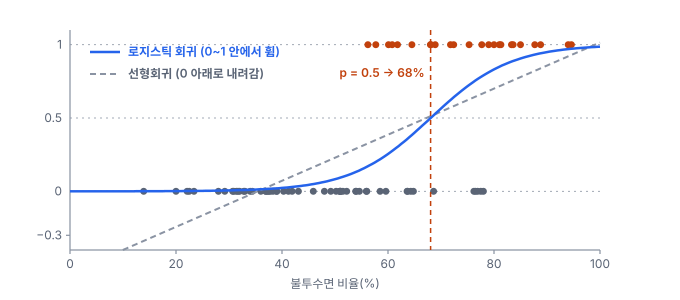
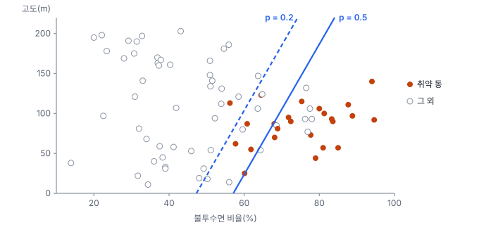

# 12강 확률을 예측하는 회귀

## 이 강에서 얻는 것

- 0/1 결과를 직선으로 맞추면 안 되는 이유와, 오즈·로짓·시그모이드로 이를 푸는 방법을 설명할 수 있음
- 로지스틱 회귀의 계수를 오즈비와 신뢰구간으로 바르게 읽고, 결정 경계와 임계값을 정할 수 있음
- 로그 손실과 다항 로지스틱 회귀가 딥러닝 분류기의 마지막 층과 같은 구조임을 알 수 있음

## 1. 0과 1을 직선으로 맞추면

2부 공통 자료(가상 도시 80개 동)의 `heat_warn`은 여름철 지표면온도(LST)가 상위 30%에 드는 폭염 취약 동이면 1, 아니면 0인 변수임. 80개 동 가운데 24개가 1임. 이 값을 불투수면 비율(%)로 설명하려고 6강의 최소제곱 직선을 그대로 맞추면 다음이 나옴.

$$\hat{y} = -0.557 + 0.0157 \times \text{불투수면}$$

예측값을 확률로 읽으려 하면 문제가 생김. 불투수면이 13.9%인 동의 예측값은 −0.34이고, 80개 동 중 16개가 0보다 작게 나옴. 확률이 음수일 수는 없음. 또 직선이라서 불투수면이 20%에서 30%로 늘든 70%에서 80%로 늘든 확률이 똑같이 0.157씩 오름. 실제로는 양 끝에서 변화가 작고 가운데에서 크게 바뀌는 S자 모양이 자연스러움. 같은 불투수면에서 잔차가 두 값뿐이라 7강의 정규성·등분산 가정도 깨짐.

## 2. 오즈, 로짓, 시그모이드

해법은 확률을 −∞~+∞ 범위로 펴는 변환을 찾아, 그 변환된 값을 직선으로 맞추는 것임.

**오즈(odds)**는 일어날 확률을 일어나지 않을 확률로 나눈 값임. 확률 0.8이면 오즈는 $0.8/0.2 = 4$로, "4 대 1"이라는 뜻임. 확률 0~1이 오즈 0~∞로 펴짐. 여기에 로그를 씌운 **로그 오즈(log-odds)**를 **로짓(logit)**이라 부르며, 이제 −∞~+∞ 전체를 씀.

$$\operatorname{logit}(p) = \ln\frac{p}{1-p}$$

| 확률 $p$ | 0.1 | 0.3 | 0.5 | 0.8 | 0.9 |
|---|---|---|---|---|---|
| 오즈 | 0.111 | 0.429 | 1 | 4 | 9 |
| 로짓 | −2.20 | −0.85 | 0 | 1.39 | 2.20 |

확률 0.5가 로짓 0이고, 0.1과 0.9는 부호만 반대임. **로지스틱 회귀(logistic regression)**는 이 로짓을 설명변수의 직선으로 둔 모형임.

$$\operatorname{logit}(p) = \beta_0 + \beta_1 x_1 + \cdots + \beta_k x_k$$

반대로 직선의 값 $z$에서 확률을 되찾는 함수가 **시그모이드 함수(sigmoid function)**이며, 로지스틱 함수라고도 부름.

$$p = \sigma(z) = \frac{1}{1 + e^{-z}}$$

$z$가 아무리 커도 1을 넘지 않고, 아무리 작아도 0 아래로 내려가지 않음. 공통 자료에 맞추면 로짓 $= -9.08 + 0.133 \times \text{불투수면}$이 나옴. 불투수면 50%에서 확률 0.083, 60%에서 0.255, 70%에서 0.565, 80%에서 0.831로, 가운데에서 가파르고 양 끝에서 완만한 S자가 됨.

## 3. 계수를 구하는 법: 최대우도추정과 로그 손실

0/1 결과에는 "잔차 제곱합 최소"가 맞지 않으므로, 계수는 **최대우도추정(MLE)**으로 구함. **우도(likelihood)**는 "이 계수가 맞다면 지금 관측된 0과 1이 나올 확률"이고, 이를 가장 크게 만드는 계수를 고르는 방법임. 동 $i$의 예측 확률을 $p_i$라 하면, 실제로 1인 동은 $p_i$를, 0인 동은 $1 - p_i$를 곱해 우도를 만듦. 로그를 취해 곱을 합으로 바꿈.

$$\ln L = \sum_{i=1}^{n}\Big[\,y_i \ln p_i + (1 - y_i)\ln(1 - p_i)\,\Big]$$

가장 단순한 경우로 모든 동에 같은 확률 $p$를 주는 모형을 생각하면, $\ln L$을 가장 크게 하는 $p$는 표본 비율 $24/80 = 0.3$이고 이때 $\ln L = -48.87$임. $p = 0.5$로 두면 −55.45로 더 작음. 불투수면을 넣은 모형은 −25.41까지 올라감. 설명변수가 있으면 최소제곱처럼 식 하나로 답이 나오지 않아서, 도구가 반복 계산(뉴턴법 계열)으로 최댓값을 찾음.

이 식에 −1을 곱해 관측 수로 나눈 값이 **로그 손실(log loss)**임. 우도를 최대화하는 것과 로그 손실을 최소화하는 것은 같은 일임. 정답이 1인 한 관측의 손실은 $-\ln p$라서, 예측 확률 0.9면 0.105, 0.5면 0.693, 0.1이면 2.303, 0.01이면 4.605임. 확신하고 틀릴수록 손실이 가파르게 커짐. 공통 자료에서 모든 동에 0.3을 주는 모형의 로그 손실은 0.611, 불투수면 모형은 0.318임.

**완전 분리(perfect separation)**에 주의함. 어떤 변수의 한 값을 기준으로 0과 1이 완벽히 갈리면, 계수를 키울수록 우도가 계속 커져 최댓값이 없으므로 계수가 발산함. 공통 자료에서 `heat_warn`을 `lst_c`로 예측하면 취약 동의 최저 LST(29.63℃)가 나머지의 최고(29.60℃)보다 높아 완전히 갈리고, statsmodels 기본 설정에서는 계수 474, 표준오차 1,646과 수렴 실패 경고가 나옴(반복을 멈춘 지점의 값이라 설정·도구마다 다름). `heat_warn` 자체가 LST로 만든 변수라서 생긴 일임. 계수나 표준오차가 비현실적으로 크면 먼저 목표를 만든 변수가 설명변수에 섞였는지 확인하고, 실제 분리라면 규제(11강)를 검토함.

## 4. 오즈비로 읽기

로지스틱 회귀의 계수 $\beta_1$은 "$x_1$이 1 늘 때 로짓이 $\beta_1$만큼 늚"이라는 뜻임. 로짓은 직관적이지 않으므로 지수를 취해 **오즈비(odds ratio, OR)**로 바꿔 읽음.

$$\mathrm{OR} = e^{\beta_1}$$

불투수면 모형에서 $e^{0.1334} = 1.143$이므로 "불투수면이 1%p 늘 때마다 취약할 **오즈**가 1.143배(14.3% 증가)"임. 10%p 단위로는 $e^{10 \times 0.1334} = 3.80$배임. 95% 신뢰구간은 계수의 신뢰구간 양 끝에 지수를 취해 구하며, 10%p당 2.11~6.83배임. 구간이 1을 포함하지 않으므로 유의함.

오즈비는 확률이 몇 배가 된다는 뜻이 아님. 오즈는 10%p마다 3.80배씩 늘지만(50%에서 0.090, 60%에서 0.342), 확률의 변화는 위치마다 다름. 불투수면 50→60%에서 확률은 0.083→0.255, 70→80%에서 0.565→0.831, 80→90%에서 0.831→0.949로 오름. 확률이 이미 크면 오즈가 몇 배가 되어도 확률은 조금밖에 못 오름.

변수를 여럿 넣으면 오즈비는 "다른 변수를 고정했을 때"의 배율이 됨. 기본 모형의 네 변수를 모두 넣은 결과임.

| 변수 (단위) | 오즈비 | 95% 신뢰구간 |
|---|---|---|
| 불투수면 (10%p) | 5.24 | 1.63~16.86 |
| NDVI (0.1) | 1.45 | 0.37~5.76 |
| 고도 (10 m) | 0.76 | 0.51~1.13 |
| 해안 거리 (1 km) | 1.06 | 0.88~1.27 |

NDVI는 식생이 많을수록 시원하다는 상식과 반대로 1보다 크게 나오지만, 구간이 0.37~5.76으로 매우 넓어 방향조차 말할 수 없음. 불투수면과 NDVI의 상관이 −0.93이라 두 효과를 떼어 내지 못하는 다중공선성(8강) 때문이며, 선형회귀와 똑같이 로지스틱 회귀에서도 생김. 오즈비는 단위에 따라 값이 달라지므로 "NDVI 1 증가"처럼 비현실적인 단위는 피하고 표에 단위를 적음.

## 5. 결정 경계와 임계값

확률을 0/1 판정으로 바꾸려면 **임계값**이 필요함. 임계값 0.5는 로짓 0과 같으므로, 판정이 바뀌는 지점은 $\beta_0 + \beta_1 x_1 + \cdots = 0$을 만족하는 곳이며 이를 **결정 경계(decision boundary)**라 부름. 불투수면 하나만 쓰면 경계는 $9.079 / 0.1334 \approx 68\%$라는 한 점임.

픽셀 분류에서도 같음. 물·비물 라벨을 찍은 가상 픽셀 300개(물 90개)로 NDWI(녹색과 근적외 밴드로 만든 수분 지수) 하나에 로지스틱 회귀를 맞추면 로짓 $= -3.11 + 37.3 \times \mathrm{NDWI}$이고, 경계는 NDWI 0.083임. 관례 임계값 0을 쓰면 물이 아닌 픽셀 10개를 물로 잘못 잡았는데, 0.083에서는 2개로 줄고 대신 물 픽셀 3개를 놓침. 변수가 하나면 결국 NDWI 임계값 하나를 정하는 일이지만, 라벨에서 근거 있게 정하고 경계 근처의 혼합 픽셀에 중간 확률(NDWI 0.05에서 0.22, 0.1에서 0.65)을 준다는 점이 다름. 라벨 표본의 물 비율이 실제와 크게 다르면 경계도 치우침.

변수가 둘이면 경계는 직선, 셋이면 평면이 됨. 불투수면과 고도로 맞춘 모형(로짓 $= -8.06 + 0.141 \times \text{불투수면} - 0.0173 \times \text{고도}$)은 고도 0 m에서 불투수면 57%, 200 m에서 82%를 지나는 직선이 경계임. 변수가 더 많으면 고차원의 평면(초평면)이 되며, 이렇게 특징 공간을 평평한 경계로만 가르는 모형을 **선형 분류기**라 부름.

임계값 0.5는 정해진 규칙이 아님. 이 모형에서 0.5를 쓰면 취약 동 24개 중 18개를 잡고 7개를 잘못 잡으며, 0.2로 내리면 23개를 잡는 대신 12개를 잘못 잡음. 놓치는 비용이 크면 낮추고, 오탐 비용이 크면 높임. 이 교환 관계를 재는 정밀도·재현율은 17강과 38강에서 다룸.

## 6. 여러 클래스로, 그리고 신경망으로

토지피복처럼 클래스가 셋 이상이면 **다항 로지스틱 회귀(multinomial logistic regression)**를 씀. 클래스 $k$마다 점수 $z_k = \beta_{k0} + \beta_{k1}x_1 + \cdots$를 따로 계산하고, 모두 더해 1이 되도록 바꿈. 이 변환이 **소프트맥스(softmax)**임(27강).

$$p_k = \frac{e^{z_k}}{\sum_{j=1}^{K} e^{z_j}}$$

한 픽셀의 점수가 수계 −1.0, 식생 2.0, 시가지 0.5, 나지 0.0이면 확률은 0.035, 0.710, 0.158, 0.096임. 두 클래스 확률비의 로그는 점수 차이와 같아서, 식생 대 시가지의 로그 오즈는 $2.0 - 0.5 = 1.5$임. 통계 도구는 보통 한 클래스를 기준으로 두고 $K - 1$세트의 계수를 "기준 클래스 대비 로그 오즈"로 추정함(신경망은 $K$세트를 모두 둠). 클래스가 둘이면 소프트맥스는 점수 차이에 대한 시그모이드와 정확히 같아서, 이항 로지스틱 회귀가 됨.

신경망 분류기도 끝부분은 이 구조임. 백본이 영상에서 특징 벡터를 뽑고, 마지막 선형층이 클래스별 점수를 만들고, 소프트맥스가 확률로 바꾸고, 학습은 로그 손실을 줄이는 방향으로 진행함. 딥러닝에서는 이 손실을 **교차 엔트로피(cross-entropy)**라 부르며(28강), 이 강의 로그 손실을 클래스 여럿으로 넓힌 것이라 이항이면 정확히 같은 식임. 즉 신경망의 마지막 층은 학습된 특징 위의 다항 로지스틱 회귀이고, 앞쪽 층들은 직선 경계로 갈리는 특징 공간을 함께 학습하는 셈임. 한 타일에 수계·도로·건물이 있는지 각각 판정하듯 라벨이 동시에 여럿 붙을 수 있으면, 소프트맥스 대신 클래스마다 시그모이드를 씀.

## 현장에서는

동별 폭염 취약 확률 지도를 만드는 과제임. 동마다 예측 확률을 지도로 그리고, 보고서에는 불투수면 10%p당 오즈비와 신뢰구간을 함께 적음. 임계값은 담당 부서와 정함. 취약 동을 놓치면 대응이 늦어지므로 0.5보다 낮게 잡고, 늘어나는 오탐 수를 표로 같이 제시함.

다만 이 자료의 `heat_warn`은 연속값인 LST를 상위 30%에서 자른 것임. 목표가 원래 연속값이면 자르는 순간 정보가 버려지므로, LST 자체를 회귀(6강)하고 예측값에 기준을 적용하는 편이 보통 나음. 로지스틱 회귀가 제격인 것은 현장 조사로 확인한 침수 여부, 산사태 발생 여부, 탐지 폴리곤의 진위처럼 결과가 처음부터 0/1인 경우임.

## 헷갈리는 쌍

- **오즈비 vs 확률의 배율**: 오즈비 3.8은 오즈가 3.8배라는 뜻임. 확률이 몇 배인지(상대위험)는 기준 확률에 따라 다르며, 사건이 드물 때만 두 값이 비슷해짐.
- **로지스틱 회귀의 로짓 vs 딥러닝의 로짓**: 통계에서 로짓은 확률의 로그 오즈임. 딥러닝에서는 소프트맥스에 들어가기 전의 점수를 로짓이라 부름(27강). 이항이면 두 점수의 차이가(출력이 하나인 시그모이드 분류기면 그 점수가) 곧 로그 오즈임.
- **결정 경계 vs 임계값**: 임계값은 확률에 대한 기준, 결정 경계는 그 기준이 특징 공간에 그리는 선·면임. 임계값을 바꾸면 경계가 평행 이동함.
- **로그 손실 vs 정확도**: 정확도는 판정이 맞았는지만 세고, 로그 손실은 확률이 얼마나 확신에 차 있었는지까지 따짐. 정확도가 같아도 로그 손실은 다를 수 있음.

## 이렇게 지시받음

> 지시: "물 마스크, NDWI 0으로 일괄 자르지 말고 라벨 찍은 픽셀로 로지스틱 돌려서 임계값 잡아."

관례값 대신 이 지역·이 영상에 맞는 경계를 라벨로 정하라는 뜻임. 물·비물 픽셀을 고르게 찍고(탁한 물, 젖은 토양, 건물 그림자처럼 헷갈리는 곳 포함), 확률 0.5의 NDWI 값을 구함. 놓침과 오탐 중 무엇이 더 비싼지 확인해 임계값을 조정하고, 확률 래스터도 함께 넘겨 경계 근처 픽셀을 검수할 수 있게 함.

> 지시: "보고서엔 계수 말고 오즈비로 써. 불투수면은 10%p 단위로, 신뢰구간 붙이고."

계수에 10을 곱해 지수를 취하고($e^{10\beta}$), 신뢰구간도 끝점마다 같은 변환을 함. 본문에는 "취약 확률이 3.8배"가 아니라 "취약할 오즈가 3.8배"로 쓰고, 확률로 설명하고 싶으면 불투수면 50%와 60%의 예측 확률처럼 구체적인 값을 나란히 제시함.

> 지시: "새 백본 괜찮은지 보자. 헤드 떼고 특징만 뽑아서 로지스틱 하나 붙여 봐."

백본을 고정하고 뽑은 특징 벡터 위에 (다항) 로지스틱 회귀만 학습하는 선형 탐침(48강)임. 특징이 직선 경계로 갈릴 만큼 잘 정리되어 있는지를 보는 것이므로, 규제 강도만 검증 세트로 고르고 다른 백본과 같은 조건에서 비교함.

## 요약

- 0/1 결과를 직선으로 맞추면 예측값이 0~1을 벗어나고 효과가 일정하다는 무리한 가정이 들어감
- 로지스틱 회귀는 로그 오즈(로짓)를 직선으로 두고, 시그모이드로 확률을 되찾음
- 계수는 최대우도추정으로 구하며, 이는 로그 손실을 최소화하는 것과 같음. 완전 분리면 계수가 발산함
- 계수의 지수는 오즈비이고, 확률이 아니라 오즈의 배율임. 단위와 신뢰구간을 함께 적음
- 결정 경계는 특징 공간의 직선(초평면)이며, 임계값 0.5는 목적에 따라 바꿈. 다항 로지스틱 회귀(소프트맥스 + 교차 엔트로피)는 신경망 분류기의 마지막 층과 같음

## 핵심 용어

| 한글 | 영문 |
|---|---|
| 로지스틱 회귀 | Logistic Regression |
| 오즈 / 오즈비 | Odds / Odds Ratio (OR) |
| 로그 오즈(로짓) | Log-odds (Logit) |
| 시그모이드 함수 | Sigmoid Function |
| 최대우도추정 / 우도 | Maximum Likelihood Estimation (MLE) / Likelihood |
| 로그 손실 | Log Loss |
| 완전 분리 | Perfect Separation |
| 결정 경계 | Decision Boundary |
| 선형 분류기 | Linear Classifier |
| 다항 로지스틱 회귀 | Multinomial Logistic Regression |
| 소프트맥스 | Softmax |
