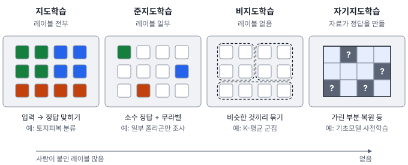
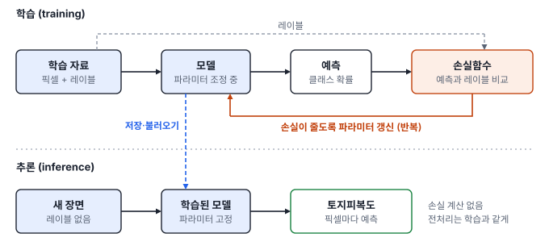

# 13강 학습이란 무엇인가

## 이 강에서 얻는 것

- 학습을 모델·손실함수·최적화 세 요소로 설명하고, 2부의 회귀가 이미 학습이었음을 알 수 있음
- 레이블이 얼마나 있느냐에 따라 지도·비지도·준지도·자기지도학습을 구분하고, 과제에 맞게 고를 수 있음
- 모델 용량과 일반화의 관계, 학습과 추론 단계의 차이를 알고, 학습 점수만 보고 판단하지 않을 수 있음

## 1. 이미 해 본 학습

2부의 회귀가 곧 머신러닝의 학습임. 6강의 최소제곱 회귀는 직선이라는 틀을 정해 두고, 잔차 제곱합이 가장 작아지는 절편과 기울기를 골랐음(80개 동 자료에서 226.5). 12강의 로지스틱 회귀는 시그모이드 곡선이라는 틀에서 로그 손실이 가장 작아지는 계수를 반복 계산으로 찾았음(불투수면 모형에서 0.318).

두 경우 모두 세 요소로 이루어짐.

- **모델(model)**: 입력을 출력으로 바꾸는 함수의 틀. 자료에 맞춰 정해지는 값(계수, 가중치)을 **파라미터(parameter)**라 부름
- **손실함수(loss function)**: 예측이 정답과 얼마나 어긋났는지를 수 하나로 매기는 규칙
- **최적화(optimization)**: 손실이 작아지도록 파라미터를 찾아가는 계산. 식 하나로 풀리기도 하고, 반복 계산으로 조금씩 다가가기도 함(28강)

**학습(training)**은 자료를 보고 이 세 요소로 파라미터를 정하는 일임. 사람이 "NDWI 0 이상은 물"처럼 규칙을 직접 쓰는 대신, 정답을 찍은 픽셀로 경계를 정하게 하는 것이 차이임(12강). 딥러닝도 모델이 큰 신경망일 뿐 뼈대는 같음.

## 2. 레이블과 네 가지 학습 방식

**레이블(label)**은 각 표본에 붙은 정답이며 라벨이라고도 씀. 픽셀의 토지피복 클래스, 탐지 박스, 동별 LST 값이 모두 레이블임. 현장 조사나 영상 판독으로 얻으므로 영상보다 훨씬 비싸서, 레이블을 얼마나 쓰느냐로 학습 방식을 나눔.

3부 공통 자료는 가상 연안 지역 Sentinel-2 영상의 현장 조사 폴리곤 104개에서 뽑은 픽셀 2,883개임. 산림·농경지·시가지·수계·나지·갯벌 6개 클래스 레이블과 밴드 반사율 6개, NDVI·NDWI가 있음.

**지도학습(supervised learning)**은 입력과 레이블의 쌍으로 학습함. 밴드 값으로 토지피복 클래스를 맞히는 분류가 대표 예이고, 6강·12강의 회귀도 지도학습임. 출력이 범주면 분류, 연속값이면 회귀라 부름.

**비지도학습(unsupervised learning)**은 레이블 없이 입력만으로 구조를 찾음. 밴드 6개를 표준화(10강)하고 레이블을 가린 채 K-평균 군집(19강)으로 6묶음을 만들면, 산림 875픽셀과 수계 362픽셀은 각각 한 군집에 온전히 모이고 갯벌도 거의 그러함. 반면 한 군집에는 시가지 364·농경지 199·나지 18픽셀이 섞임. 섞인 농경지는 NDVI가 평균 0.38인 휴경지 폴리곤 7개로, 흙이 드러나 시가지와 분광이 비슷함. 군집에 이름을 붙이는 것은 사람의 몫임.

**준지도학습(semi-supervised learning)**은 레이블이 일부에만 있을 때 레이블 없는 표본까지 함께 씀. 학습에 쓰지 않을 폴리곤 26개를 떼어 두고(4절), 나머지 중 클래스마다 폴리곤 하나(모두 약 175픽셀)에만 레이블이 있다고 하면 다항 로지스틱 회귀(12강)의 떼어 둔 폴리곤 정확도는 0.78임. 모든 폴리곤에 레이블이 있으면 0.89임. 그 사이를 메우는 대표 방법인 **자기 학습(self-training)**은 모델이 확률 0.9 이상으로 확신하는 픽셀에 스스로 붙인 레이블(**의사 레이블**, pseudo-label)을 학습 자료에 더해 가며 반복함. 그런데 떼어 둘 폴리곤을 바꿔 20번 해 보면 9번만 나아지고 평균은 0.76으로 오히려 떨어짐. 가장 크게 나빠진 경우(0.79→0.53)에는 스스로 붙인 레이블 1,882개 중 31%가 틀렸음. 처음 모델의 착각을 스스로 굳힌 셈임. 이 결과는 임계값 0.9·로지스틱 회귀 설정에서 나온 값이라 설정에 따라 달라지므로, 레이블만 쓴 모델과 반드시 비교함.

**자기지도학습(self-supervised learning)**은 사람이 붙인 레이블 없이 자료 자체에서 문제와 정답을 만들어 학습함. 영상의 일부 패치를 가리고 복원하게 하거나, 같은 장소를 다른 날짜에 찍은 두 영상을 같은 곳으로 알아보게 하는 식임. 정답이 자료 안에 있어 라벨 없는 위성 영상 수십만 장을 그대로 쓸 수 있음. 이렇게 먼저 학습하는 것을 **사전학습(pretraining)**이라 하며, 지표의 일반적인 특징을 익힌 모델을 목표 과제에 맞춰 다시 학습(미세조정)하면 적은 레이블로도 좋은 성능을 내는 경우가 많음. 원격탐사 기초모델(48강) 상당수가 이 방식으로 만들어짐.

## 3. 손실함수: 무엇을 잘하라는 기준

손실함수는 예측 하나가 얼마나 틀렸는지를 매기고, 학습은 그 평균을 줄임. 회귀에서는 **제곱 손실** $(y - \hat{y})^2$을 흔히 씀. 그 평균이 평균제곱오차(MSE)이고, 최소제곱법이 바로 이 손실의 최소화임. 제곱이라 큰 오차를 크게 벌해 이상치에 끌려감(8강). 절댓값 손실 $\lvert y - \hat{y} \rvert$은 덜 끌려감. 상수 하나로 예측하면 제곱 손실의 최적값은 평균, 절댓값 손실은 중앙값이라, 1강의 평균과 중앙값 이야기와 같음.

분류에서는 12강의 **로그 손실**을 씀. 정답 클래스에 준 확률이 $p$이면 손실은 $-\ln p$임. 산림 픽셀에 산림 확률 0.7을 주면 0.357, 0.05를 주면 3.00임. 클래스가 여럿일 때의 이 손실을 딥러닝에서는 교차 엔트로피라 부름(28강).

보고서에는 정확도를 적는데, 왜 정확도를 직접 줄이지 않는가? 정확도는 파라미터를 조금 바꿔도 판정이 뒤집히기 전까지 그대로라 계단처럼 변함. 그래서 어느 쪽으로 움직여야 나아지는지 알려 주지 못함. 로그 손실은 정답 확률이 조금만 올라도 줄어들어 방향을 알려 줌. 학습에 쓰는 손실과 성능을 재는 지표(17강)가 다른 것은 이 때문임.

레이블이 없는 방식에도 손실은 있음. K-평균은 각 픽셀과 소속 군집 중심 사이 거리의 제곱합을 줄이고, 자기지도학습은 가린 부분의 복원 오차를 줄임. 네 방식의 차이는 손실을 계산할 때 사람이 붙인 레이블이 얼마나 들어가느냐임.

## 4. 모델 용량과 일반화

**모델 용량(model capacity)**은 모델이 나타낼 수 있는 함수가 얼마나 다양하고 복잡한지를 뜻함. 직선보다 다항식이(10강), 변수 2개보다 20개가, 얕은 신경망보다 깊은 신경망이 용량이 큼.

**결정트리(decision tree)**로 보면 쉬움. "NDVI가 0.74보다 큰가?" 같은 질문을 나무처럼 이어 붙여 표본을 나누고, 맨 끝 잎(leaf)마다 가장 많은 클래스로 판정하는 모델임(16강). 질문을 몇 단계까지 이어 갈지(최대 깊이)가 용량을 정함. 깊이가 $d$이면 잎은 최대 $2^d$개라서, 깊이 1이면 두 가지 판정밖에 못 함. 어떤 변수를 어디서 자를지는 자료로 정하는 파라미터이고, 최대 깊이는 사람이 정하는 하이퍼파라미터(11강)임.

공통 자료에서 클래스마다 폴리곤 4분의 1(모두 26개)을 떼어 두고 나머지로 학습한 뒤 두 쪽의 정확도를 비교함. 떼어 둘 폴리곤을 바꿔 20번 반복한 평균임.

| 최대 깊이 | 잎 수 | 학습 자료 정확도 | 떼어 둔 폴리곤 정확도 |
|---|---|---|---|
| 1 | 2 | 0.605 | 0.605 |
| 2 | 4 | 0.725 | 0.683 |
| 4 | 약 9 | 0.889 | 0.828 |
| 6 | 약 18 | 0.944 | 0.852 |
| 8 | 약 33 | 0.980 | 0.879 |
| 제한 없음 | 약 62 | 1.000 | 0.880 |

깊이 1 트리는 NDVI로 한 번 갈라 산림과 농경지만 말함. 두 클래스가 전체 픽셀의 61%라 정확도도 0.6 언저리임. 깊이를 늘리면 학습 자료 정확도는 계속 올라, 제한을 풀면 1.000, 곧 학습 픽셀을 전부 맞힘. 그러나 떼어 둔 폴리곤의 정확도는 깊이 8 무렵부터 0.88에서 멈추고, 두 정확도의 차이는 0에서 0.120으로 벌어짐.

**일반화(generalization)**는 학습에 쓰지 않은 새 자료에서도 잘 맞는 능력임. 원하는 것은 레이블이 없는 나머지 영상을 맞히는 것이므로 학습의 진짜 목표는 일반화임. 학습 자료 점수와 새 자료 점수의 차이를 **일반화 격차(generalization gap)**라 부름. 용량이 너무 작으면 두 점수가 함께 낮고, 너무 크면 학습 자료의 우연한 특징까지 외워 격차가 벌어짐. 이를 과소적합·과적합이라 하며 14강에서 다룸.

폴리곤 단위로 떼어 둔 이유는, 같은 폴리곤의 픽셀끼리 매우 비슷해서 픽셀을 무작위로 나누면 외운 문제를 다시 푸는 셈이 되기 때문임(15강). 새 자료가 다른 계절·지역의 영상처럼 학습 자료와 분포가 다르면 점수가 대개 더 떨어지며, 이를 도메인 이동이라 부름(48강).

## 5. 학습과 추론

학습이 끝나면 파라미터를 고정해 파일로 저장함. 이 모델에 새 입력을 넣어 예측을 내는 단계를 **추론(inference)**이라 부름.

- 학습: 레이블이 있어야 하고, 손실을 계산해 파라미터를 바꿈. 한 번 또는 가끔 함
- 추론: 레이블도 손실 계산도 없고, 파라미터가 바뀌지 않음. 들어오는 영상마다 반복함

규모도 다름. 공통 자료의 영상은 60×40 km라서 Sentinel-2 10 m 격자로 6,000×4,000 = 2,400만 픽셀임. 표본 픽셀 2,883개의 약 8,300배를 추론해야 토지피복도 한 장이 나옴. 추론 속도를 따로 챙기는 이유임(50강).

추론에서 가장 흔한 실수는 입력을 학습 때와 다르게 만드는 것임. 밴드 순서, 반사율 표현(0~1 실수인지 10,000을 곱한 정수인지, 오프셋이 더해졌는지. Sentinel-2 L2A는 2022년 처리 기준 04.00부터 1,000을 더함), 정규화 통계(10강) 중 하나라도 다르면 모델은 오류 없이 엉뚱한 지도를 냄. 신경망은 일부 층의 동작이 학습·추론 때 달라 모드를 바꿔야 함(29강).

## 현장에서는

연안 토지피복도를 만드는 과제임. 조사 폴리곤으로 분류 모델을 학습하고, 폴리곤 단위로 떼어 둔 자료에서 정확도 0.88을 확인한 뒤 장면 전체를 추론함. 결과 지도를 펼쳐 보니, 조사 폴리곤이 거의 없던 북쪽 해안의 육상 양식장 부지가 시가지로 칠해져 있음.

떼어 둔 폴리곤 점수 0.88은 "조사한 폴리곤과 비슷한 곳"에서의 일반화만 말해 줌. 레이블에 없던 피복은 여섯 클래스 중 하나로 억지로 들어가므로, 추론 결과를 지도로 보며 학습 자료에 없던 지역을 따로 점검함. 조치는 그 지역에 조사 폴리곤을 추가하거나 클래스를 새로 정의하는 것이고, 판독 인력이 부족하면 모델이 확신하지 못한 픽셀부터 판독함.

## 헷갈리는 쌍

- **통계의 추론 vs 머신러닝의 추론**: 통계의 추론(statistical inference)은 표본으로 모집단의 모수를 추정하고 검정하는 일이며, 신뢰구간과 p값이 그 결과임(3·4강). 7강의 "계수 추론"도 이 뜻임. 머신러닝의 추론은 학습을 마친 모델로 새 입력의 예측을 내는 실행 단계임. 영문도 같은 inference라 문맥으로 구분함.
- **자기지도학습 vs 비지도학습**: 둘 다 사람의 레이블을 쓰지 않음. 비지도학습은 군집처럼 구조를 찾는 것 자체가 목적이고, 자기지도학습은 자료에서 만든 문제로 특징을 익혀 다른 과제에 옮겨 쓰는 것이 목적임. 자기지도학습을 비지도학습의 한 갈래로 묶는 책도 있음.
- **손실함수 vs 평가 지표**: 손실은 학습이 줄이는 대상이라 매끄럽게 변해야 하고, 지표(정확도·F1 등)는 사람이 성능을 판단하는 기준임.

## 이렇게 지시받음

> 지시: "폴리곤 더 따기 전에, 지금 있는 걸로 한 번 돌려서 조사 안 한 데서 얼마나 나오나 봐."

레이블을 늘리기 전에 지금 레이블로 일반화 수준을 확인하라는 뜻임. 폴리곤(가능하면 지역) 단위로 떼어 둔 자료로 정확도를 재고(15강), 클래스별로 어디서 틀리는지(17강) 봐서 더 딸 폴리곤의 클래스·지역을 정함.

> 지시: "트리 깊이 제한 풀지 마. 학습 정확도 1 나오는 거 자랑할 거 아님."

용량을 키우면 학습 점수는 계속 오르지만 새 자료 점수는 멈춘다는 판단임. 최대 깊이 후보를 바꿔 가며 떼어 둔 자료 점수가 가장 좋은 값을 고르고(14·15강), 두 점수의 차이도 적어 둠.

> 지시: "라벨 없는 S2 장면이 수천 장 있으니 자기지도로 먼저 사전학습하고, 라벨은 미세조정에만 써."

라벨 없는 대량 영상으로 자기지도 사전학습을 하고, 적은 조사 폴리곤으로 목표 과제에 맞추라는 뜻임. 같은 센서·밴드 구성의 공개 기초모델이 있으면 그것부터 검토함(48강). 처음부터 학습한 모델과 같은 떼어 둔 자료로 비교해 효과를 확인함.

## 요약

- 학습은 모델의 틀을 정하고 손실함수가 작아지도록 파라미터를 찾는 일이며, 2부의 최소제곱·로지스틱 회귀가 이미 그 예임
- 레이블이 전부 있으면 지도, 없이 구조를 찾으면 비지도, 일부만 있으면 준지도, 자료에서 정답을 만들면 자기지도학습임
- 손실함수는 매끄럽게 변해야 학습 방향을 알려 주므로 보고용 지표와 다를 수 있음
- 모델 용량을 키우면 학습 점수는 계속 오르지만 새 자료 점수는 멈추며, 학습의 목표는 일반화임
- 추론은 고정된 모델로 새 입력을 예측하는 단계로, 입력을 학습 때와 똑같이 만들어야 함. 통계의 추론과는 뜻이 다름

## 핵심 용어

| 한글 | 영문 |
|---|---|
| 지도학습 | Supervised Learning |
| 비지도학습 | Unsupervised Learning |
| 준지도학습 / 자기 학습 / 의사 레이블 | Semi-supervised Learning / Self-training / Pseudo-label |
| 자기지도학습 / 사전학습 | Self-supervised Learning / Pretraining |
| 레이블(라벨) | Label |
| 모델 / 파라미터 | Model / Parameter |
| 학습 | Training |
| 손실함수 | Loss Function |
| 모델 용량 | Model Capacity |
| 일반화 / 일반화 격차 | Generalization / Generalization Gap |
| 추론 | Inference |
