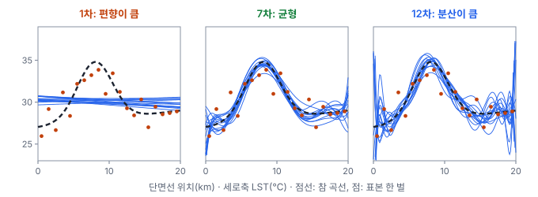
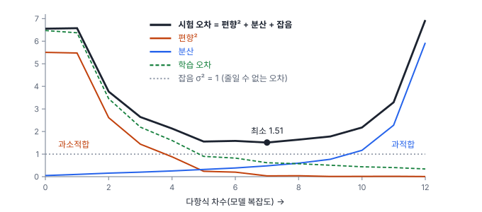
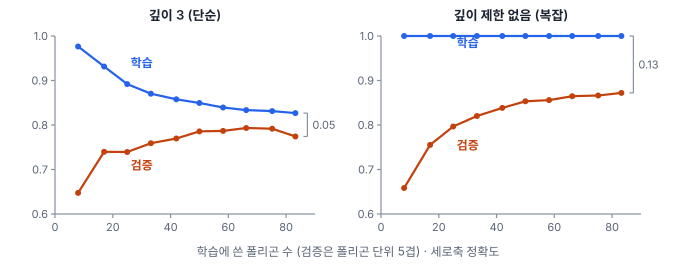

# 14강 과적합과 편향-분산

## 이 강에서 얻는 것

- 학습 오차와 검증 오차를 함께 보고 과적합과 과소적합을 구별할 수 있음
- 예측 오차를 편향², 분산, 줄일 수 없는 오차로 나누고, 모델 복잡도에 따라 앞의 둘이 맞바뀌는 이유를 설명할 수 있음
- 학습곡선을 읽고 "데이터를 더 모을지, 모델을 바꿀지, 규제를 걸지"를 판단할 수 있음

## 1. 잘 맞추는 것과 잘 맞히는 것: 과적합과 과소적합

13강에서 모델 용량(모델이 표현할 수 있는 함수의 폭)이 크면 더 복잡한 패턴을 담는다고 했음. 그렇다고 키울수록 좋아지지는 않음. 학습에 쓴 자료에서 잰 **학습 오차**와 쓰지 않은 자료에서 잰 **검증 오차**가 다르게 움직이기 때문임. 목표는 처음 보는 자료를 잘 맞히는 것(일반화, 13강)이므로 기준은 검증 오차임.

가상 예로, 해안에서 내륙으로 뻗은 20 km 단면선 위 1 km 간격 20개 지점의 여름 지표면온도(LST)에 다항식 곡선을 맞춤. 참 곡선은 도심(8 km 지점)에서 가장 뜨겁고 양쪽으로 식는 모양이고, 관측마다 센서 잡음·방사율 오차로 표준편차 1℃의 잡음이 섞임. 차수를 1, 7, 12로 올리면 학습 자료의 MSE(평균제곱오차, ℃²)는 6.38, 0.62, 0.34로 계속 줄지만, 단면선 전체에서 새로 관측한 값으로 잰 MSE는 6.58, 1.51, 6.93으로 7차가 가장 작음(잡음을 바꿔 2,000번 되풀이한 평균, 2절).

**과소적합(underfitting)**은 모델이 너무 단순해 학습 자료조차 못 맞추는 상태임. 직선은 도심의 봉우리를 표현할 수 없어서 학습 오차와 새 자료 오차가 모두 큼. **과적합(overfitting)**은 학습 자료의 잡음과 우연한 패턴까지 외워서, 학습 오차는 작은데 새 자료 오차가 크게 벌어지는 상태임. 12차 곡선은 20개 점을 거의 다 지나가려고 점 사이, 특히 양 끝에서 크게 휘어짐.

6강에서 변수를 넣으면 $R^2$가 절대 내려가지 않는다고 했음. 복잡도를 올리면 학습 오차가 계속 줄어드는 것도 같은 현상이고, 수정 $R^2$가 여기에 벌점을 준 첫 장치였음.

## 2. 오차를 셋으로 나누기: 편향-분산 분해

관측값을 $y = f(x) + \varepsilon$으로 봄. $f(x)$는 참 곡선, $\varepsilon$은 평균 0, 분산 $\sigma^2$인 잡음임. 학습 자료를 새로 뽑을 때마다 맞춘 곡선 $\hat{f}(x)$가 달라지므로, 3강의 표준오차처럼 "표본을 여러 번 뽑았다면"을 생각함. 이때 새 관측을 예측하는 제곱오차의 기댓값은 세 항으로 정확히 나뉨. 이를 **편향-분산 분해(bias-variance decomposition)**라고 함.

$$\mathbb{E}\left[\left(y - \hat{f}(x)\right)^2\right] = \underbrace{\left(\mathbb{E}[\hat{f}(x)] - f(x)\right)^2}_{\text{편향}^2} + \underbrace{\mathbb{E}\left[\left(\hat{f}(x) - \mathbb{E}[\hat{f}(x)]\right)^2\right]}_{\text{분산}} + \underbrace{\sigma^2}_{\text{잡음}}$$

새 관측의 잡음은 학습 표본과 독립이므로, 전개할 때 생기는 곱셈 항은 평균내면 0이 되어 세 항만 남음.

- **편향(bias)**: 표본을 무수히 바꿔 맞춘 곡선들의 평균이 참 곡선에서 비켜난 정도. 모델이 너무 단순해서 생기는 체계적인 틀림임
- **분산(variance)**: 맞춘 곡선이 표본마다 흔들리는 정도. 모델이 표본의 우연에 민감해서 생김
- **잡음**: 관측 자체에 섞인 오차로, 참 곡선을 알아도 없앨 수 없음

실제로는 참 곡선을 모르므로 이 계산을 할 수 없지만, 참 곡선을 직접 만든 모의실험에서는 가능함. 단면선 예에서 잡음만 새로 뽑은 표본 2,000벌을 만들고, 차수마다 2,000개 곡선을 맞춰 단면선 전체(401개 점)에서 편향²과 분산을 평균냄. 오른쪽 두 열은 같은 곡선들로 새 관측을 직접 예측해 잰 오차와 학습 오차임.

| 차수 | 편향² | 분산 | 잡음 | 세 항의 합 | 직접 잰 새 자료 MSE | 학습 MSE |
|---|---|---|---|---|---|---|
| 1 | 5.48 | 0.10 | 1.00 | 6.58 | 6.58 | 6.38 |
| 3 | 1.44 | 0.20 | 1.00 | 2.64 | 2.64 | 2.19 |
| 5 | 0.24 | 0.32 | 1.00 | 1.56 | 1.56 | 0.90 |
| 7 | 0.04 | 0.48 | 1.00 | 1.51 | 1.51 | 0.62 |
| 12 | 0.01 | 5.93 | 1.00 | 6.94 | 6.93 | 0.34 |

세 항의 합과 직접 잰 오차가 소수 둘째 자리까지 맞음(모의실험의 우연 오차와 반올림 때문에 끝자리가 1 다를 수 있음). 분산은 5차 무렵까지 계수 하나당 약 0.05씩 늚. 잡음 분산 1을 지점 수 20으로 나눈 값으로, 관측 지점에서만 평균내면 어느 차수든 정확히 이 비율임. 그 뒤로는 관측 지점 사이와 바깥에서 곡선이 더 흔들려 빨리 늘고, 10차를 넘으면 가파르게 커짐. 12차 분산의 대부분은 맨 끝 관측점 너머 양쪽 0.5 km 구간에서 나옴. 고차 다항식은 자료가 끝나는 곳 너머에서 크게 휘기 때문임. 5차부터는 학습 오차가 잡음 분산 1보다도 작음. 참 곡선을 알아도 1은 남으므로, 곡선이 잡음 일부를 맞춰 버렸다는 뜻임. 학습 오차가 늘 낙관적인 이유임.

## 3. 편향-분산 트레이드오프와 줄일 수 없는 오차

복잡도를 올리면 편향은 줄고 분산은 늘어서, 둘을 한꺼번에 줄이기 어려움. 이를 **편향-분산 트레이드오프(bias-variance tradeoff)**라고 부름. 여기에 잡음을 더한 새 자료 오차는 U자를 그리고, 바닥이 알맞은 복잡도임. 이 예에서는 7차(1.51)였고, 5~8차가 1.5~1.6으로 거의 같음. 왼쪽 비탈이 과소적합 구간, 오른쪽 비탈이 과적합 구간임.

U자의 바닥도 잡음 $\sigma^2 = 1$보다 낮아지지 않음. 이 항을 **줄일 수 없는 오차(irreducible error)**라고 함. 원격탐사에서는 센서 잡음, 대기보정 오차, 혼합 픽셀, 판독자 간 라벨 불일치가 여기에 들어감. 예를 들어 참조 라벨의 6%가 판독 실수로 틀려 있으면, 참 피복을 완벽히 맞히는 모델도 그 라벨로 재면 정확도가 약 94%로 나옴. 이 오차는 모델을 바꿔서는 줄지 않고, 센서·밴드·라벨 품질처럼 데이터를 바꿔야 줄어듦.

분류 정확도(맞으면 0, 틀리면 1로 매기는 손실)에는 이처럼 깔끔하게 더해지는 분해가 없지만, 세 몫으로 나눠 보는 생각은 그대로 씀. 또 파라미터 수가 학습 표본 수에 가까워져 학습 자료를 딱 맞출 수 있게 되는 지점에서 검증 오차가 치솟았다가, 모델을 그보다 훨씬 크게 키우면 다시 내려가는 **이중 하강(double descent)**이 대형 신경망과 일부 선형 모델에서 보고됨. 그래서 U자가 늘 들어맞지는 않음.

## 4. 학습곡선 읽기

**학습곡선(learning curve)**은 학습 자료의 양(또는 학습 반복 수)을 가로축에 놓고 학습 성능과 검증 성능을 함께 그린 곡선임. 3부 공통 자료(가상 연안 Sentinel-2 토지피복 표본 픽셀 2,883개, 폴리곤 104개, 6개 클래스)의 밴드 반사율 6개와 NDVI·NDWI로 결정트리(16강)를 학습해 그렸음.

검증은 픽셀을 무작위로 나누지 않고 **폴리곤 단위로 묶어 5겹**으로 나눴음. 같은 폴리곤 픽셀끼리 매우 비슷해서, 무작위로 나누면 학습 픽셀의 "쌍둥이"가 검증에 들어가 점수가 부풀려짐. 깊이 제한 없는 트리의 검증 정확도가 폴리곤 단위로는 0.872인데 무작위 5겹으로는 0.958로 나옴(13강의 0.880과는 떼어 두는 방식이 달라 조금 다름). 자세한 이유와 공간 교차검증은 15강에서 다룸.

두 모양이 전형적인 두 진단임.

- **깊이 3 트리(과소적합, 편향이 큼)**: 폴리곤 8개일 때 학습 0.976, 검증 0.647로 벌어졌다가, 늘릴수록 둘이 0.8 근처로 모임(83개일 때 0.827과 0.774). 둘 다 낮은 채로 붙었으니 폴리곤을 더 모아도 거의 나아지지 않고, 더 깊은 트리나 더 나은 특징(다시기 영상, 질감 등)이 필요함. 끝의 작은 오르내림은 겹 간 흔들림 안의 차이임
- **깊이 제한 없는 트리(과적합, 분산이 큼)**: 학습 정확도가 언제나 1.000이고, 검증은 0.658에서 0.872로 아직 오르는 중임. 일반화 격차(13강)가 0.13으로 크고 검증이 계속 오르므로 폴리곤을 더 모으거나 규제를 걸면 나아질 가능성이 큼

딥러닝에서는 가로축에 에폭(학습 자료 전체를 한 번 도는 단위, 28강)을 두고 손실을 그리는 경우가 많음. 학습 손실은 계속 내려가는데 검증 손실이 오르기 시작하면 과적합이 시작된 것이고, 거기서 멈추는 것이 조기 종료(29강)임.

## 5. 규제: 과적합을 막는 장치들

**정규화(regularization)**는 모델의 실제 복잡도를 제한해 분산을 줄이는 기법의 총칭임. 척도를 맞추는 normalization과 우리말 이름이 겹쳐서(헷갈리는 쌍) 이 책에서는 11강처럼 **규제**라고 부름.

단면선 예에서 과적합한 12차 다항식에 약한 릿지 벌점(11강)만 걸어도 결과가 크게 바뀜. 가로축을 −1~1로 바꾼 뒤 11강과 같은 식(잔차제곱합 + $\lambda$ × 계수 제곱합, 절편 제외)으로 맞췄음. $\lambda$의 크기는 변수 척도와 벌점 식의 배율에 따라 달라지므로 숫자 자체를 다른 예와 비교하지는 않음.

| 12차 모델 | 편향² | 분산 | 새 자료 MSE |
|---|---|---|---|
| 규제 없음 | 0.01 | 5.93 | 6.93 |
| 릿지 $\lambda = 0.001$ | 0.11 | 0.50 | 1.61 |
| 릿지 $\lambda = 1$ | 2.38 | 0.16 | 3.53 |

편향이 0.1 늘어난 대신 분산이 5.4 줄어 최적 차수(7차, 1.51)에 가까워짐. 반대로 너무 세게 걸면($\lambda = 1$) 편향이 커져 과소적합으로 넘어감. 그래서 규제 강도는 검증 오차로 고르는 하이퍼파라미터임.

트리에서는 깊이 제한이 규제임. 전체 자료로 깊이를 1~15로 바꾸며 같은 방식으로 검증하면, 학습 정확도는 0.606에서 1.000까지 오르지만 검증 정확도는 깊이 11에서 0.875로 가장 높고 그 뒤로는 제자리임. U자 대신 "격차만 벌어지고 검증은 제자리인" 모양임. 겹 간 표준오차가 0.031이므로 11강의 1 표준오차 규칙으로는 0.844 이상인 가장 얕은 깊이 7(0.856)을 고름.

과적합을 막는 장치를 묶어 보면 다음과 같음.

- **벌점**: 릿지·라쏘(11강), 신경망의 가중치 감쇠(29강)
- **구조 제한**: 트리 깊이·잎의 최소 표본 수, 가지치기(16강)
- **학습 절차**: 조기 종료, 드롭아웃(29강), 데이터 증강(45강)
- **모형을 고를 때의 벌점**: 수정 $R^2$(6강), AIC·BIC(11강). 모델은 그대로 두고 복잡한 후보를 덜 고르게 함
- **데이터 늘리기**: 규제는 아니지만 분산을 줄이는 가장 확실한 방법임. 학습곡선이 아직 오를 때 효과가 큼

## 현장에서는

5월에 촬영한 A 지역 한 장면에서 표본을 뽑아 토지피복 분류기를 학습한 상황임. 같은 장면 안에서 폴리곤 단위로 검증하면 정확도 0.91인데, 10월 같은 지역 장면에 적용하면 0.68, 5월 인접 B 지역 장면에서는 0.79로 떨어짐.

모델이 "그 장면의 반사율 값"에 과적합한 것임. 5월 논은 물을 대 수계와 비슷하고 10월에는 수확 뒤라 나지와 비슷함. 대기 상태와 태양 고도도 장면마다 달라 같은 피복이 다른 값으로 찍힘. 장면 하나로만 배운 모델에는 장면이 곧 분산의 원천임.

그래서 같은 장면의 픽셀을 더 뽑아도 거의 나아지지 않음. 학습곡선의 가로축이 "픽셀 수"가 아니라 "장면 수"였던 셈임. 여러 계절·지역 장면으로 학습 자료를 넓히고 검증은 장면 단위로 떼어 둠(15강). 증강(45강)과 규제는 보조 수단임(도메인 이동은 48강).

## 헷갈리는 쌍

- **정규화(regularization) vs 정규화(normalization)**: 우리말로 둘 다 "정규화"라 부름. regularization은 이 강의 규제(벌점·드롭아웃 등)이고, normalization은 값의 척도를 맞추는 것(10강의 표준화·최소-최대 정규화, 29강의 배치·레이어 정규화 층)임. 지시를 받으면 영어로 어느 쪽인지 확인함.
- **학습곡선 vs 검증 곡선**: 학습곡선은 가로축이 자료 양이나 에폭이고, 검증 곡선(복잡도 곡선)은 가로축이 깊이·차수·$\lambda$ 같은 하이퍼파라미터임.
- **편향(오차 성분) vs 편향(신경망의 bias 항)**: 이 강의 편향은 평균 예측이 참값에서 비켜난 정도이고, 신경망의 bias는 층마다 더하는 상수항(절편, 27강)임.

## 이렇게 지시받음

> 지시: "학습 정확도 99%인데 검증은 82%야. 과적합이니까 규제 좀 걸어 봐."

격차 17%p를 분산 문제로 본 것임. 트리라면 깊이·잎 최소 표본 수를, 신경망이라면 가중치 감쇠·드롭아웃·증강의 강도를 몇 단계로 바꿔 검증 곡선을 그리고 고름. 그 전에 검증 세트가 폴리곤·장면 단위로 나뉘었는지 확인함. 무작위로 나뉘었으면 82%조차 부풀려진 값일 수 있음.

> 지시: "데이터 두 배로 늘려도 검증 정확도가 그대로야. 라벨링 더 하지 말고 다른 방법 찾아."

학습곡선이 평평해졌다는 뜻임. 학습·검증이 둘 다 낮게 붙어 있으면 과소적합이므로 모델 용량을 키우거나 특징을 보강함(다시기 영상, 질감 등). 둘 다 높게 붙어 있으면 줄일 수 없는 오차 근처일 수 있으니 판독자 두 명의 라벨 일치율부터 확인함.

> 지시: "검증 손실이 20에폭부터 올라가. 거기서 멈춘 체크포인트 써."

조기 종료로 과적합 직전의 모델을 쓰라는 뜻임. 검증 손실이 가장 낮은 체크포인트를 고르되, 멈출 시점을 검증 세트로 골랐으니 최종 성능은 따로 떼어 둔 시험 세트로 보고함(15강).

## 요약

- 과소적합은 학습 오차부터 크고, 과적합은 학습 오차는 작은데 검증 오차가 크게 벌어짐. 판단 기준은 검증 오차임
- 제곱오차의 기댓값은 편향² + 분산 + 줄일 수 없는 오차로 정확히 나뉨. 모의실험에서 세 항의 합과 직접 잰 오차가 일치함
- 복잡도를 올리면 편향은 줄고 분산은 늘어 검증 오차가 U자를 그리고, 바닥도 줄일 수 없는 오차 아래로는 내려가지 않음
- 학습곡선에서 둘 다 낮게 붙으면 편향(모델·특징 보강), 격차가 크고 검증이 오르는 중이면 분산(데이터·규제)임
- 규제(regularization)는 편향을 조금 내주고 분산을 줄이는 장치의 총칭이며, 척도를 맞추는 정규화(normalization)와 다름

## 핵심 용어

| 한글 | 영문 |
|---|---|
| 과적합 / 과소적합 | Overfitting / Underfitting |
| 학습 오차 / 검증 오차 | Training Error / Validation Error |
| 편향 / 분산 | Bias / Variance |
| 편향-분산 분해 | Bias-Variance Decomposition |
| 편향-분산 트레이드오프 | Bias-Variance Tradeoff |
| 줄일 수 없는 오차 | Irreducible Error |
| 학습곡선 / 검증 곡선 | Learning Curve / Validation Curve |
| 규제(정규화) | Regularization |
| 이중 하강 | Double Descent |
