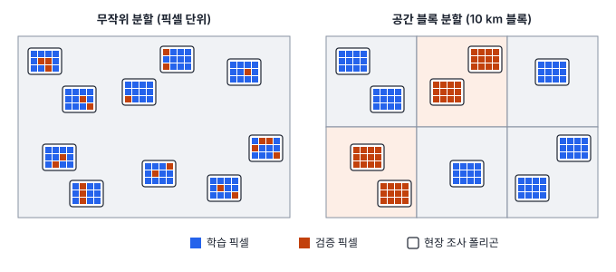
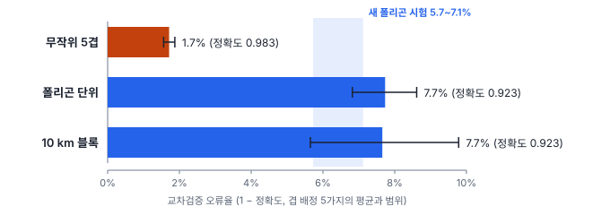
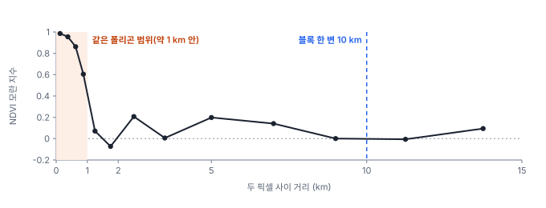

# 15강 제대로 검증하기

## 이 강에서 얻는 것

- 학습·검증·시험 세트의 역할을 나누고, k겹 교차검증과 층화 분할을 알맞게 쓸 수 있음
- 데이터 누수가 생기는 길목(같은 폴리곤, 전처리 통계, 시험 세트 반복 사용, 시간 역전)을 알아보고 막을 수 있음
- 공간 자기상관이 검증 점수를 부풀리는 원리를 알고, 공간 교차검증과 시간 분할을 설계할 수 있음

## 1. 세 묶음: 학습·검증·시험 세트

과적합(14강)된 모델은 학습 자료를 외워서 학습 점수가 높음. 알고 싶은 것은 **처음 보는 자료에서의 성능**이므로 학습에 쓰지 않은 자료로 재야 함. 자료를 역할에 따라 셋으로 나눔.

- **학습 세트(training set)**: 모델의 가중치(계수)를 맞추는 자료
- **검증 세트(validation set)**: 하이퍼파라미터(11강의 λ, 나무 깊이 등)를 고르고, 후보 모델을 비교하고, 학습을 언제 멈출지 정하는 자료
- **시험 세트(test set)**: 모든 선택이 끝난 뒤 최종 성능을 **한 번** 재는 자료

검증 세트는 선택에 쓰이는 순간 더는 "처음 보는 자료"가 아님. 후보가 많을수록 검증 점수가 좋은 후보는 실력보다 운이 좋았을 가능성이 커짐. 4강의 다중비교와 같은 원리임. 실제 정확도가 모두 0.92인 모델 20개를 독립인 점 500개로 시험해 가장 좋은 것을 고르면(모델끼리 오류가 독립이라 치고 모의실험 10만 번), 고른 모델의 점수는 평균 0.942로 나옴. 모델 하나의 점수가 흔들리는 폭(표준편차 0.012)의 두 배에 가까운 거품임. 그래서 선택은 검증 세트로 끝내고, 시험 세트는 마지막에 한 번만 봄. 시험 점수를 보고 모델을 고쳤다면 그 시험 세트는 검증 세트가 된 것이므로 새 시험 세트가 필요함.

## 2. k겹 교차검증과 층화 분할

자료가 적으면 검증 세트를 떼기 아깝고, 어디를 떼느냐에 따라 점수도 흔들림. **k겹 교차검증(k-fold cross-validation)**은 자료를 $k$개 겹(fold)으로 나눠, 한 겹을 검증에 쓰고 나머지로 학습하는 일을 겹마다 돌아가며 한 뒤 점수를 평균냄.

$$\text{CV 점수} = \frac{1}{k}\sum_{j=1}^{k} \text{점수}_j$$

모든 자료가 한 번씩 검증에 쓰이고, 겹별 점수의 흩어짐으로 추정의 흔들림도 볼 수 있음(11강의 1-SE 규칙이 이것을 씀). $k$는 5나 10을 흔히 쓰고, 자료 수만큼 나누면 하나씩 빼는 검증(LOO, 8강)임. 고른 설정으로 최종 모델은 자료 전체로 다시 학습하고, 시험 세트는 여기서도 따로 둠.

무작위로 나누면 드문 클래스가 겹마다 들쭉날쭉 들어감. 3부 공통 자료(픽셀 2,883개, 폴리곤 104개)에서 갯벌은 108픽셀뿐인데, 무작위 5겹이면 겹마다 18~25픽셀로 흔들림. **층화 분할(stratified split)**은 클래스 비율이 모든 겹에서 거의 같도록 클래스마다 따로 나누는 방법으로, 같은 자료에서 겹마다 21~22픽셀이 됨. 3강의 층화 무작위 표본과 같은 발상임.

폴리곤 단위로 묶어 나눌 때(4절)는 층화가 더 중요해짐. 갯벌 폴리곤은 4개뿐인데, 묶음 크기만 맞추는 기본 분할(scikit-learn `GroupKFold`)은 그중 3개를 한 겹에 몰아넣음. 그 겹을 검증할 때 학습 쪽에는 갯벌 폴리곤이 하나만 남음. 층화와 묶음을 함께 하는 `StratifiedGroupKFold`는 갯벌을 네 겹에 나눠 줌. 폴리곤이 4개라 5겹 가운데 한 겹에는 갯벌이 없을 수밖에 없으므로, 드문 클래스는 겹 수를 줄이거나 클래스별 점수를 따로 확인함.

## 3. 데이터 누수

**데이터 누수(data leakage)**는 검증·시험 자료의 정보가 어떤 길로든 학습 과정에 새어 들어가, 점수가 실제보다 좋게 나오는 것임. 코드가 멀쩡히 돌고 점수만 좋아서 알아채기 어려움. 흔한 길목은 넷임.

1. **같은 폴리곤·같은 장면의 픽셀이 학습과 검증에 나뉨**: 공간 자기상관 때문에 생기며 4절에서 자세히 다룸. 타일이 겹치게 잘라 같은 땅이 두 타일에 들어가는 경우는 43강에서 다룸
2. **전처리 통계를 전체 자료로 계산함**: 정규화의 평균·표준편차, PCA(주성분 분석, 19강)의 축을 검증 자료까지 넣어 계산하면 검증 자료가 학습에 관여함(10강에서 예고함). 3부 자료에서 표준화와 PCA(4축)를 거친 로지스틱 회귀(12강)를 폴리곤 단위 5겹으로 검증하면, 전처리를 전체로 하든 겹 안에서 하든 정확도가 0.896으로 같았음(겹 배정을 바꿔도 차이 0.003 이하). 라벨을 쓰지 않는 통계 몇 개만 새서 영향이 작은 것임. 반면 **라벨을 쓰는 전처리**는 크게 샘. 라벨이 무작위인 표본 100개에 잡음 특징 5,000개를 주고, 라벨과 상관이 큰 20개를 전체 자료로 고른 뒤 로지스틱 회귀를 5겹 교차검증하면 정확도가 0.88(20번 평균)로 나옴. 특징 선택을 겹 안에서 하면 0.47로, 동전 던지기 수준인 실제 실력이 드러남
3. **시험 세트를 여러 번 보고 모델을 고름**: 1절의 선택 거품
4. **시간 순서를 거스름**: 미래 정보로 과거를 맞힘(5절)

전처리 누수는 습관으로 막음. scikit-learn의 `Pipeline`처럼 전처리를 모델과 한 덩어리로 묶어 교차검증에 넣으면, 겹마다 학습 쪽 자료로만 통계를 계산함.

## 4. 공간 자기상관이 부풀리는 점수와 공간 교차검증

**공간 자기상관(spatial autocorrelation)**은 가까운 위치끼리 값이 닮는 경향임(5강). 3부 자료에서 같은 폴리곤 픽셀은 작물 생육, 건물 재질 같은 상태를 공유해 서로 매우 비슷함. 픽셀을 무작위로 나누면 검증 픽셀 바로 옆에 같은 폴리곤의 학습 픽셀이 있어서, 모델은 "이 폴리곤은 이런 반사율"을 외운 것만으로 검증을 통과함. 검증 픽셀에서 가장 가까운 학습 픽셀까지의 거리 중앙값이 무작위 분할에서는 87 m로, Sentinel-2의 10 m 픽셀 아홉 개 정도임.

**공간 교차검증(spatial cross-validation)**은 겹을 공간 단위로 묶어 나눠, 검증 자료가 학습 자료와 떨어져 있게 하는 방법임. 묶는 단위로 폴리곤을 쓰거나, 지도를 일정 크기 격자(**공간 블록**)로 잘라 블록째 겹에 배정함. 랜덤 포레스트(16강, 나무 200그루, 시드 0)로 세 방식을 비교했고, 겹 배정을 시드 0~4로 다섯 번 바꿔 평균과 범위를 냄.

| 교차검증 방식 | 정확도 평균 (범위) | 가장 가까운 학습 픽셀까지 |
|---|---|---|
| 무작위 5겹 | 0.983 (0.981~0.984) | 87 m |
| 폴리곤 단위 5겹 | 0.923 (0.914~0.932) | 1.6 km |
| 10 km 블록 단위 5겹 | 0.923 (0.902~0.944) | 4.2 km |

무작위 분할은 오류율을 1.7%로, 공간 단위 분할은 7.7%로 봄. 오류를 4분의 1 정도로 줄여 본 셈임. 어느 쪽이 맞는지는 가상 자료라서 확인할 수 있음. 같은 방식으로 새 폴리곤 520개(약 1만 5천 픽셀)를 세 번 새로 만들어, 전체 자료로 학습한 모델을 시험하면 정확도가 0.929~0.943임. 공간 단위 교차검증이 실제에 가까움(조금 낮은 데는 겹마다 자료의 80%로만 학습하는 것도 한몫함. 80%로 학습한 모델은 새 폴리곤에서 평균 0.930으로, 전체로 학습한 모델의 0.934보다 조금 낮음). 블록 단위가 폴리곤 단위와 같게 나온 것은 같은 클래스 폴리곤의 상태를 위치와 무관하게 만든 자료라서임. 실제 지역에서는 이웃 폴리곤도 토양·관개·촬영 조건을 공유해 블록 단위가 더 낮게 나올 수 있음. 픽셀이 2,883개여도 서로 독립인 정보는 폴리곤 104개어치에 가깝다는 뜻이기도 함(9강의 유효 표본 수, 3강의 표본점 간격).

**블록 크기는 자기상관이 사라지는 거리보다 크게** 잡음. 거리 구간별로 모란 지수를 계산한 코렐로그램(5강)을 그리면 NDVI의 모란 지수가 0.25 km 안에서 0.99, 0.75~1 km에서 0.61이고, 1 km를 넘으면 −0.07~0.21 사이로 떨어짐. 10 km 블록은 이 범위보다 충분히 큼. 입력 변수보다 모델 오차(9강의 잔차)가 이웃끼리 닮는 범위가 더 직접적인 기준이므로, 가능하면 그것도 봄.

블록을 키우는 데도 대가가 있음.

- **추정이 더 흔들림**: 묶음이 23개뿐이라 배정에 따라 평균이 0.902~0.944로 움직이고, 한 배정 안에서도 겹별 점수가 0.79~0.99로 벌어짐. 배정을 여러 번 바꿔 범위를 함께 보고함
- **비관적일 수 있음**: 블록이 너무 크면 학습에 없던 환경(다른 지형, 다른 기후대)을 맞히는 문제가 되어 실제보다 낮게 나옴. 재려는 것에 맞춤. 조사한 폴리곤 사이를 채우는 지도라면 폴리곤 단위로, 조사하지 않은 새 지역에 쓸 모델이라면 조사 지점과 쓸 곳이 떨어진 거리만큼 큰 블록으로 나눔
- **폴리곤이 블록 경계에 걸침**: 3부 자료의 블록 번호는 픽셀 위치로 매겨져 있어 폴리곤 20개의 픽셀이 두세 블록에 나뉨. 위 표는 폴리곤 중심이 든 블록에 폴리곤을 통째로 넣어 계산함(픽셀 129개 옮김)

## 5. 시간 분할

올해 영상으로 학습한 토지피복 모델을 내년 영상에 쓴다면, 알고 싶은 것은 **다른 해 영상에서의 성능**임. 작물 생육 시기, 토양 수분, 대기 상태, 센서가 해마다 달라지는데, 같은 해 안에서 나눈 검증은 이 차이를 겪지 않음. **시간 분할(temporal split)**은 시점으로 나눠 과거 자료로 학습하고 그 뒤 자료로 시험하는 방법임. 예를 들어 2023~2024년 영상으로 학습·검증하고 2025년 영상을 시험 세트로 둠. 해가 여러 개면 "2023으로 학습→2024 시험, 2023~2024로 학습→2025 시험"처럼 시험 시점을 앞으로 밀어 가며 반복해 해마다 성능이 얼마나 흔들리는지 봄.

순서를 거스르는 누수도 조심함. 시험 기간까지 포함한 연간 합성 영상이나 다년 평균 NDVI를 특징으로 쓰거나, 시험 기간에 조사한 라벨로 과거 영상을 학습하면 미래 정보가 들어감. 공간과 시간을 함께 나누면(다른 지역의 다른 해) 가장 엄격한 시험이 됨.

## 현장에서는

연안 지역 토지피복도를 만들어 보고하는 과제임. 첫 보고서에는 픽셀을 무작위로 나눈 교차검증 정확도 0.98을 적었는데, 발주처가 인접 지역 영상으로 검수하자 0.9 안팎이 나옴. 모델이 망가진 것이 아니라 처음 숫자가 부풀려졌던 것임.

다시 검증할 때는 현장 조사 폴리곤을 묶음으로 삼고 클래스 비율을 맞춘 공간 교차검증을 쓰고, 코렐로그램으로 자기상관 범위를 확인해 그보다 큰 블록 교차검증도 함께 돌림. 전처리는 파이프라인에 넣고, 하이퍼파라미터도 이 교차검증으로 고름. 최종 보고에는 인접 지역의 따로 떼어 둔 폴리곤으로 한 번만 잰 시험 정확도를 적고, 분할 방식과 블록 크기, 겹 배정을 바꿨을 때의 범위를 함께 기록함.

## 헷갈리는 쌍

- **검증 세트 vs 시험 세트**: 검증 세트는 고르는 데 쓰고, 시험 세트는 다 고른 뒤 한 번 잼. 고르는 데 쓴 순간 시험 세트도 검증 세트가 됨.
- **층화 분할 vs 공간 교차검증**: 층화는 겹마다 **클래스 비율**을 맞추고, 공간 교차검증은 학습·검증 사이 **거리**를 벌림. 둘을 함께 쓰기도 함.
- **폴리곤 단위 vs 블록 단위**: 폴리곤 단위는 같은 폴리곤 안의 닮음을, 블록 단위는 이웃 폴리곤끼리의 닮음까지 끊음. 모델을 쓸 곳에 따라 고름.
- **교차검증 점수 vs 최종 모델 성능**: 교차검증은 "이 절차로 만든 모델"의 성능 추정임. 최종 모델은 전체 자료로 다시 학습하므로 보통 조금 더 좋음.

## 이렇게 지시받음

> 지시: "검증 픽셀 랜덤으로 뽑지 말고 폴리곤 단위로 나눠. 같은 필지가 양쪽에 들어가면 안 돼."

같은 폴리곤 픽셀이 학습·검증에 나뉘어 점수가 부풀려지는 누수를 막으라는 뜻임. 폴리곤 번호를 묶음으로 쓰는 분할(`GroupKFold`, 드문 클래스가 있으면 `StratifiedGroupKFold`)로 바꾸고, 겹마다 클래스별 픽셀·폴리곤 수를 표로 확인함.

> 지시: "공간 CV 블록 크기는 코렐로그램 보고 정해. 결과는 시드 몇 개 돌려서 범위로 줘."

자기상관이 사라지는 거리를 코렐로그램에서 찾아 블록 한 변을 그보다 크게 잡고, 블록이 커질수록 흔들림이 커지므로 겹 배정을 여러 번 바꾼 범위를 보고하라는 뜻임. 블록 경계에 걸친 폴리곤은 통째로 한 블록에 넣음.

> 지시: "2025년 영상은 건드리지 마. 모델 확정되면 마지막에 한 번만 돌려."

2025년 영상을 시간 분할의 시험 세트로 쓰겠다는 뜻임. 정규화 통계, 특징 선택, 하이퍼파라미터, 조기 종료가 모두 2023~2024년 자료로만 정해졌는지 확인하고, 시험 결과를 본 뒤에는 모델을 고치지 않음.

## 요약

- 학습 세트로 맞추고, 검증 세트로 고르고, 시험 세트로 마지막에 한 번 잼. 여러 번 보고 고르면 점수에 선택 거품이 낌
- k겹 교차검증은 모든 자료를 한 번씩 검증에 써서 평균과 흔들림을 함께 주고, 층화 분할은 겹마다 클래스 비율을 맞춰 드문 클래스를 지킴
- 데이터 누수는 같은 폴리곤 픽셀의 분리, 전체 자료로 낸 전처리 통계(특히 라벨을 쓰는 특징 선택), 시험 세트 반복 사용, 시간 역전으로 생기며, 전처리는 파이프라인에 넣어 겹 안에서 계산함
- 공간 자기상관 때문에 무작위 분할은 점수를 부풀림(3부 자료 0.983 vs 공간 단위 0.923, 새 폴리곤 시험 0.93~0.94). 공간 교차검증의 블록은 자기상관 범위보다 크게, 모델을 쓸 곳에 맞춰 잡음
- 다른 해에 쓸 모델은 시간 분할로 과거로 학습하고 뒤의 해로 시험하며, 미래 정보가 특징·라벨에 섞이지 않게 함

## 핵심 용어

| 한글 | 영문 |
|---|---|
| 학습 세트 | Training Set |
| 검증 세트 | Validation Set |
| 시험 세트 | Test Set |
| k겹 교차검증 | K-Fold Cross-Validation (k-fold CV) |
| 층화 분할 | Stratified Split |
| 데이터 누수 | Data Leakage |
| 파이프라인 | Pipeline |
| 공간 자기상관 | Spatial Autocorrelation |
| 공간 교차검증 | Spatial Cross-Validation (spatial CV) |
| 공간 블록 | Spatial Block |
| 코렐로그램 | Correlogram |
| 시간 분할 | Temporal Split |
