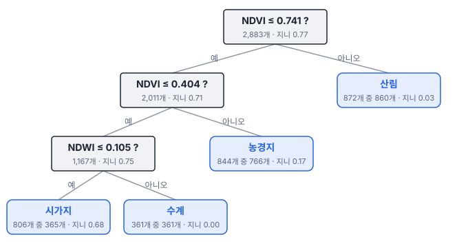
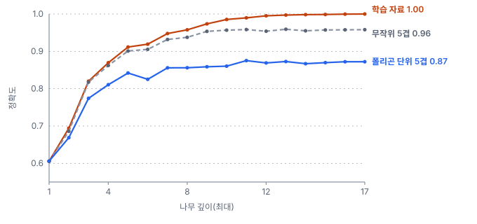
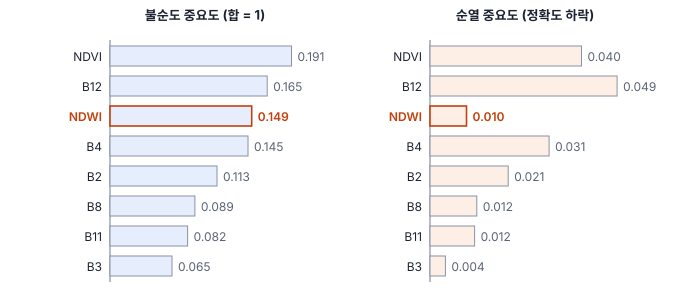

# 16강 트리와 앙상블

## 이 강에서 얻는 것

- 결정트리가 지니 불순도·엔트로피로 분기를 고르는 과정을 손으로 따라가고, 깊이와 가지치기로 복잡도를 조절할 수 있음
- 배깅·랜덤 포레스트가 분산을 줄이는 원리와 OOB 오차가 부풀려지는 조건을 설명할 수 있음
- 그래디언트 부스팅의 발상을 알고, 특징 중요도를 읽을 때의 함정(상관된 특징, 값 종류, 인과)을 피할 수 있음

## 1. 질문을 이어 가는 결정트리

**결정트리(decision tree)**는 "NDVI가 0.74 이하인가?" 같은 예/아니오 질문을 차례로 던져 자료를 나누고, 더 나누지 않는 끝 칸(잎)에 클래스를 붙이는 모형임.

3부 공통 자료(가상 연안 지역 Sentinel-2 표본 픽셀 2,883개, 현장 조사 폴리곤 104개, 토지피복 6개 클래스)에서 NDVI와 NDWI(녹색·근적외 밴드로 만든 수분 지수)만 주고 잎을 4개로 제한해 나무를 키우면 다음과 같음.

첫 질문 NDVI 0.74에서 산림이 거의 순수하게 떨어져 나가고, NDVI 0.40에서 농경지 쪽이 갈리고, NDWI 0.105에서 수계 361개가 하나도 틀리지 않고 분리됨. "시가지" 잎에는 나지·농경지·갯벌이 441개 섞여 있어 정확도는 0.816임. 두 지수만으로는 이 셋을 가르기 어려움.

나무는 축에 평행한 계단 모양 경계를 여러 번 그어, 직선·평면 경계만 긋는 로지스틱 회귀(12강)와 달리 휘어진 경계도 근사함. 질문이 "기준보다 큰가"뿐이라 단위에 영향을 받지 않으므로, 반사율·지수·고도를 표준화(10강) 없이 섞어 넣어도 됨.

## 2. 좋은 질문 고르기: 지니 불순도와 엔트로피

나무는 칸마다 모든 특징과 기준값을 시험해, 나눈 뒤 칸이 가장 순수해지는 질문을 고름. 섞인 정도를 재는 척도가 **불순도(impurity)**임. 칸 안 클래스 $k$의 비율을 $p_k$라 함.

$$G = 1 - \sum_{k} p_k^2, \qquad H = -\sum_{k} p_k \log_2 p_k$$

**지니 불순도(Gini impurity)** $G$는 칸에서 픽셀 두 개를 복원 추출했을 때 클래스가 다를 확률이고, **엔트로피(entropy)** $H$는 칸의 클래스를 알아맞히는 데 필요한 평균 정보량(비트)임. 둘 다 한 클래스뿐이면 0이고, 골고루 섞일수록 커짐. 질문의 점수는 나눈 두 칸의 불순도를 픽셀 수로 가중평균해 나누기 전보다 얼마나 줄었는지로 매김(엔트로피 감소량은 **정보 이득**이라 부름).

수계 4, 시가지 4, 갯벌 2인 픽셀 10개로 손계산함. 지니는 $1 - (0.4^2 + 0.4^2 + 0.2^2) = 0.64$임.

- 질문 A: 수계 4(지니 0) / 시가지 4·갯벌 2(지니 $1 - (4/6)^2 - (2/6)^2 = 0.444$). 가중평균 $0.6 \times 0.444 = 0.267$, 감소 0.373
- 질문 B: 수계 2·시가지 4(지니 0.444) / 수계 2·갯벌 2(지니 0.5). 가중평균 0.467, 감소 0.173

나무는 A를 고름. 엔트로피로 재도 A가 0.971비트, B가 0.571비트를 줄여 순서가 같음. 두 척도는 대개 비슷한 질문을 고르며, CART 계열 구현은 흔히 지니를 기본으로 씀(scikit-learn 기본값도 지니, 엔트로피는 옵션). 실제 자료의 첫 분기(NDVI 0.74)는 전체 2,883개의 지니 0.767을 왼쪽 2,011개 0.715, 오른쪽 872개 0.027의 가중평균 0.507로 낮춤. 다만 그 자리에서 가장 좋은 질문만 고르는 탐욕적 방식이라, 나무 전체의 최선은 보장하지 않음.

## 3. 얼마나 깊게: 과적합과 가지치기

멈추지 않으면 나무는 잎마다 한 클래스만 남을 때까지 자람. 깊이가 곧 이 모형의 용량(13강)임. 8개 특징(밴드 6개와 NDVI·NDWI)으로 제한 없이 키우면 17층, 잎 82개에서 학습 정확도가 1.0이 됨.

깊이 3에서는 학습 0.820, 폴리곤 단위 5겹 교차검증 0.774로 둘 다 낮은 과소적합이고, 제한이 없으면 학습 1.0 대 검증 0.872로 벌어짐. 무작위 5겹(0.958)은 같은 폴리곤의 쌍둥이 픽셀이 학습과 검증에 함께 들어가 부풀려진 값임(15강). 깊은 나무는 학습 표본이 조금만 바뀌어도 모양이 크게 달라지는, 분산이 큰 모형임(14강).

복잡도를 줄이는 것이 **가지치기(pruning)**임.

- **사전 가지치기**: 최대 깊이, 잎의 최소 픽셀 수 등으로 자라는 도중에 멈춤
- **사후 가지치기**: 끝까지 키운 뒤 기여가 작은 가지를 잘라 냄. 비용-복잡도 가지치기는 "나무의 오차 + $\alpha \times$ 잎 수"를 최소화하며, $\alpha$는 규제 강도(11강) 역할임. 오차 자리에 원래 정의는 오분류율을 두지만, scikit-learn은 잎들의 불순도를 픽셀 수로 가중평균한 값을 둠

scikit-learn에서 $\alpha = 0.003$(`ccp_alpha`)으로 자르면 잎이 82개에서 18개로 줄어도 폴리곤 단위 정확도는 0.873으로 그대로임. 깊이를 5로 막은 나무(잎 16개)는 0.842라서, 이 자료에서는 끝까지 키운 뒤 쓸모없는 가지만 자르는 편이 나았음.

## 4. 여러 그루의 다수결: 배깅과 랜덤 포레스트

**배깅(bagging, bootstrap aggregating)**은 부트스트랩 표본(3강. 같은 크기로 복원 추출한 표본)을 여러 벌 뽑아 각각 나무를 키우고, 분류는 다수결(또는 확률 평균)로, 회귀는 평균으로 합침.

분산이 $\sigma^2$인 예측 $B$개를 평균하면, 서로 독립일 때 분산이 $\sigma^2 / B$로 줄어듦. 그런데 같은 자료에서 키운 나무들은 서로 닮아 상관 $\rho$가 있고, 그때 평균의 분산은 다음과 같음.

$$\rho\,\sigma^2 + \frac{1 - \rho}{B}\,\sigma^2$$

나무를 늘려도 $\rho\sigma^2$는 남으므로 나무끼리의 상관을 낮추는 것이 핵심임. **랜덤 포레스트(random forest)**는 분기마다 특징 일부만 무작위로 후보에 올려 상관을 낮춤. 분류에서는 특징 수의 제곱근 개를 흔히 씀(도구마다 기본값이 다름). scikit-learn 분류기 기본값(`'sqrt'`)은 8개 특징이면 $\sqrt{8} \approx 2.8$을 내려 분기마다 2개만 보므로, 늘 NDVI부터 쓰는 비슷한 나무만 생기지 않음.

폴리곤 단위 5겹(겹 배정 하나) 정확도는 단일 나무 0.872, 배깅 0.900, 랜덤 포레스트 0.921임(둘 다 500그루). 랜덤 포레스트의 나무 한 그루는 평균 0.869로 단일 나무와 비슷한데, 합치면 0.921이 됨. 서로 다른 실수가 다수결에서 상쇄됨.

**OOB 오차(out-of-bag error)**는 배깅의 덤임. 부트스트랩 표본 하나에 뽑히지 않는 픽셀은 약 $(1 - 1/n)^n \approx e^{-1} \approx 36.8\%$임. 픽셀마다 자기를 보지 못한 나무들(500그루 중 평균 약 184그루)로만 투표해 오차를 재면, 검증 세트를 따로 떼지 않고도 검증 오차를 추정함.

이 자료의 OOB 정확도는 0.984(OOB 오차 0.016)로, 무작위 5겹 0.983과 거의 같고 폴리곤 단위 0.921보다 훨씬 높음. 픽셀 단위로 뽑기 때문에, 한 픽셀이 OOB여도 같은 폴리곤의 이웃 픽셀은 그 나무의 학습에 들어가 있음. 공간 자기상관(5강) 때문에 무작위 교차검증이 부풀려지는 것(15강)과 같은 이유임. 폴리곤 단위로 부트스트랩하도록 직접 구현해 재면 OOB가 0.928로 내려옴.

## 5. 앞 나무의 실수를 고치는 그래디언트 부스팅

**그래디언트 부스팅(gradient boosting)**은 나무를 차례로 키움. 앞 나무들이 틀린 만큼을 다음 나무가 맞추는 식임. 제곱 오차 회귀라면 다음 나무가 맞추는 대상이 곧 잔차(실제 − 현재 예측)이고, 일반적으로는 손실함수(분류면 12강의 로그 손실)의 음의 기울기를 맞춰서 "그래디언트"가 붙음.

어느 동의 LST가 35℃인데 현재 예측이 32℃면 다음 나무는 잔차 3℃를 맞추도록 학습함. 이 예측에 **학습률**(예: 0.1)을 곱해 0.3℃만 반영하며 조금씩 다가가고, 대개 얕은 나무를 수백~수천 그루 쌓음.

배깅이 깊은 나무를 평균해 **분산**을 줄인다면, 부스팅은 얕은 나무를 쌓아 **편향**을 줄임. 나무 수가 곧 복잡도라 너무 쌓으면 과적합하므로, 검증 오차가 더 줄지 않을 때 멈추는 조기 종료를 흔히 씀. XGBoost·LightGBM이 대표 구현임. 이 자료에서 scikit-learn의 히스토그램 기반 부스팅을 기본 설정으로 돌리면 폴리곤 단위 0.910(무작위 5겹 0.986)으로 랜덤 포레스트와 비슷했음.

## 6. 특징 중요도의 함정

**특징 중요도(feature importance)**는 모형이 예측에 어떤 특징을 얼마나 썼는지 매긴 점수이며, 흔히 둘을 씀.

- **불순도 기반 중요도**(MDI): 그 특징의 분기들이 줄인 불순도를 모든 나무에서 더해 합이 1이 되게 맞춘 값. 학습 자료로 계산함
- **순열 중요도(permutation importance)**: 검증 자료에서 특징 하나의 값만 픽셀끼리 뒤섞은 뒤 정확도가 얼마나 떨어지는지 잼

**첫째, 상관된 특징은 중요도를 나눠 가짐.** NDVI는 B4·B8로, NDWI는 B3·B8로 계산해 서로 얽혀 있음(NDVI와 NDWI의 상관 −0.93). 8강의 다중공선성과 같은 상황이라 어느 것을 써도 비슷한 분기가 되어 공이 흩어짐. NDVI·NDWI를 빼고 다시 학습하면 폴리곤 단위 정확도는 0.921에서 0.922로 그대로이고, B4의 불순도 중요도가 0.145에서 0.207로, B8이 0.089에서 0.149로 커져 빈자리를 채움. 순열 중요도도 다른 특징이 정보를 대신 주어 각각 작게 나옴(NDWI 0.010). B4·B8·NDVI·NDWI를 한꺼번에 뒤섞으면 정확도가 0.482 떨어지지만, 하나씩 뒤섞은 값의 합은 0.093뿐임. 얽힌 특징은 묶어서 뒤섞어 봄.

**둘째, 불순도 기반 중요도는 값 종류가 많은 특징을 편애함.** 값이 다양할수록 기준값 후보가 많아 우연히 불순도를 줄이는 자리를 찾기 쉽고, 학습 자료로 매기므로 외우는 데 쓴 분기도 공으로 침. 강한 특징이 있으면 나무가 일찍 순수해져 잡음이 끼어들 분기가 적으므로, B2·B3만 쓰는 약한 모형에 의미 없는 연속 난수(값 2,883가지)와 동전 던지기(0/1)를 넣으면, 불순도 중요도는 난수 0.097, 동전 0.013이지만 순열 중요도는 둘 다 0에 가까움(−0.001, 0.000).

**셋째, 중요도는 인과가 아님(5강).** 모형이 기댄 정도일 뿐임. 위치 좌표 x_km(영상의 바다 쪽 가장자리에서 잰 거리)를 넣으면 순열 중요도 0.041로 9개 특징 중 3위가 되고 폴리곤 단위 정확도도 0.928로 조금 오름. 갯벌은 해안 쪽에, 산림은 내륙 쪽에 몰려 있어서일 뿐, 좌표가 피복을 만든 것이 아니며 다른 지역에서는 통하지 않는 바로가기임.

## 현장에서는

원격탐사 토지피복 분류에서 랜덤 포레스트는 오랫동안 표준 도구였음. 반사율·지수·DEM 경사·텍스처처럼 단위가 제각각인 특징을 표준화 없이 넣고, 휘어진 경계를 스스로 찾으며, 수백~수천 개 표본으로도 학습되고, 정할 것이 사실상 나무 수와 후보 특징 수뿐이라 기본값으로도 쓸 만함.

연안 토지피복도를 만든다면 조사 폴리곤을 묶은 교차검증으로 정확도를 보고하고, OOB는 참고로만 둠. 픽셀마다 따로 판정해 소금·후추처럼 흩어진 잡음 픽셀이 생기기 쉬우므로 다수결 필터나 객체 단위 분류로 정리함. 딥러닝 분할 모델(33강)은 이웃 맥락까지 학습해 이 한계를 줄임.

## 헷갈리는 쌍

- **배깅 vs 부스팅**: 배깅은 나무를 따로 키워 평균 내 분산을 줄이고, 부스팅은 앞 나무의 오차를 차례로 고쳐 편향을 줄임. 배깅은 나무를 늘려도 과적합이 심해지지 않지만, 부스팅은 조기 종료가 필요함.
- **OOB 오차 vs 검증 오차**: OOB는 부트스트랩에서 빠진 표본으로 잰 추정치라 따로 뗀 검증 세트가 필요 없음. 대신 표본끼리 닮은 자료에서는 무작위 교차검증처럼 부풀려짐.
- **불순도 기반 중요도 vs 순열 중요도**: 앞은 학습 자료에서 분기가 줄인 불순도, 뒤는 검증 자료에서 특징을 망가뜨렸을 때의 성능 하락임.

## 이렇게 지시받음

> 지시: "RF OOB 98% 나왔네. 따로 검증 안 돌려도 되지? 보고서에 98%로 써."

OOB는 같은 폴리곤의 이웃 픽셀이 학습에 들어간 채로 잰 값이라, 이 자료라면 폴리곤 단위 검증(0.92 안팎)보다 크게 부풀려짐. 폴리곤(또는 공간 블록) 단위 교차검증 결과를 보고하고 OOB와의 차이를 함께 적음.

> 지시: "중요도 상위 세 개만 남겨서 모델 가볍게 해 봐."

불순도 기반 상위 3개(NDVI·B12·NDWI)를 그대로 고르면 같은 정보를 담은 NDVI와 NDWI가 함께 뽑힘. 얽힌 특징은 묶어서 판단하고, 후보 조합마다 폴리곤 단위 교차검증 정확도를 비교해 고름.

> 지시: "RF 말고 LightGBM도 돌려서 비교해. 파라미터는 알아서 튜닝하고."

튜닝과 조기 종료에 쓰는 검증도 폴리곤 단위로 나눠야 부풀려진 점수에 맞춘 설정을 피함. 두 모형을 같은 겹 분할로 비교하고, 튜닝에 쓰지 않은 시험 폴리곤으로 마지막 점수를 냄(15강).

## 요약

- 결정트리는 지니 불순도나 엔트로피를 가장 많이 줄이는 질문을 차례로 골라 자료를 나누며, 표준화 없이 휘어진 경계를 만듦
- 깊은 나무는 학습 자료를 외워 분산이 크므로 사전·사후 가지치기로 복잡도를 줄임
- 배깅은 부트스트랩 나무들을 평균해 분산을 줄이고, 랜덤 포레스트는 분기마다 후보 특징을 제한해 나무끼리의 상관까지 낮춤
- OOB 오차는 공짜 검증 추정치지만 공간 자기상관이 있으면 부풀려짐. 그래디언트 부스팅은 앞 나무의 오차를 차례로 고쳐 편향을 줄이며 조기 종료가 필요함
- 특징 중요도는 상관된 특징끼리 나눠 갖고, 불순도 기반은 값 종류가 많은 특징을 편애하며, 어느 쪽도 인과가 아님

## 핵심 용어

| 한글 | 영문 |
|---|---|
| 결정트리 | Decision Tree |
| 불순도 / 지니 불순도 | Impurity / Gini Impurity |
| 엔트로피 / 정보 이득 | Entropy / Information Gain |
| 가지치기 | Pruning |
| 배깅 | Bootstrap Aggregating (Bagging) |
| 랜덤 포레스트 | Random Forest (RF) |
| OOB 오차 | Out-of-Bag Error |
| 그래디언트 부스팅 | Gradient Boosting (GBM) |
| 특징 중요도 | Feature Importance |
| 불순도 기반 중요도 / 순열 중요도 | Mean Decrease in Impurity (MDI) / Permutation Importance |
