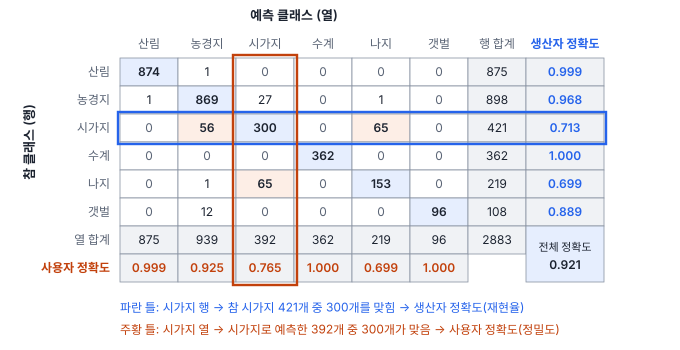
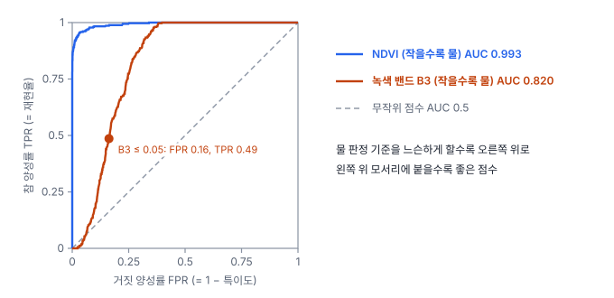

# 17강 분류 성능 재기

## 이 강에서 얻는 것

- 혼동행렬을 만들고 행·열 규약을 확인한 뒤, 정확도·정밀도·재현율·특이도·F1을 계산할 수 있음
- 클래스가 여럿일 때 매크로 평균을 쓰는 이유와, ROC 곡선과 AUC가 무엇을 재는지 설명할 수 있음
- 원격탐사 정확도 평가의 생산자·사용자 정확도와 카파를 계산하고, 카파의 한계와 두 지도 비교(맥니마 검정)를 판단할 수 있음

## 1. 혼동행렬: 모든 지표의 출발점

3부 공통 자료(가상 연안 지역 표본 픽셀 2,883개, 6개 클래스)에 랜덤 포레스트(16강, 나무 200그루, 특징은 밴드 6개와 NDVI·NDWI)를 학습하고, 폴리곤 단위로 묶은 5겹 교차검증(15강)으로 모든 픽셀의 예측을 얻었음. 결과를 참 클래스와 예측 클래스의 짝으로 세어 놓은 표가 **혼동행렬(confusion matrix)**임. 원격탐사에서는 오차행렬(error matrix)이라고도 부름.

이 강은 **행 = 참, 열 = 예측**으로 씀. scikit-learn의 `confusion_matrix`가 이 규약임. 그런데 원격탐사 교재·논문은 행에 지도(분류 결과), 열에 참조 자료를 두는 경우가 많아 방향이 반대임. 행 합계가 "참 클래스의 개수"인지 "그 클래스로 분류한 개수"인지에 따라 아래 지표의 자리가 서로 바뀌므로, 남의 표를 받으면 규약부터 확인함.

대각선 합을 전체 수로 나눈 값이 **정확도(accuracy)**이고, 원격탐사에서는 **전체 정확도(overall accuracy, OA)**라고 부름. 여기서는 2,654 ÷ 2,883 = 0.921임(겹 배정 한 가지. 15강의 0.923은 배정 다섯 가지의 평균). 같은 자료를 픽셀 단위로 무작위 분할하면 약 0.98로 부풀려짐(15강).

## 2. 한 클래스씩 보기: 정밀도, 재현율, 특이도, F1

클래스 하나를 "양성", 나머지를 모두 "음성"으로 묶으면 칸이 넷으로 줄어듦. 시가지로 해 보면 다음과 같음.

| | 시가지로 예측 | 다른 클래스로 예측 |
|---|---|---|
| 참 시가지 | 참 양성 TP 300 | 거짓 음성 FN 121 |
| 참 다른 클래스 | 거짓 양성 FP 92 | 참 음성 TN 2,370 |

- **정밀도(precision)** $= \mathrm{TP}/(\mathrm{TP}+\mathrm{FP}) = 300/392 = 0.765$: 시가지라고 한 것 중 실제 시가지 비율
- **재현율(recall)** $= \mathrm{TP}/(\mathrm{TP}+\mathrm{FN}) = 300/421 = 0.713$: 실제 시가지 중 잡아낸 비율. 민감도, 참 양성률(TPR)이라고도 함
- **특이도(specificity)** $= \mathrm{TN}/(\mathrm{TN}+\mathrm{FP}) = 2370/2462 = 0.963$: 시가지가 아닌 것을 아니라고 한 비율. 참 음성률(TNR)이라고도 함

시가지냐 아니냐로만 본 이 표의 정확도는 (300 + 2,370) ÷ 2,883 = 0.926임. 시가지의 29%를 놓치는데도 높게 나오는 것은 음성이 압도적으로 많아서임. 이 함정은 18강에서 자세히 다룸.

정밀도와 재현율은 임계값(12강)을 움직이면 대체로 한쪽이 오를 때 다른 쪽이 내려가므로 하나로 묶어 보고함. **F1 점수(F1 score)**는 둘의 조화평균임.

$$F_1 = \frac{2 \times \text{정밀도} \times \text{재현율}}{\text{정밀도} + \text{재현율}}$$

시가지는 $2 \times 0.765 \times 0.713 / (0.765 + 0.713) = 0.738$임. 조화평균은 작은 쪽에 끌려가서, 둘 중 하나만 높으면 F1이 높아지지 않음. 탐지에서 정밀도·재현율을 쓰는 법은 38강에서 다시 다룸.

## 3. 여러 클래스를 한 숫자로: 매크로 평균

클래스별 F1은 산림 0.999, 농경지 0.946, 시가지 0.738, 수계 1.000, 나지 0.699, 갯벌 0.941임. 이를 한 숫자로 줄이는 방법이 셋임.

- **매크로 평균(macro average)**: 클래스별 값을 단순 평균함. 모든 클래스를 똑같이 대접함. 매크로 F1 = 0.887
- **가중 평균**: 클래스별 표본 수로 가중함. 큰 클래스에 끌려감. 0.920
- **마이크로 평균**: 모든 칸의 TP·FP·FN을 먼저 합친 뒤 계산함. 한 픽셀에 클래스가 하나인 분류에서는 전체 정확도와 같음. 0.921

전체 정확도 0.921과 매크로 F1 0.887의 차이가 곧 "작은 클래스(시가지·나지)가 약하다"는 신호임. scikit-learn의 `classification_report`는 클래스별 값과 매크로·가중 평균을 함께 보여 줌.

## 4. ROC 곡선과 AUC

모델이 확률(점수)을 내면 임계값마다 혼동행렬이 하나씩 생김. 12강의 물·비물 픽셀 300개(물 90개)를 NDWI로 가르는 예에서, 임계값 0이면 재현율 1.000·거짓 양성률 0.048, 0.083이면 0.967·0.010, 0.2이면 0.822·0임. **거짓 양성률(FPR)**은 $\mathrm{FP}/(\mathrm{FP}+\mathrm{TN})$, 곧 1 − 특이도임.

임계값을 끝에서 끝까지 움직이며 (FPR, TPR) 점을 이은 선이 **ROC 곡선**(수신자 조작 특성 곡선, receiver operating characteristic)이고, 그 아래 넓이가 **ROC 곡선 아래 면적(ROC-AUC)**임. AUC는 "양성 하나와 음성 하나를 무작위로 골랐을 때 양성의 점수가 더 높을 확률"과 같음. 1이면 완벽한 순서, 0.5면 동전 던지기 수준임. 위 예는 0.999임.

AUC는 임계값을 정하기 전에 점수 자체의 가르는 힘을 비교할 때 씀. 위 그림처럼 수계를 찾는 데 어느 값(지수나 밴드)이 나은지 고르는 식임. 다만 순서만 보므로 확률값이 실제 빈도와 맞는지는 알려 주지 않음. 확률의 크기까지 따지는 것은 로그 손실(12강)임. 양성이 드물면 AUC가 낙관적으로 나오기 쉬워 PR 곡선을 함께 봄(18강).

## 5. 원격탐사 정확도 평가: 생산자·사용자 정확도와 카파

원격탐사에서는 재현율과 정밀도를 지도 제작의 말로 부름.

- **생산자 정확도(producer's accuracy, PA)**: 참 시가지 중 지도에서도 시가지인 비율 = 재현율. 지도를 만든 쪽이 "실제 시가지를 얼마나 잘 그렸나"를 봄. 1 − PA가 **누락 오차**(있는데 빠뜨림)
- **사용자 정확도(user's accuracy, UA)**: 지도의 시가지 중 실제 시가지인 비율 = 정밀도. 지도를 쓰는 쪽이 "지도에 시가지라고 찍힌 곳에 가면 정말 시가지인가"를 봄. 1 − UA가 **포함 오차**(아닌데 넣음)

| 클래스 | 산림 | 농경지 | 시가지 | 수계 | 나지 | 갯벌 |
|---|---|---|---|---|---|---|
| 생산자 정확도 | 0.999 | 0.968 | 0.713 | 1.000 | 0.699 | 0.889 |
| 사용자 정확도 | 0.999 | 0.925 | 0.765 | 1.000 | 0.699 | 1.000 |

갯벌은 UA가 1이지만 PA가 0.889임. 갯벌이라고 한 곳은 모두 맞았지만, 참 갯벌 108개 중 12개를 농경지로 빠뜨렸다는 뜻임. 12개는 모두 학습 쪽에 갯벌 폴리곤이 하나만 남은 겹(15강 2절)의 한 폴리곤에서 나왔음. 한쪽만 보면 이런 차이를 놓침.

**카파 계수(Cohen's kappa, κ)**는 "우연히 맞을 만큼을 빼고 얼마나 더 맞았나"를 재려는 지표임.

$$\kappa = \frac{p_o - p_e}{1 - p_e}, \qquad p_e = \sum_{k} \frac{(\text{행 합계}_k) \times (\text{열 합계}_k)}{n^2}$$

$p_o$는 전체 정확도, $p_e$는 행·열 합계만 보고 무작위로 짝지었을 때 기대되는 일치율임. 여기서는 $p_e = 0.236$이라 $\kappa = (0.921 - 0.236)/(1 - 0.236) = 0.896$임.

카파는 오래 표준처럼 쓰였지만 비판이 많음. Pontius & Millones(2011)는 지도가 무작위로 만들어진다는 비교 기준이 현실과 맞지 않고, 카파 하나로는 오차가 어떤 성격인지 알 수 없다고 지적하며, 불일치(1 − OA)를 **양 불일치**(클래스별 면적 자체가 틀린 부분)와 **배치 불일치**(면적은 맞는데 위치가 틀린 부분)로 나눠 보고하자고 제안했음. 위 행렬의 불일치 0.079는 양 0.014, 배치 0.065로, 대부분 위치 혼동임. 또 행·열 합계가 정해지면 $p_e$가 고정되어 카파는 전체 정확도의 눈금만 바꾼 값이 되므로, 따로 더해 주는 정보가 적음. 요즘은 카파 대신 전체·생산자·사용자 정확도를 신뢰구간과 함께 적기를 권하는 경우가 많음(Olofsson 등 2014가 대표적인 지침임).

**주의할 점.** 이 혼동행렬은 학습용으로 모은 픽셀을 교차검증한 것이라, 클래스 비율이 지도의 면적 비율이 아님. 지도 자체의 정확도는 확률 표본(3강의 층화 무작위 표본)으로 따로 평가함.

**두 지도 비교: 맥니마 검정.** 3강의 예처럼 같은 검증점 300개로 기존 지도 0.87(261점), 새 지도 0.89(267점)가 나왔다고 함. 둘 다 맞힌 점 246, 기존만 맞힌 점 15, 새 지도만 맞힌 점 21, 둘 다 틀린 점 18임. 둘 다 맞히거나 둘 다 틀린 점은 차이에 대해 말해 주는 것이 없으므로, **맥니마 검정(McNemar test)**은 한쪽만 맞힌 15와 21만 봄. 차이가 없다면 36개가 반반으로 나뉘어야 하고, 15 대 21만큼 또는 그보다 더 쏠릴 확률을 이항분포(2강)로 계산하면 양측 p = 0.405로 우연으로 충분히 설명됨. 같은 2%p 차이라도 한쪽만 맞힌 점이 0 대 6이었다면 p = 0.031이 됨. 정확도 차이가 아니라 **엇갈린 점의 쏠림**을 보는 검정임.

## 현장에서는

3강의 층화 표본(지도 클래스별 100점, 면적 산림 55%·농지 30%·시가지 12%·수계 3%)으로 토지피복도를 평가했음. 전체 정확도는 면적 가중으로 0.876을 얻었고, 층별 정확도가 곧 사용자 정확도였음. 생산자 정확도도 행렬에서 그대로 나눠 수계 0.951, 시가지 0.854라고 적으려는 참임.

여기서 멈춤. 지도 클래스로 층을 나누면 점 하나가 대표하는 면적이 층마다 다름. 산림 층의 점 하나는 면적 $0.55/100$, 수계 층의 점 하나는 $0.03/100$을 대표해 18배 차이가 남. 참 수계인 점 103개 가운데 산림 층 1개, 농지 층 2개, 시가지 층 2개가 섞여 있었는데, 이 5개가 대표하는 면적(0.0139)이 수계 층에서 맞힌 98개의 면적(0.0294)의 절반에 가까움. 각 칸을 "층 면적 비율 × 칸 수 ÷ 층 표본 수"로 바꿔(Olofsson 등 2014의 방식) 다시 계산하면 수계 PA는 0.679, 시가지 PA는 0.701로 떨어짐. 큰 층에 조금씩 숨어 있는 작은 클래스는 단순 계산에서 잘 드러나지 않음.

보고서에는 면적 가중 행렬로 계산한 OA·PA·UA를 신뢰구간과 함께 적고, 행·열 규약과 가중 방법을 표 아래에 밝힘.

## 헷갈리는 쌍

- **생산자 정확도 vs 사용자 정확도**: 생산자는 참 클래스 기준(재현율, 1 − 누락 오차), 사용자는 지도 클래스 기준(정밀도, 1 − 포함 오차)임. 행렬의 행·열 규약이 바뀌면 "행 방향·열 방향"도 바뀌므로 위치가 아니라 분모로 기억함.
- **특이도 vs 정밀도**: 둘 다 거짓 양성이 늘면 떨어지지만, 특이도의 분모는 실제 음성 전체, 정밀도의 분모는 양성이라고 예측한 것임. 음성이 매우 많으면 특이도는 높은데 정밀도는 낮을 수 있음.
- **매크로 평균 vs 마이크로 평균**: 매크로는 클래스마다 한 표, 마이크로는 픽셀마다 한 표임. 단일 라벨 다중 클래스에서 마이크로 F1은 전체 정확도와 같음.

## 이렇게 지시받음

> 지시: "혼동행렬 보고서 양식이 행=분류, 열=참조야. sklearn에서 뽑은 거 전치해서 넣어."

scikit-learn 결과(행 = 참)를 뒤집어 행 = 지도로 바꾸라는 뜻임. 전치하면 생산자 정확도는 열 합계로, 사용자 정확도는 행 합계로 나누게 되므로, 합계와 정확도 칸의 위치도 함께 바꿨는지 확인함. 표 제목에 규약을 적어 둠.

> 지시: "과업지시서에 카파 0.8 이상이라고 돼 있으니 카파도 넣어."

요구 조건이라 계산해 넣되, 카파만으로는 어느 클래스가 문제인지 알 수 없으므로 전체·생산자·사용자 정확도를 함께 적음. 필요하면 양·배치 불일치를 덧붙여 오차가 면적 문제인지 위치 문제인지 설명함.

> 지시: "새 모델이 검증점 기준 2%p 올랐대. 같은 점으로 맥니마 돌려서 유의한지 봐."

두 지도를 같은 검증점으로 평가했으니 독립 표본 비교가 아니라 짝 비교를 하라는 뜻임. 점마다 두 지도의 정답 여부를 2×2로 세고, 한쪽만 맞힌 두 칸으로 검정함. 엇갈린 점이 적으면 정확 이항검정을 씀.

## 요약

- 혼동행렬은 참과 예측의 짝을 센 표이며, 행·열 규약(scikit-learn은 행 = 참)을 먼저 확인함
- 정밀도·재현율·특이도는 분모가 다르고, F1은 정밀도와 재현율의 조화평균임
- 매크로 평균은 클래스마다 한 표를 주어, 전체 정확도에 가려진 작은 클래스의 약점을 드러냄
- ROC-AUC는 임계값과 무관하게 점수의 순서가 얼마나 좋은지를 재며, 확률의 정확함은 재지 않음
- 생산자 정확도 = 재현율, 사용자 정확도 = 정밀도임. 카파는 전체 정확도에 더하는 정보가 적고, 층화 표본에서는 면적 가중으로 계산하며, 두 지도 비교는 맥니마 검정으로 함

## 핵심 용어

| 한글 | 영문 |
|---|---|
| 혼동행렬 / 오차행렬 | Confusion Matrix / Error Matrix |
| 정확도(전체 정확도) | Accuracy (Overall Accuracy, OA) |
| 정밀도 / 재현율 | Precision / Recall |
| 특이도 | Specificity (TNR) |
| F1 점수 | F1 Score |
| 매크로 평균 / 마이크로 평균 | Macro Average / Micro Average |
| ROC 곡선 / ROC 곡선 아래 면적 | ROC Curve / Area Under the ROC Curve (ROC-AUC) |
| 거짓 양성률 | False Positive Rate (FPR) |
| 생산자 정확도 / 누락 오차 | Producer's Accuracy (PA) / Omission Error |
| 사용자 정확도 / 포함 오차 | User's Accuracy (UA) / Commission Error |
| 카파 계수 | Cohen's Kappa (κ) |
| 양 불일치 / 배치 불일치 | Quantity Disagreement / Allocation Disagreement |
| 맥니마 검정 | McNemar Test |
