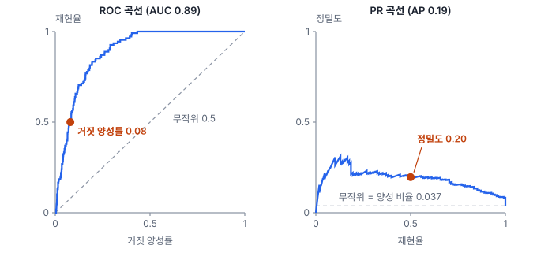
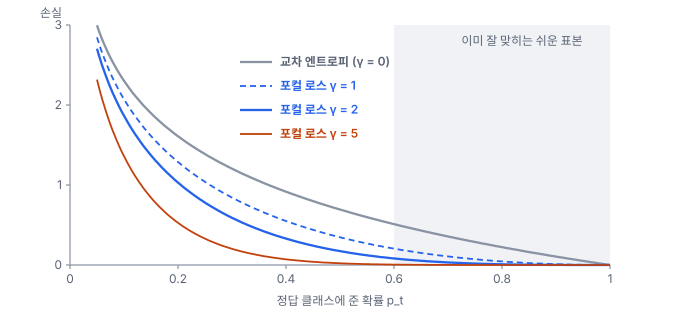

# 18강 한쪽으로 쏠린 데이터

## 이 강에서 얻는 것

- 클래스가 한쪽으로 쏠리면 정확도와 ROC-AUC가 왜 좋아 보이는지 설명하고, PR 곡선과 PR-AUC로 다시 평가할 수 있음
- 클래스 가중 손실·포컬 로스(손실을 고치는 쪽)와 오버·언더샘플링·SMOTE(데이터 비율을 고치는 쪽)의 차이와 쓰는 자리를 알 수 있음
- 리샘플링을 학습 세트 안에서만 하고, 그 뒤 달라진 예측 확률을 임계값·보정으로 다룰 수 있음

## 1. 쏠림이 왜 문제인가

**클래스 불균형(class imbalance)**은 클래스마다 표본 수가 크게 차이 나는 상태임. 3부 공통 자료(가상 연안 토지피복 표본 2,883픽셀)에서 농경지는 898픽셀인데 갯벌은 108픽셀(3.7%), 폴리곤으로는 4개뿐임. 선박·해안 쓰레기 탐지처럼 영상 대부분이 배경인 원격탐사 문제는 대개 더 심하게 쏠림.

문제는 두 가지임. 첫째, 학습이 다수 클래스 쪽으로 기울어짐. 손실(12강의 로그 손실)은 표본마다 더해지므로 손실의 대부분을 다수 클래스가 차지하고, 모형은 드문 클래스를 틀려도 전체 손실이 별로 늘지 않음. 둘째, 평가가 속음. 갯벌 대 나머지로 나눠 "항상 갯벌 아님"이라고만 답해도 정확도는 96.3%인데 갯벌은 하나도 못 찾음.

이 강에서는 근적외·단파적외 밴드가 없는 RGB 항공사진처럼 가시광 3밴드(B2·B3·B4)만 쓰는 상황을 가정함. 쏠림의 효과를 보려면 갯벌이 다른 클래스와 겹쳐야 하기 때문임. 모든 밴드를 쓰면 이 자료의 갯벌은 분광적으로 뚜렷해서 아래 모형이 아무 처리 없이도 재현율·정밀도가 모두 1.00으로 나옴. 즉 쏠림은 **클래스가 특징 공간에서 겹칠 때** 문제가 되며, 잘 갈리는 클래스는 드물어도 괜찮음. 모형은 다항 로지스틱 회귀(12강), 검증은 폴리곤 단위 4겹 교차검증(15강)임. 갯벌 폴리곤이 4개라 겹마다 하나씩 들어가도록 나누고, 검증 겹 예측을 모아 지표를 계산함. 아무 처리 없이 학습하면 전체 정확도는 0.813인데 갯벌 108픽셀 중 12개만 맞히고 79개를 농경지로, 17개를 시가지로 보냄.

## 2. ROC-AUC 대신 PR-AUC

ROC 곡선(17강)은 임계값을 바꿔 가며 가로에 거짓 양성률(FPR, 음성 가운데 양성으로 잘못 잡은 비율), 세로에 재현율(양성 가운데 찾아낸 비율)을 찍음. 거짓 양성률의 분모는 음성 전체라서 음성이 많으면 오탐이 수백 개여도 비율은 작음. 위 모형의 갯벌 확률로 그리면 ROC-AUC는 0.89로 좋아 보임. 그런데 재현율 0.5를 얻는 지점의 거짓 양성률 0.08은 음성 2,775픽셀의 8%, 곧 오탐 221개임. 이때 맞게 잡은 갯벌은 54개라서 **정밀도**(갯벌이라고 한 것 가운데 진짜 갯벌 비율)는 0.20에 그침.

**PR 곡선(정밀도-재현율 곡선)**은 가로에 재현율, 세로에 정밀도를 찍음. 정밀도의 분모는 "양성이라고 답한 것"이라 오탐 수가 그대로 드러남. 그 아래 넓이가 **정밀도-재현율 곡선 아래 면적(PR-AUC)**이며, 흔히 계단식 합으로 계산한 평균 정밀도(average precision, AP)로 대신 씀. 이 모형의 AP는 0.19임.

무작위로 점수를 매기는 분류기의 PR-AUC는 양성 비율과 같음. 그래서 PR-AUC 0.19는 기준선 0.037의 약 5배로 읽음. 거꾸로 PR-AUC는 양성 비율에 따라 바뀜. 같은 확률 점수에서 갯벌 108개와 나머지 108개를 무작위로 뽑아 반반인 평가 세트를 200번 만들면 ROC-AUC는 평균 0.89로 그대로인데 AP는 0.85로 뜀. 따라서 PR-AUC는 **같은 평가 세트끼리만** 비교하고, 양성 비율을 함께 적음.

## 3. 손실을 고치기: 클래스 가중 손실과 포컬 로스

12강의 로그 손실을 한 표본에 대해 쓰면 $-\ln p_t$임. 여기서 $p_t$는 모형이 정답 클래스에 준 확률임. **클래스 가중 손실(class-weighted loss)**은 여기에 정답 클래스별 가중치 $w_y$를 곱함.

$$L = -\frac{1}{n}\sum_{i=1}^{n} w_{y_i}\,\ln p_{t,i}$$

드문 클래스를 틀리면 더 큰 벌점을 받게 하는 것임. 가중치는 흔히 빈도의 역수를 씀. scikit-learn의 `class_weight='balanced'`는 $w_k = n / (K n_k)$($K$는 클래스 수, $n_k$는 클래스 $k$의 표본 수)이고, 공통 자료 전체로 계산하면 갯벌 4.45, 농경지 0.535임. 역수가 너무 세면 드문 클래스를 남발하므로 역수의 제곱근처럼 누그러뜨린 값도 씀.

**포컬 로스(focal loss)**는 클래스가 아니라 **표본마다** 가중치를 다르게 줌. 1단계 탐지기 RetinaNet(2017년)에서 제안됨. 탐지기는 영상 한 장에서 후보 위치를 약 10만 개 보는데 대부분이 쉬운 배경이라, 하나하나의 손실은 작아도 합치면 학습을 지배함.

$$\mathrm{FL}(p_t) = -\alpha_t\,(1 - p_t)^{\gamma}\ln p_t$$

$(1 - p_t)^{\gamma}$가 핵심임. 이미 잘 맞히는 표본($p_t$가 1에 가까움)은 이 값이 0에 가까워 손실이 거의 사라지고, 틀리는 표본은 손실이 거의 그대로 남음. $\gamma = 0$이면 보통의 교차 엔트로피이고, $\alpha_t$는 클래스 가중치 역할임. 원 논문에서 가장 좋았던 조합은 $\gamma = 2$, $\alpha = 0.25$(양성 쪽 가중치)인데, $\gamma$가 쉬운 배경을 이미 눌러 주므로 양성 가중치를 오히려 0.5보다 낮게 둔 것임. $\gamma = 2$일 때 $p_t = 0.9$인 표본의 손실은 0.105에서 0.0011로 100분의 1이 되고, $p_t = 0.5$는 0.693에서 0.173으로 4분의 1, $p_t = 0.1$은 2.303에서 1.865로 조금만 줄어듦.

예를 들어 쉬운 배경 10만 개($p_t = 0.99$)와 어려운 물체 100개($p_t = 0.3$)가 있으면, 교차 엔트로피 합계는 배경 1,005, 물체 120으로 손실의 89%가 쉬운 배경에서 나옴. $\gamma = 2$면 배경 0.10, 물체 59.0이 되어 배경 몫이 0.17%로 떨어짐. 배경이 압도적인 탐지 문제와 직결되므로 후보 위치 배정(36강)과 대형 영상 후처리(37강)에서 다시 만남.

## 4. 데이터 비율을 고치기: 오버샘플링·언더샘플링·SMOTE

**오버샘플링(oversampling)**은 드문 클래스 표본을 복제하거나 합성해 늘리는 것이고, **언더샘플링(undersampling)**은 많은 클래스 표본 일부를 버려 비율을 맞추는 것임. 무작위 복제는 선형 모형에서 가중치를 주는 것과 거의 같은 효과를 냄(표본을 3번 넣으면 손실에 3번 더해짐). 언더샘플링은 정보를 버림. 공통 자료에서 모든 클래스를 학습 겹의 갯벌 수에 맞추면 학습 픽셀이 2,150개 안팎에서 414~534개로 줄어듦.

**SMOTE(Synthetic Minority Over-sampling Technique)**는 복제 대신 새 표본을 합성함. 드문 클래스 표본 $x_i$와 그 $k$-최근접 드문 클래스 이웃(흔히 $k = 5$) 중 하나 $x_j$를 골라 둘을 잇는 선분 위에 점을 찍음.

$$x_{\text{new}} = x_i + \lambda\,(x_j - x_i), \qquad 0 \le \lambda \le 1 \text{ (무작위)}$$

리샘플링은 **학습 세트 안에서만** 함. 나누기 전에 복제하면 같은 픽셀의 사본이 학습과 검증 양쪽에 들어가 외운 답으로 점수가 부풀려짐(15강의 데이터 누수). 검증·시험 세트를 리샘플링해도 안 됨. 평가 세트의 양성 비율이 실제와 달라지면 정밀도와 PR-AUC가 실제 운영 때와 다른 값이 됨(2절의 0.19 → 0.85).

공간 자료에서 SMOTE는 특히 조심함. SMOTE는 특징 공간의 거리만 보고 폴리곤이나 위치는 모름. 가시광 3밴드 공간에서 갯벌 전체에 SMOTE를 걸어 보면 합성 표본의 약 19%가 **서로 다른 두 폴리곤**의 픽셀을 섞어 만든 것으로, 현장 어디에도 없는 가짜 픽셀임. 폴리곤 단위로 나누기 전에 SMOTE를 돌리면 검증 폴리곤의 픽셀이 합성 재료로 학습 세트에 섞여 폴리곤 경계를 넘는 누수가 생김.

## 5. 갯벌로 비교해 보기

1절의 설정에서 방법만 바꾼 결과임(리샘플링은 학습 겹 안에서 표준화 전에 적용, 난수 시드 0). 리샘플러의 시드만 바꿔도(0~9) 세 리샘플링 방법의 갯벌 재현율이 0.51~0.59 사이에서 움직이므로, 표의 소수 둘째 자리 차이에는 의미를 두지 않음.

| 방법 | 정확도 | 갯벌 재현율 | 갯벌 정밀도 | 갯벌 F1 | 매크로 F1 |
|---|---|---|---|---|---|
| 처리 없음 | 0.813 | 0.111 | 0.250 | 0.154 | 0.696 |
| 클래스 가중치 (balanced) | 0.764 | 0.556 | 0.206 | 0.301 | 0.706 |
| 무작위 오버샘플링 | 0.767 | 0.537 | 0.204 | 0.296 | 0.708 |
| 무작위 언더샘플링 | 0.759 | 0.565 | 0.214 | 0.310 | 0.697 |
| SMOTE | 0.767 | 0.565 | 0.214 | 0.310 | 0.709 |

갯벌 재현율은 0.11에서 0.55 안팎으로 다섯 배가 되고 F1은 두 배가 됨. 대가는 정밀도와 정확도임. 가중치를 준 모형은 농경지 204픽셀을 갯벌로 잘못 보내서 농경지 F1이 0.805에서 0.674로 떨어지고, 그래서 매크로 F1(17강, 클래스별 F1의 단순 평균)은 0.696에서 0.706으로 조금만 오름. 분할 시드를 바꿔도(1~3) 방향은 같음(가중치 전후 갯벌 재현율 0.10~0.13 → 0.56~0.61). 네 방법이 비슷한 것은 선형 모형이라서임. 같은 설정의 랜덤 포레스트(16강, 200그루)는 클래스 가중치로 갯벌 재현율이 0.11에서 0.07로 오히려 떨어지고, 언더샘플링에서 0.46이 됨. 방법의 효과는 모형마다 다르므로 같은 검증 틀에서 비교해 고름.

**임계값만 옮겨도 비슷함.** 처리 없는 모형에서 갯벌 확률이 0.12 이상이면 갯벌로 판정하게 하면 재현율 0.57, 정밀도 0.20으로 가중치를 준 모형과 거의 같음. 두 모형의 ROC-AUC도 0.889와 0.905로 비슷해서, 이 예에서 가중치의 효과는 대부분 판정 기준을 갯벌 쪽으로 낮춘 것임.

**확률은 부풀려짐.** 검증 겹에서 갯벌 확률의 평균은 처리 없는 모형이 0.043(실제 비율 0.037)인데, 가중치를 준 모형은 0.118임. 학습 때 클래스를 고르게 본 셈이라 드문 클래스 확률이 실제보다 높게 나옴. 이를 되돌리는 **사전확률 보정**(사전확률은 자료를 보기 전의 클래스 비율)은 클래스 $k$의 확률 $p_k$에 $\pi_k / \pi'_k$를 곱하고 모든 클래스의 합이 1이 되게 다시 나누는 것임. $\pi_k$는 실제 비율, $\pi'_k$는 학습 때 모형이 본 비율로, balanced 가중치면 모든 클래스가 $1/6$(리샘플링이면 리샘플링한 뒤의 비율)임. 이렇게 하면 평균이 0.039로 돌아옴. 다만 모형이 자료에 잘 맞는다는 가정 아래의 근사라서, 실제 비율과 정확히 같아지지는 않음. 확률 자체를 쓰는 산출물(확률 지도, 면적 기대값)이면 이런 보정을 하고, 임계값은 검증 세트에서 다시 정함. 확률 보정은 55강에서 자세히 다룸.

## 현장에서는

연안 광학 위성영상에서 해안 쓰레기 분할 모델을 만드는 상황임. 검증 타일 픽셀의 0.4%만 쓰레기라서, 아무것도 칠하지 않는 모델도 픽셀 정확도가 99.6%임. 보고서에는 쓰레기 클래스의 재현율·정밀도·F1과 PR-AUC를 쓰고, 기준선으로 양성 비율 0.004를 함께 적음.

학습에서는 먼저 배경만 있는 타일의 비율을 줄이고(43강), 손실을 교차 엔트로피에서 포컬 로스나 클래스 가중 손실로 바꿔 비교함. 운영점(임계값)은 운영 지역과 비슷한 쓰레기 비율의 검증 세트에서 정함.

근본 해법은 드문 클래스의 독립 표본을 늘리는 것임. 공통 자료의 갯벌은 폴리곤이 4개뿐이라, 복제나 SMOTE로는 새 조석 조건이나 퇴적물을 보여 줄 수 없음. 갯벌 폴리곤을 더 조사하는 편이 리샘플링보다 효과가 큼.

## 헷갈리는 쌍

- **ROC-AUC vs PR-AUC**: ROC-AUC는 양성 비율이 바뀌어도 거의 그대로이고 무작위 기준이 0.5임. PR-AUC는 양성 비율에 따라 바뀌고 무작위 기준이 양성 비율임. 드문 클래스의 오탐 부담은 PR 쪽이 드러냄.
- **클래스 가중 손실 vs 포컬 로스**: 앞의 것은 클래스마다 고정된 가중치, 뒤의 것은 표본마다 얼마나 쉬운지에 따라 달라지는 가중치임. 포컬 로스는 흔한 클래스 안의 어려운 표본도 살림.
- **오버샘플링 vs 데이터 증강**: 오버샘플링은 드문 클래스의 비율을 바꾸려고 같은(또는 보간한) 표본을 늘림. 증강(45강)은 회전·밝기 변화처럼 변형을 가해 모든 클래스의 다양성을 늘림.

## 이렇게 지시받음

> 지시: "갯벌 재현율 너무 낮아. class_weight 넣고 다시 돌려 봐. 전체 정확도 좀 떨어져도 괜찮아."

드문 클래스를 놓치는 비용이 더 크다는 판단임. 가중치를 넣고 같은 폴리곤 단위 교차검증으로 갯벌 재현율·정밀도·F1, 매크로 F1을 처리 전과 나란히 보고함. 정확도가 내려가는 것은 예상된 일이고, 어느 클래스가 갯벌로 잘못 넘어오는지(여기서는 농경지)를 혼동행렬로 함께 보여 줌.

> 지시: "SMOTE는 폴리곤 나눈 다음에, 학습 겹 안에서만 돌려."

나누기 전에 합성하면 검증 폴리곤의 픽셀이 합성 재료로 학습에 새어 들어간다는 경고임. imbalanced-learn의 `Pipeline`처럼 리샘플러를 모형 앞에 붙여 교차검증 함수에 넘기면 겹마다 학습 겹에만 적용됨.

> 지시: "선박 탐지 성능표, ROC-AUC 빼고 PR-AUC로 바꿔. 타일당 선박 비율도 같이 적고."

바다 타일 대부분에 선박이 없어서 ROC-AUC는 높게 나와도 운영 때 오탐이 많을 수 있다는 뜻임. PR-AUC와 함께 양성 비율(무작위 기준선)을 적고, 비율이 다른 해역끼리 PR-AUC를 바로 비교하지 않음.

## 요약

- 클래스 불균형이면 학습은 다수 클래스로 기울고, 정확도와 ROC-AUC는 드문 클래스의 실패를 가림. 쏠림은 클래스가 특징 공간에서 겹칠 때 문제가 됨
- PR 곡선은 오탐 수를 정밀도로 드러냄. PR-AUC의 무작위 기준은 양성 비율이므로 같은 평가 세트끼리만 비교하고 비율을 함께 적음
- 클래스 가중 손실은 클래스별로, 포컬 로스는 $(1-p_t)^\gamma$로 쉬운 표본의 손실을 눌러 표본별로 가중함. 포컬 로스는 배경이 압도적인 탐지에서 나왔음
- 오버·언더샘플링·SMOTE는 학습 세트 안에서만 함. 공간 자료의 SMOTE는 폴리곤 경계를 넘는 가짜 표본과 누수를 만들 수 있음
- 가중치·리샘플링은 드문 클래스의 확률을 부풀리므로 임계값을 다시 정하고, 확률을 쓰면 보정함(55강)

## 핵심 용어

| 한글 | 영문 |
|---|---|
| 클래스 불균형 | Class Imbalance |
| 클래스 가중 손실 | Class-Weighted Loss |
| 포컬 로스 | Focal Loss |
| 오버샘플링 / 언더샘플링 | Oversampling / Undersampling |
| SMOTE | Synthetic Minority Over-sampling Technique |
| 정밀도-재현율 곡선 (PR 곡선) | Precision-Recall Curve |
| 정밀도-재현율 곡선 아래 면적 | Area Under the Precision-Recall Curve (PR-AUC) |
| 평균 정밀도 | Average Precision (AP) |
| 정밀도 / 재현율 | Precision / Recall |
