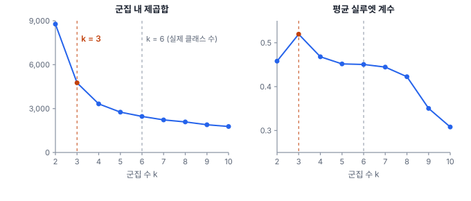
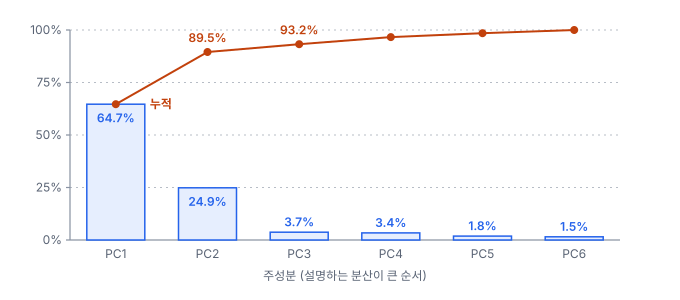
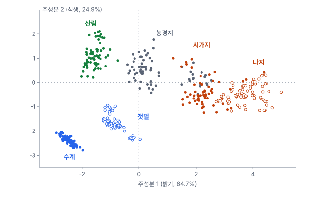

# 19강 정답 없이 구조 찾기

## 이 강에서 얻는 것

- K-평균·ISODATA·계층적 군집·DBSCAN의 작동 방식과 쓰임새를 구분하고, 군집 결과를 실제 클래스와 비교할 수 있음
- 주성분 분석으로 얽힌 밴드를 몇 개의 축으로 줄이고, 설명분산비율로 남길 축 수를 정할 수 있음
- t-SNE·UMAP 그림에서 읽어도 되는 것과 안 되는 것을 가를 수 있음

## 1. 라벨 없이 묶기: 거리와 표준화

13강의 비지도학습에서 대표 작업은 비슷한 것끼리 묶는 **군집(clustering)**과 변수 여럿을 적은 수의 축으로 줄이는 **차원 축소(dimensionality reduction)**임. 원격탐사의 **무감독 분류(unsupervised classification)**는 픽셀을 분광값만으로 군집한 뒤 사람이 군집마다 "수계", "산림" 같은 이름을 붙이는 오래된 방식임. 군집 번호 자체에는 뜻이 없음.

군집은 대부분 거리 계산에 기대므로 변수의 크기가 결과를 좌우함. 3부 공통 자료(표본 픽셀 2,883개)에서 근적외(B8)의 표준편차는 0.107, 청색(B2)은 0.031이라 분산이 약 12배임. 원시 반사율 그대로면 근적외가 거리를 거의 혼자 정하므로, 10강의 **표준화**(평균 0, 표준편차 1)로 밴드마다 같은 발언권을 줌.

## 2. K-평균 군집과 ISODATA 군집

**K-평균 군집(K-means clustering)**은 군집 수 $k$를 정해 주면 임시 중심 $k$개를 두고, 각 점을 가장 가까운 중심에 배정한 뒤 군집 평균을 새 중심으로 삼는 일을 배정이 바뀌지 않을 때까지 반복함. 이 과정은 **군집 내 제곱합**(각 점과 자기 중심 사이 거리 제곱의 합)을 줄여 감.

$$W = \sum_{j=1}^{k} \sum_{i \in C_j} \lVert x_i - \mu_j \rVert^2$$

$C_j$는 $j$번째 군집, $\mu_j$는 그 중심임. 출발점에 따라 다른 답에 멈추므로(표준화 자료, $k = 6$, 무작위 출발 10번에서 $W$가 2,464~2,994) 여러 번 돌려 $W$가 가장 작은 결과를 고름. 둥글고 크기가 비슷한 무리에 강하고, 길쭉하거나 밀도가 제각각인 무리에는 약함.

13강에서 본 결과를 실제 클래스와 교차표로 비교함. 열 이름은 각 군집의 다수 클래스임.

| 실제 \ 군집 | →산림 | →농경지 | →시가지 | →수계 | →나지 | →갯벌 |
|---|---|---|---|---|---|---|
| 산림 | 875 | 0 | 0 | 0 | 0 | 0 |
| 농경지 | 0 | 698 | 199 | 0 | 0 | 1 |
| 시가지 | 0 | 8 | 364 | 0 | 49 | 0 |
| 수계 | 0 | 0 | 0 | 362 | 0 | 0 |
| 나지 | 0 | 0 | 18 | 0 | 201 | 0 |
| 갯벌 | 0 | 0 | 0 | 0 | 0 | 108 |

산림·수계·갯벌은 그대로 갈리고, 시가지와 닮은 휴경지 199픽셀이 시가지 군집에 섞임. 대각선 합은 2,608개(90.5%)임.

군집 번호를 클래스와 짝짓지 않고 일치도를 재는 지표가 **조정 랜드 지수(ARI)**임. 픽셀 쌍마다 "같은 클래스인가"와 "같은 군집인가"를 비교함. 같은 클래스이면서 같은 군집인 쌍은 803,971쌍이고, 무작위로 군집했을 때의 기대치는 210,305쌍이라 이를 빼서 보정함.

$$\mathrm{ARI} = \frac{803{,}971 - 210{,}305}{935{,}305 - 210{,}305} = 0.819$$

분모의 935,305는 같은 클래스인 쌍과 같은 군집인 쌍 수의 평균(최대치 역할)임. 1이면 완전 일치, 0이면 무작위 수준임. 원시 반사율로 돌리면 ARI가 0.587로 떨어지는데, 산림이 근적외 밝기에 따라 두 군집으로 쪼개지고 수계와 갯벌이 한 군집으로 합쳐지기 때문임.

**ISODATA 군집**은 원격탐사 도구의 무감독 분류에 흔히 들어 있는 K-평균의 확장임. 반복하면서 표준편차가 기준보다 큰 군집은 **분할**하고, 중심이 가까운 두 군집은 **병합**하고, 너무 작은 군집은 버림. 그래서 $k$ 대신 군집 수 범위, 최소 크기, 분할·병합 기준, 반복 횟수를 정함(이름과 기본값은 도구마다 다름).

실무에서는 군집을 클래스 수보다 넉넉히 만들어 이름을 붙이고 같은 이름끼리 합침. 같은 자료를 $k = 12$로 나눠 다수 클래스 이름을 붙이면(실무에서는 영상 판독으로 붙임) 일치율이 94.5%로 오르지만, 시가지는 273픽셀만 맞아 $k = 6$(364)보다 나빠짐. 섞인 군집은 잘게 나눠도 풀리지 않음.

## 3. k는 몇 개인가: 엘보와 실루엣

$k$를 늘리면 $W$는 계속 줄어드므로, 줄어드는 폭이 갑자기 완만해지는 지점을 찾음. 이를 **엘보 방법(elbow method)**이라 부름. 공통 자료에서 $W$는 $k = 2$에서 8,772, 3에서 4,762, 4에서 3,318이고 그 뒤로 완만해짐.

**실루엣 계수(silhouette coefficient)**는 점 하나가 자기 군집에 얼마나 잘 들어맞는지를 −1~1로 잼.

$$s_i = \frac{b_i - a_i}{\max(a_i, b_i)}$$

$a_i$는 같은 군집 점들까지의 평균 거리, $b_i$는 가장 가까운 다른 군집 점들까지의 평균 거리임. 평균 실루엣은 $k = 3$에서 0.519로 가장 높고 $k = 6$에서 0.451임.

$k = 3$의 군집은 {산림 + 농경지 대부분}, {시가지 + 나지 + 휴경지}, {수계 + 갯벌}로 분광적으로 가장 굵은 세 덩어리임. 두 기준은 자료의 뭉침을 볼 뿐이므로 후보를 좁히는 데 쓰고, 최종 $k$는 산출물의 목적으로 정함.

## 4. 계층적 군집과 DBSCAN

**계층적 군집(hierarchical clustering)**은 점 하나하나를 군집으로 시작해 가장 가까운 두 군집을 합치기를 반복함. 합쳐지는 과정을 나무로 그린 **덴드로그램(dendrogram)**을 원하는 높이에서 자르면 군집 수가 정해지며, 결과는 군집 사이 거리를 재는 연결 방식에 크게 좌우됨. 공통 자료를 6개로 자르면, 군집 내 제곱합이 가장 적게 느는 쌍을 합치는 와드(Ward) 연결은 ARI 0.801임. 가장 가까운 두 점의 거리를 쓰는 단일 연결은 사슬처럼 이어져 1,573픽셀짜리 거대 군집과 1픽셀짜리 군집 둘을 만들고 ARI 0.477에 그침. 모든 점 쌍의 거리를 다루므로 표본 픽셀처럼 작은 자료에 씀.

**DBSCAN(밀도 기반 공간 군집)**은 반경 $\varepsilon$ 안에 이웃이 최소 개수(`min_samples`, scikit-learn은 점 자신도 셈) 이상인 점을 핵심점으로 삼고, 서로 닿는 핵심점과 그 이웃을 한 군집으로 이음. 어디에도 닿지 않는 점은 **잡음**으로 남김. $k$가 필요 없고, 길쭉한 모양도 되며, 억지로 군집에 넣지 않음.

그래서 점 자료의 공간 군집에 자주 씀. 가상 해역의 선박 탐지 중심점 104개(묘박지 40척, 항 입구 20척, 약 10 km 길이의 조업 띠 30척, 흩어진 14척)에 $\varepsilon = 1.5$ km, `min_samples` 5를 쓰면 세 밀집 지역(41, 21, 30척)이 나오고 흩어진 14척 중 12척이 잡음으로 남음. K-평균 $k = 3$은 흩어진 14척을 모두 어느 군집에 끼워 넣음. 반경을 1.0 km로 줄이면 밀도가 낮은 조업 띠가 14척과 11척으로 끊김. 반경은 각 점에서 $k$번째로 가까운 이웃까지의 거리($k$는 보통 `min_samples` 근처)를 크기순으로 그린 k-거리 도표의 꺾이는 곳을 참고함.

## 5. 주성분 분석과 설명분산비율

다중분광 밴드는 서로 강하게 얽혀 있음. 공통 자료에서 가시광 세 밴드끼리 상관은 0.73~0.84, 적색(B4)과 단파적외2(B12)는 0.87이고, 근적외만 녹색·적색과 거의 무관함(0.01~0.02).

**주성분 분석(PCA)**은 원래 변수의 가중합으로 새 축을 만들되, 첫 축은 분산이 가장 큰 방향으로, 다음 축은 앞 축과 직각(상관 0)이면서 남은 분산이 가장 큰 방향으로 잡음. 이 축이 **주성분**, 가중치가 **적재값(loading)**이고, 주성분 하나가 담은 분산이 전체에서 차지하는 몫이 **설명분산비율(explained variance ratio)**임. 표준화 자료는 전체 분산이 변수 수(6)와 같아서, 첫 주성분의 분산(고윳값) 3.88은 64.7%임.

이런 그림을 **스크리 도표(scree plot)**라 부름. 주성분 2개로 89.5%, 3개로 93.2%를 담고 나머지 셋은 잡음에 가까움. 남길 수는 누적 비율(예: 90%), 스크리 도표의 꺾임, 고윳값 1 이상(여기서는 2개) 같은 경험 규칙으로 정함. 주성분 2개로 K-평균을 돌려도 ARI는 0.820으로 밴드 6개(0.819)와 거의 같음.

첫 주성분은 근적외(0.07)를 뺀 다섯 밴드에 0.40~0.48로 고르게 실려 **밝기**에 해당함. 둘째는 근적외(0.78)·단파적외1(0.44)이 양, 청색(−0.42)이 음이라 **식생** 방향임. 부호는 도구·실행마다 뒤집힐 수 있으므로 적재값을 보고 해석함.

원시 반사율로 하면 첫 주성분(61.7%)을 분산이 큰 근적외와 단파적외1(적재값 각 0.61)이 차지하므로, 퍼짐이 다른 변수는 표준화한 뒤 PCA를 함. 8강의 주성분 회귀는 이렇게 만든 상관없는 축으로 회귀해 다중공선성을 피하는 방법임. 다만 PCA는 라벨을 보지 않으므로 분산이 작은 주성분에 드문 클래스를 가르는 정보가 있을 수 있음.

## 6. t-SNE와 UMAP 그림 읽기

**t-SNE**와 **UMAP**은 고차원 자료를 2~3차원 그림으로 펼치는 비선형 차원 축소임. PCA가 전체 분산을 직선 축으로 보존한다면, 이 둘은 원래 공간의 **가까운 이웃 관계**를 살리는 데 집중함. 무리가 선명하게 갈려 보이지만 다음은 믿으면 안 됨.

- **점구름 크기**: 표준화한 원래 공간에서 산림과 갯벌은 중심에서 퍼진 정도(평균 거리의 제곱평균제곱근)가 0.82와 0.75로 비슷한데, t-SNE(퍼플렉서티 30, 시드 0. 수치는 도구·버전마다 조금씩 다름) 그림에서는 16.7과 4.5임
- **무리 사이 거리**: 원래 공간에서 산림 중심은 시가지(4.29)보다 갯벌(2.94)에 가까운데, 그림에서는 갯벌이 더 멂(87.9 대 77.7)
- **매개변수**: 퍼플렉서티(각 점이 실질적으로 고려하는 이웃 수에 가까운 값)를 5, 30, 50으로 바꾸면 갯벌 점구름은 산림의 0.45배, 0.27배, 0.21배가 됨. UMAP은 이웃 수(`n_neighbors`)와 최소 거리(`min_dist`)가 모양을 바꿈. 초기화 방식과 시드에 따라서도 배치가 달라질 수 있음

UMAP은 t-SNE보다 빠르고 새 자료를 같은 그림에 올리는 변환도 지원해 큰 자료에 많이 쓰임. 둘 다 보기 위한 도구이므로 그림 좌표로 군집을 나누거나 거리를 재지 않고, 확인은 원래 공간의 지표(ARI, 실루엣, 분류 성능)로 함. 48강의 기초모델이 뽑은 신경망 특징 벡터도 같은 도구로 들여다봄.

## 현장에서는

라벨이 없는 새 지역의 Sentinel-2 영상으로 토지피복 초안을 만드는 상황임. 구름·그림자를 마스크하고 표준화한 뒤 ISODATA로 15~25개 군집을 만들고, 판독자가 합성 영상(21강)을 보며 이름을 붙여 합침.

시가지와 휴경지가 섞인 군집은 더 나누거나 현장 확인 목록에 올림. 초안은 그대로 납품하지 않고, 군집을 층으로 삼아 학습 라벨과 정확도 평가 표본을 뽑는 데 씀(3강의 층화 표본). 최종 지도는 그 라벨로 감독 분류해 만듦.

## 헷갈리는 쌍

- **군집 vs 분류**: 군집 결과는 번호일 뿐이고 이름은 사람이 붙임. 정확도는 교차표나 ARI로 비교함.
- **K-평균 vs K-최근접 이웃**: 이름만 닮음. K-평균은 라벨 없이 묶는 군집이고, K-최근접 이웃은 가까운 라벨 $k$개의 다수결로 분류하는 지도학습임.
- **PCA vs t-SNE·UMAP**: PCA는 직선 변환이라 적재값으로 축의 뜻을 읽고 새 자료에 그대로 적용함. t-SNE·UMAP은 이웃 관계만 살린 그림이라 축에 뜻이 없음.

## 이렇게 지시받음

> 지시: "새 지역 라벨 없으니까 ISODATA로 20개쯤 뽑아서 피복 초안 만들어 줘."

무감독 분류로 초안을 만들라는 뜻임. 구름 마스크와 표준화를 먼저 하고, 분할·병합 기준과 최종 군집 수를 기록하며, 이름 붙이기 어려운 섞인 군집은 따로 표시해 넘김.

> 지시: "선박 탐지 좌표로 밀집 해역 뽑아. DBSCAN 반경 1 km로."

좌표가 미터 단위 투영 좌표계인지 먼저 확인함. 위경도 그대로면 반경이 도 단위가 되고 경도 1도의 거리도 위도마다 다름(25강). k-거리 도표로 1 km가 적당한지 보고, 잡음 점은 버리지 말고 따로 보고함.

> 지시: "새 백본 특징 UMAP으로 찍어서 클래스별로 잘 갈리는지 보여 줘."

그림은 정성적 확인용임. 매개변수를 두세 가지로 바꿔 모양이 유지되는지 보이고, 점구름 크기나 거리로 결론을 내지 않음. "잘 갈린다"는 원래 특징 공간의 실루엣이나 선형 탐침(12강, 48강) 정확도로 뒷받침함.

## 요약

- 군집은 거리에 기대므로 표준화 여부가 결과를 크게 바꿈
- K-평균은 군집 내 제곱합을 줄이고, ISODATA는 분할·병합을 더함. 무감독 분류는 넉넉히 군집한 뒤 사람이 이름을 붙여 합침
- 엘보·실루엣은 뭉침을 볼 뿐 원하는 클래스 수를 알려 주지 않음. 계층적 군집은 연결 방식에, DBSCAN은 반경과 최소 이웃 수에 민감하고 DBSCAN은 잡음을 따로 남김
- PCA는 얽힌 밴드를 상관없는 축으로 바꾸며, 설명분산비율로 남길 축 수를 정함
- t-SNE·UMAP 그림의 점구름 크기와 무리 사이 거리는 뜻이 없고 매개변수에 따라 바뀜

## 핵심 용어

| 한글 | 영문 |
|---|---|
| 군집 / 무감독 분류 | Clustering / Unsupervised Classification |
| K-평균 군집 / 군집 내 제곱합 | K-Means Clustering / Within-Cluster Sum of Squares |
| ISODATA 군집 | ISODATA (Iterative Self-Organizing Data Analysis Technique) |
| 조정 랜드 지수 | Adjusted Rand Index (ARI) |
| 엘보 방법 / 실루엣 계수 | Elbow Method / Silhouette Coefficient |
| 계층적 군집 / 덴드로그램 | Hierarchical Clustering / Dendrogram |
| 밀도 기반 공간 군집 | Density-Based Spatial Clustering of Applications with Noise (DBSCAN) |
| 주성분 분석 / 적재값 | Principal Component Analysis (PCA) / Loading |
| 설명분산비율 / 스크리 도표 | Explained Variance Ratio / Scree Plot |
| t-SNE | t-Distributed Stochastic Neighbor Embedding |
| UMAP | Uniform Manifold Approximation and Projection |
