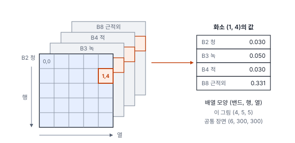
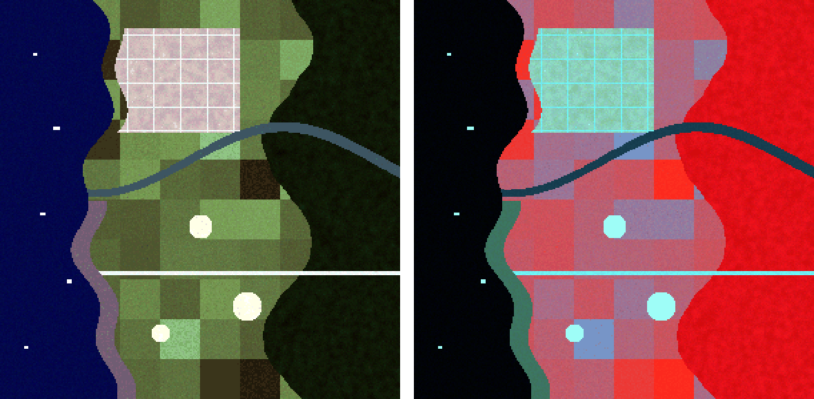
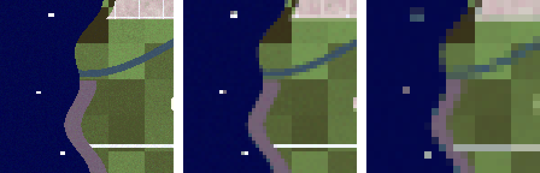

# 20강 디지털 영상과 네 가지 해상도

## 이 강에서 얻는 것

- 위성·드론 영상을 행·열·밴드로 이루어진 숫자 배열로 읽고, 화소 하나가 무엇을 뜻하는지 설명할 수 있음
- 공간·분광·방사·시간해상도를 구분하고, 과제에 필요한 해상도를 수치로 따질 수 있음(드론 GSD, 탐지 가능한 대상 크기, 구름을 피할 확률)
- 비트심도와 디지털 수치(DN)를 알고, 제품마다 다른 스케일·오프셋으로 DN을 반사율로 바꿀 수 있음

## 1. 영상은 숫자 격자임

디지털 영상은 땅을 같은 크기의 칸으로 나누고 칸마다 숫자를 적어 둔 것임. 칸 하나를 **픽셀(pixel, 화소)**이라 부름. 공간을 격자로 나눠 칸마다 값을 저장하는 자료 구조를 **래스터(raster)**라 하며, 위성 영상과 토지피복도·고도·지표면온도 지도가 모두 래스터임.

화소 값은 한 점이 아니라 칸이 덮는 면적에서 받은 빛을 모은 값임. 칸 안에 물과 땅이 반씩 있으면 중간쯤 값이 나오며, 이것이 1강의 혼합 픽셀임.

화소의 위치는 **(행, 열)**로 부름. 원점은 왼쪽 위 (0, 0)이고, 행 번호는 아래로, 열 번호는 오른쪽으로 커짐. 지도 좌표는 x가 동쪽, y가 북쪽으로 커지므로, 북쪽이 위인 영상에서는 행이 늘수록 y가 줄어듦. 두 좌표를 잇는 규칙(지오트랜스폼)은 25강에서 다룸. GDAL 계열 도구는 그 기준점을 왼쪽 위 화소의 중심이 아닌 **모서리**로 잡으므로, 화소 중심 좌표가 필요하면 행·열 번호에 0.5를 더해 변환함.

**벡터(vector)** 자료는 점·선·폴리곤을 꼭짓점 좌표로 저장함. 탐지 박스, 건물 외곽선, 조사 폴리곤이 벡터이고 GeoJSON·Shapefile이 대표 형식임. 딥러닝 라벨도 벡터로 만들어 두었다가 학습 때 래스터 마스크나 영상 좌표로 바꾸는 경우가 많음(44강).

## 2. 밴드: 격자가 겹겹이 쌓임

위성 센서는 파장 구간마다 따로 빛을 잼. 한 파장 구간을 기록한 격자 한 장이 **분광 밴드(spectral band)**임. 같은 장소를 청·녹·적·근적외 밴드로 찍으면 크기가 같은 격자 네 장이 겹쳐 쌓이고, 화소 하나는 밴드 수만큼의 값을 가짐.

곧 영상은 **(밴드, 행, 열)**의 3차원 배열임. 4부 공통 자료는 가상 연안 장면 300×300 화소(10 m, 3×3 km)에 밴드 6개(B2 청, B3 녹, B4 적, B8 근적외, B11·B12 단파적외)가 있어 모양이 (6, 300, 300)임. 딥러닝에서는 밴드를 **채널(channel)**이라 부르고, 이 배열이 그대로 입력 텐서(다차원 배열)가 됨(30강). 축 순서는 도구마다 달라서 rasterio는 (밴드, 행, 열), OpenCV·PIL로 읽으면 (행, 열, 채널), PyTorch는 여러 장을 묶어 (장 수, 채널, 행, 열)이므로 모델에 넣기 전에 확인함.

밴드 셋을 화면의 적·녹·청에 대응시키면 사람이 볼 수 있음. 적·녹·청 밴드를 그대로 쓰면 트루컬러, 근적외를 적색 자리에 넣으면 식생이 붉게 보이는 폴스컬러임(21강).

## 3. 공간해상도: 화소 하나가 땅에서 얼마인가

**공간해상도(spatial resolution)**는 영상이 땅을 얼마나 잘게 구분하는지를 뜻함. 흔히 **지상 표본 거리(Ground Sample Distance, GSD)**, 곧 이웃한 두 화소 중심 사이의 지상 거리로 나타냄. Sentinel-2는 밴드 13개 중 B2·B3·B4·B8이 10 m, B5~B7·B8A·B11·B12가 20 m, B1·B9·B10이 60 m임. Landsat 8/9의 다중분광 밴드는 30 m임.

**공간해상도와 화소 크기는 같은 말이 아님.** 파일의 화소 크기는 리샘플링(격자를 다시 짜서 값을 옮기는 일, 25강)으로 바꿀 수 있음. Landsat 8/9의 열적외 밴드는 100 m로 관측하지만 제품에는 30 m 화소로 들어 있고, Sentinel-2의 20 m 밴드를 10 m로 쪼개 쓰는 경우도 흔함. 화소가 작아졌다고 세부가 새로 생기지는 않음. 또 렌즈·흔들림·대기 때문에 실제로 구분되는 크기는 GSD보다 큼.

드론은 GSD를 비행 고도로 정함. 렌즈 중심에서 센서까지가 초점거리 $f$, 땅까지가 고도 $H$이면, 닮은 삼각형으로 센서 위 화소 한 칸 $p$가 땅에서 차지하는 길이는 다음과 같음.

$$\mathrm{GSD} = \frac{H \times p}{f}$$

고도를 두 배로 올리면 GSD도 두 배가 됨. 가로 13.2 mm에 5,472화소, 세로 8.8 mm에 3,648화소가 들어간 센서(화소 크기 약 2.41 µm)와 초점거리 8.8 mm 렌즈로 100 m 높이에서 찍으면 GSD는 약 2.74 cm이고, 사진 한 장이 150×100 m를 덮음. 50 m로 내려가면 1.37 cm가 되지만 사진이 네 배 필요함. 여기서 $H$는 이륙 지점이 아니라 **지면까지의** 높이라서, 기복이 있으면 곳곳의 GSD가 다름(26강).

GSD는 탐지할 수 있는 가장 작은 대상을 정함. 공통 장면의 선박(20×30 m ~ 30×50 m)은 10 m에서 6~15화소지만, 화소를 3×3·6×6개씩 평균해 30 m·60 m 영상을 흉내 내면 2~4화소, 대개 1화소로 줄어듦.

60 m에서 선박 화소의 적색 반사율은 0.057~0.091로, 바다(0.025)와 선박(0.22) 사이에 머묾. 선박이 화소의 6분의 1~3분의 1만 채우기 때문임. 가장 큰 30×50 m 선박도 격자 경계에 걸려 네 화소로 쪼개지며 가장 작은 선박만큼 흐려짐. 한두 화소짜리 대상은 모양 정보가 없어 밝기만으로 부표·파랑과 가려야 함. 소형 객체 탐지의 어려움은 35·39강에서 다룸.

## 4. 분광해상도와 시간해상도

**분광해상도(spectral resolution)**는 파장을 얼마나 잘게 나눠 보는지, 곧 밴드의 수와 각 밴드의 파장 폭임. 전정색(panchromatic) 영상은 넓은 파장 구간 하나로, 다중분광 영상은 수~십여 개로, 초분광 영상은 수백 개의 좁은 밴드로 나눔. 밴드가 좁으면 들어오는 빛이 적어 화소를 키워야 잡음을 견딤. Sentinel-2에서 폭이 100 nm 남짓인 근적외 밴드 B8은 10 m, 폭이 20 nm 정도인 B8A는 20 m인 것이 그 예임.

**시간해상도(temporal resolution)**는 같은 곳을 다시 찍기까지의 간격, 곧 재방문 주기임. Sentinel-2는 위성 두 대로 적도 기준 5일, Landsat은 한 대가 16일이고 8·9호를 합치면 8일임. 광학 영상은 구름이 끼면 못 쓰므로 이 간격이 중요함. 촬영할 때마다 흐릴 확률이 0.6이고 날마다 독립이라고 하면, 30일 안에 맑은 장면을 한 장이라도 얻을 확률은 다음과 같음.

$$1 - 0.6^{6} \approx 0.95 \quad (\text{5일 주기, 6회}), \qquad 1 - 0.6^{2} = 0.64 \quad (\text{16일 주기, 많아야 2회})$$

실제 장마철에는 흐린 날이 몰려 있어 이보다 나쁨. 구름을 뚫고 보는 레이더 영상인 SAR(합성개구레이더, 22강)를 함께 쓰는 이유임.

네 해상도는 서로 맞바꾸는 관계임. 화소가 작으면 한 번에 찍는 폭이 좁아 재방문이 길어지기 쉽고, 밴드를 잘게 나누면 화소를 키워야 함. 그래서 과제 요구(가장 작은 대상, 필요한 밴드, 관측 빈도)부터 정하고 센서를 고름.

## 5. 방사해상도와 디지털 수치

**방사해상도(radiometric resolution)**는 화소 밝기를 몇 단계로 기록하는지임. 흔히 **비트심도(bit depth)**로 나타내며, $n$비트면 $2^n$단계임. 8비트는 256단계(0~255), 12비트는 4,096단계(0~4,095), 16비트는 65,536단계임. Sentinel-2와 Landsat 8은 12비트, Landsat 9는 14비트로 기록하지만, 파일에는 모두 16비트 정수로 담아 배포함.

단계가 많을수록 어두운 대상의 미세한 차이가 남음. 공통 장면의 반사율 0~0.5를 12비트에 담으면 한 단계가 반사율 0.000122인데, 8비트로 줄이면 0.00196이 됨. 이때 바다 화소의 근적외(B8) 값은 32가지에서 3가지(7·8·9)로 뭉개짐. 물은 어두워서 해색·탁도처럼 물속 차이를 보는 산출물일수록 비트심도가 중요함.

센서가 받은 빛을 정수로 양자화해 저장한 값, 곧 물리 단위로 바꾸기 전의 화소 값을 **디지털 수치(Digital Number, DN)**라 부름. DN은 제품마다 정해진 스케일과 오프셋으로 반사율 $\rho$(또는 복사휘도)로 바꿈.

$$\rho = \mathrm{DN} \times \text{스케일} + \text{오프셋}$$

Sentinel-2 L2A(대기 보정을 거친 지표 반사율 제품)는 처리 기준(processing baseline, 제품을 만드는 처리 방식의 판 번호) 04.00(2022년 1월) 이후 DN에 1,000을 더해 두었으므로(13강) 반사율은 $(\mathrm{DN} - 1000)/10000$임. Landsat Collection 2 Level-2 지표 반사율은 $\mathrm{DN} \times 0.0000275 - 0.2$임. 같은 DN 1,650이 Sentinel-2에서는 반사율 0.065이지만 Landsat 식으로 계산하면 −0.155라는 있을 수 없는 값이 됨. **DN만 보고는 뜻을 알 수 없고, 제품 문서의 스케일·오프셋이 짝으로 따라다녀야 함.** 또 두 제품 모두 DN 0을 자료 없음(nodata)으로 쓰므로 통계를 내기 전에 걸러 냄.

비트심도는 용량과도 이어짐. Sentinel-2 타일(약 110 km 사방)의 10 m 밴드 하나는 10,980×10,980 화소라 16비트로 약 241 MB(압축 전)이고, 32비트 실수 반사율로 바꿔 저장하면 두 배가 됨.

## 현장에서는

Sentinel-2 L2A로 2019~2024년 연안 농경지의 월별 NDVI 시계열을 만드는 상황임. 그런데 그래프를 그려 보니 2022년 초부터 NDVI가 계단처럼 떨어져, 같은 작물 상태에서 0.62이던 값이 0.39로 나옴.

원인은 오프셋을 빼지 않은 것임. 적색 0.065·근적외 0.279인 화소는 2022년 이후 DN 1,650·3,790으로 저장되는데, 10,000으로만 나누면 두 밴드에 0.1씩 더해져 NDVI $= (\text{근적외} - \text{적색}) / (\text{근적외} + \text{적색})$의 분모가 커지면서 값이 0.622에서 0.393으로 줄어듦. 식생이 변한 것이 아니라 처리 기준이 바뀐 것임.

조치는 날짜로 일괄 판단하지 않고, 장면마다 메타데이터에서 처리 기준 버전과 오프셋 값을 읽어 적용하는 것임(과거 장면도 재처리된 판에는 오프셋이 붙어 있을 수 있음). 시계열·변화탐지 산출물에 날짜를 따라 계단이 보이면 실제 변화보다 처리 기준 변경을 먼저 의심함.

## 헷갈리는 쌍

- **영상 크기 vs 공간해상도**: 딥러닝의 "해상도 640"은 입력이 640×640 화소라는 뜻이고, 원격탐사의 공간해상도는 화소 하나의 지상 크기(GSD)임. 같은 640×640 타일도 GSD 0.5 m면 320 m, 10 m면 6.4 km를 덮음. 영상을 확대해 입력을 키워도 정보는 늘지 않음.
- **비트심도 vs 저장 자료형**: 비트심도는 센서가 구분한 단계 수이고, 자료형(uint8·uint16·float32)은 파일에 담는 그릇임. 12비트로 기록한 자료도 스케일을 거친 uint16 파일에서는 4,095를 넘는 값이 흔하므로, 값의 범위는 제품 문서로 확인함.
- **DN vs 반사율**: DN은 센서·제품마다 다른 약속으로 적힌 정수이고, 반사율은 들어온 빛 중 되돌아간 비율이라는 물리량임. 다른 날짜·센서끼리 비교하거나 식생지수를 계산할 때는 반사율로 바꾼 뒤에 함.

## 이렇게 지시받음

> 지시: "요구가 길이 20 m급 선박이야. S2 10 m로 되는지 따져 보고 안 되면 대안 가져와."

20×5 m 선박은 10 m 격자에서 길이 2화소, 폭 반 화소라 3절의 60 m 영상 속 선박처럼 모양 없는 흐린 점이 됨. 밝기로 후보는 찾아도 부표·파랑과 가리기 어렵다고 보고함. 대안은 공간해상도가 높은 광학 영상(GSD 0.5 m면 40×10화소)이나 선박이 밝게 보이는 SAR이며, 이때 재방문 주기와 비용도 함께 비교함.

> 지시: "드론은 GSD 3 cm로 맞춰서 비행 계획 잡아."

GSD 공식을 고도에 대해 풀면 $H = \mathrm{GSD} \times f / p$라서, 3절의 카메라(8.8 mm, 2.41 µm)면 약 109 m임. 이 고도는 지면 기준이라 지대가 높은 곳은 GSD가 작아지고 낮은 곳은 커지므로, 가장 낮은 지면에서도 3 cm를 넘지 않게 잡거나 지형을 따라 고도를 바꿈. 사진끼리 겹치는 비율은 26강에서 다룸.

> 지시: "라벨링용은 8비트 PNG로 뽑고, 학습은 원본 16비트로 해."

8비트 PNG는 사람이 보기 좋게 늘인(스트레칭, 21강) 화면용이고, 모델에는 단계가 많은 원본 값을 넣으라는 뜻임. 라벨이 원본에 그대로 맞도록 PNG는 원본과 같은 격자(행·열 수, 화소 위치)로 만들고 리샘플링하지 않음. 추론 때도 학습과 같게 DN을 반사율로 바꾸고 정규화(밴드별 평균·표준편차로 값의 범위를 맞추는 일)함(13강).

## 요약

- 디지털 영상은 화소 격자인 래스터이고, 밴드가 쌓여 (밴드, 행, 열)의 3차원 배열이 됨. 화소 위치는 왼쪽 위가 원점인 (행, 열)로, 지도 좌표와 방향이 다름
- 공간해상도는 흔히 GSD로 나타내며, 파일의 화소 크기와 같지 않을 수 있음. 드론 GSD는 고도 × 센서 화소 크기 ÷ 초점거리임
- GSD가 거칠어지면 작은 대상은 한두 화소의 흐린 점이 되어 모양 정보를 잃음
- 분광해상도는 밴드의 수·폭, 시간해상도는 재방문 주기이며, 네 해상도는 서로 맞바꾸는 관계임
- 방사해상도는 비트심도($2^n$단계)로 나타내고, DN은 제품마다 다른 스케일·오프셋으로 반사율로 바꿔야 뜻이 생김

## 핵심 용어

| 한글 | 영문 |
|---|---|
| 픽셀(화소) | Pixel |
| 래스터 / 벡터 | Raster / Vector |
| 분광 밴드 / 채널 | Spectral Band / Channel |
| 공간해상도 | Spatial Resolution |
| 지상 표본 거리 | Ground Sample Distance (GSD) |
| 분광해상도 | Spectral Resolution |
| 방사해상도 / 비트심도 | Radiometric Resolution / Bit Depth |
| 시간해상도 / 재방문 주기 | Temporal Resolution / Revisit Time |
| 디지털 수치 | Digital Number (DN) |
| 반사율 | Reflectance |
