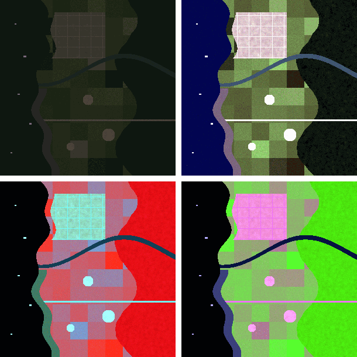
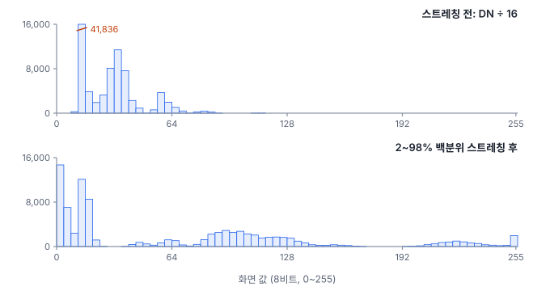
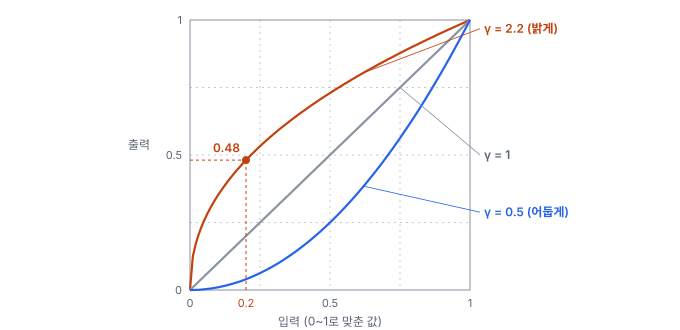

# 21강 색과 밴드 조합

## 이 강에서 얻는 것

- 다중분광 밴드 가운데 셋을 골라 트루컬러·폴스컬러 영상을 만들고, 색이 무엇을 뜻하는지 읽을 수 있음
- 히스토그램 스트레칭과 감마 보정으로 어두운 영상을 보기 좋게 만들되, 그 값이 화면용이라는 것을 구분할 수 있음
- RGB·HSV·Lab 색공간과 그레이스케일 변환의 쓰임새와 함정을 알 수 있음

## 1. 화면은 세 채널: RGB 색공간

20강에서 영상은 밴드마다 DN(디지털 수치)이 담긴 격자라고 했음. 4부 공통 자료는 가상 연안 장면(300×300 화소, 10 m)의 Sentinel-2 밴드 6개이고, DN은 반사율 0~0.5를 12비트(0~4095)에 담은 가상 규칙으로 만듦(20강 5절).

모니터는 **RGB 색공간(RGB color space)**으로 색을 냄. 빨강(R)·초록(G)·파랑(B) 빛의 세기 세 숫자로 색 하나를 나타내는 방식이고, 세 빛을 더할수록 밝아져 셋이 모두 최대면 흰색이 됨. 보통 채널마다 8비트(0~255)라서 표현할 수 있는 색은 $256^3 = 16{,}777{,}216$가지임.

그래서 위성 영상을 띄우려면 **어떤 밴드 셋을 R·G·B에 넣을지**(2절)와 **12비트 값을 0~255로 어떻게 줄일지**(3·4절)를 정함. 둘 다 보는 방식만 바꾸고 자료는 바꾸지 않음.

## 2. 트루컬러 합성과 폴스컬러 합성

공통 자료의 밴드와 중심 파장은 다음과 같음. 중심 파장은 Sentinel-2A 기준의 반올림 값이고, 위성(2A·2B·2C)과 문서 판에 따라 몇 nm씩 다름(B8은 842 nm로 적은 문서도 있음).

| 밴드 | 영역 | 중심 파장 | 원래 해상도 |
|---|---|---|---|
| B2 | 청색 | 약 490 nm | 10 m |
| B3 | 녹색 | 약 560 nm | 10 m |
| B4 | 적색 | 약 665 nm | 10 m |
| B8 | 근적외 | 약 833 nm | 10 m |
| B11 | 단파적외 1 | 약 1,610 nm | 20 m |
| B12 | 단파적외 2 | 약 2,200 nm | 20 m |

**트루컬러 합성(true color composite)**은 적색·녹색·청색 밴드를 그대로 R·G·B에 넣는 것임(B4·B3·B2). 눈으로 본 모습과 비슷해 판독자에게 익숙함.

**폴스컬러 합성(false color composite)**은 눈에 보이지 않는 밴드를 넣거나 순서를 바꿔 넣는 것임. 가장 흔한 **표준 폴스컬러**(컬러 적외선 합성이라고도 함)는 근적외·적색·녹색(B8·B4·B3)을 R·G·B에 넣음. 식물 잎은 근적외를 강하게 반사하고 적색은 엽록소가 흡수하므로, 식생이 R 채널만 밝아져 **빨갛게** 보임. 물은 근적외를 거의 흡수해 검게 보이고, 시가지는 청록·회색빛이 됨. 공통 자료의 산림은 근적외 반사율 약 0.33, 적색 약 0.03이라 새빨갛게 나옴.

**단파적외(SWIR) 합성**의 한 예는 B12·B8·B4임. 식생은 초록, 나지·시가지는 분홍·자주, 물은 검정으로 갈리고, 파장이 길어 옅은 연무의 영향을 덜 받음(구름은 뚫지 못함). B11·B12는 원래 20 m라서 10 m 밴드와 겹치려면 리샘플링(25강)이 들어감.

밴드 번호는 센서마다 다름. 표준 폴스컬러가 Landsat 8·9에서는 5·4·3, Landsat 5·7에서는 4·3·2이므로 "432 합성"처럼 번호만 들으면 센서를 확인함.

## 3. 히스토그램 스트레칭

반사율은 대부분 0~0.3이라 DN도 범위의 아래쪽에 몰림. 공통 자료의 적색(B4) DN은 181~1,934이고 평균 421임. 12비트를 8비트로 그냥 줄이면(16으로 나누면) 화면 값이 11~120에만 쓰이고 화소의 97.5%가 64 아래에 들어가 영상이 거의 검게 보임(그림 위 왼쪽).

**히스토그램 스트레칭(histogram stretching)**은 값의 분포(히스토그램)를 화면 범위 0~255에 맞게 늘리는 것임. 가장 단순한 선형 스트레칭은 하한 $a$를 0, 상한 $b$를 255로 보냄.

$$v' = 255 \times \frac{v - a}{b - a} \quad (0\text{ 아래는 }0,\ 255\text{ 위는 }255\text{로 자름})$$

$a$~$b$를 0~255로 일정 비율로 늘리고 바깥은 끝값에 붙이는 것으로, 10강의 최소-최대 정규화에서 최솟값·최댓값 자리에 $a$, $b$를 넣고 255를 곱한 식임.

$a$와 $b$를 최솟값·최댓값으로 잡으면(최소-최대 스트레칭) 선박처럼 밝은 화소 몇 개가 상한을 정해, 여전히 화소의 98.1%가 128 아래에 머묾. 그래서 흔히 **백분위 스트레칭**을 씀. 하위 2%와 상위 98% 값(B4에서 DN 196과 1,054)을 $a$, $b$로 잡으면 가운데 96%가 0~255 전체를 씀. 대신 양 끝 약 2%씩은 0과 255로 잘려 그 안의 차이가 사라짐.

스트레칭 뒤 농경지의 평균 화면 값은 33에서 101로, 시가지는 58에서 222로 벌어져 둘을 쉽게 구별함. 하한·상한을 밴드마다 따로 잡으면 밴드 사이 균형이 바뀜. 위 오른쪽 그림의 바다가 짙은 남색인 것이 그 예임. 바다는 적·녹 밴드에서 장면의 하한 근처라 0 가까이 가지만, 청색 밴드에서는 바다보다 어두운 산림이 하한을 정해 바다가 평균 82까지 올라감.

## 4. 감마 보정과 sRGB

**감마 보정(gamma correction)**은 0~1로 맞춘 값에 거듭제곱 곡선을 씌워 밝기를 비선형으로 바꾸는 것임.

$$v_{\text{out}} = v_{\text{in}}^{1/\gamma}$$

$\gamma > 1$이면 어두운 쪽을 크게 끌어올리고 밝은 쪽은 조금만 올림. $\gamma = 2.2$에서 0.2는 0.48이 되어, 화면 값 51이 123으로 밝아짐. 스트레칭 뒤에도 그림자·수면이 너무 어두울 때 씀. 도구마다 지수를 $\gamma$로 쓰는지 $1/\gamma$로 쓰는지 다르므로(scikit-image의 `adjust_gamma`는 $v^{\gamma}$라서 1보다 작은 값이 밝게 함), 값을 키웠을 때 밝아지는지 직접 확인함.

사진 파일에는 이미 감마가 걸려 있음. JPEG·PNG 사진의 표준 색공간인 **sRGB**는 빛의 세기(선형 값)를 대략 감마 2.2에 가까운 곡선으로 바꿔 저장함. 선형 값 0.5는 sRGB 값 0.735(화면 값 188)가 되고, 거꾸로 화면 값 128은 빛의 세기로 약 22%임. 눈이 어두운 쪽 차이에 민감해서 8비트를 아껴 쓰려는 설계임.

그래서 드론·카메라 RGB 사진의 값은 빛의 세기에 비례하지 않음. 밴드 비율이나 평균처럼 물리량으로 계산하려면 먼저 선형 값으로 되돌려야 함. 반대로 대기보정한 위성 반사율은 처음부터 선형 값임.

## 5. 그레이스케일 변환, HSV, Lab

**그레이스케일 변환(grayscale conversion)**은 RGB 세 값을 밝기 하나로 줄이는 것임. 사람 눈이 초록에 가장 민감한 점을 반영한 가중합을 씀.

$$Y = 0.299R + 0.587G + 0.114B$$

이 가중치는 BT.601 표준이고 OpenCV의 `cvtColor`가 씀. BT.709 표준은 0.2126·0.7152·0.0722이고 scikit-image의 `rgb2gray`는 이에 가까운 값을 씀. 같은 화소 (200, 100, 50)이 BT.601로는 124.2, BT.709로는 약 117.6, 단순 평균으로는 116.7이 됨. BT.601로는 빨강 (255, 0, 0)과 초록 (0, 130, 0)이 둘 다 76 정도가 되듯 색 정보는 사라짐. 가시광 사진용 가중치라 다중분광 영상의 "밝기"에는 밴드 평균이나 첫 주성분(19강)을 씀.

**HSV 색공간(HSV color space)**은 색을 색상(H, 색의 종류를 0~360° 원 위의 각도로), 채도(S, 얼마나 선명한가, 0~1), 명도(V, 세 값 중 가장 큰 값)로 나눔. (200, 100, 50)은 H 20°(주황), S 0.75, V 0.78임. 밝기와 색 종류가 나뉘므로 드론 영상에서 주황 부표처럼 **색으로 물체를 골라낼 때** 조명 변화에 덜 흔들림. 다만 색상은 원이라 빨강이 0° 근처와 360° 근처 양쪽에 걸치고, 채도가 낮은(회색에 가까운) 화소는 색상이 불안정함. OpenCV는 8비트에서 H를 절반으로 줄여(`cv2.COLOR_RGB2HSV` 기준) 0~179로 담으므로(위 화소는 H 10, S 191, V 200) 문턱값을 옮길 때 확인함.

**Lab 색공간(CIELAB color space)**은 L\*(밝기, 0~100), a\*(초록 −, 빨강 +), b\*(파랑 −, 노랑 +)로 색을 나타내며, 수치 거리가 사람이 느끼는 색 차이에 가깝도록 설계됨. 두 색의 차이는 **ΔE**(색차)로 잼. 가장 단순한 CIE76 식은 세 축의 유클리드 거리임.

$$\Delta E^{*}_{ab} = \sqrt{(\Delta L^{*})^2 + (\Delta a^{*})^2 + (\Delta b^{*})^2}$$

RGB 차이가 같아도 느끼는 차이는 다름. 초록 채널을 20 올릴 때 어두운 초록 (0, 20, 0)→(0, 40, 0)에서는 ΔE 20.4, 밝은 초록 (0, 220, 0)→(0, 240, 0)에서는 9.6임. sRGB를 Lab으로 바꿀 때는 선형화와 기준 백색(보통 한낮 햇빛을 본뜬 D65)이 들어가고, ΔE 식도 CIEDE2000 등 여럿이라(위 두 쌍은 11.6과 4.5) 보고할 때 식을 적음. 모자이크 이음매나 장면 사이 색 차이를 수치로 점검할 때 씀.

## 6. 표출용 값과 분석용 값

스트레칭·감마·8비트 변환은 **표출**(사람이 보기 좋게)을 위한 것이고, **분석**(계산·학습)에는 원래 반사율이나 DN을 씀. 이유는 셋임.

- **정보가 줄어듦**: B4의 서로 다른 DN 1,113가지가 2~98% 스트레칭 뒤 8비트 234가지로 줄어듦. 늘린 범위(DN 196~1,054) 안에서도 8비트 한 단계에 DN 약 3.4개가 뭉치고, 범위 밖으로 잘린 화소(이 자료에서 약 5%)는 차이가 아예 사라짐
- **같은 값이 영상마다 다른 값이 됨**: 스트레칭 범위는 영상 내용으로 정해짐. 반사율 약 0.065(DN 535)인 농경지 화소가 시가지가 많은 타일(행 0~99, 열 100~199)에서 따로 늘리면 28, 산림이 많은 타일(행 100~199, 열 200~299)에서는 191이 됨
- **물리 관계가 깨짐**: 감마나 밴드별 스트레칭은 NDVI 같은 밴드 비율을 바꿈

학습 입력은 원래 값에 학습 자료로 정한 고정 정규화를 적용함(10강, 층 안의 정규화는 29강). 밝기·대비·색상을 흔드는 광학 증강도 같은 이유로 조심함. RGB 사진용 색상 회전을 다중분광 영상에 쓰면 실제로 없는 분광 특성이 생김(45강).

## 현장에서는

연안 양식장 탐지 모델의 라벨링을 준비하는 상황임. 라벨러는 판독 영상에서 부표 줄과 시설 경계를 그려야 하므로, 트루컬러에 2~98% 스트레칭을 걸고 수면이 너무 어두운 장면은 감마 1.5 정도를 더해 8비트 PNG 타일로 만듦. 해안 식생과 갯벌을 가르는 데는 폴스컬러 타일도 함께 올림.

학습에는 이 PNG 대신 같은 경계로 자른 원래 반사율 GeoTIFF(좌표가 붙은 영상 파일, 밴드 전체)를 쓰고, 라벨은 좌표로 연결함. 판독 타일은 장면마다 스트레칭 범위를 기록하고, 여러 장면을 모자이크로 보여 줄 때는 범위를 하나로 고정해 이음매에서 색이 튀지 않게 함.

## 헷갈리는 쌍

- **트루컬러 vs "자연색"**: "자연색(natural color)"은 트루컬러를 뜻하기도 하지만 자료에 따라 SWIR·근적외를 섞은 합성을 부르기도 하므로(기상위성의 Natural Colour RGB는 1.6 µm·0.8 µm·0.6 µm, 곧 단파적외·근적외·적색) 밴드 번호로 확인함.
- **히스토그램 스트레칭 vs 히스토그램 평활화**: 선형 스트레칭은 값 사이 간격 비율을 유지함. 평활화(equalization)는 누적 분포로 화소를 고르게 퍼뜨려 대비가 강하지만 순서만 남고 간격은 왜곡됨.
- **감마 보정 vs 방사·대기 보정**: 감마 보정은 보기 위한 곡선이고, 방사·대기 보정은 DN을 물리량(반사율)으로 바꾸는 처리임. 이름만 닮았음.
- **표출 값 vs 분석 값**: 화면에 보이는 0~255 값으로 NDVI를 계산하거나 학습하면 안 됨.

## 이렇게 지시받음

> 지시: "보고서 그림은 폴스컬러로 2~98 컷해서 넣어. 두 시기 비교니까 범위는 똑같이."

B8·B4·B3 합성에 2~98% 백분위 스트레칭을 걸되, 두 시기 영상에 같은 하한·상한을 쓰라는 뜻임. 시기마다 따로 늘리면 실제 변화가 없는 곳도 색이 달라 보임. 두 영상을 합친 히스토그램이나 기준 시기에서 범위를 정해 양쪽에 적용하고, 그 값을 그림 설명에 적음.

> 지시: "부표만 뽑게 HSV로 주황색 범위 잡아 봐. OpenCV로."

색상(H)으로 주황을 고르고, 채도(S)·명도(V)에 하한을 둬 회색 수면이나 어두운 그림자를 빼라는 뜻임. OpenCV 8비트에서는 H가 0~179라 30° 안팎의 주황이 15 안팎이 되고, 빨강 쪽까지 넓히면 0 근처와 179 근처 두 범위를 합쳐야 함.

## 요약

- 화면은 RGB 세 채널이므로, 밴드 셋을 골라 넣는 조합이 트루컬러(B4·B3·B2)와 폴스컬러(B8·B4·B3에서는 식생이 빨강)를 가름
- 12비트 DN을 그대로 8비트로 줄이면 어둡게 보이며, 2~98% 백분위 스트레칭이 가운데 96%를 0~255로 늘림
- 감마 보정은 어두운 쪽을 비선형으로 밝히고, sRGB 사진은 이미 감마가 걸린 값이라 계산 전에 선형화함
- 그레이스케일 가중치는 표준마다 다르고, HSV는 색 종류로 고를 때, Lab은 느끼는 색 차이(ΔE)를 잴 때 씀
- 스트레칭·감마는 표출용이고, 분석·학습에는 원래 값과 고정 정규화를 씀

## 핵심 용어

| 한글 | 영문 |
|---|---|
| RGB 색공간 | RGB Color Space |
| 트루컬러 합성 | True Color Composite |
| 폴스컬러 합성 / 컬러 적외선 합성 | False Color Composite / Color Infrared (CIR) Composite |
| 히스토그램 스트레칭 / 백분위 스트레칭 | Histogram Stretching / Percentile Stretch |
| 감마 보정 | Gamma Correction |
| 표준 RGB 색공간 | sRGB |
| 그레이스케일 변환 | Grayscale Conversion |
| HSV 색공간 | HSV (Hue, Saturation, Value) Color Space |
| Lab 색공간 / 색차 | CIELAB (L\*a\*b\*) Color Space / Color Difference (ΔE) |
| 히스토그램 평활화 | Histogram Equalization |
