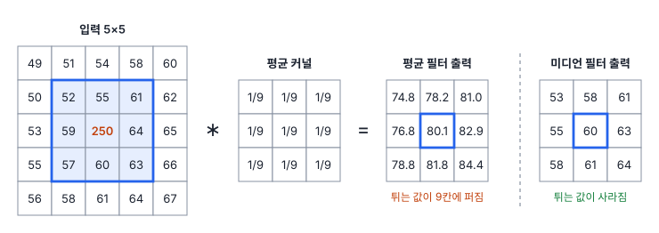
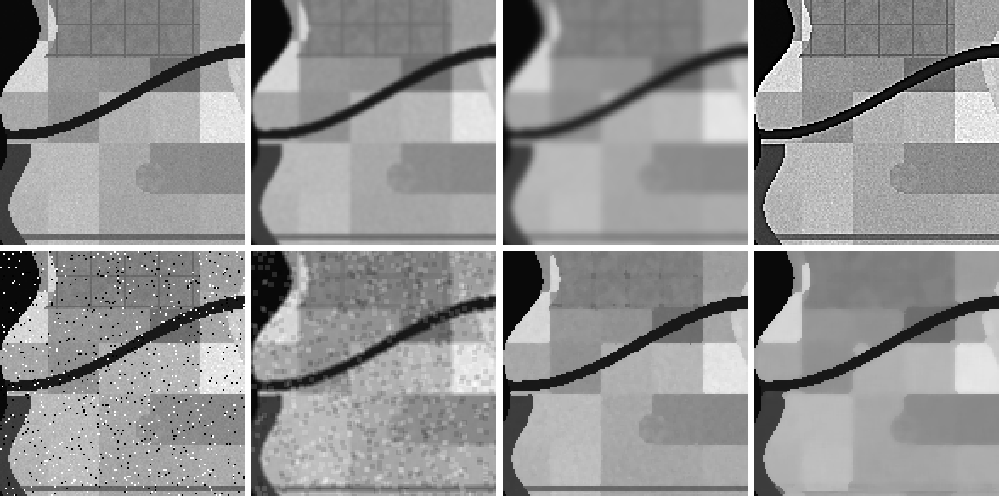
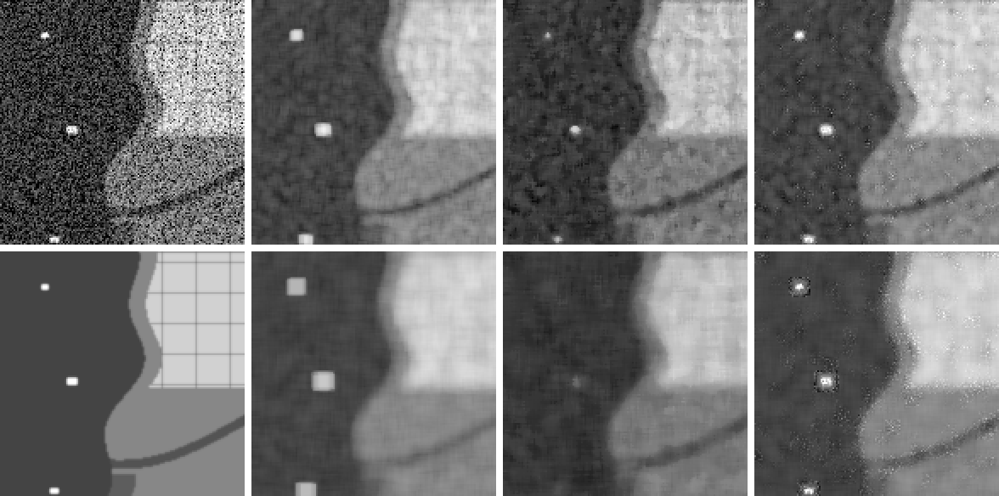

# 22강 필터

## 이 강에서 얻는 것

- 합성곱이 창을 밀며 가중합을 구하는 계산임을 알고, 커널 합·경계 처리·출력 크기를 따질 수 있음
- 평균·가우시안·미디언 필터와 샤프닝이 영상의 무엇을 지우고 무엇을 키우는지 공간 주파수로 설명할 수 있음
- SAR 스페클이 곱셈성 잡음이라서 리(Lee) 필터가 필요한 이유를 알고, 등가 관측 수(ENL)로 필터를 비교할 수 있음

## 1. 합성곱: 창을 밀며 가중합 구하기

밴드 하나는 행·열로 된 2차원 배열임(20강). **필터(filter)**는 각 화소의 새 값을 그 화소 주변 값으로 계산하는 연산임. 흔히 주변 화소에 가중치를 곱해 더하며, 이 가중치 배열을 **커널(kernel)**이라 부름. 커널을 영상 위에서 한 칸씩 밀며 가중합을 구하는 계산이 **합성곱(컨볼루션, convolution)**임. 입력 $f$에 3×3 커널 $K$를 걸면 $(r, c)$ 위치의 출력 $g$는 다음과 같음.

$$g(r, c) = \sum_{i=-1}^{1}\sum_{j=-1}^{1} K(i, j)\, f(r - i,\ c - j)$$

말로 하면 "커널을 상하좌우로 뒤집어 창의 9개 값과 칸끼리 곱해 더함"임. 뒤집지 않고 그대로 곱해 더하면 **상관(correlation)**이 됨. 평균 커널처럼 대칭인 커널은 둘의 결과가 같음. 비대칭 커널 $[-1, 0, 1]$을 한 줄 값 10, 20, 40에 걸면 상관은 $40 - 10 = 30$, 합성곱은 $10 - 40 = -30$으로 부호가 반대임. 딥러닝의 "합성곱 층"은 실제로는 상관을 계산함. 가중치를 학습으로 정하므로 뒤집지 않아도 학습된 커널이 뒤집힌 모양이 될 뿐이라 그렇게 부르는 것임(30강).

**커널 합이 1이어야 하는 이유**: 값이 고른 영역에서 출력이 입력과 같아야 반사율·온도 같은 물리량의 수준이 유지됨. 합이 2면 모든 값이 두 배가 됨. 반대로 합이 0인 커널은 고른 영역에서 0을 내고 변화가 있는 곳만 남기는데, 이것이 엣지 검출 커널임(24강).

**경계 처리와 출력 크기**: 영상 가장자리에서는 창의 일부가 영상 밖으로 나감. 창이 영상 안에 다 들어가는 곳만 계산하면 출력이 줄어듦. 300×300 밴드에 3×3 커널이면 $300 - 3 + 1 = 298$임. 크기를 유지하려면 둘레에 $(k-1)/2$칸($k$는 커널 크기)을 덧대는 **패딩(padding)**을 함. 0으로 채우면 가장자리가 어두워짐. 근적외 밴드에 5×5 평균을 0 채움으로 걸면 맨 윗줄은 원래의 약 60%, 모서리는 약 36%가 됨. 가장자리 값을 거울처럼 되비추는 **반사**나 가장자리 값을 늘여 쓰는 **복제**를 쓰면 이런 왜곡이 거의 없음. 기본값과 이름은 도구마다 다름(scipy.ndimage는 반사가 기본). 타일로 잘라 거를 때는 커널 반경만큼 겹쳐 잘라야 타일 경계에 이 왜곡이 생기지 않음.

## 2. 흐리게 하기: 평균 필터와 가우시안 필터

**평균 필터(mean filter)**는 창 안 값의 산술평균으로, 모든 칸이 $1/k^2$인 커널임. **가우시안 필터(Gaussian filter)**는 가운데일수록 큰 가중치를 종 모양으로 줌.

$$G(i, j) \propto \exp\!\left(-\frac{i^2 + j^2}{2\sigma^2}\right)$$

$\sigma$(화소 단위)가 흐림 정도를 정하고, 커널 크기는 보통 반경 $3\sigma$~$4\sigma$에서 자름(scipy는 $4\sigma$가 기본, 도구마다 다름). 흐림은 잡음과 함께 가늘거나 작은 대상도 지움. 4부 공통 자료의 근적외(B8) 밴드로 재어 봄.

| 처리 | 농경지 잡음 표준편차 | 1화소 도로 대비 | 3화소 간선도로 대비 |
|---|---|---|---|
| 원본 | 0.0092 | 0.040 | 0.106 |
| 가우시안 $\sigma = 1$ | 0.0021 | 0.016 | 0.093 |
| 가우시안 $\sigma = 2$ | 0.0011 | 0.006 | 0.052 |

잡음 표준편차(1강)는 고른 농경지 필지 한 곳(20×20화소)에서 잰 값이고, 대비는 도로 양옆과 도로의 반사율 차이임. $\sigma = 1$이면 잡음은 4분의 1로 줄지만 폭 1화소(10 m) 시가지 도로는 대비가 60% 줄고, $\sigma = 2$면 폭 3화소 간선도로도 절반이 됨. 대략 $\sigma$가 대상 폭과 비슷해지면 대비가 절반 아래로 떨어진다고 봄.

## 3. 미디언 필터: 가중합이 아닌 필터

**미디언 필터(중앙값 필터, median filter)**는 창 안 값의 중앙값을 출력함. 1강의 중앙값처럼 튀는 값에 끌려가지 않음. 앞 그림의 창에서 평균은 80.1로 튀는 값 쪽으로 끌려갔지만 중앙값은 60으로, 튀는 값을 뺀 8개의 평균 58.9와 가까움.

미디언 필터는 **선형 필터가 아님**. 두 영상을 더한 뒤 거른 결과가 각각 거른 결과의 합과 다르고, 어떤 커널로도 나타낼 수 없음. 그래서 합성곱의 성질(커널 합, 주파수 해석)이 적용되지 않음.

전송 오류나 불량 검출기로 생기는 **소금·후추 잡음**(일부 화소가 최솟값이나 최댓값으로 튀는 잡음)에 특히 강함. 근적외 밴드 화소의 5%를 반사율 0 또는 0.5로 바꾸면 원본과의 RMSE(오차 제곱 평균의 제곱근)는 0.063임. 3×3 평균 뒤 0.027, 가우시안 $\sigma = 1$ 뒤 0.024인데 3×3 미디언 뒤에는 0.011임. 평균 계열은 튀는 값을 주변에 나눠 퍼뜨리고, 미디언은 버림.

대가로 창 넓이의 절반보다 작은 대상도 튀는 값처럼 지워짐. 3×3 미디언은 폭 1화소 도로의 대비를 0.040에서 0.009로 지움. 폭 3화소 간선도로는 5×5까지는 남지만(0.101) 7×7에서는 0.003으로 사라짐. 반면 넓은 영역 사이의 곧은 경계는 흐리지 않음(모서리는 둥글게 깎임).

## 4. 공간 주파수와 샤프닝

**공간 주파수(spatial frequency)**는 값이 공간에서 얼마나 빨리 오르내리는지를 뜻함. 지형 기복이나 넓은 필지처럼 천천히 변하는 성분이 저주파, 도로·경계·잡음처럼 한두 화소 만에 바뀌는 성분이 고주파임. 가장 짧은 무늬는 밝고 어두움이 한 화소씩 번갈아 나오는 주기 2화소(10 m 영상이면 20 m)임. 푸리에 변환으로 영상을 여러 주기의 물결 무늬로 나눠 보면, 합성곱은 주파수마다 정해진 배율을 곱하는 것과 같음. 흐림 필터는 저주파만 통과시키므로 **저역 통과 필터**라고 부름.

배율을 보면 가우시안이 평균보다 나은 이유가 보임. 3×3 평균은 주기 6화소 무늬를 2/3로 줄이고, 주기 3화소 무늬는 완전히 지우며, 주기 2화소 무늬는 1/3로 줄이되 명암을 뒤집음. 배율이 들쭉날쭉해 인공 무늬가 남기 쉬움. 가우시안 $\sigma = 1$은 주기 4화소를 0.29, 주기 2화소를 0.01로 주기가 짧을수록 매끈하게 줄임.

**샤프닝(선명화, image sharpening)**은 거꾸로 고주파를 키움. 원본에서 흐린 영상을 빼면 고주파만 남으므로, 이를 원본에 더함.

$$\text{샤프닝} = \text{원본} + k\,(\text{원본} - \text{흐린 영상})$$

이 방식을 **언샤프 마스킹(unsharp masking)**이라 부름. 3×3 커널 $\begin{bmatrix}0&-1&0\\-1&5&-1\\0&-1&0\end{bmatrix}$도 같은 원리로, "원본 + 4 × (원본 − 상하좌우 평균)"이고 합이 1임. 가운데 62, 상하좌우 55·59·64·60이면 $5 \times 62 - 238 = 72$가 되어 주변(평균 59.5)과의 차이가 커짐.

근적외 밴드에 $\sigma = 1$, $k = 1$로 걸면 1화소 도로 대비는 0.040에서 0.064로 커지지만, 농경지 잡음 표준편차도 0.0092에서 0.0173으로 두 배 가까이 됨. 하천 경계에서는 육지 쪽이 0.266에서 0.357로 올라가고 물 쪽은 0.041에서 −0.011로 내려감. 경계 양쪽이 과장되는 이 현상을 **헤일로(halo)**라고 부르며, 이 장면에서만 물가 화소 942개가 음의 반사율이 됨. 샤프닝은 새 정보를 만들지 않고 이미 있는 고주파를 부풀림. 눈으로 보기 위한 표출용 처리이고, 분석용 값에는 걸지 않음(21강).

## 5. SAR 스페클과 리 필터

SAR 화소 안의 수많은 산란체에서 돌아온 전파가 서로 간섭해 밝기가 무작위로 흔들리는 것을 **스페클(speckle)**이라고 부름. 스페클은 **곱셈성 잡음**임. 참값 $x$에 평균 1인 잡음 $v$가 곱해져 $z = x \cdot v$로 관측됨. 여러 번 관측해 평균하지 않은 1룩(1-look) 강도에서 $v$는 지수분포를 따르며 표준편차가 평균과 같음. 곧 밝은 곳일수록 흔들림도 큼.

고른 영역에서 표준편차 ÷ 평균을 **스페클 지수**, (평균)² ÷ 분산을 **등가 관측 수(ENL, equivalent number of looks)**라고 함. ENL은 "독립 관측 몇 개를 평균한 만큼 매끈한가"로 읽고, 강도 기준으로 1룩 영상은 1임. 둘은 스페클 지수 $= 1/\sqrt{\mathrm{ENL}}$ 관계임.

**리(Lee) 필터**는 창의 국소 통계로 거르는 정도를 화소마다 바꿈. 창의 평균 $m$과 변동계수 $C_i$(창의 표준편차 ÷ 평균), 스페클만 있을 때의 변동계수 $C_u$(1룩 강도면 1)를 구해 다음처럼 섞음.

$$\hat{x} = m + W\,(z - m), \qquad W = 1 - \frac{C_u^2}{C_i^2}\ (\text{0 아래는 0})$$

고른 영역은 $C_i \approx C_u$라서 $W \approx 0$, 곧 국소 평균을 씀. 선박이나 경계처럼 스페클로 설명되지 않는 변화가 있으면 $C_i$가 커져 $W$가 1에 가까워지고 원래 값을 거의 그대로 둠. 이 식은 널리 쓰는 단순형이고, 리가 처음 유도한 식(최소 평균 제곱 오차 기준)은 분모에 항이 더 있어 1룩에서 $W$가 이보다 작게 나옴(더 세게 거름). 식의 세부와 개량형(강화 리 등), 비슷한 적응 필터(프로스트 등)는 도구마다 다름. 공통 자료의 SAR 강도에 5×5 창으로 걸고 스페클 없는 영상(sar_clean)과 비교한 결과임.

| 필터 | ENL | 스페클 지수 | 평균 수준 | 오차(dB) 전체 | 오차(dB) 경계 | 선박 최댓값 |
|---|---|---|---|---|---|---|
| 없음 | 1.0 | 1.00 | 0.99 | 6.1 | 6.0 | 2.7~6.9 |
| 평균 | 24.1 | 0.20 | 0.99 | 1.2 | 2.0 | 0.41~1.07 |
| 미디언 | 12.0 | 0.29 | 0.71 | 2.2 | 2.6 | 0.15~0.46 |
| 리 | 13.0 | 0.28 | 0.99 | 1.2 | 1.9 | 1.3~5.8 |

ENL·스페클 지수·평균 수준(참값 대비 비)은 안쪽 농경지 약 2만 화소에서 잼. 오차는 dB(10 × log10 강도)로 바꾼 RMSE이고, 경계는 5×5 안에서 참 밝기가 3배 이상 바뀌는 화소(선박 둘레 제외)임. 참값의 선박 최댓값은 1.7~2.0임.

- **평균**: 고른 곳을 가장 매끈하게 만듦(ENL 이론값은 창 화소 수 25). 대신 선박을 바다와 섞어 최댓값을 참값의 4분의 1~절반으로 낮춤. 해안에서 1~2화소 안쪽 바다는 육지 값이 섞여 참값의 약 1.6배로 밝아짐(리는 약 1.4배)
- **미디언**: 평균 수준이 0.71배로 낮아짐. 지수분포는 오른쪽 꼬리가 길어 중앙값이 평균의 $\ln 2 \approx 0.69$배이기 때문임(1강의 치우친 분포, 표본 25개의 중앙값이라 조금 높게 나옴). 선박도 대부분 지움
- **리**: 수준을 지키고 선박을 밝게 남김. 다만 스페클이 섞인 원래 값을 거의 그대로 두는 것이라 선박 최댓값이 참값보다 크게 흔들림(1.3~5.8). 고른 곳의 ENL은 평균의 절반 수준이고, 선박·경계 둘레에는 스페클이 상당 부분 남음

창을 키우면 차이가 커짐. 선박(2×3~3×5화소) 최댓값은 평균 필터에서 7×7이면 0.22~0.59, 9×9면 0.14~0.36으로 퍼짐. 미디언은 7×7에서 0.02~0.12로 떨어지고, 9×9에서는 0.011~0.028로 같은 필터를 건 바다 배경의 밝은 쪽(상위 0.1%, 0.011)의 1~3배에 그침. 창 넓이의 절반보다 작은 표적을 지우는 3절의 성질 그대로임.

## 현장에서는

같은 SAR 영상에서 수계 지도와 선박 탐지 결과를 함께 만드는 상황임. 수계 추출은 넓은 물과 뭍을 가르는 일이라 스페클을 충분히 줄여야 이진화(23강)가 깨끗함. 7×7 이상의 리 필터나 평균 필터를 걸고, 남은 작은 점은 형태학 후처리로 정리함.

선박 탐지는 반대임. 작은 밝은 표적이 핵심 신호이므로 미디언이나 큰 평균 필터를 걸면 탐지할 대상을 입력 단계에서 지우게 됨. 원본 강도나 작은 창의 리 필터를 쓰고, 오탐은 탐지 단계에서 배경 통계와 비교해 거름. 같은 영상이라도 산출물마다 필터가 다르므로 필터 종류·창 크기·룩 수를 메타데이터에 적어 둠.

## 헷갈리는 쌍

- **합성곱 vs 상관**: 합성곱은 커널을 뒤집어 곱해 더하고, 상관은 그대로 곱해 더함. 대칭 커널이면 같음. 딥러닝의 합성곱 층은 상관임(30강).
- **평균 필터 vs 미디언 필터**: 평균은 선형 필터라 튀는 값을 주변에 퍼뜨림. 미디언은 비선형이라 튀는 값을 버리지만, 창 절반보다 작은 대상과 얇은 선도 함께 지움.
- **가산 잡음 vs 곱셈성 잡음**: 가산 잡음은 밝기와 무관한 크기로 더해지고, 스페클 같은 곱셈성 잡음은 밝을수록 커짐. 곱셈성이면 국소 평균에 맞춰 거르는 리 필터 같은 방법이 필요함.
- **샤프닝 vs 해상도 향상**: 샤프닝은 있던 고주파를 키울 뿐이고 공간해상도(20강)를 높이지 않음. 잡음도 같이 커짐.

## 이렇게 지시받음

> 지시: "수계 추출 전에 스페클 좀 죽여. 리 필터 7×7로 걸고 ENL 얼마 나오는지 같이 적어."

곱셈성 잡음을 수준 치우침 없이 줄이라는 뜻임. 바다나 넓은 농경지처럼 고른 영역을 골라 거르기 전후의 ENL과 스페클 지수를 계산해 보고함. 입력이 여러 룩을 평균한 강도 영상이면 $C_u = 1/\sqrt{\text{룩 수}}$로 바꿔야 과하게 거르지 않음.

> 지시: "선박 탐지 입력에는 미디언 걸지 마. 배가 다 날아가."

작은 밝은 표적이 창 넓이의 절반보다 작으면 미디언이 튀는 값으로 보고 지운다는 경고임. 필터가 필요하면 선박보다 충분히 작은 창을 쓰거나 리 필터를 쓰고, 필터 전후 선박 최댓값을 비교해 확인함.

> 지시: "보고서 그림만 샤프닝하고, NDVI 계산하는 밴드에는 하지 마."

샤프닝은 헤일로와 음수 반사율을 만들고 잡음을 키우므로 분석용 값을 오염시킨다는 뜻임. 표시용 사본에만 적용하고 원본 밴드로 지수를 계산함.

## 요약

- 합성곱은 커널을 밀며 가중합을 구하는 계산이고, 뒤집지 않으면 상관임. 커널 합이 1이어야 수준이 유지되고, 패딩 방식(0 채움·반사·복제)이 가장자리 값과 출력 크기를 정함
- 평균·가우시안은 저역 통과 필터라서 잡음과 함께 가는 대상도 지움. 가우시안은 주파수를 매끈하게 줄여 평균보다 인공 무늬가 적음
- 미디언은 비선형 필터로 튀는 값에 강하지만 창 넓이의 절반보다 작은 대상과 얇은 선을 지움
- 샤프닝은 원본 + k·(원본 − 흐린 영상)으로 고주파를 키우며, 헤일로와 잡음 증폭 때문에 표시용으로만 씀
- 스페클은 곱셈성 잡음임. 리 필터는 국소 변동계수로 고른 곳만 세게 거르며, ENL·스페클 지수와 참값과의 오차로 필터를 비교함

## 핵심 용어

| 한글 | 영문 |
|---|---|
| 합성곱(컨볼루션) / 상관 | Convolution / Correlation |
| 커널 | Kernel |
| 패딩 | Padding |
| 평균 필터 | Mean Filter |
| 가우시안 필터 | Gaussian Filter |
| 미디언 필터(중앙값 필터) | Median Filter |
| 공간 주파수 / 저역 통과 필터 | Spatial Frequency / Low-pass Filter |
| 샤프닝(선명화) / 언샤프 마스킹 | Image Sharpening / Unsharp Masking |
| 스페클 / 스페클 지수 | Speckle / Speckle Index |
| 등가 관측 수 | Equivalent Number of Looks (ENL) |
| 리(Lee) 필터 | Lee Filter |
