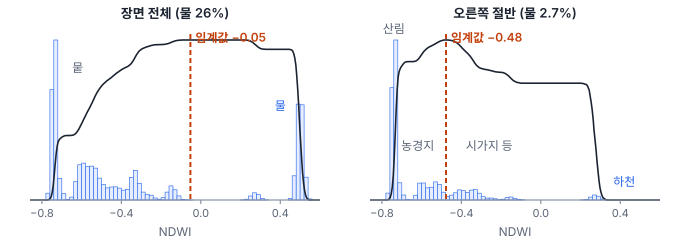
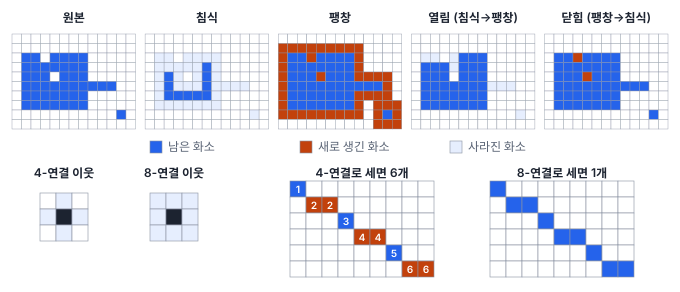
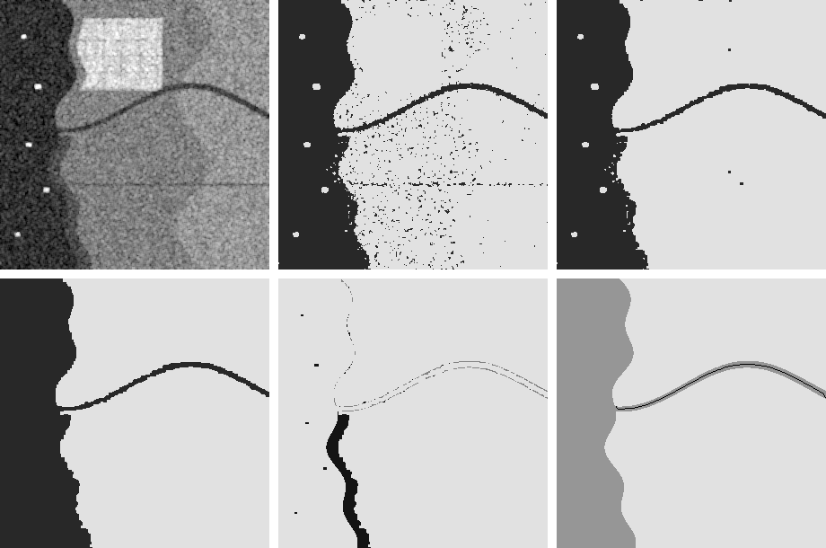

# 23강 이진화와 형태학 후처리

## 이 강에서 얻는 것

- 오츠 이진화가 임계값을 고르는 원리를 알고, 히스토그램 모양을 보고 결과를 믿어도 되는지 판단할 수 있음
- 침식·팽창·열림·닫힘의 차이를 알고, 구조요소의 모양과 크기를 목적에 맞게 고를 수 있음
- 연결요소·최소 면적·구멍 메우기·골격화로 마스크를 정리해 개수·면적·길이를 잴 수 있음

## 1. 이진화와 오츠 방법

**이진화(binarization)**는 영상의 각 화소를 기준값(임계값)과 비교해 0과 1 두 값만 남기는 일임. 결과를 **이진 마스크(binary mask)**라 부르고, 1인 화소를 전경, 0인 화소를 배경이라 함. 수계 마스크, 구름 마스크, 분할 모델 출력이 모두 이진 마스크임.

4부 공통 자료(가상 연안 장면 300×300 화소, 10 m)로 수계 마스크를 만듦. 물을 밝게 드러내는 **NDWI**(정규수분지수, 녹색과 근적외의 차를 합으로 나눈 값)의 클래스별 평균은 바다 0.50, 하천 0.27, 선박 −0.08, 갯벌 −0.14, 산림 −0.74임. 21강의 히스토그램으로 보면 물과 뭍이 두 봉우리를 이룸.

**오츠 이진화(Otsu's method)**는 두 봉우리 사이 임계값을 자동으로 고름. 임계값 $t$로 화소를 두 무리로 나눴을 때 무리 사이가 가장 멀리 벌어지는 $t$, 즉 **클래스 간 분산**이 가장 큰 $t$를 찾음.

$$\sigma_B^2(t) = w_0\,w_1\,(\mu_0 - \mu_1)^2$$

$w_0, w_1$은 두 무리의 화소 비율, $\mu_0, \mu_1$은 무리별 평균임. 두 무리가 고르게 크고(앞의 곱) 평균이 멀수록(뒤의 제곱) 커짐. 전체 분산은 클래스 간 분산과 무리 안 분산의 합이므로, 이는 무리 안 분산을 가장 작게 하는 것과 같음.

장면 전체에서 오츠 임계값은 −0.052임. 뭍 73.9%(평균 −0.569)와 물 26.1%(평균 0.483)로 나뉘고 클래스 간 분산은 $0.739 \times 0.261 \times 1.052^2 \approx 0.214$로 전체 분산 0.238의 90%임. 참 토지피복과 비교하면 틀린 화소는 선박 화소 1개뿐임. 바다와 하천은 하구에서 이어져 한 덩어리가 되고, 갯벌은 뭍 쪽으로, 선박은 물 속 구멍 5개로 나옴. 즉 해안선은 촬영 순간의 물가(조석에 따라 달라짐)에 그어짐. 실제 영상은 해안의 혼합 화소와 탁한 물 때문에 이만큼 깨끗하지 않음.

한계는 히스토그램이 **쌍봉**(봉우리 두 개)이 아닐 때 드러남. 물이 2.7%뿐인 오른쪽 절반(열 150~299)만 잘라 오츠를 돌리면 임계값이 −0.48로 떨어져 뭍 안을 가름. 산림과 농경지 대부분은 뭍 쪽에, 시가지·도로·나지와 생육이 나쁜 농경지(농경지의 27%)는 물 쪽에 떨어져 물로 찍힌 화소가 19.7%, 정확도 82.9%임. 오츠는 "두 무리가 있다"고 가정하고 무조건 둘로 나누므로, 물이 적은 영상에서는 물과 뭍이 고루 섞인 구간에서 구한 임계값을 쓰거나 지역마다 임계값을 따로 구함. 히스토그램 구간 수도 도구마다 달라 임계값이 조금씩 다름.

## 2. 구조요소로 훑기: 침식과 팽창

**형태학 연산(morphological operation)**은 이진 마스크를 작은 모양으로 훑으며 모양을 다듬음. 이 작은 모양이 **구조요소(structuring element)**이고, 3×3 정사각형, 십자, 원판을 흔히 씀. 크기는 한 번에 깎거나 붙이는 두께(3×3이면 한 화소, 10 m)를, 모양은 결과의 모서리(정사각형은 각지게, 원판은 둥글게)를 정함.

- **침식(erosion)**: 구조요소의 가운데를 화소마다 대 보고, 구조요소가 **전부** 전경 안에 들어갈 때만 1로 남김. 경계가 한 겹 벗겨지고 가는 돌기와 작은 조각이 사라짐
- **팽창(dilation)**: 구조요소가 전경과 **하나라도** 겹치면 1로 만듦. 한 겹 두꺼워지고 좁은 틈과 작은 구멍이 메워짐

회색조 영상에서는 침식이 창 안 최솟값, 팽창이 최댓값을 고르는 필터가 됨. 22강의 미디언 필터처럼 가중합이 아닌 비선형 필터임.

## 3. 열림과 닫힘

둘을 이어 붙이면 크기를 거의 유지한 채 잡음만 고를 수 있음.

$$A \circ B = (A \ominus B) \oplus B, \qquad A \bullet B = (A \oplus B) \ominus B$$

$A$는 마스크, $B$는 구조요소, $\ominus$는 침식, $\oplus$는 팽창임. **열림 연산(opening)**은 침식 후 팽창임. 침식에서 사라진 작은 조각은 되살릴 씨앗이 없어 그대로 없어지고, 살아남은 덩어리는 팽창으로 원래 크기에 가깝게 돌아옴. 그래서 구조요소가 들어가지 못하는 작은 잡음·가는 돌기가 지워짐. **닫힘 연산(closing)**은 팽창 후 침식으로, 구조요소보다 작은 구멍과 틈을 메우고 크기는 되돌림.

앞의 NDWI 마스크는 틀린 화소가 1개뿐이라 정리할 것이 없으므로, 잡음이 많은 예로 구름 때문에 SAR 영상으로 수계를 뽑는 상황을 봄. 스페클(22강) 그대로 dB로 바꿔 오츠를 하면 정확도가 77.9%임. 3×3 평균 필터를 먼저 쓰면(22강에서 권한 7×7보다 약해 잡음이 남음) 임계값 −15.1 dB(바다 −20.1, 농경지 −12.4)에서 95.3%로 오르지만, 물 조각이 582개(8-연결 기준, 4절)로 흩어짐. 여기에 3×3 열림을 하면 물 조각이 7개로 줄고 농경지 오탐이 1,452화소에서 99화소로 줄어 정확도가 97.2%가 됨. 이어서 3×3 닫힘을 하면 뭍 조각이 24개에서 7개(큰 뭍 2개와 물 속 구멍 5개)로 줄고 정확도는 97.1%로 거의 그대로임.

구조요소가 너무 크면 지켜야 할 것도 지움. 이 장면의 하천은 폭 6~9화소(60~90 m)라, NDWI 마스크에 11×11 열림을 하면 하천이 통째로 사라지고 바다만 남음. 이를 거꾸로 써서 원래 마스크에서 빼고 가장 큰 조각을 고르면 하천만 떼어 낼 수 있음(1,730화소, 참 하천 1,733화소).

영상 가장자리 밖을 어떻게 보는지도 도구마다 다름. scipy 이진 형태학 함수의 기본값처럼(22강 필터의 기본값인 반사와 다름) 바깥을 0으로 보면 닫힘의 침식 단계에서 가장자리에 닿은 바다가 한 줄 깎여, 앞의 SAR 마스크에서는 488화소가 뭍으로 바뀜. 가장자리를 복제로 덧댄(패딩, 22강) 뒤 연산하고 잘라 냄.

## 4. 연결요소, 최소 면적, 구멍 메우기

**연결요소 레이블링(connected component labeling, CCL)**은 서로 이어진 전경 화소 묶음마다 번호를 붙이는 일임. 개수를 세고 조각별 면적·위치를 재는 출발점임. "이어짐"의 기준이 둘임.

- **4-연결**: 위·아래·왼쪽·오른쪽 이웃만 이어진 것으로 봄
- **8-연결**: 대각선 이웃까지 이어진 것으로 봄

바다 안에서 필터를 걸지 않은 SAR 강도가 0.3 이상인 밝은 화소를 묶어 선박을 세면, 8-연결은 5척(참과 같음), 4-연결은 7척임. 스페클로 선박 화소 일부가 어두워져 대각선으로만 닿은 조각을 따로 셌기 때문임. 반대로 8-연결은 대각선으로 붙어 정박한 두 척을 한 척으로 셀 수 있음. 전경을 8-연결로 보면 배경은 4-연결로 봐야 구멍 판단에 모순이 없음. 대각선으로만 이어진 고리도 8-연결에서는 닫힌 테두리인데, 배경까지 8-연결로 보면 안쪽 배경이 대각선 틈으로 바깥과 이어져 구멍이 아니게 되기 때문임.

조각별 면적을 알면 **최소 지도화 단위(MMU)**를 적용함. 산출물에 담을 가장 작은 면적으로, 그보다 작은 조각은 지우거나 이웃에 합침. 닫힘 뒤 남은 물 조각 7개 중 6개가 3~12화소라, 0.5 ha(10 m 화소 50개)를 기준으로 지우면 물은 한 덩어리가 됨.

**구멍 메우기(hole filling)**는 영상 가장자리에서 배경을 채워 나가 닿지 않은 배경, 즉 전경에 완전히 둘러싸인 부분을 전경으로 바꿈. 앞의 SAR 마스크에 남은 구멍 5개(35~57화소)는 모두 선박 자리이고, 메우면 정확도 97.3%, IoU(교집합/합집합, 35강) 0.905가 됨. 수면 면적을 잴 때는 메우고, 선박을 셀 때는 메우기 전 구멍이 곧 후보임. 호수 속 섬도 구멍이므로 면적 상한을 두고 메움.

남은 오탐 2,016화소 중 1,902화소는 갯벌임. 젖은 갯벌(−17.2 dB)은 SAR에서 하천(−17.0 dB)만큼 어두워, 크고 이어진 덩어리라 형태학으로는 못 지움. 광학 NDWI나 조위 정보 같은 다른 자료가 있어야 함.

## 5. 골격화: 하천 중심선

**스켈레톤화(골격화, skeletonization)**는 모양의 연결 관계를 유지한 채 폭 1화소의 중심선만 남기는 일임. 흔히 쓰는 세선화(thinning) 방식은 경계를 한 겹씩 벗기되 벗기면 끊기거나 끝이 짧아지는 화소는 남김. 하천·도로 중심선, 하천망 분석, 균열 길이 측정에 씀.

앞에서 떼어 낸 하천을 골격화하면 237화소의 선 하나가 나옴. 8-연결로는 1개인데 4-연결로 세면 88조각으로 끊기므로, 골격선은 8-연결로 다룸. 가로·세로 걸음 149개는 1, 대각선 걸음 87개는 $\sqrt{2}$로 쳐서 길이를 재면 $149 + 87\sqrt{2} \approx 272$화소(2.72 km)로, 참 중심선 2.52 km보다 8% 긺. 비스듬한 선이 계단으로 그려진 탓이며, 선으로 바꿔 더글러스-포이커(Douglas-Peucker) 방법으로 1화소 허용 오차 안에서 단순화하면 2.55 km가 됨. 거리 변환(각 화소에서 가장 가까운 배경까지 거리) 값을 골격 위에서 두 배 하면 대략의 폭이 나옴(평균 6.9화소, 약 69 m). 경계가 울퉁불퉁하면 골격에 잔가지가 생기므로, 먼저 열림·닫힘으로 다듬고 짧은 가지를 잘라 냄.

## 현장에서는

양식장 분할 모델(33강)의 출력으로 시설 폴리곤을 납품하는 상황임. 모델은 화소마다 확률을 내므로 오츠 대신 검증 자료에서 고른 임계값으로 이진화하고, 열림(물결 반사로 생긴 점 오탐 제거) → 닫힘(시설 안 틈 메움) → 연결요소 → MMU → 구멍 메우기 순으로 정리한 뒤 폴리곤으로 바꿈(50강).

후처리도 모델의 일부라 결과 지표를 바꿈. 매개변수는 화소가 아니라 m·ha로 기록하고(해상도가 바뀌어도 뜻이 같게), 후처리 전후의 mIoU·경계 F1(40강)을 검증 세트에서 비교해 고름. 시험 세트로 고르면 점수가 부풀려짐(15강).

## 헷갈리는 쌍

- **열림 vs 닫힘**: 열림은 작은 전경(잡음 조각·돌기)을 지우고, 닫힘은 작은 배경(구멍·틈)을 메움. 물 마스크를 열림하는 것은 뭍 마스크를 닫힘하는 것과 같음(구조요소가 대칭이고 가장자리를 같은 방식으로 채울 때).
- **닫힘 vs 구멍 메우기**: 닫힘은 구조요소보다 작은 구멍·홈만 메우지만 가장자리 홈도 메움. 구멍 메우기는 크기와 상관없이 완전히 둘러싸인 구멍을 모두 메우고, 바깥으로 열린 홈은 못 메움.
- **4-연결 vs 8-연결**: 4-연결은 조각을 잘게 나누고(과다 계수), 8-연결은 대각선으로 붙은 것을 합침(과소 계수). 어느 쪽을 썼는지 보고서에 적음.

## 이렇게 지시받음

> 지시: "SAR 수계 마스크 소금후추가 너무 많아. 3×3으로 열고 닫고, 0.5 ha 미만은 날려."

오츠 결과에 흩어진 물 점(열림)과 물 속 뭍 점(닫힘)을 지우고, 10 m 화소면 50화소 미만 조각을 지우라는 뜻임. 구조요소가 가장 좁은 하천 폭보다 작은지, 가장자리 패딩을 했는지 확인하고, 단계별 정확도와 조각 수를 같이 보고함. 갯벌처럼 큰 덩어리 오탐은 남는다고 미리 알림.

> 지시: "선박 개수는 8-연결로 세."

스페클로 한 척이 대각선 조각 여럿으로 쪼개져 4-연결에서 과다 계수된 경우임. 붙어 정박한 선박이 한 척으로 합쳐지지 않았는지 면적이 유난히 큰 조각을 영상에서 확인함.

> 지시: "하천 중심선 뽑아서 연장 km로 줘."

골격화 후 잔가지를 자르고 8-연결로 이어진 선을 따라감. 화소 걸음으로 잰 길이는 계단 때문에 길게 나오므로 선으로 바꿔 단순화한 뒤 잼. 행·열 좌표(원점 왼쪽 위, 행은 아래로 증가)를 지도 좌표(동·북)로 바꾸는 것은 지오트랜스폼으로 함(25강).

## 요약

- 오츠 이진화는 클래스 간 분산이 가장 큰 임계값을 고르며, 히스토그램이 쌍봉이 아니면 엉뚱한 곳을 가름
- 침식은 구조요소가 전부 들어가야 남기고, 팽창은 하나라도 겹치면 붙임. 크기는 깎는 두께, 모양은 모서리를 정함
- 열림(침식→팽창)은 작은 잡음을 지우고 닫힘(팽창→침식)은 작은 구멍·틈을 메움. 너무 큰 구조요소는 가는 하천까지 지움
- 연결요소는 4-연결이면 잘게, 8-연결이면 크게 묶임. MMU로 작은 조각을 지우고, 구멍 메우기는 섬까지 메우지 않게 상한을 둠
- 골격화로 중심선을 뽑아 길이·폭을 재며, 후처리 매개변수도 검증 세트에서 고르고 기록함

## 핵심 용어

| 한글 | 영문 |
|---|---|
| 이진화 / 이진 마스크 | Binarization / Binary Mask |
| 오츠 이진화 / 클래스 간 분산 | Otsu's Method / Between-Class Variance |
| 정규수분지수 | Normalized Difference Water Index (NDWI) |
| 형태학 연산 / 구조요소 | Morphological Operation / Structuring Element |
| 침식 / 팽창 | Erosion / Dilation |
| 열림 연산 / 닫힘 연산 | Morphological Opening / Morphological Closing |
| 연결요소 레이블링 | Connected Component Labeling (CCL) |
| 4-연결 / 8-연결 | 4-Connectivity / 8-Connectivity |
| 최소 지도화 단위 | Minimum Mapping Unit (MMU) |
| 구멍 메우기 | Hole Filling |
| 스켈레톤화(골격화) / 세선화 | Skeletonization / Thinning |
| 거리 변환 | Distance Transform |
