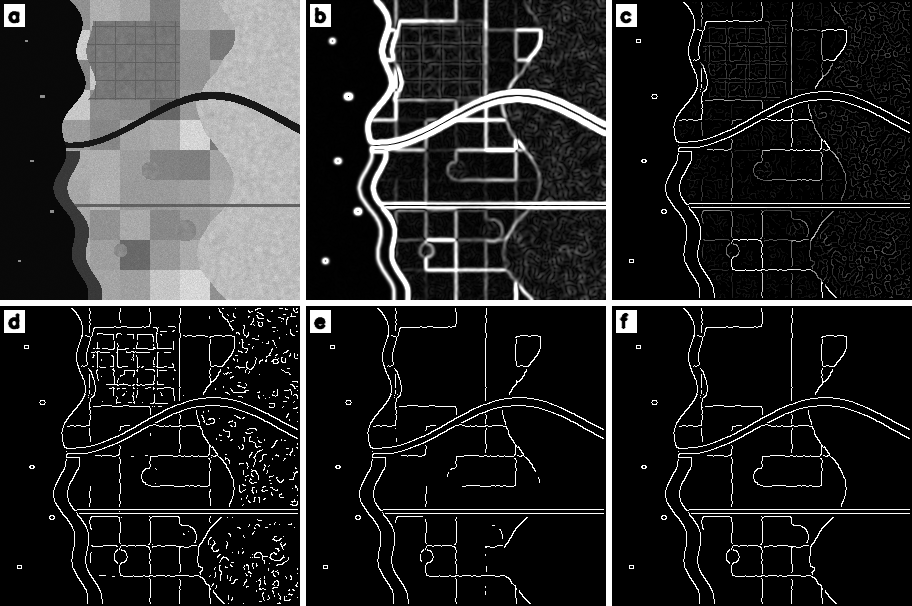
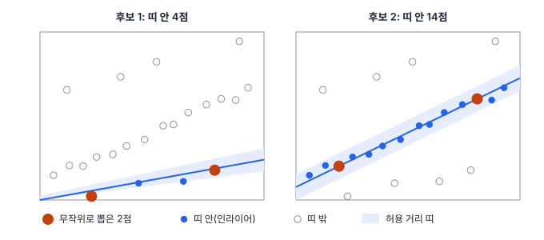
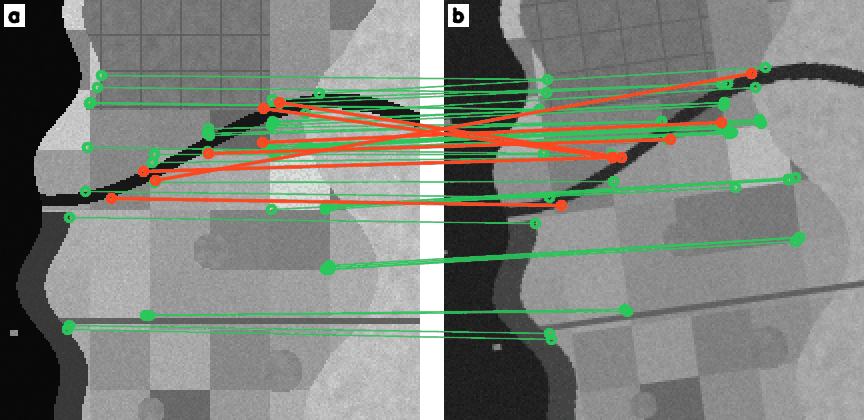

# 24강 특징점과 영상 정합

## 이 강에서 얻는 것

- 소벨 연산자와 캐니 엣지 검출기가 밝기 변화에서 경계를 뽑는 과정을 단계별로 설명할 수 있음
- 해리스 코너, SIFT·ORB의 특징점과 기술자가 무엇을 재는지 알고, 매칭을 비율 검정으로 거를 수 있음
- RANSAC으로 틀린 짝이 섞인 매칭에서 변환을 추정하고, 반복 횟수와 정합 품질(인라이어 비율, 위치 오차)을 계산할 수 있음

## 1. 엣지와 소벨 연산자

**엣지(edge)**는 밝기가 짧은 거리에서 크게 바뀌는 곳임. 해안선, 필지 경계가 엣지로 나타남. 밝기 변화는 옆 화소와의 차이(미분)로 재며, 22강의 합성곱 커널을 차이가 나오게 잡으면 미분 커널이 됨.

**소벨 연산자(Sobel operator)**는 가장 널리 쓰는 3×3 미분 커널임. 가로 변화 $G_x$의 커널은 다음과 같고, 세로 $G_y$ 커널은 이를 전치한 것임.

$$K_x = \begin{bmatrix} -1 & 0 & 1 \\ -2 & 0 & 2 \\ -1 & 0 & 1 \end{bmatrix}$$

세로 [1, 2, 1] 스무딩과 가로 [−1, 0, 1] 차분을 곱해 만든 커널이라(1차원 커널 둘로 나눠 걸 수 있음) 잡음에 덜 흔들림. 세 행이 모두 10, 80, 150인 조각(바다에서 육지로 밝아지는 해안)에 커널을 뒤집지 않고 그대로 곱해 더하면(상관, 22강) $G_x = (150-10)\times 4 = 560$, $G_y = 0$임. 뒤집어 계산하는 합성곱이면 부호만 반대가 되므로, 밝아지는 쪽이 +가 되게 상관으로 계산하는 것이 보통임. 화소당 70씩 밝아지는 경사가 8배로 나온 것이라 8로 나눠 쓰기도 함(이 강의 수치 단위). 두 방향을 합쳐 기울기 크기와 방향을 얻음.

$$\lvert \nabla I \rvert = \sqrt{G_x^2 + G_y^2}, \qquad \theta = \operatorname{atan2}(G_y, G_x)$$

방향은 밝아지는 쪽을 가리키고 엣지와 직각임. 영상 좌표는 행 번호가 아래로 커지므로 $G_y > 0$은 아래쪽(북쪽이 위면 남쪽)이 밝다는 뜻임.

## 2. 캐니 엣지 검출기

소벨 크기에 임계값만 걸면 엣지가 두껍고 잡음이 많음. **캐니 엣지 검출기(Canny edge detector)**는 네 단계로 이를 정리함(캐니, 1986).

1. **스무딩**: 가우시안 필터(22강)로 잡음을 줄임. σ가 크면 잔 엣지가 사라짐
2. **기울기**: 소벨로 크기와 방향을 구함
3. **비최대 억제(non-maximum suppression)**: 기울기 방향의 앞뒤 이웃보다 작은 화소를 지워 엣지 폭을 1화소로 만듦. 37강 탐지의 NMS(겹친 박스 중 점수가 가장 높은 것만 남김)와 이름도 발상도 같음
4. **이중 임계값과 히스테리시스**: 높은 임계값 이상은 확실한 엣지, 낮은 임계값 미만은 버림. 그 사이의 약한 엣지는 확실한 엣지와 이어질 때만 남김. 캐니는 두 값의 비를 2:1~3:1로 권함

4부 공통 자료(가상 연안 장면, 300×300화소)의 근적외 밴드를 8비트로 옮겨 σ = 1.5, 임계값 2와 5로 돌린 결과임.

낮은 임계값만 쓰면 6,079화소가 402조각으로 나오는데 그중 272조각이 산림 질감임. 높은 임계값만 쓰면 3,122화소·52조각으로 깨끗하지만 필지 경계가 끊김. 히스테리시스는 3,407화소를 남기면서 끊긴 조각을 이어 41조각으로 줄임. 임계값은 기울기 단위를 따르므로 비트심도나 스트레칭(20·21강)이 바뀌면 다시 정함.

## 3. 해리스 코너 검출기

엣지 위의 점은 엣지를 따라 옮겨도 모양이 같아 위치를 하나로 짚을 수 없으므로, 어느 방향으로 움직여도 모양이 바뀌는 **코너(corner)**가 필요함. **해리스 코너 검출기(Harris corner detector)**는 작은 창 안의 기울기로 **구조 텐서(structure tensor)** $M$을 만들어 판단함(해리스·스티븐스, 1988).

$$M = \sum_{\text{창}} w \begin{bmatrix} G_x^2 & G_x G_y \\ G_x G_y & G_y^2 \end{bmatrix}, \qquad R = \det M - k\,(\operatorname{tr} M)^2$$

$w$는 가우시안 창 가중치, $k$는 보통 0.04~0.06임. $M$의 두 고윳값 $\lambda_1 \ge \lambda_2$는 두 주 방향의 밝기 변화량이라, 둘 다 작으면 평탄, 하나만 크면 엣지, 둘 다 크면 코너임. $\det M = \lambda_1 \lambda_2$, $\operatorname{tr} M = \lambda_1 + \lambda_2$이므로 반응값 $R$은 코너에서 큰 양수, 엣지에서 음수, 평탄한 곳에서 0 근처가 됨. 공통 자료의 세 곳을 재면 다음과 같음($k = 0.05$, 미분 전 스무딩 σ = 1, 창 σ = 1.5).

| 위치 (행, 열) | $\lambda_1$ | $\lambda_2$ | $R$ | 판정 |
|---|---|---|---|---|
| 바다 (150, 20) | 0.0 | 0.0 | 0 | 평탄 |
| 필지 경계 (180, 180) | 49.3 | 0.8 | −85 | 엣지 |
| 필지 모서리 (240, 150) | 56.4 | 40.1 | 1,797 | 코너 |

$R$이 주변에서 가장 큰 점만 코너로 씀(여기서도 비최대 억제). 고윳값은 영상을 돌려도 그대로라 회전에 강하지만, 창 크기가 고정이라 축척이 바뀌면 코너를 놓칠 수 있음.

## 4. 특징점과 특징 기술자: SIFT와 ORB

정합에 쓰는 **특징점(keypoint)**은 위치에 크기(스케일)와 방향이 붙은 점임. 다른 영상의 점과 비교하려면 주변 모양을 숫자 벡터로 요약한 **특징 기술자(feature descriptor)**가 필요함. 좋은 기술자는 회전·축척·밝기가 달라도 같은 지점이면 비슷한 값이 나옴.

**스케일 불변 특징 변환(SIFT)**(로우, 2004)은 영상을 단계적으로 흐리게 해 이웃 단계끼리 뺀 가우시안 차이(DoG) 피라미드에서, 위치와 축척 양쪽으로 극값인 점을 찾음. 점마다 알맞은 크기가 정해져 축척이 달라도 같은 점이 잡힘. 주 방향으로 돌린 창을 4×4칸으로 나눠 칸마다 기울기 방향 8갈래 히스토그램을 만들어 128차원 실수 벡터로 씀. 정확하지만 느린 편임. 특허가 2020년에 만료되어 지금은 OpenCV 기본 모듈에 들어 있음.

**ORB 특징(Oriented FAST and Rotated BRIEF)**(루블리 외, 2011)은 빠른 대안임. FAST(후보 둘레 원 위 16화소 중 연속한 여러 개가 후보보다 충분히 밝거나 어두운지 보는 코너 검출)로 점을 찾고, 영상 피라미드로 축척에 대응함. 방향은 창 안 밝기의 무게중심 쪽으로 잡고, 그 방향으로 돌린 BRIEF 기술자(정해진 화소 쌍 256개마다 "앞 화소가 뒤 화소보다 어두운가"를 0·1로 적은 256비트)를 씀. 대소 비교만 쓰므로 전체 밝기·대비가 바뀌어도 흔들리지 않음.

실수 기술자는 유클리드 거리로, 이진 기술자는 더 빠른 **해밍 거리**(서로 다른 비트 수)로 비교함. 요즘은 학습된 특징점(SuperPoint)과 매칭기(LightGlue)도 쓰임.

## 5. 특징 매칭과 비율 검정

**특징 매칭(feature matching)**은 영상 A의 기술자마다 영상 B에서 가장 가까운 기술자를 짝으로 고르는 일임. 짝이 B에 없거나(가려짐, 영상 밖) 비슷한 모양이 반복되면(격자형 필지, 도로망) 엉뚱한 점이 가장 가까울 수 있음. 로우가 제안한 **비율 검정(ratio test)**은 가장 가까운 거리 $d_1$과 두 번째 거리 $d_2$가 $d_1 / d_2 < r$일 때만 짝을 받아들임. 1등이 2등보다 확실히 가까워야 믿는다는 뜻이며 $r$은 0.7~0.8을 흔히 씀.

공통 자료의 근적외 영상 가운데 210×210화소를 A로 삼음. 장면을 반시계 8° 돌리고 오른쪽 10화소·위쪽 6화소 옮겨 같은 자리를 자르고, 밝기를 0.75배 + 25로 바꾸고 잡음(표준편차 3)을 더해 시기가 다른 영상 B를 흉내 냄. 참 변환을 아니까, A의 점을 참 변환으로 옮긴 위치에서 3화소 안이면 맞는 짝으로 셈. OpenCV ORB는 A에서 149개, B에서 137개 특징점을 찾았고 바다에서는 거의 나오지 않음.

| 매칭 방법 | 매칭 수 | 맞는 짝 | 맞는 비율 |
|---|---|---|---|
| 최근접만 | 149 | 84 | 56.4% |
| 비율 검정 $r = 0.8$ | 52 | 47 | 90.4% |

해밍 거리 중앙값은 맞는 짝 30비트, 틀린 짝 62비트임. 비율 검정은 틀린 짝을 크게 줄이지만 맞는 짝도 버리며(84 → 47, $r = 0.7$이면 40쌍 중 37쌍), 틀린 짝이 10%가량 남음.

## 6. RANSAC과 영상 정합

**영상 정합(image registration)**은 같은 장소를 찍은 두 영상(시기·센서·시점이 다름)이 같은 화소 위치에서 같은 지점을 가리키도록 한쪽을 기하변환해 맞추는 일임. 특징 기반 정합은 특징점 → 기술자 → 매칭 → 변환 추정 → 리샘플링 순으로 가며, 창끼리의 상관이나 **상호정보량**(한 영상의 밝기를 알면 다른 영상의 밝기를 얼마나 잘 맞힐 수 있는지 재는 값)을 쓰는 영역 기반 정합도 있음.

매칭 쌍 전부로 변환을 최소제곱(6강) 추정하면 틀린 짝이 결과를 끌고 감. **무작위 표본 합의(RANSAC)**(피슐러·볼스, 1981)는 틀린 짝을 가려내며 추정함.

1. 변환에 필요한 최소 개수 $s$만큼 짝을 무작위로 뽑음(회전·이동·배율은 2쌍, 어파인 3쌍, 호모그래피 4쌍. 25강)
2. 뽑은 짝으로 변환을 계산하고, 모든 짝 가운데 오차가 허용 거리(여기서는 3화소) 안인 **인라이어(inlier)**를 셈. 나머지는 아웃라이어임
3. 반복해서 인라이어가 가장 많은 후보를 고르고, 그 인라이어 전체로 변환을 다시 추정함

인라이어 비율이 $w$면 $s$쌍이 모두 인라이어일 확률은 $w^s$이고, $N$번 모두 실패할 확률은 $(1 - w^s)^N$임. 이를 $1 - p$ 아래로 낮추는 반복 횟수는 다음과 같음($p$는 보통 0.99).

$$N = \frac{\log(1 - p)}{\log(1 - w^s)}$$

$w = 0.5$에서 $s = 2$면 17번, $s = 4$면 72번이지만, $w = 0.3$, $s = 4$면 567번임. 인라이어가 적고 모형이 복잡할수록 반복이 급격히 늘어남.

참 변환은 반시계 8°, 배율 1임. 오차는 A의 10화소 간격 격자점 441개를 두 변환으로 각각 옮겨 잰 위치 차이의 RMSE(제곱평균제곱근)임.

| 입력 매칭 | 추정 | 인라이어 | 회전 | 배율 | RMSE |
|---|---|---|---|---|---|
| 최근접 149쌍 | 최소제곱 | - | 6.75° | 0.650 | 32.5화소 |
| 최근접 149쌍 | RANSAC | 86 (57.7%) | 8.10° | 1.002 | 0.39화소 |
| 비율 검정 52쌍 | 최소제곱 | - | 8.54° | 0.954 | 4.08화소 |
| 비율 검정 52쌍 | RANSAC | 45 (86.5%) | 8.15° | 1.000 | 0.24화소 |

틀린 짝이 40% 넘게 섞여도 RANSAC은 0.4화소 안으로 맞추지만 최소제곱은 배율 0.65의 엉터리 답을 냄. 비율 검정 뒤라면 공식상 4번($w = 0.865$, $s = 2$)이면 충분하고, 0.24화소는 10 m 화소에서 약 2.4 m임. 이 변환으로 B를 A의 격자에 옮겨 담는 리샘플링은 25강에서 다룸.

## 현장에서는

두 시기 위성영상으로 변화탐지도를 만들기 전에 정합부터 함. 1화소만 어긋나도 필지·도로 경계가 모두 "변화"로 잡히기 때문임. 계절이 바뀌면 작물·그림자·조위가 달라져 농경지 안이나 해안선·갯벌 가장자리의 짝은 틀리기 쉽고, 도로 교차점·건물 모서리·방파제 같은 고정 구조물의 짝이 인라이어로 남음.

드론 정사영상 모자이크는 겹친 사진끼리 특징 매칭으로 **연결점(tie point)**을 만들고, **번들 조정**(연결점과 지상기준점을 함께 써서 모든 사진의 위치·자세를 한꺼번에 최소제곱으로 다듬는 계산, 위치·자세는 26강)으로 사진마다 촬영 위치를 푼 뒤 DSM을 만들어 정사보정해 붙임. 수면·모래사장처럼 질감이 없거나 반복되는 곳은 짝이 모자라 구멍이나 어긋남이 생김.

광학과 SAR처럼 센서가 다르면 훨씬 어려움. 같은 변환을 준 SAR 강도 영상(스페클 없는 판)과 A를 ORB로 매칭하면 최근접 149쌍 중 맞는 짝은 6쌍뿐임. RANSAC은 그래도 18쌍(12%)을 인라이어로 삼아 배율 0.0008, 즉 모든 점을 한 점으로 모으는 엉터리 변환을 내놓음. 두 센서는 다른 물리량을 재므로 근적외에서 뚜렷한 필지 경계가 SAR에서는 사라지기도 하고(이 가상 자료에서 A의 특징점 149개 중 117개가 농경지 필지 경계 근처에 있는데 SAR의 농경지는 한 밝기임), 식생·시가지처럼 밝기 순서가 뒤바뀌기도 해서(근적외는 산림이 시가지보다 밝고 SAR은 반대) 같은 지점의 기술자가 닮지 않음. 실제 SAR은 스페클과 기하 왜곡까지 더해져 더 어려움. 이때는 상호정보량 같은 영역 기반 방법이나 센서 차이에 강한 기술자·학습된 특징을 쓰고, 추정한 회전·배율이 상식적인지 꼭 확인함.

## 헷갈리는 쌍

- **특징점 vs 특징 기술자**: 특징점은 "어디"(위치·크기·방향), 기술자는 "어떻게 생겼나"(주변 모양 벡터)임. 매칭은 기술자끼리 비교함.
- **캐니의 비최대 억제 vs 탐지의 NMS**: 둘 다 이웃 중 최대만 남김. 캐니는 기울기 방향의 화소를, 탐지(37강)는 많이 겹친 박스를 억제함.
- **영상 정합 vs 정사보정**: 정합은 영상끼리 맞추는 일, 정사보정은 지형 기복 왜곡을 없애 지도 좌표에 맞추는 일임(25·26강). 정사보정한 영상끼리도 남은 어긋남은 정합으로 맞춤.

## 이렇게 지시받음

> 지시: "두 시기 영상 정합 RMSE 0.5화소 이내로 맞추고, 인라이어 비율도 같이 적어 줘."

RMSE는 추정에 쓴 인라이어가 아니라 따로 떼어 둔 검사점으로 잼. 인라이어 잔차는 그 점들에 맞춘 결과라 낮게 나오기 마련임. 인라이어 비율이 낮으면 매칭 단계부터 의심함.

> 지시: "드론 사진 정합 안 되는 구간은 ORB 말고 SIFT로 다시 돌려 봐."

축척·시점 차이가 큰 쌍은 느리지만 강한 SIFT로 연결점을 늘려 보라는 뜻임. 수면처럼 특징이 없는 곳은 기술자를 바꿔도 안 되므로 사진 중복도도 확인함.

> 지시: "캐니로 해안선 뽑는데 파도 때문에 자잘한 선이 너무 많아. σ 올리고 임계값 다시 잡아."

σ를 키워 파도 무늬를 지우고, 높은 임계값을 올려 확실한 엣지만 씨앗으로 삼으라는 뜻임. 약한 구간은 히스테리시스가 이어 줌. 닫힌 해안선이 목적이면 수계 이진 마스크(23강)의 경계를 따는 편이 더 안정적일 수 있음.

## 요약

- 소벨은 스무딩과 차분을 합친 미분 커널이고, 캐니는 스무딩 → 기울기 → 비최대 억제 → 이중 임계값·히스테리시스로 가늘고 이어진 엣지를 만듦
- 해리스는 구조 텐서의 두 고윳값이 모두 큰 점을 코너로 봄. 회전에는 강하고 축척 변화에는 약함
- SIFT는 128차원 실수 기술자(유클리드 거리), ORB는 256비트 이진 기술자(해밍 거리)를 씀
- 매칭은 비율 검정으로 거르고, RANSAC으로 아웃라이어를 가려내며 변환을 추정함. 반복 횟수는 $\log(1-p)/\log(1-w^s)$
- 정합 품질은 인라이어 비율과 검사점 RMSE로 보고하며, 센서가 다르면 특징 기반 정합이 쉽게 실패함

## 핵심 용어

| 한글 | 영문 |
|---|---|
| 소벨 연산자 | Sobel Operator |
| 캐니 엣지 검출기 / 비최대 억제 | Canny Edge Detector / Non-Maximum Suppression |
| 해리스 코너 검출기 / 구조 텐서 | Harris Corner Detector / Structure Tensor |
| 특징점 / 특징 기술자 | Keypoint / Feature Descriptor |
| 스케일 불변 특징 변환 | Scale-Invariant Feature Transform (SIFT) |
| ORB 특징 | Oriented FAST and Rotated BRIEF (ORB) |
| 특징 매칭 / 비율 검정 | Feature Matching / Ratio Test |
| 무작위 표본 합의 / 인라이어 | Random Sample Consensus (RANSAC) / Inlier |
| 영상 정합 / 연결점 | Image Registration / Tie Point |
