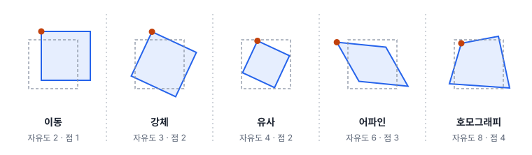
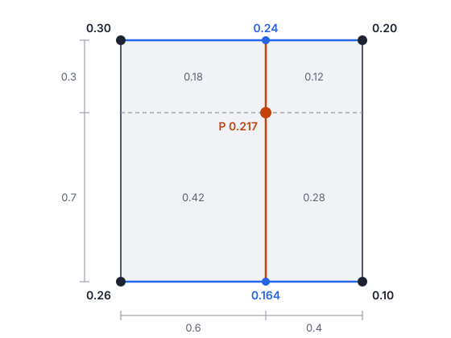
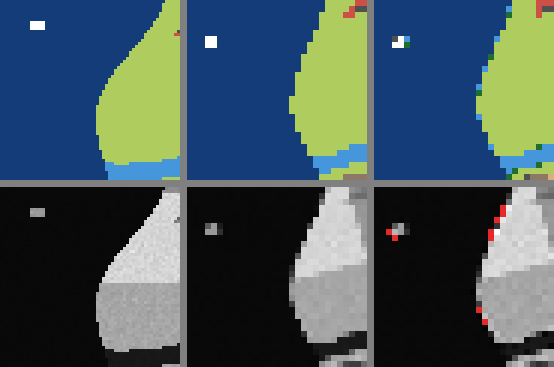

# 25강 좌표와 기하변환

## 이 강에서 얻는 것

- 변환마다 자유도와 필요한 최소 대응점 수를 알고, 장면에 맞는 변환을 고를 수 있음
- 역방향 매핑의 원리를 알고, 자료 종류에 맞는 보간(최근접·쌍선형·큐빅)을 고를 수 있음
- 지리 좌표와 투영 좌표를 구분해 재투영하고, 정사보정이 무엇을 바로잡는지 설명할 수 있음

## 1. 변환의 종류와 자유도

24강에서는 대응점을 찾고 RANSAC으로 틀린 짝을 걸러 두 영상 사이의 변환을 구했음. 이 강은 그 변환으로 영상을 실제로 옮기는 일부터 시작함. **기하변환(geometric transformation)**은 좌표 $(x, y)$를 새 좌표 $(x', y')$로 보내는 규칙이고, 허용하는 움직임이 많을수록 정할 숫자, 즉 **자유도**가 늘어남.

- **이동**: 자유도 2
- **강체 변환**: 이동 + 회전. 자유도 3
- **유사 변환**: 강체 + 확대·축소. 각도 유지. 자유도 4
- **어파인 변환(affine transformation)**: 유사 + 방향마다 다른 배율과 기울임. 평행선은 평행하게 남음. 자유도 6
- **호모그래피(투영 변환, homography)**: 어파인 + 원근. 평행선이 한 점으로 모일 수 있음. 자유도 8

어파인 변환은 2×2 행렬과 이동량으로 씀. 정할 숫자가 여섯 개라 자유도가 6임.

$$\begin{pmatrix} x' \\ y' \end{pmatrix} = \begin{pmatrix} a & b \\ c & d \end{pmatrix} \begin{pmatrix} x \\ y \end{pmatrix} + \begin{pmatrix} t_x \\ t_y \end{pmatrix}$$

호모그래피는 좌표 끝에 1을 붙인 **동차 좌표**에 3×3 행렬 $H$를 곱하고 셋째 성분으로 나눔.

$$\begin{pmatrix} u \\ v \\ w \end{pmatrix} = H \begin{pmatrix} x \\ y \\ 1 \end{pmatrix}, \qquad x' = \frac{u}{w}, \quad y' = \frac{v}{w}$$

칸은 9개지만 전체에 같은 수를 곱해도 나눗셈에서 지워지므로 자유도는 8임. 위치마다 다른 $w$로 나누는 단계가 원근을 만듦.

대응점 한 쌍은 식 두 개($x'$, $y'$)를 주므로 최소 쌍 수는 자유도의 절반(올림)임. 이동 1쌍, 강체·유사 2쌍, 어파인 3쌍(한 직선 위에 있지 않게), 호모그래피 4쌍(어느 세 점도 한 직선 위에 있지 않게). 실무에서는 훨씬 많은 점으로 최소제곱 맞춤을 하고 잔차의 RMSE로 품질을 봄. 좁은 평지를 멀리서 찍은 위성 영상끼리는 대개 어파인으로 충분하고, 기울여 찍은 드론 사진의 평평한 땅은 호모그래피가 맞고, 지형 기복은 둘 다 못 고침(6절).

## 2. 역방향 매핑과 리샘플링

입력 화소를 출력 위치로 보내는 **순방향 매핑**은 확대·회전 때 구멍과 겹침을 만들어서 **역방향 매핑**을 씀. 출력 화소마다 역변환으로 입력의 어디서 왔는지 계산하는데, 그 위치는 대개 (행 12.37, 열 40.81)처럼 화소 사이라서 주변 값으로 추정해야 함. 이것이 **보간(interpolation)**이고, 새 격자에 값을 다시 배정하는 과정 전체가 **리샘플링(재배열, resampling)**임. 재투영, 화소 크기 변경, 딥러닝 입력 크기 조절이 모두 리샘플링임. 위치는 화소 중심 기준으로 계산하며, 모서리 기준과 헷갈리면 반 화소 어긋남(20강).

## 3. 세 가지 보간

**최근접 이웃 보간(nearest neighbor interpolation, NN)**은 가장 가까운 화소 값을 그대로 가져옴. 새 값을 만들지 않지만 위치가 최대 약 0.71화소 어긋나고 경계가 계단처럼 됨.

**쌍선형 보간(bilinear interpolation)**은 둘러싼 2×2 화소를 가로로 한 번, 세로로 한 번 직선 보간함. 근적외 반사율이 왼쪽 위 0.30, 오른쪽 위 0.20, 왼쪽 아래 0.26, 오른쪽 아래 0.10이고, 점 P가 왼쪽 위 화소 중심에서 오른쪽으로 0.6, 아래로 0.3화소에 있다고 함.

- 위 줄: $0.30 + 0.6 \times (0.20 - 0.30) = 0.24$
- 아래 줄: $0.26 + 0.6 \times (0.10 - 0.26) = 0.164$
- 세로: $0.24 + 0.3 \times (0.164 - 0.24) \approx 0.217$

네 값에 가중치 0.28, 0.42, 0.12, 0.18(P가 나눈 네 직사각형 중 맞은편 것의 넓이)을 곱해 더한 것과 같아서, 가까운 화소일수록 가중치가 큼. 최근접이면 가장 가까운 오른쪽 위의 0.20을 가져옴. 쌍선형 결과는 늘 네 값의 범위 안에 있지만, 평균을 내는 셈이라 영상이 조금 흐려짐.

**큐빅 컨볼루션(쌍삼차 보간, bicubic interpolation)**은 4×4 화소 16개를 3차 곡선 모양의 가중치로 섞음. 경계가 더 선명하지만, 1~2화소 떨어진 이웃의 가중치가 음수라서 급한 경계 옆에서 값이 원래 범위를 넘는 **오버슈트**가 생김. 가중치 모양의 매개변수 $a$는 도구마다 다름(OpenCV는 −0.75, 흔히 −0.5). $a = -0.5$이면 1.5화소 떨어진 이웃의 가중치가 −0.0625라서, 바다(근적외 0.015)와 육지(0.28) 경계에 가장 가까운 두 바다 화소 사이 값이 음수가 됨.

$$0.015 - 0.0625 \times (0.28 - 0.015) \approx -0.0016$$

## 4. 무엇으로 리샘플링할까

4부 공통 자료(가상 연안 장면, 10 m)의 토지피복 라벨과 근적외 반사율을 15° 돌리면서 화소를 20 m로 키웠음(유사 변환). 격자 안쪽 출력 화소 19,950개로 비교함.

**라벨.** 최근접은 늘 원래 그 자리 주변 2×2 화소 중 하나의 클래스를 가져옴. 라벨 번호에 쌍선형을 쓰면 1,025화소(5.1%)가 2.5 같은 소수가 되고, 반올림해도 228화소(1.1%)는 주변 2×2에 없던 클래스가 됨. 농경지(3)와 도로(5) 사이가 시가지(4)로 39화소, 하천(1)과 농경지(3) 사이가 산림(2)으로 38화소 바뀜. 클래스 번호는 크기가 없는 이름표라 평균에 뜻이 없음. 그래서 토지피복도, 라벨·구름 마스크 같은 **범주형 자료는 최근접**으로 옮기고, 크게 줄일 때는 최빈값 방식도 씀.

**연속값.** 근적외 원래 범위는 0.0133~0.4216임. 최근접(0.0133~0.4143)과 쌍선형(0.0139~0.4111)은 범위 안이지만, 큐빅(OpenCV, $a = -0.75$)은 최솟값 −0.0366으로 31화소(바다 25, 하천 6)가 음수가 되었고 원래 최댓값 0.251이던 선박 하나가 0.306으로 부풀었음. 평균은 세 방식 모두 0.217이라 평균만 봐서는 모름.

정리하면 계산에 쓸 연속값(반사율, NDVI, DEM)은 쌍선형이 무난하고, 큐빅은 보여 주기용으로 쓰되 계산에 쓰면 오버슈트를 확인함. 크게 줄일 때는 몇 화소만 보는 보간 대신 면적 평균을 씀.

리샘플링은 거듭할수록 흐려짐(근적외를 쌍선형으로 15° 돌렸다 되돌리면 장면 가운데 150×150화소에서 원본과의 RMSE가 한 번에 약 0.012, 다섯 번에 약 0.020). 변환이 여럿이면 행렬을 곱해 합친 뒤 한 번만 리샘플링함.

## 5. 좌표계와 재투영

지도 좌표는 **좌표 참조 체계(CRS)**를 알아야 뜻이 있음. CRS마다 붙은 번호가 **EPSG 코드**임.

- **지리 좌표계**: 타원체 위의 위도·경도(도 단위). GPS의 WGS84가 대표이고 EPSG:4326임
- **투영 좌표계**: 평면에 펼쳐 동·북 방향 미터로 나타냄. UTM(한국 대부분은 52N 구역, EPSG:32652), EPSG:5186(중부원점: 경도 127°·위도 38° 원점에 동 200,000 m·북 600,000 m를 더함), EPSG:5179(UTM-K: 전국 하나, 중앙 경선 127.5°에 동 1,000,000 m·북 2,000,000 m를 더함)가 흔함. 서부·동부·동해 원점(5185·5187·5188)도 있음

위도 36.5°에서 경도 1°는 약 89.6 km, 위도 1°는 약 111.0 km라서 거리·넓이를 도 단위로 재면 방향마다 다르게 틀림.

**좌표 변환(재투영, reprojection)**은 좌표를 다른 좌표계의 좌표로 계산해 바꾸는 일임. pyproj로 위도 36.5°, 경도 127.5°를 바꾸면 다음과 같음.

| 좌표계 | 동(m) | 북(m) |
|---|---|---|
| EPSG:5186 | 244,795.7 | 433,642.7 |
| EPSG:5179 | 1,000,000.0 | 1,833,593.1 |
| EPSG:32652 | 365,662.6 | 4,040,454.2 |

이 점은 UTM-K 중앙 경선 위라 동 좌표가 더한 값 그대로임. 좌표계마다 자릿수가 크게 달라서 값만 봐도 짐작이 됨.

**축 순서**가 흔한 함정임. EPSG 공식 정의는 4326을 (위도, 경도), 5186을 (북, 동) 순서로 정하지만 GIS 파일과 대부분의 코드는 (경도, 위도) 순서로 다룸. pyproj는 기본이 공식 순서라서 `Transformer.from_crs("EPSG:4326", "EPSG:5186")`에 (36.5, 127.5)를 넣으면 (433,642.7, 244,795.7)을 (북, 동)으로 돌려줌. `always_xy=True`를 주면 (경도, 위도)를 넣고 (동, 북)을 받음. 순서가 뒤바뀌면 위도 127.5°가 되어 무한대(inf)가 나오지만, 두 값이 모두 90 이하인 지역에서는 조용히 엉뚱한 곳에 찍힘.

래스터 재투영도 역방향 매핑이라 4절의 기준을 따름. 영상의 (행, 열)과 지도의 (동, 북)을 잇는 **지오트랜스폼(geotransform)**도 어파인 변환임. GDAL은 (왼쪽 위 동, 화소 폭, 회전, 왼쪽 위 북, 회전, 화소 높이) 여섯 숫자로 저장함. 10 m 영상의 왼쪽 위 모서리가 EPSG:5186의 (244,000, 434,000)이면 (244000, 10, 0, 434000, 0, −10)이고, 행이 늘수록 북 좌표가 줄어 높이가 음수임. 앞의 점은 열 $(244{,}795.7 - 244{,}000)/10 \approx 79.6$, 행 $(434{,}000 - 433{,}642.7)/10 \approx 35.7$이라 (행 35, 열 79) 화소에 떨어짐. 폴리곤화에서의 쓰임은 50강에서 다룸.

## 6. 정사보정

센서가 비스듬히 볼수록, 땅이 높을수록 영상 속 위치가 제자리에서 밀리는데, 이를 **기복 변위(relief displacement)**라 부름. 멀리서 찍은 위성 영상에서 높이 $h$인 점은 대략 $\Delta \approx h \tan\theta$만큼 밀림($\theta$는 그 지점에서 센서 쪽을 본 방향이 연직에서 기운 각도로, 위성에서 잰 기울임 각보다 조금 큼). 공통 자료 DEM의 가장 높은 언덕(110 m)을 20° 기울여 찍으면 약 40 m(10 m 화소 4칸) 밀리고 해안(0 m)은 그대로임. 화소마다 밀리는 양이 달라 어파인이나 호모그래피 하나로는 바로잡을 수 없음.

**정사보정(orthorectification)**은 지형 기복과 센서 기울기로 생긴 기하 왜곡을 없애, 모든 화소를 바로 위에서 본 것처럼 지도 좌표에 놓는 처리임. 필요한 것은 세 가지임.

- **센서 모델**: 지상 점 (동, 북, 높이)가 원본의 어느 (행, 열)에 찍히는지 계산하는 식. 위성은 흔히 RPC 계수로 제공됨(26강)
- **DEM**: 화소마다의 지형 높이
- **지상기준점(GCP)**: 좌표를 아는 지상 점으로 센서 모델 오차를 바로잡음

처리는 역시 역방향 매핑이라, 출력 화소마다 DEM 높이를 읽고 센서 모델로 원본 위치를 계산해 보간함. 20°로 찍은 영상에서 DEM이 10 m 틀리면 위치가 약 3.6 m 어긋나므로, 관측 각도가 클수록 DEM 품질이 중요함. 일반 정사보정은 지형만 바로잡아 건물은 여전히 기울어 보임. 공통 자료의 40 m 건물은 20°에서 지붕이 약 15 m 밀림. 건물까지 세우려면 DSM(건물·나무까지 포함한 표면 높이)을 쓰는 **트루 정사영상(true orthophoto)**을 만듦.

## 현장에서는

연안 위성 영상으로 토지피복도와 NDVI 지도를 만들어 지자체 GIS(EPSG:5186)에 올리는 상황임. 원본을 RPC·DEM·GCP로 정사보정해 UTM 52N 격자에 놓고, GCP와 따로 남긴 검사점으로 위치 오차(예: 1화소 이내)를 확인함. 분류와 NDVI 계산은 이 격자에서 하고, 납품 직전에 5186으로 한 번만 재투영함. NDVI는 쌍선형, 토지피복도는 최근접으로 옮기고 두 층의 격자가 같은지 확인함.

## 헷갈리는 쌍

- **정사보정 vs 대기보정**: 정사보정은 화소의 **위치**를, 대기보정은 **값**(대기 산란·흡수로 달라진 밝기를 지표 반사율로)을 바로잡음. Sentinel-2 L1C는 정사보정된 대기 상단 반사율이고, 대기보정까지 마친 것이 L2A임.
- **어파인 vs 호모그래피**: 어파인은 평행을 유지하고(6, 3쌍), 호모그래피는 평행선이 모이는 원근까지 표현함(8, 4쌍).
- **좌표계 지정 vs 재투영**: 지정은 "이 숫자는 이 좌표계임"이라는 이름표만 바꿈(래스터는 `gdal_edit -a_srs`, 벡터는 `ogr2ogr -a_srs`). 재투영은 좌표 값을 계산해 바꿈(`gdalwarp -t_srs`).

## 이렇게 지시받음

> 지시: "라벨 마스크를 20 m 밴드 격자에 맞춰 줘. 리샘플링은 알아서."

라벨이므로 최근접이나 최빈값으로 옮기고, 20 m 화소 하나가 10 m 화소 넷과 정확히 겹치게 원점을 맞춤. 선박처럼 작은 클래스는 사라질 수 있으니 클래스별 화소 수를 전후로 비교함.

> 지시: "이 SHP 영상이랑 안 겹쳐. 5186으로 재투영해서 다시 올려."

먼저 좌표 자릿수와 파일에 적힌 좌표계를 대조함. 값이 20만·40만 대인데 4326으로 적혀 있으면 이름표 오류라 좌표계 지정으로 고침. 점이 엉뚱한 곳에 찍히거나 변환 결과가 무한대면 위도·경도 순서를 의심함.

> 지시: "산지 쪽만 탐지 폴리곤이 지도랑 30 m씩 밀려. 정사 때 쓴 DEM 확인해 봐."

높은 곳만 밀리면 기복 변위가 덜 없어진 것임. 관측 각도 20°라면 30 m는 높이 약 82 m의 오차라서, 높이를 일정하게 두고 보정했거나 잘못된 DEM을 썼는지 의심함. 폴리곤을 통째로 옮기면 평지가 틀어지므로 더 나은 DEM으로 다시 정사보정함.

## 요약

- 자유도는 이동 2, 강체 3, 유사 4, 어파인 6, 호모그래피 8이고 최소 대응점은 1·2·2·3·4쌍임
- 영상 변환, 재투영, 정사보정 모두 출력 화소마다 입력 위치를 거꾸로 찾아 보간함
- 범주형 자료는 최근접(또는 최빈값)으로만 옮김. 쌍선형을 쓰면 없던 클래스가 생김
- 연속값은 쌍선형이 무난하고, 큐빅은 경계에서 오버슈트가 생김. 리샘플링은 한 번만 함
- 위경도(4326)와 미터 단위 투영 좌표(5186 등)를 구분하고 축 순서를 확인함. 정사보정은 DEM과 센서 모델로 기복 변위를 없앰

## 핵심 용어

| 한글 | 영문 |
|---|---|
| 기하변환 / 자유도 | Geometric Transformation / DOF |
| 어파인 변환 | Affine Transformation |
| 호모그래피(투영 변환) | Homography (Projective Transformation) |
| 역방향 매핑 / 리샘플링 | Backward Mapping / Resampling |
| 최근접 이웃 보간 | Nearest Neighbor Interpolation (NN) |
| 쌍선형 보간 | Bilinear Interpolation |
| 큐빅 컨볼루션(쌍삼차 보간) | Cubic Convolution (Bicubic) |
| 좌표 참조 체계 / 좌표 변환(재투영) | CRS / Reprojection |
| 지오트랜스폼 | Geotransform |
| 기복 변위 | Relief Displacement |
| 정사보정 / 트루 정사영상 | Orthorectification / True Orthophoto |
