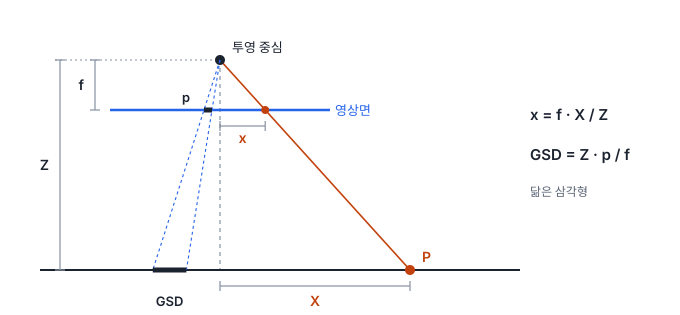
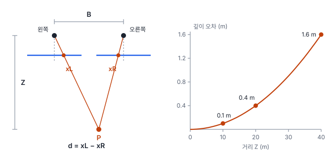
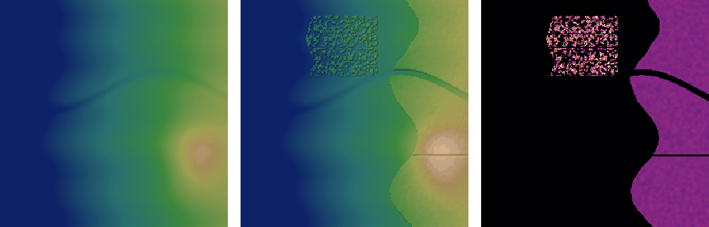

# 26강 센서 모델과 입체시

## 이 강에서 얻는 것

- 핀홀 카메라 모델로 3차원 점이 영상의 어느 화소에 맺히는지 계산하고, 내부·외부 파라미터와 렌즈 왜곡이 각각 무엇을 맡는지 구분할 수 있음
- 드론 프레임 카메라와 위성 푸시브룸 센서의 차이, 위성 영상에 RPC가 딸려 오는 이유와 GCP로 편향을 보정하는 방법을 설명할 수 있음
- 스테레오 영상에서 시차로 높이를 구하는 원리와 오차의 크기를 어림하고, DSM·DTM·DEM을 구분해 쓸 수 있음

## 1. 핀홀 카메라 모델과 초점거리

25강의 정사보정은 "이 지상 점이 영상의 어디에 찍혔는가"를 아는 데서 출발함. 이 대응을 식으로 적은 것이 **센서 모델**임.

가장 단순한 것이 **핀홀 카메라 모델(pinhole camera model)**임. 모든 광선이 한 점(**투영 중심**)을 지나 영상면에 맺힌다고 봄. 투영 중심에서 영상면까지의 거리가 **초점거리(focal length)** $f$임. 카메라 좌표계(OpenCV 규약: 오른쪽 $X$, 아래 $Y$, 광축 방향 $Z$)에서 점 $(X, Y, Z)$의 영상 좌표는 닮은 삼각형으로 나옴.

$$x = f\,\frac{X}{Z}, \qquad y = f\,\frac{Y}{Z}$$

멀리 있을수록($Z$가 클수록) 작게 찍힌다는 뜻임. 20강의 GSD 식($H \times p / f$)은 이 닮음을 화소 하나(크기 $p$)에 적용한 것이고, 수직 촬영이면 $Z$가 곧 지면까지의 높이 $H$임.

20강의 드론 카메라(초점거리 8.8 mm, 화소 약 2.41 µm, 5,472 × 3,648화소)로 지면 100 m 위에서 찍으면 GSD는 약 2.74 cm이고 한 장이 150 m × 100 m를 덮음. 20강에서 예고한 대로 $Z$는 지점마다 다름. 같은 비행 고도에서 30 m 높이의 언덕 꼭대기는 $Z = 70$ m라서 GSD가 약 1.92 cm로 작아짐. 산지를 한 고도로 날면 한 장 안에서도 축척이 달라지는 이유임.

## 2. 내부 파라미터와 외부 파라미터

실제 영상 좌표는 왼쪽 위가 원점인 화소 단위(열 $u$, 행 $v$)라서 단위 변환과 원점 이동이 더 필요함. 이를 모은 3×3 행렬 $K$가 **내부 파라미터(intrinsic parameters)**임.

$$Z_c \begin{bmatrix} u \\ v \\ 1 \end{bmatrix} = K\,[R \mid t] \begin{bmatrix} X_w \\ Y_w \\ Z_w \\ 1 \end{bmatrix}, \qquad K = \begin{bmatrix} f_x & s & c_x \\ 0 & f_y & c_y \\ 0 & 0 & 1 \end{bmatrix}$$

$Z_c$는 카메라 좌표의 깊이, $f_x, f_y$는 화소 단위 초점거리(초점거리 ÷ 화소 크기, 위 카메라는 3,648화소), $(c_x, c_y)$는 광축이 영상면과 만나는 **주점**, $s$는 축 기울어짐(보통 0)임. 카메라 좌표 $(20, -10, 100)$ m인 점은 주점이 영상 한가운데 $(2736, 1824)$일 때 $u = 3648 \times 20/100 + 2736 \approx 3466$, $v \approx 1459$ 화소에 찍힘.

**외부 파라미터(extrinsic parameters)** $[R \mid t]$는 지상(월드) 좌표계에서 카메라 좌표계로 옮기는 회전 $R$과 이동 $t$임. 위치 3개와 자세 각 3개로 자유도가 6이고, 사진측량에서는 **외부표정요소**라 부름. 내부 파라미터는 카메라마다 거의 고정이지만 외부 파라미터는 촬영할 때마다 바뀜. 드론은 GNSS(위성 측위)·IMU(관성 측정 장치)가 근삿값을 주고 사진측량 처리가 이를 다듬음. 지도 좌표(동·북)는 북쪽이 위라서 행 번호가 아래로 커지는 영상 좌표와 세로 방향이 반대임.

## 3. 렌즈 왜곡과 카메라 캘리브레이션

실제 렌즈는 핀홀처럼 곧게 투영하지 못함. 이 어긋남이 **렌즈 왜곡(lens distortion)**이고, 주점에서 멀어질수록 커지는 **방사 왜곡**이 가장 큼. 정규화 좌표($x = X/Z$, $r^2 = x^2 + y^2$)로 쓰면 다음과 같음.

$$x_d = x\,(1 + k_1 r^2 + k_2 r^4 + k_3 r^6)$$

OpenCV 규약에서 $k_1 < 0$이면 가장자리가 안쪽으로 오므라드는 술통형, $k_1 > 0$이면 바깥으로 벌어지는 실패형(핀쿠션형)임. 렌즈 중심이 어긋나 생기는 **접선 왜곡**($p_1, p_2$)도 있음. 위 카메라에 $k_1 = -0.02$만 있어도 모서리(주점에서 3,288화소)는 53화소, 지상으로 약 1.5 m 밀림. 모서리까지의 절반 거리에서는 이동이 거리의 세제곱에 비례해 6.7화소(1/8)로 줄어듦. 가장자리를 쓰는 정합일수록 왜곡 보정이 중요함.

**카메라 캘리브레이션(camera calibration)**은 내부 파라미터와 왜곡 계수를 추정하는 일임. 체커보드처럼 모양을 아는 패턴을 여러 위치·각도에서 찍고, 추정한 모델로 패턴 점을 다시 투영했을 때 실제 위치와의 차이(**재투영 오차**, 화소 단위)가 가장 작아지게 맞춤. 드론 사진측량에서는 사진끼리의 연결점(24강)으로 모든 사진의 외부 파라미터를 한꺼번에 다듬는 **번들 조정(bundle adjustment)**을 하며, 이때 내부 파라미터까지 함께 추정하는 **자가 캘리브레이션**을 흔히 씀. 초점·줌을 바꾸면 내부 파라미터가 달라지므로 다시 추정함.

## 4. 위성의 센서 모델: 푸시브룸, RPC, GCP

드론 카메라는 한 장을 한순간에 찍는 **프레임 카메라**임. 고해상도 광학 위성은 대개 **푸시브룸 센서(pushbroom sensor)**를 씀. 진행 방향에 수직으로 늘어선 1차원 검출기 줄이 한 행씩 찍고, 위성이 움직이며 다음 행을 쌓아 영상을 만듦. 행마다 촬영 시각이 달라 위치·자세도 행마다 조금씩 다르므로, 영상 전체에 $[R \mid t]$ 하나를 쓸 수 없음.

궤도·자세·시각·검출기 방향으로 이를 엄밀하게 모델링한 것이 **엄밀 센서 모델**인데, 위성마다 형식이 다르고 복잡함. 그래서 위성 영상은 흔히 **유리다항식 계수(rational polynomial coefficients, RPC)**를 딸려 배포함. 정규화한 위도 $\varphi$, 경도 $\lambda$, 높이 $h$를 3차 다항식 두 개의 비로 영상 행·열에 대응시킴.

$$\text{row}_n = \frac{P_1(\varphi, \lambda, h)}{P_2(\varphi, \lambda, h)}, \qquad \text{col}_n = \frac{P_3(\varphi, \lambda, h)}{P_4(\varphi, \lambda, h)}$$

다항식마다 항이 20개라 계수 80개와 정규화용 오프셋·배율로 이루어짐. 공급자가 엄밀 모델에 맞춰 둔 근사식이라, 사용자는 위성 종류와 관계없이 같은 방식으로 씀. 식에 높이 $h$가 들어가므로 영상에서 지상으로 갈 때는 DEM이 필요하고, DEM의 높이 오차 $\Delta h$는 25강 6절의 기복 변위처럼 대략 $\Delta h \tan\theta$($\theta$는 연직에서 기운 촬영 각)의 수평 위치 오차가 됨(20°에서 10 m면 약 3.6 m).

RPC에는 궤도·자세 오차에서 오는 **편향**이 남음. 좁은 장면에서는 영상 전체가 거의 같은 방향으로 밀리므로, **지상기준점(ground control point, GCP)**으로 보정함. GCP는 영상에서 뚜렷이 보이고 측량 좌표를 아는 점임. 영상 공간에서 이동량 하나(GCP 1개 이상)나 어파인 변환(3개 이상)을 추가로 추정함. 가상의 예로 GCP 6개가 평균 행 +3.2, 열 −4.5화소 밀려 있었고, 이 이동량을 빼니 보정에 쓰지 않은 **검사점** 4개의 RMSE가 5.5화소에서 0.4화소(GSD 0.5 m면 2.8 m → 0.2 m)로 줄었음. 정확도는 반드시 검사점으로 보고함.

## 5. 스테레오: 기선, 시차, 에피폴라 기하, 정합

영상 한 장은 광선의 방향만 알려 주고 거리는 모름. 다른 위치에서 찍은 두 번째 영상이 있으면 두 광선의 교점으로 거리가 정해짐. 두 투영 중심 사이 거리가 **스테레오 기선(stereo baseline)** $B$임.

두 영상의 행을 맞춰 두면(정류) 같은 점의 가로 좌표 차이, 즉 **시차(disparity)** $d = x_L - x_R$로 거리가 나옴.

$$Z = \frac{f\,B}{d}, \qquad \delta Z \approx \frac{Z^2}{f\,B}\,\delta d$$

시차는 거리에 반비례하고, 시차를 $\delta d$만큼 틀리면 깊이 오차는 **거리의 제곱**에 비례함. $f = 1000$화소, $B = 0.5$ m인 스테레오 카메라에서 거리 10, 20, 40 m의 시차는 50, 25, 12.5화소이고, 시차 오차 0.5화소는 깊이 오차 0.1, 0.4, 1.6 m가 됨.

항공·위성에서는 $f$를 화소 단위로 쓰면 $Z/f$가 GSD이므로 높이 정밀도를 $\delta h \approx \mathrm{GSD} \cdot (H/B) \cdot \delta d$로 어림함. $B/H$(**기선-고도 비**)가 클수록 정밀함. GSD 0.5 m, 정합 오차 0.5화소인 위성 스테레오는 $B/H = 0.6$이면 0.42 m, 0.2면 1.25 m임. 1절 드론이 진행 방향으로 사진을 80%씩 겹치게(**중복률** 80%) 찍으면 진행 방향 길이가 100 m인 사진이라 이웃한 두 장의 기선은 $B = 0.2 \times 100 = 20$ m, $B/H = 0.2$이고 $\delta h \approx 0.0274 \times 5 \times 0.5 \approx 6.9$ cm임. 드론 사진측량은 흔히 진행 방향과 옆 방향 모두 절반 넘게 겹치게 계획해 지면의 모든 점이 여러 장에 찍히게 함(권장 중복률은 도구·지형마다 다름). 다만 $B/H$가 크면 두 영상의 겉모습 차이와 건물에 가려지는 곳이 커져 정합이 어려워지므로, 고층 시가지에는 작은 $B/H$를 고르기도 함.

같은 점을 찾을 범위는 **에피폴라 기하(epipolar geometry)**가 줄여 줌. 두 투영 중심과 지상 점이 이루는 평면이 각 영상과 만나는 선이 **에피폴라 선**이고, 대응점은 반드시 이 선 위에 있음. 24강의 특징 매칭과 RANSAC으로 두 영상의 관계(**기초 행렬**, 한 영상의 점을 다른 영상의 에피폴라 선으로 옮기는 3×3 행렬)를 구하면 에피폴라 선을 알 수 있고, 이 선이 행과 나란하도록 다시 샘플링하는 것이 정류임. 푸시브룸 영상의 에피폴라 선은 엄밀히는 곡선이라 좁은 구간마다 직선으로 근사해 정류함.

**스테레오 정합(stereo matching)**은 정류한 영상쌍의 모든 화소에서 시차를 찾는 일임. 24강의 특징 매칭이 뚜렷한 점들만 짝짓는다면, 스테레오 정합은 화소마다 작은 창의 유사도를 비교하고 이웃 시차가 매끄럽도록 제약을 걸어 조밀한 시차 지도를 만듦. SGM(semi-global matching)이 대표적임. 무늬가 없거나 두 영상에서 달라 보이는 곳에서는 실패함.

- **수면**: 무늬가 없고 두 촬영 사이에 물결·햇빛 반사가 바뀜. 구멍이나 엉뚱한 높이가 생김
- **그림자**: 어둡고 잡음이 커서 무늬가 사라짐. 촬영 날짜가 다른 쌍이면 그림자 위치도 다름
- **가림과 반복 무늬**: 한쪽에서만 보이는 건물 옆면, 양식장 부표 줄처럼 되풀이되는 무늬

그래서 좌우를 바꿔 정합한 결과가 일치하지 않는 화소는 비워 두고, 수면은 마스크로 한 높이로 평탄화하며, 구멍은 보간으로 채우고 그 위치를 기록함.

## 6. DSM, DTM, DEM

스테레오 정합이 보는 것은 맨 윗면이므로 결과는 **수치표면모델(digital surface model, DSM)**임. 건물 지붕, 나무 꼭대기가 들어감. 이를 걷어 낸 맨땅 고도가 **수치지형모델(digital terrain model, DTM)**이고, 라이다(레이저 측량)의 지면 반사나 DSM에 **지면 필터링**을 해서 만듦. **수치표고모델(digital elevation model, DEM)**은 문헌·기관마다 뜻이 다름. 고도 격자를 두루 가리키는 통칭으로 쓰기도 하고, DTM과 같은 맨땅 모델만 가리키기도 함. 이름에 DEM이 붙은 공개 전 지구 자료 가운데에도 제품 설명서에 DSM이라고 밝힌 것(예: Copernicus DEM)이 있으므로 자료 설명서를 확인함.

DSM에서 DTM을 빼면 지표 위 물체의 높이만 남는 **정규화 DSM(nDSM)**이 됨. 4부 공통 자료로 계산하면(배열 이름은 dem이지만 맨땅이라 DTM에 해당함) nDSM이 2 m를 넘는 화소는 27,408개임. 산림 24,216화소는 평균 15.1 m, 시가지 6,222화소 가운데 건물 3,192화소(51%)는 평균 23.9 m, 최대 40.0 m임.

25강의 정사보정에 DTM을 쓰면 지붕이 지면 높이로 투영되어, 높이 $h$인 지붕이 대략 $h \tan\theta$만큼 옆으로 밀림(24 m 건물을 20°로 보면 8.7 m). DSM을 쓰면 지붕은 제자리에 오지만 건물에 가려진 뒤쪽 지면이 비거나 겹쳐 보이므로, 다른 영상으로 그 자리를 채운 것이 **트루 정사영상(true orthophoto)**(25강)임. DSM의 건물 가장자리가 부정확하면 정사영상의 건물 윤곽이 물결처럼 일그러짐.

## 현장에서는

해안 도시의 위성 스테레오 영상으로 건물 높이 지도를 만드는 상황임. GCP로 RPC 편향을 보정하고, 에피폴라 정렬 후 SGM으로 DSM을 만듦. 결과를 열어 보면 바다·하천에는 구멍과 스파이크가, 고층 건물 북쪽 그림자에는 주변과 동떨어진 웅덩이나 스파이크가 보임.

수계 마스크로 수면을 평탄화하고, 그림자 구멍은 채운 뒤 "보간됨" 층으로 따로 표시함. 지면 필터링으로 DTM을 만들어 nDSM을 구하고, 건물 폴리곤마다 구역 통계(1강)로 높이를 요약함. 가장자리 화소에 DSM 오차가 몰리므로 평균 대신 중앙값을 쓰고, 현장 측량한 건물 몇 동으로 오차를 확인함.

## 헷갈리는 쌍

- **내부 파라미터 vs 외부 파라미터**: 내부는 카메라 자체의 성질($K$, 왜곡 계수)이라 카메라가 같으면 거의 그대로이고, 외부는 촬영 순간의 위치·자세라 사진마다 다름. OpenCV의 $t$는 카메라 위치 자체가 아니라 좌표 변환의 이동 성분(카메라 위치는 $-R^\top t$)이라는 점도 헷갈리기 쉬움
- **시차 vs 깊이**: 시차가 클수록 가까움(반비례). 같은 시차 오차라도 먼 곳의 깊이 오차가 거리의 제곱으로 커짐
- **DSM vs DTM(DEM)**: DSM은 지붕·나무 꼭대기, DTM은 맨땅임. DEM은 문맥에 따라 통칭이거나 DTM이므로 어느 뜻인지 확인함

## 이렇게 지시받음

> 지시: "산림 구역은 중복률 올려서 다시 떠. 수관이 다 뭉개졌어."

나무 꼭대기는 보는 방향에 따라 모양이 달라지고, 비슷한 무늬가 되풀이되며, 바람에 흔들려 스테레오 정합이 자주 실패함. 중복률을 올리면 이웃한 사진끼리 기선이 짧아져 겉모습이 더 비슷해지고, 한 점이 더 많은 사진에 찍혀 정합 기회가 늘어남. 쌍 하나의 높이 정밀도는 떨어지지만(5절) 여러 장을 함께 써서 보완함. 비행 고도를 높여 사진끼리의 겉모습 차이를 줄이는 방법도 함께 검토함(GSD는 커짐). 사진 수와 비행 시간이 늘어나므로 배터리 교체 횟수와 처리 시간을 함께 계산함.

> 지시: "위성 정사, RPC만 믿지 말고 GCP 찍어서 편향 잡아. 검사점은 따로 빼 두고."

RPC의 고른 밀림을 GCP로 추정해 빼라는 뜻임. GCP는 장면 전체에 고르게 고르고, 보정에 쓰지 않은 검사점으로 RMSE를 보고함. 높이가 들어가므로 정사에 쓰는 DEM의 정확도와 촬영 각도도 함께 적음.

> 지시: "해안 저지대 면적은 DSM 말고 DTM으로 뽑아."

해발 몇 m 이하인 땅을 셀 때 DSM을 쓰면 건물·나무가 있는 곳이 높게 잡혀 저지대가 빠짐. 맨땅 고도(DTM)로 계산하고, 받은 자료가 "DEM"이라는 이름뿐이면 설명서에서 DSM인지 DTM인지 확인함.

## 요약

- 핀홀 모델은 닮은 삼각형($x = fX/Z$)이며, 같은 닮음에서 $\mathrm{GSD} = Z \cdot p / f$가 나옴
- 내부 파라미터 $K$는 카메라 자체, 외부 파라미터 $[R \mid t]$는 촬영 순간의 위치·자세이고, 렌즈 왜곡과 함께 캘리브레이션으로 추정함
- 위성 푸시브룸 영상은 흔히 RPC로 배포되며, 남은 편향은 GCP로 보정하고 검사점으로 확인함
- 스테레오는 $Z = fB/d$이고 깊이 오차는 거리의 제곱에 비례함. $B/H$는 정밀도와 정합 난이도를 맞바꿈. 수면·그림자에서 정합이 실패함
- DSM은 표면, DTM은 맨땅, DEM은 문맥에 따라 다름. nDSM = DSM − DTM은 물체 높이임

## 핵심 용어

| 한글 | 영문 |
|---|---|
| 핀홀 카메라 모델 / 투영 중심 | Pinhole Camera Model / Projection Center |
| 초점거리 / 주점 | Focal Length / Principal Point |
| 내부 파라미터 / 외부 파라미터 | Intrinsic Parameters / Extrinsic Parameters |
| 렌즈 왜곡(방사·접선) | Lens Distortion (Radial, Tangential) |
| 카메라 캘리브레이션 / 재투영 오차 | Camera Calibration / Reprojection Error |
| 번들 조정 / 자가 캘리브레이션 | Bundle Adjustment / Self-Calibration |
| 푸시브룸 센서 / 프레임 카메라 | Pushbroom Sensor / Frame Camera |
| 유리다항식 계수 | Rational Polynomial Coefficients (RPC) |
| 지상기준점 / 검사점 | Ground Control Point (GCP) / Check Point |
| 스테레오 기선 / 기선-고도 비 / 중복률 | Stereo Baseline / Base-to-Height Ratio (B/H) / Overlap |
| 시차 | Disparity |
| 에피폴라 기하 / 정류 | Epipolar Geometry / Rectification |
| 스테레오 정합 | Stereo Matching |
| 수치표면모델 / 수치지형모델 / 수치표고모델 | Digital Surface Model (DSM) / Digital Terrain Model (DTM) / Digital Elevation Model (DEM) |
| 정규화 DSM / 트루 정사영상 | Normalized DSM (nDSM) / True Orthophoto |
