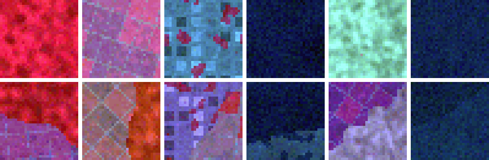
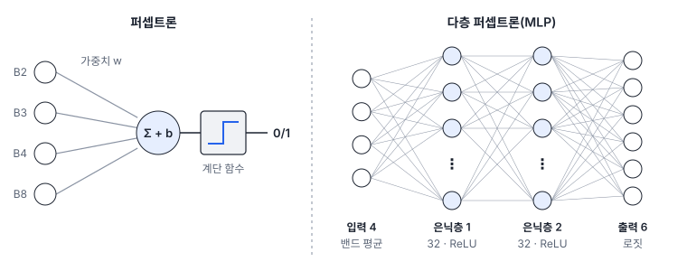
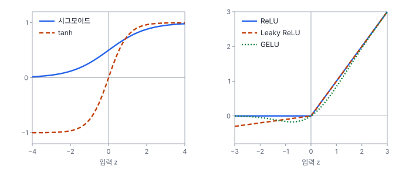

# 27강 신경망의 뼈대

## 이 강에서 얻는 것

- 퍼셉트론과 다층 퍼셉트론이 가중합·편향·활성화 함수로 어떻게 계산하는지, 은닉층이 왜 필요한지 설명할 수 있음
- 활성화 함수가 비선형이어야 하는 이유를 알고, ReLU·Leaky ReLU·GELU의 모양과 쓰임을 구분할 수 있음
- 로짓을 소프트맥스로 확률로 바꾸는 과정을 계산하고, 그 확률을 그대로 믿으면 안 되는 이유와 보편 근사 정리의 한계를 말할 수 있음

## 1. 5부 타일 자료

5부는 같은 예제 자료와 기본 모델로 이어서 실험함. 자료는 가상의 Sentinel-2 10 m 영상에서 자른 32×32 화소(320 m × 320 m) 타일이고, 밴드는 청·녹·적·근적외(B2·B3·B4·B8) 4개임. 클래스는 3부와 같은 산림·농경지·시가지·수계·나지·갯벌 6개이고, 학습 4,200 / 검증 900 / 시험 900 타일(클래스마다 같은 수)임.

학습·검증·시험은 **지역 단위**로 나눔. 30개 지역 중 21곳은 학습, 5곳은 검증, 4곳은 시험에만 씀. 같은 지역 타일은 촬영 조건을 공유해서, 무작위로 나누면 공간 누수(15강)로 점수가 부풀려지기 때문임. 타일의 약 40%는 두 클래스가 섞인 **경계 타일**이고, 라벨은 타일 안에서 가장 넓은 클래스임. 섞인 쪽이 최대 49%까지 차지함. 분할(33강) 예제용 화소 라벨도 있음.



기본 모델은 **VD-CNN**이라 부르는 작은 합성곱 신경망(파라미터 24,342개)임. 구조는 30강에서 다루고, 여기서는 "공간 무늬를 보는 모델"로만 알아 둠. 30에폭(학습 자료 전체를 30번 훑음, 28강) 학습을 마친 모델(last)의 시험 정확도는 0.941, 검증 손실이 가장 낮았던 27에폭 모델(best)은 0.974임. 5부의 모든 수치는 시드 0, CPU 한 스레드 기준이며, 환경이 다르면 소수 셋째 자리쯤 달라질 수 있음.

## 2. 퍼셉트론: 가중합, 편향, 계단

**퍼셉트론(perceptron)**은 가장 단순한 인공 뉴런임. 입력마다 가중치를 곱해 더하고, **편향(bias)**이라는 상수를 더한 뒤, 그 값 $z$가 0보다 크면 1, 아니면 0을 냄.

$$z = w_1x_1 + w_2x_2 + \cdots + w_nx_n + b, \qquad y = \begin{cases}1 & z > 0\\ 0 & z \le 0\end{cases}$$

녹색(B3)과 근적외(B8) 반사율로 물을 가르는 퍼셉트론을 예로 듦. 가중치를 $w_{B3} = 5$, $w_{B8} = -10$, 편향 $b = 0.5$로 두고 5부 타일을 만들 때 기준으로 쓴 클래스 대표 반사율(3부 클래스 평균과 같은 값)을 넣으면, 수계(0.05, 0.02)는 $z = 0.25 - 0.2 + 0.5 = 0.55$로 1, 산림(0.05, 0.33)은 $-2.55$로 0, 갯벌(0.075, 0.10)은 $-0.125$로 아슬아슬하게 0임. 실제 타일은 물에 잠긴 갯벌처럼 이 값에서 벗어난 것이 많아 수계·갯벌이 더 겹침.

판정이 바뀌는 곳은 $z = 0$, 곧 $\text{B8} = 0.5 \times \text{B3} + 0.05$인 직선임. 입력이 몇 개든 퍼셉트론의 결정 경계는 직선(고차원에서는 초평면)이라, 한 줄로 가를 수 있는 문제만 풂. 근적외 하나로 갯벌만 골라내려면 "0.05보다 크고 0.15보다 작음"이라는 가운데 구간을 잡아야 하는데 경계 하나로는 불가능함. 두 입력이 서로 다를 때만 1인 XOR 문제도 같은 이유로 못 푸는 고전적인 예임.

## 3. 은닉층과 다층 퍼셉트론

해법은 퍼셉트론을 층으로 쌓는 것임. 가운데 구간 문제는 뉴런 두 개면 풀림. 첫째는 "B8 > 0.05"(수계가 아님), 둘째는 "B8 > 0.15"(육지임)를 판정하고, 출력 뉴런이 "첫째 − 둘째 − 0.5 > 0"을 판정하면 첫째만 켜진 경우, 곧 갯벌 구간에서만 1이 됨. 입력과 출력 사이에서 중간 판정을 만드는 층을 **은닉층(hidden layer)**이라 부름. 그 값은 자료에 주어지지 않고 모델 안에서만 계산됨.

은닉층을 하나 이상 둔 구조가 **다층 퍼셉트론(MLP, multilayer perceptron)**임. 이름과 달리 요즘 MLP의 뉴런은 계단 대신 4절의 활성화 함수를 씀. 각 층은 앞 층 출력 전체의 가중합을 내는 선형 층이고, 은닉층의 뉴런 수를 **폭**, 은닉층 수를 **깊이**라고 함.



파라미터 수는 층마다 (입력 수 × 출력 수 + 출력 수)임. 입력 4 → 은닉 32 → 출력 6이면 $4 \times 32 + 32 = 160$과 $32 \times 6 + 6 = 198$을 더해 358개임. PyTorch로는 다음처럼 씀.

```python
import torch.nn as nn
mlp = nn.Sequential(
    nn.Linear(4, 32), nn.ReLU(),    # 은닉층 1
    nn.Linear(32, 32), nn.ReLU(),   # 은닉층 2
    nn.Linear(32, 6))               # 출력: 로짓 6개
```

5부 자료로 비교한 결과임(모두 30에폭 끝 모델). 앞의 세 MLP는 타일의 밴드별 평균 4개만 받음.

| 모델 | 입력 | 파라미터 | 학습 정확도 | 검증 정확도 | 시험 정확도 |
|---|---|---|---|---|---|
| 은닉층 없음 | 밴드 평균 4개 | 30 | 0.719 | 0.704 | 0.721 |
| 은닉 32 | 밴드 평균 4개 | 358 | 0.758 | 0.739 | 0.786 |
| 은닉 32×32 | 밴드 평균 4개 | 1,414 | 0.768 | 0.738 | 0.786 |
| 화소 펼침 MLP | 화소 4,096개 | 541,702 | 0.959 | 0.762 | 0.768 |
| VD-CNN | 4×32×32 타일 | 24,342 | 0.966 | 0.921 | 0.941 |

은닉층이 없는 모델은 입력의 가중합으로 클래스 점수를 바로 내므로 12강의 다항 로지스틱 회귀와 같음. 은닉층 하나를 넣으면 경계가 휘어서, 평균 반사율로도 갈리는 갯벌은 시험 150개 중 69개에서 130개로 맞힘. 반면 시가지는 82개에서 75개로 나아지지 않고 절반이 나지·농경지로 감. 시가지는 이 두 클래스와 평균 반사율이 겹치고 무늬(격자 도로와 지붕)로 갈리는데, 평균에는 무늬가 없음. 은닉층을 더 쌓아도 0.786 그대로인 것도 같은 이유로, 입력에 없는 정보는 깊이로 만들 수 없음.

타일의 화소 4,096개(4밴드 × 32 × 32)를 한 줄로 펴서 은닉 128×128 MLP에 넣으면 파라미터가 54만 개로 늘고, 학습 정확도는 0.959까지 오르지만 검증은 0.762에 그침. 학습 자료를 외운 과적합(14강, 29강)임. 화소를 펴면 어느 화소가 어느 화소 옆인지가 구조에서 사라지고, 같은 무늬가 다른 위치에 나오면 따로 배워야 함. 파라미터가 22분의 1인 VD-CNN이 훨씬 잘 맞히는 것은 이웃 화소를 묶어 보는 구조(30강) 덕분임.

## 4. 활성화 함수: 왜 비선형이어야 하는가

뉴런의 가중합에 거는 함수를 **활성화 함수(activation function)**라 부름. 이것이 선형이면 층을 아무리 쌓아도 선형 모델 하나임. 두 선형 층을 이으면 다음처럼 다시 선형 층 하나가 됨.

$$W_2(W_1x + b_1) + b_2 = (W_2W_1)\,x + (W_2b_1 + b_2)$$

앞 표의 32×32 MLP에서 활성화를 빼면 파라미터는 1,414개 그대로지만 나타낼 수 있는 경계는 30개짜리 로지스틱 회귀와 같아짐.

**시그모이드**(12강, 출력 0~1)와 **tanh**(출력 −1~1)는 초기 신경망의 은닉층에 흔히 썼음. 둘 다 양 끝에서 평평해지고(포화) 기울기가 거의 0이라 깊은 망에서 학습 신호가 사라지기 쉬움(28강). 시그모이드는 기울기가 가장 큰 곳에서도 0.25임. 지금은 0~1 범위가 필요한 출력 등에 주로 씀.



- **ReLU(정류 선형 유닛, rectified linear unit)**: $\max(0, z)$. 음수는 0, 양수는 그대로 통과함. 계산이 싸고 양수 쪽에서 포화하지 않아 합성곱 신경망의 기본값임(VD-CNN도 씀). 입력이 늘 음수가 되는 뉴런은 출력과 기울기가 모두 0이라 다시 살아나지 못하는데, 이를 죽은 ReLU라 부름
- **Leaky ReLU(리키 ReLU)**: 음수 쪽에 0 대신 작은 기울기 $\alpha$를 곱한 $\alpha z$를 냄. PyTorch 기본값은 0.01임. 음수 쪽 기울기가 0이 아니라 죽은 뉴런을 줄임
- **GELU(가우시안 오차 선형 유닛)**: $z \cdot \Phi(z)$. $\Phi$는 표준정규분포의 누적분포함수로, "입력이 클수록 통과시킬 비율을 높임"이라는 뜻임. 0 근처에서 매끈하고, $z \approx -0.75$에서 최솟값 약 −0.17로 조금 음수가 됨. $z = 1$이면 0.84, $z = 2$면 1.95로 커질수록 ReLU에 붙음. 비전 트랜스포머(32강)와 ConvNeXt(31강) 같은 최근 구조의 기본값임

분류 모델의 출력층에는 이런 활성화 대신 5절의 소프트맥스를 씀.

## 5. 로짓과 소프트맥스

분류 신경망의 마지막 선형 층은 클래스마다 점수 하나를 냄. 이 점수를 **로짓(logit)**이라 부르며, 범위 제한이 없고 합도 1이 아님. **소프트맥스(softmax)**가 이를 합이 1인 확률로 바꿈(12강).

$$p_k = \frac{e^{z_k}}{\sum_{j=1}^{K} e^{z_j}}$$

모든 로짓에 같은 수를 더해도 확률은 그대로이고, 확률을 정하는 것은 **로짓의 차이**뿐임. 두 클래스 확률의 비는 $e^{z_1 - z_2}$라서, 클래스가 둘뿐이면 1위 확률은 차이가 0이면 0.5, 1이면 0.731, 3이면 0.953, 5면 0.993임. VD-CNN(best)이 시험 타일 세 개에 낸 값임.

| 시험 타일 (정답) | 1위 로짓 | 2위 로짓 | 차이 | 확률 |
|---|---|---|---|---|
| 시가지만 있음 (시가지) | 시가지 8.30 | 수계 −2.01 | 10.31 | 시가지 0.9999 |
| 수계 48% + 갯벌 52% (갯벌) | 갯벌 2.74 | 수계 2.69 | 0.05 | 갯벌 0.511, 수계 0.488 |
| 시가지 48% + 나지 52% (나지) | 시가지 4.18 | 나지 0.99 | 3.20 | 시가지 0.959, 나지 0.039 |

첫 타일은 확률비가 약 3만 배임. 둘째는 반씩 섞인 타일에서 모델도 반반으로 망설임. 셋째도 반씩 섞였는데 시가지로 0.959를 확신하며 틀림.

로짓을 모두 $T$로 나눈 뒤 소프트맥스를 걸면 차이가 $1/T$배로 줄어 확률이 평평해짐. 이 $T$를 **온도**라 부름. 셋째 타일은 $T = 2$에서 시가지 0.787, 나지 0.159가 됨. 온도는 순위를 두고 확신의 세기만 바꿈.

소프트맥스 확률은 "이 값이 0.9면 열에 아홉은 맞음"을 보장하는 보정된 확률이 아님. 이 모델이 시험 타일 900개 중 맞힌 것의 평균 확신도는 0.969, 틀린 23개는 0.772였고, 틀린 것 중 6개는 0.9를 넘었음. 확신도와 적중률을 맞추는 보정은 55강에서 다룸.

## 6. 보편 근사 정리

**보편 근사 정리(universal approximation theorem)**는 은닉층 하나짜리 신경망이 뉴런만 충분히 많으면 유한한 범위 안의 연속함수를 원하는 정밀도로 근사할 수 있다는 내용임. 1989년 전후로 시그모이드 같은 활성화 함수에서 증명되었고, 1993년에 활성화 함수가 다항식만 아니면(ReLU 포함) 성립하는 것으로 넓혀짐. 이 정리는 그런 망이 **존재한다**는 것만 말함. 말하지 않는 것이 셋임.

- **필요한 폭**: 뉴런이 몇 개 필요한지 말하지 않으며, 비현실적으로 많을 수 있음. 깊게 쌓으면 훨씬 적은 뉴런으로 되는 경우가 알려져 있음
- **학습 가능성**: 그 가중치를 경사하강(28강)으로 찾을 수 있다는 보장이 없음
- **일반화**: 유한한 학습 자료에서 찾은 망이 새 자료에서도 맞는다는 보장이 없음

화소 펼침 MLP는 학습 자료를 0.959까지 맞혔지만 새 지역에서는 0.768이었음. 나타낼 능력은 충분했고 부족한 것은 일반화였음. 구조를 고르는 기준은 "무엇이든 나타낼 수 있는가"가 아니라 "적은 자료로도 맞는 쪽으로 학습되는가"이며, 합성곱(30강)과 어텐션(32강)이 그 답들임.

## 현장에서는

타일 분류 모델로 격자 단위 토지피복도를 만드는 과제임. 경계 격자가 많은 지역이라 1위 클래스만 넘기면 반반 섞인 격자도 한 클래스로 확정됨. 그래서 1위·2위 클래스와 두 확률의 차이를 속성으로 저장하고, 차이가 작은 격자만 검수자가 영상과 대조함.

다만 시가지·나지가 반씩인데 0.959로 틀린 예처럼 확신하며 틀리는 격자도 있음. 검증 지역에서 확률 구간별 실제 적중률을 먼저 확인해 자동 확정 기준을 정하고(55강), 확률을 다시 계산할 수 있게 로짓도 보관함.

## 헷갈리는 쌍

- **로짓 vs 확률**: 로짓은 소프트맥스 앞의 점수로 범위 제한이 없고 차이만 의미가 있음. 확률은 소프트맥스를 거친 0~1 값으로 합이 1임. 통계의 로짓(로그 오즈, 12강)과 이름이 같으며, 이항이면 두 로짓의 차이가 곧 로그 오즈임.
- **퍼셉트론 vs 로지스틱 회귀**: 둘 다 가중합 + 편향이라 결정 경계가 직선임. 퍼셉트론은 계단 함수로 0/1만 내고 틀린 표본이 있을 때만 가중치를 고치는 규칙으로 학습함. 로지스틱 회귀는 시그모이드로 확률을 내고 로그 손실을 줄여 학습함.
- **깊이 vs 폭**: 깊이는 은닉층의 수, 폭은 한 은닉층의 뉴런 수임. 32×32 MLP는 깊이 2, 폭 32임. 둘 다 파라미터를 늘리지만, 입력에 정보가 없으면 어느 쪽을 늘려도 점수가 오르지 않음.

## 이렇게 지시받음

> 지시: "MLP 층을 늘렸는데 로지스틱 회귀랑 점수가 똑같아? 활성화 빠졌는지부터 봐."

활성화 없이 선형 층만 쌓으면 선형 모델 하나와 같다는 뜻임. `nn.Linear` 사이에 `nn.ReLU()` 같은 활성화가 들어갔는지 확인하고, 들어가 있는데도 같다면 밴드 평균 입력처럼 입력에 구분할 정보가 없는지 의심함.

> 지시: "추론 결과 저장할 때 확률만 말고 로짓도 같이 떨궈."

확률을 반올림해 저장하면 0.9999처럼 포화한 값끼리의 차이가 사라져 로짓을 되찾을 수 없음. 로짓을 남기면 온도 보정(55강) 같은 후처리를 추론을 다시 돌리지 않고 시험할 수 있음.

> 지시: "확률 0.9 넘는 건 자동 확정하고, 나머지만 검수로 돌려."

소프트맥스 확률을 적중률처럼 쓰겠다는 뜻인데, 보정된 값이 아님. 검증 자료에서 0.9 이상인 예측의 실제 정확도와 오답 수를 먼저 보고함. 이 강의 모델만 해도 오답 23개 중 6개가 0.9를 넘었음.

## 요약

- 퍼셉트론은 가중합 + 편향에 계단 함수를 건 뉴런이며 결정 경계가 직선이라, 가운데 구간이나 XOR 같은 문제를 못 풂
- 은닉층을 둔 다층 퍼셉트론은 중간 판정을 조합해 휜 경계를 만듦. 은닉층 없는 MLP는 다항 로지스틱 회귀와 같음
- 활성화 함수가 선형이면 층을 쌓아도 선형임. 은닉층에는 ReLU(기본), Leaky ReLU(음수 쪽 작은 기울기), GELU(트랜스포머 계열)를 주로 씀
- 로짓은 소프트맥스 앞의 점수이고 확률을 정하는 것은 로짓의 차이임. 온도로 나누면 순위는 두고 확신만 약해지며, 소프트맥스 확률은 보정된 확률이 아님
- 보편 근사 정리는 근사하는 망이 존재한다는 것만 말하며, 필요한 폭·학습 가능성·일반화는 보장하지 않음

## 핵심 용어

| 한글 | 영문 |
|---|---|
| 퍼셉트론 | Perceptron |
| 편향 | Bias |
| 은닉층 | Hidden Layer |
| 다층 퍼셉트론 | Multilayer Perceptron (MLP) |
| 활성화 함수 | Activation Function |
| 정류 선형 유닛 | Rectified Linear Unit (ReLU) |
| 리키 ReLU | Leaky ReLU |
| 가우시안 오차 선형 유닛 | Gaussian Error Linear Unit (GELU) |
| 로짓 | Logit |
| 소프트맥스 / 온도 | Softmax / Temperature |
| 보편 근사 정리 | Universal Approximation Theorem |
