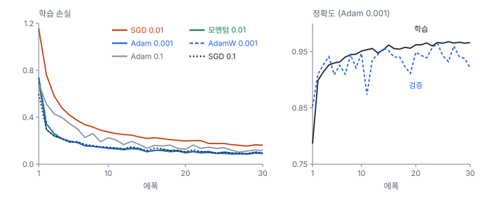
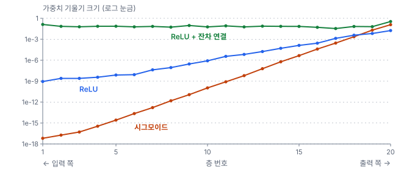
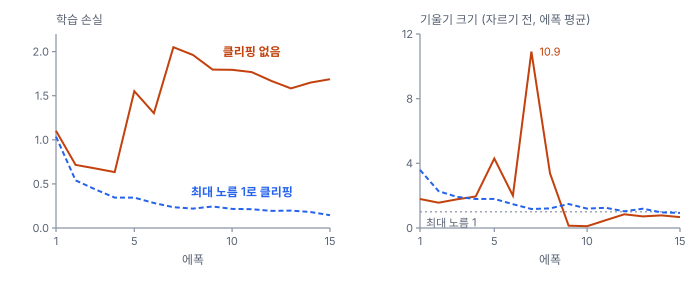

# 28강 손실과 최적화

## 이 강에서 얻는 것

- 분류에는 교차 엔트로피, 회귀에는 평균제곱오차를 쓰는 이유를 알고, 학습 전 손실이 정상인지 확인할 수 있음
- 역전파를 손으로 따라가고, 에폭·반복·미니배치를 셀 수 있음
- SGD·모멘텀·Adam·AdamW의 차이, 기울기 소실·폭주의 원인과 클리핑의 역할을 설명할 수 있음

## 1. 손실 함수: 교차 엔트로피와 MSE

학습은 손실을 줄이는 일임(13강). 분류에는 **교차 엔트로피 손실(cross-entropy loss)**을 씀. 소프트맥스(27강)가 낸 클래스별 확률 $p_k$ 가운데 **정답 클래스 확률의 음의 로그**임. 12강의 로그 손실을 클래스 여럿으로 넓힌 것이고 배치 평균을 냄.

$$L = -\ln p_{\text{정답}}$$

학습 전 무작위 모델은 여섯 클래스에 거의 같은 확률 $1/6$을 주므로 손실이 $\ln 6 \approx 1.79$ 근처에서 시작함. 27강에서 소개한 5부 타일 자료와 VD-CNN(시드 0)을 학습 전에 추론 모드(`model.eval()`, 29강)로 학습 타일 전체에 돌리면 1.80, 학습 때처럼 64개씩 넣으면 평균 1.85가 나옴.

회귀에는 **평균제곱오차(MSE, mean squared error)**를 씀. 영상에서 지표면온도(℃)나 바이오매스(t/ha)를 추정하는 모델이 예임.

$$\mathrm{MSE} = \frac{1}{n}\sum_{i=1}^{n}\left(y_i - \hat{y}_i\right)^2$$

단위가 ℃²라서 보고할 때는 제곱근(RMSE)으로 되돌림.

분류에 MSE(정답 칸만 1인 원-핫 벡터와 확률 벡터의 차이 제곱 합)를 쓰면 **확신하며 틀린 예에 벌이 약함**. 산림 타일에 산림 0.01·농경지 0.95를 준 경우와 산림 0.3·농경지 0.4로 망설인 경우를 비교함. 기울기는 정답 로짓(27강)에 대한 미분으로, 음수는 로짓을 올리라는 뜻이고 절댓값이 미는 힘임.

| 예 | 교차 엔트로피 | 기울기 | 제곱 오차 합 | 기울기 |
|---|---|---|---|---|
| 확신하며 틀림 (정답 0.01) | 4.61 | −0.99 | 1.88 | −0.038 |
| 망설이며 틀림 (정답 0.3) | 1.20 | −0.70 | 0.67 | −0.40 |

교차 엔트로피의 로짓 기울기는 $p_k - y_k$($y_k$는 정답이면 1, 아니면 0)라서 크게 틀릴수록 크게 밈. 제곱 오차는 손실이 최대 2에 묶이고, 소프트맥스가 0 근처에서 평평해 가장 크게 틀린 예를 오히려 열 배 약하게 밈.

## 2. 역전파: 기울기를 뒤에서 앞으로

경사하강(13강)에는 모든 파라미터에 대한 손실의 기울기(미분)가 필요함. **역전파(backpropagation)**는 이를 **연쇄 법칙**(합성함수의 미분은 각 단계 미분의 곱)으로, 출력 쪽에서 입력 쪽으로 한 단계씩 넘기며 구함.

작은 망으로 따라가 봄. 입력 NDVI $x = 0.5$, 가중치 $w_1 = 2.0$, $w_2 = 1.5$, 정답 $y = 1.0$이고 $\hat{y} = w_2 \cdot \mathrm{ReLU}(w_1 x)$, 손실은 $(\hat{y} - y)^2$임.

- 순전파: $z = w_1 x = 1.0$, $h = \mathrm{ReLU}(z) = 1.0$, $\hat{y} = 1.5$, 손실 0.25
- $\partial L/\partial \hat{y} = 2(\hat{y} - y) = 1.0$
- $\partial L/\partial w_2 = 1.0 \times h = 1.0$, 그리고 앞으로 넘길 $\partial L/\partial h = 1.0 \times w_2 = 1.5$
- ReLU는 $z > 0$이면 기울기 1이라 $\partial L/\partial z = 1.5$
- $\partial L/\partial w_1 = 1.5 \times x = 0.75$

각 단계는 "받은 기울기 × 자기 미분"뿐임. 학습률 0.1로 한 걸음 가면 $w_1 = 1.925$, $w_2 = 1.4$, 손실 0.121로 줄어듦. 은닉층이 시그모이드였다면 ReLU의 기울기 1 자리에 시그모이드 도함수(최대 0.25)가 곱해졌을 것이고, 이것이 5절의 기울기 소실로 이어짐.

## 3. 미니배치, 반복, 에폭

경사하강을 그대로 하면 걸음마다 학습 타일 4,200개 전체의 기울기를 구해야 함. 실제로는 무작위로 뽑은 일부(**미니배치**)의 기울기로 한 걸음씩 감. 이를 **확률적 경사하강법(SGD, stochastic gradient descent)**이라 부름. 기울기가 추정값이라 흔들리지만 같은 계산량으로 훨씬 자주 갱신함.

- **반복(iteration)**: 미니배치 하나로 파라미터를 한 번 갱신하는 것
- **에폭(epoch)**: 학습 자료 전체를 한 바퀴 다 쓰는 것

배치 64면 $4200 / 64 = 65.6$이라 64개 배치 65개와 마지막 40개 배치 1개, 곧 **에폭당 66번 갱신**함. 30에폭이면 1,980번임. 에폭마다 순서를 새로 섞고, 마지막 배치를 버릴지는 설정함(`DataLoader`의 `drop_last`, 기본은 버리지 않음).

PyTorch로 쓰면 다음과 같음.

```python
for x, y in loader:                      # 미니배치 하나 = 반복 1번
    loss = F.cross_entropy(model(x), y)  # 순전파와 손실
    optimizer.zero_grad()                # 지난 반복의 기울기 지우기
    loss.backward()                      # 역전파
    torch.nn.utils.clip_grad_norm_(model.parameters(), 1.0)  # 5절
    optimizer.step()                     # 파라미터 갱신
```

`loss.backward()`는 기울기를 `.grad`에 **더하므로** `optimizer.zero_grad()`를 빠뜨리면 지난 기울기가 쌓임.

## 4. 옵티마이저: SGD, 모멘텀, Adam, AdamW

기울기 $g$로 파라미터 $\theta$를 어떻게 옮길지가 옵티마이저의 차이임($\eta$는 학습률).

$$\theta \leftarrow \theta - \eta\, g$$

SGD는 이 식 그대로임. **모멘텀(momentum)**은 지난 걸음을 관성처럼 이어 받음.

$$v \leftarrow \mu v + g, \qquad \theta \leftarrow \theta - \eta\, v$$

$\mu = 0.9$면 같은 방향 기울기가 이어질 때 걸음이 최대 $1/(1-\mu) = 10$배까지 커지고, 방향이 오락가락하는 성분은 서로 상쇄됨.

**Adam**은 기울기의 이동 평균 $m$과 기울기 제곱의 이동 평균 $s$를 함께 들고, 파라미터마다 기울기 크기로 나눠 걸음을 정함.

$$m \leftarrow \beta_1 m + (1-\beta_1)\, g, \qquad s \leftarrow \beta_2 s + (1-\beta_2)\, g^2, \qquad \theta \leftarrow \theta - \eta\, \frac{\hat{m}}{\sqrt{\hat{s}} + \epsilon}$$

$\hat{m}$, $\hat{s}$는 0에서 출발한 초반 값을 바로잡은 것이고 PyTorch 기본은 $\beta_1 = 0.9$, $\beta_2 = 0.999$임. $\hat{m}/\sqrt{\hat{s}}$는 기울기 부호가 일정하면 1에 가깝고 오락가락하면 작아짐. 그래서 기울기의 절대 크기가 크든 작든 걸음이 대략 $\eta$ 이하로 묶임.

**AdamW**는 가중치 감쇠(가중치를 매 걸음 조금씩 0 쪽으로 줄이는 규제, 29강)를 기울기와 분리함. `torch.optim.Adam`의 `weight_decay`는 $\lambda\theta$를 기울기에 더하는 L2 규제라, 이 항도 $\sqrt{\hat{s}}$로 나뉘어 기울기가 큰 파라미터일수록 덜 줄어듦. AdamW는 Adam 걸음과 따로 $\theta \leftarrow \theta - \eta\lambda\theta$를 해서 모두 같은 비율로 줄임(PyTorch 구현 기준. 원 논문은 $\lambda$에 학습률 대신 스케줄 배율을 곱함). 학습률 0.001·감쇠 0.05면 감쇠만으로 1,980걸음에 0.906배가 됨.

VD-CNN을 여섯 설정으로 30에폭씩 학습한 결과임(Adam 0.001은 27강의 기본 학습과 같은 설정).

| 옵티마이저 (학습률) | 1에폭 학습 손실 | 0.25 아래로 간 에폭 | 30에폭 학습 손실 | 시험 정확도 last | best (에폭) |
|---|---|---|---|---|---|
| SGD 0.01 | 1.157 | 13 | 0.163 | 0.948 | 0.958 (26) |
| 모멘텀 0.01 | 0.702 | 3 | 0.096 | 0.902 | 0.971 (27) |
| Adam 0.001 | 0.741 | 4 | 0.091 | 0.941 | 0.974 (27) |
| AdamW 0.001 | 0.742 | 4 | 0.093 | 0.950 | 0.974 (27) |
| Adam 0.1 | 0.685 | 7 | 0.117 | 0.882 | 0.972 (25) |
| SGD 0.1 | 0.598 | 3 | 0.093 | 0.966 | 0.949 (23) |

last는 30에폭 끝 모델, best는 검증 손실이 가장 낮았던 에폭의 모델임.



- **차이는 초반 속도임.** SGD 0.01은 첫 에폭 손실이 1.157로 나머지(0.60~0.74)보다 크고, 0.25 아래로 가는 데 13에폭이 걸림. 모멘텀 0.01의 곡선이 SGD 0.1과 비슷한 것은 걸음이 최대 10배가 되기 때문임
- **끝 성적은 비슷함.** best 모델은 0.95~0.97이고, Adam과 AdamW는 곡선이 거의 겹침(감쇠의 효과는 29강)
- **Adam 0.1은 기본의 100배인데도 발산하지 않았음.** Adam은 걸음이 학습률 정도로 묶이고, 배치 정규화가 층마다 값의 크기를 다시 맞춰 주는 것(29강)도 도왔을 것으로 봄(배치 정규화를 뺀 비교는 하지 않았음). 대신 손실이 덜 내려가고 흔들림이 큼
- **검증 정확도가 에폭마다 크게 오르내림.** Adam 0.001도 10에폭 0.947 → 11에폭 0.873 → 12에폭 0.936임. 학습률이 끝까지 같으면 파라미터가 계속 크게 움직여 마지막 에폭은 흔들림의 한 순간일 뿐이라, last가 0.88~0.97로 벌어짐. 학습률 스케줄(46강)과 조기 종료(29강)가 필요한 이유임. SGD 0.1은 best(0.949)가 last(0.966)보다 낮아, 검증 900타일로 고른 모델도 너무 믿지 않음

## 5. 기울기 소실과 폭주, 클리핑

역전파는 층마다 "자기 단계의 미분"을 곱하므로, 그 곱이 1보다 작으면 입력 쪽으로 갈수록 기울기가 사라짐. 이를 **기울기 소실(vanishing gradient)**이라 부름. 시그모이드의 도함수 $\sigma(z)(1 - \sigma(z))$는 최대 0.25라서, 10층만 지나도 $0.25^{10} \approx 10^{-6}$임.

학습 전의 정규화 없는 20층 합성곱 망(폭 16, PyTorch 기본 초기화)에 학습 타일 256개를 넣고 잰 층별 가중치 기울기 크기임.



- **시그모이드**: 출력 쪽 0.12 → 입력 쪽 $6.5 \times 10^{-18}$, 층마다 약 7분의 1. 도함수(0.25 이하)에 작은 초기 가중치가 함께 곱해진 결과임
- **ReLU**: 켜진 곳의 도함수는 1인데도 $1.7 \times 10^{-2}$ → $8.9 \times 10^{-10}$. PyTorch(2.14) 합성곱 층의 기본 초기화는 가중치 분산이 $1/(3 \times \text{입력 수})$이고, 여기서는 16채널 × 3×3 = 144라 약 0.0023임. ReLU 층에서 신호 크기가 유지되도록 맞춘 He 초기화(가중치 분산 $2/\text{입력 수}$)의 6분의 1이고, ReLU가 절반을 0으로 만드니 층을 지날 때마다 기울기가 약 $1/\sqrt{6} \approx 0.41$배가 됨. 19층이면 $0.41^{19} \approx 4 \times 10^{-8}$로, 측정한 비율 $5 \times 10^{-8}$과 크기 수준이 맞음(편향과 층마다 달라지는 활성값 크기를 무시한 어림임)
- **ReLU + 잔차 연결**: 출력 쪽 0.34, 입력 쪽 0.13으로 유지됨. 두 층마다 입력을 출력에 그대로 더하는 지름길이 있어, 기울기가 가중치 곱셈을 거치지 않고 입력 쪽으로 흐름(31강)

반대로 곱이 1보다 크거나 학습률이 크거나 튀는 배치를 만나면, 기울기가 갑자기 커져 파라미터를 멀리 날려 버림. 이를 **기울기 폭주(exploding gradient)**라 부름. **기울기 클리핑(gradient clipping)**은 모든 파라미터 기울기를 한 벡터로 본 크기(L2 노름) $\lVert g \rVert$가 상한 $c$를 넘으면 방향은 두고 크기만 $c$로 줄임.

$$g \leftarrow g \cdot \min\!\left(1,\ \frac{c}{\lVert g \rVert}\right)$$

VD-CNN에서 배치 정규화를 빼고 모멘텀 SGD 학습률 0.1로 15에폭 학습해 비교함.



클리핑이 없으면 4에폭까지 손실이 0.63으로 잘 내려가다가 5에폭에 1.55로 튀고, 7에폭에는 기울기 크기의 에폭 평균이 10.9까지 치솟음. 그 뒤 학습 정확도는 0.16~0.18(무작위로 찍는 수준)까지 떨어져 끝까지 0.3을 넘지 못하고, 시험 정확도는 0.297(last)임. 최대 노름 1로 자르면 손실이 0.15까지 꾸준히 내려가 시험 정확도 0.932(last)임. 다만 자르기 전 크기의 에폭 평균이 15에폭 가운데 13에폭에서 1을 넘어 잘린 걸음이 많았을 것이므로, 폭주를 막은 효과와 걸음이 작아진(학습률을 낮춘 것과 비슷한) 효과가 섞여 있음.

## 현장에서는

해안 양식장 타일을 시설 유형 5종으로 분류하는 모델을 새 장면을 더해 다시 학습하는 상황임. 잘 내려가던 손실이 갑자기 튀더니 NaN(숫자가 아님)이 됨.

먼저 첫 배치 손실이 $\ln 5 \approx 1.61$ 근처였는지 봐서 라벨·손실 설정을 확인함. 다음으로 반복마다 기울기 크기를 찍어 튀는 배치를 찾음. 새 장면의 가장자리 타일에 NoData 값 −9999가 그대로 들어 있었음. 반사율(0~1) 자료를 표준화하면 정상 화소는 대개 ±3 안인데 −9999는 절댓값이 수만을 넘는 입력이라 순전파 값과 기울기가 함께 폭주한 것임. NoData 화소를 마스크하거나 그런 타일을 빼고, `clip_grad_norm_`은 안전장치로 남겨 둠. 클리핑은 원인을 고치지 않으므로 입력 값 범위 점검을 자료 준비 단계에 넣음.

## 헷갈리는 쌍

- **에폭 vs 반복(iteration)**: 반복은 미니배치 하나로 한 번 갱신, 에폭은 학습 자료 한 바퀴임. 4,200타일·배치 64면 1에폭 = 66반복.
- **Adam의 L2 규제 vs AdamW의 가중치 감쇠**: Adam의 `weight_decay`는 감쇠 항이 기울기에 섞여 파라미터마다 다르게 줄고, AdamW는 따로 적용해 같은 비율로 줄임. 모멘텀 없는 SGD에서는 둘이 같은 식임.
- **기울기 소실 vs 기울기 폭주**: 소실은 입력 쪽 층이 거의 안 배우는 조용한 실패이고, 폭주는 손실이 튀거나 NaN이 되는 요란한 실패임. 소실은 활성 함수·초기화·잔차 연결로, 폭주는 학습률·정규화·클리핑으로 다룸.

## 이렇게 지시받음

> 지시: "학습 돌리기 전에 첫 배치 로스부터 찍어 봐. 6클래스면 1.8 근처 나와야 돼."

무작위 모델의 교차 엔트로피는 $\ln 6 \approx 1.79$ 근처여야 한다는 점검임. 크게 벗어나면 출력 개수가 클래스 수와 다른지(10개면 $\ln 10 \approx 2.30$ 근처), 입력 표준화가 빠져 로짓이 처음부터 큰지 의심함.

> 지시: "로스 튀면 grad norm 같이 로그 남기고, clip 1.0 걸어서 다시 돌려 봐."

손실이 튀는 원인이 기울기 폭주인지 확인하라는 뜻임. `loss.backward()` 뒤 자르기 전 전체 기울기 노름을 기록하고 `clip_grad_norm_(..., 1.0)`을 넣어 비교함. 거의 매번 잘린다면 학습률이 큰 것은 아닌지도 봄.

> 지시: "Adam에 weight_decay 주지 말고 AdamW로 바꿔. 감쇠는 0.05로."

L2 규제가 Adam의 정규화에 섞여 의도대로 작동하지 않으니 감쇠를 분리한 AdamW를 쓰라는 뜻임. `torch.optim.AdamW(..., weight_decay=0.05)`로 바꾸고, 감쇠 강도는 같은 검증 자료로 비교함(29강).

## 요약

- 분류는 교차 엔트로피(정답 확률의 음의 로그), 회귀는 평균제곱오차를 줄임. 무작위 6클래스 모델의 첫 손실은 $\ln 6 \approx 1.79$ 근처이고, 분류에 MSE를 쓰면 확신하며 틀린 예를 약하게 밈
- 역전파는 연쇄 법칙으로 "받은 기울기 × 자기 미분"을 출력 쪽에서 입력 쪽으로 넘겨 모든 기울기를 구함
- 미니배치 하나로 한 번 갱신하는 것이 반복, 자료 한 바퀴가 에폭임. 4,200타일·배치 64면 에폭당 66번 갱신함
- 학습률 0.01의 SGD는 초반이 느렸고 나머지는 빨랐지만 best 모델 성적은 비슷했음. Adam은 파라미터마다 기울기 크기로 나눠 걸음을 정하고, AdamW는 가중치 감쇠를 분리함
- 층마다 1보다 작은 미분이 곱해지면 기울기가 소실되고(시그모이드 20층에서 약 $5 \times 10^{-17}$배), 기울기가 튀면 학습이 망가짐. 클리핑은 크기만 상한으로 잘라 폭주를 막음

## 핵심 용어

| 한글 | 영문 |
|---|---|
| 교차 엔트로피 손실 | Cross-Entropy Loss |
| 평균제곱오차 | Mean Squared Error (MSE) |
| 역전파 / 연쇄 법칙 | Backpropagation / Chain Rule |
| 확률적 경사하강법 / 미니배치 | Stochastic Gradient Descent (SGD) / Mini-Batch |
| 반복 / 에폭 | Iteration / Epoch |
| 모멘텀 | Momentum |
| 아담 | Adaptive Moment Estimation (Adam) |
| 분리형 가중치 감쇠 Adam | AdamW |
| 기울기 소실 / 기울기 폭주 | Vanishing Gradient / Exploding Gradient |
| 기울기 클리핑 | Gradient Clipping |
