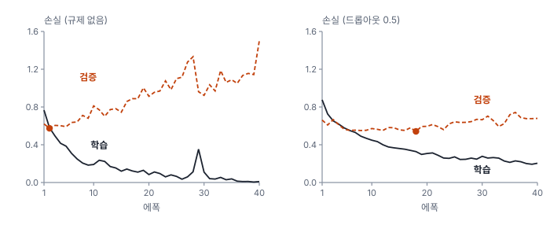
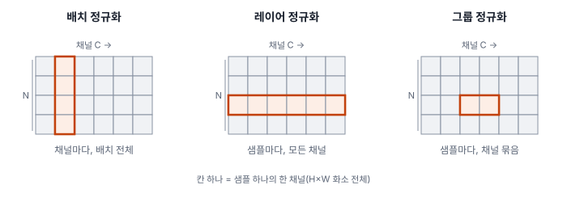
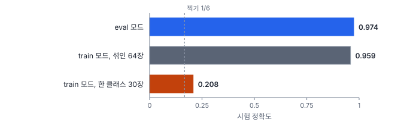

# 29강 학습을 안정시키는 장치

## 이 강에서 얻는 것

- 우리말로 똑같이 "정규화"라 부르는 규제(regularization)와 정규화 층(normalization)을 구별할 수 있음
- 드롭아웃·가중치 감쇠·라벨 스무딩·조기 종료가 학습 곡선을 어떻게 바꾸는지 읽고, 조기 종료의 기준 지표를 고를 수 있음
- 배치·레이어·그룹 정규화가 평균을 내는 범위를 구별하고, `model.train()`과 `model.eval()`을 빠뜨렸을 때의 사고를 막을 수 있음

## 1. 두 가지 "정규화"

14강에서 과적합을 막는 장치를 **규제(정규화, regularization)**라고 불렀음. 이 강의 앞 절반(드롭아웃, 가중치 감쇠, 라벨 스무딩, 조기 종료)이 신경망의 규제임. 뒤 절반의 배치 정규화·레이어 정규화·그룹 정규화는 영어로 normalization이고, 층 안에서 값의 평균과 분산을 맞추는 장치임(10강 표준화를 층마다 하는 셈). 목적은 과적합 방지가 아니라 학습을 빠르고 안정되게 하는 것임.

## 2. 과적합하는 모델로 시작하기

27강의 화소 펼침 MLP(타일 화소 4,096개를 한 줄로 펴서 넣는 54만 파라미터 모델)를 40에폭까지 학습함(30에폭까지는 27강과 같은 학습). 여기에 규제를 하나씩 넣어 비교함. 학습·검증 값은 40에폭 값이고, 시험 정확도 last는 40에폭 끝 모델, best는 검증 손실이 가장 낮았던 에폭의 모델임.

| 설정 | 학습 정확도 | 학습 손실 | 검증 손실 최소 (에폭) | 검증 손실 | 검증 정확도 | 시험 last | 시험 best |
|---|---|---|---|---|---|---|---|
| 규제 없음 | 0.998 | 0.010 | 0.574 (2) | 1.500 | 0.758 | 0.746 | 0.700 |
| 드롭아웃 0.5 | 0.908 | 0.204 | 0.542 (18) | 0.679 | 0.781 | 0.782 | 0.799 |
| AdamW 감쇠 0.1 | 0.995 | 0.017 | 0.556 (5) | 1.376 | 0.743 | 0.749 | 0.768 |
| AdamW 감쇠 1.0 | 0.914 | 0.213 | 0.574 (6) | 0.847 | 0.737 | 0.713 | 0.772 |
| 라벨 스무딩 0.1 | 0.9995 | 0.430 | 0.587 (15) | 0.645 | 0.782 | 0.780 | 0.767 |



규제 없는 모델은 학습 손실이 0.010까지 내려가는 동안 검증 손실은 2에폭의 0.574에서 1.500으로 오름. 그런데 검증 정확도는 3에폭 이후 0.72~0.79 사이를 오갈 뿐 크게 떨어지지 않음. 맞히는 개수는 비슷한데 틀린 타일에 점점 더 확신한다는 뜻임. 교차 엔트로피는 확신하며 틀린 예에 벌을 크게 주므로(28강) 손실만 치솟음. 이 모델의 과적합은 정확도보다 **과신**으로 먼저 드러남.

## 3. 드롭아웃, 가중치 감쇠, 라벨 스무딩

**드롭아웃(dropout)**은 학습 때 매 반복마다 은닉 유닛을 확률 $p$로 무작위로 꺼서(0으로 만들어) 특정 유닛 몇 개에 기대어 외우는 것을 막음. 추론 때는 모든 유닛을 씀. 켜진 유닛 수가 학습과 추론에서 다르므로 크기를 맞춰야 하는데, PyTorch의 `nn.Dropout`은 학습 때 살아남은 값에 $1/(1-p)$를 곱해 기댓값을 그대로 둠. $p = 0.5$면 남은 값을 두 배로 함. 표에서 드롭아웃은 검증 손실이 40에폭에도 0.679에 머물고 시험 정확도(best 0.799)도 가장 높았음.

**가중치 감쇠(weight decay)**는 매 걸음 가중치를 0 쪽으로 조금씩 당겨 큰 가중치를 억제함(11강 릿지와 같은 뿌리). AdamW는 기울기 걸음과 따로 $\theta \leftarrow \theta - \eta\lambda\theta$를 적용함(28강). 학습률 0.001로 2,640걸음(40에폭 × 66반복)이면 감쇠만으로 가중치가 $\lambda = 0.1$에서 0.768배, $\lambda = 1.0$에서 0.071배가 됨. 0.1은 규제 없음과 거의 같았고, 1.0은 검증 손실을 0.847로 눌렀지만 시험 정확도 last는 0.713으로 오히려 낮았음. 강도는 검증 자료로 고르는 하이퍼파라미터임(14강).

**라벨 스무딩(label smoothing)**은 정답 확률의 목표를 1이 아니라 조금 낮춰 잡음. $K$개 클래스에서 PyTorch는 다음 목표를 씀($y_k$는 정답이면 1, 아니면 0).

$$y_k^{\text{LS}} = (1-\varepsilon)\,y_k + \frac{\varepsilon}{K}$$

$\varepsilon = 0.1$, $K = 6$이면 정답 0.917, 나머지 0.017씩임. 목표 자체가 0과 1이 아니어서 완벽히 맞혀도 학습 손실이 목표 분포의 엔트로피인 0.421 밑으로 내려가지 않음. 표의 학습 손실 0.430이 다른 설정보다 큰 것은 이 바닥 때문이고 덜 배웠다는 뜻이 아님. 학습 정확도는 0.9995로 가장 높음. 그래서 **라벨 스무딩을 넣은 모델과는 학습 손실을 직접 비교하지 않음**. 최적점에서 정답과 다른 클래스의 로짓 차이가 $\ln(0.917/0.017) \approx 4.0$으로 묶여 로짓이 끝없이 커지지 않으므로 과신이 줄어듦. 검증 손실은 정답 1 기준의 보통 교차 엔트로피로 쟀는데 40에폭 0.645로 가장 낮았음.

세 규제 모두(가중치 감쇠는 1.0일 때) 40에폭 검증 손실을 1.50에서 0.65~0.85로 낮췄지만 시험 정확도는 0.71~0.80으로, 규제 없음(last 0.746)보다 많아야 0.05 높았음. 파라미터가 22분의 1인 VD-CNN은 0.941(last)~0.974(best)였음. 이 자료에서 정확도를 가른 것은 규제가 아니라 이웃 화소를 묶어 보는 구조(30강)였음. 반대로 VD-CNN을 학습 타일 600개로 80에폭 학습했을 때는 학습 정확도 0.97, 검증 최대 0.95로 과적합이 뚜렷하지 않았고, 규제를 넣은 best 모델의 시험 정확도(0.954~0.961)가 넣지 않은 모델(0.959)과 같은 수준이었음. 이 정도 차이는 시드만 바꿔도 뒤바뀔 수 있음.

## 4. 조기 종료와 기준 지표

**조기 종료(early stopping)**는 에폭마다 검증 지표를 재서 더 나아지지 않으면 학습을 멈추고, 가장 좋았던 에폭의 가중치(체크포인트)를 쓰는 것임. 나아지지 않아도 기다리는 에폭 수를 **참을성(patience)**이라 부름.

기준 지표가 결과를 바꿈. 규제 없는 MLP를 검증 손실로 고르면 2에폭 모델이 뽑히고 시험 정확도는 0.700으로 40에폭 끝 모델(0.746)보다 낮음. 2에폭 모델은 과신이 적을 뿐 아직 덜 배운 모델이기 때문임. 검증 정확도로 고르면 36에폭(0.794)이 뽑혀 전혀 다른 모델이 됨. 손실은 확신의 질까지 보고 정확도는 맞힌 개수만 보므로, 최종 산출물이 1위 클래스 지도라면 정확도(탐지·분할이면 mAP·IoU 등, 35~40강)를 기준으로 삼는 편이 목적에 맞음.

참을성도 결과를 바꿈. VD-CNN의 검증 손실은 에폭마다 오르내렸음(28강). 참을성 5로 멈추면 15에폭 최솟값 뒤 다섯 에폭 동안 나아지지 않아 20에폭에서 멈추고, 가장 낮은 27에폭(best, 시험 0.974)까지 가지 못함. 참을성 10이면 30에폭까지 가서 27에폭을 고름. 멈출 시점을 검증 자료로 골랐으니 최종 성능은 시험 자료로 따로 보고함(14·15강). 체크포인트 저장·관리는 49강에서 다룸.

## 5. 정규화 층: 배치, 레이어, 그룹

**배치 정규화(BN, batch normalization)**는 합성곱 층 출력의 채널마다 미니배치 안 모든 샘플·모든 화소의 평균 $\mu_B$와 분산 $\sigma_B^2$로 표준화한 뒤, 학습하는 척도 $\gamma$와 이동 $\beta$를 적용함.

$$\hat{x} = \frac{x - \mu_B}{\sqrt{\sigma_B^2 + \epsilon}}, \qquad y = \gamma\,\hat{x} + \beta$$

$\epsilon$은 0으로 나누지 않게 더하는 작은 수이고, $\gamma$, $\beta$ 덕분에 층이 필요하면 원래 크기로 되돌릴 수도 있음. VD-CNN은 합성곱 뒤, ReLU 앞에 넣었고 채널 112개에 $\gamma$, $\beta$ 224개가 파라미터로 들어 있음(30강). 층마다 값의 크기를 다시 맞춰 주므로 큰 학습률에서도 덜 발산함(28강의 Adam 0.1).

추론 때는 타일을 한 장씩 넣기도 하고 배치 구성도 제각각이라 배치 통계에 기댈 수 없음. 그래서 학습하면서 **러닝 통계**(배치 평균·분산의 이동 평균)를 쌓아 둠. PyTorch 기본은 매 반복 $\mu_{\text{run}} \leftarrow 0.9\,\mu_{\text{run}} + 0.1\,\mu_B$이고(분산도 같은 식. 인자 `momentum=0.1`은 새 배치 값의 비중이라 옵티마이저 모멘텀 0.9와 뜻이 반대임), 추론 때는 이 고정값으로 표준화함. 러닝 통계는 학습하는 파라미터가 아니지만 가중치 파일에 함께 저장됨.



**레이어 정규화(LN, layer normalization)**는 샘플 하나 안에서 평균·분산을 냄. 다른 샘플과 섞이지 않아 배치 크기와 상관없고 학습·추론 동작이 같음. 트랜스포머에서는 토큰(패치) 하나의 특징 벡터 안에서 정규화함(32강). ConvNeXt도 배치 정규화 대신 씀(31강).

**그룹 정규화(GN, group normalization)**는 샘플 하나 안에서 채널을 몇 묶음으로 나눠 묶음마다 정규화함. 묶음이 하나면 레이어 정규화와 정규화 범위가 같음. 배치가 작을 때 배치 정규화 대신 씀. VD-CNN의 배치 정규화를 4묶음 그룹 정규화로 바꿔 10에폭 비교함. 배치 4는 갱신이 16배 잦아 두 정규화 모두 학습률을 0.00025로 낮췄고 배치 64는 0.001이라, 비교는 같은 배치 크기끼리만 함.

- **배치 4**: 배치 정규화는 학습 손실이 0.348까지밖에 내려가지 않고 그룹 정규화는 0.129까지 내려감. 타일 4개의 통계는 어떤 타일이 섞였느냐에 따라 크게 흔들려 같은 타일도 배치마다 다르게 표준화되고, 학습 손실은 이 배치 통계로 잰 값임. 러닝 통계로 재는 검증 손실 최소는 0.190 대 0.164로 차이가 줄어듦
- **배치 64**: 배치 정규화가 학습 손실 0.135, 검증 손실 최소 0.144로 그룹 정규화(0.143, 0.174)보다 나았음

## 6. 학습 모드와 추론 모드

배치 정규화와 드롭아웃은 학습 때와 추론 때 다르게 동작하고, PyTorch는 모델 전체의 모드로 이를 바꿈. `model.train()`이면 배치 통계를 쓰고 러닝 통계를 갱신하며 드롭아웃을 켬. `model.eval()`이면 러닝 통계를 쓰고 드롭아웃을 끔. 표의 학습 정확도도 학습 모드로 잰 값이라, 드롭아웃 모델의 0.908은 첫 은닉층 유닛 절반을 끈 상태의 점수임.

```python
model.eval()                  # 배치 정규화는 러닝 통계, 드롭아웃은 끔
with torch.no_grad():         # 기울기 기록만 끔. 모드는 바꾸지 않음
    for x in loader:
        prob = model(x).softmax(1)
model.train()                 # 학습을 이어 갈 때 되돌림
```

`torch.no_grad()`는 메모리와 계산을 아낄 뿐 모드와는 별개라, 이것만 쓰고 `model.eval()`을 빠뜨리는 실수가 흔함. VD-CNN(best)으로 시험함.



섞인 배치에서는 배치 통계가 러닝 통계와 비슷해 0.959로 조금만 떨어짐. 그래서 무작위로 섞인 검증에서는 실수를 알아채기 어려움. 그런데 수계 타일만 30장 모인 배치는 채널 평균이 곧 "수계의 평균"이 되고, 그것을 빼면 수계다운 특징이 사라짐. 한 장면을 순서대로 잘라 추론하면 바다·산림처럼 한 클래스가 이어진 배치가 흔하므로 실제로 일어나는 사고임. 게다가 학습 모드로 추론하면 러닝 통계까지 추론 자료로 덮어써, 그 상태로 저장한 모델도 망가짐.

## 현장에서는

건물 분할 모델을 512×512 영상으로 미세조정(48강)하는데 GPU 메모리 때문에 배치가 2뿐인 상황임. 학습 손실은 들쭉날쭉하고 검증 IoU가 사전학습 모델보다도 낮아짐. 영상 두 장의 통계로 배치 정규화를 하니 학습 때 표준화가 흔들리고, 러닝 통계도 그 흔들리는 값으로 덮어써짐.

대처는 둘 중 하나임. 배치 정규화 층만 `eval()`로 두어 사전학습 때의 러닝 통계로 표준화하게 하거나(동결. $\gamma$, $\beta$까지 고정하려면 `requires_grad`도 끔), 그룹 정규화를 쓰는 구조로 바꿈. 동결한 뒤에도 전체 `model.train()`을 다시 부르면 풀리므로 에폭 시작마다 다시 걸었는지 확인함. 배치 크기를 키우는 방법은 47강에서 다룸.

## 헷갈리는 쌍

- **규제(regularization) vs 정규화(normalization)**: 규제는 과적합을 막는 장치(드롭아웃·가중치 감쇠·라벨 스무딩·조기 종료), 정규화 층은 값의 분포를 맞춰 학습을 안정시키는 층임. 지시에 "정규화"가 나오면 영어로 어느 쪽인지 확인함(14강).
- **배치 정규화 vs 레이어 정규화**: 배치 정규화는 채널마다 배치 전체로, 레이어 정규화는 샘플마다 그 안에서 평균을 냄. 배치 정규화만 학습·추론 동작이 달라 모드와 배치 크기의 영향을 받음.
- **드롭아웃의 학습 vs 추론**: 학습 때는 유닛을 무작위로 끄고 남은 값을 $1/(1-p)$배 하며, 추론 때는 끄지도 곱하지도 않음. 추론 때 켜 두면 같은 타일도 돌릴 때마다 결과가 바뀜.
- **가중치 감쇠 vs L2 규제**: 둘 다 가중치를 0 쪽으로 당기고 모멘텀 없는 SGD에서는 같은 식임. Adam에서는 L2 항이 기울기 크기로 나뉘어 달라지므로 AdamW의 분리된 감쇠를 씀(28강).

## 이렇게 지시받음

> 지시: "추론 결과가 배치 크기 바꿀 때마다 달라져. `model.eval()` 들어갔는지부터 봐."

같은 타일의 예측이 배치 구성에 따라 바뀌는 것은 배치 통계를 쓰고 있다는 신호임. 추론 함수 안에서 `model.eval()`을 불렀는지, 그 뒤에 학습 루프가 `model.train()`으로 바꿔 놓지 않았는지 확인함.

> 지시: "체크포인트는 검증 로스 말고 검증 정확도 제일 높은 걸로 골라."

과신은 줄었지만 덜 배운 초반 모델이 검증 손실로 뽑히는 것을 피하려는 뜻임. 최종 산출물이 1위 클래스 지도라면 정확도 기준이 목적에 맞음. 확률을 그대로 쓰는 산출물이라면 손실 기준과 보정(55강)을 함께 검토함.

> 지시: "라벨 스무딩 넣은 버전이랑은 로스로 비교하지 마. 정확도로 비교해."

라벨 스무딩은 학습 손실의 바닥을 올리므로(6클래스·0.1이면 약 0.42) 학습 손실이 커 보여도 덜 배운 것이 아님. 비교는 같은 기준으로 잰 검증 정확도나 보통 교차 엔트로피로 함.

## 요약

- 규제(regularization)는 과적합을 막고, 정규화 층(normalization)은 층 안 값의 분포를 맞춰 학습을 안정시킴. 우리말 이름만 같음
- 과적합한 화소 펼침 MLP는 검증 정확도보다 검증 손실(과신)이 먼저 나빠짐. 드롭아웃·가중치 감쇠·라벨 스무딩은 과신을 줄였지만 정확도는 크게 못 올렸고, 차이를 낸 것은 합성곱 구조였음
- 라벨 스무딩은 학습 손실의 바닥을 올리므로 손실끼리 직접 비교하지 않음
- 조기 종료는 가장 좋았던 체크포인트를 쓰는 것이며, 기준 지표(손실·정확도)와 참을성에 따라 고르는 모델이 달라짐
- 배치 정규화는 채널마다 배치 통계로 표준화하고 추론 때는 러닝 통계를 씀. 레이어·그룹 정규화는 샘플 안에서 정규화해 작은 배치에 강함
- 추론 전에는 `model.eval()`을 부름. `torch.no_grad()`는 모드를 바꾸지 않으며, 빠뜨리면 한 클래스가 모인 배치에서 정확도가 0.974에서 0.208로 무너짐

## 핵심 용어

| 한글 | 영문 |
|---|---|
| 규제(정규화) | Regularization |
| 드롭아웃 | Dropout |
| 가중치 감쇠 | Weight Decay |
| 라벨 스무딩 | Label Smoothing |
| 조기 종료 / 참을성 | Early Stopping / Patience |
| 배치 정규화 | Batch Normalization (BN) |
| 레이어 정규화 | Layer Normalization (LN) |
| 그룹 정규화 | Group Normalization (GN) |
| 러닝 통계 | Running Statistics |
| 학습 모드 / 추론 모드 | Training Mode / Inference (Eval) Mode |
