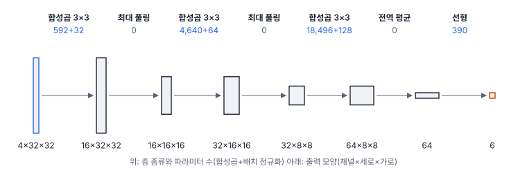
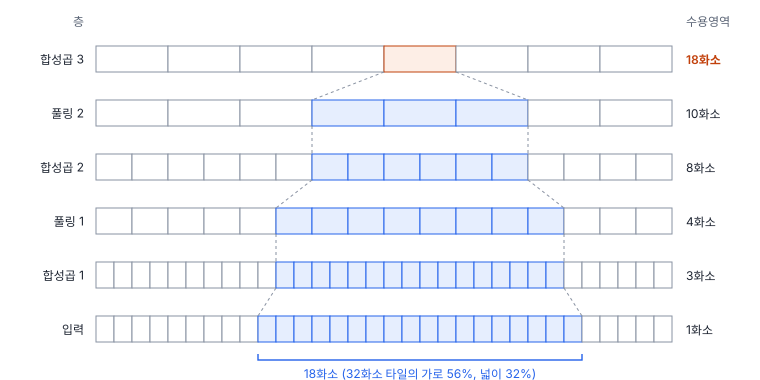
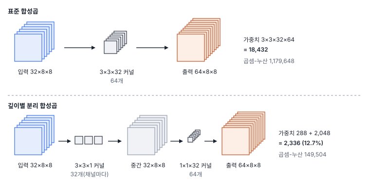

# 30강 합성곱 신경망의 부품

## 이 강에서 얻는 것

- 커널 모양과 스트라이드·패딩을 보고 합성곱 층의 출력 크기와 파라미터 수를 직접 계산할 수 있음
- 가중치 공유 덕분에 합성곱 신경망이 MLP보다 훨씬 적은 파라미터로 무늬를 배우는 이유와, 층을 쌓을수록 수용영역이 커지는 방식을 설명할 수 있음
- 풀링, 1×1·팽창·깊이별 분리 합성곱이 각각 무엇을 바꾸고 무엇을 아끼는지 구분할 수 있음

## 1. 합성곱 층: 커널을 학습하는 필터

22강의 필터는 사람이 커널 값을 정했음(평균 필터의 1/9 등). **합성곱 층(convolutional layer)**은 같은 창 밀기 계산을 하되 커널 값을 학습으로 정함(28강의 역전파). 무엇을 뽑을지는 손실이 정함.

22강과 두 가지가 다름. 첫째, 입력이 여러 장(채널)임. 5부 타일 자료는 밴드가 4개라서 입력이 4×32×32(채널×세로×가로)임. **커널(kernel, 필터)**도 입력 채널 전체에 걸친 3차원 모양(4×3×3)이어서, 한 위치에서 값 36개를 곱해 더하고 편향(bias) 하나를 더해 숫자 하나를 냄. 커널 하나를 밀어 얻은 2차원 배열 한 장을 **특징 맵(feature map)**이라 부름. 둘째, 커널을 여러 개 둠. 커널 16개면 특징 맵 16장, 곧 출력 채널 16개임. 출력 채널 수 = 커널 수임.

딥러닝 프레임워크가 "합성곱"이라 부르는 계산은 실제로는 커널을 뒤집지 않는 상관임(22강). 커널 값을 학습하므로 뒤집든 안 뒤집든 차이가 없음. 파라미터 수는 다음과 같음.

$$\text{파라미터 수} = K \times K \times C_{\text{in}} \times C_{\text{out}} + C_{\text{out}}$$

$K$는 커널 한 변, $C_{\text{in}}$·$C_{\text{out}}$은 입력·출력 채널 수이고, 뒤의 $C_{\text{out}}$은 커널마다 하나인 편향임. 27강에서 소개한 VD-CNN의 첫 층은 $3 \times 3 \times 4 \times 16 + 16 = 592$개임.

```python
conv = nn.Conv2d(4, 16, kernel_size=3, stride=1, padding=1)
x = torch.zeros(8, 4, 32, 32)   # 타일 8장, 밴드 4개, 32×32
conv(x).shape                   # torch.Size([8, 16, 32, 32])
conv.weight.shape               # torch.Size([16, 4, 3, 3]): 4×3×3 커널 16개
```

## 2. 스트라이드·패딩과 출력 크기

**스트라이드(stride)**는 커널을 한 번에 몇 칸씩 옮기는지임. 2면 한 칸씩 건너뛰며 계산하므로 출력의 가로·세로가 절반이 되고 계산량은 약 4분의 1이 됨. **패딩(padding)**은 22강처럼 둘레에 값을 덧대는 것이고, 합성곱 층은 대개 0으로 채움(PyTorch는 반사·복제도 고를 수 있음). 출력 크기는 다음 식으로 구함.

$$N_{\text{out}} = \left\lfloor \frac{N + 2P - K}{S} \right\rfloor + 1$$

$N$은 입력 한 변, $P$는 한쪽에 덧댄 칸 수, $S$는 스트라이드, $\lfloor\ \rfloor$는 소수점 아래를 버리는 내림임. 말로 하면 "덧댄 폭에서 커널이 들어갈 자리를 빼고, 보폭으로 나눠 몇 번 멈추는지 셈"임.

- $N = 32, K = 3, P = 1, S = 1$ → 32. 크기를 유지하며, VD-CNN의 합성곱 세 층이 이 설정임
- $P = 0$이면 30. 22강의 $N - K + 1$과 같음
- $S = 2, P = 1$이면 $\lfloor 31/2 \rfloor + 1 = 16$. 그런데 $N = 31$이어도 $\lfloor 30/2 \rfloor + 1 = 16$임

마지막 예처럼 내림 때문에 크기가 다른 입력이 같은 크기로 줄어듦. 줄였다가 다시 키우는 분할 모델(33강)은 되돌린 크기가 원래와 안 맞을 수 있어서, 입력 한 변을 전체 축소 배율(스트라이드들의 곱)의 배수로 맞춤.

## 3. 가중치 공유: 파라미터가 적은 이유

VD-CNN을 층별로 세면 다음과 같음(PyTorch로 직접 셈). **곱셈-누산(MAC, multiply-accumulate)**은 곱하고 더하는 한 쌍을 1회로 센 연산량이고, 합성곱은 출력 값 개수 × $K^2 C_{\text{in}}$임. 편향·배치 정규화·풀링의 계산은 세지 않음. 합성곱 뒤에는 배치 정규화와 ReLU가 붙음.

| 층 | 출력 모양 | 파라미터 | 곱셈-누산 |
|---|---|---|---|
| 합성곱 3×3, 4→16 | 16×32×32 | 592 + 32 | 589,824 |
| 최대 풀링 2×2 | 16×16×16 | 0 | - |
| 합성곱 3×3, 16→32 | 32×16×16 | 4,640 + 64 | 1,179,648 |
| 최대 풀링 2×2 | 32×8×8 | 0 | - |
| 합성곱 3×3, 32→64 | 64×8×8 | 18,496 + 128 | 1,179,648 |
| 전역 평균 풀링 | 64 | 0 | - |
| 선형 64→6 | 6 | 390 | 384 |
| 합계 | | 24,342 | 2,949,504 |

"+" 뒤는 배치 정규화(29강)의 배율·이동 값(채널마다 2개)이고 합계에 들어 있음. 추론용으로 저장하는 이동 평균·분산은 학습하는 값이 아니라 뺐음. 배치 정규화를 빼면 24,118개임.



27강의 화소 펼침 MLP는 파라미터가 541,702개로 VD-CNN의 22배임. 첫 층 하나가 524,416개인데, 은닉 단위 128개가 화소값 4,096개 하나하나에 따로 가중치를 두기 때문임. 합성곱 층은 같은 커널을 모든 위치에 다시 씀. 이를 **가중치 공유(weight sharing)**라고 부름. VD-CNN 첫 층에서 1,024개 위치마다 커널을 따로 두면 가중치만 589,824개인데, 공유하면 576개임. 가까운 화소끼리만 보면 되고(국소성) 논둑·도로 무늬는 타일 어디에 있어도 같은 뜻이라는 가정을 구조에 넣은 셈임.

공유의 결과로 입력을 옮기면 특징 맵도 그만큼 옮겨지는 **이동 등변성(translation equivariance)**이 생김. 다만 스트라이드·풀링이 있으면 그 배율의 배수만큼 옮길 때만 정확함. VD-CNN 입력을 4화소 옮기면 마지막 특징 맵의 안쪽 칸이 정확히 1칸 옮겨지지만, 1화소 옮기면 어느 칸과도 맞지 않음. MLP는 같은 무늬도 위치마다 따로 배워야 함. 27강에서 30에폭 끝 모델(last)의 시험 정확도는 MLP 0.768, VD-CNN 0.941이었음.

## 4. 수용영역과 풀링

**수용영역(receptive field)**은 특징 맵의 한 칸이 원래 입력에서 보는 범위임. 3×3 합성곱 한 층이면 3×3이고, 층을 쌓을수록 커짐. $l$번째 층의 수용영역 한 변 $R_l$은 다음과 같음.

$$R_l = R_{l-1} + (K_l - 1) \times \prod_{i<l} S_i$$

말로 하면 "새 층은 앞 층 칸 $K_l - 1$개만큼 더 보는데, 앞 층의 한 칸은 그때까지의 스트라이드 곱만큼 입력 화소를 건너뜀"임. 풀링 2×2도 $K = 2, S = 2$인 층으로 셈. VD-CNN은 3 → 4(풀링) → 8 → 10(풀링) → 18이 되어, 마지막 합성곱의 한 칸은 18×18화소를 봄. 32×32 타일 넓이의 32%(가로 56%)임. 모서리 칸은 수용영역 일부가 패딩에 걸려 실제 영상을 11×11화소만 봄.



**풀링(pooling)**은 창 안 값을 하나로 줄이는 학습 없는 층임. **최대 풀링(max pooling)**은 창 안 최댓값을, **평균 풀링(average pooling)**은 평균을 냄. VD-CNN은 2×2 최대 풀링(스트라이드 2)으로 가로·세로를 절반으로 줄임. 최대 풀링은 "창 어딘가에 이 무늬가 있음"만 남기고 정확한 위치를 버려 작은 흔들림에 덜 민감해짐.

**전역 평균 풀링(global average pooling)**은 특징 맵 한 장 전체를 평균해 채널마다 숫자 하나로 만듦. VD-CNN은 64×8×8을 64개로 줄여 선형 층(390개)에 넘김. 펼쳐서 넘기면 선형 층만 $4{,}096 \times 6 + 6 = 24{,}582$개로 모델 전체보다 커짐. 또 입력이 64×64여도 64개가 나오므로 같은 모델에 큰 타일을 넣을 수 있음.

## 5. 1×1·팽창·깊이별 분리 합성곱

**1×1 합성곱(점별 합성곱, pointwise convolution)**은 커널이 1×1×$C_{\text{in}}$이라 공간은 보지 않고 화소마다 채널 값을 가중합함. 주성분 변환(19강)처럼 화소마다 밴드를 섞는 선형 변환을 학습한다고 보면 되고, 뒤에 활성화 함수가 붙는 점이 다름. 64채널을 16채널로 줄이는 데 파라미터 1,040개면 되어, 뒤따르는 3×3 합성곱의 계산을 줄이는 데 많이 씀(31강의 병목 블록).

**팽창 합성곱(dilated convolution, atrous convolution)**은 커널 칸 사이를 $d - 1$칸씩 띄워 거는 합성곱이고, $d$를 팽창률이라 부름. 3×3에 팽창률 2면 가중치 9개로 5×5 범위를 봄. 출력 크기 식의 $K$ 자리에 유효 크기 $d(K - 1) + 1$을 넣으면 되고, 32×32에 $d = 2, P = 2$면 크기가 유지됨. 3×3 세 층을 팽창률 1·2·4로 쌓으면 수용영역이 7 대신 15가 됨. 파라미터는 그대로이고 해상도도 줄이지 않으므로, 화소마다 답해야 하는 분할 모델에서 씀(DeepLab 계열이 대표적. 분할 모델의 구조는 33강).

**깊이별 분리 합성곱(depthwise separable convolution)**은 표준 합성곱이 한꺼번에 하는 "공간 보기"와 "채널 섞기"를 두 단계로 나눔. 먼저 **깊이별 합성곱(depthwise convolution)**이 채널마다 3×3 커널 하나를 따로 걸고(채널을 섞지 않음), 이어 점별 1×1 합성곱이 채널을 섞음. 가중치 비율은 다음과 같음.

$$\frac{K^2 C_{\text{in}} + C_{\text{in}} C_{\text{out}}}{K^2 C_{\text{in}} C_{\text{out}}} = \frac{1}{C_{\text{out}}} + \frac{1}{K^2}$$

VD-CNN 셋째 층(32→64)이면 $1/64 + 1/9 \approx 0.127$로, 가중치가 18,432개에서 2,336개로 줄고 MAC도 같은 비율로 줄어듦. 출력 채널이 많을수록 비율은 $1/9$에 가까워짐.



VD-CNN의 둘째·셋째 합성곱을 이렇게 바꿔 똑같이 학습한 결과임(last는 30에폭 끝, best는 검증 손실이 가장 낮았던 에폭의 모델).

| 모델 | 파라미터 | 곱셈-누산 | 시험 정확도 last | best (에폭) |
|---|---|---|---|---|
| VD-CNN | 24,342 | 2,949,504 | 0.941 | 0.974 (27에폭) |
| 깊이별 분리 판 | 4,342 | 907,648 | 0.948 | 0.970 (29에폭) |

파라미터는 18%, MAC은 31%로 줄었고 정확도는 비슷함(시드 하나의 결과라 0.01 안쪽 차이는 우열로 읽지 않음). MAC이 덜 줄어든 것은 그대로 둔 첫 층(589,824)이 분리 판 MAC의 65%이기 때문임. 그런데 30에폭 학습 시간(검증 포함, 한 번 잰 값)은 94초에서 86초로 8%쯤 줄었을 뿐임. 이 시간에는 그대로 둔 첫 층과 MAC으로 세지 않은 풀링·배치 정규화·ReLU 계산이 크게 들어 있음. 또 깊이별 합성곱은 곱셈 수에 비해 메모리 읽기가 많아 MAC만큼 빨라지지 않는 일이 흔함. 정도는 하드웨어·구현마다 다르므로 속도는 쓸 장비에서 직접 잼. 이 부품을 쓴 경량 백본이 MobileNet 계열임(31강).

## 현장에서는

10 m 영상으로 수계를 분할하는 모델에서 폭 20 m 안팎의 소하천이 자꾸 끊기는 상황임. 구조를 보니 스트라이드 2가 네 번 들어가 가장 작은 특징 맵 한 칸이 16화소(160 m)임. 폭 1~2화소 물길은 여기서 거의 지워지고 업샘플(해상도를 다시 키우는) 단계에서도 되살아나지 않았음.

그렇다고 축소만 줄이면 수용영역이 좁아져, 산 그림자와 물처럼 주변 수백 m를 봐야 가를 수 있는 곳에서 오분류가 늘어남. 그래서 뒤쪽 축소 두 번을 빼고 그 뒤 층들을 팽창률 2·4의 팽창 합성곱으로 바꿔, 해상도를 지키면서 수용영역은 거의 그대로 두는 안을 세움. 효과는 미리 장담할 수 없으므로 소하천 구간과 산 그림자 구간을 따로 뽑아 바꾸기 전과 비교함. 층별 수용영역과 특징 맵 크기를 다시 계산해 적고, 특징 맵이 커져 연산량이 늘므로 추론 시간도 잼.

## 헷갈리는 쌍

- **커널 크기 vs 수용영역**: 커널 크기는 한 층이 자기 입력에서 한 번에 보는 칸 수이고, 수용영역은 원래 입력 화소 기준으로 누적된 범위임. VD-CNN은 커널이 모두 3×3이지만 마지막 합성곱의 수용영역은 18×18임.
- **스트라이드 vs 풀링**: 둘 다 해상도를 줄이고 수용영역이 넓어지는 속도를 키움. 스트라이드 합성곱은 학습하는 가중치로 줄이고, 풀링은 파라미터 없이 정해진 규칙(최대·평균)으로 줄임.
- **팽창 합성곱 vs 전치 합성곱**: 팽창 합성곱은 커널 칸을 벌려 넓게 볼 뿐 출력을 키우지 않음. **전치 합성곱(transposed convolution)**은 출력 크기를 키우는 업샘플 층으로, 8×8을 커널 2·스트라이드 2로 16×16으로 만듦(33강).
- **파라미터 수 vs 연산량**: VD-CNN 첫 층은 파라미터의 2.4%지만 MAC의 20%를 차지함. 파라미터 수는 특징 맵 크기와 무관하지만 연산량은 비례하기 때문임. 모델 파일 크기는 파라미터가, 추론 시간은 연산량과 메모리 접근이 좌우함.

## 이렇게 지시받음

> 지시: "타일 크기 32의 배수로 맞춰. 250으로 자르면 디코더에서 크기 안 맞아."

축소를 다섯 번 하는 분할 모델이라는 뜻임. 스트라이드 2 합성곱($K = 3, P = 1$)을 거치면 250 → 125 → 63 → 32 → 16 → 8이 되는데, 8을 두 배씩 키우면 16 → 32 → 64라서 63과 이어 붙일 수 없음. 출력 크기 식으로 층별 크기를 미리 계산해 보고, 타일을 256으로 자르거나 패딩으로 맞춤.

> 지시: "현장 장비에 올려야 하니 3×3 합성곱을 깊이별 분리로 바꿔 봐. 파라미터·MAC·정확도 표로 주고, 속도는 장비에서 직접 재."

파라미터와 MAC은 계산대로 줄지만 실제 속도는 덜 줄 수 있으니 실측하라는 뜻임. 정확도는 시드를 몇 개 바꿔 차이가 흔들림보다 큰지 봄(49강).

## 요약

- 합성곱 층은 입력 채널 전체에 걸친 3차원 커널을 학습하며, 출력 채널 수는 커널 수이고 파라미터는 $K \times K \times C_{\text{in}} \times C_{\text{out}} + C_{\text{out}}$개임
- 출력 크기는 $\lfloor (N + 2P - K)/S \rfloor + 1$이며, 내림 때문에 입력 크기를 축소 배율의 배수로 맞춤
- 가중치 공유로 VD-CNN(24,342개)은 화소 펼침 MLP(541,702개)보다 훨씬 작고, 입력 이동에 특징 맵이 따라 움직이는 이동 등변성을 가짐
- 수용영역은 층을 쌓을수록, 특히 풀링·스트라이드 뒤에서 빨리 커지며 VD-CNN 마지막 합성곱은 18×18화소를 봄. 전역 평균 풀링이 타일 전체를 모음
- 1×1은 채널을 섞고 줄이며, 팽창 합성곱은 파라미터 그대로 수용영역을 넓히고, 깊이별 분리 합성곱은 파라미터·MAC을 크게 줄임(속도는 실측)

## 핵심 용어

| 한글 | 영문 |
|---|---|
| 합성곱 층 | Convolutional Layer |
| 커널(필터) / 특징 맵 | Kernel (Filter) / Feature Map |
| 스트라이드 / 패딩 | Stride / Padding |
| 곱셈-누산 | Multiply-Accumulate (MAC) |
| 가중치 공유 / 이동 등변성 | Weight Sharing / Translation Equivariance |
| 수용영역 | Receptive Field (RF) |
| 풀링(최대·평균·전역 평균) | Pooling (Max / Average / Global Average) |
| 1×1 합성곱(점별 합성곱) | Pointwise Convolution (1×1 Convolution) |
| 팽창 합성곱 | Dilated Convolution (Atrous Convolution) |
| 깊이별 합성곱 / 깊이별 분리 합성곱 | Depthwise Convolution / Depthwise Separable Convolution |
| 전치 합성곱 | Transposed Convolution |
