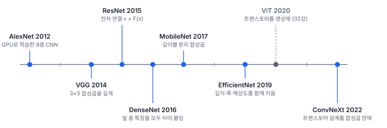
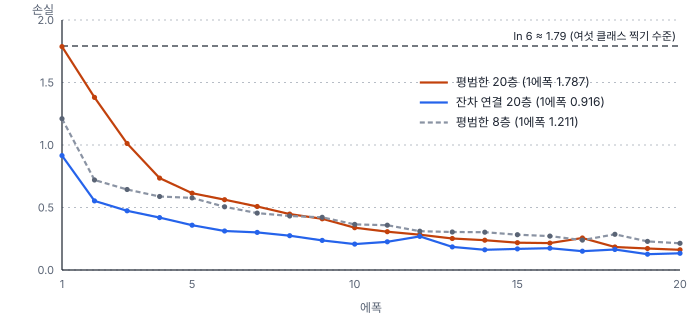
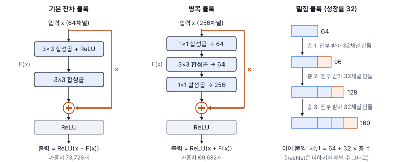

# 31강 백본의 계보

## 이 강에서 얻는 것

- 백본이 무엇이고 헤드와 왜 나누는지 알고, 대표 백본(VGG·ResNet·DenseNet·MobileNet·EfficientNet·ConvNeXt)의 핵심 아이디어를 한 줄로 말할 수 있음
- 잔차 연결이 깊은 망의 학습을 어떻게 살리는지 식과 실험 수치로 설명할 수 있음
- 파라미터 수·연산량·정확도를 구분해 백본을 고르고, 사전학습 가중치를 쓰는 이유와 다중분광 영상에서의 걸림돌을 알 수 있음

## 1. 백본이란

**백본(backbone)**은 입력 영상에서 특징 맵을 뽑는 몸통 부분임. 그 위에 태스크마다 다른 **헤드(head)**를 얹음. 분류라면 전역 평균 풀링과 선형 층, 탐지라면 박스와 클래스를 내는 층임. 27강에서 소개한 VD-CNN으로 보면 합성곱 3층이 백본이고, 전역 평균 풀링 뒤 선형 층 64→6이 헤드임(파라미터 24,342개 중 390개). 몸통을 따로 두면 같은 백본을 분류·탐지·분할에 돌려 쓰고 백본만 바꿔 끼워 비교할 수 있음(사이에 들어가는 넥은 33강).

대표 백본은 대부분 ImageNet(1,000클래스, 학습 영상 약 128만 장) 분류에서 나왔고, 흐름은 "깊게 → 깊어도 학습되게 → 가볍고 고르게 → 트랜스포머에게 배움" 순임.



## 2. VGG: 3×3을 깊게 쌓음

**VGG**(시모냔·지서먼, 2014년 공개)는 커널을 모두 3×3으로 통일하고 층을 16~19개로 깊게 쌓았음. 3×3 두 층을 쌓으면 수용영역(30강)이 5×5, 세 층이면 7×7이 됨. 입출력 채널이 $C$일 때 7×7 한 층의 가중치는 $49C^2$, 3×3 세 층은 $27C^2$로 약 55%이고, 비선형 함수도 두 번 더 들어가 적은 가중치로 더 복잡한 모양을 표현함.

VGG-16은 합성곱 13층과 완전연결층(27강의 선형 층) 3층임. 파라미터 1억 3,836만 개 가운데 **89%인 1억 2,364만 개가 끝의 완전연결층**에 있음. 마지막 특징 맵 7×7×512를 4,096개 뉴런에 잇는 첫 완전연결층만 1억 276만 개임. 뒤의 백본들은 이를 전역 평균 풀링으로 바꿔 크게 줄였음.

## 3. ResNet: 잔차 연결

VGG보다 더 깊게 쌓으면 과적합이 아닌데도 **학습 오차부터** 나빠졌음. **ResNet**(잔차 신경망, 허 등, 2015년 공개, 그해 ImageNet 분류 우승)은 몇 층짜리 블록의 출력에 입력을 그대로 더하는 **잔차 연결(residual connection)**로 이를 풀었음.

$$\mathbf{y} = \mathbf{x} + F(\mathbf{x})$$

$F$는 블록 안 합성곱 층들이 계산하는 함수임. 블록은 출력 전체가 아니라 입력에서 **얼마나 바꿀지(잔차)**만 배우면 되고, 바꿀 게 없으면 $F$를 0 가까이 두면 됨. 역전파(28강)에서 덧셈 부분만 보면 $\partial \mathbf{y}/\partial \mathbf{x} = 1 + \partial F/\partial \mathbf{x}$라서, 합성곱 층을 거치며 기울기가 작아져도 "1"의 몫이 **지름길(shortcut)**을 타고 앞 층까지 그대로 전달됨. 입출력 모양이 다르면 지름길에 1×1 합성곱을 넣음. 원 논문은 배치 정규화를 써서 기울기 크기가 정상인 망에서도 이 성능 저하가 생긴다며, 기울기 소실 때문은 아닐 것이고 깊은 망의 최적화 자체가 어려워지는 문제라고 봤음. 다만 정규화 없는 망에서는 기울기 소실도 뚜렷함.

5부 타일 자료로 정규화 없는 3×3 합성곱 망(폭 16채널)을 비교했음. 평범한 8층, 평범한 20층, 두 층마다 지름길을 둔 잔차 20층을 Adam(학습률 0.001)으로 20에폭 학습함(28강에서 기울기를 잰 망과 같은 구조. last는 20에폭 끝, best는 검증 손실이 가장 낮았던 에폭의 모델).

| 망 | 파라미터 | 1에폭 학습 손실 | 20에폭 학습 손실 | 시험 정확도 last | best (에폭) |
|---|---|---|---|---|---|
| 평범한 8층 | 16,934 | 1.211 | 0.214 | 0.918 | 0.941 (19) |
| 평범한 20층 | 44,774 | 1.787 | 0.162 | 0.946 | 0.946 (19) |
| 잔차 20층 | 44,774 | 0.916 | 0.133 | 0.942 | 0.967 (19) |



평범한 20층의 첫 에폭 손실 1.787은 여섯 클래스를 같은 확률로 찍을 때의 교차 엔트로피 $\ln 6 \approx 1.792$와 거의 같고, 학습 정확도도 0.173으로 찍기 수준(1/6)임. 28강에서 학습 전에 잰 대로, 이 망의 입력 쪽 첫 층 기울기는 출력 쪽 층의 약 2천만 분의 1이었고(기울기 소실) 잔차 20층은 입력 쪽까지 고르게 전달되었음.

다만 평범한 20층도 결국 따라옴. 4에폭에 0.735로 잔차 20층의 첫 에폭(0.916)보다 낮아졌고, 20에폭 끝 시험 정확도는 오히려 조금 높음(0.946 대 0.942). Adam은 파라미터마다 기울기 크기로 나눠 걸음을 정하므로(28강) 작은 기울기에도 SGD보다 덜 둔감한데, 이것이 따라잡은 이유 중 하나일 수 있음. 그런데 기울기가 분모의 작은 상수 $\epsilon$(PyTorch 기본 $10^{-8}$)보다 훨씬 작은 입력 쪽 층에서는 이 효과도 약해지므로 단정할 수 없음(따로 확인하지 않음). 이 실험에서 잔차 연결의 차이는 "학습이 되느냐"보다 **출발이 몇 에폭 빠르냐**에 가깝고, 검증 손실이 가장 낮던 모델로는 잔차 20층이 0.967로 앞섬. 한 번 돌린 결과라 0.01 안팎의 차이는 시드에 따라 뒤집힐 수 있음.



ResNet-50 이상은 **병목 블록(bottleneck block)**을 씀. 256채널을 1×1 합성곱으로 64채널로 줄여 3×3을 계산하고 다시 1×1로 256채널로 늘림. 가중치가 $256 \times 64 + 9 \times 64^2 + 64 \times 256 = 69{,}632$개로, 64채널 기본 블록(3×3 두 층, $2 \times 9 \times 64^2 = 73{,}728$개)과 비슷한 비용으로 네 배 넓은 채널을 다룸.

## 4. DenseNet, MobileNet, EfficientNet

**DenseNet**(밀집 연결 합성곱 신경망, 황 등, 2016년 공개)은 한 블록 안에서 각 층이 **앞 층들의 특징 맵을 모두 이어 붙인 것(concatenate)**을 입력으로 받음. 층마다 새로 만드는 채널 수를 성장률이라 하며, DenseNet-121은 32임. 첫 블록은 64채널로 시작해 6층을 지나면 $64 + 6 \times 32 = 256$채널이 됨. 특징을 재사용해 파라미터는 798만 개로 적지만, 이어 붙인 특징 맵을 모두 들고 있어 학습 메모리를 많이 씀.

**MobileNet**(하워드 등, 2017년 공개)은 30강의 깊이별 분리 합성곱으로 연산량을 크게 줄인 모바일·엣지 장비용 백본임. V2(2018)는 채널을 넓혔다 다시 좁히는 역잔차 블록을, V3(2019)는 자동 구조 탐색을 더했음. MobileNetV2는 파라미터 350만 개, 연산량(곱셈-누산 횟수, MAC, 30강) 0.30 G(G는 10억, 곧 3억 회)임.

**EfficientNet**(탄·레, 2019년 공개)은 망을 키울 때 깊이·폭(채널 수)·입력 해상도를 정해진 비율로 **함께** 키우는 **복합 스케일링(compound scaling)**을 제안했음. 계수 $\phi$ 하나로 세 가지를 동시에 정함.

$$\text{깊이} \propto 1.2^{\phi}, \quad \text{폭} \propto 1.1^{\phi}, \quad \text{해상도} \propto 1.15^{\phi}$$

연산량은 대략 깊이에 비례하고 폭과 해상도에는 제곱으로 비례함. $1.2 \times 1.1^2 \times 1.15^2 \approx 1.92$라서 $\phi$가 1 늘 때 연산량이 약 두 배가 되게 맞춘 것임. 기준 모델 B0(입력 224)에서 $\phi$를 늘려 키운 것이 B1~B7임. 다만 실제 공개 모델의 배율은 식 값과 꼭 같지 않음(예: B3은 깊이 1.4배·폭 1.2배·입력 300).

## 5. ConvNeXt, 그리고 숫자로 고르기

2020년 이후 비전 트랜스포머(ViT·Swin, 32강)가 합성곱 망을 앞서자, **ConvNeXt**(류 등, 2022년 공개)는 ResNet-50을 출발점으로 트랜스포머의 설계를 하나씩 들여왔음. 4×4 칸을 겹치지 않게 자르는 첫 층(ViT의 패치 임베딩과 같은 방식, 32강), 7×7 깊이별 합성곱, 채널을 네 배로 넓혔다 줄이는 역병목, ReLU 대신 GELU(27강), 배치 정규화 대신 레이어 정규화(29강) 등임. 학습법(AdamW·강한 증강 등)도 트랜스포머 쪽을 따랐음. 어텐션 없이도 비슷한 크기의 Swin-T와 같거나 조금 나은 정확도를 내, 트랜스포머의 강점 상당 부분이 어텐션보다 설계와 학습법에서 왔을 수 있음을 보여 줌.

| 백본 | 공개 | 파라미터 | 연산량(GMAC) | ImageNet top-1(%) |
|---|---|---|---|---|
| VGG-16 | 2014 | 1억 3,836만 | 15.5 | 71.6 |
| ResNet-18 | 2015 | 1,169만 | 1.8 | 69.8 |
| ResNet-50 | 2015 | 2,556만 | 4.1 | 76.1 / 80.9 |
| DenseNet-121 | 2016 | 798만 | 2.8 | 74.4 |
| MobileNetV2 | 2018 | 350만 | 0.30 | 71.9 |
| EfficientNet-B0 | 2019 | 529만 | 0.39 | 77.7 |
| EfficientNet-B3 | 2019 | 1,223만 | 1.8 | 82.0 |
| ConvNeXt-T | 2022 | 2,859만 | 4.5 | 82.5 |

파라미터는 torchvision 0.29로 구조만 만들어 센 값이고, 연산량은 224×224(B3는 300×300) 한 장 기준, 정확도는 torchvision 가중치 설명의 ImageNet 검증 top-1(1순위 예측이 맞은 비율)임(Swin-T는 2,829만·81.5%). 세 숫자는 따로 움직임. VGG-16은 파라미터가 EfficientNet-B0의 26배인데 정확도는 6%p 낮음. ResNet-50의 두 값은 **같은 구조**를 다른 학습법으로 학습한 결과라, 정확도에는 구조만큼 학습법이 섞여 있음. 실제 속도(지연시간)는 30강의 깊이별 합성곱처럼 연산량만큼 줄지 않는 경우가 많아 장비에서 재야 함(50강).

## 6. 사전학습 가중치

**사전학습 가중치(pretrained weights)**는 ImageNet 같은 큰 자료로 미리 학습해 둔 가중치임. 앞쪽 층이 배운 가장자리·질감 같은 특징은 영상 종류가 달라도 쓸모가 있어, 무작위 가중치보다 적은 라벨로 빨리, 대개 더 잘 수렴함. 5부 타일 자료의 학습 타일 4,200개는 ImageNet의 300분의 1 수준임.

```python
import torch.nn as nn
import torchvision.models as M
m = M.resnet18(weights=M.ResNet18_Weights.IMAGENET1K_V1)  # 사전학습 가중치로 시작
m.fc = nn.Linear(m.fc.in_features, 6)                     # 헤드만 6클래스로 교체(512→6)
```

`weights=None`이면 무작위 가중치임. 걸림돌도 있음. 이 가중치는 RGB 3밴드용이라 첫 층 `m.conv1`의 입력 채널이 3개로 고정되어 B2·B3·B4·B8 네 밴드를 그대로 넣을 수 없음. B2·B3·B4는 청·녹·적 순이라 RGB 순서와도 반대이고, 입력 표준화 값도 반사율과 다름. 이 문제와 미세조정 방법은 48강에서 다룸.

## 현장에서는

32×32 화소 Sentinel-2 타일로 토지피복 분류기를 만드는데, 표에서 정확도가 가장 높은 ConvNeXt-T를 쓰자는 의견이 나온 상황임. 점검할 것이 세 가지임.

첫째, 이 백본들은 입력을 단계적으로 줄여(ResNet은 절반씩 다섯 번, ConvNeXt는 첫 층에서 1/4로 줄인 뒤 절반씩 세 번) 마지막 특징 맵이 입력의 1/32임. 32×32 타일은 ResNet-18 몸통을 지나면 1×1이 되어, 분류는 되더라도 분할이나 작은 객체 탐지에는 쓰기 어려움. 타일을 키우거나(43강) 줄이는 단계를 조정함. 둘째, 학습 타일 4,200개에 파라미터 2,859만 개는 과적합 위험이 커서 사전학습 가중치와 규제가 전제임. 셋째, 네 밴드 입력은 6절의 첫 층 문제부터 풀어야 함. 그래서 ResNet-18을 기준선으로 먼저 돌리고, 같은 분할·학습법에서 백본만 바꿔 비교함.

## 헷갈리는 쌍

- **백본 vs 전체 모델**: 백본은 특징을 뽑는 몸통이고, 전체 모델은 여기에 넥·헤드를 더한 것임. 분류용 ResNet-50은 2,556만 개지만 이를 백본으로 쓰는 탐지기 Faster R-CNN은 약 4,181만 개임(33강).
- **잔차 연결 vs 밀집 연결**: 잔차 연결은 입력을 **더해서** 채널 수가 그대로이고, 밀집 연결은 앞 층 특징을 **이어 붙여서** 채널 수가 층마다 늘어남.
- **파라미터 수 vs 연산량·지연시간**: 파라미터는 저장 크기, 연산량은 한 장당 계산량, 지연시간은 특정 장비에서 잰 실제 시간임. VGG-16 대 ResNet-50은 파라미터 5.4배, 연산량 3.8배로 비율부터 다름.

## 이렇게 지시받음

> 지시: "학습 손실이 첫 에폭에 1.79에서 안 내려가. 망 깊이랑 층별 기울기부터 찍어 봐."

1.79는 여섯 클래스 균등 예측의 손실 $\ln 6$이라 아직 아무것도 못 배웠다는 뜻임. 정규화 없이 깊게 쌓은 망이면 층별 기울기 크기로 소실 여부를 확인하고, 잔차 연결이나 정규화 층(29강)을 넣음.

> 지시: "백본 ResNet-50으로 바꿔서 돌려 봐. 헤드는 그대로 두고."

헤드 구조는 두되 입력 차원은 새 백본에 맞추라는 뜻임. ResNet-50 몸통 출력은 2,048채널이라 선형 층을 64→6에서 2,048→6으로 바꿈. 사전학습 가중치를 쓰는지, 네 밴드 입력을 어떻게 처리했는지도 비교 조건으로 적음.

> 지시: "현장 노트북에서 돌릴 거라 MobileNet 계열로 가. 연산량 말고 실제 추론 시간으로 보고해."

연산량이 작아도 장비에 따라 속도가 다르므로, 대상 노트북에서 같은 타일·배치 크기로 지연시간을 재어 ResNet-18 기준선과 함께 보고함.

## 요약

- 백본은 특징을 뽑는 몸통이고 태스크별 헤드와 분리해 돌려 씀
- VGG는 3×3을 깊게 쌓았고 파라미터의 89%가 끝의 완전연결층임. ResNet은 잔차 연결 $\mathbf{y} = \mathbf{x} + F(\mathbf{x})$로 기울기가 지름길로 흐르게 함
- 정규화 없는 평범한 20층은 첫 에폭 손실이 $\ln 6$ 수준(1.787), 잔차 20층은 0.916이었음. 평범한 20층도 몇 에폭 뒤 따라옴
- DenseNet은 앞 층 특징을 이어 붙이고, MobileNet은 깊이별 분리 합성곱으로 가볍게, EfficientNet은 깊이·폭·해상도를 함께 키우고, ConvNeXt는 트랜스포머 설계를 들여옴
- 파라미터 수·연산량·정확도·지연시간은 따로 움직임. 사전학습 가중치는 적은 라벨에 유리하지만 RGB 3밴드용임(48강)

## 핵심 용어

| 한글 | 영문 |
|---|---|
| 백본 / 헤드 | Backbone / Head |
| VGG 네트워크 | VGGNet (VGG) |
| 잔차 신경망 | Residual Network (ResNet) |
| 잔차 연결 / 지름길 | Residual Connection / Shortcut |
| 병목 블록 | Bottleneck Block |
| 밀집 연결 합성곱 신경망 | Densely Connected Convolutional Network (DenseNet) |
| 모바일넷 | MobileNet |
| 복합 스케일링 | Compound Scaling |
| 컨브넥스트 | ConvNeXt |
| 사전학습 가중치 | Pretrained Weights |
