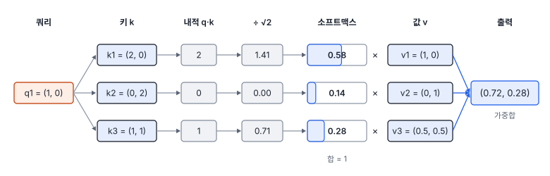
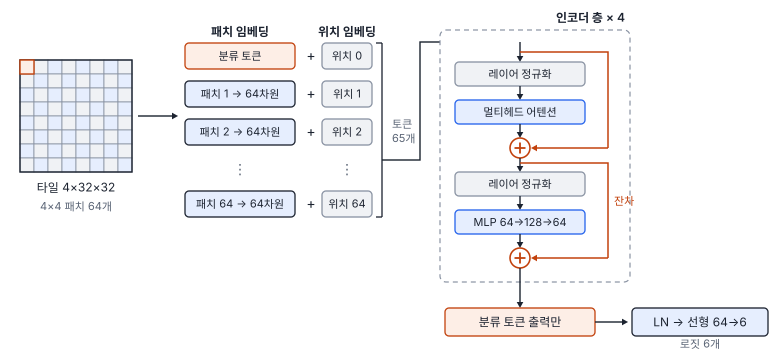
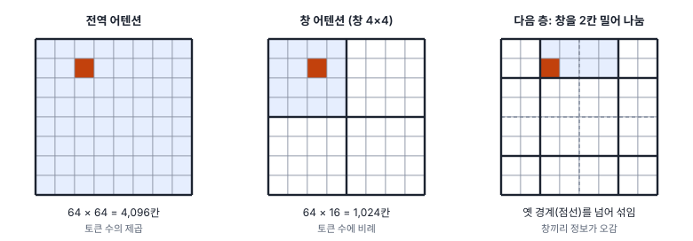

# 32강 어텐션과 비전 트랜스포머

## 이 강에서 얻는 것

- 셀프 어텐션을 쿼리·키·값으로 손으로 계산하고, $\sqrt{d}$로 나누는 이유와 멀티헤드로 나누는 방식을 설명할 수 있음
- 비전 트랜스포머가 영상을 패치 토큰으로 바꿔 인코더 층에 넣는 과정과 위치 인코딩의 역할을 말할 수 있음
- 합성곱 망과 비교한 귀납 편향·연산 복잡도의 차이를 알고, 자료·영상 크기에 따라 ViT·스윈 트랜스포머·합성곱 망 중에서 고를 수 있음

## 1. 셀프 어텐션: 쿼리, 키, 값

합성곱은 이웃만 봄. 27강의 VD-CNN도 마지막 합성곱의 한 칸이 18×18화소를 봄(30강). **셀프 어텐션(self-attention)**은 입력의 모든 조각이 첫 층부터 서로 전부를 봄. 조각 하나를 나타내는 벡터를 **토큰(token)**이라 부르며, 영상에서는 대개 패치(작은 칸) 하나가 토큰 하나임(4절).

토큰 벡터 $x$마다 학습하는 행렬 세 개를 곱해 벡터 세 개를 만듦. **쿼리(query)** $q = W_Q x$는 "내가 찾는 것", **키(key)** $k = W_K x$는 "나를 찾을 때 맞춰 볼 표지", **값(value)** $v = W_V x$는 "뽑혀 갈 때 건네줄 내용"임.

$$\mathrm{Attention}(Q, K, V) = \mathrm{softmax}\!\left(\frac{QK^{\top}}{\sqrt{d}}\right) V$$

말로 풀면 ① 쿼리와 모든 키의 내적으로 유사도를 재고, ② $\sqrt{d}$($d$는 키의 차원)로 나눠 소프트맥스(27강)로 합이 1인 가중치로 바꾸고, ③ 그 가중치로 값들을 가중합함.

토큰 3개, 차원 2인 예로 토큰 1을 따라가 봄. $q_1 = (1, 0)$이고 키는 $k_1 = (2, 0)$, $k_2 = (0, 2)$, $k_3 = (1, 1)$, 값은 $v_1 = (1, 0)$, $v_2 = (0, 1)$, $v_3 = (0.5, 0.5)$임.

- 내적: $q_1 \cdot k_1 = 2$, $q_1 \cdot k_2 = 0$, $q_1 \cdot k_3 = 1$
- $\sqrt{2} \approx 1.414$로 나눔: 1.414, 0, 0.707
- 소프트맥스: $e^{1.414} = 4.113$, $e^{0} = 1$, $e^{0.707} = 2.028$, 합 7.141 → 가중치 0.576, 0.140, 0.284
- 가중합: $0.576\,(1, 0) + 0.140\,(0, 1) + 0.284\,(0.5, 0.5) = (0.718, 0.282)$



토큰 1은 자기와 닮은 키의 값을 많이 가져옴. 토큰 3의 쿼리 $(1, 1)$은 세 키와의 내적이 모두 2라 가중치가 1/3씩, 출력은 $(0.5, 0.5)$임. 가중치가 고정된 커널이 아니라 **입력 내용에 따라 매번 새로 계산**되는 점이 합성곱과 다름. 파이썬으로 확인하면 다음과 같음.

```python
import math, torch
q = torch.tensor([[1., 0.], [0., 1.], [1., 1.]])   # 쿼리 3개(행 = 토큰)
k = torch.tensor([[2., 0.], [0., 2.], [1., 1.]])   # 키
v = torch.tensor([[1., 0.], [0., 1.], [.5, .5]])   # 값
d = q.shape[-1]
w = torch.softmax(q @ k.T / math.sqrt(d), dim=-1)   # 가중치, 행마다 합 1
out = w @ v   # [[0.718, 0.282], [0.282, 0.718], [0.5, 0.5]]
```

$\sqrt{d}$로 나누는 이유는 이러함. 성분이 평균 0·분산 1인 $d$차원 벡터 두 개의 내적은 분산이 $d$, 표준편차가 $\sqrt{d}$임. $d = 64$면 점수가 ±8 정도로 퍼지고, 소프트맥스는 점수 차이에 지수로 반응하므로 가중치가 한 토큰에 몰림. 차원 64, 토큰 65개에서 무작위 쿼리·키로 2,000번 재면 가장 큰 가중치의 평균이 나누지 않을 때 0.79, 나눌 때 0.11임. 몰린 소프트맥스는 기울기가 거의 0이라 학습이 더뎌지므로(28강), 점수 퍼짐을 차원과 상관없이 1 안팎으로 맞춤.

## 2. 멀티헤드 어텐션과 트랜스포머 인코더 층

**멀티헤드 어텐션(MHA, multi-head attention)**은 어텐션을 여러 벌 나란히 함. 차원 64, 헤드 4개면 쿼리·키·값을 16차원씩 네 몫으로 나눠 헤드마다 따로 어텐션을 계산하고($\sqrt{16} = 4$로 나눔), 네 출력을 이어 붙여 64차원으로 되돌린 뒤 출력 행렬 $W_O$(64×64)를 곱함. 한 헤드는 분광이 닮은 패치를, 다른 헤드는 가까운 패치를 보는 식으로 **여러 관점을 나눠 봄**. 차원을 헤드 수로 나누므로 헤드를 늘려도 파라미터 수는 같음.

**트랜스포머(transformer)**는 바스와니 등이 2017년 기계 번역용으로 공개한 구조로, 어텐션과 MLP를 번갈아 쌓음. 영상 모델이 쓰는 인코더 층 하나는 다음과 같음($z$는 토큰들, LN은 레이어 정규화).

$$z' = z + \mathrm{MHA}(\mathrm{LN}(z)), \qquad z'' = z' + \mathrm{MLP}(\mathrm{LN}(z'))$$

레이어 정규화(29강)는 토큰마다 값의 크기를 맞추고, 잔차 연결(31강)은 깊게 쌓아도 기울기가 흐르게 함. MLP는 토큰마다 따로 거는 은닉층 하나짜리 다층 퍼셉트론(27강, 활성화는 주로 GELU)임. 어텐션은 토큰 사이에 정보를 섞고 MLP는 토큰 하나 안에서 가공함. 원래 트랜스포머는 LN을 잔차 덧셈 뒤에 두었고, ViT 등 영상 모델은 대개 이 식처럼 앞에 둠.

## 3. 위치 인코딩

어텐션은 순서를 모름. 토큰 순서를 섞으면 같은 짝끼리 계산되어 출력도 똑같이 섞일 뿐임. 위치 정보를 뺀 이 강의 작은 ViT(4절)에 타일 패치 64개를 뒤섞어 넣으면 분류 출력 차이가 $10^{-7}$ 수준(부동소수점 반올림)으로 같음. 물이 타일 위쪽인지 아래쪽인지 모른다는 뜻임.

그래서 토큰에 자리마다 다른 벡터인 **위치 인코딩(PE, positional encoding)**을 더함. 방식은 두 가지임.

- **학습형**: 자리마다 벡터를 파라미터로 두고 학습함. ViT가 이 방식이며 위치 임베딩이라고도 부름. 이 강의 작은 ViT는 65자리 × 64차원 = 4,160개임
- **사인형**: 원래 트랜스포머의 방식으로, 자리 $p$마다 주기가 다른 사인·코사인 값을 정해 둠(학습하지 않음, $i$는 차원 번호의 절반)

$$PE_{(p,\,2i)} = \sin\frac{p}{10000^{2i/d}}, \qquad PE_{(p,\,2i+1)} = \cos\frac{p}{10000^{2i/d}}$$

앞 차원은 빨리, 뒤 차원은 천천히 변해 초침·분침·시침처럼 자리를 구분함. 스윈 트랜스포머(6절)는 위치를 더하는 대신 창 안 두 토큰의 상대 위치에 따른 편향을 어텐션 점수에 더함.

## 4. 비전 트랜스포머: 영상을 패치로

**비전 트랜스포머(ViT, vision transformer)**(도소비츠키 등, 2020년 공개)는 영상을 겹치지 않는 패치로 잘라 문장의 단어처럼 다룸. 224×224 RGB 영상을 16×16 패치로 자르면 $14 \times 14 = 196$개이고, 패치 하나는 $16 \times 16 \times 3 = 768$개 값임. 이를 모든 패치에 같은 선형 사상을 걸어 $D$차원 토큰으로 바꾸는 것이 **패치 임베딩(patch embedding)**임. 커널 크기와 스트라이드가 모두 패치 크기인 합성곱(30강)과 같은 계산임.

맨 앞에는 **분류 토큰(class token)**이라는 학습 벡터 하나를 붙여 197개로 만들고 위치 임베딩을 더함. 분류 토큰은 어느 패치에도 해당하지 않고 층마다 어텐션으로 모든 패치의 정보를 모으며, 마지막 층에서 이 토큰만 꺼내 선형 층으로 클래스를 냄. ViT-B/16은 차원 768, 인코더 12층, 헤드 12개이고 파라미터가 8,657만 개로 ResNet-50(2,556만, 31강)의 3.4배임(torchvision 0.29로 셈).

이 강의 **작은 ViT**는 5부 타일(4×32×32)을 4×4 패치로 잘라 토큰 64개(패치 하나 40 m × 40 m)에 분류 토큰을 더하고, 차원 64, 인코더 4층, 헤드 4개, MLP 64→128→64로 만들었음. 파라미터는 142,790개로 VD-CNN(24,342)의 약 5.9배임. 인코더 층 하나가 33,472개(어텐션과 MLP가 반씩)라 네 층이 94%를 차지하고, 패치 임베딩은 $4 \times 4 \times 4 \times 64 + 64 = 4{,}160$개임.



## 5. 귀납 편향: 자료가 적으면 불리, 많으면 유연

**귀납 편향(inductive bias)**은 자료를 보기 전에 구조에 넣어 둔 가정임. 합성곱은 "가까운 화소끼리 관련 있음(지역성)"과 "같은 무늬는 어디서나 같은 뜻(가중치 공유)"을 구조로 강제함(30강). ViT에는 패치로 자르는 것 말고는 이런 가정이 거의 없어, 이웃이 중요하다는 사실도 자료에서 배워야 함. 가정이 맞으면 합성곱이 적은 자료로 빨리 배우고, 가정 밖의 관계(멀리 떨어진 패치 사이 등)는 ViT가 더 자유롭게 배움.

작은 ViT는 AdamW(학습률 0.001, 감쇠 0.05, 28강)로, VD-CNN은 기본 설정(Adam 0.001)으로 학습했음. 1,000개 실험은 학습 타일에서 무작위로 1,000개만 뽑아 60에폭 학습함.

| 모델 | 학습 타일 | 에폭 | 학습 정확도 | 시험 정확도 last | best (에폭) |
|---|---|---|---|---|---|
| VD-CNN | 4,200 | 30 | 0.966 | 0.941 | 0.974 (27) |
| 작은 ViT | 4,200 | 30 | 0.992 | 0.962 | 0.961 (18) |
| 작은 ViT, 위치 임베딩 없음 | 4,200 | 30 | 0.985 | 0.964 | 0.961 (29) |
| VD-CNN | 1,000 | 60 | 0.982 | 0.963 | 0.961 (55) |
| 작은 ViT | 1,000 | 60 | 1.000 | 0.926 | 0.917 (39) |

last는 마지막 에폭, best는 검증 손실이 가장 낮았던 에폭의 모델이고 학습 정확도는 마지막 에폭 값임.

- **전체 자료에서는 비슷함.** ViT 0.962(last)·0.961(best)은 VD-CNN 0.941·0.974 사이이고, 시드 하나의 결과라 우열로 읽지 않음. ViT는 학습 정확도 0.992로 더 외웠고 학습 시간은 약 세 배였음
- **자료를 1,000개로 줄이면 벌어짐.** ViT는 학습 자료를 100% 맞히면서 시험은 0.926(last)으로 떨어졌고, VD-CNN은 0.963을 지킴. 귀납 편향이 적은 모델이 적은 자료에서 외우는 쪽으로 감. ViT 원 논문도 ImageNet(약 128만 장)만으로는 비슷한 크기의 ResNet보다 못했고, 약 1,400만 장(ImageNet-21k)으로 사전학습하면 비슷해졌으며 3억 장(JFT-300M)에서 앞섰음
- **위치 임베딩을 빼도 0.964로 거의 같음.** 이 자료의 타일 분류는 "타일 안에 무엇이 있나(질감·분광)"만으로 풀려 패치 배치가 필요 없었다는 뜻임. 이 자료에 한정한 결과이며, 위치가 곧 답인 탐지·분할에서는 빼면 곤란함

## 6. 연산 복잡도와 스윈 트랜스포머

전역 어텐션은 어텐션 행렬이 $N \times N$칸($N$은 토큰 수)이라 계산과 메모리가 **토큰 수의 제곱**으로 늘어남. 224×224를 16×16 패치로 자르면 196개라 38,416칸이지만, 원격탐사에서 흔한 1,024×1,024 타일을 같은 패치로 자르면 $64 \times 64 = 4{,}096$개, 행렬은 16,777,216칸(약 1,677만)임. 토큰은 21배인데 칸은 437배임. 32비트 실수로 영상 한 장, 한 헤드에 약 67 MB이고 ViT-B처럼 헤드가 12개면 한 층에 약 0.8 GB임. 행렬을 통째로 저장하지 않는 구현도 있지만 계산량은 여전히 제곱임.

**스윈 트랜스포머(Swin Transformer)**(류 등, 2021년 공개)는 세 가지로 이를 풂.

- **창 어텐션**: 토큰을 7×7(49개) 창으로 나누고 창 안에서만 어텐션함. 토큰 하나가 보는 상대가 49개로 고정이라 계산이 토큰 수에 비례함. 같은 4,096토큰이면 대략 $4{,}096 \times 49 \approx 20$만 칸으로 전역의 84분의 1임
- **밀린 창**: 다음 층은 창 경계를 창 절반(3토큰)만큼 밀어 나눔. 앞 층에서 다른 창이던 토큰이 같은 창에 들어가 정보가 옆 창으로 퍼짐
- **계층적 특징 맵**: 단계 사이마다 이웃 2×2 토큰을 합쳐 해상도를 절반, 채널을 두 배로 함. Swin-T는 224 입력에서 56×56×96 → 28×28×192 → 14×14×384 → 7×7×768로, ResNet처럼 1/4~1/32 특징 맵을 내서 탐지·분할 모델의 백본으로 그대로 끼움(33강)



Swin-T는 파라미터 2,829만 개로 ResNet-50(2,556만)과 비슷함. 창 안만 보는 것은 합성곱의 지역성과 닮아, Swin은 합성곱의 귀납 편향 일부를 되돌려 넣은 셈임. 거꾸로 31강의 ConvNeXt는 트랜스포머의 설계를 합성곱 망에 들여와 Swin-T와 비슷한 정확도를 냈음. 두 계열은 서로의 장점을 가져오며 닮아 가는 중임.

## 현장에서는

0.5 m 항공 정사영상을 1,024×1,024 타일로 잘라 건물을 분할하는 과제에서 ViT-B/16 백본을 쓰자는 의견이 나옴. 점검할 것은 세 가지임.

첫째, 토큰 4,096개의 전역 어텐션이라 메모리가 크게 늘어남(6절). 둘째, ViT 출력은 1/16 해상도(8 m) 한 장뿐이라 건물 경계를 되살리기 어렵고 분할 모델이 쓰는 여러 해상도 특징 맵(33강)이 없음. 셋째, 라벨 타일이 2천 장 남짓이면 귀납 편향이 적은 모델이 불리해(5절) 사전학습 가중치(48강)가 전제임. 그래서 사전학습된 Swin-T를 같은 분할 구조·학습법에서 ResNet-50 백본과 나란히 비교함.

## 헷갈리는 쌍

- **패치 크기 vs 토큰 수**: 패치 한 변을 절반으로 줄이면 토큰은 4배, 전역 어텐션 행렬은 16배가 됨. 작은 패치는 세밀하지만 비싸고, 큰 패치는 싸지만 작은 객체가 한 토큰 안에 묻힘.
- **위치 인코딩 vs 패치 임베딩**: 패치 임베딩은 패치의 **내용**(화소값)을, 위치 인코딩은 그 패치가 **어디에** 있었는지를 벡터로 나타냄. 둘을 더한 것이 인코더의 입력임.

## 이렇게 지시받음

> 지시: "1024 타일에 ViT 넣으니까 메모리 터져. 패치 키우지 말고 스윈 백본으로 바꿔 봐."

토큰 4,096개의 어텐션 행렬이 제곱으로 커진 것이 원인임. 패치를 32로 키우면 토큰은 1,024개로 줄지만 32×32화소 안의 작은 건물이 묻히므로, 계산이 토큰 수에 비례하는 Swin으로 바꾸라는 뜻임. 백본 출력이 여러 해상도로 바뀌므로 넥·헤드 입력 채널도 맞춤(33강).

> 지시: "라벨 1,500장인데 ViT 처음부터 학습하지 마. CNN 기준선부터 돌리고, ViT는 사전학습 가중치로 비교해."

귀납 편향이 적은 ViT는 적은 자료에서 외우기 쉬워, 무작위 가중치로 시작하면 구조가 아니라 자료 부족을 비교하게 된다는 뜻임. 같은 분할에서 학습·검증 정확도 차이를 함께 보고함.

## 요약

- 셀프 어텐션은 쿼리와 모든 키의 내적 → $\sqrt{d}$로 나눈 소프트맥스 가중치 → 값의 가중합이며, 가중치가 입력 내용에 따라 매번 계산됨. $\sqrt{d}$로 나눠 소프트맥스가 한 토큰에 몰리지 않게 함
- 멀티헤드 어텐션은 차원을 헤드 수로 나눠 여러 관점으로 봄. 인코더 층은 레이어 정규화·어텐션·MLP·잔차 연결로 됨
- 어텐션은 순서를 모르므로 학습형 또는 사인형 위치 인코딩을 더함(이 강의 타일 분류는 빼도 거의 같았음)
- ViT는 패치 임베딩과 분류 토큰으로 영상을 토큰열로 바꿈. 귀납 편향이 적어 전체 자료에서는 VD-CNN과 비슷했지만 1,000개에서는 0.926 대 0.963(last)으로 뒤짐
- 전역 어텐션은 토큰 수의 제곱으로 비싸서 창 어텐션·밀린 창·계층적 특징 맵을 쓴 Swin이 큰 영상과 탐지·분할 백본에 쓰임

## 핵심 용어

| 한글 | 영문 |
|---|---|
| 셀프 어텐션 | Self-Attention |
| 토큰 | Token |
| 쿼리 / 키 / 값 | Query / Key / Value |
| 멀티헤드 어텐션 | Multi-Head Attention (MHA) |
| 트랜스포머 | Transformer |
| 위치 인코딩 | Positional Encoding (PE) |
| 비전 트랜스포머 | Vision Transformer (ViT) |
| 패치 임베딩 | Patch Embedding |
| 분류 토큰 | Class Token |
| 스윈 트랜스포머 | Swin Transformer (Swin) |
| 귀납 편향 | Inductive Bias |
