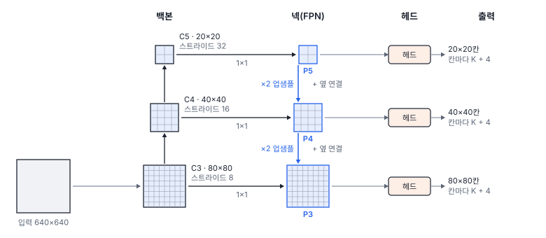
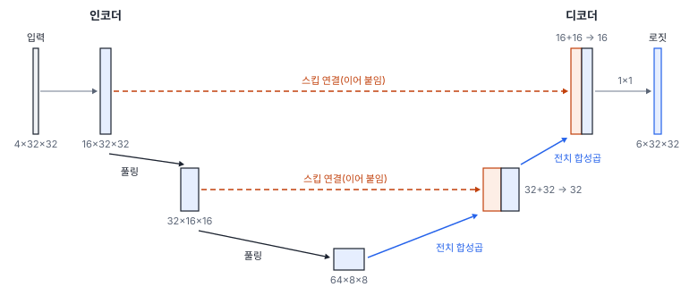
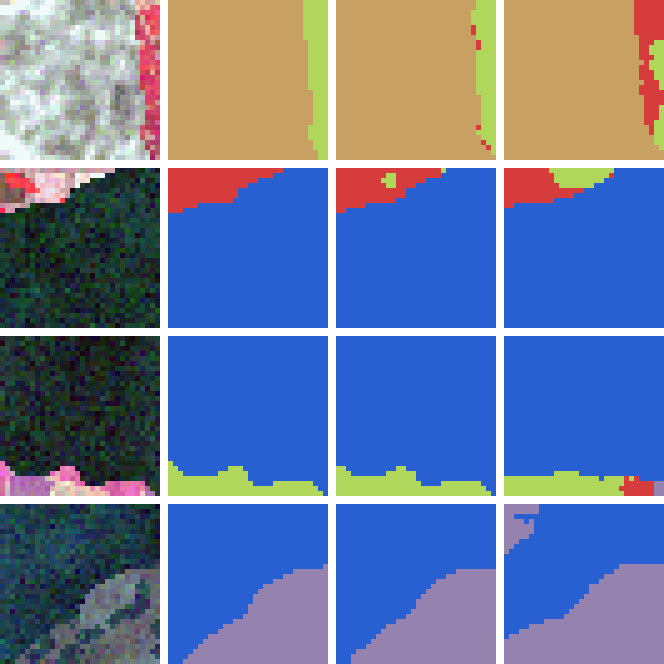

# 33강 탐지·분할 모델의 구조

## 이 강에서 얻는 것

- 탐지·분할 모델을 백본·넥·헤드로 나눠 읽고, 특징 피라미드 네트워크가 여러 해상도를 합치는 방식과 작은 객체를 고해상도 층이 맡는 이유를 설명할 수 있음
- 2단계 탐지기(Faster R-CNN), 1단계 탐지기(YOLO·RetinaNet·FCOS), DETR이 각각 무엇을 어떤 순서로 출력하는지 구분할 수 있음
- U-Net의 스킵 연결이 경계를 되살리는 것을 실험 수치로 확인하고, 산출물에 맞는 분할 구조(U-Net·Mask R-CNN·SegFormer)를 고를 수 있음

## 1. 백본·넥·헤드: "무엇"에 "어디"를 더함

분류 모델(27~32강)은 타일 하나에 로짓 6개를 냄. **탐지**는 객체마다 박스(좌표 4개)와 클래스·점수를 내야 하고 객체 수가 영상마다 다름. **분할**은 화소마다 클래스를 냄. 둘 다 "무엇"에 "어디"가 붙으므로, 해상도를 1/32까지 줄이며 뜻을 모으는 백본(31·32강)만으로는 모자람. 그래서 세 부분으로 나눠 부름.

- **백본**(31강): 여러 단계의 특징 맵을 뽑는 몸통
- **넥(neck)**: 백본의 여러 해상도 특징 맵을 섞어 헤드에 넘기는 중간 부분. 대표가 2절의 FPN
- **헤드**: 클래스·박스·마스크 같은 최종 출력을 냄

## 2. 특징 피라미드 네트워크

스트라이드 8인 얕은 층은 칸이 촘촘하지만 가장자리·질감 같은 낮은 수준의 특징을, 스트라이드 32인 깊은 층은 "배", "건물" 같은 뜻을 담지만 칸이 굵음. 백본 단계의 출력을 스트라이드 $2^3$·$2^4$·$2^5$ 순으로 C3·C4·C5라 부르며, 640×640 입력이면 80×80·40×40·20×20 격자임.

**특징 피라미드 네트워크(FPN, feature pyramid network)**(린 등, 2016년 공개)는 깊은 층의 뜻을 얕은 층의 해상도로 내려보냄.

1. **위에서 아래로**: C5에 1×1 합성곱(30강)을 걸어 256채널로 줄이고 가로·세로 두 배로 업샘플함(최근접)
2. **옆 연결**: 같은 해상도의 C4에도 1×1 합성곱을 걸어 256채널로 맞춘 뒤 더함
3. 더한 맵을 3×3 합성곱으로 다듬어 P4를 만들고, 더한 맵을 다시 업샘플해 같은 방법으로 P3을 만듦

P3~P5는 모두 깊은 층의 뜻을 물려받은 256채널 특징 맵이고, 층마다 헤드가 붙음.

작은 객체는 고해상도 층이 맡음. 0.5 m 영상의 승용차(약 4.5 m × 1.8 m)는 9×4화소 남짓이라 스트라이드 32의 칸(16 m) 넓이의 3%쯤이고, 붙어 선 차 여러 대가 한 칸에 묻힘. 스트라이드 8의 칸(4 m)은 차 한 대 길이쯤이라 붙은 차들이 여러 칸에 나뉘어 잡힘. 그래서 차량·소형 선박은 P3, 대형 건물·화물선은 P5가 맡음(배정 규칙은 36강).

## 3. 2단계 탐지기와 1단계 탐지기

**2단계 탐지기(two-stage detector)**는 객체가 있을 만한 후보를 먼저 고르고, 후보마다 다시 봄. 대표는 **Faster R-CNN**(런 등, 2015년 공개)임.

1. **영역 제안 네트워크(RPN, region proposal network)**: 칸마다 "객체 있음" 점수와 대략의 박스를 내서 후보를 고름(torchvision 기본값은 추론 때 영상당 1,000개)
2. **RoI 풀링(RoI pooling)**: 후보 박스(관심 영역, RoI)마다 특징 맵의 해당 부분을 잘라 7×7 같은 고정 크기로 줄임
3. **분류·박스 회귀**: 7×7×256을 펼쳐 완전연결층 두 개를 지나, 클래스(배경 포함)와 박스 보정값(얼마나 옮기고 늘릴지)을 냄

RoI 풀링은 후보 좌표를 칸 단위로 반올림하므로(7×7로 나눌 때도 한 번 더), 스트라이드 16이면 경계 좌표만으로도 최대 반 칸(8화소), 0.5 m 영상에서 4 m까지 어긋남. 예를 들어 가로 203~331화소인 후보는 208~336화소를 읽음. **RoIAlign**(Mask R-CNN 논문, 2017년 공개)은 반올림 없이 칸 사이 값을 쌍선형 보간(25강)으로 읽으며, torchvision의 Faster R-CNN도 이것을 씀.

**1단계 탐지기(one-stage detector)**는 후보 고르기 없이 격자 칸마다 클래스 점수와 박스를 바로 냄. YOLO(레드먼 등, 2015년 공개), RetinaNet(린 등, 2017년 공개), 칸에서 박스 네 변까지의 거리를 예측하는 FCOS(톈 등, 2019년 공개)가 대표임. 640 입력에 P3~P5면 $80^2 + 40^2 + 20^2 = 8{,}400$칸이 한 번에 예측하므로 빠름. 대신 칸 대부분이 배경이라 클래스 불균형이 심한데, RetinaNet은 포컬 로스(18강)로 이를 풀어, 원 논문의 COCO(널리 쓰는 탐지 공개 자료) 실험에서 당시 2단계 탐지기와 같거나 높은 정확도를 냈음. 한 객체에 여러 칸이 낸 박스는 점수가 가장 높은 것만 남기는 NMS(비최대 억제, 37강)로 정리함.

넥·헤드도 가볍지 않음. torchvision 0.29의 Faster R-CNN(91클래스 헤드)은 파라미터 4,181만 개 가운데 백본 몸통(분류용 선형 층을 뺀 ResNet-50)이 56%뿐이고, 박스 헤드의 첫 완전연결층(7×7×256 → 1,024)만 1,285만 개임. 같은 백본의 RetinaNet·FCOS는 몸통 비중이 69~73%임.

## 4. 디텍션 트랜스포머: 집합으로 예측

**디텍션 트랜스포머(DETR, detection transformer)**(카리옹 등, 2020년 공개)는 칸마다 예측하지 않음. ResNet-50의 C5 특징 맵을 트랜스포머 인코더(32강)에 넣고, 디코더에는 학습하는 벡터인 **객체 쿼리(object query)**를 100개(원 논문 설정) 넣음. 쿼리마다 클래스("객체 없음" 포함)와 박스 하나를 내므로 출력은 순서 없는 100개짜리 **집합**임.

학습 때는 **헝가리안 매칭(Hungarian matching)**으로 정답과 예측을 1:1로 짝지음. 짝 비용의 합이 가장 작도록 짝을 한꺼번에 정하는 방법이며, 비용은 정답 클래스 확률이 낮을수록, 박스가 멀수록 큼. 쿼리 3개와 선박 2척의 예임.

| 쿼리 | 선박 A 비용 | 선박 B 비용 |
|---|---|---|
| 1 | 0.2 | 0.4 |
| 2 | 0.3 | 1.5 |
| 3 | 1.4 | 1.3 |

선박 A부터 가장 싼 쿼리를 주면 A↔1(0.2), B↔3(1.3)으로 합 1.5임. 헝가리안 매칭은 B↔1(0.4), A↔2(0.3)으로 합 0.7을 찾음. 짝이 없는 쿼리 3은 "객체 없음"이 정답이 됨. 같은 배에 쿼리 두 개가 몰리면 하나는 "객체 없음"을 맞히지 못해 손실을 받으므로, 중복을 스스로 내지 않게 되어 **NMS가 필요 없음**.

초기 DETR의 한계는 둘이었음. 학습이 느려 COCO에서 300~500에폭을 돌렸고(Faster R-CNN의 흔한 설정은 십여~수십 에폭), 어텐션 비용이 토큰 수의 제곱이라(32강) 1/32 특징 맵 한 장만 써서 작은 객체에 약했음. 디포머블 DETR(2020년 공개)은 여러 해상도에서 기준점 주변 몇 곳만 보는 어텐션으로 둘 다 크게 줄였음.

## 5. U-Net: 줄였다가 키우며 경계를 되살림

**유넷(U-Net)**(로네베르거 등, 2015년 공개)은 세포 영상 분할용으로 나온 인코더-디코더 구조임. 인코더는 해상도를 줄이며 뜻을 모으고, 디코더는 전치 합성곱(30강)이나 업샘플로 두 배씩 키우며, 키울 때마다 인코더의 **같은 해상도** 특징 맵을 이어 붙임. 이것이 **스킵 연결(skip connection)**이며(블록 안에서 입력을 더하는 잔차 연결(31강)과 달리 인코더에서 디코더로 건너뛰어 이어 붙임), 줄이며 뭉개진 경계 위치를 얕은 층에서 되찾아 옴.

5부 타일 자료의 화소 라벨로 작은 U-Net(인코더 32 → 16 → 8, 폭 16·32·64)을 스킵 연결이 있을 때와 없을 때(디코더 첫 합성곱의 입력 채널이 절반) 각각 Adam(학습률 0.001)으로 20에폭, 화소마다 교차 엔트로피로 학습했음. **mIoU**는 클래스마다 "예측과 정답이 겹친 화소 수 ÷ 둘 중 하나라도 그 클래스인 화소 수"를 구해 평균낸 값임(40강). 경계 화소는 3×3 이웃에 다른 라벨이 있는 화소(경계 양쪽 한 화소씩)로, 시험 화소의 3.5%임.

| 모델 | 파라미터 | best 에폭 | 화소 정확도 | mIoU | 경계 화소 | 안쪽 화소 | 검증 경계 화소 |
|---|---|---|---|---|---|---|---|
| 스킵 있음 | 117,910 | 15 | 0.980 | 0.960 | 0.756 | 0.988 | 0.729 |
| 스킵 없음 | 106,390 | 20 | 0.956 | 0.918 | 0.675 | 0.967 | 0.680 |

모두 검증 손실이 가장 낮았던 에폭의 모델(best)이고, 마지막 열만 검증 지역 값임.

- **경계는 두 지역 모두 스킵 연결이 앞섬.** 시험 +8.1%p, 검증 +4.9%p이고, 경계에서 멀어질수록 차이가 줄어듦
- **전체 정확도와 mIoU 차이는 조심해서 읽음.** 클래스별 IoU는 수계(0.940 대 0.807)·갯벌(0.935 대 0.825)만 크게 벌어지고 나머지는 0.01 미만임. 스킵 없음이 시험 수계 타일 17장을 절반 넘게 갯벌로 칠한 몫이 큼. 검증 지역에서는 거꾸로 스킵 있음이 갯벌 타일 12장을 수계로 칠해 전체 정확도가 0.968 대 0.972로 뒤집힘. 분광이 비슷한 두 클래스의 혼동이라 스킵 연결의 효과로 보기 어렵고, 시드 하나의 결과임

## 6. Mask R-CNN과 SegFormer

화소마다 클래스만 내는 것이 **의미 분할(semantic segmentation)**(U-Net·SegFormer), 객체마다 따로 마스크를 내는 것이 **인스턴스 분할(instance segmentation)**임. 붙은 건물 두 채가 의미 분할에서는 한 덩어리지만, 인스턴스 분할에서는 둘로 나와 한 채씩 면적을 잴 수 있음(34강).

**마스크 R-CNN(Mask R-CNN)**(허 등, 2017년 공개)은 Faster R-CNN의 후보마다 작은 합성곱 가지를 더 붙여 클래스마다 28×28 마스크를 냄(화소마다 안·밖을 시그모이드로 판정). RoIAlign(3절)으로 마스크 위치 어긋남을 줄였음.

**세그포머(SegFormer)**(셰 등, 2021년 공개)는 의미 분할용 트랜스포머임. 인코더는 Swin(32강)처럼 1/4~1/32 특징 맵을 내는 계층적 트랜스포머이고, 어텐션의 키·값 토큰 수를 줄여 비용을 낮춤. **위치 인코딩이 없는** 대신 MLP 안의 3×3 깊이별 합성곱(30강)으로 위치 정보를 얻어, 학습 때와 다른 크기의 영상에도 위치 인코딩을 보간할 필요가 없음. 디코더는 네 특징 맵을 1/4 해상도로 키워 합치는 가벼운 MLP임.

태스크별 출력 형태는 34강에서 한데 모으고, 정답과 비교해 점수를 매기는 법은 35~40강에서 다룸.

## 현장에서는

0.5 m 위성영상으로 항만의 선박을 탐지하고 부두 창고는 한 채씩 윤곽을 따는 과제에서 구조를 고르며 세 가지를 점검함.

첫째, 10 m 어선은 20화소, 200 m 화물선은 400화소라 P3~P5를 모두 쓰고, 어선은 스트라이드 8에서 2~3칸뿐이라 재현율이 낮으면 스트라이드 4 층을 검토함. 둘째, 부두에 나란히 붙은 배는 NMS가 이웃을 지울 수 있어(37강) NMS 없는 DETR 계열도 후보로 두되, 작은 객체가 많으니 디포머블 DETR처럼 여러 해상도를 쓰는 변형으로 비교함. 셋째, 창고는 한 채씩 면적을 내야 하므로 Mask R-CNN을 씀. 다만 100 m 창고(200화소)는 28×28 마스크 한 칸이 약 7화소(3.6 m)로 늘어나 윤곽이 거칠므로 면적 오차부터 확인함.

## 헷갈리는 쌍

- **1단계 vs 2단계 탐지기**: 2단계는 후보를 고른 뒤 후보마다 다시 보고, 1단계는 칸마다 바로 냄. "2단계는 정밀, 1단계는 빠름"은 경향일 뿐이며 지금은 1단계도 정확도가 비슷한 경우가 많음. 속도는 장비에서 잼(50강).
- **FPN(넥) vs U-Net 디코더**: 둘 다 깊은 층을 업샘플해 얕은 층과 합침. FPN은 여러 해상도(P3~P5)를 모두 헤드에 넘기고 옆 연결을 **더함**. U-Net 디코더는 입력 해상도의 한 장을 내고 인코더 특징을 **이어 붙임**.
- **헝가리안 매칭 vs NMS**: 헝가리안 매칭은 **학습 때** 정답과 예측을 1:1로 짝짓는 절차이고, NMS는 **추론 때** 겹친 예측을 지우는 후처리임. DETR은 매칭으로 학습해 NMS를 쓰지 않음.

## 이렇게 지시받음

> 지시: "소형 선박 놓치는 게 많아. 넥 출력에 스트라이드 4 층 추가해 봐."

스트라이드 4인 C2에서 옆 연결을 받는 P2 층을 넥과 헤드에 더하라는 뜻임. 640 입력이면 160×160 = 25,600칸이 늘어 8,400칸이 34,000칸(약 네 배)이 되므로 메모리와 추론 시간을 함께 재고, 효과는 크기 구간별 재현율로 확인함(39강).

> 지시: "건물 분할 U-Net, 스킵 빼서 가볍게 해 보자는데 경계 정확도 따로 뽑아 봐."

작은 U-Net에서는 스킵을 빼도 파라미터가 10%만 줄고 경계 정확도는 떨어졌음. 경계 화소는 몇 %뿐이라 전체 정확도에 차이가 묻히므로 경계 정확도나 경계 F1(40강)을 따로 봄.

> 지시: "DETR 계열로 바꾸면 NMS 임계값은 안 건드려도 돼. 대신 에폭 넉넉히 잡아."

헝가리안 매칭으로 학습해 중복을 스스로 안 내고, 수렴이 느리니 에폭과 학습률 스케줄(46강)을 늘리라는 뜻임. 쿼리 100개 가운데 무엇을 결과로 남길지 정하는 점수 임계값은 여전히 정해야 함.

## 요약

- 탐지·분할 모델은 백본(특징 추출), 넥(여러 해상도 합치기), 헤드(최종 출력)로 나뉨
- FPN은 깊은 층을 업샘플해 옆 연결로 더하여 모든 해상도에 뜻을 실음. 작은 객체는 고해상도 층(P3)이 맡음
- 2단계(RPN → RoIAlign → 분류·박스 회귀)는 후보마다 다시 보고, 1단계(YOLO·RetinaNet·FCOS)는 칸마다 바로 내며, DETR은 객체 쿼리와 헝가리안 매칭으로 NMS 없이 집합을 냄
- U-Net은 스킵 연결로 경계를 되살림. 작은 U-Net의 경계 화소 정확도가 시험 0.756 대 0.675(best)로 앞섰음
- Mask R-CNN은 후보마다 28×28 마스크를 내는 인스턴스 분할, SegFormer는 위치 인코딩 없는 계층적 트랜스포머와 MLP 디코더의 의미 분할임

## 핵심 용어

| 한글 | 영문 |
|---|---|
| 넥 | Neck |
| 특징 피라미드 네트워크 | Feature Pyramid Network (FPN) |
| 2단계 탐지기 / 1단계 탐지기 | Two-Stage Detector / One-Stage Detector |
| 영역 제안 네트워크 | Region Proposal Network (RPN) |
| RoI 풀링 / RoIAlign | RoI Pooling / RoIAlign |
| 디텍션 트랜스포머 | DEtection TRansformer (DETR) |
| 객체 쿼리 | Object Query |
| 헝가리안 매칭 | Hungarian Matching |
| 유넷 / 스킵 연결 | U-Net / Skip Connection |
| 마스크 R-CNN | Mask R-CNN |
| 세그포머 | SegFormer |
| 의미 분할 / 인스턴스 분할 | Semantic Segmentation / Instance Segmentation |
