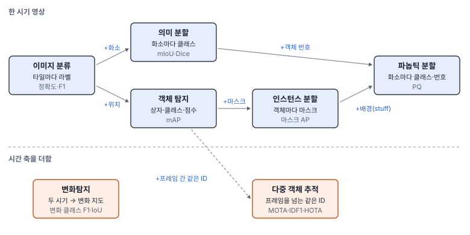

# 34강 비전 태스크 지도

## 이 강에서 얻는 것

- 같은 장면을 놓고 분류·탐지·의미/인스턴스/파놉틱 분할·변화탐지·추적이 각각 무엇을 출력하는지 자료 구조로 구분할 수 있음
- 태스크마다 원격탐사 산출물(점·폴리곤 레이어, 래스터, 변화 지도)과 대표 지표가 무엇인지 짝지을 수 있음
- "보고서에 무엇을 써야 하나"에서 거꾸로 태스크를 고를 수 있음

## 1. 6부의 장면: 항만 타일 24장

6부 내내 같은 가상 자료를 씀. 0.5 m 해상도 항만·연안 영상에서 자른 512×512 화소(256 m) 타일 24장으로, 항만 8장(부두·주차장·계류 선박), 외해 10장(흩어진 배·흰 물결), 마리나 6장(작은 배가 촘촘)임. 클래스는 셋임.

| 클래스 | 개수 | 길이(최소~최대) |
|---|---|---|
| 선박 | 22 | 41~126 m |
| 소형선박 | 311 | 6~20 m |
| 차량 | 901 | 4.0~5.0 m |

1,234개 가운데 1,208개(97.9%)가 COCO(널리 쓰는 탐지 공개 자료) 기준의 **소형 객체**(넓이 32×32화소 미만. 이 자료는 수평 박스 넓이로 잼, 39강)임. 승용차는 9×4화소 안팎이고, 항만 타일 하나에 객체가 최대 166개 들어 있음. 선박은 22척뿐이고 차량은 901대라, 클래스별 점수를 어떻게 평균내느냐에 따라 전체 점수가 달라짐(39강). 이 자료를 넣는 탐지기는 실제 모델이 아니라 평가 방법을 설명하려고 만든 **가상 탐지기**로, 작은 객체일수록 놓치고 위치가 흔들리고 점수가 낮게 나오도록 꾸몄음. 타일을 그대로 넣고 중복 상자를 지우는 클래스별 NMS(IoU 0.5, 37강)를 거친 출력을 6부의 **기본 탐지 결과**라 부르며, 그 mAP50(탐지 성능을 0~1로 요약한 값, 이미지당 상위 100개로 평가)은 0.645임(39강).


## 2. 분류와 탐지

**이미지 분류(image classification)**는 타일 한 장에 라벨을 붙임. 라벨 하나를 고르면 단일 라벨("항만")로 클래스 점수 벡터에 소프트맥스(27강)를 쓰고, 여러 라벨이 동시에 참일 수 있으면 **다중 라벨(multi-label)**("선박 있음, 차량 있음")로 클래스마다 시그모이드(12강)를 따로 씀. 개수와 위치는 나오지 않음. 원격탐사에서는 타일 격자마다 값이 하나인 래스터(구름 타일 지도, 토지피복 격자)가 됨.

**객체 탐지(object detection)**는 객체마다 상자·클래스·점수를 냄. 점수는 확신의 정도라서, 몇 점 이상을 결과로 남길지(운영점)는 따로 정함(38강). 출력은 길이가 영상마다 다른 목록이고, 우리 자료는 한 타일에 차량만 100대가 넘는 경우가 5장이라 출력 개수 상한(39강)도 신경 써야 함. 상자는 영상 축에 맞춘 수평 박스(HBB)가 기본이고, 기울어진 배를 꼭 맞게 감싸는 회전 박스(OBB)는 41강에서 다룸. 지도 좌표로 바꾸면 상자 중심은 **점 레이어**, 상자는 **폴리곤 레이어**가 되어 개수·밀도·핫스팟 분석에 바로 들어감.

## 3. 분할 세 가지

**의미 분할(semantic segmentation)**은 화소마다 클래스를 냄. 출력은 영상과 같은 크기의 정수 배열, 즉 토지피복도와 같은 꼴의 래스터임. **같은 클래스의 객체를 구분하지 않으므로** 클래스별 총면적은 바로 나오지만 "몇 대"는 나오지 않음.

**인스턴스 분할(instance segmentation)**은 객체마다 마스크·클래스·점수를 냄. 탐지 목록의 상자 자리에 마스크가 들어간 꼴이라, 객체마다 면적·모양을 잴 수 있음.

**파놉틱 분할(panoptic segmentation)**은 둘을 한 장에 합침. 셀 수 있는 사물(**things**: 선박·차량)은 객체마다 번호를 주고, 셀 수 없는 배경(**stuff**: 바다·땅)은 클래스만 줌. 화소마다 (클래스, 객체 번호) 두 값이 붙고, 한 화소는 객체 하나에만 속함. 인스턴스 분할의 마스크는 서로 겹칠 수 있다는 점이 다름.

분할 결과를 GIS에 넣을 때는 래스터 그대로 쓰거나 경계를 따라 폴리곤으로 바꿈(폴리곤화, 50강).

```python
label = "항만"                          # 분류: 타일당 라벨 하나
dets = [(x1, y1, x2, y2, cls, score)]   # 탐지: 객체마다 한 줄, 길이가 영상마다 다름
sem = np.zeros((512, 512), np.uint8)    # 의미 분할: 화소마다 클래스
inst = [(mask, cls, score)]             # 인스턴스 분할: 객체마다 512×512 참·거짓 마스크
pan = np.zeros((512, 512, 2), np.int32) # 파놉틱: 화소마다 (클래스, 객체 번호)
```

## 4. 시간이 들어간 태스크

**변화탐지(change detection)**는 같은 곳을 두 시기에 찍은 영상을 받아 달라진 곳을 냄. 화소마다 변화·무변화만 내면 **이진 변화탐지**, "바다 → 매립지"처럼 무엇에서 무엇으로 바뀌었는지까지 내면 **의미 변화탐지**임. 출력은 화소 단위의 **변화 지도**(래스터)이거나 새로 생기거나 사라진 객체 목록임. 두 영상이 화소 단위로 맞아야 하므로 정합(24·25강)이 먼저임. 모델은 두 영상을 채널 방향으로 쌓아 한 번에 넣거나(초기 융합), 가중치를 공유하는 같은 백본(샴 구조)에 따로 넣어 두 특징을 빼거나 이어 붙여 비교함. 객체 단위라면 두 시기의 탐지 목록을 짝지어 짝이 없는 것을 사라짐·새로 생김으로 볼 수도 있음.


**다중 객체 추적(MOT, multi-object tracking)**은 연속 프레임(드론 동영상 등)에서 객체를 탐지하고, 프레임을 넘어 같은 객체에 **같은 ID**를 붙임. 출력은 (프레임, ID, 상자) 목록이고, ID별로 이으면 궤적 **선 레이어**가 되어 속도·경로를 낼 수 있음(42강).

## 5. 출력과 지표 한눈에



| 태스크 | 출력 | 원격탐사 산출물 | 대표 지표 |
|---|---|---|---|
| 이미지 분류 | 타일당 라벨(또는 라벨 여러 개) | 타일 격자 래스터 | 정확도·F1(17강) |
| 객체 탐지 | 상자·클래스·점수 목록 | 점·폴리곤 레이어 | mAP(39강) |
| 의미 분할 | 화소마다 클래스 | 래스터 → 폴리곤화 | mIoU·Dice(40강) |
| 인스턴스 분할 | 객체마다 마스크·클래스·점수 | 객체 폴리곤 | 마스크 AP(40강) |
| 파놉틱 분할 | 화소마다 클래스·객체 번호 | 래스터 + 객체 폴리곤 | PQ |
| 변화탐지 | 변화 지도 또는 변화 객체 | 변화 지도 | 변화 클래스 F1·IoU |
| 다중 객체 추적 | 프레임별 상자·ID | 궤적 선 레이어 | MOTA·IDF1·HOTA(42강) |

**PQ(파놉틱 품질, panoptic quality)**는 예측 조각과 정답 조각을 IoU(겹친 넓이 ÷ 합친 넓이, 35강) 0.5 초과로 짝지은 뒤 계산함.

$$\mathrm{PQ} = \frac{\sum_{\text{짝}} \mathrm{IoU}}{\mathrm{TP} + \tfrac{1}{2}\mathrm{FP} + \tfrac{1}{2}\mathrm{FN}}$$

맞힌 짝(TP)의 IoU 평균(얼마나 잘 겹쳤나)과 F1과 같은 꼴의 인식 품질(얼마나 잘 찾았나)의 곱과 같고, 클래스마다 구해 평균냄. 짝 3개(IoU 0.9·0.8·0.7), 오탐(FP) 1개, 미탐(FN) 1개면 $2.4 / 4 = 0.6$으로, IoU 평균 0.8 × 인식 품질 0.75임. 변화탐지는 변화 화소가 드물어 전체 정확도가 부풀려지므로 변화 클래스만의 F1·IoU를 봄.

## 6. 보고서에서 거꾸로 고르기

태스크는 모델 이름이 아니라 보고서에 쓸 값에서 거꾸로 정함.

- **개수·위치**("항만별 계류 선박 수", "차량 분포 핫스팟") → 객체 탐지
- **클래스별 총면적**("양식장 총면적") → 의미 분할
- **객체별 면적·모양**("양식장마다 면적", "붙은 건물을 한 채씩") → 인스턴스 분할
- **변화량**("매립 면적 증가", "새로 들어선 시설") → 변화탐지
- **경로·속도** → 다중 객체 추적
- **있다·없다, 장면 종류**("구름 낀 타일 거르기") → 이미지 분류

라벨 비용도 이 순서를 따름. 타일 라벨 < 상자 < 마스크 순으로 비싸고, 두 시기 라벨은 같은 곳을 두 번 봐야 함. 필요한 값보다 세밀한 태스크를 고르면 라벨 비용만 커짐.

## 현장에서는

항만 관리 보고서에 분기마다 "항만별 계류 선박 수", "주차장 점유율", "매립지 면적 증가"를 넣는 과제임. 한 보고서에 태스크 셋이 섞임. 선박 수는 탐지 결과 점 레이어를 항만 구역 폴리곤과 공간 조인해 구역마다 셈. 주차장 점유율은 차량 탐지 개수 ÷ 주차면 수인데, 0.5 m 영상의 차량은 9×4화소라 소형 객체 성능(39강)부터 확인함. 매립 면적은 두 분기의 영상으로 바다 → 땅 의미 변화탐지를 하고 변화 지도의 화소 수 × 0.25 m²로 넓이를 냄.

## 헷갈리는 쌍

- **의미 분할 vs 인스턴스 분할**: 의미 분할 결과를 연결요소(23강)로 나누면 객체가 나올 것 같지만, 붙어 선 차량·나란히 계류한 배는 한 덩어리로 합쳐짐. 그림의 타일도 정답 마스크의 차량 158대가 8-연결로는 71덩어리임. 개수나 객체별 면적이 필요하면 인스턴스 분할을 씀.
- **객체 탐지 vs 인스턴스 분할**: 상자 넓이는 객체 면적이 아님. 45° 기운 승용차(4.5 m × 1.8 m)의 수평 박스 넓이는 19.8 m²로 실제 8.1 m²의 2.45배임(41강).
- **변화탐지 vs 사후 분류 비교**: 두 시기를 따로 분류해 비교하는 방법(사후 분류 비교)은 두 지도의 오차가 쌓임. 정확도 0.9인 지도 두 장의 오차가 서로 독립이면 둘 다 맞는 화소는 81%뿐이라, 변화가 없는 화소의 최대 19%가 거짓 변화로 나올 수 있음. 두 시기를 함께 보는 변화탐지 모델은 이 누적을 줄임.

## 이렇게 지시받음

> 지시: "양식장 몇 개인지랑 시설마다 면적 둘 다 내야 해. 라벨은 상자로 할지 마스크로 할지 정해 와."

개수와 객체별 면적이 모두 필요하므로 인스턴스 분할 라벨(객체마다 폴리곤)을 따야 함. 상자는 개수만 되고, 의미 분할은 총면적만 됨. 폴리곤 라벨이 있으면 상자는 거기서 뽑을 수 있으니, 비용이 걱정되면 일부만 폴리곤으로 따는 안을 같이 냄.

> 지시: "변화탐지 결과, 전체 정확도 말고 변화 클래스 F1로 보고해."

변화 화소가 2%뿐이면 전부 "무변화"로 칠해도 정확도는 0.98임. 드문 클래스 성능은 그 클래스만의 정밀도·재현율·F1(17강)이나 IoU(40강)로 봐야 한다는 뜻임.

> 지시: "추적은 mAP만 보지 말고 IDF1도 같이 뽑아."

프레임마다 탐지를 잘해도 ID가 바뀌면 궤적이 끊겨 경로·속도가 틀림. 탐지 지표로는 이것이 안 보이므로 ID 유지를 재는 추적 지표(42강)를 함께 보라는 뜻임.

## 요약

- 분류는 타일당 라벨, 탐지는 객체마다 상자·클래스·점수, 의미 분할은 화소마다 클래스, 인스턴스 분할은 객체마다 마스크, 파놉틱 분할은 화소마다 클래스와 객체 번호(things는 번호, stuff는 클래스만)를 냄
- 변화탐지는 두 시기 영상에서 변화 지도나 변화 객체를 내고(이진·의미), 추적은 프레임을 넘어 같은 ID를 붙임
- 원격탐사 산출물로는 탐지 → 점·폴리곤 레이어, 분할 → 래스터·폴리곤화, 변화탐지 → 변화 지도, 추적 → 궤적이 됨
- 대표 지표는 정확도·F1(17강), mAP(39강), mIoU·Dice·마스크 AP(40강), PQ, 변화 클래스 F1·IoU, MOTA·IDF1·HOTA(42강)임
- 6부 항만 타일은 1,234개 중 97.9%가 소형 객체이고, 태스크는 보고서에 쓸 값(개수·면적·위치·변화량)에서 거꾸로 고름

## 핵심 용어

| 한글 | 영문 |
|---|---|
| 이미지 분류 / 다중 라벨 | Image Classification / Multi-Label |
| 객체 탐지 | Object Detection |
| 의미 분할 | Semantic Segmentation |
| 인스턴스 분할 | Instance Segmentation |
| 파놉틱 분할 / 사물·배경 | Panoptic Segmentation / Things·Stuff |
| 파놉틱 품질 | Panoptic Quality (PQ) |
| 변화탐지 / 변화 지도 | Change Detection / Change Map |
| 사후 분류 비교 | Post-Classification Comparison |
| 다중 객체 추적 | Multi-Object Tracking (MOT) |
