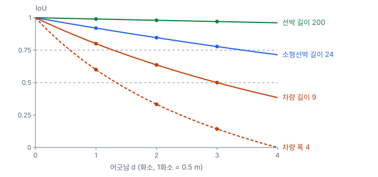
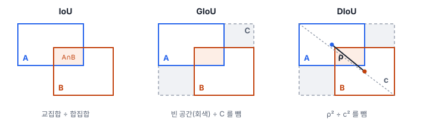

# 35강 박스를 비교하는 법

## 이 강에서 얻는 것

- 좌표만으로 두 상자의 IoU를 계산하고, 평가에서 IoU 임계값이 "맞힘"을 정하는 방식을 설명할 수 있음
- 같은 1~2화소 어긋남이 작은 객체의 IoU를 크게 떨어뜨리는 이유를 계산으로 보이고, 크기별 결과를 따로 읽을 수 있음
- IoU를 손실로 쓸 때의 한계와 GIoU·DIoU·CIoU가 더하는 것을 구분하고, 박스 IoU와 마스크 IoU를 가려 쓸 수 있음

## 1. IoU: 겹친 넓이 ÷ 합친 넓이

탐지기가 낸 상자가 정답을 "맞혔는지" 정하려면 두 상자가 얼마나 겹치는지를 숫자 하나로 재야 함. 가장 널리 쓰는 것이 **IoU(intersection over union)**로, 교집합 넓이를 합집합 넓이로 나눈 값임. 집합 비교에서 쓰는 **자카드 지수(Jaccard index)**와 같음.

$$\mathrm{IoU}(A,B) = \frac{\lvert A \cap B \rvert}{\lvert A \cup B \rvert} = \frac{\lvert A \cap B \rvert}{\lvert A \rvert + \lvert B \rvert - \lvert A \cap B \rvert}$$

$\lvert \cdot \rvert$는 넓이임. 하나도 안 겹치면 0, 완전히 같으면 1임.

계산은 좌표만으로 됨. 수평 박스를 왼쪽 위·오른쪽 아래 모서리 (x1, y1, x2, y2)로 적으면(영상 좌표, y는 아래로 커짐), 교집합 폭은 "두 오른쪽 끝 중 작은 값 − 두 왼쪽 끝 중 큰 값"이고 음수면 0으로 자름. 높이도 같은 방법임. 34강에서 소개한 항만 타일(0.5 m)에 흔한 크기의 소형선박 정답 (100, 100, 124, 108)(24×8화소, 12 m × 4 m)과, 오른쪽으로 6화소 밀린 예측 (106, 100, 130, 108)이면 교집합은 폭 124 − 106 = 18, 높이 8로 144이고, 합집합은 192 + 192 − 144 = 240이라 IoU는 0.6임.

IoU는 비율이라 크기와 무관함. 상자를 가로·세로 10%씩 키운 예측은 차량이든 선박이든 IoU가 $1/1.21 \approx 0.83$임. 평가에서는 IoU가 임계값 이상이면 그 정답을 맞힌 것(참양성, TP)으로 셈(38강). PASCAL VOC는 0.5를, COCO는 0.5~0.95를 0.05 간격으로 10개 써서 각각 AP를 구해 평균냄(39강).

## 2. 작은 객체에서 IoU가 민감한 이유

비율이라 상대 오차에는 공평하지만, 위치 오차는 절대 화소로 생기는 경우가 많음. 경계의 혼합 픽셀(1강), 라벨러의 손 떨림, 특징 맵 격자의 반올림(33강)은 객체 크기와 상관없이 1~2화소씩 생김. 길이 $w$화소인 상자를 그 방향으로 $d$화소 밀면 교집합은 $(w-d)h$, 합집합은 $(w+d)h$라서 높이가 약분됨.

$$\mathrm{IoU} = \frac{w-d}{w+d}$$

| 상자(화소) | 가로 1화소 | 2화소 | 3화소 | 대각 1화소 | 10% 확대 |
|---|---|---|---|---|---|
| 차량 9×4 | 0.80 | 0.64 | 0.50 | 0.50 | 0.83 |
| 소형선박 24×8 | 0.92 | 0.85 | 0.78 | 0.72 | 0.83 |
| 선박 200×34 | 0.99 | 0.98 | 0.97 | 0.93 | 0.83 |

식을 풀면 IoU 0.5의 경계는 $d = w/3$, 0.75의 경계는 $d = w/7$임. 차량은 길이 방향으로 3화소(1.5 m)만 어긋나도 0.5에 걸리고, 폭(4화소) 방향은 1화소에 0.6이라 0.75를 넘기려면 0.57화소 안에 들어야 함. 대각으로 1화소면 교집합 8×3 = 24, 합집합 48로 바로 0.5임. 선박은 길이 방향으로 29화소(14.5 m)를 어긋나야 0.75 아래로 내려감.



34강의 가상 탐지기로 확인함. 기본 탐지 결과에서 정답마다 같은 클래스 탐지 가운데 IoU가 가장 큰 것을 골랐음(IoU 0.1 이하로만 겹친, 사실상 놓친 정답은 뺐음). 선박(22척)은 수가 적어 뺐음.

| 클래스 | 짝 있는 정답 | 중앙값 | 0.5 이상 | 0.75 이상 |
|---|---|---|---|---|
| 소형선박 | 296 | 0.83 | 99.7% | 83% |
| 차량 | 749 | 0.76 | 85% | 52% |

차량은 찾기는 했어도 15%가 IoU 0.5에 못 미쳐, 매칭에서 오탐(FP) 하나와 미탐(FN) 하나로 두 번 벌을 받음. 0.75에서는 절반만 맞힘. 차량 AP가 IoU 0.5에서 0.539, 0.75에서 0.222로 떨어지는 까닭의 큰 몫이 여기 있음. 가상 탐지기는 작은 객체일수록 위치가 흔들리게 만든 것이라 수치보다 경향을 봄. 이 자료의 차량·소형선박은 거의 모두 COCO 기준 소형(넓이 32² 화소 미만)이라, 크기별 AP를 따로 읽어야 함(39강).

## 3. IoU를 손실로 쓸 때의 한계

박스 회귀(33강의 헤드)는 예전에는 주로 좌표 보정값의 L1·스무스 L1 손실로 학습했음. 그런데 좌표 손실이 같아도 IoU는 여러 값이 될 수 있어(GIoU 논문이 보인 점), 손실을 줄이는 것과 평가 점수를 올리는 것이 어긋남. 그래서 평가 기준을 그대로 손실로 쓰는 **IoU 손실**($1 - \mathrm{IoU}$)이 나왔는데, 한계가 둘임.

- **겹치지 않으면 신호가 없음.** 4화소 떨어진 예측도 40화소 떨어진 예측도 IoU 0, 손실 1임. 기울기가 0이라 어느 쪽으로 움직여야 할지 알려 주지 못함. 학습 초기나 작은 객체에서 흔한 상황임
- **어떻게 어긋났는지 모름.** 같은 IoU라도 중심이 어긋난 것인지 모양이 다른 것인지 구분하지 못함

## 4. GIoU·DIoU·CIoU

**일반화 IoU(GIoU, generalized IoU)**(레자토피기 등, 2019년 공개)는 두 상자를 감싸는 최소 상자 $C$를 씀.

$$\mathrm{GIoU} = \mathrm{IoU} - \frac{\lvert C \rvert - \lvert A \cup B \rvert}{\lvert C \rvert}$$

$C$ 안에서 두 상자가 차지하지 않은 빈 공간의 비율을 뺌. 멀어질수록 빈 공간이 커져 −1에 가까워지므로 범위는 −1보다 크고 1 이하임.

**거리 IoU(DIoU, distance IoU)**(정 등, 2019년 공개)는 두 상자의 중심 거리 $\rho$를 $C$의 대각선 길이 $c$로 나눠 제곱한 값을 뺌. 범위는 GIoU와 같음.

$$\mathrm{DIoU} = \mathrm{IoU} - \frac{\rho^2}{c^2}$$

**완전 IoU(CIoU, complete IoU)**는 같은 논문에서 가로세로비가 다른 정도 $v$를 더 뺌($w, h$는 예측, $w^{gt}, h^{gt}$는 정답의 폭·높이).

$$\mathrm{CIoU} = \mathrm{DIoU} - \alpha v,\quad v = \frac{4}{\pi^2}\left(\arctan\frac{w^{gt}}{h^{gt}} - \arctan\frac{w}{h}\right)^2,\quad \alpha = \frac{v}{(1-\mathrm{IoU}) + v}$$

$v$는 0~1이고, 가중치 $\alpha$는 IoU가 높을수록 커짐. 겹침을 먼저 맞추고 모양은 나중에 맞추라는 설계임.



정답 소형선박 (100, 100, 124, 108)에 다섯 예측을 대 본 값임.

| 예측 | IoU | GIoU | DIoU | CIoU |
|---|---|---|---|---|
| 오른쪽 4화소 떨어짐(겹침 없음) | 0 | −0.077 | −0.283 | −0.283 |
| 오른쪽 40화소 떨어짐 | 0 | −0.455 | −0.525 | −0.525 |
| 안에 포함(중심 같음, 12×4) | 0.25 | 0.25 | 0.25 | 0.25 |
| 같은 크기, 오른쪽 6화소 어긋남 | 0.6 | 0.6 | 0.563 | 0.563 |
| 중심 같음, 16×12 | 0.5 | 0.389 | 0.5 | 0.497 |

- **겹치지 않을 때** IoU는 둘 다 0이지만 GIoU·DIoU는 먼 쪽을 더 낮게 매겨, 다가갈 방향을 알려 줌
- **한 상자가 다른 상자 안에 있거나 한 줄로 나란히 어긋나면** $C$가 합집합과 같아져 GIoU = IoU가 됨. DIoU는 6화소 어긋남을 중심 거리로 0.037 더 깎음. DIoU 논문은 GIoU 손실이 상자를 먼저 키워 겹치게 한 뒤 줄이는 경향이 있어 수렴이 느리다고 지적함
- **중심이 같고 모양만 다르면** DIoU는 IoU와 같고 CIoU만 $\alpha v$(0.003)를 더 깎음. 값은 작지만 중심이 맞은 뒤에도 가로세로비를 맞추는 쪽의 신호를 남김

셋 다 **학습 손실**로 씀($1 - \mathrm{GIoU}$처럼 1에서 뺌. GIoU·DIoU 손실은 0~2이고, CIoU 손실은 $\alpha v$가 더해져 2를 넘을 수 있고 2.5보다는 작음). DETR(33강)은 L1과 GIoU 손실을 함께 쓰고, Ultralytics의 YOLOv5·YOLOv8 박스 손실은 CIoU를 씀(도구·버전마다 다르니 설정을 확인함). DIoU는 NMS(37강)에서 IoU 대신 쓰기도 함(DIoU 논문이 제안). torchvision(0.29에서 확인)에는 네 가지가 함수로 들어 있음.

```python
import torch
from torchvision.ops import box_iou, generalized_box_iou, complete_box_iou_loss
gt = torch.tensor([[100., 100, 124, 108]])     # (x1, y1, x2, y2)
pred = torch.tensor([[104., 98, 120, 110]])    # 중심 같음, 16×12
box_iou(gt, pred)                  # 0.5
generalized_box_iou(gt, pred)      # 0.389
complete_box_iou_loss(pred, gt)    # 1 − CIoU = 0.503
```

**평가 지표는 여전히 IoU**임. mAP의 임계값이 IoU로 정해져 있어서, 손실을 바꿔도 성능은 IoU 기준으로 비교함.

## 5. 마스크 IoU

분할 결과는 넓이 대신 화소를 셈. **마스크 IoU(mask IoU)**는 두 마스크에서 둘 다 1인 화소 수를 하나라도 1인 화소 수로 나눈 값임. 인스턴스 분할의 마스크 AP는 박스 IoU 자리에 마스크 IoU를 넣어 같은 방식으로 매칭하고, 의미 분할의 mIoU는 클래스별 마스크 IoU의 평균임(40강).

작은 객체의 민감함은 마스크에서 더 심함. 정답 직사각형 마스크보다 테두리를 한 화소씩 두껍게 그리면 IoU가 차량 9×4는 36/66 = 0.55, 소형선박 24×8은 0.74, 선박 200×34는 0.94임. 작은 객체는 화소 대부분이 테두리이기 때문임.

## 현장에서는

항만 영상의 차량 탐지 결과를 넘기는데 "IoU 0.5 기준 재현율 90% 이상"이라는 납품 기준에 못 미친 상황임. 결과를 열어 보면 차는 대부분 찾았고 상자가 1~2화소씩 비껴 있음.

먼저 정답마다 가장 잘 맞는 탐지의 IoU 분포를 뽑아 "놓침"과 "위치 부정확"을 가름. 0.3~0.5 구간에 몰려 있으면 위치 문제임. 다음으로 라벨부터 의심함. 같은 차를 두 사람이 그린 상자의 IoU를 재 보면, 정답끼리 길이 방향으로 1화소만 달라도 0.8, 폭 방향이면 0.6임. 도구마다 넓이 계산 규약(끝 화소를 넣어 폭에 1을 더하는지, 44강)이 다르면 같은 1화소 어긋남이 0.80과 0.82로 달리 나오기도 함. 마지막으로 기준 자체를 협의함. 9×4화소 차량에게 IoU 0.5는 1.5 m 어긋남이면 걸리는 기준임을 수치로 보이고, 크기 구간별로 따로 보고하거나 중심 거리 기준을 함께 적는 안을 냄. 작은 객체용으로 상자를 2차원 가우시안으로 보고 거리를 재는 NWD(왕 등, 2021년 공개)도 제안돼 있으나, 주로 학습 쪽(라벨 할당·NMS·손실)에서 IoU 대신 씀.

## 헷갈리는 쌍

- **IoU vs GIoU**: IoU는 0~1이고 겹치지 않으면 모두 0임. GIoU는 −1~1이고 빈 공간을 벌해 떨어진 정도를 구분하지만, 포함·나란한 경우에는 IoU와 같음
- **평가용 IoU vs 손실용 IoU 계열**: 매칭과 mAP의 기준은 IoU임. GIoU·DIoU·CIoU는 기울기를 주려고 만든 학습 손실이라 평가 수치로 보고하지 않음
- **박스 IoU vs 마스크 IoU**: 박스는 사각형 넓이로, 마스크는 화소 수로 계산함. 기운 선박처럼 박스가 물을 많이 담으면 둘이 크게 다를 수 있음(41강)
- **IoU vs Dice**: Dice는 $2\lvert A \cap B \rvert / (\lvert A \rvert + \lvert B \rvert) = 2\,\mathrm{IoU}/(1+\mathrm{IoU})$라 IoU 0.5가 Dice 0.67임. 순서는 같고 눈금만 다름(40강)

## 이렇게 지시받음

> 지시: "차량 mAP50-95가 소형선박 절반이야. 놓친 건지 상자가 비뚤어진 건지 갈라 봐."

기본 결과에서 차량 0.27, 소형선박 0.53인 상황임. 정답마다 가장 잘 맞는 탐지의 IoU 분포를 뽑음. 차량은 짝이 있어도 0.75 이상이 52%뿐이고 AP가 0.5에서 0.539, 0.75에서 0.222로 떨어지므로 위치 문제가 큼. 0.1을 넘게 겹치는 탐지조차 없는 정답(901대 중 152대)은 놓침으로 따로 셈.

> 지시: "박스 손실 CIoU로 바꿔서 다시 돌려. 비교는 mAP75로."

학습 손실만 바꾸고 평가는 IoU 기반 그대로 하라는 뜻임. 위치 정밀도를 보려고 느슨한 0.5 대신 0.75를 고른 것이며, 시드·에폭 같은 나머지 설정은 고정하고(49강) 크기 구간별 값도 함께 봄.

> 지시: "라벨 검수할 때 두 사람 박스 IoU 0.7 안 되면 다시 그리게 해."

라벨러 사이 일치도를 IoU로 재겠다는 뜻임. 차량은 대각 1화소 차이만으로 0.5라 대부분 걸리므로, 크기별로 기준을 따로 두거나 작은 객체는 "각 변 1화소 이내" 같은 화소 기준으로 바꾸자고 제안함.

## 요약

- IoU는 교집합 ÷ 합집합(0~1)이고, 좌표의 최소·최대로 계산함. 평가에서는 IoU가 임계값(0.5, 0.5~0.95) 이상이면 맞힌 것으로 셈
- 길이 방향 어긋남의 IoU는 $(w-d)/(w+d)$라, 같은 1~3화소가 9×4 차량에는 치명적이고 200×34 선박에는 미미함. 가상 탐지기 결과에서 차량은 0.75 이상이 52%뿐이었음
- IoU 손실은 겹치지 않으면 0이라 기울기가 없고, 어떻게 어긋났는지 모름
- GIoU는 감싸는 상자의 빈 공간, DIoU는 중심 거리²/대각선², CIoU는 여기에 가로세로비 항을 더 벌함. 학습 손실로 쓰고 평가는 IoU로 함
- 마스크 IoU는 화소 집합의 IoU이며, 작은 객체일수록 테두리 한 화소에 더 민감함

## 핵심 용어

| 한글 | 영문 |
|---|---|
| 교집합 대 합집합 비 | Intersection over Union (IoU) |
| 자카드 지수 | Jaccard Index |
| IoU 손실 | IoU Loss |
| 감싸는 최소 상자 | Smallest Enclosing Box |
| 일반화 IoU | Generalized Intersection over Union (GIoU) |
| 거리 IoU | Distance Intersection over Union (DIoU) |
| 완전 IoU | Complete Intersection over Union (CIoU) |
| 마스크 IoU | Mask Intersection over Union (Mask IoU) |
