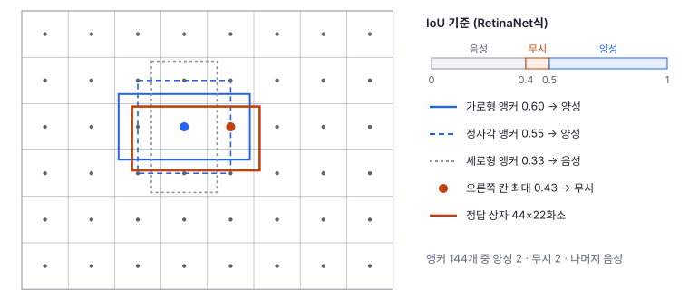
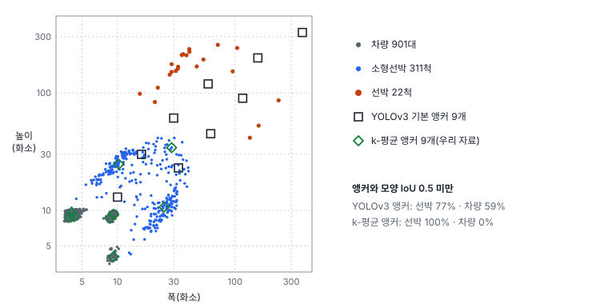
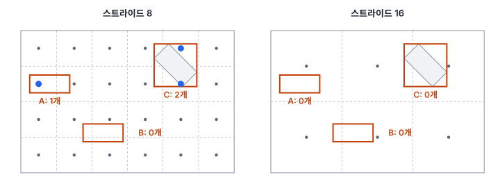

# 36강 정답 박스 배정

## 이 강에서 얻는 것

- 학습 때 수천 개의 칸·앵커 가운데 어느 것이 어떤 정답을 맡는지 정하는 라벨 할당을 평가의 매칭과 구분할 수 있음
- 앵커 박스와 IoU 기반 할당의 규칙을 알고, 앵커 모양이 자료와 안 맞을 때 생기는 일을 모양 IoU로 확인할 수 있음
- 앵커 프리 탐지와 동적 할당(SimOTA·TAL)이 양성을 고르는 방식을 계산해 보고, 작은·붐비는 객체에서 왜 중요한지 설명할 수 있음

## 1. 라벨 할당: 누가 어떤 정답을 배우나

1단계 탐지기(33강)는 격자 칸마다 예측을 냄. 512×512 타일에 스트라이드 8·16·32 층이면 $64^2 + 32^2 + 16^2 = 5{,}376$칸이고, 칸마다 앵커가 3개면 예측이 16,128개임. 학습 때 손실을 계산하려면 예측마다 "정답"이 있어야 하므로, 각 예측을 셋 중 하나로 나눔.

- **양성**: 특정 정답 상자를 맡아 그 클래스와 상자 좌표를 배움
- **음성**: 배경이라고 배움
- **무시**: 손실 계산에서 뺌

이 규칙이 **라벨 할당(label assignment)**임. 구조와 자료가 같아도 할당 규칙이 바뀌면 모델이 배우는 내용이 달라짐. 평가 때의 **매칭**(38강)과는 다름. 매칭은 학습이 끝난 뒤 NMS(37강)까지 거친 최종 예측을 정답과 1:1로 짝지어 TP·FP를 세는 절차이고, 할당은 학습 중에 NMS 전 예측을 대상으로 하며 한 정답에 양성 여러 개를 허용함. DETR의 헝가리안 매칭(33강)은 할당을 1:1로 하는 특별한 경우임.

## 2. 앵커 박스와 IoU 기반 할당

**앵커 박스(anchor box)**는 칸마다 미리 깔아 두는, 크기와 가로세로 비율이 정해진 기준 상자임. Faster R-CNN은 칸마다 9개(넓이 128²·256²·512² × 비율 1:2·1:1·2:1), RetinaNet은 P3~P7 층에 기본 넓이 32²~512²를 나눠 주고 칸마다 9개(크기 3 × 비율 3)를 둠. 모델은 상자를 처음부터 그리지 않고 앵커에서 얼마나 고칠지(오프셋)를 냄. Faster R-CNN의 표기는 다음과 같음.

$$t_x = \frac{x - x_a}{w_a}, \quad t_y = \frac{y - y_a}{h_a}, \quad t_w = \log\frac{w}{w_a}, \quad t_h = \log\frac{h}{h_a}$$

$(x_a, y_a, w_a, h_a)$는 앵커의 중심과 폭·높이임. 중심은 앵커 크기를 단위로 얼마나 옮길지, 폭·높이는 몇 배로 늘릴지를 로그로 나타냄.

**IoU 기반 할당(IoU-based assignment)**은 앵커와 정답 상자의 IoU(35강)를 임계값과 비교해 정함. RetinaNet은 IoU 0.5 이상이면 양성, 0.4 미만이면 음성, 그 사이는 무시함. Faster R-CNN의 RPN은 0.7 초과를 양성, 0.3 미만을 음성으로 두고, 정답마다 IoU가 가장 높은 앵커도 양성으로 넣어 모든 정답이 양성을 하나는 갖게 함. YOLOv3은 정답마다 모양이 가장 잘 맞는 앵커 하나만 양성으로 두고, 나머지 중 IoU가 0.5를 넘는 것은 무시함. 수치는 모델마다 다름. 무시 구간을 두는 까닭은 반쯤 맞는 앵커를 배경이라고 가르치는 모순을 피하기 위함임.

그림처럼 정답 하나에 양성은 몇 개뿐이고 나머지는 거의 다 음성임. 이 불균형을 포컬 로스(18강)가 덜어 줌.

## 3. 앵커가 자료와 안 맞을 때: k-평균 앵커

34강에서 소개한 항만 타일의 정답 수평 박스를 YOLOv3이 COCO에서 구한 기본 앵커 9개(10×13 ~ 373×326, 입력 화소 단위)와 비교함. 타일을 512 그대로 넣는다고 보고, 중심을 맞춰 겹친 **모양 IoU**(위치는 빼고 모양만 비교한 IoU)의 최댓값을 정답마다 구함. 칸 중심은 정답 중심과 어긋나므로 실제 IoU는 이보다 낮음.

| 클래스 | 개수 | YOLOv3 앵커: 중앙값 | 0.5 미만 | k-평균 앵커: 중앙값 | 0.5 미만 |
|---|---|---|---|---|---|
| 선박 | 22 | 0.45 | 77% | 0.13 | 100% |
| 소형선박 | 311 | 0.54 | 36% | 0.70 | 10% |
| 차량 | 901 | 0.32 | 59% | 0.94 | 0% |

가로로 선 차량(9×4화소)과 가장 작은 앵커 10×13의 모양 IoU는 $36 / 130 \approx 0.28$임. 모양 IoU가 상한이므로 IoU 0.5 기준이라면 차량의 59%는 양성이 될 앵커가 없고, 42%는 0.3에도 못 미침. 선박은 대부분 가로나 세로로 놓인 길이·폭 비 3~6배의 길쭉한 상자라, 비율이 2배 이하인 앵커와 모양이 어긋남.

그래서 YOLOv2(레드먼·파르하디, 2016년 공개)부터는 학습 자료의 정답 폭·높이를 **k-평균**(19강)으로 묶어 앵커를 정함. 거리는 $d = 1 - \mathrm{IoU}$를 씀. 유클리드 거리를 쓰면 큰 상자가 작은 상자보다 오차를 크게 내기 때문임. YOLOv2는 5개, YOLOv3은 9개(층마다 3개)를 썼음.

우리 자료로 9개를 구하면(중심 갱신은 중앙값) 가장 큰 앵커가 28.8×34.2화소이고 6개는 10화소 이하임. 차량 901대에 끌려간 결과라, 차량은 0.94로 잘 맞지만 22척뿐인 선박은 중앙값 0.13으로 맞는 앵커가 사라짐. 개수가 많은 클래스가 앵커를 차지하므로 층(스트라이드)이나 크기 구간별로 나눠 뽑고, 드문 클래스의 IoU를 따로 확인함.

## 4. 앵커 프리: 격자점이 직접 거리를 냄

**앵커 프리 탐지(anchor-free detection)**는 앵커 없이 격자점(칸 중심)을 기준으로 예측함. FCOS(33강)는 스트라이드 $s$ 층의 칸 $(x, y)$를 입력의 $(\lfloor s/2 \rfloor + xs, \lfloor s/2 \rfloor + ys)$로 보고, 이 점이 정답 상자 안에 있으면 양성으로 삼아 네 변까지의 거리 $l, t, r, b$를 예측함. 점이 상자 여러 개 안에 들면 넓이가 가장 작은 상자를 맡음. 층마다 맡는 크기도 나눠서, 네 거리의 최댓값이 64 이하면 P3, 64~128이면 P4 식으로 정함.

상자 가장자리의 점이 낸 상자는 엉성하기 쉬워서 FCOS는 **중심성(centerness)**을 함께 예측함.

$$\text{centerness} = \sqrt{\frac{\min(l, r)}{\max(l, r)} \times \frac{\min(t, b)}{\max(t, b)}}$$

점이 상자 한가운데면 1, 가장자리로 갈수록 0임. 추론 때 분류 점수에 곱해 가장자리 점의 상자가 NMS에서 뒤로 밀리게 함.

약점은 **상자 안에 격자점이 하나도 없으면 그 정답은 양성이 0개**라 배울 기회가 없다는 것임. 우리 자료에서 격자점이 0개인 정답의 비율은 다음과 같음.

| 클래스 | 스트라이드 8 | 스트라이드 16 |
|---|---|---|
| 선박 | 0% | 0% |
| 소형선박 | 3% | 28% |
| 차량 | 31% | 71% |

차량은 네 거리가 64보다 훨씬 작아 FCOS 규칙에서 P3(스트라이드 8)이 맡으므로, 31%가 그대로 양성 없이 남음. 반대로 상자 안 점을 모두 양성으로 삼으면 큰 객체일수록 양성이 많아짐. 스트라이드 16에서 선박은 상자 안 점이 중앙값 26개, 소형선박은 1개임.

## 5. 동적 할당: SimOTA와 TAL

지금까지의 규칙은 **정적 할당**임. 학습 전에 앵커·격자점과 정답의 기하만 보고 정하며 학습 내내 바뀌지 않음. **동적 할당**은 학습 중 모델의 현재 예측, 곧 정답 클래스 점수 $s$와 예측 상자·정답의 IoU $u$를 보고 반복마다 다시 정함.

**SimOTA**는 YOLOX(거 등, 2021년 공개)의 할당으로, 최적 수송 문제로 푼 OTA를 단순화한 것임. 정답 $i$와 예측 $j$의 비용은 다음과 같음.

$$c_{ij} = L^{\text{cls}}_{ij} + \lambda L^{\text{reg}}_{ij}$$

분류 비용은 정답 클래스 점수가 낮을수록, IoU 비용($-\log u$)은 상자가 어긋날수록 큼. 논문은 $\lambda$ 값을 적지 않았고 공식 코드는 3을 씀. 후보는 정답 중심 근처의 격자점으로 좁힘(정확한 범위는 코드 판마다 다름). 정답마다 후보 IoU 상위 10개의 합을 내림한 값(최소 1)을 **동적 k**로 삼아 비용이 낮은 k개를 양성으로 고름. 잘 맞는 예측이 많은 정답은 양성을 많이, IoU가 낮게 나오는 작은 정답은 적게 받음. 한 예측이 여러 정답에 뽑히면 비용이 가장 낮은 정답만 맡음.

**태스크 정렬 학습(TAL, task alignment learning)**은 TOOD(펑 등, 2021년 공개)의 방법으로, 정렬 지표 $t = s^{\alpha} u^{\beta}$를 씀. 원 논문은 $\alpha = 1$, $\beta = 6$으로 두고 정답마다 $t$ 상위 13개를 양성으로 고름. 분류 손실의 목표값도 1 대신 정규화한 $t$(정답마다 최댓값이 그 정답의 최대 IoU가 되게)로 바꿔, 점수가 높은 예측이 위치도 정확하도록 두 태스크를 맞춤. Ultralytics 8.4.171의 기본 탐지 손실(v8DetectionLoss)은 $\alpha = 0.5$, $\beta = 6$, 상위 10개를 쓰고 후보는 상자 안 격자점으로 제한함.

외해 타일의 소형선박 한 척(39.9×23.2화소)을 둘러싼 후보 7개로 계산함. 실제 학습이 아니라 34강의 가상 탐지기가 NMS 전에 낸 상자를 학습 중 예측처럼 빌려 쓴 계산 예이고, SimOTA 분류 비용은 $-\log s$로 단순화했음.

| 후보 | 점수 $s$ | IoU $u$ | TAL $t$ | SimOTA 비용 |
|---|---|---|---|---|
| 1 | 0.432 | 0.892 | 0.217 | 1.18 |
| 2 | 0.354 | 0.923 | 0.219 | 1.28 |
| 3 | 0.246 | 0.844 | 0.089 | 1.91 |
| 4 | 0.318 | 0.855 | 0.124 | 1.62 |
| 5 | 0.314 | 0.747 | 0.055 | 2.03 |
| 6 | 0.260 | 0.855 | 0.101 | 1.82 |
| 7 | 0.329 | 0.834 | 0.111 | 1.66 |

- **TAL**: 후보가 7개뿐이라 상위 13개(Ultralytics는 10개)를 고르면 7개 모두 양성이 되므로 순위만 봄. 상위 3개는 2·1·4번임. 2번은 점수가 1번보다 낮지만 IoU가 높아 1위임. $\beta = 6$이라 $u^6$이 0.619 대 0.503으로 벌어지기 때문임. IoU가 0.747인 5번은 $u^6 = 0.17$로 꼴찌임
- **SimOTA**: IoU 합이 5.95라 동적 k = 5이고, 비용이 낮은 1·2·4·7·6번이 양성임. 점수가 가장 낮은 3번과 IoU가 가장 낮은 5번이 빠짐

## 6. 작은·붐비는 객체에서 할당이 중요한 이유

- **정적 IoU 할당**: 작은 객체는 앵커와 IoU가 낮아 양성이 없거나 "가장 높은 앵커" 하나뿐임. 1~2화소만 어긋나도 IoU가 크게 떨어짐(35강)
- **상자 안 점 할당**: 차량의 31%가 스트라이드 8에서도 양성 0개임
- **동적 할당**: SimOTA는 정답마다 k를 최소 1로 두고, 두 방법 모두 정답마다 양성 수에 상한(k, 13)을 두어 큰 객체가 양성을 독차지하지 못함. 차가 빽빽한 주차장처럼 한 점이 여러 정답과 겹치면 넓이 같은 고정 규칙 대신 예측이 실제로 더 잘 맞는 정답에 줌

다만 동적 할당도 후보가 없으면 소용없음. SimOTA는 정답 중심 근처 점을 후보로 넣어 상자 밖 점도 쓰고, 같은 판 Ultralytics의 TAL은 한 변이 둘째 층 스트라이드(기본 16화소)보다 작은 정답을 후보 고를 때만 16화소로 넓힘. 쓰는 도구가 이런 처리를 하는지 코드에서 확인함.

## 현장에서는

0.5 m 항만 영상으로 차량·소형선박 탐지기를 YOLOv3식 앵커로 학습했더니 차량 재현율이 유난히 낮은 상황임. 구조를 바꾸기 전에 할당부터 봄. 첫째, 정답 상자와 앵커의 모양 IoU 분포를 클래스별로 뽑음. 차량의 59%가 0.5 미만이면 앵커를 먼저 의심함. 둘째, 학습 배치에서 정답마다 양성이 몇 개 붙는지 기록해 0개인 정답의 비율을 봄. 셋째, 앵커를 우리 라벨로 다시 뽑되 선박이 밀려나지 않게 층별로 나누거나, TAL·SimOTA를 쓰는 앵커 프리 모델로 바꾸고 스트라이드 8 층이 차량을 맡는지 확인함.

## 헷갈리는 쌍

- **라벨 할당 vs 평가 매칭**: 할당은 학습 중 NMS 전 예측에 양성·음성·무시를 정하며 한 정답에 양성 여럿을 허용함. 매칭은 평가 때 최종 예측을 정답과 1:1로 짝지어 TP·FP를 셈(38강)
- **앵커 vs 앵커 프리**: 기준이 미리 정한 상자냐 격자점이냐의 차이임. 앵커 프리도 할당 규칙은 있고, 상자 안 점이 없으면 양성이 없음
- **정적 vs 동적 할당**: 정적(IoU 임계값, 상자 안 점)은 기하만 보고 한 번 정함. 동적(SimOTA·TAL)은 현재 예측의 점수와 IoU를 보고 반복마다 다시 정하므로 에폭마다 양성 수가 바뀜

## 이렇게 지시받음

> 지시: "소형선박 재현율 낮으면 모델 바꾸기 전에 정답마다 양성 몇 개 붙는지부터 찍어 봐."

할당 단계에서 소형선박이 배울 기회를 얻는지 확인하라는 뜻임. 양성 0개인 정답이 많으면 앵커 모양이나 격자점 부족이 원인이므로 앵커 재설정, 스트라이드 8(또는 4) 층, 동적 할당을 검토함.

> 지시: "앵커 COCO 기본값 쓰지 말고 우리 라벨로 k-평균 다시 돌려. 선박은 따로 확인하고."

거리 $1 - \mathrm{IoU}$로 정답 폭·높이를 묶어 앵커를 다시 정하라는 뜻임. 개수가 많은 차량에 앵커가 몰리면 드문 선박은 중앙값 0.13처럼 맞는 앵커가 없어지므로, 클래스별 최대 모양 IoU를 표로 확인함.

> 지시: "YOLOX는 에폭마다 양성 수가 달라지는 게 정상이야. 버그로 보지 마."

SimOTA는 현재 예측의 비용과 동적 k로 양성을 다시 고르므로 예측이 좋아질수록 양성 수가 바뀜. 대신 양성 0개인 정답이 남는지는 따로 봄.

## 요약

- 라벨 할당은 학습 때 예측마다 양성·음성·무시를 정하는 규칙이고, 평가 때의 1:1 매칭과 다름
- 앵커 박스는 칸마다 둔 기준 상자이며, 상자 회귀는 앵커에서의 오프셋임. IoU 기반 할당은 임계값(RetinaNet 0.5/0.4, RPN 0.7/0.3)으로 정하고 수치는 모델마다 다름
- COCO 앵커는 우리 차량의 59%와 모양 IoU 0.5 미만이고, 자료로 뽑은 k-평균 앵커는 개수 많은 차량에 끌려가 선박이 중앙값 0.13이 됨
- 앵커 프리(FCOS)는 상자 안 격자점이 거리 4개와 중심성을 냄. 차량의 31%(스트라이드 8)는 상자 안 격자점이 없어 양성이 없음
- 동적 할당은 현재 예측으로 양성을 고름. SimOTA는 분류 비용 + λ·IoU 비용과 동적 k, TAL은 $t = s^{\alpha} u^{\beta}$(α=1, β=6) 상위 13개를 씀

## 핵심 용어

| 한글 | 영문 |
|---|---|
| 라벨 할당 | Label Assignment |
| 앵커 박스 | Anchor Box |
| IoU 기반 할당 | IoU-based Assignment |
| 모양 IoU | Shape IoU |
| k-평균 앵커 | k-means Anchors |
| 앵커 프리 탐지 | Anchor-free Detection |
| 중심성 | Centerness |
| 정적 할당 / 동적 할당 | Static Assignment / Dynamic Assignment |
| SimOTA / 동적 k | SimOTA / Dynamic k |
| 태스크 정렬 학습 / 정렬 지표 | Task Alignment Learning (TAL) / Alignment Metric |
