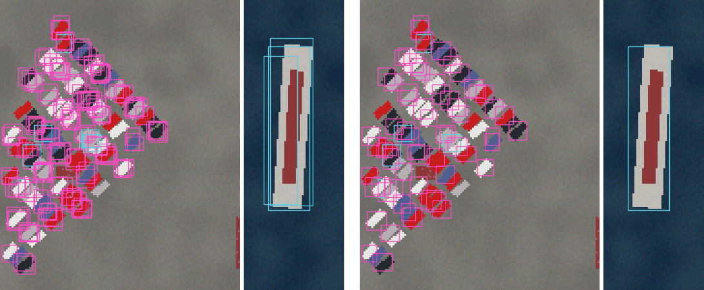
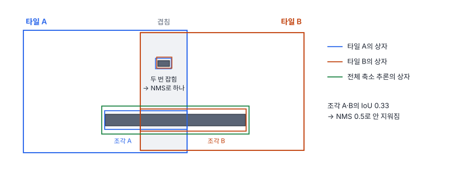

# 37강 NMS와 대형 영상 후처리

## 이 강에서 얻는 것

- 탐지기 원시 출력에 중복 상자가 생기는 이유와 탐욕적 NMS 절차를 설명하고, NMS IoU 임계값을 낮추거나 높일 때의 위험을 판단할 수 있음
- 클래스별·클래스 무관 NMS, Soft-NMS, 가중 박스 융합(WBF) 가운데 상황에 맞는 것을 고를 수 있음
- 대형 영상을 슬라이스 추론으로 처리하며 겹침, 잘린 조각 상자, 큰 객체 문제를 다룰 수 있음

## 1. 한 객체에 상자가 여러 개 나오는 이유

1단계 탐지기는 격자 칸마다 박스를 냄(33강). 학습 때 정답 하나에 주변 여러 칸·여러 층을 양성으로 할당하므로(일대다 할당, 36강), 추론 때도 객체 근처 여러 칸이 저마다 비슷한 상자를 냄. 2단계 탐지기도 겹친 후보마다 박스를 다듬어 내므로 마찬가지임. 그래서 원시 출력은 한 객체에 상자 여러 개임.

34강에서 소개한 항만 타일 24장(정답 1,234개)에 가상 탐지기를 돌린 원시 출력은 3,092개이고, 잡힌 객체 975개에 평균 2.98개씩 붙어 있음. 중복은 같은 정답에 이미 짝이 있어 모두 오탐(38강)이 되므로, 원시 출력을 그대로 평가하면 mAP50이 0.450에 그침(상자 수 제한 maxDets 100에 잘리는 몫도 일부 있음, 39강). 중복을 지우는 후처리가 **비최대 억제(NMS, non-maximum suppression)**이며, IoU 0.5로 걸면 1,494개가 남고 mAP50은 0.645가 됨(6부의 기본 탐지 결과). 이 강의 수치는 모두 가상 탐지기의 결과라서 크기보다 방향을 읽음.



## 2. 탐욕적 NMS와 IoU 임계값

탐욕적 NMS는 클래스마다 다음을 되풀이함.

1. 남은 상자 가운데 점수가 가장 높은 것을 결과로 남김
2. 그 상자와 IoU(35강)가 임계값을 넘는 나머지를 같은 객체의 중복으로 보고 지움
3. 상자가 남지 않을 때까지 1로 돌아감

```python
def nms(boxes, scores, thr=0.5):
    order = scores.argsort()[::-1]                # 점수 내림차순
    keep = []
    while order.size > 0:
        i = order[0]; keep.append(i)              # 가장 높은 상자를 남김
        ious = iou(boxes[i], boxes[order[1:]])    # 나머지와의 IoU(35강, 함수는 따로 둠)
        order = order[1:][ious <= thr]            # 임계값을 넘으면 지움
    return keep
```

**NMS IoU 임계값**은 양쪽에 위험이 있음. 낮게 잡으면 붙어 있는 진짜 이웃까지 지움. 밀집 주차장이나 나란히 계류한 선박이 그렇고, 지워진 이웃은 미탐이 됨. 높게 잡으면 중복이 살아남아 오탐이 늘어남. 기본값은 도구마다 다름(torchvision 0.29의 Faster R-CNN 0.5, Ultralytics 8.4 기본 설정 0.7). 겹침을 IoU 대신 DIoU(35강)로 재어 중심이 먼 이웃을 덜 지우는 DIoU-NMS도 있음.

수평 박스(HBB)는 기울어진 객체에서 이웃끼리 크게 겹침. 길이 4.5 m·폭 1.8 m 차가 2.6 m 간격으로 45° 줄지어 서면, 차끼리는 닿지 않는데도 HBB는 한 변 4.45 m 정사각형이 1.84 m씩 어긋나 IoU가 0.21임(회전 박스는 41강).

| NMS IoU 임계값 | 남은 상자 | 그중 남은 중복 | mAP50 | 45° 주차장 차량 재현율 |
|---|---|---|---|---|
| 0.3 | 1,178 | 102 | 0.705 | 0.638 |
| 0.5 | 1,494 | 391 | 0.645 | 0.649 |
| 0.7 | 2,303 | 1,159 | 0.537 | 0.652 |

남은 중복은 한 객체에 붙어 남은 두 번째 이후 상자 수임. 임계값은 두 분포 사이에서 정해짐. 하나는 **중복 상자끼리의 IoU**임. 이 탐지기의 중복 1,927개 가운데 최고점 상자와 IoU가 0.5를 넘는 것은 79%, 0.3을 넘는 것은 97%라서, 0.5로는 중복이 391개 남고 0.3이 가장 좋았음. 다른 하나는 **이웃 정답끼리의 IoU**임. 45° 주차 차량 365대는 가장 많이 겹친 이웃과의 IoU 중앙값이 0.24이고 0.5를 넘는 경우가 없어(0.3 초과 13%) 0.3에서도 재현율이 조금만 떨어졌음. 이웃끼리 IoU가 0.3을 자주 넘는 자료라면 0.3에서 진짜 이웃이 많이 지워짐. 그래서 검증 자료에서 두 분포를 함께 보고 임계값을 고름.

## 3. 클래스별 NMS와 클래스 무관 NMS

기본은 같은 클래스끼리만 비교하는 **클래스별 NMS**임. 그런데 이 탐지기는 길이 22~50 m 배를 선박과 소형선박으로 함께 내기도 함. 클래스별 NMS는 둘을 다 남기고, 틀린 클래스 상자는 그 클래스의 오탐이 됨. 모든 클래스를 한데 모아 비교하는 **클래스 무관 NMS**(IoU 0.5)는 상자를 45개 더 지워 선박 AP50이 0.552에서 0.580으로, mAP50이 0.655로 올랐음.

대신 서로 다른 클래스가 실제로 겹친 경우 하나를 지움. 대형 선박 옆에 붙은 소형선박이 그런 예임. 이 자료는 차는 땅, 배는 물에 있어 손해가 없었음(차량 AP50 0.539 그대로). 헷갈리는 클래스끼리만 묶어 비교하는 절충도 있음.

## 4. Soft-NMS와 WBF

**Soft-NMS**(보들라 등, 2017년 공개)는 겹친 상자를 지우지 않고 점수를 낮춤. 가우시안 방식은 남긴 상자와의 IoU로 점수를 깎음.

$$s_i \leftarrow s_i \, e^{-\mathrm{IoU}^2/\sigma}$$

많이 겹칠수록 많이 깎는다는 뜻임. $\sigma = 0.5$이면 IoU 0.2인 이웃은 0.92배로 거의 그대로이고, IoU 0.9인 중복은 0.20배로 뒤로 밀림. 이 자료에서 mAP50 0.682, 차량 AP50 0.539 → 0.60이었음. 중복은 순위 뒤로 밀리고, NMS라면 지워졌을 이웃은 낮은 점수로나마 남기 때문으로 보임. 다만 상자 3,069개가 거의 다 남으므로 납품 전에는 점수 임계값(38강)으로 다시 거름.

**가중 박스 융합(WBF, weighted boxes fusion)**(솔로비요프 등, 2019년 공개)은 IoU가 임계값(여기서는 0.55)을 넘는 상자를 한 묶음으로 모아, 좌표를 점수 가중 평균으로 합침. 묶음 점수는 평균이고, 모델 $N$개를 합칠 때 묶음 상자가 $N$개보다 적으면 그 비율만큼 깎음. 한 모델만 낸 상자는 의심받는 셈임.

| 설정 | mAP50 |
|---|---|
| 한 모델 원시 출력에 WBF | 0.560 |
| 모델 A(기본 결과) / 모델 B 단독 | 0.645 / 0.699 |
| 두 모델 합집합 + NMS | 0.753 |
| 두 모델 WBF | 0.843 |

모델 B는 시드가 다른 가상 탐지기이고, 두 모델 모두 NMS를 거친 결과를 합쳤음. 이 가상 탐지기는 중복을 최고점 상자보다 위치가 나쁘고(정답과의 IoU 평균 0.65 대 0.78) 점수가 낮게 만들었으므로, 한 모델에서는 중복이 평균에 섞여 좌표와 점수가 함께 나빠진 것으로 보임(묶음 점수를 평균 대신 최댓값으로 하면 0.620). 묶는 기준 0.55가 NMS의 0.5보다 높아 덜 묶인 중복도 더 남았음. 서로 다른 모델의 상자는 오차가 서로 상쇄되고 둘이 함께 낸 것이 증거가 되는 것으로 보임. 다만 두 가상 탐지기는 놓침과 위치 오차가 서로 독립이라 실제 모델끼리보다 이득이 크게 나왔을 것임. 그래서 WBF는 여러 모델 앙상블이나 TTA(테스트 시 증강: 뒤집기·크기 바꿈으로 여러 번 추론한 결과를 합침)에 씀.

## 5. 대형 영상의 슬라이스 추론

2,048×2,048 장면(1 km, 정답 619개: 선박 10·소형선박 85·차량 524)을 640으로 줄여 한 번 넣으면 8~10화소 차량이 2.5~3.1화소가 되어 차량 재현율이 0.046에 그침. **슬라이스 추론**은 영상을 타일로 잘라 원래 해상도로 추론한 뒤, 상자에 타일 원점을 더해 전역 좌표로 옮기고 다시 NMS를 거는 방식임.

| 512 타일 설정 | 추론 횟수 | mAP50 |
|---|---|---|
| 겹침 0 | 16 | 0.519 |
| 겹침 64화소 | 25 | 0.580 |
| 겹침 128화소 | 25 | 0.682 |
| 겹침 128 + 전체 축소 추론 | 26 | 0.714 |

(끝 타일은 영상 끝에 맞춰 당겨서 겹침 64도 25장임.) 겹침이 있으면 경계에 걸린 객체도 겹침보다 작으면 어느 한 타일에 온전히 들어감. 겹침보다 큰 객체는 **잘린 조각 상자**를 남김. 타일마다 보이는 부분만 상자를 내고, 조각끼리 IoU가 낮아 NMS로 지워지지 않음. 겹침 128에서도 점수 0.3 이상인 조각(어느 정답과도 IoU 0.5 미만이면서 넓이 절반 넘게가 한 정답 안에 든 상자)이 110개였음.



가장 긴 선박은 798화소라 어느 타일에도 들어가지 않지만, 전체 축소 추론에서는 249화소로 잘 보임. 그래서 축소 결과를 합치면 선박 재현율이 0.8에서 0.9(10척 중 9척)로 오름. 비용도 따져야 함. 512 타일 25장은 640 입력 16장 분량의 화소임.

이 방식을 묶은 도구가 SAHI(아키온 등, 2022년 공개)임. SAHI 0.12.8 기준 `get_sliced_prediction`의 기본값은 겹침 비율 0.2, 전체 영상 추론 합치기 켬, 후처리는 IoU 대신 **IoS**(작은 상자 기준 겹침: 교집합 ÷ 작은 상자 넓이)로 상자를 합치는 방식임. 조각이 온전한 상자 안에 들면 IoS가 커서 조각 정리에 유리함. 다만 모델의 점수 임계값이 0.1 미만이면 NMS·IoU로 저절로 바뀜.

## 6. NMS 프리 탐지

**NMS 프리 탐지**는 학습 때 정답 하나에 예측 하나만 양성으로 할당해(일대일 할당) 중복을 스스로 내지 않게 함. DETR은 헝가리안 매칭(33강)으로, YOLOv10(왕 등, 2024년 공개)은 일대다 헤드와 일대일 헤드를 함께 학습하고 추론 때 일대일 헤드만 써서 NMS를 뺐음. 그래도 점수 임계값은 정해야 하고, 슬라이스 추론의 타일 간 중복은 생기므로 합치는 단계는 남음.

## 현장에서는

0.5 m 위성영상 1 km 장면에서 항만 주차 차량과 선박을 세는 과제임. 512 타일로 자르되 겹침을 흔한 객체(차·소형선박)보다 넉넉히 잡고, 타일보다 긴 대형 선박은 전체 축소 추론 결과를 합침. NMS 임계값은 검증 장면에서 중복 IoU와 이웃 정답 IoU를 함께 보고 정함. 조각 상자는 IoS 기준으로 합치고, 겹침을 바꿔도 집계 대수가 크게 달라지지 않는지 확인함.

## 헷갈리는 쌍

- **NMS IoU 임계값 vs 점수 임계값**: NMS 임계값은 "얼마나 겹치면 같은 객체로 볼지", 점수 임계값은 "점수가 얼마 이상이면 결과로 낼지"임. 앞은 중복을, 뒤는 운영점(38강)을 정함.
- **클래스별 vs 클래스 무관 NMS**: 클래스별은 같은 클래스끼리만 지워 한 객체를 두 클래스로 낸 중복이 남고, 클래스 무관은 그것을 지우지만 실제로 겹친 다른 클래스 객체도 지울 수 있음.
- **Soft-NMS vs WBF**: Soft-NMS는 상자를 그대로 두고 점수만 낮추고, WBF는 묶음을 좌표 평균으로 새 상자 하나로 합침. Soft-NMS는 한 모델의 출력에, WBF는 여러 모델·TTA의 앙상블에 맞음.

## 이렇게 지시받음

> 지시: "45도 주차장에서 붙은 차가 하나씩 빠진대. NMS 임계값 올려 봐."

이웃 차의 HBB가 겹쳐 진짜 차가 지워진다는 판단임. 올리기 전에 이웃 정답끼리의 IoU 분포를 보고, 올렸을 때 중복 오탐이 얼마나 늘어나는지 정밀도와 함께 확인함. 회전 박스 NMS(41강)나 Soft-NMS도 후보임. 다만 이 강의 자료처럼 이웃 IoU가 0.5를 넘지 않으면 0.5에서 이웃이 지워지는 일은 드물므로, 원시 출력에 그 차의 상자가 아예 없었는지(탐지 자체의 미탐)부터 확인함(53강).

> 지시: "모델 두 개 결과 WBF로 합쳐서 내. 단일 모델엔 걸지 말고."

WBF는 앙상블에서 강하고, 이 강의 실험에서도 한 모델의 원시 출력에는 오히려 나빴음. 각 모델은 NMS를 거친 결과를 넣고, 합친 뒤 점수 임계값을 다시 정함.

> 지시: "대형 영상은 줄이지 말고 SAHI로 돌려. 타일 512, 겹침 20%."

512의 20%는 약 102화소(51 m)라 그보다 긴 선박이 경계에 걸리면 조각이 남음. 전체 영상 추론 합치기를 켜 두고, 조각이 몰리는 타일 경계를 결과 지도에서 확인함.

## 요약

- 일대다 할당 때문에 원시 출력에는 한 객체에 상자가 여러 개이고, 그대로 평가하면 중복이 모두 오탐이 됨
- 탐욕적 NMS는 점수순으로 남기고 IoU가 임계값을 넘는 나머지를 지움. 낮으면 붙은 이웃을, 높으면 중복을 남기므로 중복 IoU와 이웃 정답 IoU의 분포를 보고 정함
- 클래스 무관 NMS는 두 클래스로 낸 중복을 지우지만 실제로 겹친 다른 클래스도 지울 수 있음
- Soft-NMS는 점수를 낮추고, WBF는 좌표를 평균해 합침. WBF는 앙상블에서 강했고 한 모델 원시 출력에는 나빴음
- 대형 영상은 겹침 있는 슬라이스 추론 + 전역 좌표 NMS + 전체 축소 추론 합치기로 처리하고, 잘린 조각 상자를 따로 정리함. NMS 프리 탐지는 일대일 할당으로 NMS를 뺌

## 핵심 용어

| 한글 | 영문 |
|---|---|
| 비최대 억제 | Non-Maximum Suppression (NMS) |
| NMS IoU 임계값 | NMS IoU Threshold |
| 클래스별 NMS / 클래스 무관 NMS | Class-wise NMS / Class-agnostic NMS |
| 소프트 NMS | Soft-NMS |
| 가중 박스 융합 | Weighted Boxes Fusion (WBF) |
| 테스트 시 증강 | Test-Time Augmentation (TTA) |
| 슬라이스 추론 | Sliced Inference |
| 잘린 조각 상자 | Fragment Box |
| 작은 상자 기준 겹침 | Intersection over Smaller (IoS) |
| NMS 프리 탐지 | NMS-free Detection |
| 일대일 할당 / 일대다 할당 | One-to-One / One-to-Many Assignment |
