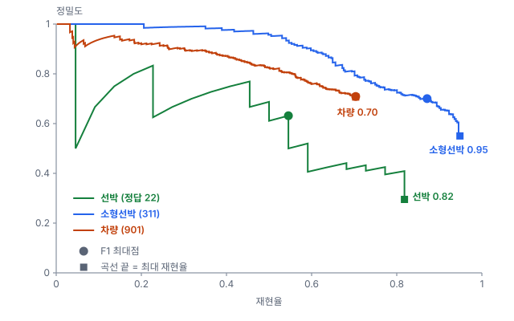
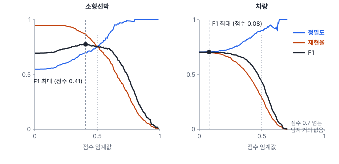

# 38강 정밀도·재현율과 운영점

## 이 강에서 얻는 것

- 탐지 결과를 정답과 짝지어 참 양성·거짓 양성·거짓 음성을 세고, 탐지에서 ROC 대신 PR 곡선을 쓰는 이유를 설명할 수 있음
- 점수 임계값을 내리며 PR 곡선을 그리고, 곡선 끝(최대 재현율)과 F1 최대점을 읽을 수 있음
- 보고 목적에 맞춰 운영점을 고르고, 이미지당 오탐 수를 면적 기준으로 바꿔 말하고, 클래스마다 임계값을 따로 정할 수 있음

## 1. 탐지에서 TP·FP·FN 세기

분류는 표본 하나에 예측 하나라서 혼동행렬(17강)을 바로 셀 수 있음. 탐지는 상자 수가 정답 수와 다르므로 먼저 **짝을 지어야** 함. 이 절차를 **매칭(matching)**이라 하며, 학습 때의 라벨 할당(36강)과 달리 최종 예측과 정답을 1:1로 짝지음. 흔히 쓰는 규칙(COCO 방식)은 다음과 같음.

1. 탐지를 점수가 높은 것부터 하나씩 봄
2. **같은 클래스**이고 아직 짝이 없는 정답 가운데 IoU(35강)가 기준값(IoU 임계값, 흔히 0.5) 이상이면서 가장 큰 것과 짝지음
3. 짝지은 탐지는 **참 양성(TP)**, 짝을 못 찾은 탐지는 **거짓 양성(FP, 오탐)**, 끝까지 짝이 없는 정답은 **거짓 음성(FN, 미탐)**

정답 하나에는 탐지 하나만 짝지어지므로, 같은 배에 상자가 두 개 남으면 점수가 낮은 쪽은 위치가 좋아도 오탐임. 예를 들어 선박 A·B에 상자 셋이 있다고 함. 점수 0.9 상자는 A와 IoU 0.78이라 TP, 0.8 상자는 A와 0.62지만 A가 이미 짝이 있어 FP(중복), 0.6 상자는 B와 0.41이라 FP이고 B는 FN임. TP 1·FP 2·FN 1이라 정밀도 1/3, 재현율 1/2임. IoU 임계값을 0.4로 낮추면 세 번째 상자가 TP가 되어 정밀도 2/3, 재현율 1이 됨.

클래스가 틀리면 두 번 셈. 선박을 소형선박으로 내면 소형선박 쪽에는 오탐, 선박 쪽에는 미탐임.

탐지에는 **참 음성(TN)이 없음**. "상자가 없어야 할 자리에 상자를 내지 않은 경우"는 위치·크기 조합이 끝없어 셀 수 없음. 그래서 TN이 분모에 들어가는 거짓 양성률(17강)을 못 구하고 ROC 곡선도 그릴 수 없음. 정밀도와 재현율은 TN 없이 계산되므로 탐지 평가는 PR 곡선(18강)으로 함.

## 2. 점수 임계값을 내리며 그리는 PR 곡선

34강에서 소개한 항만 타일 24장(선박 22척, 소형선박 311척, 차량 901대)과 가상 탐지기의 기본 탐지 결과를 IoU 0.5로 평가함. 이 강은 이미지당 상자 수에 상한을 두지 않고 셈(COCO의 상한 100과의 차이는 39강).

**점수 임계값(score threshold)**은 이 점수 이상인 탐지만 결과로 내놓는 기준임. 임계값을 높은 쪽에서 내리면 탐지가 하나씩 들어오며 TP나 FP가 하나씩 늘고, 그때마다 (재현율, 정밀도) 점이 하나 생김. 이 점을 이은 것이 **정밀도-재현율 곡선(PR 곡선)**임. 소형선박의 몇몇 점은 다음과 같음.

| 점수 임계값 | TP | FP | FN | 정밀도 | 재현율 | F1 | FPPI |
|---|---|---|---|---|---|---|---|
| 0.7 | 130 | 4 | 181 | 0.970 | 0.418 | 0.584 | 0.17 |
| 0.5 | 235 | 78 | 76 | 0.751 | 0.756 | 0.753 | 3.25 |
| 0.4 | 271 | 118 | 40 | 0.697 | 0.871 | 0.774 | 4.92 |
| 0.25 | 293 | 189 | 18 | 0.608 | 0.942 | 0.739 | 7.88 |
| 0.1 | 295 | 237 | 16 | 0.555 | 0.949 | 0.700 | 9.88 |

FPPI는 4절에서 다룸. 0.25에서 0.1로 내리면 TP가 2개 느는 동안 FP가 48개 늚. 새로 들어오는 것이 거의 오탐뿐이라는 뜻임.

**곡선 끝은 놓친 객체가 정함.** 임계값을 끝까지 내려도 짝이 없는 정답은 FN으로 남으므로, 재현율은 어떤 값(**최대 재현율**)에서 멈춤. 소형선박 0.949, 선박 0.818, 차량 0.704임(차량은 이미지당 상위 100개만 넣으면 0.609, 39강). 끝까지 짝이 없는 차량 267대 가운데 241대는 IoU 0.3 이상인 차량 상자조차 받지 못했고, IoU 기준을 0.3으로 낮춰도 최대 재현율은 0.718에 그침. 위치가 조금 어긋난 것이 아니라 아예 탐지되지 않은 것이라 임계값으로는 풀 수 없고, 모델(33강의 고해상도 층)이나 추론 방식(37강의 슬라이스 추론)을 바꿔야 함.

NMS(37강)를 거친 뒤에도 중복은 남음. 차량 오탐 263개 가운데 82개가 이미 짝지어진 차량과 IoU 0.5 이상 겹친 두 번째 상자임.

## 3. F1 최대점과 운영점

F1(17강)이 가장 큰 점이 **F1 최대점**임. 소형선박은 점수 0.406에서 F1 0.777(정밀도 0.700, 재현율 0.871)임. F1은 오탐 하나와 미탐 하나를 같은 무게로 보는 지표라서, F1 최대점은 "두 비용이 같다면"의 후보일 뿐임.

실제로 결과를 내보낼 임계값과 그때의 정밀도·재현율을 **운영점(operating point)**이라 함. 보고 목적에 따라 고르는 법이 둘임.

- **놓치면 안 될 때: 재현율 목표.** 목표 재현율을 처음 넘는 점수를 고름. 소형선박 재현율 0.9를 얻으려면 점수를 0.3503까지 내려야 하고, 그때 정밀도는 0.668, 오탐은 139개임. 목표가 최대 재현율보다 높으면 어떤 임계값으로도 얻을 수 없으므로 "도달 불가"를 그대로 적음
- **검수 인력이 한정될 때: FPPI 상한.** 오탐을 상한 이하로 두는 가장 낮은 점수를 고름. 타일당 오탐 1개까지면 소형선박은 점수 0.6075에서 재현율 0.614, 정밀도 0.888임

| 클래스 | 재현율 0.8: 점수 · 정밀도 | 재현율 0.9: 점수 · 정밀도 | FPPI 1: 점수 · 재현율 |
|---|---|---|---|
| 선박 | 0.2955 · 0.409 | 도달 불가 | 0.3485 · 0.773 |
| 소형선박 | 0.4679 · 0.735 | 0.3503 · 0.668 | 0.6075 · 0.614 |
| 차량 | 도달 불가 | 도달 불가 | 0.5126 · 0.262 |

점수는 그 운영점에서 마지막으로 들어온 탐지의 점수라 네 자리로 적음. 0.4679를 0.468로 올려 설정하면 그 탐지가 빠져 재현율이 0.797로 내려감.

운영점은 검증 세트에서 정하고, 시험 세트에서 그 임계값 그대로 다시 잼(15강). 여기서는 설명을 위해 같은 24장으로 정했음.

## 4. 이미지당 오탐 수

**이미지당 오탐 수(FPPI, false positives per image)**는 오탐 수를 이미지 수로 나눈 값임. 정밀도는 비율이라 검수자가 실제로 몇 개를 걸러야 하는지 알려 주지 않음. 같은 정밀도 0.9라도 맞힌 객체가 100개인 타일에서는 오탐이 약 11개, 10개인 타일에서는 1개 남짓이고, 배가 없는 바다 타일은 오탐 하나만 나와도 정밀도가 0임. FPPI는 그 **양**을 바로 보여 줌. 가로에 FPPI, 세로에 재현율을 놓은 곡선(FROC 곡선, TN 없이 그리는 ROC의 변형)으로 운영점을 고르기도 함.

FPPI는 이미지 크기에 따라 바뀌므로 면적으로 바꿔 말하면 안전함. 타일 한 장은 512화소 × 0.5 m = 256 m 사방, 약 0.066 km²임. 소형선박을 점수 0.4로 내면 FPPI 4.92, 곧 km²당 오탐 약 75개임. 같은 모델을 같은 해상도로 돌려도 1,024화소 타일로 자르면 넓이가 네 배라 FPPI도 대략 네 배로 보이지만(오탐이 면적에 고르게 난다고 볼 때), km²당 값은 그대로임.

분모도 밝힘. 차량은 항만 타일 8장에만 있고, 점수 0.4의 차량 오탐 87개도 모두 항만 타일에서 나옴. 24장으로 나누면 FPPI 3.63, 항만 타일로 나누면 10.9임.

## 5. 클래스마다 다른 임계값

클래스마다 점수 분포가 다름. 이 가상 탐지기는 화소가 작은 객체일수록 점수를 낮게 내므로, 차량(길이 8~10화소)은 맞힌 탐지의 점수 중앙값이 0.469이고 0.7을 넘는 차량 탐지는 897개 중 1개뿐임. 세 클래스에 점수 0.5 하나를 쓰면 소형선박은 F1 0.753으로 괜찮지만 차량은 재현율이 0.284로 무너짐.

| 클래스 | F1 최대(점수) | 그때 정밀도·재현율 | 최대 재현율 | 점수 0.5의 정밀도·재현율 |
|---|---|---|---|---|
| 선박 | 0.585 (0.609) | 0.632 · 0.545 | 0.818 | 0.520 · 0.591 |
| 소형선박 | 0.777 (0.406) | 0.700 · 0.871 | 0.949 | 0.751 · 0.756 |
| 차량 | 0.706 (0.078) | 0.709 · 0.704 | 0.704 | 0.905 · 0.284 |

그래서 임계값을 **클래스별로** 둠. 차량처럼 F1 최대점이 곡선 끝에 붙어 있으면, F1로 보면 임계값을 끝까지 내리는 편이 낫다는 뜻임. 재현율이 느는 효과가 정밀도가 주는 효과를 끝까지 이김(점수 0.5 → 0.078에서 재현율 +0.420, 정밀도 −0.195).

점수 임계값은 NMS IoU 임계값(37강)과 다름. PR 곡선으로 보면, NMS 임계값을 바꾸면 남는 상자가 달라져 곡선 자체가 바뀌고, 점수 임계값을 바꾸면 같은 곡선 위에서 점만 움직임. 평가할 때는 곡선을 끝까지 그리려고 NMS 앞의 점수 임계값을 아주 낮게 둠(기본값은 도구마다 다름).

## 현장에서는

항만 소형선박 탐지 결과를 검수자가 확인한 뒤 납품하는 상황임. 검수자는 하루 타일 300장(약 20 km²)을 보며 오탐 300개까지 걸러 낼 수 있다고 함. 곧 FPPI 1, km²당 약 15개가 상한임.

이 강의 24장을 검증 세트로 보고 PR 곡선에서 FPPI 1인 점을 찾으면 점수 0.6075, 재현율 0.614임. 소형선박 열에 넷은 놓친다는 뜻이라 이 값을 납품 보고서에 함께 적음. 발주 쪽이 재현율 0.8을 요구하면 점수 0.4679, FPPI 3.75가 되어 검수 인력이 약 네 배 필요함. 인력을 늘릴지, 모델을 개선해 곡선 자체를 올릴지를 이 숫자로 협의함.

## 헷갈리는 쌍

- **점수 임계값 vs IoU 임계값**: 점수 임계값은 어떤 탐지를 내보낼지 정하고 곡선 위에서 움직임. IoU 임계값은 위치가 얼마나 맞아야 TP로 인정할지 정하고 곡선 자체를 바꿈(39강).
- **정밀도 vs FPPI**: 정밀도는 내보낸 것 가운데 맞은 비율, FPPI는 이미지 한 장당 오탐 개수임. 검수 부담은 FPPI(또는 면적당 오탐)로 말함.
- **F1 최대점 vs 운영점**: F1 최대점은 오탐과 미탐의 비용이 같다고 볼 때의 후보이고, 운영점은 보고 목적에 따라 실제로 고른 임계값임.

## 이렇게 지시받음

> 지시: "차량 conf 0.5로 고정하니까 주차장이 텅 비어. 클래스별로 임계값 따로 잡아."

conf는 점수 임계값임. 차량 점수가 낮게 몰려 있어 0.5에서 재현율이 0.284로 떨어진 상황임. 검증 세트에서 클래스마다 PR 곡선을 그려 임계값을 따로 정하고, 클래스별 임계값을 설정 파일에 남김.

> 지시: "검수팀이 타일당 오탐 하나까지만 본대. 그 조건에서 클래스별 재현율 뽑아."

FPPI 1을 상한으로 한 운영점을 찾으라는 뜻임. 3절 표대로 소형선박 0.614, 선박 0.773, 차량 0.262임. 차량은 항만 타일에만 있으므로 분모를 전체 타일로 할지 항만 타일로 할지 확인함.

> 지시: "선박 재현율 0.9 맞춰. 안 되면 사유 써."

최대 재현율이 0.818이라 임계값으로는 못 맞춤. 못 찾은 4척 가운데 3척은 소형선박으로 탐지됐으므로, 사유는 "클래스 혼동"이고, 혼동된 배를 하나씩 보며 라벨 오류인지 학습 자료 부족인지 가려 대책을 적음(오차 분해는 52강).

## 요약

- 탐지는 같은 클래스·IoU 임계값 이상·1:1 조건으로 점수 높은 탐지부터 짝지어 TP·FP·FN을 셈. 중복 상자는 오탐임
- 탐지에는 참 음성이 없어 ROC 대신 PR 곡선을 씀. 점수 임계값을 내리며 (재현율, 정밀도) 점을 이음
- 곡선 끝(최대 재현율)은 한 번도 제대로 탐지되지 않은 객체가 정하며, 임계값으로는 넘을 수 없음
- 운영점은 목적에 따라 고름. 놓치면 안 되면 재현율 목표, 검수 인력이 한정되면 FPPI 상한을 두고, FPPI는 면적당 오탐으로 바꿔 말함
- 클래스마다 점수 분포가 달라 임계값을 클래스별로 둠. 점수 임계값은 곡선 위의 점을, NMS·IoU 임계값은 곡선 자체를 바꿈

## 핵심 용어

| 한글 | 영문 |
|---|---|
| 참 양성 / 거짓 양성(오탐) / 거짓 음성(미탐) | True Positive (TP) / False Positive (FP) / False Negative (FN) |
| 매칭 | Matching |
| 정밀도-재현율 곡선 | Precision-Recall Curve (PR Curve) |
| 점수 임계값 | Score Threshold |
| 최대 재현율 | Maximum Recall |
| F1 점수 / F1 최대점 | F1 Score / Maximum-F1 Point |
| 운영점 | Operating Point |
| 이미지당 오탐 수 | False Positives Per Image (FPPI) |
| FROC 곡선 | Free-Response ROC Curve |
