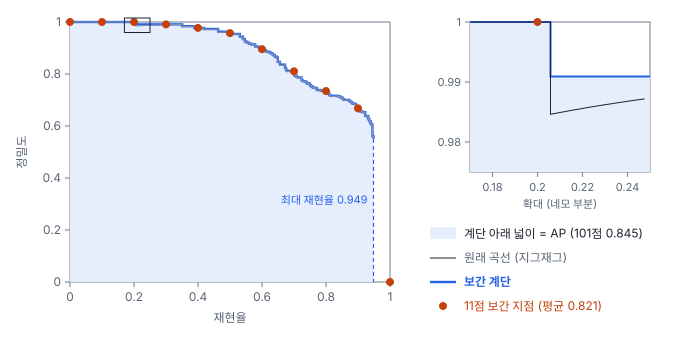
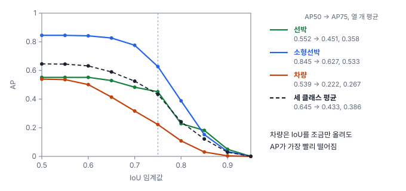

# 39강 mAP 읽는 법

## 이 강에서 얻는 것

- PR 곡선을 정밀도 보간으로 깎아 AP를 계산하고, 보간 방식(11점·모든 점·101점)에 따라 값이 달라지는 이유를 설명할 수 있음
- mAP50·mAP75·mAP50-95가 각각 무엇을 재는지 구분하고, 둘의 차이에서 위치 정밀도 문제를 읽을 수 있음
- COCO 평가 프로토콜의 이미지당 최대 탐지 수와 크기별 AP를 이해하고, 원격탐사 자료에 맞게 크기 구간을 바꿔 보고할 수 있음

## 1. AP: PR 곡선을 계단으로 깎아 넓이를 잼

38강에서 탐지를 점수 순으로 하나씩 받아들이며 정밀도·재현율을 계산해 PR 곡선을 그렸음. 이 곡선을 숫자 하나로 줄인 것이 **평균 정밀도(AP, average precision)**임. 재현율 0에서 1까지 정밀도를 평균한 값, 곧 곡선 아래 넓이임(18강의 PR-AUC와 같은 생각).

원래 곡선은 지그재그임. 점수 순으로 내려가다 오탐 하나가 끼면 정밀도가 뚝 떨어지고, 정탐이 이어지면 다시 조금씩 오름. 그래서 넓이를 재기 전에 **정밀도 보간(precision interpolation)**으로 곡선을 깎음. 재현율 $r$에서의 정밀도를 $r$ 이상의 재현율에서 얻을 수 있는 가장 높은 정밀도로 바꿈.

$$p_{\text{interp}}(r) = \max_{r' \ge r} p(r')$$

"재현율을 더 올리면서도 이만한 정밀도를 낼 수 있다면 여기서도 낸 것으로 쳐 준다"는 뜻임. 깎은 곡선은 오른쪽으로 갈수록 내려가기만 하는 계단이 됨.

34강에서 소개한 항만 타일과 가상 탐지기의 기본 탐지 결과로 소형선박을 보면, 정답 311척에 탐지 536개이고 탐지를 다 받아들여도 재현율은 0.949에서 멈춤. 그 오른쪽은 정밀도 0으로 셈.

## 2. 보간 방식 세 가지

계단 높이를 어디서 읽느냐가 대회·도구마다 다름.

- **11점 보간**(PASCAL VOC 2007): 재현율 0, 0.1, …, 1.0의 11곳에서 읽어 평균
- **모든 점 보간**(VOC 2010 이후): 재현율이 바뀌는 모든 곳에서 계단 넓이를 정확히 더함
- **101점 보간**(COCO): 재현율 0, 0.01, …, 1.0의 101곳에서 읽어 평균

| 클래스 | 정답 수 | 11점 | 모든 점 | 101점 |
|---|---|---|---|---|
| 선박 | 22 | 0.561 | 0.553 | 0.552 |
| 소형선박 | 311 | 0.821 | 0.850 | 0.845 |
| 차량 | 901 | 0.566 | 0.543 | 0.539 |

같은 결과인데 11점이 소형선박에서는 0.02~0.03 낮고 차량에서는 0.02~0.03 높음. 11점은 점 하나가 1/11의 무게를 가지기 때문임. 소형선박은 재현율 1.0 점이 0이 되어 1/11을 통째로 잃음(101점에서 0이 되는 점은 0.95~1.00의 6개뿐). 차량은 최대 재현율이 0.609인데(타일마다 상위 100개만 넣은 값. 38강의 0.704와의 차이는 4절) 0.6 점이 계단 높이 0.751을 읽어, 11점 중 7점(64%)이 값을 받음. 곡선이 실제로 덮는 재현율(61%)보다 넓게 쳐 주는 셈임. 모델 두 개의 차이가 0.01~0.03이면 방식만으로 뒤집힐 수 있으므로 보간 방식을 꼭 함께 적음.

## 3. mAP와 IoU 임계값

**mAP(mean average precision)**는 클래스별 AP의 평균임. 클래스마다 한 표를 주는 **매크로 평균**(17강)이라, 정답 22척인 선박이 901대인 차량과 같은 무게를 받음. IoU 0.5 기준으로 (0.552 + 0.845 + 0.539) ÷ 3 = 0.645이고, 정답 수로 가중하면 차량에 끌려 0.616임. 드문 클래스를 챙기려면 매크로가 맞지만, 22척이면 한 척이 재현율 0.045라 선박 AP가 크게 흔들린다는 점도 같이 봄.

정탐 판정의 IoU 임계값(38강)도 바꿔 봄. **mAP50**은 IoU 0.5, **mAP75**는 0.75 기준이고, **mAP50-95**는 0.50, 0.55, …, 0.95의 10개 임계값에서 mAP를 구해 평균함.

| 클래스 | AP50 | AP75 | AP50-95 |
|---|---|---|---|
| 선박 | 0.552 | 0.451 | 0.358 |
| 소형선박 | 0.845 | 0.627 | 0.533 |
| 차량 | 0.539 | 0.222 | 0.267 |
| 평균(mAP) | 0.645 | 0.433 | 0.386 |

mAP50은 "그 자리에서 찾았나", mAP50-95는 "박스를 얼마나 꼭 맞게 그렸나"까지 봄. mAP50은 괜찮은데 mAP50-95가 낮으면 위치 정밀도가 문제임. 차량은 9×4화소 남짓이라 1~2화소만 어긋나도 IoU가 크게 깎임(35강).

## 4. COCO 평가 프로토콜

**COCO 평가 프로토콜(COCO evaluation protocol)**은 COCO 자료와 함께 배포된 평가 코드(pycocotools)의 규칙이며, 많은 탐지 논문·도구가 따름. COCO는 mAP50-95를 그냥 AP라 부름. 101점 보간 말고도 두 규칙이 결과를 좌우함. 이 강의 직접 구현은 pycocotools 2.0.11과 소수 넷째 자리까지 같았음(mAP50-95 0.3861, mAP50 0.6453).

**이미지당 최대 탐지 수(maxDets)**: 클래스·이미지마다 점수 상위 maxDets개만 평가에 넣음. 기본은 1·10·100이고 요약 AP는 100으로 냄. 차량이 100대 넘는 항만 타일이 5장(최대 158대)이라 상한에 걸림. 38강은 상한 없이 세어 차량 최대 재현율이 0.704였음.

| maxDets | mAP50 | mAP50-95 | 차량 AP50 | 차량 재현율 |
|---|---|---|---|---|
| 1 | 0.163 | 0.110 | 0.010 | 0.009 |
| 10 | 0.366 | 0.237 | 0.086 | 0.082 |
| 100 | 0.645 | 0.386 | 0.539 | 0.609 |
| 300 | 0.670 | 0.397 | 0.612 | 0.704 |

모델은 그대로인데 상한만 올려 차량 AP50이 0.073 오름. pycocotools에서 `E.params.maxDets = [1, 10, 300]`으로 바꾸면 요약 첫 줄(mAP50-95)은 100을 고정으로 찾아 −1로 나오고, AP50·AP75·크기별 AP 줄은 300으로 계산됨(2.0.11 기준).

같은 상한 안에서 얼마나 찾았는지는 **평균 재현율(AR, average recall)**로 봄. IoU 임계값 10개에서 최대 재현율을 구해 평균하고 다시 클래스 평균을 냄. AR1 0.137, AR10 0.317, AR100 0.520임. 타일 하나에 객체가 수십~수백 개라 상한이 작으면 재현율이 바로 막힘.

**객체 크기별 AP**: 정답의 넓이(정답 파일의 area 값. COCO 원자료는 마스크 넓이, 이 자료는 수평 박스 넓이)가 $32^2$화소 미만이면 소형, $96^2$ 이상이면 대형, 그 사이는 중형으로 나눠 AP_S·AP_M·AP_L을 냄. 구간 밖 정답은 무시하고(그 정답과 짝지어진 탐지도 셈에서 뺌), 짝 없는 탐지도 박스 넓이가 구간 밖이면 무시함. 우리 자료는 소형 1,208개, 중형 20개, 대형 6개이고 AP_S 0.401, AP_M 0.461, AP_L 0.564임. AP_L은 선박 6척의 AP라 한 척마다 재현율이 0.167씩 움직이고, AP_S에는 소형 정답이 없는 선박 클래스가 빠짐.

## 5. 원격탐사에서 크기 구간이 어긋나는 문제

COCO 구간은 일상 사진을 두고 화소 넓이로 정한 것이라, 지상 표본 거리(GSD, 화소 하나가 덮는 지상 거리)에 따라 같은 물체가 다른 구간에 들어감. 4.5 m × 1.8 m 승용차의 박스 넓이는 0.5 m 위성영상에서 32화소²(기준 1,024화소²의 3%), 10 cm 드론 영상에서 810화소²(소형), 5 cm에서 3,240화소²(중형)임. 같은 10 cm라도 45° 돌아 서 있으면 수평 박스가 커져 약 1,980화소²로 중형이 됨. 위성영상은 거의 전부 소형이라 AP_S만 의미가 있고 AP_L은 정답 몇 개로 출렁임.

그래서 구간을 실제 길이(m)로 바꿔 보고하곤 함. 아래는 같은 COCO 규칙을 길이에 적용한 결과임(짝 없는 탐지는 예측 회전 박스의 길이로 구간을 정함).

| 길이 구간 | 정답 수 | 들어간 클래스 | AP50 | AP50-95 |
|---|---|---|---|---|
| 10 m 미만 | 977 | 차량, 소형선박 76척 | 0.643 | 0.362 |
| 10~40 m | 235 | 소형선박 | 0.879 | 0.561 |
| 40 m 이상 | 22 | 선박 | 0.724 | 0.460 |

GSD가 달라도 구간의 뜻이 같아 영상끼리 비교할 수 있음. 다만 40 m 이상의 AP50(0.724)이 선박 전체(0.552)보다 높은 것은, 선박으로 잘못 낸 탐지 43개 중 37개가 예측 길이 40 m 미만이라 이 구간에서 빠지고, 다른 구간에는 선박 정답이 없어 어디서도 세지 않기 때문임. 구간별 표에는 정답 수와 이 처리 규칙을 함께 적음.

## 현장에서는

협력사가 같은 탐지 결과를 자기 스크립트로 평가해 "mAP 0.672"라고 보냈고, 우리 보고서는 0.645임. 모델이 같으니 설정부터 맞춰 봄. 협력사 값은 모든 점 보간, 이미지당 상한 300의 mAP50이었음. 우리 결과를 그 설정으로 다시 계산하니 0.672였고, 상한만 300으로 바꿔도 0.670이었음. 차이 0.027은 전부 평가 설정에서 나온 셈임.

숫자 하나로 비교할 때는 지표(mAP50인지 50-95인지), 보간 방식, maxDets, 크기 구간, 평가 도구와 버전, 시험 자료를 함께 적음. 표 아래 한 줄이면 됨. "mAP50-95, COCO 101점, maxDets 100, pycocotools 2.0.11, 시험 타일 24장"처럼 씀.

## 헷갈리는 쌍

- **AP vs mAP**: AP는 한 클래스의 PR 계단 넓이, mAP는 그 클래스 평균임. COCO와 여러 도구는 평균한 값도 AP라 부르므로 클래스 평균인지 확인함.
- **mAP50 vs mAP50-95**: mAP50은 찾았는지, mAP50-95는 꼭 맞게 그렸는지까지 봄. AP75가 AP50보다 크게 떨어지는 클래스가 위치 정밀도가 약한 클래스임.
- **COCO 크기 구간 vs 실제 크기**: COCO 구간은 화소 넓이라 GSD와 객체 방향에 따라 바뀜. 실제 크기 구간은 미터라 영상이 달라도 뜻이 같음.
- **AP vs AR**: AP는 점수 순서와 정밀도까지 보고, AR은 상한 안에서 얼마나 찾았는지만 봄. 오탐이 많아도 AR은 높을 수 있음.

## 이렇게 지시받음

> 지시: "mAP50은 괜찮은데 50-95가 낮네. 박스 위치부터 봐."

찾기는 하는데 박스가 정답과 꼭 맞지 않는다는 뜻임. 클래스별 AP를 IoU 임계값마다 펼쳐 어느 클래스가 빨리 떨어지는지 보고(이 자료는 차량), 짝지은 박스의 IoU 분포와 어긋남(35강), 위치 오차가 전체 손실에서 차지하는 몫(52강)을 확인함.

> 지시: "주차장 타일은 차가 백 대 넘어. maxDets 300으로 다시 뽑고 설정 같이 적어."

상한 100에 걸려 빠진 차량을 평가에 넣으라는 뜻임. 차량 AP50이 0.539에서 0.612로 오름. 모델 쪽 출력 상한(도구마다 기본값이 다름)도 300 이상인지 확인하고, 이전 보고와 비교할 수 있게 상한 100의 값과 나란히 적음.

> 지시: "크기별 AP는 COCO 구간 말고 미터로 나눠서 정답 수랑 같이 보고해."

화소 넓이 구간은 GSD에 따라 뜻이 바뀌고, 대형이 몇 개뿐이라 AP_L이 출렁이기 때문임. 길이 구간(예: 10 m 미만·10~40 m·40 m 이상)을 정하고, 구간 밖 정답과 짝 없는 탐지를 어떻게 처리했는지 함께 적음.

## 요약

- AP는 정밀도 보간(각 재현율 이상에서의 최대 정밀도)으로 깎은 PR 계단 아래 넓이임
- 11점·모든 점·101점 보간은 같은 결과에도 0.03 가까이 다른 값을 내므로 방식을 적음
- mAP는 클래스 AP의 매크로 평균이고, mAP50-95는 IoU 0.50~0.95 열 개의 평균이라 위치 정밀도까지 반영함
- COCO 평가 프로토콜의 이미지당 최대 탐지 수와 화소 넓이 크기 구간은 원격탐사 자료에서 결과를 크게 바꿈
- 크기 구간은 실제 길이로 바꿔 정답 수와 함께 보고하고, 숫자 하나를 비교할 때는 지표·보간·maxDets·도구를 함께 적음

## 핵심 용어

| 한글 | 영문 |
|---|---|
| 평균 정밀도 | Average Precision (AP) |
| 정밀도 보간 | Precision Interpolation |
| 11점 보간 / 101점 보간 | 11-Point / 101-Point Interpolation |
| 평균 정밀도의 클래스 평균 | Mean Average Precision (mAP) |
| COCO 평가 프로토콜 | COCO Evaluation Protocol |
| 이미지당 최대 탐지 수 | Maximum Detections per Image (maxDets) |
| 객체 크기별 AP | AP by Object Size (AP_S / AP_M / AP_L) |
| 평균 재현율 | Average Recall (AR) |
| 매크로 평균 | Macro Average |
| 지상 표본 거리 | Ground Sample Distance (GSD) |
