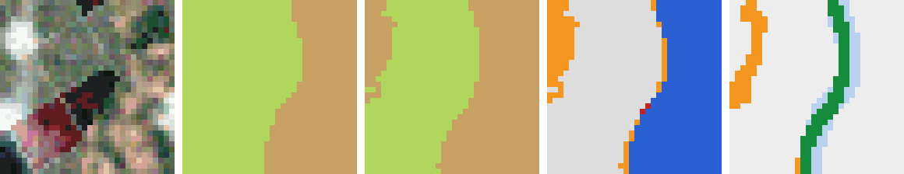
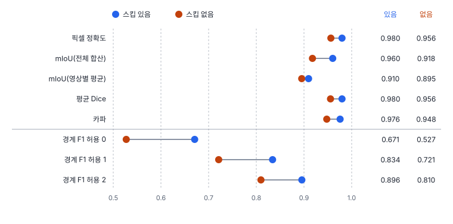

# 40강 분할 지표

## 이 강에서 얻는 것

- 픽셀 정확도가 넓은 클래스에 끌려가는 이유를 계산으로 보이고, 클래스별 IoU·mIoU를 계산 방식(전체 합산·영상별 평균)과 함께 보고할 수 있음
- Dice를 F1·IoU와 바꿔 읽고, 면적 지표가 못 보는 경계 품질을 경계 F1 점수로 잴 수 있음
- 카파와 마스크 AP가 무엇을 재는지 구분하고, 산출물 목적(면적·경계·개수)에 맞는 지표를 고를 수 있음

## 1. 픽셀 정확도: 넓은 클래스가 점수를 정함

의미 분할(34강)은 화소마다 클래스를 내므로 화소를 표본 삼아 혼동행렬(17강)을 만듦. 대각선 합을 전체 화소 수로 나눈 값이 **픽셀 정확도(pixel accuracy, PA)**이고, 17강의 전체 정확도와 같은 값임.

문제는 화소 수가 많은 클래스가 점수를 정한다는 것임. 바다가 90%(90만 화소), 육지 8만, 양식장 2만 화소인 연안 영상을 생각함.

| 예측 | 픽셀 정확도 | IoU 바다·육지·양식장 | mIoU | 카파 |
|---|---|---|---|---|
| A: 전부 바다로 칠함 | 0.900 | 0.900 · 0 · 0 | 0.300 | 0.000 |
| B: 양식장 절반을 바다로 놓침 | 0.981 | 0.979 · 0.916 · 0.455 | 0.783 | 0.892 |

A는 아무것도 찾지 않았는데 0.90이고, B는 양식장 절반을 놓쳐(바다·육지도 화소 몇천 개씩 서로 틀림) 예측 면적이 참 면적의 60%뿐인데 0.98임. 픽셀 정확도만으로는 둘 다 좋아 보임.

5부 U-Net(33강, best 가중치)의 시험 타일 900장 결과는 스킵 연결 있음 0.980, 없음 0.956임. 이 자료는 여섯 클래스의 화소 비율이 15~18%로 고르게 만들어져 있어 픽셀 정확도가 크게 속이지 않지만, 실제 연안 영상은 위 예처럼 치우치는 경우가 많음.

## 2. 클래스별 IoU와 mIoU, 그리고 계산 방식

클래스 하나를 양성으로 보면 화소마다 TP·FP·FN이 나옴. 그 클래스의 **IoU**는 마스크 IoU(35강)와 같은 식임.

$$\mathrm{IoU}_k = \frac{\mathrm{TP}_k}{\mathrm{TP}_k + \mathrm{FP}_k + \mathrm{FN}_k}$$

예측과 정답이 겹친 화소를 둘 중 하나라도 그 클래스인 화소로 나눈 값임. 맞힌 배경(TN)은 식에 없어서, 넓은 바다를 맞혀도 양식장 IoU는 오르지 않음. 클래스별 IoU를 단순 평균한 것이 **평균 IoU(mean IoU, mIoU)**로, 17강의 매크로 평균처럼 클래스마다 한 표를 줌. 위 B의 0.783은 양식장 0.455가 끌어내린 값임.

U-Net의 클래스별 IoU는 스킵 있음·없음이 수계 0.940·0.807, 갯벌 0.935·0.825이고 나머지 네 클래스는 0.01 미만 차이임. 33강에서 본 대로 스킵 없음이 시험 수계 타일 17장을 절반 넘게 갯벌로 칠한 몫이 큼.

**같은 예측이라도 mIoU 계산 방식이 둘임.**

- **전체 합산**: 900장의 화소를 모두 모아 혼동행렬 하나를 만든 뒤 클래스별 IoU를 구함. 스킵 있음 0.960, 없음 0.918
- **영상별 평균**: 타일마다 mIoU를 구해 평균냄. 0.910, 0.895

영상별 평균이 낮은 까닭은 작은 분모임. 한 클래스뿐인 타일에서 화소 몇 개만 다른 클래스로 칠해도 그 클래스의 IoU가 0이 되어 그 타일의 mIoU가 반 가까이 깎임(스킵 있음은 540장 중 34장이 이런 타일). 타일 구석에 조금 걸친 클래스도 몇 화소 틀리면 IoU가 크게 흔들림. 예측에만 있고 정답에 없는 클래스를 빼고 평균하면 스킵 있음이 0.957로 또 달라짐. 공개 벤치마크(PASCAL VOC, Cityscapes)는 전체 합산을 쓰지만, 라이브러리는 둘 다 지원하거나 기본값이 서로 달라 **도구마다 다름**. 두 모델의 차이도 0.043과 0.014로 달라지므로 비교표에는 계산 방식을 함께 적음.

## 3. Dice: 화소의 F1

**다이스 계수(Dice coefficient, DSC)**는 겹친 화소 수의 두 배를 두 마스크 크기의 합으로 나눈 값임.

$$\mathrm{Dice} = \frac{2\,\mathrm{TP}}{2\,\mathrm{TP} + \mathrm{FP} + \mathrm{FN}} = \frac{2\,\mathrm{IoU}}{1 + \mathrm{IoU}}$$

화소 단위 정밀도와 재현율의 조화평균, 곧 F1(17강)과 같은 값임. IoU와 한 식으로 바뀌므로 클래스 하나에서 두 모델의 순서는 같고 값만 다름. 수계 IoU 0.9395는 Dice 0.9688임. Dice는 IoU보다 늘 크거나 같고, 차이는 IoU 0.414 근처에서 가장 커서 0.172임. 다만 클래스 평균끼리는 정확히 바뀌지 않음. 스킵 없음의 평균 Dice는 0.9556인데 mIoU 0.9177을 식에 넣으면 0.9571임.

Dice는 손실로도 씀. 예측 확률로 계산한 Dice를 1에서 뺀 **Dice 손실**은 클래스 면적이 작아도 그 클래스의 겹침 비율을 직접 키우므로, 병변이 작은 의료 영상이나 수계·건물이 드문 원격탐사 분할에서 교차 엔트로피와 함께 쓰는 경우가 많음.

## 4. 경계 F1 점수: 면적이 못 보는 것

경계가 2화소 밀려도 넓은 객체의 IoU는 거의 그대로임. 100×100화소 정사각형을 옆으로 2화소 밀면 IoU는 0.961임. 해안선·건물 외곽선처럼 선 자체가 산출물이면 이 2화소(0.5 m 영상에서 1 m)가 중요함.

**경계 F1 점수(boundary F1 score, BF score)**는 경계 화소만 따로 봄. 정답과 예측에서 경계 화소(3×3 이웃에 다른 라벨이 있는 화소)를 뽑고, 허용 거리 $d$화소를 정함.

- 경계 정밀도: 예측 경계 화소 중 정답 경계에서 $d$ 안에 있는 비율
- 경계 재현율: 정답 경계 화소 중 예측 경계에서 $d$ 안에 있는 비율
- 경계 F1: 둘의 조화평균

위 정사각형은 $d$ = 0·1·2에서 0.50·0.75·1.00임. 원래 BF 점수(추르카 등, 2013년 공개)는 클래스마다 경계를 따로 재서 영상별로 평균하고 허용 거리를 영상 대각선의 0.75%로 두었으며, 이 강은 라벨이 바뀌는 곳 전체를 한 번에 본 간단한 변형임. 허용 거리를 화소로 줄지 미터로 줄지, 영상 크기에 비례해 줄지는 도구마다 다르므로 함께 적음.

U-Net에서 경계 F1은 허용 0·1·2화소에서 스킵 있음 0.671·0.834·0.896, 없음 0.527·0.721·0.810임. 허용 0에서 차이가 14.4%p로 mIoU 차이(4.3%p)보다 크고, mIoU 차이는 주로 수계·갯벌 혼동(정확도 0.5 미만 타일이 스킵 없음 17장, 있음 3장)에서, 경계 F1 차이는 경계 그 자체에서 나옴. 같은 모델 비교라도 무엇을 보느냐에 따라 결론의 근거가 달라짐.

## 5. 카파와 마스크 AP

**코헨 카파 계수(Cohen's kappa, κ)**는 우연 일치율을 뺀 정확도임(17강). 1절 예의 A는 행·열 합계로 정한 우연 일치율 $p_e$가 0.90이라 카파가 0이 되어 함정을 잡아냄. 그러나 U-Net 자료는 클래스가 고르게 나뉘어 $p_e$가 0.167 근처에 머물므로 카파(0.976·0.948)는 픽셀 정확도의 눈금만 바꾼 값임. 17강의 비판대로 카파보다 양·배치 불일치가 쓸모 있음. 스킵 없음의 불일치 0.044 중 양 불일치가 0.034로, 수계 면적 −18.8%, 갯벌 +20.7%의 면적 오차임.

**마스크 AP(mask AP)**는 인스턴스 분할 지표임. 객체마다 마스크·점수를 받아 마스크 IoU로 정답과 짝짓고, 39강의 AP를 그대로 계산함. 객체 단위라 붙은 두 객체를 한 마스크로 내면 많아야 하나만 짝지어지고 나머지는 미탐이 되며, 같은 객체에 마스크를 두 번 내면 하나는 오탐이 됨. 의미 분할의 mIoU는 개수를 보지 않음.

34강에서 소개한 항만 타일과 가상 탐지기의 기본 탐지 결과에서 정답과 탐지의 회전 박스 다각형을 마스크 대신 써서 pycocotools로 계산하면(크기 구간 없이) 마스크 AP 0.321, AP50 0.621, AP75 0.295로, 같은 탐지를 회전 IoU로 잰 값(41강, 0.325·0.625)과 거의 같음. 같은 탐지의 수평 박스 AP(39강)는 0.386·0.645·0.433임. 몸체에 꼭 맞는 다각형은 배경이 섞인 수평 박스보다 같은 위치·각도 어긋남에 IoU가 더 떨어지고, 이 가상 탐지기는 각도를 일부러 흔들리게 만들었으므로 엄격한 임계값에서 크게 낮아진 것으로 보임. 실제 화소 마스크가 아니라 다각형으로 대신한 값임.

## 6. 무엇을 보고할지

| 산출물 목적 | 주 지표 | 함께 적을 것 |
|---|---|---|
| 클래스별 면적(피복 면적, 양식장 총면적) | 클래스별 IoU, 면적 오차 | mIoU 계산 방식 |
| 선 자체(해안선, 건물 외곽선) | 경계 F1(허용 거리 명시) | 클래스별 IoU |
| 객체 개수·객체별 면적 | 마스크 AP, AP50 | 개수 오차 |
| 기존 보고 양식 유지 | 픽셀 정확도, 카파 | 클래스별 IoU, 양·배치 불일치 |

평균 하나보다 클래스별 값이 먼저이고, 클래스 비율과 계산 방식을 함께 적음.

## 현장에서는

연안 양식장 분할 모델 보고서에 "정확도 98%"가 적혀 있었음. 장면의 90%가 바다라, 1절의 B처럼 양식장 절반을 놓쳐도 나오는 값임. 양식장 IoU를 따로 뽑자 0.45였고, 예측 면적은 참 면적의 60%였음.

보고서를 고쳐 클래스별 IoU·Dice와 클래스별 면적 오차를 앞에 두고, mIoU는 전체 합산이라고 적었음. 시설 개수도 요구되어 의미 분할 결과를 연결요소로 세었는데, 붙은 시설이 한 덩어리가 되어 개수가 모자랐음. 개수는 인스턴스 분할과 마스크 AP로 따로 평가하기로 함(분할 오차 진단은 53강).

## 헷갈리는 쌍

- **IoU vs Dice**: 한 식(Dice = 2IoU/(1+IoU))으로 바뀌어 순서가 같고, Dice가 늘 크거나 같음. 논문끼리 비교할 때는 같은 지표로 바꿔 봄.
- **픽셀 정확도 vs mIoU**: 픽셀 정확도는 화소마다 한 표라 넓은 클래스가 정하고, mIoU는 클래스마다 한 표이며 맞힌 배경을 세지 않음.
- **전체 합산 mIoU vs 영상별 평균 mIoU**: 같은 예측에서 0.960과 0.910이 나옴. 영상별 평균은 작은 클래스·잡티에 민감함.
- **의미 분할 mIoU vs 마스크 AP**: mIoU는 클래스별 화소 겹침, 마스크 AP는 점수 순으로 매긴 객체 짝짓기임. 개수가 목적이면 마스크 AP를 봄.

## 이렇게 지시받음

> 지시: "모델 비교표에 mIoU 넣을 때 계산 방식 적어. 전체 합산인지 영상별인지."

같은 예측도 방식에 따라 0.05쯤 달라지고 두 모델의 차이도 달라짐. 쓰는 라이브러리의 설정을 확인해 표 아래에 적고, 정답에 없는 클래스를 어떻게 처리했는지도 밝힘.

> 지시: "해안선 추출이니까 IoU 말고 경계 F1로 봐. 허용은 1화소."

선의 위치가 산출물이므로 경계 지표를 주로 보라는 뜻임. 10 m 영상이면 허용 1화소가 10 m이므로 해상도가 다른 영상끼리는 미터로 맞춰 비교함.

> 지시: "그 논문 Dice 0.90이래. 우리 IoU랑 비교하게 바꿔 줘."

IoU = Dice/(2 − Dice)라 0.90은 IoU 0.818임. 클래스별 값이면 그대로 바꾸고, 평균 Dice면 정확히 바뀌지 않으며 계산 방식도 다를 수 있으니 근사로 다룸.

## 요약

- 픽셀 정확도는 넓은 클래스가 정함. 바다 90% 영상에서 전부 바다로 칠해도 0.90임
- 클래스별 IoU는 TP/(TP+FP+FN)이고 mIoU는 그 평균임. 전체 합산과 영상별 평균이 다르므로(U-Net 0.960 대 0.910) 방식을 밝힘
- Dice는 화소의 F1이고 2IoU/(1+IoU)라 순서는 IoU와 같음. 작은 클래스 분할에서 손실로도 씀
- 경계 F1은 허용 거리 안의 경계 일치를 재며, 면적 지표가 못 보는 경계 품질 차이(U-Net 0.671 대 0.527)를 드러냄
- 카파는 클래스가 고르면 픽셀 정확도와 거의 같은 정보이고, 마스크 AP는 객체 단위 지표임. 목적(면적·경계·개수)에 맞춰 고름

## 핵심 용어

| 한글 | 영문 |
|---|---|
| 픽셀 정확도 | Pixel Accuracy (PA) |
| 클래스별 IoU / 평균 IoU | Per-class IoU / Mean Intersection over Union (mIoU) |
| 다이스 계수 / Dice 손실 | Dice Coefficient (DSC) / Dice Loss |
| 경계 F1 점수 | Boundary F1 Score (BF score) |
| 허용 거리 | Tolerance Distance |
| 코헨 카파 계수 | Cohen's Kappa (κ) |
| 마스크 AP | Mask Average Precision (Mask AP) |
