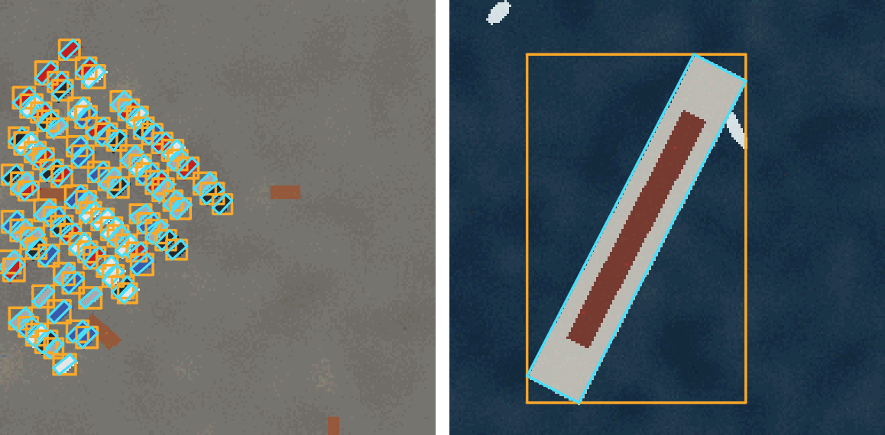
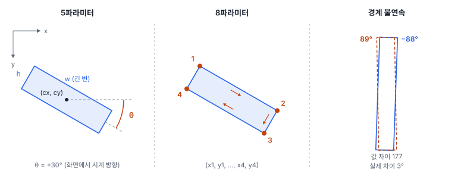
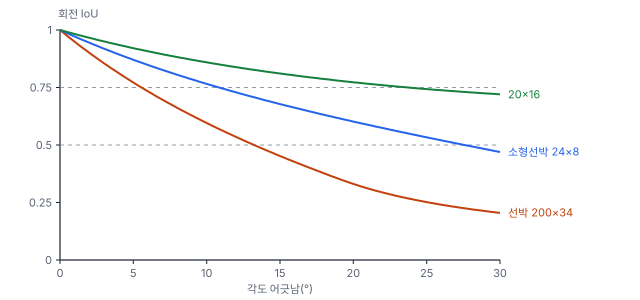

# 41강 회전 박스

## 이 강에서 얻는 것

- 위에서 내려다본 영상에서 수평 박스가 왜 모자란지(배경 채움, 이웃끼리 겹침) 수치로 설명하고 회전 박스로 바꿀 때를 판단할 수 있음
- 5파라미터와 8파라미터 표현을 서로 바꾸고, 각도 규약이 다른 도구 사이에서 같은 상자를 같게 옮길 수 있음
- 각도의 경계 불연속 문제와 회전 IoU의 성질을 알고, 회전 박스 탐지의 mAP를 수평 박스 결과와 섞어 비교하지 않음

## 1. 수평 박스와 회전 박스

지금까지의 박스는 변이 영상 축과 나란한 **수평 박스(HBB, horizontal bounding box)**였음. 좌표는 $(x_1, y_1, x_2, y_2)$ 네 개임. 거리 사진의 사람·차는 대개 똑바로 서 있어서 이것으로 충분함. 그런데 위성·항공 영상은 위에서 내려다보므로 배·차·건물이 아무 방향으로나 놓임. 그래서 객체 방향으로 돌린 **회전 박스(OBB, oriented bounding box)**를 씀.

수평 박스의 문제는 둘임. 첫째, 비스듬한 길쭉한 객체는 박스 안 대부분이 배경임. 긴 변 $w$, 짧은 변 $h$인 객체가 $\theta$만큼 돌면 수평 박스의 가로·세로는 다음과 같음.

$$W = w\lvert\cos\theta\rvert + h\lvert\sin\theta\rvert, \qquad H = w\lvert\sin\theta\rvert + h\lvert\cos\theta\rvert$$

객체 넓이를 수평 박스 넓이로 나눈 **채움 비율** $wh/(WH)$은 길이 100 m(200화소)·폭 34화소 선박이 0°에서 1이지만 15°에서 0.398, 45°에서 0.248임. 수평 박스의 4분의 3이 바다라는 뜻임. 34강에서 소개한 항만 타일의 정답에서는 채움 비율 중앙값이 선박 0.779, 소형선박 0.761, 차량 0.833이고 가장 낮은 선박은 0.277이었음.

둘째, 나란히 붙은 객체의 수평 박스가 크게 겹침. 같은 선박 두 척이 45°로 2 m(4화소) 떨어져 나란히 서 있으면 두 회전 박스는 전혀 겹치지 않지만(IoU 0) 수평 박스끼리의 IoU는 0.540임. NMS 임계값이 0.5면 점수가 낮은 쪽 배의 박스가 지워짐(37강).

## 2. 5파라미터와 8파라미터

**5파라미터 표현**은 $(c_x, c_y, w, h, \theta)$임. 중심, 긴 변, 짧은 변, 그리고 긴 변이 $x$축과 이루는 각임. 영상 좌표는 $y$가 아래로 커지므로(25강) $\theta$가 +이면 화면에서 **시계 방향**으로 돎. 수학 교과서의 반시계 방향과 반대라 그림으로 확인해야 함.

**8파라미터 표현**은 꼭짓점 네 개 $(x_1, y_1, \dots, x_4, y_4)$임. 5파라미터 $(100, 60, 40, 12, 30°)$를 꼭짓점으로 바꾸면 (85.7, 44.8), (120.3, 64.8), (114.3, 75.2), (79.7, 55.2)이고, 화면에서 시계 방향 순서임. 5파라미터에서 8파라미터로는 정확히 바뀌지만, 반대 방향은 꼭짓점 넷이 직사각형이 아닐 수 있어서(손으로 찍은 라벨은 비뚤어진 사각형이기 쉬움) 그 점들을 감싸는 최소 넓이 직사각형으로 바꾸며 정보가 조금 사라짐.

꼭짓점 순서에는 규칙이 있음. DOTA(6절) 라벨은 꼭짓점을 시계 방향으로 적고, 선박·비행기·차량처럼 앞뒤가 있는 객체는 첫 꼭짓점이 대개 머리(앞쪽)를 가리키게, 앞뒤가 없는 객체는 왼쪽 위 점부터 적음. 그래서 8파라미터 라벨에는 선수 방향이 남음. 반면 긴 변 기준 5파라미터는 $\theta$와 $\theta + 180°$가 같은 상자라 선수와 선미를 구분하지 못함. 라벨 형식 사이의 변환 절차는 44강에서 다룸.

## 3. 각도 정의 규약

같은 상자도 **각도 정의 규약**에 따라 숫자가 달라짐. 직사각형은 180° 돌리면 제자리이고, 긴 변과 짧은 변을 바꿔 부르면 90°마다 같은 모양이 되므로 범위와 기준 변을 정해야 함.

- **긴 변 기준 90° 규약**: $w \ge h$로 두고 $\theta \in [-90°, 90°)$. 이 자료의 규약임
- **긴 변 기준 135° 규약**: $w \ge h$, $\theta \in [-45°, 135°)$. 경계가 수평·수직이 아닌 −45°에 놓임
- **OpenCV 방식**: `cv2.minAreaRect`가 돌려주는 (너비, 높이)는 긴 변·짧은 변 순서가 아니고 각도 범위도 버전에 따라 달랐음(직접 돌려 보니 4.5.1~4.12는 (0°, 90°], 그 전과 4.13은 [−90°, 0°)). 이 자료를 만든 OpenCV 4.13에서는 위 규약의 (200, 34, 30°) 상자가 크기 (34, 200), 각도 −60°로 나왔음

MMRotate 같은 회전 탐지 도구는 이런 규약을 le90·le135·oc 같은 이름으로 골라 쓰게 함. 도구를 섞을 때는 상자 하나를 꼭짓점으로 바꿔 그려 보는 것이 가장 확실함.

## 4. 경계 불연속 문제

긴 변 90° 규약에서 거의 세로인 배는 −88°와 89°처럼 범위의 양 끝 값을 가짐. 실제 방향 차이는 3°이고 회전 IoU도 0.855로 높은데, 각도를 숫자로 바로 회귀하면 오차가 177이라 손실이 갑자기 커짐. 이것이 **경계 불연속 문제**임. 이 자료의 부두는 세로로 놓여 나란히 댄 배도 거의 세로라서, 항만 타일 정답의 선박 22척 중 17척이 $\lvert\theta\rvert > 80°$였음(음수 12, 양수 5). 문제가 데이터가 몰린 바로 그곳에서 생김.

긴 변과 짧은 변이 거의 같은 물체도 문제임. 20×19.6 상자를 10°로 둔 것과 19.6×20을 −80°로 둔 것은 같은 상자(회전 IoU 1.0)이지만, 예측의 $w$가 $h$보다 조금만 작아져도 규약에 맞추느라 변을 바꾸고 각도가 90° 튐.

대처는 각도를 끊김 없는 값으로 바꾸거나 경계를 피하는 것임.

- **원 위의 좌표로**: $(\cos 2\theta, \sin 2\theta)$를 회귀함. 180°마다 같은 상자이므로 각을 두 배로 해서 한 바퀴로 만듦. −88°와 89°의 거리는 0.105로, 10°와 13°의 거리와 같음
- **분류로**: 각도를 구간 클래스로 나누고 양 끝 구간을 이웃으로 이어 라벨을 퍼뜨림(CSL, 양·옌, 2020년 공개)
- **경계를 데이터가 적은 방향으로**: 세로 선박이 많으면 경계가 −45°인 135° 규약이 낫지만, 대신 −45°(135°와 같은 방향) 근처 객체가 경계에 걸림
- **가우시안 분포 거리로**: 상자를 2차원 정규분포로 바꾸고 두 분포의 거리를 손실로 씀(GWD·KLD, 양 등, 2021년 공개). $(w, h, \theta)$와 $(h, w, \theta + 90°)$, $\theta$와 $\theta + 180°$가 같은 분포가 되어 두 불연속이 함께 사라짐. 다만 정사각형에 가까울수록 분포가 원에 가까워져 각도를 거의 배우지 못함

## 5. 회전 IoU

**회전 IoU**는 두 회전 박스를 다각형으로 보고 교집합 넓이를 합집합 넓이로 나눈 값임(정의는 35강의 IoU와 같고 넓이 계산만 다각형). 중심과 크기가 같고 각도만 다르면 길쭉할수록 IoU가 빨리 떨어짐. 선박 200×34는 5°에 0.772, 10°에 0.596이고 약 13°에서 0.5 아래로 내려감. 소형선박 24×8은 0.871·0.766, 정사각형에 가까운 20×16은 0.921·0.859임.

34강의 가상 탐지기 출력을 세 가지 조합으로 평가했음. 중복 상자를 지울 때 겹침을 회전 IoU로 재는 것이 **회전 NMS**임.

| NMS | 평가 IoU | 상자 수 | mAP50 | mAP50-95 |
|---|---|---|---|---|
| 수평 박스 0.5 | 수평 박스 IoU | 1,494 | 0.645 | 0.386 |
| 수평 박스 0.5 | 회전 IoU | 1,494 | 0.625 | 0.325 |
| 회전 박스 0.5 | 회전 IoU | 1,751 | 0.588 | 0.308 |

둘째 줄은 첫 줄과 **같은 탐지**인데 IoU만 바꿨음. 엄격한 임계값이 섞인 mAP50-95가 크게 떨어짐. 셋째 줄(회전 NMS)의 AP75는 첫 줄보다 선박 0.451 → 0.303, 소형선박 0.627 → 0.435, 차량 0.222 → 0.112로 내려감. 이 가상 탐지기는 작은 객체일수록 각도가 많이 흔들리게 만들어서 차량이 절반으로 줄었음. 회전 NMS를 같은 0.5로 걸면 상자가 오히려 더 남는데, 한 객체의 중복 상자끼리도 각도가 흔들려 회전 IoU가 낮게 나오기 때문임. 이 자료에서는 회전 NMS를 0.3으로 낮추면 1,302개, 0.653·0.336이었음. 회전 NMS의 임계값은 따로 맞춰야 함.

결론적으로 수평 박스 mAP와 회전 박스 mAP는 같은 탐지라도 다른 숫자이므로, 보고할 때 어느 IoU인지 반드시 적음.

## 6. DOTA 데이터셋

**DOTA 데이터셋**은 항공·위성 영상의 회전 박스 탐지 벤치마크임. 영상은 Google Earth와 GF-2·JL-1 위성 등에서 모았고 한 장이 약 800×800~4,000×4,000화소(v1.0 기준)로 크며, 라벨은 한 줄에 `x1 y1 x2 y2 x3 y3 x4 y4 클래스 difficult`(8파라미터 + 클래스 + 어려운 객체 표시)임. v1.0은 클래스 15개, v1.5는 컨테이너 크레인을 더해 16개(아주 작은 객체도 추가로 라벨링), v2.0은 공항·헬기장을 더해 18개임. 평가는 PASCAL VOC 방식의 mAP(IoU 0.5)를 따르되, 회전 박스 과제는 IoU를 다각형으로 잼. 영상이 커서 보통 타일로 잘라 학습함(43강).

## 현장에서는

0.5 m 위성영상에서 항만 선박을 탐지해 폴리곤과 선박 길이를 납품하는 과제임. 항해 중인 배는 아무 방향으로나 놓이고, 비스듬한 배는 수평 박스로 길이를 잴 수 없으므로 회전 박스로 정함. 길이는 $w \times 0.5$ m로 바로 나옴. 라벨러에게는 DOTA처럼 선수 쪽 꼭짓점부터 시계 방향으로 찍게 해 방향 정보를 남김. 학습 규약은 긴 변 90°인데 부두가 세로 방향이라 댄 배가 거의 세로여서 ±90° 경계에 몰리므로 각도를 $(\cos 2\theta, \sin 2\theta)$로 회귀하는 헤드를 고름. 계약서의 "mAP50 0.6 이상"이 어느 IoU 기준인지 먼저 확인함. 이 강의 가상 탐지기라면 수평 박스 기준 0.645, 회전 NMS·회전 IoU 기준 0.588로 합격 여부가 갈림.

## 헷갈리는 쌍

- **5파라미터 vs 8파라미터**: 5파라미터는 직사각형만 나타내고 각도 규약이 필요함. 8파라미터는 아무 사각형이나 나타내고 꼭짓점 순서 규칙이 필요함. 8 → 5는 최소 넓이 직사각형으로 근사함.
- **긴 변 90° 규약 vs OpenCV 방식**: 긴 변 규약은 $w$가 늘 긴 변이고 경계가 ±90°(세로)임. OpenCV 방식은 너비가 긴 변이라는 보장이 없고 범위가 버전에 따라 달랐음. 같은 상자가 (200, 34, 30°)와 (34, 200, −60°, OpenCV 4.13)로 나옴.
- **수평 박스 IoU vs 회전 IoU**: 같은 탐지라도 회전 IoU가 엄격함(이 자료 mAP50-95 0.386 대 0.325). 길쭉한 객체에서는 각도 몇 도가 IoU를 크게 깎음.

## 이렇게 지시받음

> 지시: "45° 주차장에서 옆 차가 자꾸 지워져. OBB로 바꿔 봐."

비스듬히 붙은 차의 수평 박스가 서로 겹쳐 NMS가 이웃을 지운다는 판단임. 먼저 이웃 정답끼리의 수평 박스 IoU가 NMS 임계값을 실제로 넘는지 확인함(37강). 넘으면 회전 박스 라벨과 회전 NMS로 바꾸되, 회전 NMS 임계값은 중복 상자가 남지 않는지 보며 다시 맞추고, 효과는 그 주차장의 재현율로 따로 확인함.

> 지시: "라벨은 DOTA 형식인데 학습 코드는 le90이야. 변환하고 각도 분포 뽑아 봐."

8파라미터를 최소 넓이 직사각형으로 바꾼 뒤 긴 변 90° 규약으로 맞추라는 뜻임. 각도 히스토그램이 ±90° 양 끝에 몰리면 경계 불연속을 의심하고, 상자 몇 개를 꼭짓점으로 되돌려 원래 라벨 위에 그려 확인함.

> 지시: "회전 박스 모델이 예전 수평 박스 모델보다 mAP가 낮다는데, 기준 맞춰서 다시 비교해."

두 숫자가 다른 IoU로 계산되었을 수 있음. 회전 모델의 출력을 수평 박스로도 바꿔 같은 수평 박스 IoU로 한 번, 회전 IoU로 한 번 평가해 표로 나란히 놓음.

## 요약

- 위에서 내려다본 영상의 비스듬한 길쭉한 객체는 수평 박스 안이 대부분 배경이고(200×34 선박 45°에서 채움 0.248), 나란한 이웃의 수평 박스가 크게 겹쳐(IoU 0.540) NMS가 이웃을 지움
- 회전 박스는 5파라미터 $(c_x, c_y, w, h, \theta)$ 또는 꼭짓점 8파라미터로 적음. 영상 좌표에서 +각도는 시계 방향
- 각도 규약(긴 변 90°·135°, OpenCV 방식)마다 같은 상자의 숫자가 다르므로 도구를 섞을 때 꼭짓점으로 확인함
- 범위 양 끝(−88°와 89°)과 정사각형에 가까운 물체에서 각도가 튀는 경계 불연속은 $(\cos 2\theta, \sin 2\theta)$, 각도 분류, 가우시안 거리 손실로 피함
- 회전 IoU는 길쭉할수록 각도에 민감해 같은 탐지라도 mAP가 낮게 나오므로 어느 IoU인지 밝힘. DOTA는 v1.0 15·v1.5 16·v2.0 18클래스의 회전 박스 벤치마크임

## 핵심 용어

| 한글 | 영문 |
|---|---|
| 수평 박스 / 회전 박스 | Horizontal Bounding Box (HBB) / Oriented Bounding Box (OBB) |
| 채움 비율 | Fill Ratio |
| 5파라미터 표현 / 8파라미터 표현 | Five-Parameter / Eight-Parameter Representation |
| 각도 정의 규약 | Angle Convention |
| 긴 변 기준 규약 | Long-Edge Definition |
| 경계 불연속 문제 | Boundary Discontinuity Problem |
| 가우시안 바서슈타인 거리 / KL 발산 손실 | Gaussian Wasserstein Distance (GWD) / KLD Loss |
| 회전 IoU / 회전 NMS | Rotated IoU / Rotated NMS |
| DOTA 데이터셋 | Dataset for Object deTection in Aerial images (DOTA) |
