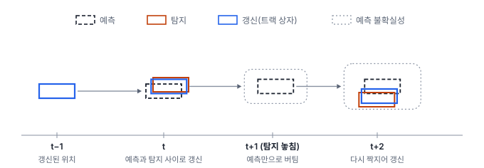
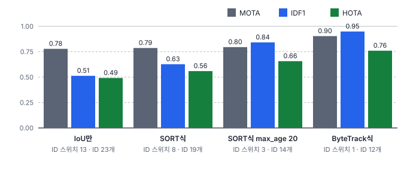
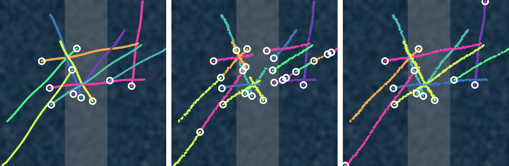

# 42강 다중 객체 추적

## 이 강에서 얻는 것

- 탐지에 의한 추적이 프레임마다 예측(칼만 필터) → 짝짓기(헝가리안 알고리즘) → 트랙 관리를 되풀이하는 과정을 설명할 수 있음
- SORT·DeepSORT·ByteTrack이 각각 무엇을 더해 ID 끊김을 줄이는지 구분할 수 있음
- MOTA·IDF1·HOTA가 각각 무엇을 보는지 알고, MOTA는 비슷한데 IDF1이 크게 다른 결과를 읽을 수 있음

## 1. 탐지에 의한 추적

**다중 객체 추적(MOT, multi-object tracking)**은 동영상의 프레임마다 객체 박스를 내고, 같은 객체에는 끝까지 같은 번호(ID)를 붙이는 태스크임(34강). 드론 영상에서 배가 몇 척 지나갔는지 세거나 배마다 항적을 그리려면 ID가 이어져야 함. 가장 흔한 방식은 **탐지에 의한 추적(tracking-by-detection)**으로, 탐지기는 그대로 두고 프레임마다 네 단계를 반복함.

1. **탐지**: 현재 프레임에서 박스와 점수를 냄
2. **예측**: 앞 프레임까지 이어 온 **트랙**(ID 하나에 속한 박스의 줄)마다 이번 프레임 위치를 예측함
3. **짝짓기**: 트랙×탐지 비용 행렬에서 일대일 짝을 정함
4. **관리**: 짝이 된 트랙은 갱신하고, 짝 없는 탐지로 새 트랙을 만들고, 오래 짝이 없는 트랙은 지움

이 강의 예제는 외해 드론 영상을 흉내 낸 가상 시퀀스임. 512×512화소(0.5 m), 5 fps로 120프레임(24초)이고 배 10척(선박 2·소형선박 8)의 정답 박스가 1,110개임. 두 쌍은 같은 곳을 비슷한 시각에 엇갈려 지나고, 프레임 50~65에는 햇빛 반사(글린트) 구역(x 200~330화소)이 생겨 그 안을 지나는 6척(정답 박스 93개)은 점수 0.15~0.45로만 잡힘. 탐지는 34강의 가상 탐지기와 같은 성격의 모의 출력임. 탐지 1,144개 가운데 점수 0.5 이상 902개는 1개 빼고 모두 배이고, 0.1~0.5인 208개는 배 117개와 흰 물결 오탐 등 91개임.

## 2. 칼만 필터: 예측하고 관측으로 갱신

**칼만 필터(KF, Kalman filter)**는 "예측 → 관측으로 갱신"을 되풀이하며 상태를 추정함. 여기서 상태는 박스의 중심·크기와 중심의 속도 $(c_x, c_y, w, h, v_x, v_y)$이고, 움직임은 **등속 모형**(다음 위치 = 지금 위치 + 속도)으로 둠.

$$\hat{x}_t = x_{t-1} + v_{t-1}, \qquad x_t = \hat{x}_t + K\,(z_t - \hat{x}_t)$$

$x$는 위치(화소), $v$는 프레임당 속도, $\hat{x}_t$는 예측, $z_t$는 짝이 된 탐지, $K$는 **칼만 이득**(0~1)임. 말로 하면 "예측과 탐지 사이 어디쯤으로 갈지"를 정하는 비율이며, 예측이 불확실할수록·탐지가 정확할수록 1에 가까워져 탐지를 더 믿음. 속도는 직접 재지 않고 갱신을 거듭하며 추정됨. 이 실험의 설정에서 위치의 $K$는 0.73으로 수렴하므로, 예측 100화소에 탐지 104화소면 갱신 위치는 102.9화소이고, 이것이 다음 프레임 예측의 출발점이 됨.

탐지가 없는 프레임은 갱신 없이 예측만 하고 트랙을 살려 둠. 예측만 하면 위치 표준편차가 한 프레임 뒤 3.3화소에서 16프레임 뒤 59.7화소로 커지지만, 등속에 가까운 배는 예측 위치가 크게 어긋나지 않아 다시 짝을 찾을 수 있음.

## 3. 헝가리안 알고리즘과 트랙 관리

짝짓기 비용은 흔히 $1-\mathrm{IoU}$(35강)로, 예측 박스와 탐지 박스가 덜 겹칠수록 큼. 트랙 A·B와 탐지 1~3의 예임.

| 트랙 | 탐지 1 | 탐지 2 | 탐지 3 |
|---|---|---|---|
| A | 0.30 | 0.95 | 1.00 |
| B | 0.83 | 0.38 | 1.00 |

**헝가리안 알고리즘(Hungarian algorithm)**은 총비용이 가장 작은 일대일 짝을 한꺼번에 찾음. 33강 DETR이 정답과 쿼리를 짝지을 때 쓴 것과 같은 도구임(scipy의 `linear_sum_assignment`). 여기서는 A–1, B–2가 짝이 되고, 짝이 되었더라도 IoU가 0.3보다 작은(비용 0.7 초과) 짝은 버림. 짝 없는 탐지 3은 새 트랙 후보가 됨.

트랙 관리 설정은 둘임. **min_hits**는 새 트랙이 몇 번 잡힌 뒤부터 결과로 낼지(여기서는 2번)로, 한 번 튄 오탐이 ID를 받지 않게 함. **max_age**는 짝 없이 몇 프레임까지 버틸지(여기서는 5프레임, 곧 1초)임. 너무 짧으면 가림·글린트 동안 트랙이 죽어 다시 나온 배가 새 ID를 받고, 너무 길면 사라진 배의 트랙이 남아 엉뚱한 탐지를 가로챌 수 있음.

엇갈리는 두 쌍은 가장 많이 겹칠 때 정답 박스끼리 IoU가 0.25·0.47이었지만 어느 추적기에서도 ID가 뒤바뀌지 않았음. 한 프레임에 2~3화소만 움직여 같은 배끼리의 IoU가 훨씬 높았기 때문임. 이 시퀀스의 ID 문제는 엇갈림이 아니라 글린트 구간이나 한 프레임 놓침으로 생긴 끊김에서 나옴.

## 4. SORT에서 DeepSORT·ByteTrack으로

칼만 예측과 $1-\mathrm{IoU}$ 헝가리안 짝짓기만 쓰는 기본형이 **SORT**(뷰리 등, 2016년 공개)임. 두 갈래로 발전함.

**딥소트(DeepSORT)**(보이케 등, 2017년 공개)는 **외형 특징**을 더함. 박스 안 영상을 재식별(Re-ID, 같은 객체끼리 가까운 벡터가 나오게 학습한 신경망) 모델에 넣어 임베딩(특징 벡터)을 얻고, 트랙마다 최근 임베딩을 모아 코사인 거리로 비교함. 움직임 쪽 비교에는 **마할라노비스 거리**를 씀(그래도 남은 탐지는 새 트랙·직전 프레임에 짝지었던 트랙과 SORT처럼 IoU로 한 번 더 짝지음).

$$d^2 = (\mathbf{z} - \hat{\mathbf{z}})^\top S^{-1} (\mathbf{z} - \hat{\mathbf{z}})$$

탐지 $\mathbf{z}$와 예측 $\hat{\mathbf{z}}$의 차이를 칼만 필터가 추정한 예측의 불확실성(공분산 $S$)으로 나눈 거리라, 오래 놓친 트랙일수록 넓은 범위의 탐지를 허용함. 이 거리로 불가능한 짝을 거르고 외형 거리로 짝을 고르므로, 가려졌다 나온 객체도 같은 ID를 받기 쉬움. 다만 오래 놓친 트랙이 탐지를 가로채지 않게, 최근에 짝지은 트랙부터 차례로 짝짓는 **매칭 캐스케이드(matching cascade)**를 씀. 대신 Re-ID 모델을 따로 학습해야 하고, 위에서 내려다본 작은 흰 배처럼 생김새가 비슷하면 외형이 큰 도움이 되지 않음. 이 실험에는 DeepSORT가 없음.

**바이트트랙(ByteTrack)**(장 등, 2021년 공개)은 점수 낮은 탐지를 버리지 않음. 점수 0.5 이상 탐지와 모든 트랙을 먼저 짝짓고(1차), 남은 트랙을 점수 0.1~0.5 탐지와 다시 짝지음(2차). 낮은 점수 탐지로는 새 트랙을 만들지 않고 2차에서도 짝이 없으면 버리므로, 기존 트랙과 겹치지 않는 흰 물결 오탐은 대부분 걸러짐. 가림·흐림·글린트로 점수가 떨어진 배를 이어 붙여 끊김이 줄어듦. 임계값은 도구마다 다름.

## 5. ID 스위치와 세 지표

**ID 스위치(IDSW, ID switch)**는 한 정답 객체에 붙은 추적 ID가 바뀐 횟수이고, **조각남(fragmentation)**은 추적되던 정답이 끊겼다 다시 이어진 횟수임(ID가 같아도 셈).

**MOTA(multiple object tracking accuracy, 다중 객체 추적 정확도)**는 프레임마다 IoU 0.5 이상으로 짝지은 뒤 오류를 모두 더해 정답 박스 수로 나눔. 오류가 정답보다 많으면 음수도 됨.

$$\mathrm{MOTA} = 1 - \frac{\mathrm{FN} + \mathrm{FP} + \mathrm{IDSW}}{\mathrm{GT}}$$

FN(놓친 정답 박스)과 FP(정답 없는 추적 박스)가 IDSW보다 훨씬 많기 쉬워(이 예제에서 FN 104~232개, IDSW 1~13개), MOTA는 사실상 **탐지 품질**이 좌우함.

**IDF1(ID F1 score, ID F1 점수)**은 정답 궤적과 추적 궤적을 통째로 일대일 짝지은 뒤(정답 하나에 ID 하나), 그 짝으로 맞은 박스 수 IDTP로 F1을 냄(IDFP·IDFN은 그 짝으로 설명되지 않는 추적·정답 박스 수). 한 배가 ID 둘로 나뉘면 짧은 쪽 구간은 통째로 틀린 것이 되므로, **ID를 얼마나 오래 맞게 유지했는지**를 봄.

$$\mathrm{IDF1} = \frac{2\,\mathrm{IDTP}}{2\,\mathrm{IDTP} + \mathrm{IDFP} + \mathrm{IDFN}}$$

**HOTA(higher order tracking accuracy, 고차 추적 정확도)**(루이텐 등, 2020년 공개)는 둘을 나눠 잼. 탐지 정확도 $\mathrm{DetA} = \mathrm{TP}/(\mathrm{TP}+\mathrm{FN}+\mathrm{FP})$와, 짝지은 박스마다 그 정답·추적 ID 쌍이 시퀀스 전체에서 얼마나 겹치는지를 평균한 연관 정확도 AssA의 기하평균을 짝짓기 IoU 기준 $\alpha$ = 0.05~0.95(0.05 간격 19개)마다 구해 평균함.

$$\mathrm{HOTA} = \frac{1}{19}\sum_{\alpha} \sqrt{\mathrm{DetA}_\alpha \cdot \mathrm{AssA}_\alpha}$$

추적기 네 가지의 결과임. IoU만과 SORT식은 점수 0.5 이상 탐지만 쓰고 IoU만은 칼만 예측 없이 트랙의 직전 박스와 짝지으며, ByteTrack식은 SORT식에 2차 짝짓기를 더함(공통으로 min_hits 2, max_age는 따로 적지 않으면 5. MOTA·IDF1은 motmetrics 1.4, HOTA는 직접 구현. 공식 도구 TrackEval은 짝을 고를 때 연관 점수도 반영해 값이 다를 수 있으나, 그 방식으로 다시 계산해도 이 시퀀스에서는 같았음).

| 추적기 | MOTA | IDF1 | HOTA | DetA | AssA | IDSW | FP | FN | 조각남 | ID 수 |
|---|---|---|---|---|---|---|---|---|---|---|
| IoU만(예측 없음) | 0.778 | 0.513 | 0.492 | 0.650 | 0.376 | 13 | 1 | 232 | 104 | 23 |
| SORT식 | 0.787 | 0.627 | 0.560 | 0.653 | 0.482 | 8 | 1 | 228 | 105 | 19 |
| SORT식 max_age 20 | 0.796 | 0.842 | 0.657 | 0.657 | 0.665 | 3 | 1 | 223 | 105 | 14 |
| ByteTrack식 | 0.904 | 0.949 | 0.760 | 0.743 | 0.786 | 1 | 2 | 104 | 76 | 12 |

- **MOTA는 비슷한데 IDF1은 크게 다름.** IoU만과 SORT식 max_age 20은 MOTA가 0.778·0.796인데 IDF1은 0.513·0.842임. IDSW 10개 차이는 정답 1,110개의 0.9%라 MOTA에 거의 안 보임. IoU만은 글린트를 지난 6척이 모두 새 ID를 받았고, 가장 작고 빠른 배는 탐지가 한 프레임만 빠져도 직전 박스와 겹침이 모자라 ID가 다섯 번 바뀜(나머지 2번도 한 프레임 빠진 뒤). HOTA도 DetA는 0.650·0.657로 거의 같고 AssA가 0.376·0.665로 갈림
- **ByteTrack식은 FN을 SORT식 max_age 20의 223개에서 104개로 줄임.** 글린트 안과 그 밖에서 가끔 낮게 나온 배 탐지를 2차로 이어 붙였기 때문임. 트랙이 오래 빌 일이 없어 max_age 5와 20의 결과가 똑같았음
- **조각남이 76~105개로 많은 것**은 이 실험의 추적기가 짝지은 프레임에만 박스를 내서, 탐지가 빠질 때마다(대부분 한 프레임. IoU만·SORT식은 점수 0.5 미만 탐지도 빠진 셈) 생기기 때문임

## 현장에서는

항만 입구 드론 영상으로 시간대별 통항 척수를 세는 과제임. 척수는 고유 ID 수이므로 IoU만 쓰면 10척을 23척으로 셈. 그래서 MOTA보다 IDF1과 "정답 대비 ID 수"를 먼저 봄. 오후 역광 시간대는 글린트로 점수가 떨어지므로 ByteTrack식 2차 짝짓기를 켜고, max_age는 초로 정해 프레임 수로 바꿈(5 fps에서 4초는 20프레임, 30 fps면 120프레임). 늘린 뒤에는 IDSW가 늘지 않았는지 확인함.

## 헷갈리는 쌍

- **MOTA vs IDF1**: MOTA는 프레임 단위 오류 합이라 탐지 품질이 지배하고, IDF1은 궤적 전체의 ID 일관성을 봄. 집계·항적이 목적이면 IDF1을 먼저 봄.
- **ID 스위치 vs 조각남**: ID 스위치는 붙은 ID가 바뀐 것, 조각남은 추적이 끊겼다 이어진 것임. 한 프레임 놓쳤다가 같은 ID로 이어지면 조각남만 늘어남.
- **ByteTrack의 낮은 점수 탐지 vs 오탐**: 낮은 점수 탐지는 기존 트랙과 2차로 짝지을 때만 쓰고 새 트랙을 만들지 않음. 그래서 낮은 점수 구간에 흰 물결 오탐 91개가 섞였어도 FP는 1에서 2로만 늘었음.

## 이렇게 지시받음

> 지시: "MOTA 0.8 나왔으니 됐네. 척수 집계 바로 넘겨."

MOTA는 탐지 오류가 지배해서, 예제의 IoU만처럼 ID가 정답의 2배 넘게(23개) 쪼개져도 0.78이 나옴. 넘기기 전에 IDF1과 정답 대비 ID 수를 확인함.

> 지시: "글린트 구간 지나면 ID가 다 갈려. 낮은 점수 탐지도 2차로 붙이고 max_age 늘려 봐."

ByteTrack식 2단계 짝짓기와 긴 max_age를 쓰라는 뜻임. 낮은 점수 탐지로 새 트랙을 만들지 않는지 확인하고, max_age를 늘린 뒤 사라진 배의 트랙이 다른 배를 가로채지 않는지 IDSW로 봄.

> 지시: "보고서엔 HOTA랑 DetA, AssA 같이 적어."

점수가 낮을 때 원인이 탐지(DetA)인지 연관(AssA)인지 나눠 보이라는 뜻임. 탐지기를 바꿀지, 추적기 설정을 바꿀지가 여기서 갈림.

## 요약

- 탐지에 의한 추적은 프레임마다 탐지 → 칼만 예측 → $1-\mathrm{IoU}$ 헝가리안 짝짓기 → 트랙 관리(min_hits·max_age)를 되풀이함
- 칼만 필터는 등속 모형으로 예측하고 칼만 이득만큼 탐지 쪽으로 갱신하며, 탐지를 놓친 프레임은 예측만으로 버팀
- DeepSORT는 Re-ID 외형 특징과 마할라노비스 거리를, ByteTrack은 낮은 점수 탐지의 2차 짝짓기를 더해 끊김을 줄임
- MOTA는 탐지 품질이, IDF1은 ID 유지가, HOTA는 둘(DetA·AssA)을 나눠 보여 줌
- 예제에서 IoU만 → ByteTrack식으로 MOTA 0.778 → 0.904, IDF1 0.513 → 0.949, ID 스위치 13 → 1이 됨

## 핵심 용어

| 한글 | 영문 |
|---|---|
| 다중 객체 추적 | Multi-Object Tracking (MOT) |
| 탐지에 의한 추적 / 트랙 | Tracking-by-Detection / Track |
| 칼만 필터 / 칼만 이득 | Kalman Filter (KF) / Kalman Gain |
| 등속 모형 | Constant Velocity Model |
| 헝가리안 알고리즘 | Hungarian Algorithm |
| 딥소트 / 재식별 | DeepSORT / Re-Identification (Re-ID) |
| 마할라노비스 거리 | Mahalanobis Distance |
| 바이트트랙 | ByteTrack |
| ID 스위치 / 조각남 | ID Switch (IDSW) / Fragmentation |
| 다중 객체 추적 정확도 | Multiple Object Tracking Accuracy (MOTA) |
| ID F1 점수 | ID F1 Score (IDF1) |
| 고차 추적 정확도 | Higher Order Tracking Accuracy (HOTA) |
