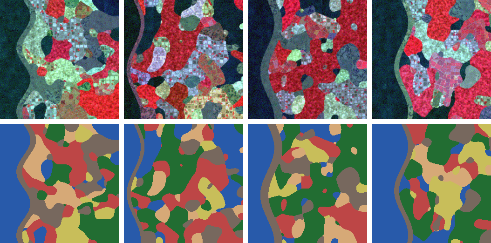
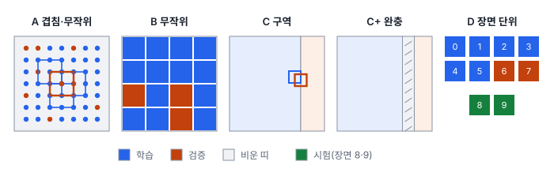
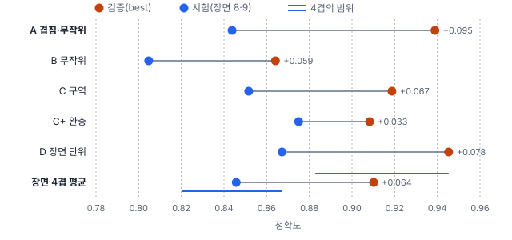

# 43강 데이터셋 만들기

## 이 강에서 얻는 것

- 영상 데이터셋을 장면 단위로 나누고, 겹친 타일·인접 구역이 만드는 지리적 누수를 알아보고 막을 수 있음
- 검증 점수의 부풀림을 장면 난이도 차이와 구분하고, 검증 장면이 적을 때의 흔들림을 장면 단위 교차검증으로 잴 수 있음
- 타일 크기와 중첩을 객체 길이와 계산량으로 정하고, 배경 타일을 얼마나 섞을지 정할 수 있음

## 1. 7부 장면 자료와 나누는 단위

15강에서는 표본 픽셀을 폴리곤·블록 단위로 묶어 나눴음. 딥러닝 데이터셋은 **장면**(한 번 촬영한 영상 한 장 또는 그 일부)을 모델 입력 크기로 자른 타일로 이루어지므로, 나누는 단위를 장면·타일 수준에서 다시 정해야 함.

7부는 이 강에서 소개하는 가상 장면 10장을 이어 씀. 가상 Sentinel-2 10 m 영상 256×256 화소(2.56 km 사방), 밴드 4개(B2·B3·B4·B8)이고 화소마다 5부와 같은 클래스 6개(산림·농경지·시가지·수계·나지·갯벌)의 라벨이 있음. 장면마다 토지피복 배치와 밴드별 밝기(촬영 조건)가 다르고, 왼쪽에 바다와 갯벌 띠가 있음. 장면 0~7은 개발용(학습·검증), 장면 8~9는 끝까지 손대지 않는 시험용임. 가상 지오트랜스폼(EPSG:32652)은 50강에서 씀.

**지리적 누수(geographic leakage)**는 같은 장면이나 인접 지역의 타일이 학습과 검증(또는 시험)에 함께 들어가, 검증이 사실상 이미 본 땅을 다시 맞히는 것임. 15강의 공간 자기상관 누수가 타일 데이터셋에서 나타나는 모습임. 흔한 원인은 순서임. 장면을 모두 잘라 둔 타일 더미를 무작위로 나누면 같은 장면 타일이 양쪽에 흩어짐. 그래서 **장면 단위 분할(scene-level split)**, 곧 장면을 통째로 학습·검증·시험 가운데 한 곳에 배정한 **뒤에** 자르는 것을 기본으로 함. 같은 지역을 다른 날 찍은 장면은 땅이 같으므로 한 묶음으로 배정하고, 배정 목록은 파일로 남김(49강).

## 2. 나누는 방법 다섯 가지 비교

5부의 VD-CNN(27강)으로 32×32 타일을 분류함(타일 라벨은 가장 넓은 클래스). 장면 0~7을 다섯 가지 방법으로 나눠 각각 30에폭 학습하고, 검증 손실이 가장 낮았던 에폭(best)의 모델로 검증 정확도와 시험 정확도(장면 8~9의 겹치지 않은 타일 128장)를 잼. 타일을 16화소 **간격(stride)**, 곧 타일 한 변의 절반씩 밀며 자르면 장면당 225장, 32화소 간격(겹침 없음)이면 64장임. 학습 결과는 시드 0, CPU 한 스레드 기준이며, 환경이 다르면 소수 셋째 자리쯤 달라질 수 있음.

| 방법 | 학습 / 검증 타일 | 검증 | 시험 | 차이 |
|---|---|---|---|---|
| A 겹친 타일(간격 16) 무작위 8:2 | 1,440 / 360 | 0.939 | 0.844 | 0.095 |
| B 안 겹친 타일 무작위 8:2 | 409 / 103 | 0.864 | 0.805 | 0.059 |
| C 장면마다 오른쪽 구역을 검증 | 1,320 / 480 | 0.919 | 0.852 | 0.067 |
| C+ C에 완충 띠 32화소 | 1,200 / 240 | 0.908 | 0.875 | 0.033 |
| D 장면 단위(0~5 학습, 6·7 검증) | 1,350 / 128 | 0.945 | 0.867 | 0.078 |

A의 검증 타일 360장은 모두 학습 타일과 겹치고, 검증 타일 화소의 97%가 학습 타일에도 들어 있었음(89%는 화소 전부가). 같은 화소를 학습에서 정답과 함께 보고 검증에서 다시 맞히는 셈임. 검증 0.939, 새 장면 0.844로 차이가 가장 컸음. B는 화소를 나누지는 않지만 검증 타일 103장 모두 상하좌우 바로 옆에 학습 타일이 있음. 학습 타일이 409장뿐이라 모델도 가장 약했음(시험 0.805).

방법마다 학습 자료가 달라 모델도 다르므로 **같은 모델의 검증과 시험의 차이**를 봄. 그런데 누수가 없는 D에서도 차이가 0.078임.

## 3. 부풀림과 장면 난이도 나눠 보기

D의 검증 장면은 2장뿐임. 어느 두 장을 고르냐에 따라 점수가 얼마나 달라지나 보려고, 장면 0~7을 둘씩 돌아가며 검증에 쓰는 **장면 단위 교차검증**(4겹)을 했음. 겹마다 나머지 6장면으로 학습하고, 시험은 늘 장면 8~9임.

| 검증 장면 | 검증 | 시험 |
|---|---|---|
| 0·1 | 0.883 | 0.844 |
| 2·3 | 0.883 | 0.820 |
| 4·5 | 0.930 | 0.852 |
| 6·7 (= D) | 0.945 | 0.867 |
| 평균 | 0.910 (표준편차 0.032) | 0.846 |

- **검증 장면 2장으로는 점수가 ±0.03 흔들림.** 같은 절차인데 검증이 0.883에서 0.945까지 나옴. D의 6·7은 네 짝 가운데 점수가 가장 높은 짝이었음
- **이 자료에서는 시험 장면 8~9가 개발 장면보다 어려웠던 것으로 보임.** 누수가 없어도 검증 평균과 시험 평균이 0.064 벌어지고, 네 겹 모두 시험이 검증보다 낮음. 이 몫은 누수가 아님

이 0.064를 기준선으로 놓으면 2절 표가 정리됨. A의 0.095는 기준선보다 약 0.03 크고, 이 몫을 겹친 타일의 누수로 볼 수 있음. D의 0.078도 누수가 아니며, 기준선을 넘는 0.014는 검증 장면 운과 잡음으로 보임. B(0.059)와 C(0.067)는 기준선과 비슷했음. 다만 모두 한 번씩 학습한 결과이고 시험 타일 하나가 0.008이라, 0.01~0.02 차이는 잡음 안쪽임. 이웃 타일끼리 닮는 정도는 자료마다 다르므로 "겹치지만 않으면 괜찮다"로 일반화하지 않음.

그래서 장면이 적을수록 검증을 한 짝에 맡기지 않고, 장면 단위 교차검증으로 설정을 고르고 평균과 범위를 함께 보고함. 2장뿐인 시험 점수도 흔들리지만, 그것을 보고 모델을 다시 고르면 시험 장면이 검증 장면이 됨(15강). **시험 장면은 끝까지 손대지 않고** 모든 선택이 끝난 뒤 한 번만 잼.

## 4. 장면 안에서 나눌 때: 공간 완충 구역

장면이 한두 장뿐이면 장면 안을 구역으로 나눌 수밖에 없음. C는 장면마다 타일 중심이 192화소보다 오른쪽인 구역을 검증으로 씀. 겹친 타일로 자르면 경계 타일이 양쪽 땅을 함께 가짐. C의 검증 타일 가운데 25%가 화소 절반을 학습 타일과 나눴음(검증 타일 화소의 12.5%).

**공간 완충 구역(spatial buffer)**은 학습 구역과 검증 구역 사이에 띠를 두고, 그 띠에 걸친 타일을 어느 쪽에도 쓰지 않는 것임. C+는 176~208화소 띠(타일 한 변인 32화소, 320 m)를 비워 공유 화소를 0으로 만들었음. 학습 화소와 검증 화소가 적어도 띠 너비만큼 떨어지므로, 띠는 코렐로그램(15강)으로 본 자기상관 거리보다 넓게 잡음. C+의 32화소는 공유 화소를 없애는 최소 폭이고, 이 자료의 B8은 32화소 떨어져도 상관이 0.24임(64화소에서 0.03). 대가는 버리는 자료임. 학습 타일이 1,320장에서 1,200장, 검증이 480장에서 240장으로 줄었음.

C+의 검증은 C보다 약 0.01 낮아졌는데, 검증 구역도 오른쪽 끝 48화소로 바뀌어 순수한 완충 효과만은 아님. 시험이 0.875로 오른 것도 다른 모델의 결과이고 타일 세 장 차이라, 완충이 모델을 좋게 만들었다고 읽지 않음. 완충은 **점수를 정직하게 만드는 장치**임.

## 5. 타일링: 크기와 중첩 정하기

**타일링(tiling)**은 큰 장면을 모델 입력 크기로 자르는 것임. 타일 크기는 모델 입력, GPU 메모리(47강), 객체 크기와 주변 맥락을 보고 정함. **타일 중첩(tile overlap)**은 이웃 타일이 함께 갖는 화소 폭이고, 간격은 "한 변 − 중첩"임.

중첩을 정하는 규칙은 하나임. **수평 박스(HBB, 41강)의 가로·세로가 모두 중첩 이하인 객체는 어디에 있든 적어도 한 타일에 온전히 들어감.** 그래서 중첩은 온전히 보여야 하는 객체 가운데 가장 긴 것보다 크게 잡음. 대가는 계산량임. 처리하는 화소는 대략 $(\text{한 변}/\text{간격})^2$배로 늘어, 중첩이 한 변의 절반이면 약 네 배임.

37강에서 쓴 6부 큰 장면(0.5 m, 2,048×2,048 화소, 객체 619개, 가장 긴 선박 798화소)으로 세어 봄.

| 타일 / 중첩 | 타일 수 | 처리 화소 배수 | 어느 타일에도 온전히 안 들어감 | 어딘가에서 잘림 | 배경 타일 |
|---|---|---|---|---|---|
| 256 / 0 | 64 | 1.00 | 32 | 32 | 14% |
| 256 / 64 | 121 | 1.89 | 9 | 64 | 13% |
| 256 / 128 | 225 | 3.52 | 6 | 79 | 14% |
| 512 / 0 | 16 | 1.00 | 27 | 27 | 0% |
| 512 / 64 | 25 | 1.56 | 6 | 45 | 4% |
| 512 / 128 | 25 | 1.56 | 6 | 34 | 0% |
| 1024 / 128 | 9 | 2.25 | 1 | 15 | 0% |

- 중첩 0에서는 차량·소형선박도 타일 경계에 걸리면 잘렸음(256에서 32개 중 23개). 중첩 64는 차량(HBB 긴 변 최대 10화소)·소형선박(최대 41화소)보다 커서, 그 뒤에 남은 것은 모두 64화소보다 긴 선박임
- 어딘가에서 잘리는 객체는 오히려 늘었음(256: 32 → 79). 경계선이 많아져 잘린 조각이 든 타일이 늘기 때문임. 잘린 객체의 라벨을 자를지 뺄지는 남은 비율 기준을 정해 라벨링 가이드에 적음(44강)
- 512에서 중첩 64와 128이 둘 다 25장인 것은 끝 처리 때문임. 영상 밖으로 나가는 마지막 타일을 영상 끝에 맞춰 당기므로, 중첩 64의 시작점은 0·448·896·1,344·1,536이 되어 마지막 두 타일이 320화소 겹침. 중첩 128은 0·384·…·1,536으로 딱 맞음. 그래서 실제 배수는 어림과 다름(256·중첩 128은 4가 아니라 3.52, 512·중첩 64는 1.31이 아니라 1.56)
- HBB 긴 변이 598~798화소인 대형 선박 4척은 512 타일에는 중첩과 상관없이 들어가지 않음. 이런 객체는 큰 타일이나 축소 입력으로 따로 다룸(37강)

## 6. 배경 타일

**배경 타일(background tile)**은 객체가 하나도 없는 타일임. 위 항만 장면은 객체가 빽빽해 256 타일에서도 배경 타일이 13~14%였지만, 외해나 산지처럼 넓은 장면을 자르면 대부분이 배경 타일이 되기 쉬움. 얼마나 넣느냐에 양쪽 위험이 있음.

- **너무 빼면** 흰 물결·컨테이너 같은 방해물을 "객체가 아닌 것"으로 배울 기회가 줄어, 실제 장면에서 오탐(이미지당 오탐 수, 38강)이 늘기 쉬움
- **너무 많으면** 학습 시간 대부분을 배경에 쓰고 손실도 배경 쪽으로 쏠려, 객체를 덜 잡는 쪽으로 기울 수 있음(18강의 클래스 불균형과 비슷한 문제)

그래서 비율을 정해 섞음. 에폭마다 배경 타일을 정한 비율만큼 뽑고, 방해물이 든 **어려운 배경(hard negative)**을 우선 넣음. 정해진 정답 비율은 없어, 비율 몇 가지로 학습해 검증 장면의 재현율과 이미지당 오탐 수를 함께 보고 고름. 조정은 학습 세트에만 하고, 검증·시험은 장면 전체를 그대로 잘라야 운영에서의 오탐 수를 맞게 잼.

## 현장에서는

해안 양식 시설 탐지 데이터셋을 만드는 과제임. 받은 위성 장면에는 같은 만을 계절별로 찍은 것이 여럿임. 장면을 만별로 묶어 묶음째 학습·검증·시험에 배정하고, 시험 묶음은 따로 떼어 열지 않음. 개발 묶음으로 장면 단위 교차검증을 돌려 평균과 범위를 보고하고, 큰 만을 안에서 나눌 때는 자기상관 거리보다 넓은 완충 띠를 둠. 중첩은 시설 한 동의 가장 긴 변보다 크게 잡고, 시설 없는 바다 타일은 부표·흰 물결이 든 것을 우선해 정한 비율만큼 섞음.

## 헷갈리는 쌍

- **무작위 분할 vs 장면 단위 분할**: 무작위 분할은 타일을 섞어 같은 장면·같은 화소가 양쪽에 들어가고, 장면 단위 분할은 장면(지역)째 한쪽에만 넣음. 무작위 분할의 검증 점수에는 이미 본 땅을 맞힌 몫이 섞임.
- **학습 데이터의 타일 중첩 vs 슬라이스 추론의 중첩**: 학습 쪽은 객체가 온전히 든 예시를 확보하려는 것이고 같은 묶음 안에서만 겹쳐야 함. 추론 쪽(37강, 50강)은 경계 객체를 놓치지 않으려는 것이고 결과를 NMS·평균으로 합치는 단계가 따름.
- **배경 타일 vs 음성 표본**: 배경 타일은 객체가 없는 타일 한 장이고, 음성 표본은 탐지기가 학습 때 배경으로 할당한 위치·앵커(36강)임. 객체가 있는 타일에도 음성 표본은 많음.

## 이렇게 지시받음

> 지시: "잘라 둔 타일 8:2로 랜덤 스플릿해서 학습 돌려."

그대로 하면 겹친 타일과 이웃 타일이 양쪽에 들어가 검증이 부풀려짐(이 강의 A). 타일마다 장면 번호와 원점이 기록돼 있으면 장면 단위로 다시 나누자고 제안하고, 장면이 적으면 구역 분할과 완충 띠로 나눔.

> 지시: "검증 장면 두 장 점수만 보고 판단하지 마. 장면 단위로 돌려서 범위로 줘."

검증 장면 한 짝에 따라 점수가 0.03씩 흔들리므로 장면 단위 교차검증으로 평균과 범위를 내라는 뜻임. 겹마다 정규화 통계도 학습 장면으로만 계산하고(15강), 시험 장면은 이 과정에 넣지 않음.

> 지시: "학습 타일 512, 중첩은 제일 긴 배보다 크게. 배경 타일은 20%만 섞어."

798화소 선박은 512 타일에 어떻게 해도 들어가지 않으므로, "흔한 선박 길이 기준으로 중첩, 대형 선박은 큰 타일이나 축소 입력으로 따로"로 해석하고 확인함. 배경 20%는 학습 세트에만 적용하고, 검증·시험은 배경 타일까지 모두 넣어 잼.

## 요약

- 영상 데이터셋은 장면(같은 지역의 여러 날짜는 한 묶음)째 학습·검증·시험에 배정한 뒤에 자름. 자른 뒤 무작위로 나누면 지리적 누수가 생김
- 겹친 타일 무작위 분할은 검증 타일 화소의 97%가 학습에도 들어 있어, 검증 0.939 대 시험 0.844로 가장 낙관적이었음
- 누수가 없어도 장면 난이도 차이로 검증과 시험이 벌어지고(이 자료에서 0.064), 검증 장면 2장으로는 ±0.03 흔들리므로 장면 단위 교차검증으로 범위를 봄. 시험 장면은 끝까지 손대지 않음
- 장면 안을 나눌 때는 자기상관 거리보다 넓은 공간 완충 구역을 비움. 완충은 점수를 정직하게 만들 뿐 모델을 좋게 만들지 않음
- 타일 중첩은 온전히 보여야 할 가장 긴 객체보다 크게 잡되 처리 화소가 대략 (한 변/간격)²배로 늚. 배경 타일은 비율을 정해 학습에만 섞고, 검증·시험은 장면 그대로 잼

## 핵심 용어

| 한글 | 영문 |
|---|---|
| 장면 | Scene |
| 지리적 누수 | Geographic Leakage |
| 장면 단위 분할 | Scene-level Split |
| 장면 단위 교차검증 | Scene-level Cross-Validation |
| 공간 완충 구역 | Spatial Buffer |
| 타일링 | Tiling |
| 타일 중첩 | Tile Overlap |
| 간격 | Stride |
| 배경 타일 | Background Tile |
| 어려운 배경 | Hard Negative |
