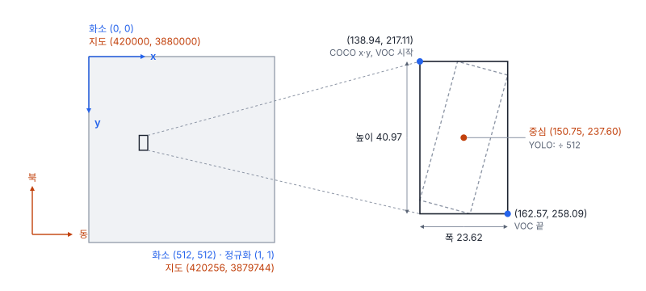
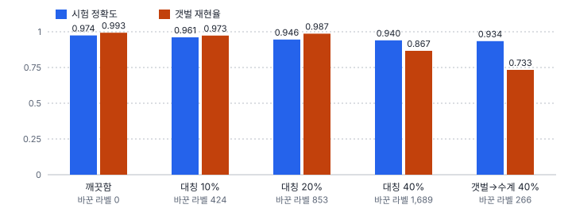

# 44강 라벨링과 라벨 품질

## 이 강에서 얻는 것

- 같은 상자를 YOLO·COCO·VOC·GeoJSON으로 적고 서로 바꾸며, 정규화 분모·0/1 시작·모서리와 중심·y축 방향의 함정을 피할 수 있음
- 라벨러마다 다르게 그리지 않도록 라벨링 가이드를 쓸 수 있음
- 무작위·체계적 라벨 노이즈와 누락 라벨이 학습과 평가를 어떻게 망가뜨리는지 수치로 설명하고 검수 계획을 세울 수 있음

## 1. 라벨 형식 네 가지

라벨은 학습의 정답이자 평가의 기준임. 34강의 6부 항만 자료에서 외해 타일 9번(512×512화소, 0.5 m)의 소형선박(길이 19.3 m) 하나를 예로 듦. 영상 좌표는 원점이 왼쪽 위이고 y가 아래로 커지며(25강), 여기서는 화소 경계가 정수에 놓이는(화소 0이 0~1을 덮는) 연속 좌표로 봄. 이 배의 수평 박스는 (x1, y1, x2, y2) = (138.94, 217.11, 162.57, 258.09)임.

- **YOLO 라벨 형식**: 영상마다 txt 파일 하나, 객체마다 한 줄에 `클래스 cx cy w h`. 클래스 번호는 0부터, 좌표는 중심과 폭·높이를 영상 폭·높이로 나눈 0~1 값
- **COCO 라벨 형식**: 자료 전체가 JSON 하나. images(파일 이름·크기), annotations(객체마다 image_id, category_id, bbox, segmentation, area, iscrowd), categories(번호와 이름) 세 목록임. bbox는 [왼쪽 위 x, 왼쪽 위 y, 폭, 높이] 화소, segmentation은 다각형(또는 마스크), area는 넓이(39강), iscrowd = 1은 낱개로 나누지 않은 무리 영역이라 평가에서 그곳에 걸린 탐지를 셈하지 않음
- **Pascal VOC 라벨 형식**: 영상마다 XML 하나, 객체마다 클래스 이름과 xmin·ymin·xmax·ymax 화소. 원래 VOC 자료는 1부터 세는 정수 화소 번호를 씀
- **GeoJSON**: 지도 좌표의 점·선·다각형을 담는 JSON 형식(RFC 7946). 규격은 WGS84 경위도([경도, 위도] 순)가 원칙이고 다른 좌표계는 미리 합의했을 때만 허용하므로, 투영 좌표(m)를 담는 것은 도구 관례임
- **YOLO-OBB**: 회전 박스 꼭짓점 넷을 정규화해 적는 형식(41강의 8파라미터)

| 형식 | 이 객체의 값 |
|---|---|
| YOLO | 1 0.294440 0.464062 0.046142 0.080021 |
| COCO bbox | [138.94, 217.11, 23.62, 40.97] |
| VOC | 138.94, 217.11, 162.57, 258.09 |
| YOLO-OBB | 1 0.271369 0.496917 0.291139 0.424052 0.317511 0.431207 0.297741 0.504072 |
| GeoJSON (EPSG:32652) | [[420069.47, 3879872.79], [420074.53, 3879891.44], [420081.28, 3879889.61], [420076.22, 3879870.96], 첫 점 반복] |

VOC 줄은 연속 좌표 그대로이고(원래 규약은 2절), GeoJSON은 회전 박스 꼭짓점을 가상 지오트랜스폼 (420000, 0.5, 0, 3880000, 0, −0.5), UTM 52N으로 옮긴 값임(고리 방향은 2절).

## 2. 손으로 따라가는 변환

YOLO는 중심과 크기를 영상 크기로 나눔.

$$c_x = \frac{x_1 + x_2}{2W}, \quad c_y = \frac{y_1 + y_2}{2H}, \quad w = \frac{x_2 - x_1}{W}, \quad h = \frac{y_2 - y_1}{H}$$

$(138.94 + 162.57)/2 = 150.755$이고 ÷512 하면 0.29444임. $c_y$는 237.60 ÷ 512 = 0.46406, $h$는 40.97 ÷ 512 = 0.08002임. 폭은 23.62 ÷ 512 = 0.04613인데 표는 반올림 전 폭 23.625로 계산해 0.046142임. 형식을 오가며 반올림하면 이런 끝자리 차이가 쌓임. 함정은 넷임.

- **정규화 분모**: 그 영상의 폭·높이로 나눔. 자르기 전 장면 크기나 줄인 입력 크기로 나누면 상자가 엉뚱한 곳으로 감
- **0부터 vs 1부터**: YOLO 클래스는 0부터, COCO category_id는 categories에 정한 번호(흔히 1부터)라 소형선박이 YOLO 1, COCO 2가 될 수 있음. 원래 VOC 좌표도 1부터 셈. 이 상자가 걸친 화소는 0부터 세면 열 138~162, 행 217~258이므로 VOC로는 (139, 218, 163, 259)임. 연속 좌표로 되돌리면 x1 = xmin − 1, x2 = xmax이고 폭은 xmax − xmin + 1 = 25임. VOC 평가 코드가 폭에 1을 더하는 이유이고, 35강의 IoU 0.80 대 0.82(9화소 차량을 폭 10으로 셈)가 여기서 나옴. 불러올 때 1을 빼는지는 도구마다 다름
- **왼쪽 위 vs 중심**: COCO는 왼쪽 위 + 폭·높이, YOLO는 중심 + 폭·높이, VOC는 두 모서리임. 잘못 읽어도 에러가 나지 않으므로 변환 뒤 상자 몇 개를 영상 위에 그려 봄
- **y축 방향**: 화소 y는 아래로, 지도 북 좌표는 위로 커짐. 지오트랜스폼으로 $E = 420000 + 0.5x$, $N = 3880000 - 0.5y$이고, 거꾸로는 $x = (E - 420000)/0.5$, $y = (3880000 - N)/0.5$임. 첫 꼭짓점 (138.94, 254.42)가 (420069.47, 3879872.79)가 됨. 화면에서 시계 방향인 꼭짓점은 지도에서도 시계 방향인데, RFC 7946은 바깥 고리를 반시계 방향으로 적되 읽는 쪽은 방향 때문에 거부하지 말라고 함. 그래도 방향을 따지는 도구가 있어 뒤집어 저장함

## 3. 라벨링 가이드

**라벨링 가이드**는 무엇을 어떻게 그릴지 정한 문서임. 없으면 라벨러마다 같은 객체를 다르게 그리고, 그 차이가 모델이 배우는 잡음이 됨.

- **클래스 정의**: 눈으로 판단할 기준(이 자료라면 소형선박 20 m 이하, 선박 40 m 이상)과, 그 사이 길이·바지선·부잔교 같은 경계 사례를 어느 쪽에 넣을지
- **최소 크기**: 몇 화소 미만은 그리지 않는지. 그러면 평가에서도 그 크기를 무시함
- **잘린 객체**: 영상 경계에 걸린 객체를 보이는 부분만 그릴지, 절반 이상 보일 때만 그릴지
- **가려진 객체**: 크레인·구름에 가린 배를 보이는 부분만 그릴지, 전체를 추정할지
- **그림자 포함 여부**: 촬영 시각·계절에 따라 그림자 길이가 바뀌므로 흔히 뺌
- **예시 사진**: 규칙마다 맞는 예와 틀린 예를 영상 조각으로 붙임

판 번호를 붙이고, 규칙이 바뀌면 이미 그린 라벨을 어떻게 고칠지도 적음.

## 4. 라벨 노이즈: 무작위와 체계적

**라벨 노이즈**는 틀린 라벨임. 실수로 아무 클래스나 고른 **무작위 잡음**과, 한 클래스를 특정 다른 클래스로 일관되게 착각한 **체계적 잡음**이 있음. 5부 타일 자료(27강)의 학습 라벨 4,200개를 정한 비율만큼 다른 다섯 클래스 중 하나로 무작위로 바꾸거나(대칭 잡음), 갯벌 라벨의 40%를 수계로 바꾸고(체계적 잡음) VD-CNN을 30에폭 학습했음. 검증 라벨은 깨끗하게 두고 검증 손실이 가장 낮은 에폭(best)을 씀(시드 0, CPU 한 스레드 기준).

| 학습 라벨 | 바꾼 라벨 | 시험 정확도 | 갯벌 재현율 | 마지막 학습 손실 |
|---|---|---|---|---|
| 깨끗함 | 0 | 0.974 | 0.993 | 0.091 |
| 대칭 10% | 424 | 0.961 | 0.973 | 0.574 |
| 대칭 20% | 853 | 0.946 | 0.987 | 0.895 |
| 대칭 40% | 1,689 | 0.940 | 0.867 | 1.347 |
| 갯벌→수계 40% | 266 | 0.934 | 0.733 | 0.175 |

무작위 잡음에는 꽤 강했음. 40%를 바꿔도 참 클래스 라벨이 60%, 틀린 클래스는 각 8%라 다수결은 여전히 참 클래스이기 때문임. 대신 학습 손실의 바닥이 올라감. 바뀐 라벨은 외우지 않는 한 맞힐 수 없어서 참 클래스를 완벽히 알아도 손실이 $-(1-\varepsilon)\ln(1-\varepsilon) - \varepsilon\ln(\varepsilon/5)$ 밑으로 내려가지 않음($\varepsilon$은 바뀐 비율). 실제 비율 0.402면 1.32라 학습 손실 1.347은 거의 바닥임. 학습 손실이 높게 멈추면 라벨부터 의심할 근거가 됨.

체계적 잡음은 라벨 266개(전체의 6%, 갯벌 라벨의 38%)만 바꿨는데 갯벌이 가장 크게 다쳤음. 전체 정확도는 0.04 내려간 정도지만 갯벌 150타일 중 40개를 놓쳐 재현율이 0.993에서 0.733으로 무너졌음. 라벨이 "갯벌처럼 보여도 물"이라고 가르친 셈인데, 놓친 40개가 수계로 갔는지는 혼동행렬을 남기지 않아 확인하지 못했음. 학습 손실도 0.175로 낮아 곡선으로는 알기 어려움. 무작위 잡음도 재현율을 흔들지만(대칭 20%에서 수계 0.800) 흔들리는 클래스가 그때그때 다른 반면, 체계적 잡음은 정해진 클래스를 망가뜨리고 전체 정확도에 묻히므로 클래스별 재현율로 봄.

이 실험과 달리 실제로는 검증·시험 라벨도 같은 잡음을 품기 쉽고, 그러면 best 에폭 선택과 시험 점수가 함께 속으므로 시험 라벨만큼은 따로 검수함.

## 5. 누락 라벨

**누락 라벨**은 있는 객체에 라벨이 없는 것임. 평가에서는 그 객체를 맞힌 탐지가 짝이 없어 오탐으로 셈. 34강 가상 탐지기의 기본 탐지 결과(1,494개)는 그대로 두고 정답마다 정한 확률로 지워 평가했음.

| 지운 비율 | 남은 정답 | mAP50 | 점수 0.5 이상의 정밀도 | 재현율 |
|---|---|---|---|---|
| 0% | 1,234 | 0.645 | 0.812 | 0.408 |
| 10% | 1,096 | 0.609 | 0.736 | 0.417 |
| 20% | 969 | 0.543 | 0.644 | 0.413 |
| 30% | 843 | 0.436 | 0.576 | 0.425 |

탐지는 하나도 안 바뀌었는데 점수가 떨어짐. 점수 0.5 이상 탐지 621개 중 정탐이 504개에서 358개로 줄고 오탐이 117개에서 263개로 늘었음. 찾은 객체와 놓친 객체를 가리지 않고 지웠으므로 재현율은 거의 그대로이고 정밀도만 내려감. 누락이 많은 시험 자료로는 모델이 실제보다 나빠 보임.

학습에서는 라벨 없는 객체를 배경으로 가르쳐 재현율을 낮춤. 작고 흐린 객체일수록 라벨러가 놓치기 쉬워 누락이 그런 객체에 몰림.

## 6. 검수

**라벨 검수**는 라벨 품질을 확인하고 고치는 과정임.

- **이중 라벨링과 일치도**: 일부 영상을 두 사람이 따로 그려 클래스는 일치율·카파(17강)로, 상자는 IoU로 맞춰 봄. 작은 객체는 1화소에도 IoU가 크게 떨어지므로(35강) 크기별로 기준을 두고, 일치도가 낮은 클래스는 가이드부터 고침
- **표본 검수**: 전부 볼 수 없으면 무작위로 뽑아 오류율을 추정함. 200장 중 6장이 틀렸으면 3%이지만 95% 신뢰구간(윌슨 방식)이 약 1.4~6.4%라, "5% 이하"를 보이려면 더 뽑아야 함. 라벨러별·장면별로 나눠 뽑으면 체계적 잡음이 드러남
- **모델과 라벨이 크게 다른 곳부터**: 높은 확신으로 다른 클래스를 낸 타일, 높은 점수인데 짝 없는 탐지에 라벨 오류와 누락이 몰림. 체계적인 방법(신뢰 학습 등)은 54강에서 다룸

## 현장에서는

0.5 m 위성영상 선박 라벨을 외주로 받아 YOLO-OBB로 학습하고, 결과는 GeoJSON 폴리곤으로 납품하는 과제임. 변환한 상자를 영상과 지도 위에 그려 정규화 분모와 y축 뒤집힘부터 확인함. 가이드에는 길이 기준과 경계 사례, 최소 길이, 잘린 객체는 절반 이상 보일 때만, 그림자 제외를 예시 조각과 함께 적음. 일부를 두 번 그려 일치도를 보고, 높은 점수인데 짝 없는 탐지를 검토함. 대부분 빠뜨린 소형선박이라면 시험 mAP도 낮게 나온 것이므로 시험 라벨부터 고쳐 다시 평가함.

## 헷갈리는 쌍

- **COCO bbox vs VOC vs YOLO**: COCO는 [왼쪽 위 x, y, 폭, 높이] 화소, VOC는 [xmin, ymin, xmax, ymax] 화소(원래 1부터), YOLO는 중심과 폭·높이를 영상 크기로 나눈 0~1 값임. 같은 상자의 셋째 숫자가 COCO 23.62, VOC 162.57, YOLO 0.046임.
- **라벨 노이즈 vs 누락 라벨**: 노이즈는 있는 라벨이 틀린 것, 누락은 라벨이 아예 없는 것임. 누락은 평가에서 맞힌 탐지를 오탐으로 만들고 학습에서 객체를 배경으로 가르침.
- **무작위 잡음 vs 체계적 잡음**: 무작위는 학습 손실 바닥을 올리지만 다수결이 살아 있으면 정확도가 덜 떨어짐. 체계적은 적은 수로도 특정 클래스를 무너뜨리고 손실·전체 정확도에 잘 드러나지 않음.

## 이렇게 지시받음

> 지시: "COCO로 받은 라벨 YOLO로 바꿔서 학습 돌려. 클래스 번호 맞추고."

bbox 왼쪽 위에 폭·높이의 절반을 더해 중심으로 옮기고 영상마다 그 크기로 나누며, category_id는 0부터 다시 매기라는 뜻임. iscrowd = 1 영역의 처리를 정하고, 변환한 상자를 영상 위에 그려 확인함.

> 지시: "검출 결과 GeoJSON으로 내보내. 좌표계는 UTM 52N 그대로."

지오트랜스폼으로 화소를 동·북 좌표로 바꾸되 y가 뒤집힘. 규격은 WGS84 경위도가 원칙이므로 투영 좌표라는 사실을 받는 쪽에 알리고, 고리 방향과 닫힘도 맞춤(폴리곤화는 50강).

> 지시: "갯벌 재현율만 유독 낮아. 모델 바꾸기 전에 라벨부터 봐."

한 클래스만 낮으면 체계적 잡음을 의심함. 갯벌·수계 라벨 표본에서 잘못 붙은 것이 라벨러·장면별로 몰리는지 보고, 모델은 높은 확신으로 갯벌이라 했는데 라벨이 수계인 타일부터 검토함.

## 요약

- YOLO는 영상마다 txt에 정규화한 중심·폭·높이, COCO는 JSON 하나에 bbox [x, y, 폭, 높이] 화소, VOC는 영상마다 XML에 두 모서리(원래 1부터), GeoJSON은 지도 좌표 다각형(규격은 WGS84 경위도)
- 변환의 함정은 정규화 분모, 0/1 시작(VOC 폭 = xmax − xmin + 1), 왼쪽 위 vs 중심, y축 방향이고, 변환 뒤 그려 봄
- 라벨링 가이드에는 클래스 정의와 경계 사례, 최소 크기, 잘린·가려진 객체, 그림자 포함 여부를 예시 사진과 함께 적음
- 대칭 잡음 40%에도 정확도는 0.974 → 0.940이었지만 학습 손실 바닥이 1.32로 오름. 체계적 잡음은 라벨 6%로 갯벌 재현율을 0.993 → 0.733으로 무너뜨림
- 정답을 30% 지우면 같은 탐지의 mAP50이 0.645 → 0.436으로 보임. 검수는 이중 라벨링, 표본 검수, 모델과 라벨이 크게 다른 곳부터 보기로 함(54강)

## 핵심 용어

| 한글 | 영문 |
|---|---|
| YOLO 라벨 형식 | YOLO Format |
| COCO 라벨 형식 | COCO Format |
| Pascal VOC 라벨 형식 | Pascal VOC Format |
| GeoJSON | GeoJSON |
| 지오트랜스폼 | Geotransform |
| 라벨링 가이드 | Labeling Guideline |
| 라벨 노이즈 | Label Noise |
| 무작위 잡음 / 체계적 잡음 | Random / Systematic Label Noise |
| 누락 라벨 | Missing Label |
| 라벨 검수 | Label Quality Assurance (Label QA) |
| 라벨러 간 일치도 | Inter-Annotator Agreement |
