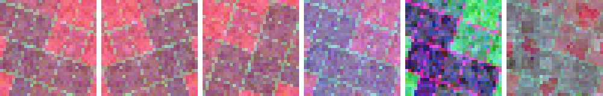
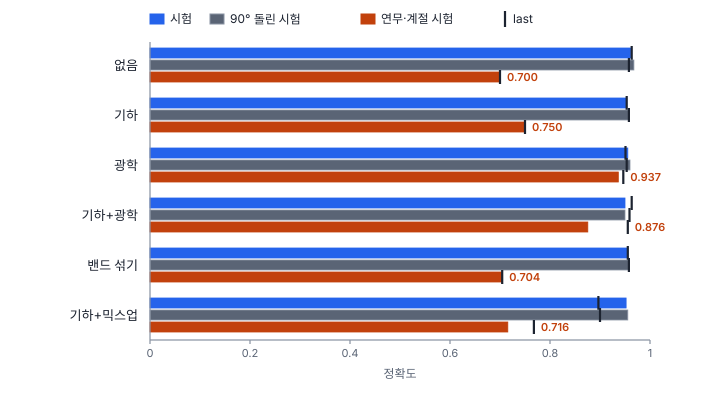

# 45강 데이터 증강

## 이 강에서 얻는 것

- 기하 증강과 광학 증강을 구별하고, 영상과 함께 상자·마스크 라벨을 바꾸는 법을 알 수 있음
- 원격탐사 영상에서 안전한 증강(뒤집기·90° 회전·촬영 조건 흉내)과 피해야 할 증강(밴드 섞기, 큰 밴드별 왜곡, 큰 확대)을 가를 수 있음
- 증강 실험 결과를 자료의 성질로 해석하고, 효과가 없던 결과도 그대로 보고할 수 있음

## 1. 증강이란

**데이터 증강(data augmentation)**은 학습 때 영상을 무작위로 조금씩 바꿔 넣어 더 다양한 장면을 본 것처럼 만드는 방법임. 배치를 만들 때마다 새로 바꾸므로 60에폭이면 같은 타일이 60가지 모습으로 들어감. 규제(29강)처럼 과적합을 줄이지만, 모델이 아니라 입력 쪽에서 "이 정도 차이는 클래스와 상관없음"을 가르치는 셈임.

규칙은 둘임.

- **라벨도 같이 바꿈**: 타일 분류 라벨은 대개 그대로지만, 탐지 상자와 분할 마스크는 영상과 똑같은 변환을 받아야 함. 마스크는 최근접 리샘플링(25강)으로 옮겨 클래스 번호가 섞이지 않게 함
- **학습에만 씀**: 검증·시험은 원래 영상 그대로 평가함. 추론 때 일부러 변형해 여러 번 넣고 합치는 TTA(37강)는 별개 기법임

## 2. 기하 증강과 회전 불변성

**기하 증강(geometric augmentation)**은 화소의 위치를 바꾸는 증강임. 뒤집기, 90° 회전, 임의 각 회전, 크기 바꾸기, 자르기가 있음.

뒤집기와 90° 회전은 보간이 없고 상자 식도 간단함. 한 변 $W$인 타일에서 상자 $(x_1, y_1, x_2, y_2)$(원점 왼쪽 위)는 다음이 됨.

$$\text{좌우 뒤집기: } (W - x_2,\ y_1,\ W - x_1,\ y_2), \qquad \text{반시계 90° 회전: } (y_1,\ W - x_2,\ y_2,\ W - x_1)$$

32화소 타일의 상자 (20, 3, 30, 7)은 뒤집으면 (2, 3, 12, 7), 돌리면 (3, 2, 7, 12)임. 임의 각 회전은 보간이 들어가고 모서리에 빈 곳이 생기므로 넓게 잘라 돌린 뒤 가운데를 씀. 수평 상자는 돌린 꼭짓점을 감싸는 상자로 다시 잡는데, 40×10화소 객체를 30° 돌리면 그 넓이가 객체의 2.84배로 헐거워짐. 마스크나 회전 박스(41강)가 있으면 그것을 돌린 뒤 상자를 다시 계산함.

**위에서 내려다본 영상에는 정해진 위아래가 없음.** 연직 영상의 필지·건물·선박은 어느 방향으로든 놓이므로 뒤집기·회전이 대체로 안전함(일상 사진은 사람이 거꾸로 서지 않아 좌우 뒤집기만 흔히 씀). 예외는 방향이 의미를 가질 때임. 한 장면의 그림자는 모두 태양 반대쪽으로 늘어지는데 돌리면 없는 태양 방향이 생김. SAR은 옆으로 비추는 관측 방향에 따라 밝은 사면과 레이더 그림자가 정해져 관측 방향으로 뒤집거나 돌리면 없는 쪽에서 비춘 영상이 됨. 도로 위 글자처럼 읽는 방향이 있는 것도 예외임.

**회전 불변성(rotation invariance)**은 입력을 돌려도 판단(클래스)이 바뀌지 않는 성질임. 합성곱은 이동에는 구조상 등변(30강)이지만 회전에는 그런 장치가 없음. 그래서 회전 증강으로 가르치거나, 자료가 이미 모든 방향을 담고 있어야 하며, 뒤쪽이면 증강의 이득이 작음(4절).

**크기는 GSD를 바꾸는 것과 같음.** 원격탐사에서는 화소 하나가 몇 m인지(20강)가 정해져 있어 크기 자체가 단서임. 6부 항만 자료(0.5 m, 34강)는 선박 40~140 m, 소형선박 6~20 m로 크기가 클래스를 가름. Ultralytics 8.4 기본값(`scale=0.5`, 0.5~1.5배)을 그대로 쓰면 40 m 선박이 20 m처럼 보여 크기로는 소형선박과 구별되지 않음. 같은 센서 자료라면 범위를 좁게 잡음.

**자르기는 라벨을 바꿀 수 있음.** 5부 타일 라벨은 "가장 넓은 클래스"라서 경계 타일을 자르면 다수 클래스가 바뀔 수 있어 화소 라벨로 다시 셈. 탐지에서는 잘린 상자를 경계에 맞춰 줄이고 조금만 남은 상자는 버림(기준은 도구마다 다름, 타일링은 43강).

## 3. 광학 증강: 촬영 조건을 흉내 냄

**광학 증강(photometric augmentation)**은 위치는 두고 화소 값만 바꾸는 증강이라 라벨 좌표가 바뀌지 않음. 밝기·대비·감마(21강)·잡음이 기본이고, 원격탐사에서는 실제 촬영 조건 차이를 흉내 내도록 짬. 이 강 실험의 광학 증강은 반사율 $\rho$를 밴드 $b$마다 다음처럼 바꿈.

$$\rho_b' = g_b\,\rho_b + h_b + \epsilon$$

밴드마다 이득 $g_b$를 곱하고 산란광 $h_b$를 더하고 잡음 $\epsilon$(표준편차 0.004)을 얹는다는 뜻임. 이득은 밴드마다 따로 1 근처에서 뽑아(표준편차 약 8%) 0.85~1.15배로 자르며, 이 자료의 지역 간 촬영 조건 차이(밴드별 약 12%)보다 조금 작음. 산란광은 연무 흉내라 타일마다 세기를 하나 뽑아 파장이 짧을수록 크게 더하며 청 0~0.035, 녹 0~0.022, 적 0~0.010, 근적외 0~0.004임. 타일 절반에는 근적외를 0.85배로 줄여 다른 계절의 식생을 흉내 냄.

**밴드 사이 관계는 지켜야 함.** 다중분광의 정보는 밴드 사이 비율에 있음. 산림 평균 반사율(청 0.03, 녹 0.05, 적 0.03, 근적외 0.33)의 NDVI는 0.833이고, 위 범위의 가장 나쁜 이득(적 1.15배, 근적외 0.85배)에서도 0.781로 산림다움이 남음(계절 흉내와 최대 산란광까지 겹치면 0.690). 그런데 적 1.5배·근적외 0.6배처럼 밴드마다 크게 따로 흔들면 0.630이 되어 농경지 평균(0.623)과 같아짐. 지수가 뜻을 잃는 것임. 같은 이유로 다음은 쓰지 않음.

- **RGB용 색상 변환**: HSV 색상 회전(21강)은 세 채널 값을 서로 주고받게 함. 다중분광의 세 밴드에 걸면 근적외는 두고 가시광 비율만 바꿔 실제로 없는 분광 특성을 만듦
- **밴드 섞기**: 산림의 적색과 근적외가 맞바뀌면 NDVI가 −0.833으로 수계 평균(−0.200)보다도 낮아짐
- **큰 확대·축소**: 2절의 GSD 문제

## 4. 실험: 효과가 있던 것과 없던 것

5부 학습 타일(27강)에서 무작위로 1,000장만 골라 VD-CNN을 60에폭씩 학습하고 증강만 바꿈(시드 0, CPU 한 스레드 기준). 기하는 뒤집기·90° 회전, 밴드 섞기는 기하에 더해 절반 확률로 밴드 순서를 섞은 것, 믹스업은 기하에 믹스업(5절)을 더한 것임. 평가는 시험 900장, 같은 타일을 90° 돌린 회전 시험, **연무·계절 시험**으로 함. 이는 시험 타일과 같은 타일에 연무(청·녹 밴드 쪽이 큰 산란광)와 계절 변화(식생 근적외 22% 감소)를 넣은 것임(`make_part5.py`의 `test_shift`, 48강).

| 증강 | 시험 best / last | 회전 시험 best | 연무·계절 best / last |
|---|---|---|---|
| 없음 | 0.961 / 0.963 | 0.968 | 0.700 / 0.700 |
| 기하 | 0.953 / 0.953 | 0.958 | 0.750 / 0.750 |
| 광학 | 0.956 / 0.951 | 0.960 | 0.937 / 0.947 |
| 기하+광학 | 0.950 / 0.963 | 0.950 | 0.876 / 0.956 |
| 밴드 섞기 | 0.956 / 0.956 | 0.958 | 0.704 / 0.704 |
| 기하+믹스업 | 0.952 / 0.897 | 0.956 | 0.716 / 0.768 |

차이를 읽기 전에 흔들림의 크기를 봄. 49강의 시드 실험(4,200장·30에폭)에서 시험 best는 0.960~0.974, 연무·계절 best는 0.708~0.829로 흔들렸음. 이 강과 설정이 달라 대략의 눈금으로만 씀.

- **광학 증강이 연무·계절 시험을 0.700 → 0.937로 올림.** 원래 시험은 0.956으로 거의 그대로임. 청색에 일정하게 더해지는 산란광(산림 청색 0.030 → 0.065)은 학습 자료에 없던 변화였음. 다만 이 증강은 연무·계절 시험을 만든 방식에 맞춰 짠 **시험 조건을 미리 알고 맞춘 증강**이라, 어떤 조건이 올지 모르는 실제 운영에서는 이득이 이보다 작다고 봐야 함. 또 기하+광학의 best(54에폭, 0.876)와 last(60에폭, 0.956)처럼 이 정확도는 몇 에폭 사이에도 크게 달라짐. 검증 자료에 연무가 없어 체크포인트를 고를 때 이 조건을 보지 않기 때문임
- **기하 증강은 회전 시험에 차이를 내지 못함.** 증강 없이도 회전 시험(0.968)이 원래 시험(0.961)과 같았음. 이 자료는 이미 거의 모든 방향을 담고 있었음. 필지 방향과 경계선 방향은 무작위이고, 시가지 격자 도로는 90° 돌려도 격자이며, 수관 얼룩·조수로는 방향이 없음. 원래 시험이 0.008 내리고 연무·계절이 0.05 오른 것도 이 흔들림 범위 안이라 효과로 읽기 어려움
- **밴드 섞기는 원래 시험을 거의 그대로 두었지만 이득도 없었음.** 이 자료의 클래스는 무늬(필지·격자 도로·조수로)로도 갈려 분광이 망가진 타일에서도 배울 것이 있었던 것으로 보임. 연무·계절 시험이 그대로인 것도 만든 다양성이 시험의 변화(산란광·근적외 감소)와 닮지 않았기 때문으로 보임
- **믹스업은 last가 0.897로 가장 낮았음.** 마지막 10에폭 검증 정확도는 다른 설정도 크게 오갔지만(0.861~0.964) 믹스업은 위쪽 끝이 0.929로 낮았고, 검증 손실 최솟값(0.214)도 다른 설정(0.110~0.157)보다 높아 60에폭 안에 덜 수렴한 것으로 보임. 이 자료의 약 40%는 두 클래스가 자리를 나눈 경계 타일인데, 믹스업은 모든 화소를 겹친 반투명 타일에 비율 라벨을 주어 학습이 더뎠을 수 있음(확인하지 않은 가설)

## 5. 영상을 섞는 증강

**모자이크 증강(mosaic augmentation)**은 네 영상을 2×2로 이어 붙여 한 장으로 만들고 네 영상의 상자를 모두 옮겨 담음. YOLOv4(보치코프스키 등, 2020년 공개)로 퍼졌고, Ultralytics 8.4는 기본으로 켜고(`mosaic=1.0`) 마지막 10에폭은 끔(`close_mosaic=10`). 한 입력에 배경과 객체가 다양해지고, 이음매에 잘린 객체도 배움.

**믹스업(mixup)**(장 등, 2017년 공개)은 두 영상과 라벨을 같은 비율 $\lambda$로 섞음.

$$\tilde{x} = \lambda x_i + (1-\lambda)\,x_j, \qquad \tilde{y} = \lambda y_i + (1-\lambda)\,y_j$$

$\lambda$는 보통 베타 분포 $\mathrm{Beta}(\alpha, \alpha)$에서 뽑음. 4절의 $\alpha = 0.2$에서는 $\lambda$가 0.1 아래나 0.9 위인 경우가 약 67%라 대부분 한쪽이 거의 그대로임. 손실은 두 라벨의 교차 엔트로피를 $\lambda$, $1-\lambda$로 가중합하므로, 학습 손실을 다른 설정과 직접 비교하지 않음(29강 라벨 스무딩과 같은 이유). 탐지에서는 두 영상의 상자를 모두 정답으로 씀.

**복사-붙여넣기 증강(copy-paste augmentation)**(기아시 등, 2020년 공개)은 한 영상의 객체를 마스크로 오려 다른 영상에 붙이고 라벨을 더함. 드문 클래스를 늘릴 때 씀. 오린 가장자리가 배경과 어울리지 않으면 모델이 붙인 흔적을 단서로 배울 수 있으므로(바로가기 학습, 59강) 가장자리를 부드럽게 섞기도 함. 선박은 수계 마스크 안에만 붙이는 식으로 맥락을 지키고, GSD·태양 방향·대기 상태가 비슷한 장면에서 가져옴.

## 현장에서는

연안 양식장 분할 모델(Sentinel-2 10 m, 4밴드)을 봄·가을 장면으로 학습했더니 여름 연무 장면에서 시설 경계를 놓치는 상황임. 뒤집기·90° 회전은 마스크와 함께 쓰고 크기 증강은 좁게 둠. 광학 증강의 범위는 짐작하지 않고 잼. 맑은 바다의 청색 반사율로 산란광 크기를, 장면 간 불변 지점(방파제 등)의 반사율 비로 밴드별 이득 범위를 어림함. 드문 대형 시설은 복사-붙여넣기로 늘리되 바다 위에만, 같은 날짜 장면에서 가져옴. 검증에는 연무 장면을 장면 단위로 따로 떼어 두고(43강) 맑은 장면 성적과 함께 봄.

## 헷갈리는 쌍

- **기하 증강 vs 광학 증강**: 기하는 화소 위치를 바꿔 상자·마스크도 같이 바꿔야 하고, 광학은 값만 바꿔 라벨 좌표가 그대로임. 원격탐사의 위험은 기하에서는 GSD(크기), 광학에서는 밴드 사이 관계임.
- **증강 vs TTA**: 증강은 학습 때 무작위로 바꿔 모델을 가르치고, TTA는 추론 때 정해진 변형(뒤집기 넷 등)으로 여러 번 예측해 원래 좌표로 되돌려 합침.
- **믹스업 vs 복사-붙여넣기**: 믹스업은 영상 전체를 반투명하게 겹치고 라벨을 비율로 섞음. 복사-붙여넣기는 객체만 오려 불투명하게 붙이고 라벨을 하나 더함.
- **회전 불변성 vs 회전 등변성**: 불변성은 돌려도 출력(클래스)이 같은 것, 등변성은 출력이 입력과 함께 돌아가는 것임(30강의 이동 등변성과 같은 뜻). 타일 분류는 불변성을, 분할 마스크·탐지 상자는 등변성을 원함.

## 이렇게 지시받음

> 지시: "울트라리틱스 기본값으로 돌리지 말고 flipud 0.5 주고 scale은 0.1로 줄여."

Ultralytics 8.4 기본은 상하 뒤집기 0(`flipud=0.0`), 좌우 0.5, 크기 0.5~1.5배임. 위에서 본 영상이라 상하 뒤집기도 안전하고, 크기는 선박·소형선박처럼 길이로 갈리는 클래스가 섞이지 않게 0.9~1.1배로 좁히라는 뜻임.

> 지시: "다중분광은 HSV 증강 끄고, 밴드별 게인이랑 헤이즈만 줘."

RGB용 색상·채도 변환은 밴드 관계를 깨므로 빼고, 밴드별 이득과 청색 쪽이 큰 산란광으로 실제 촬영 조건 차이만 흉내 내라는 뜻임. 범위는 장면 간 차이를 재서 정하고 NDVI가 클래스 경계를 넘지 않는지 확인함.

> 지시: "광학 증강 넣으니까 연무 시험 확 올랐네. 강건성 올렸다고 보고서에 써."

연무 시험을 만든 방식에 맞춰 증강을 짰다면 이 이득은 예상된 값이고 다른 교란에 대한 강건성을 보여 주지 않음. 시험 결과를 보고 증강을 고쳤다면 시험 자료가 검증 노릇을 한 셈이기도 함(15강). 증강 설계에 쓰지 않은 연무 장면이나 다른 교란(57강)으로 따로 확인하고, 보고서에는 그 한계를 적음.

## 요약

- 증강은 학습 때만 영상을 바꿔 다양성을 늘리고, 상자·마스크도 같은 변환을 받음. 검증·시험은 원본으로 평가하고 TTA는 따로임
- 위에서 본 영상은 뒤집기·90° 회전이 대체로 안전함. 그림자·SAR 관측 방향·글자는 예외이고, 크기 증강은 GSD를 바꾸므로 좁게 씀
- 광학 증강은 밴드별 이득·산란광·잡음으로 촬영 조건을 흉내 내되, 밴드 섞기·RGB 색상 변환·큰 밴드별 왜곡처럼 밴드 관계를 깨는 것은 쓰지 않음
- 광학 증강은 연무·계절 시험을 0.700 → 0.937로 올렸지만 시험 조건에 맞춘 결과임. 기하 증강은 자료의 방향이 이미 다양해 효과가 없었고, 밴드 섞기는 이득이 없었고, 믹스업은 덜 수렴한 것으로 보임(last 0.897)
- 모자이크는 네 영상을 한 장에, 믹스업은 두 영상을 비율로, 복사-붙여넣기는 객체를 다른 배경에 붙임. 붙인 경계와 맥락을 점검함

## 핵심 용어

| 한글 | 영문 |
|---|---|
| 데이터 증강 | Data Augmentation |
| 기하 증강 | Geometric Augmentation |
| 광학 증강 | Photometric Augmentation |
| 회전 불변성 / 회전 등변성 | Rotation Invariance / Rotation Equivariance |
| 모자이크 증강 | Mosaic Augmentation |
| 믹스업 | MixUp |
| 복사-붙여넣기 증강 | Copy-Paste Augmentation |
| 테스트 시 증강 | Test-Time Augmentation (TTA) |
