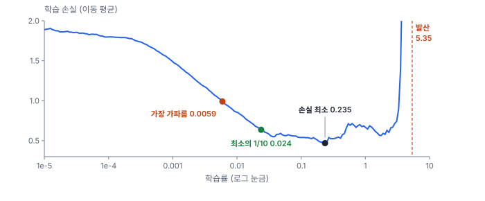
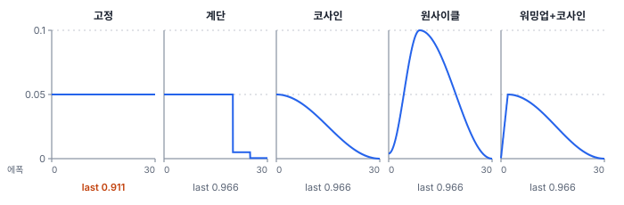
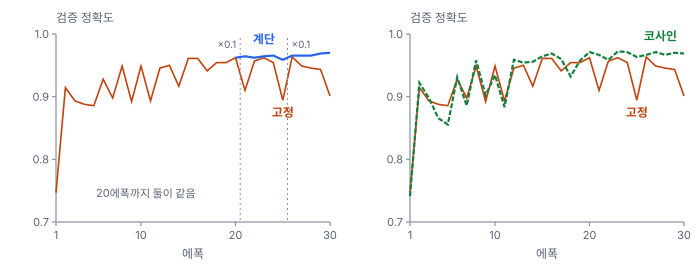

# 46강 학습률과 스케줄

## 이 강에서 얻는 것

- 학습률이 너무 크거나 작을 때 생기는 일을 설명하고, LR 범위 테스트로 출발값을 고를 수 있음
- 계단식 감쇠·코사인 어닐링·원사이클·워밍업의 모양을 그리고, 끝 학습률을 낮추는 이유를 설명할 수 있음
- 배치 크기를 바꿀 때 선형 스케일링 규칙을 출발점으로 쓰고, 그 한계를 판단할 수 있음

## 1. 학습률이 가장 중요한 이유

**학습률(learning rate, LR)**은 기울기 방향으로 한 번에 얼마나 갈지 정하는 배율 $\eta$임(28강). 다른 하이퍼파라미터를 그대로 두고 학습률만 바꿔도 학습이 안 되거나 잘 되거나가 갈림.

손실이 $L = \frac{a}{2}\theta^2$인 골짜기 하나로 보면 분명함. 기울기가 $a\theta$라서 한 걸음마다 $\theta \leftarrow (1 - \eta a)\,\theta$가 됨. 곧 걸음마다 바닥까지 거리에 $1 - \eta a$가 곱해짐. $a = 4$일 때를 계산함.

| 학습률 | 걸음당 배율 | 일어나는 일 |
|---|---|---|
| 0.01 | 0.96 | 50걸음 뒤에도 거리가 처음의 0.13. 느림 |
| 0.1 | 0.6 | 10걸음 만에 0.006. 빠르게 수렴 |
| 0.4 | −0.6 | 바닥을 건너뛰며 좌우로 요동하지만 수렴 |
| 0.6 | −1.4 | 걸음마다 1.4배씩 멀어짐. 10걸음 뒤 29배, 발산 |

$\eta < 2/a$여야 발산하지 않고, 골짜기가 가파를수록(곡률 $a$가 클수록) 상한이 낮아짐. 신경망은 방향마다 곡률이 달라, 가장 가파른 방향이 학습률의 상한을 정하고 완만한 방향은 그 학습률로 느리게 내려감. 그래서 학습률은 "발산하지 않는 한 크게"라는 타협이 되고, 상한이 문제마다 달라 직접 재야 함.

## 2. 학습률 탐색기(LR 범위 테스트)

**학습률 탐색기(learning rate finder)**는 이 상한을 짧게 재는 도구이고, 방법 자체를 **LR 범위 테스트(LR range test)**라고 부름(스미스, 2015년 공개). 아주 작은 학습률에서 시작해 걸음마다 키우며(원 논문은 일정한 양씩, 흔히 쓰는 도구는 일정한 비율로) 손실을 기록하고, 손실이 폭증하면 멈춤.

27강의 VD-CNN을 모멘텀 0.9 SGD, 배치 64로 200걸음 동안 0.00001에서 10까지 키웠음. 걸음당 1.072배, 33걸음마다 10배임. 손실은 걸음마다 흔들리므로 지수 이동 평균(직전 평균 0.9 + 새 값 0.1)으로 매끄럽게 함.



손실은 1.89에서 출발해 0.0059에서 가장 가파르게 떨어지고, 0.235에서 최소(0.469)가 되고, 5.35(191번째 걸음)에서 발산했음. 고르는 관례는 둘이 흔함.

- **가장 가파르게 떨어지는 곳**: 학습이 가장 빨리 되는 학습률. 여기서는 0.0059
- **손실 최소 지점의 몇 분의 1**: 흔히 10분의 1(fastai의 제안 방식 가운데 하나). 여기서는 0.024

최소 지점 자체는 고르지 않음. 그 바로 뒤가 불안정해지는 경계이고, 곡선 뒤쪽의 손실은 앞 걸음에서 이미 학습한 덕도 섞여 있기 때문임. 관례와 기본 제안 방식은 도구마다 다르므로 곡선을 직접 보고 고름. 아래 실험은 기본 학습률 0.05(최소의 약 5분의 1)를 썼음. 이 곡선은 0.04~2.7이 넓게 평평한데, 배치 정규화가 큰 걸음을 버텨 준 것으로 보임(28강에서 Adam 0.1이 버틴 이유로 든 것 가운데 하나. 배치 정규화를 뺀 범위 테스트는 하지 않았음). 배치·옵티마이저·모델이 바뀌면 곡선도 바뀌므로 다시 돌림.

## 3. 학습률 스케줄: 계단, 코사인, 원사이클

**학습률 스케줄(learning rate schedule)**은 학습 도중 학습률을 바꾸는 규칙임. 초반에는 크게 가서 빨리 내려가고, 끝에는 작게 가서 골짜기 바닥에 자리 잡게 하려는 것임.

- **계단식 감쇠(step decay)**: 정해 둔 에폭에서 학습률에 0.1 같은 배율을 곱함. 여기서는 20·25에폭에 ×0.1
- **코사인 어닐링(cosine annealing)**: 코사인 반 주기로 처음 값 $\eta_0$에서 0(또는 정한 최솟값)까지 매끄럽게 내림(로시칠로프·후터, 2016년 공개. 원 논문은 주기마다 다시 올리는 재시작도 포함)

$$\eta_t = \frac{\eta_0}{2}\left(1 + \cos\frac{\pi t}{T}\right)$$

$t$는 지금까지 걸음 수, $T$는 전체 걸음 수임. 처음과 끝은 천천히, 가운데는 빠르게 줄어든다는 뜻임.

- **원사이클 정책(one-cycle policy, 1cycle)**: 학습률을 한 번 크게 올렸다가 아주 작게 내림(스미스 등, 2017~2018년 공개). 여기서는 PyTorch(2.14) `OneCycleLR`의 기본 모양을 따라 최고값 0.1의 25분의 1에서 시작해 전체의 30%(9에폭)에 최고, 끝은 최고의 25만분의 1임. 최고값은 범위 테스트에서 손실이 아직 내려가는 끝 쪽으로 크게 잡는 편임. PyTorch는 모멘텀도 반대로 움직이는 것이 기본이지만 이 실험은 학습률만 바꿨음

같은 VD-CNN을 모멘텀 SGD, 배치 64, 30에폭(1,980걸음)으로 학습했음.



| 스케줄 | 끝 학습률 | 검증 정확도 26~30에폭 | 시험 last | 시험 best (에폭) |
|---|---|---|---|---|
| 고정 | 0.05 | 0.901~0.963 | 0.911 | 0.970 (26) |
| 계단 | 0.0005 | 0.966~0.970 | 0.966 | 0.964 (29) |
| 코사인 | 약 0 | 0.967~0.971 | 0.966 | 0.970 (23) |
| 원사이클 | 약 0 | 0.961~0.968 | 0.966 | 0.967 (29) |
| 워밍업 2에폭 + 코사인 | 약 0 | 0.963~0.966 | 0.966 | 0.966 (29) |

best(검증 손실이 가장 낮았던 에폭의 모델)는 모두 0.964~0.970으로 비슷함. 차이는 **last**(30에폭 끝 모델)에서 남. 고정만 0.911이고 나머지 넷은 0.966임(넷이 넷째 자리까지 같은 것은 우연임). 고정은 학습률이 끝까지 커서 파라미터가 골짜기 안을 계속 크게 오가므로, 마지막 에폭은 흔들림의 한 순간일 뿐임. 계단은 20에폭까지 고정과 똑같이 학습했는데, 학습률을 10분의 1로 내린 직후부터 검증 정확도가 0.959~0.970에 모였음.



곧 스케줄은 최고 성적보다 **끝 학습률을 낮춰 마지막 체크포인트를 안정시키는 일**에 효과가 컸음. 검증 900타일로 best를 고를 수도 있지만 검증 자료가 작으면 고른 것도 흔들리므로(28강), 끝을 안정시켜 두면 마지막 체크포인트를 그대로 써도 됨. 원사이클은 학습률이 빠르게 올라가는 4~7에폭(0.04~0.09)에 검증 정확도가 0.78·0.80까지 떨어졌다가 끝에서 자리 잡았음.

## 4. 워밍업

**학습률 워밍업(learning rate warmup)**은 처음 몇 에폭(또는 몇 천 걸음) 동안 학습률을 0 근처에서 목표값까지 키우는 것임. 학습 초기에는 가중치가 무작위라 기울기가 크고 방향이 들쭉날쭉함. Adam은 초반에 기울기 제곱 평균 $s$(28강)를 몇 걸음의 표본으로만 추정해 걸음 크기가 불안정할 수 있음. 큰 배치에 큰 학습률을 쓰는 경우(5절)와 트랜스포머(32강, 원 논문은 4,000걸음 워밍업)에서 흔히 씀.

PyTorch로는 두 스케줄러를 이어 붙임. 3절의 "워밍업 2에폭 + 코사인"과 걸음마다 0.0004 이내로 같은 모양임.

```python
opt = torch.optim.SGD(model.parameters(), lr=0.05, momentum=0.9)
warm = torch.optim.lr_scheduler.LinearLR(opt, start_factor=0.01, total_iters=132)  # 2에폭 × 66걸음
cos = torch.optim.lr_scheduler.CosineAnnealingLR(opt, T_max=1980 - 132)
sched = torch.optim.lr_scheduler.SequentialLR(opt, [warm, cos], milestones=[132])
# 걸음마다 optimizer.step() 다음에 sched.step()
```

효과를 보려고 배치 정규화를 뺀 VD-CNN을 Adam 0.01(기본의 10배), 코사인, 20에폭으로 학습했음. 워밍업 없음은 best 0.960, last 0.969, 3에폭 워밍업은 best·last 모두 0.967임. **둘 다 발산하지 않았고**, 차이는 시험 900타일 가운데 몇 타일이며 best와 last에서 순서가 뒤집혀 우열을 말할 수 없음. 이 작은 모델에서는 워밍업이 필요하지 않았던 것임. 큰 모델·큰 배치·트랜스포머처럼 초반에 손실이 튀거나 NaN이 나는 학습에서 쓰는 장치이고, 비용이 거의 없어 그런 학습에서는 기본으로 넣는 편임.

## 5. 배치 크기와 선형 스케일링 규칙

배치를 $k$배로 키우면 에폭당 걸음 수가 $k$분의 1이 됨. 대신 걸음마다 $k$배 많은 샘플의 평균 기울기를 쓰므로 방향이 덜 흔들림. **선형 스케일링 규칙(linear scaling rule)**은 이때 학습률도 $k$배로 키워 에폭당 가는 거리를 맞추는 규칙임(고얄 등, 2017년 공개). 이 논문은 ResNet-50을 배치 8,192로 학습하며 학습률을 배치 256당 0.1로 비례시키고, 초반 큰 학습률의 불안정을 5에폭 워밍업으로 넘겼음.

3절의 배치 64·학습률 0.05에 규칙을 적용하면 배치 32는 0.025, 배치 256은 0.2임. 배치 32·0.025를 기준으로, 배치를 8배인 256으로 키우며 학습률을 그대로 둔 것(0.025)과 규칙대로 8배 한 것(0.2)을 비교했음. 모멘텀 SGD, 코사인, 30에폭임.

| 배치 | 학습률 | 워밍업 | 전체 걸음 | 검증 손실 최댓값 | 시험 best |
|---|---|---|---|---|---|
| 32 | 0.025 | 없음 | 3,960 | 0.33 (1에폭) | 0.969 |
| 256 | 0.025 (그대로) | 없음 | 510 | 0.77 (1에폭) | 0.971 |
| 256 | 0.2 (8배) | 없음 | 510 | 5.20 (1에폭) | 0.959 |
| 256 | 0.2 (8배) | 2에폭 | 510 | 5.18 (2에폭) | 0.969 |

이 작은 모델과 쉬운 자료에서는 **선형 스케일링이 필요하지 않았음**. 학습률을 그대로 둬도 510걸음으로 충분히 수렴했고, 8배로 키우면 초반 검증 손실이 5를 넘게 튀었음. 워밍업은 튀는 시점을 학습률이 0.2에 닿는 2에폭으로 늦췄을 뿐이고, best는 0.969였음. 시드 하나의 결과라 0.01 안쪽 차이는 우열로 보지 않음(49강).

그래서 규칙은 **출발점**임. 한계도 알려져 있음.

- 아주 큰 배치에서는 깨짐. 고얄 등도 8,192를 넘기면 정확도가 떨어졌음
- Adam 계열에서는 제곱근 규칙(배치 $k$배 → 학습률 $\sqrt{k}$배)을 쓰기도 함
- 배치 정규화는 배치가 바뀌면 통계를 내는 표본 수도 바뀜(29·47강)

배치를 바꾸면 규칙으로 출발값을 정하고 워밍업을 붙인 뒤, 범위 테스트를 다시 돌려 그 값이 발산 지점에서 충분히 떨어져 있는지 확인함. GPU 여러 장의 배치와 기울기 누적으로 만든 유효 배치는 47강에서 다룸.

## 현장에서는

해안 양식장 분할 모델(U-Net)의 백본을 바꾸고 GPU를 늘려 다시 학습하는 상황임. 예전 설정(배치 8, 학습률 0.01, 고정)을 그대로 옮기면 무엇 때문에 결과가 바뀌었는지 알 수 없음. 먼저 배치 8로 범위 테스트를 몇 분 돌려, 가장 가파른 곳과 최솟값의 10분의 1 사이에서 기본 학습률을 고름. 배치를 32로 키우면 4배를 출발값으로 하고 1~2에폭 워밍업을 붙인 뒤 범위 테스트를 한 번 더 돌림. 스케줄은 코사인으로 끝 학습률을 거의 0까지 내리고, 납품할 마지막 체크포인트와 best 체크포인트의 검증 mIoU(40강)를 비교함. 둘이 크게 다르면 끝 학습률이 아직 큰 것임.

## 헷갈리는 쌍

- **학습률 vs 학습률 스케줄**: 학습률은 한 걸음의 배율(기준값 하나)이고, 스케줄은 그 값을 걸음마다 어떻게 바꿀지의 규칙임. "학습률 0.05, 코사인"처럼 둘을 함께 말해야 설정이 정해짐.
- **워밍업 vs 원사이클의 올라가는 구간**: 워밍업은 처음 몇 에폭 동안 목표값까지 올려 초반 불안정을 막는 짧은 장치이고, 원사이클의 상승은 전체의 30% 동안 기준값보다 훨씬 큰 최고값까지 올려 큰 걸음으로 탐색하는 본 단계임.
- **계단식 감쇠 vs 코사인 어닐링**: 계단은 정한 에폭에 뚝 떨어져 감쇠 시점을 따로 정해야 하고, 코사인은 전체 걸음 수만 정하면 매끄럽게 줄어듦. 이 강의 실험에서는 끝 성적이 같았음.

## 이렇게 지시받음

> 지시: "LR finder 돌려 보고 로스 제일 낮은 데 학습률로 학습해."

최소 지점은 발산 직전의 경계라 그대로 쓰면 불안정할 수 있음. 가장 가파른 곳이나 최솟값의 10분의 1을 후보로 올리고, 곡선 그림과 고른 근거를 함께 보고함. 이 강의 곡선이라면 0.235가 아니라 0.006~0.024 근처임.

> 지시: "마지막 체크포인트 성적이 돌릴 때마다 들쭉날쭉해. 스케줄 코사인으로 바꿔서 끝 LR 낮춰."

학습률이 끝까지 커서 마지막 에폭이 흔들림의 한 순간이 된다는 판단임. 코사인으로 바꾸고 마지막 몇 에폭의 검증 지표가 좁은 범위에 모이는지, last와 best가 비슷해졌는지 확인함.

> 지시: "배치 64에서 256으로 키웠으니 linear scaling으로 LR 4배 하고 워밍업 넣어."

선형 스케일링 규칙대로 학습률을 4배로 하고, 초반 큰 걸음을 막으려 워밍업을 붙이라는 뜻임. 출발값으로만 쓰고, 초반 손실이 튀면 학습률을 줄이며 원래 배치의 학습률 그대로도 비교함. 이 강의 실험처럼 작은 모델에서는 그대로가 더 나을 수도 있음.

## 요약

- 학습률은 너무 크면 요동하거나 발산하고 너무 작으면 느림. 상한은 가장 가파른 방향이 정하므로 문제마다 재야 함
- LR 범위 테스트는 학습률을 조금씩(흔히 지수로) 키우며 손실을 기록함. 최소 지점 대신 가장 가파른 곳이나 최솟값의 몇 분의 1을 고르고, 관례는 도구마다 다름
- 계단·코사인·원사이클은 best 성적이 비슷했지만, 끝 학습률을 낮춘 스케줄만 last가 안정됐음(고정 0.911, 나머지 0.966)
- 워밍업은 초반 몇 에폭 동안 학습률을 키우는 장치로 큰 모델·큰 배치·트랜스포머에서 씀. 작은 VD-CNN에서는 차이가 없었음
- 선형 스케일링 규칙(배치 $k$배 → 학습률 $k$배, 워밍업과 함께)은 출발점이고, 이 강의 작은 모델에서는 학습률을 그대로 둬도 충분했음(8배는 초반 검증 손실이 5를 넘게 튐)

## 핵심 용어

| 한글 | 영문 |
|---|---|
| 학습률 | Learning Rate (LR) |
| 학습률 탐색기(LR 범위 테스트) | Learning Rate Finder (LR Range Test) |
| 학습률 스케줄 | Learning Rate Schedule |
| 계단식 감쇠 | Step Decay |
| 코사인 어닐링 | Cosine Annealing |
| 원사이클 정책 | One-Cycle Policy (1cycle) |
| 학습률 워밍업 | Learning Rate Warmup |
| 선형 스케일링 규칙 | Linear Scaling Rule |
| 지수 이동 평균 | Exponential Moving Average (EMA) |
