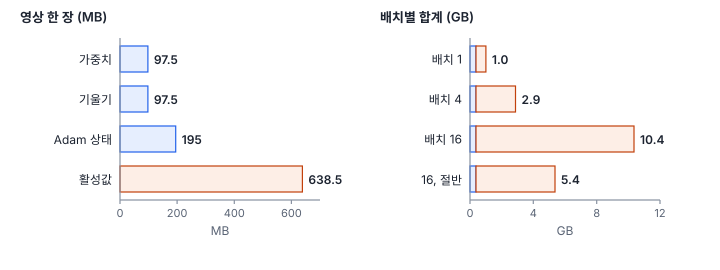
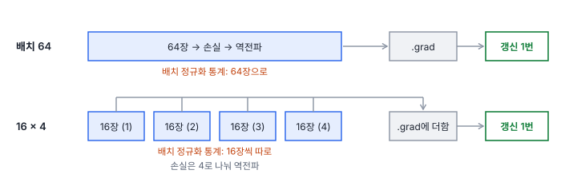
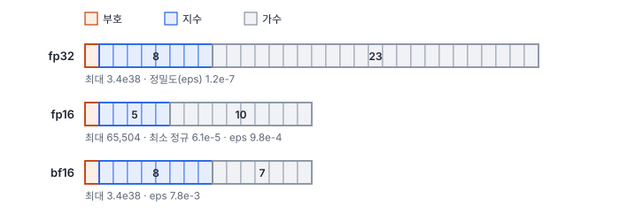

# 47강 배치와 GPU 자원

## 이 강에서 얻는 것

- 학습 중 GPU 메모리를 무엇이 차지하는지 어림하고, 메모리 부족(OOM)이 나면 어떤 순서로 손쓸지 정할 수 있음
- 배치 크기와 유효 배치 크기를 구별하고, 기울기 누적이 큰 배치와 같아지는 조건과 다른 조건을 설명할 수 있음
- fp16·bf16 혼합 정밀도의 차이와 손실 스케일링이 필요한 이유를 알고, 데이터로더·DDP 설정을 점검할 수 있음

## 1. 배치 크기와 GPU 메모리

**배치 크기(batch size)**는 모델에 한 번에 넣는 샘플 수임(28강의 미니배치). 배치를 키우면 기울기가 덜 흔들리지만 메모리가 그만큼 더 듦. 학습 중 GPU 메모리에는 네 가지가 올라감.

- **가중치**: 파라미터 하나가 fp32(32비트 실수)로 4바이트
- **기울기**: 파라미터마다 하나라 가중치와 같은 크기
- **옵티마이저 상태**: Adam은 파라미터마다 $m$, $s$ 두 개를 들고 있어(28강) 가중치의 두 배
- **활성값**: 역전파 때 미분에 쓰려고 저장해 두는 층별 출력. 배치 크기와 입력 화소 수에 비례함

앞의 셋은 모델이 정하면 고정이고, 마지막 하나가 배치와 입력 크기에 따라 커짐. ResNet-50(파라미터 2,556만, 31강)을 512×512 영상으로 학습한다고 어림한 값임(MB·GB는 $2^{20}$·$2^{30}$바이트 기준).



가중치 97.5 MB, 기울기 97.5 MB, Adam 상태 195 MB로 고정 몫은 모두 0.38 GB임. 활성값은 영상 한 장에 638.5 MB라서 배치 16이면 약 10 GB로, 고정 몫의 26배임. 같은 모델도 224×224면 한 장에 122 MB인데, 화소 수 비 $(512/224)^2 \approx 5.2$배만큼 차이 남.

이 활성값은 순전파 한 번에 나온 모든 말단 층 출력 크기를 더한 **어림**임. 역전파용으로 실제 저장되는 텐서와 같지 않고(제자리 연산 ReLU 등), 프레임워크 기본 몫·연산 작업 공간·할당기 캐시가 더해짐. 크기 수준과 "활성값이 가장 크다"는 결론만 믿고, 정확한 값은 GPU에서 한 반복을 돌려 최대 사용량을 잼.

## 2. 메모리 부족(OOM) 대응 순서

**메모리 부족(OOM, out of memory)**은 GPU 메모리가 모자라 학습이 멈추는 오류임. 활성값이 가장 크므로 활성값을 줄이는 쪽부터, 효과가 크고 결과를 덜 바꾸는 것부터 시도함.

1. **배치 줄이기**: 활성값이 배치에 비례하므로 16 → 8이면 합계가 10.4 → 5.4 GB로 줄어듦. 다만 배치 정규화가 흔들리고(29강) 학습률을 다시 맞춰야 함(46강)
2. **혼합 정밀도**: 활성값을 16비트로 저장해 대략 절반이 됨. 배치 16 그대로 5.4 GB(4절)
3. **기울기 누적**: 줄인 배치를 여러 번 모아 원래 배치 효과를 되살림(3절)
4. **입력 크기·모델 줄이기**: 512를 384로 자르면 화소가 0.56배라 활성값도 0.56배임. 대신 맥락이 줄어 타일 크기 결정(43강)과 함께 봄. 작은 백본은 성능이 떨어질 수 있음
5. **활성값 재계산(activation checkpointing)**: 일부 구간의 활성값을 버렸다가 역전파 때 그 구간의 순전파를 다시 해서 구함. 메모리를 계산 시간과 바꾸는 것이라 느려짐(`torch.utils.checkpoint.checkpoint`). 이름이 비슷한 모델 체크포인트 저장(49강)과는 무관함

학습 도중 메모리가 조금씩 늘다가 터지거나 검증 단계에서만 터지면 배치 문제가 아닐 수 있음. 손실을 `.item()` 없이 더해 계산 그래프를 붙잡고 있는지, 검증에 `torch.no_grad()`(29강)를 빠뜨렸는지 먼저 봄.

## 3. 유효 배치와 기울기 누적

**기울기 누적(gradient accumulation)**은 작은 배치로 여러 번 역전파해 기울기를 더한 뒤 한 번만 갱신하는 것임. `loss.backward()`가 기울기를 `.grad`에 더하는 성질(28강)을 일부러 쓰는 셈임. 한 번 갱신에 실제로 반영되는 샘플 수가 **유효 배치 크기(effective batch size)**임.

$$\text{유효 배치} = \text{GPU 하나의 배치} \times \text{누적 횟수} \times \text{GPU 수}$$

배치 16, 누적 4, GPU 2개면 유효 배치는 128임. 학습률과 스케줄은 유효 배치를 기준으로 정함(46강).



손실은 배치 안 평균이라 16장 손실을 그대로 네 번 더하면 64장 평균의 4배가 됨. 그래서 각 손실을 누적 횟수로 나눠 역전파함. 그런데 배치 정규화는 통계를 16장으로 따로 내므로 64장 한 번과 정확히 같지 않음. 27강의 5부 타일 64장으로 같은 초기 VD-CNN의 기울기를 두 방식으로 구해 비교하면, 배치 정규화는 두 기울기의 상대 차이(차이 벡터의 크기 ÷ 기울기 크기)가 0.186이고 그룹 정규화(29강)는 $1.3 \times 10^{-6}$으로 반올림 오차뿐임. 그룹 정규화는 샘플 하나 안에서 통계를 내서 샘플끼리 섞이지 않기 때문임.

10에폭 학습(Adam 0.001, 시드 0, 두 방식 모두 에폭당 66번 갱신)에서도 차이가 드러남.

| 설정 | 10에폭 학습 손실 | 검증 손실 최소 | 시험 best | 시험 last |
|---|---|---|---|---|
| 배치 정규화, 배치 64 | 0.135 | 0.144 | 0.933 | 0.962 |
| 배치 정규화, 16 × 4 누적 | 0.206 | 0.169 | 0.953 | 0.919 |
| 그룹 정규화, 배치 64 | 0.143 | 0.174 | 0.941 | 0.939 |
| 그룹 정규화, 16 × 4 누적 | 0.144 | 0.182 | 0.941 | 0.938 |

그룹 정규화는 두 학습 손실이 에폭마다 0.006 안쪽으로 거의 겹침(에폭 끝 자투리 배치 처리와 반올림 오차의 차이). 배치 정규화는 누적 쪽이 학습 손실이 더 높고 시험 정확도는 높기도 낮기도 함. 우열보다 "같은 학습이 아니다"가 요점이고, 러닝 통계도 16장 통계로 갱신됨.

## 4. 혼합 정밀도: fp16과 bf16

**혼합 정밀도 학습(mixed precision training, AMP)**은 가중치 원본은 fp32로 두고, 합성곱·행렬곱 같은 무거운 연산과 활성값은 16비트로 하는 방법임. 활성값 메모리가 대략 절반이 되고, 16비트 연산 장치(NVIDIA의 텐서 코어 등)가 있는 GPU에서는 계산도 빨라짐. 손실·합계처럼 정밀도에 민감한 연산은 도구가 fp32로 남겨 둠. 16비트 형식은 두 가지임.



- **fp16**: 지수가 5비트라 범위가 좁음. 가장 큰 수가 65,504이고, 정밀도가 온전한 가장 작은 수(최소 정규수)가 $6.1 \times 10^{-5}$임
- **bf16(bfloat16)**: 지수가 fp32와 같은 8비트라 범위가 fp32와 거의 같음(최대 $3.4 \times 10^{38}$). 대신 가수가 7비트라 정밀도는 fp16보다 낮음(eps $7.8 \times 10^{-3}$ 대 $9.8 \times 10^{-4}$)

기울기에는 아주 작은 값이 많아서 fp16의 좁은 범위가 문제가 됨.

| 원래 값 | fp16 | fp16, 1,024배 했다가 되돌림 | bf16 |
|---|---|---|---|
| $1 \times 10^{-8}$ | 0 | $1.001 \times 10^{-8}$ | $1.001 \times 10^{-8}$ |
| $1 \times 10^{-4}$ | $1.0002 \times 10^{-4}$ | $1.0002 \times 10^{-4}$ | $1.0014 \times 10^{-4}$ |
| 70,000 | 무한대 | 무한대 | 70,144 |

$10^{-8}$은 fp16에서 0이 되어 그 기울기가 사라짐. **손실 스케일링(loss scaling)**은 손실에 큰 배율을 곱해 역전파해 작은 기울기를 fp16 범위 안으로 끌어올리고, 갱신 전에 배율로 다시 나눔. 1,024배만 해도 $10^{-8}$이 살아남음. 대신 큰 값은 더 쉽게 무한대가 되므로, PyTorch `GradScaler`는 기울기에 무한대·NaN이 나오면 그 걸음을 건너뛰고 배율을 줄이며 한동안 문제가 없으면 다시 키움. bf16은 범위가 넓어 손실 스케일링이 대개 필요 없음. 유효 숫자는 거칠지만(70,000 → 70,144) 가중치 갱신은 fp32라 대개 지장이 없음.

PyTorch(2.14)로 fp16 혼합 정밀도와 기울기 누적을 함께 쓰면 다음과 같음.

```python
scaler = torch.amp.GradScaler("cuda")             # bf16이면 빼도 됨
for i, (x, y) in enumerate(loader):
    with torch.autocast("cuda", dtype=torch.float16):
        loss = F.cross_entropy(model(x), y) / accum   # 누적 횟수로 나눔
    scaler.scale(loss).backward()                  # 배율을 곱해 역전파, .grad에 더해짐
    if (i + 1) % accum == 0:
        scaler.step(optimizer); scaler.update(); optimizer.zero_grad()
```

bf16을 지원하는지는 GPU 세대에 따라 다름. NVIDIA는 암페어 세대(A100, RTX 30 시리즈)부터 지원함. `torch.cuda.is_bf16_supported(including_emulation=False)`로 확인하는데, 인자 없이 부르면 느린 흉내 실행까지 지원으로 쳐서 그 전 세대에서도 참이 나올 수 있음(2.14 기준). 이 강의 실행 환경에는 GPU가 없어 CPU에서 bf16 자동 혼합 정밀도로 VD-CNN을 30에폭 학습함. 시험 정확도 best는 fp32와 bf16 모두 0.974(27에폭)였고, 에폭별 학습 손실 차이는 0.001 미만이었음. 걸린 시간은 bf16 125.0초, fp32 112.6초로 CPU에서는 오히려 느렸음. CPU는 GPU와 성질이 달라 이 시간을 GPU 속도 비교로 쓰지 않음.

## 5. 데이터로더와 분산 학습

**데이터로더(data loader)**는 파일을 읽고 증강해 배치로 묶어 넘기는 부분임. 다음 배치가 늦으면 GPU가 기다림. PyTorch `DataLoader`의 주요 설정은 셋임.

- `num_workers`: 배치를 준비하는 별도 프로세스 수. 0이면 학습 프로세스가 직접 읽느라 그동안 GPU가 놂
- `prefetch_factor`: 작업자마다 미리 준비해 둘 배치 수(작업자가 있으면 기본 2)
- `pin_memory=True`: 배치를 고정 메모리(운영체제가 옮기지 않는 메모리)에 올려 GPU로의 복사를 빠르게 함. `.to("cuda", non_blocking=True)`와 함께 쓰면 복사와 계산이 겹침

디코딩 비용을 흉내 낸 타일 1,024개를 한 번 읽는 데 작업자 0·1·2개가 3.50·3.43·1.72초였음. 1개는 읽기를 다른 프로세스로 옮겼을 뿐 이 측정에는 겹쳐 할 계산이 없어 그대로이고, 2개는 2.0배 빨라짐. 실제 학습에서는 1개만으로도 읽기와 GPU 계산이 겹침. 이 환경은 CPU 코어가 2개라 더 늘려도 소용없고, 시간은 장비마다 다름. GPU가 데이터를 기다리는지는 GPU 사용률이 출렁이는지, 반복마다 "다음 배치를 받기까지 걸린 시간"이 계산 시간에 비해 큰지로 봄.

GPU가 여러 개면 **분산 데이터 병렬(DDP, distributed data parallel)**을 씀. GPU마다 프로세스를 띄워 모델을 통째로 복제하고, 자료는 겹치지 않게 나눠 줌(`DistributedSampler`). 역전파하면서 모든 GPU의 기울기를 평균 내어 모두에게 나눠 주는 통신(all-reduce)을 하므로 복제본들이 같은 걸음을 가서 같은 가중치를 유지하고, 유효 배치는 GPU 수만큼 커짐. 배치 정규화는 GPU마다 자기 배치로 통계를 내므로, GPU당 배치가 작으면 모든 GPU의 배치를 합쳐 통계를 내는 SyncBN으로 바꿈(`torch.nn.SyncBatchNorm.convert_sync_batchnorm(model)`).

## 현장에서는

0.5 m 항공 정사영상의 건물 분할 U-Net(ResNet-50 백본)을 512×512 타일, 배치 16으로 학습하려는데 첫 반복에서 메모리 부족이 나는 가상 상황임. 1절 어림으로도 백본 활성값만 10 GB 안팎이고 디코더 몫이 더해짐.

GPU가 bf16을 지원해 bf16 자동 혼합 정밀도를 켜니 배치 16 그대로 들어감. 그런데 GPU 사용률이 30~100%로 출렁임. GeoTIFF 타일 읽기와 회전 증강을 `num_workers=0`으로 학습 프로세스가 혼자 하고 있었음. 작업자를 늘리고 `pin_memory`를 켜자 사용률이 높게 유지됨. 나중에 GPU 2개로 DDP를 돌리면 유효 배치가 32가 되므로 학습률을 다시 정하고(46강), GPU당 배치를 더 줄일 때는 SyncBN을 검토함.

## 헷갈리는 쌍

- **배치 크기 vs 유효 배치 크기**: 배치 크기는 GPU 하나가 한 번에 넣는 샘플 수(메모리를 정함), 유효 배치는 갱신 한 번에 반영되는 샘플 수(학습률을 정함)임.
- **fp16 vs bf16**: 둘 다 16비트지만 fp16은 범위가 좁고 정밀도가 높아 손실 스케일링이 필요하고, bf16은 범위가 fp32만큼 넓고 정밀도가 낮아 대개 스케일링 없이 씀. bf16은 지원하는 GPU에서만 빠름.
- **기울기 누적 vs 큰 배치**: 샘플별로 독립인 모델(그룹·레이어 정규화)이면 기울기가 반올림 오차 안에서 같음. 배치 정규화가 있으면 통계를 작은 배치로 내므로 다른 학습이 됨.
- **DataParallel vs DistributedDataParallel**: `DataParallel`은 프로세스 하나가 매 반복 모델을 복제하고 출력을 첫 GPU에 모아 느리고 부하가 한쪽에 몰림. DDP는 GPU마다 프로세스를 두고 기울기만 평균하며, PyTorch는 컴퓨터 한 대에서도 DDP를 권장함.

## 이렇게 지시받음

> 지시: "OOM 나면 배치 반으로 줄이고 accum 2 걸어. 유효 배치는 그대로 가야 돼."

배치를 절반으로 줄여 활성값 메모리를 반으로 하고, 기울기 누적 2회로 갱신당 샘플 수를 원래대로 맞추라는 뜻임. 손실을 2로 나눴는지, 스케줄이 갱신 횟수 기준이면 걸음 수가 맞는지 확인함. 배치 정규화 모델이면 결과가 정확히 같지는 않음.

> 지시: "V100이라 bf16 안 돼. fp16 AMP로 가고 GradScaler 빼먹지 마."

V100(볼타 세대)은 bf16을 하드웨어로 지원하지 않으니 fp16 혼합 정밀도를 쓰되, 작은 기울기가 0으로 사라지지 않게 손실 스케일링을 꼭 넣으라는 뜻임. 초반 몇 걸음이 무한대로 건너뛰어지는 것은 배율을 맞추는 정상 과정이고, 계속 건너뛰면 손실이 발산하는지 봄.

> 지시: "GPU 사용률이 40%도 안 나와. 데이터로더부터 봐."

GPU가 계산보다 다음 배치를 기다리는 데 시간을 쓴다는 의심임. `num_workers`, `pin_memory`를 확인하고, 배치를 받는 시간과 계산 시간을 나눠 잼. 읽기·증강이 느리면 작업자를 CPU 코어 수 안에서 늘리거나 타일을 미리 잘라 두어 읽기를 가볍게 함.

## 요약

- 학습 메모리는 가중치·기울기·옵티마이저 상태(Adam은 파라미터당 2개)·활성값이고, 배치와 입력 크기에 비례하는 활성값이 가장 큼(ResNet-50·512×512·배치 16이면 약 10 GB 대 고정 몫 0.38 GB)
- OOM은 배치 줄이기 → 혼합 정밀도 → 기울기 누적 → 입력 크기·모델 줄이기 → 활성값 재계산 순으로 다룸
- 유효 배치 = 배치 × 누적 횟수 × GPU 수. 기울기 누적은 그룹 정규화에서는 큰 배치와 같았고(차이 $1.3 \times 10^{-6}$) 배치 정규화에서는 달랐음(0.186)
- fp16은 범위가 좁아 작은 기울기가 0이 되므로 손실 스케일링이 필요하고, bf16은 범위가 넓어 대개 필요 없음. CPU bf16 학습의 best 시험 정확도는 fp32와 같았음
- 데이터로더는 작업자·미리 불러오기·`pin_memory`로 GPU가 기다리지 않게 하고, DDP는 GPU마다 모델을 복제해 기울기를 평균하며 배치 정규화는 SyncBN으로 맞춤

## 핵심 용어

| 한글 | 영문 |
|---|---|
| 배치 크기 / 유효 배치 크기 | Batch Size / Effective Batch Size |
| 메모리 부족 | Out of Memory (OOM) |
| 활성값 재계산 | Activation Checkpointing |
| 기울기 누적 | Gradient Accumulation |
| 혼합 정밀도 학습 | Mixed Precision Training (AMP) |
| 손실 스케일링 | Loss Scaling |
| bfloat16 | bfloat16 (Brain Floating Point 16) |
| 데이터로더 | Data Loader |
| 분산 데이터 병렬 | Distributed Data Parallel (DDP) |
| 동기화 배치 정규화 | Synchronized Batch Normalization (SyncBN) |
