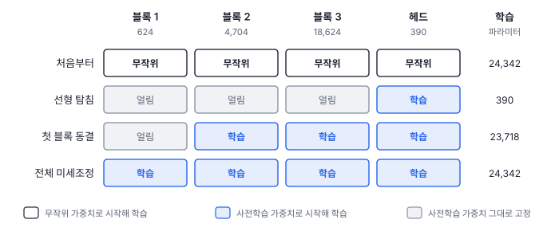
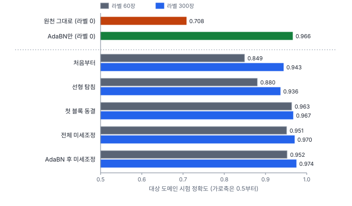
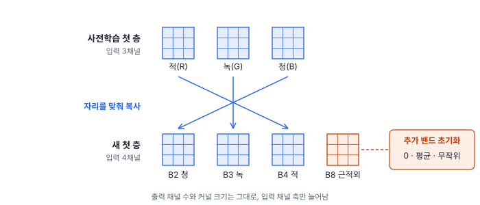

# 48강 전이학습과 기초모델

## 이 강에서 얻는 것

- 사전학습·미세조정·층 동결·선형 탐침이 각각 무엇을 얼리고 무엇을 학습하는지 알고, 라벨 수에 맞게 고를 수 있음
- 도메인 이동을 알아보고, 라벨 없이 배치 정규화 통계만 다시 재는 AdaBN과 미세조정 뒤 원래 도메인 성능이 떨어지는 원인을 가를 수 있음
- RGB 사전학습 가중치를 다중분광 입력에 옮기고, 원격탐사 기초모델을 쓰기 전에 확인할 것을 알 수 있음

## 1. 전이학습: 큰 자료로 배운 것을 옮김

**전이학습(transfer learning)**은 큰 자료로 배운 모델을 출발점 삼아 작은 자료의 과제를 푸는 것임. 먼저 큰 자료로 학습하는 단계가 **사전학습(pre-training)**이고(13강), 그 가중치에서 시작해 대상 자료로 이어 학습하는 것이 **미세조정(fine-tuning)**임. 배운 쪽을 **원천 도메인**, 옮겨 쓸 쪽을 **대상 도메인**이라 부름.

미세조정은 학습률을 작게 잡음. 이 강 실험은 처음부터 학습할 때(0.001)의 10분의 1인 0.0001을 썼음. 큰 학습률로 몇 걸음만 가도 사전학습으로 맞춰 둔 가중치가 흐트러지기 때문임.

**층 동결(layer freezing)**은 일부 층의 가중치를 고정해 학습하지 않는 것임(PyTorch에서는 그 파라미터의 `requires_grad`를 끔). 앞쪽 층은 가장자리·질감 같은 일반적인 무늬를 배워 자료가 바뀌어도 쓸모가 있고(31강), 뒤쪽 층일수록 원래 과제에 특화되므로 앞을 얼리고 뒤만 학습함. 다만 `requires_grad`를 꺼도 학습 모드에서는 배치 정규화의 러닝 통계가 계속 바뀜(29강).

**선형 탐침(linear probing)**은 특징 추출부를 통째로 얼리고 마지막 선형 층만 학습하는 극단적인 동결임. VD-CNN(27강)이면 24,342개 중 헤드의 390개만 학습함. 학습할 것이 적어 라벨이 적어도 버티고, 특징이 직선 경계로 갈릴 만큼 잘 정리되어 있는지를 재는 **표현 품질 측정**에도 씀(12·19강).



## 2. 도메인 이동

**도메인 이동(domain shift)**은 학습 자료와 실제로 쓰는 자료의 입력 분포가 다른 것임. 원격탐사에서는 촬영 조건(대기·태양 고도·관측각), 계절(식생 상태), 센서(밴드 응답·해상도), 지역(지붕 재료·작물)이 모두 원인이 됨.

45강의 연무·계절 시험을 대상 도메인 시험 자료로 씀. 5부 시험 타일 900장(27강)과 똑같은 타일에서 산림·농경지 화소의 근적외 반사를 22% 줄이고(다른 계절), 청·녹·적·근적외 반사율에 0.035·0.022·0.010·0.004를 더한(연무) 것임. 5부 학습 자료로 학습한 VD-CNN(best)은 원래 시험 0.974, 대상 시험 0.708임. 모델은 그대로인데 입력만 바뀌어 0.27이 떨어짐.

배치 정규화가 있는 모델에서는 이동이 표준화까지 어긋나게 함. 입력의 밴드 평균이 바뀌면 층 출력의 채널 평균도 바뀌는데, 추론 때 빼는 러닝 통계는 원천 도메인 값이라 표준화가 어긋남(29강).

## 3. AdaBN: 라벨 없이 통계만 다시 잼

**AdaBN**(적응형 배치 정규화, 리 등, 2016년 공개)은 가중치는 그대로 두고 러닝 통계만 대상 도메인 영상으로 다시 재는 방법임. 정답이 필요 없음.

```python
for mod in model.modules():
    if isinstance(mod, nn.BatchNorm2d):
        mod.reset_running_stats(); mod.momentum = None  # None이면 누적 평균
model.train()                      # 배치 통계로 러닝 통계를 갱신하는 모드
with torch.no_grad():              # 가중치는 건드리지 않음
    for x in target_loader:        # 라벨 없는 대상 영상
        model(x)
model.eval()
```

라벨 없는 대상 타일 60장으로 통계를 다시 재니 대상 시험이 0.708에서 0.966으로 올랐음(600장도 0.966). 대신 원래 시험은 0.721로 떨어짐. 통계가 대상 쪽으로 옮겨 가 이번에는 원래 자료와 어긋난 것임. 두 도메인을 다 쓰면 통계를 도메인별로 저장해 골라 씀.

이 자료의 이동은 밴드마다 값을 더하거나(연무) 식생 화소의 근적외에 곱하는(계절) 식으로 만든 것이라, 채널 평균·분산을 맞추는 것만으로 대부분 풀린 것으로 보임. 지붕 재료나 작물이 다른 지역처럼 무늬 자체가 바뀌는 이동은 통계만으로 풀리기 어려움. 통계를 잴 영상은 여러 클래스가 섞이게 뽑음. 바다 타일만 넣으면 "바다의 평균"이 기준이 됨(29강).

## 4. 라벨 수와 방법

라벨 있는 대상 타일 60장·300장(클래스마다 같은 수)으로 방법을 비교했음. 배치 32, 60장은 60에폭·300장은 40에폭이고, 학습률은 미세조정 두 가지만 0.0001, 나머지(처음부터·선형 탐침·첫 블록 동결)는 0.001임. 모델은 라벨 있는 대상 검증 150장의 손실이 가장 낮은 에폭으로 골랐음(시드 0, CPU 한 스레드 기준).

| 방법 | 학습 파라미터 | 대상 60장 | 원래 60장 | 대상 300장 | 원래 300장 |
|---|---|---|---|---|---|
| 처음부터 | 24,342 | 0.849 | 0.609 | 0.943 | 0.709 |
| 선형 탐침 | 390 | 0.880 | 0.944 | 0.936 | 0.929 |
| 첫 블록 동결 | 23,718 | 0.963 | 0.721 | 0.967 | 0.742 |
| 전체 미세조정 | 24,342 | 0.951 | 0.727 | 0.970 | 0.713 |
| AdaBN 후 미세조정 | 24,342 | 0.952 | 0.734 | 0.974 | 0.706 |

"대상"은 대상 시험, "원래"는 원래 시험 정확도임.



- **라벨 60장에서는 사전학습에서 출발한 쪽이 모두 처음부터(0.849)보다 높음.** 선형 탐침(0.880)은 전체 미세조정보다 7%p 낮았음. 특징 추출부가 원천 통계로 고정되어, 어긋난 특징을 선형 층 하나로 바로잡기 어려웠던 것으로 보임
- **라벨 300장이면 처음부터(0.943)가 따라옴.** 선형 탐침(0.936)보다도 높음. 라벨이 늘수록 사전학습의 몫이 줄어듦. 미세조정은 0.970
- **AdaBN만(라벨 0, 0.966)이 라벨 60장 미세조정(0.951)보다 높았음.** 라벨을 모으기 전에 AdaBN부터 해 볼 가치가 있음. 다만 미세조정 쪽은 모델을 고를 검증 150장에도 라벨이 들었음
- 첫 블록 동결과 전체 미세조정의 0.01 안팎 차이는 학습률도 다르고 시드 하나의 결과라 동결의 효과로 읽지 않음(49강)

## 5. 미세조정 뒤의 망각

미세조정한 모델은 원래 시험이 0.71~0.74로 떨어졌음. 새 도메인에 맞추다 원래 도메인 성능을 잃는 것을 **망각**(파국적 망각, catastrophic forgetting)이라 부름. 선형 탐침은 0.944(60장)·0.929(300장)로 덜 떨어졌는데, 특징 추출부는 그대로 두고 헤드만 바꿨기 때문임.

원인을 갈라 봄. 전체 미세조정한 모델에서 러닝 통계만 원천 모델 것으로 되돌리니 원래 시험이 0.966(60장)·0.973(300장)으로 돌아왔고, 대상 시험은 0.800·0.739로 떨어졌음. 이 실험의 망각은 거의 전부 러닝 통계가 대상 쪽으로 옮겨 간 몫이었음. 학습 모드로 미세조정하면 러닝 통계도 갱신되기 때문임. 300장은 3에폭 모델이 뽑혀 가중치가 거의 바뀌지 않았음(원천 대비 상대 변화 1% 미만). 더 크게·오래 미세조정하면 가중치 자체가 멀어지는 망각도 생김.

두 도메인을 다 써야 하면 원천 자료를 섞어 미세조정하거나, 도메인별 통계·모델을 따로 두고, 원래 시험도 함께 보고함.

## 6. 다중분광 입력 처리

ImageNet 사전학습 가중치는 첫 합성곱이 RGB 3채널용임(31강). B2·B3·B4·B8 네 밴드를 넣으려면 첫 층을 4채널로 새로 만들고, RGB 가중치를 해당 밴드 자리에 복사한 뒤 추가 밴드 자리를 채움. 채우는 법은 0, RGB 가중치의 평균, 작은 무작위 값이 흔함. 0이면 처음에는 RGB 모델과 출력이 같아 안전하게 출발함. timm(1.0.30에서 확인)의 `adapt_input_conv`는 RGB 가중치를 되풀이해 채운 뒤 $3/C$배($C$는 입력 채널 수)로 줄여 활성값 크기를 맞춤.



맞출 것이 둘 더 있음. **밴드 순서**: B4(적)에 R, B3(녹)에 G, B2(청)에 B 가중치를 넣음. **표준화 통계**: torchvision의 ImageNet 가중치는 0~1로 바꾼 RGB를 평균 (0.485, 0.456, 0.406), 표준편차 (0.229, 0.224, 0.225)로 표준화해 학습했음. 반사율은 범위가 달라, 사전학습 통계를 따를지 대상 자료 통계로 다시 잴지 정하고 학습·추론에 같은 것을 씀(10강).

원천 도메인에서 B2·B3·B4만으로 VD-CNN을 사전학습(원래 시험 0.941)한 뒤 4채널로 옮겨 대상 300장으로 미세조정했음(학습률 0.0003, 40에폭). 대상 시험 정확도는 근적외 초기화 0이 0.943, 평균 0.941, 무작위 0.948, 처음부터 4채널 학습(4절과 같은 실행)이 0.943으로 **뚜렷한 차이가 없었음**. 이 모델은 첫 층 가중치가 576개뿐이고 300장으로도 처음부터 0.943에 이르러 출발점의 몫이 작았던 것으로 보임. 식생·수계를 가르는 데 중요한 근적외를 사전학습이 보지 못해 뒤쪽 층도 새로 배워야 했던 것도 이유일 수 있음(따로 확인하지 않음). 일반적으로는 모델이 크고 라벨이 적을수록 처음부터 학습이 어려워, 사전학습 가중치를 덜 흐트러뜨리는 출발이 중요해짐.

## 7. 원격탐사 기초모델

**기초모델(foundation model)**은 대규모 자료로 사전학습해 여러 과제에 미세조정·선형 탐침으로 옮겨 쓰는 큰 모델임. 원격탐사에서는 라벨 없는 위성영상을 대량으로 써서 가린 패치를 복원하거나(마스크 오토인코더, MAE) 같은 장소의 다른 시기 영상을 같은 것으로 알아보게 하는(대조 학습) 자기지도 사전학습(13강)이 많음.

| 이름 | 공개 | 사전학습 자료 | 입력 |
|---|---|---|---|
| SatMAE (콩 등) | 2022 | fMoW(시설 용도 분류용 위성영상) RGB, Sentinel-2판(fMoW-Sentinel) | 밴드 묶음별 인코딩, 촬영 시기 임베딩(ViT) |
| SSL4EO-S12 (왕 등) | 2022 | 전 세계 251,079곳, 계절 4번 | Sentinel-2 L1C 13밴드·L2A 12밴드, Sentinel-1 VV·VH 편파. ResNet·ViT 가중치 |
| Prithvi-EO-1.0 / 2.0 (NASA·IBM) | 2023 / 2024 | HLS(Landsat·Sentinel-2 조화 자료) 30 m. 1.0은 미국 본토, 2.0은 전 세계 420만 시계열 표본 | 청·녹·적·근적외·단파적외 2개, 6밴드 |

쓰기 전에 확인할 것은 **센서와 처리 수준**(L1C 대기 상단 반사율인지 L2A 지표 반사율인지), **밴드 구성·순서**, **해상도**(30 m로 배운 모델에 0.5 m 영상을 넣으면 무늬의 크기가 전혀 다름), **표준화 통계·입력 크기**, **라이선스**(가중치와 사전학습 자료 각각, 상업적 사용 가능 여부. Prithvi는 모델 카드에 아파치 2.0으로 적혀 있음)임. 크기가 큰 만큼 추론 비용도 큼(50강). 고른 뒤에는 작은 CNN 기준선과 같은 분할에서 선형 탐침과 미세조정으로 비교함.

## 현장에서는

봄 영상으로 학습한 토지피복 분류기를 가을의 옅은 연무 낀 장면에 쓰니 검수 표본 정확도가 크게 떨어진 상황임. 먼저 대상 장면 타일로 AdaBN을 하고 검수 표본으로 확인함. 부족하면 대상 라벨을 장면 단위로 떼어(43강) 수십~수백 장 모으고, 작은 학습률로 미세조정함. 봄 장면에도 계속 쓸 모델이면 원래 시험을 함께 보고 통계를 계절별로 저장함. 교란 종류별 진단은 57강, 다른 센서를 섞는 문제는 58강에서 다룸.

## 헷갈리는 쌍

- **사전학습 vs 미세조정**: 사전학습은 큰 자료로 일반적 특징을 배우는 앞 단계, 미세조정은 그 가중치에서 시작해 대상 자료로 작은 학습률로 이어 학습하는 뒤 단계임.
- **선형 탐침 vs 층 동결**: 선형 탐침은 특징 추출부 전체를 얼리고 마지막 선형 층만 학습함. 층 동결은 얼리는 범위를 정할 수 있고 보통 앞쪽 일부만 얼림.
- **도메인 이동 vs 과적합**: 과적합은 같은 분포의 새 자료에서도 떨어짐(14강). 도메인 이동은 같은 분포에서는 잘 맞는데(0.974) 분포가 바뀐 자료에서 떨어짐(0.708).
- **AdaBN vs 미세조정**: AdaBN은 라벨 없이 러닝 통계만 바꾸고, 미세조정은 라벨로 가중치를 바꿈.

## 이렇게 지시받음

> 지시: "새 지역 영상에서 정확도 떨어지면 라벨 따기 전에 BN 통계부터 다시 잡아 봐."

도메인 이동이 밴드 밝기 차이 정도라면 AdaBN만으로 상당 부분 회복되는지 보라는 뜻임. 대상 영상을 클래스가 섞이게 뽑아 러닝 통계를 다시 재고, 원천 통계는 따로 저장해 둠. 소량 검수 표본으로 효과를 확인함.

> 지시: "백본은 얼리고 헤드만 돌려서 표현이 쓸 만한지부터 봐."

선형 탐침으로 백본 특징의 품질을 재라는 뜻임. 백본은 추론 모드로 고정하고, 다른 백본과 같은 분할·같은 학습 설정에서 비교함. 점수가 낮으면 백본이 나쁜 것인지 도메인 이동 때문인지 AdaBN이나 미세조정 결과와 함께 봄.

> 지시: "Prithvi 가중치 쓰려면 밴드 순서랑 표준화 값부터 맞춰. 라이선스도 확인하고."

6밴드 HLS 30 m로 배운 모델이므로 같은 순서로 밴드를 고르고, 모델이 쓴 표준화 통계와 입력 크기를 따름. 가진 밴드가 다르면 첫 층을 바꾸는 6절의 방법이 필요함. 납품물에 쓸 수 있는지 라이선스를 적어 둠.

## 요약

- 전이학습은 사전학습 가중치에서 출발해 대상 자료로 미세조정함. 학습률을 작게 잡고, 앞쪽 층을 얼리거나 선형 탐침으로 헤드만 학습할 수 있음
- 연무·계절 이동으로 VD-CNN은 0.974에서 0.708로 떨어졌고, 라벨 없는 AdaBN만으로 0.966을 회복했음
- 라벨 60장에서는 사전학습에서 출발한 방법이 처음부터(0.849)보다 모두 나았고, 300장에서는 처음부터(0.943)가 따라왔음
- 미세조정 뒤 원래 시험은 0.71~0.74로 떨어졌고, 이 실험에서는 러닝 통계를 되돌리면 0.97 안팎으로 돌아왔음
- RGB 가중치를 다중분광에 쓸 때는 첫 층을 늘리고 밴드 순서·표준화 통계를 맞춤. 기초모델은 센서·밴드·해상도·라이선스를 확인하고 기준선과 비교함

## 핵심 용어

| 한글 | 영문 |
|---|---|
| 전이학습 | Transfer Learning |
| 사전학습 | Pre-training |
| 미세조정 | Fine-tuning |
| 층 동결 | Layer Freezing |
| 선형 탐침 | Linear Probing |
| 원천 도메인 / 대상 도메인 | Source Domain / Target Domain |
| 도메인 이동(도메인 차이) | Domain Shift |
| 적응형 배치 정규화 | Adaptive Batch Normalization (AdaBN) |
| 파국적 망각 | Catastrophic Forgetting |
| 기초모델(파운데이션 모델) | Foundation Model |
