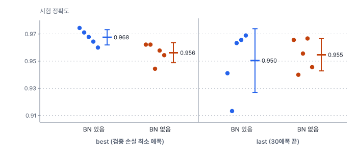
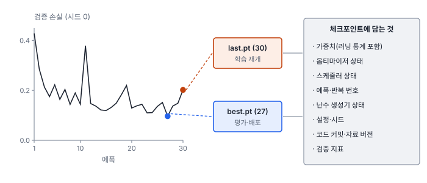

# 49강 실험 관리와 재현성

## 이 강에서 얻는 것

- 랜덤 시드가 정하는 것과, 시드를 고정해도 결과가 달라지는 이유(GPU 비결정성, 스레드 수, 라이브러리 버전)를 설명할 수 있음
- 두 설정을 시드 여럿의 평균±표준편차로 비교하고, 차이가 시드 변동보다 큰지 판단할 수 있음
- 체크포인트에 담을 것, 실험 기록에 남길 것을 정하고 절제 실험을 설계할 수 있음

## 1. 시드가 정하는 것

**랜덤 시드(random seed)**는 의사난수 생성기(정해진 계산으로 난수처럼 보이는 수열을 만드는 장치)의 시작값임. 학습에서 시드가 정하는 것은 넷임.

- **초기 가중치**: 층마다 무작위로 뽑는 시작값(28강)
- **자료 섞는 순서**: 에폭마다 어떤 타일끼리 미니배치를 이루는지
- **증강**: 뒤집을지, 몇 도 돌릴지, 밝기를 얼마나 바꿀지(45강)
- **드롭아웃**: 매 반복 끄는 유닛(29강)

파이썬·NumPy·PyTorch는 생성기를 따로 가지므로 모두 고정함.

```python
import random, numpy as np, torch
random.seed(0); np.random.seed(0)
torch.manual_seed(0)                       # CPU·GPU 생성기 모두
torch.use_deterministic_algorithms(True)   # 비결정 연산을 막음(2절)
torch.backends.cudnn.benchmark = False     # GPU 합성곱 알고리즘 자동 선택 끔
```

`cudnn.benchmark`를 켜면 GPU가 합성곱 알고리즘 몇 개를 재 보고 가장 빠른 것을 고르는데, 고르는 결과가 실행마다 달라질 수 있어 끔. 데이터로더 작업자(47강)는 주 프로세스 난수로 뽑은 기본 시드에 작업자 번호를 더해 파이썬·PyTorch 난수를 고정하고 NumPy도 이 값에서 시드를 받음(PyTorch 2.14 기준). `DataLoader`에 `generator`를 넘기면 섞는 순서와 이 기본 시드가 모두 그 생성기에서 나와, 다른 곳에서 난수를 얼마나 썼는지와 상관없이 고정됨. 그 밖의 라이브러리 난수는 `worker_init_fn`에서 따로 고정함.

7부 학습 루프로 VD-CNN(27강)을 시드 0으로 두 번 학습하면 세 에폭의 학습 손실이 0.741, 0.3437, 0.2599로 두 번 모두 같고, 2에폭 뒤 가중치와 러닝 통계도 비트 단위까지 같음. 시드 1이면 첫 에폭부터 0.7485로 다름(CPU 한 스레드, PyTorch 2.14).

## 2. 재현성과 결정성

**재현성(reproducibility)**은 같은 코드·자료·시드·환경으로 다시 돌렸을 때 같은 결과(또는 허용 오차 안의 결과)를 얻는 성질임. 시드만으로는 부족함.

**GPU 비결정성**: GPU의 일부 연산은 수천 개 스레드가 한 메모리 칸에 동시에 값을 더하는 **원자적 덧셈(atomic add)**을 쓰는데, 더하는 순서가 실행마다 다름. 부동소수 덧셈은 순서에 따라 결과가 달라짐. float32에서 $(10^8 + 1) - 10^8 = 0$이지만 $(10^8 - 10^8) + 1 = 1$임. 작은 차이도 수천 걸음을 거치며 커질 수 있음.

**결정적 알고리즘**: `torch.use_deterministic_algorithms(True)`는 결정적 구현이 있으면 그것을 쓰고, 비결정 구현뿐인 연산은 `RuntimeError`로 알림. PyTorch 2.14 문서 기준으로 분할 모델(33강)에서 흔히 쓰는 쌍선형 업샘플링(`interpolate`)을 CUDA에서 역전파하면 이 오류가 남. `warn_only=True`로 경고만 받을 수도 있음. 결정적 구현은 대개 더 느림.

**스레드 수·라이브러리 버전**: CPU도 스레드 수가 바뀌면 덧셈을 나누는 방식이 바뀜. 512×4,096과 4,096×512 행렬곱을 1스레드와 2스레드로 하면 값(표준편차 약 64)이 최대 0.00013 다름. PyTorch 문서도 버전·플랫폼·CPU와 GPU 사이의 재현은 보장하지 않는다고 밝힘. 그래서 7부 수치는 "CPU 한 스레드, PyTorch 2.14"로 환경을 함께 적음. 환경이 다르면 같은 시드라도 수치가 달라질 수 있고, 작은 차이가 학습 중에 커지면 시드를 바꾼 만큼(3절) 달라질 수도 있음.

결국 재현성은 두 층으로 생각함. 같은 장비·환경에서는 비트 단위로 같은 결과를 목표로 하고, 환경이 바뀌면 숫자 대신 결론(어느 설정이 시드 변동보다 확실히 나은가)이 같은지를 봄. 뒤쪽을 보장하는 것이 3절의 시드 여러 개임.

## 3. 시드 하나로 비교하지 않음

시드를 고정하면 같은 결과를 다시 만들 수 있을 뿐, 그 결과가 대표값이라는 보장은 없음. 같은 VD-CNN 설정을 시드 0~4로 학습하고, 배치 정규화(29강)를 뺀 모델도 같은 시드로 학습함. 학습 자료는 같고 시드만 바꿈. 증강·드롭아웃이 없으므로 시드가 정하는 것은 초기 가중치와 섞는 순서뿐임. 시험 타일 900장의 정확도임.

| 시드 | BN 있음 best (에폭) | BN 있음 last | BN 없음 best (에폭) | BN 없음 last |
|---|---|---|---|---|
| 0 | 0.974 (27) | 0.941 | 0.962 (29) | 0.966 |
| 1 | 0.971 (20) | 0.913 | 0.962 (29) | 0.940 |
| 2 | 0.968 (22) | 0.963 | 0.944 (28) | 0.956 |
| 3 | 0.964 (28) | 0.966 | 0.958 (25) | 0.967 |
| 4 | 0.960 (27) | 0.969 | 0.954 (29) | 0.946 |
| 평균±표준편차 | 0.968±0.006 | 0.950±0.023 | 0.956±0.007 | 0.955±0.012 |

시드 0 결과는 5부 기본 학습(28강)과 같음.



**last는 시드에 크게 흔들림.** Adam 학습률을 0.001로 고정해 끝까지 보폭이 줄지 않으므로, 30에폭째가 골짜기 바닥에 있을지는 운에 가까움(46강). 시드 0의 last만 보면 BN 없음이 0.966으로 BN 있음(0.941)보다 0.025 높아 "배치 정규화를 빼니 좋아졌다"는 엉뚱한 결론이 나옴. 다섯 시드 평균으로도 last끼리는 차이가 −0.004로 방향조차 정해지지 않음.

**best끼리는 배치 정규화가 평균 0.011 높음**(약 10장). 그런데 시드 번호가 같은 짝끼리의 차이는 0.006~0.023이라, 어느 시드 하나를 봤느냐에 따라 효과를 반 또는 두 배로 잘못 읽게 됨. 그래서 차이를 시드 표준편차(0.006~0.007)와 견줌. 두 묶음을 독립으로 보고 웰치 t검정(4강)을 하면 다음과 같음.

$$t = \frac{\bar{a} - \bar{b}}{\sqrt{s_a^2/n_a + s_b^2/n_b}} = \frac{0.0113}{0.0041} \approx 2.74$$

평균 차이를 두 평균의 표준오차로 나눈 값임. p는 약 0.027, 차이의 95% 신뢰구간은 0.002~0.021임. 이 실험은 시드 번호가 같으면 두 모델의 합성곱·선형 층 초기 가중치와 섞는 순서가 같아 짝으로 볼 수도 있는데, 대응표본 t검정으로 해도 $t \approx 3.52$, $p \approx 0.024$로 결론이 같음. 유의하지만 하한이 0에 가깝고, 참 효과가 관측값만 하다고 해도 시드 다섯 개로는 두 표본 t검정의 검정력이 약 0.67이라 놓칠 확률이 1/3쯤 됨. 보고할 때는 "0.968±0.006(시드 5개)"처럼 시드 수를 함께 적음.

시드는 하이퍼파라미터가 아님. 여러 시드 중 가장 좋은 것만 골라 보고하면 4강의 p-해킹과 같고, 시드 목록은 실험 전에 정해 둠.

## 4. 체크포인트와 조기 종료

**체크포인트(checkpoint)**는 학습 중 한 시점의 상태를 저장한 파일임. 가중치만 저장하면 끊긴 곳에서 그대로 이어 갈 수 없음. Adam의 기울기 이동 평균(28강)이 0에서 다시 쌓이고 스케줄러는 처음 학습률로 돌아가기 때문임.



best와 last를 둘 다 둠. best는 검증 손실이 가장 낮았던 에폭(이 실험은 27)이고, last는 마지막 에폭(30)임. 앞의 표처럼 best가 시드에 덜 흔들리고, last는 재개에 필요함. 보통 last는 에폭마다 덮어쓰고 best는 검증 지표가 나아질 때만 덮어씀. 가중치는 모델 객체 통째가 아니라 `state_dict`로 저장하는 편이 코드가 바뀌어도 불러오기 쉬움. 재개한 학습을 끊기지 않은 학습과 똑같이 만들려면 난수 생성기 상태도 되살려야 섞는 순서가 이어짐.

**조기 종료(early stopping)**는 검증 지표가 **참을성(patience)**만큼의 에폭 동안 나아지지 않으면 멈추고 best를 쓰는 것임(29강). 기준 지표와 참을성을 실험 기록에 남겨야 같은 체크포인트를 다시 고를 수 있음. BN 없는 모델의 best 에폭이 25~29로 끝에 몰린 것은 30에폭 안에서 아직 나아지고 있었다는 신호이고, 이것은 6절 해석에 영향을 줌.

## 5. 실험 추적

**실험 추적(experiment tracking)**은 실행마다 아래 항목을 한곳에 남겨 비교·재현하는 일임.

| 항목 | 예 |
|---|---|
| 설정 | 학습률·배치·에폭·증강·스케줄 전체(설정 파일 통째로) |
| 코드 버전 | git 커밋 해시, 커밋 안 된 변경 여부 |
| 자료 버전 | 분할 목록 파일과 해시(43강), 라벨 버전(44강) |
| 시드·환경 | 시드, PyTorch 버전, GPU/CPU, 스레드 수 |
| 결과 | 지표, 학습 곡선, 체크포인트 경로 |

도구로는 MLflow, Weights & Biases, TensorBoard(주로 곡선 시각화)가 있고, 작은 팀은 표 하나로도 충분함. 핵심은 모든 실행을, 실패한 것까지 남기는 것임(4강 p-해킹).

## 6. 절제 실험

**절제 실험(ablation study)**은 구성 요소를 하나씩 빼고 나머지를 고정해 그 요소의 기여를 재는 실험임. 3절의 배치 정규화 제거가 그 예임. 판단 기준은 차이가 시드 변동보다 큰지임. best 기준 기여는 0.011(신뢰구간 0.002~0.021)로 작지만, 연무·계절 시험(48강)에서는 0.771±0.047 대 0.643±0.056으로 0.128 차이가 남(웰치 p 약 0.005). 기여는 어떤 시험으로 재느냐에 따라 크게 다름.

결론은 조건에 묶임. BN 없는 모델은 30에폭 안에서 아직 나아지고 있었을 수 있으므로 "같은 30에폭 예산에서"라는 단서를 붙임. 요소를 여러 개 동시에 빼면 어느 것의 기여인지 가릴 수 없고, 절제 항목이 많으면 다중비교(4강)도 따짐.

## 현장에서는

작년에 만든 양식장 분할 모델을 새 영상으로 갱신하려고 같은 설정으로 다시 학습했는데 검증 mIoU가 보고값보다 0.02 낮게 나온 가상 상황임. 기록에 남은 것은 설정 파일과 최종 가중치뿐임.

원인 후보는 셋임. 분할 목록이 없어 검증 장면 구성이 달라졌을 수 있고, 커밋하지 않은 전처리 수정이 빠졌을 수 있고, 라이브러리 버전이 바뀌었을 수 있음. 게다가 보고값이 시드 하나였다면 0.02가 시드 변동 안일 수도 있음. 기존 설정을 시드 셋 이상으로 다시 돌려 시드 표준편차를 구하고, 이번부터 5절 표의 항목을 모두 남기고 체크포인트에 커밋 해시와 분할 목록 해시를 넣음.

## 헷갈리는 쌍

- **재현성 vs 일반화**: 재현성은 같은 조건에서 같은 결과가 다시 나오는 성질이고, 일반화는 새 자료에서도 성능이 유지되는 성질임(14강). 완벽히 재현되는 모델도 일반화는 나쁠 수 있음.
- **시드 변동 vs 실제 개선**: 시드만 바꿔도 BN 있음의 last는 0.913~0.969로 움직임. 시드 여럿의 평균 차이가 시드 표준편차보다 충분히 커야 개선으로 봄.
- **best 체크포인트 vs last 체크포인트**: best는 검증 지표가 가장 좋았던 시점으로 평가·배포에 쓰고, last는 마지막 시점으로 학습 재개에 씀. 둘의 시험 점수는 다를 수 있음.
- **절제 실험 vs 하이퍼파라미터 탐색**: 절제는 구성 요소를 빼서 기여를 재고, 하이퍼파라미터 탐색은 값을 바꿔 가장 좋은 설정을 찾음. 탐색으로 고른 값의 점수는 낙관적이므로 시험 세트로 따로 확인함(15강).

## 이렇게 지시받음

> 지시: "증강 바꾼 거 시드 하나로 0.01 올랐다고 하지 말고, 시드 다섯 개씩 돌려서 평균±표준편차로 붙여."

0.01이 시드 변동 안일 수 있다는 뜻임. 두 설정을 같은 시드 목록으로 돌려 평균±표준편차를 내고, 차이를 시드 표준편차와 견줌. 필요하면 웰치 t검정과 신뢰구간을 붙이되, 다섯 개로는 검정력이 약하다는 점을 함께 적음.

> 지시: "체크포인트 last도 남기고, 옵티마이저랑 스케줄러 상태 꼭 넣어. 중간에 끊겨도 이어서 돌리게."

학습 재개용 체크포인트를 만들라는 뜻임. 가중치만 있으면 Adam 이동 평균과 학습률 일정이 처음으로 돌아가 이어 돌린 학습이 원래 학습과 달라짐. 에폭 번호와 난수 상태도 함께 저장함.

> 지시: "결정적 모드 켜니까 `interpolate`에서 에러 나. `warn_only`로 돌리고 기록에 남겨."

쌍선형 업샘플링의 CUDA 역전파에 결정적 구현이 없어서 생긴 오류임. 경고만 받고 진행하면 그 연산은 실행마다 조금 다를 수 있으므로, 실험 기록에 "완전 결정적 아님"을 적고 비교는 시드 여럿의 평균으로 함.

## 요약

- 랜덤 시드는 초기 가중치, 자료 섞는 순서, 증강, 드롭아웃을 정하며 파이썬·NumPy·PyTorch를 모두 고정함
- 재현성에는 시드 말고도 결정적 알고리즘 설정, GPU 원자적 덧셈, 스레드 수, 라이브러리 버전이 걸리므로 환경을 함께 기록함
- 비교는 시드 여럿의 평균±표준편차로 함. VD-CNN의 last는 시드에 따라 0.913~0.969로 흔들려 시드 하나로는 결론이 뒤집힘
- 체크포인트에는 가중치·옵티마이저·스케줄러·에폭·난수 상태·설정을 담고, best(평가·배포)와 last(재개)를 둘 다 둠
- 실험 추적으로 설정·코드 커밋·자료 버전·결과를 한곳에 남기고, 절제 실험의 차이는 시드 변동과 견주며 조건(학습 예산, 시험 자료)을 밝힘

## 핵심 용어

| 한글 | 영문 |
|---|---|
| 랜덤 시드 | Random Seed |
| 재현성 | Reproducibility |
| 결정적 알고리즘 | Deterministic Algorithm |
| 원자적 덧셈 | Atomic Add |
| 체크포인트 | Checkpoint |
| 조기 종료 / 참을성 | Early Stopping / Patience |
| 실험 추적 | Experiment Tracking |
| 절제 실험 | Ablation Study |
